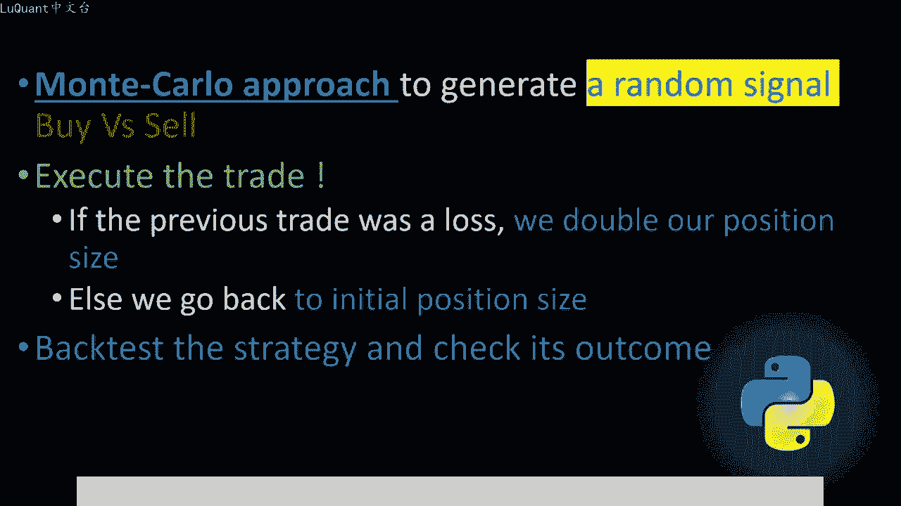
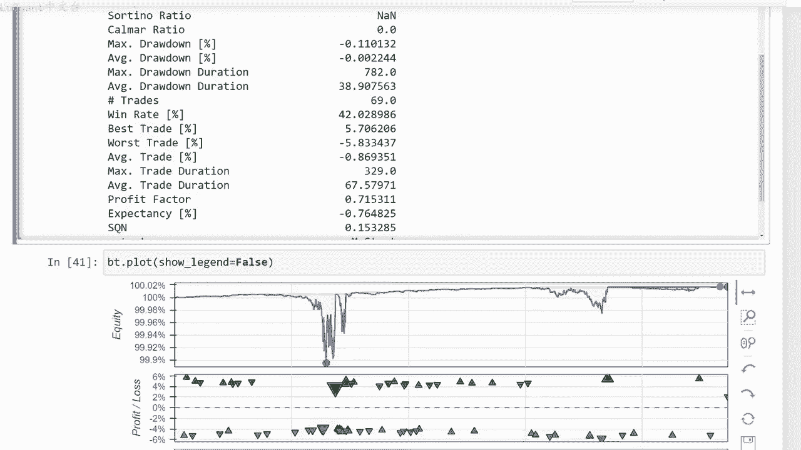

# python量化49：Martingale - P1 - LuQuant - BV1xF4m1F79T

大家好，今天我们讨论的是可以包含在任何交易策略中以弥补交易损失的央方法。我们将使用python回溯测试该方法，并讨论当您决定使用央时所涉及的优势和风险想象一下。

口袋里有20美元进入一家赌场，我们决定只对颜色进行轮盘竞价。因此，我们每次对红色或黑色两种颜色中的一种竞价1美元。所以首先我们对红色事实证。这是一笔亏损的交易。所以现在我们损失了1美元。

钱包里只剩下19美元，然后我们决定进行第二次赌注。但这次我们将加倍堵注。因为上一次我们赌输了，所以在这种情况。我们要花2美元上床，红色的颜色相同，我们又输了2美元。所以现在我们口袋里只剩下17美元。

然后我们再次加倍赌注。因为我们刚刚输了2美元，我们花4美。钱包里只剩下13美元，以此类推，最终在某个时刻，我们将在这一系列连败中至少赢一次。当这种情况发生时，我们将赢得的总和弥补之前的所有损失。并。

我们的总和中添加一小部分盈利，因此在本例中，我们最终总共获得21美元。因此这比我们在初始头寸中开始时的金额要多一点。这种方法意味着将盈利翻倍，每次我们有亏损。交易时就吓注，这种方法最初被称为央法。

这种方法看起来并没有那么糟糕。事实上，他看起来非常有前途。当我在早期交易日发现这一点时，我认为它会带来丰厚的收入，但这是事实的一个方面。😡，很想更好的了解这种方法，以及他给我们的交易策略带来的风险。

因此，为了测试这种方法，我们将首先使用以下算法蒙特卡罗方法，这只是数学中用来描述任何使用随机数的方法的奇特名称。因。

我们将生成随机信号来决定它是卖出还是获胜头寸，只是一个纯粹的随机信号，而不是基于任何技术指标或任何自定义预测，它只是一个纯粹的桶。随机信号，那么我们将根据生成的信号执行我们的交易。如果它是一个买入信号。

我们将执行买入头寸，反之亦然。但信号的大小交易将取决于前一笔交易的状态。因此，如果前一。平仓交易是亏损的，我们将把当前头寸的规模加倍，只是为了使用央方法。正如我们在上一张幻灯片中所描述的那样。

否则如果我们有对于获胜头寸，我们将简单的使用初始头。大小就好像这是我们当天的第一笔交易一样。因此，我们将在pyython中构建此算法，并回测我们的策略。在本例中仅依赖央方法来查看。

如果这会给我们的交易系统带来任何优势，那么请记住我们。整个策略主要依赖于央方法，因为我们使用的是完全随机的信号，所以我们并不是试图预测这里的市场。我们完全依赖于资金管理方法，看看它是否会保存我们。

交易系统好吧，让我们跳到jupiter笔记本文件，看看当我们编写代码时，它是如何工作的这是我们的jupiter笔记本文件。我们首先导入我正在使用的数据pandas数据帧，因此读取下划线CSV函数来导入。

数据文件它是一个逗号分隔制文件。因此，如果您一直关注此频道和之前的视频，您就会知道我们一直在使用几乎相同的函数和相同的方法来加载数据并清理数据。其交易量为0。因为这些是天数或注。

或烛台我们没有任何交易量，并且我们对这些特别不感兴趣。因此，当我们的数据以某种方式加载清理并过滤时，我们可以重置索引。我通常打印尾部以聊。😡，我们总共有多少行，也可能调查数据帧的部分或切片。

只是为了检查所有内容是否已正确加载。现在我们将再次生成信号，所以我将使用numping模块，并且我将使。随机函数，这是一个将生成0到1之间的随机数的函数。为此。我们将生成一个零之间的随机数。

每个烛台的每一行为。一。如果该数字低于0。51。的时间发生，那么我们将分配一个等于一的信号。在我们的情况下，这是一个卖出信号。否则，如果随机数高于0。5，意味着它在0。5和一之间。

我们将分配一个信号编号。在这种情况下代表买入信号，所以这些都是完全随机的数字，我们将生成一个介于零和一之间的数字。如果它低于0。5，我们如果高于0。5，我们将卖出，这就是我们生。😡，随机信号的方式。

为买入和卖出信号提供相同的机会或相同的起草概率。因此，对于每个烛台，我们将生成一个随机信号，这是在该单元格中完成的。因此这只。为了验证我们是否已为所有单元格以及数据帧中的所有行生成了足够的信号。

在代码的这一阶段，数据帧看起来像是这样像这样，我们有开盘价，收盘价低点。然后我们。交易量列，现在我们有我们刚刚添加的信号列，请注意，该列只有两个特定值，一个是卖出信号，一个是卖出信号，两个用于购买信号。

所以现在我们可以开始测试我们的策略。我正在定义以。😊，名为signal的新函数，它将调用数据框中的列信号，我们只需更改数据框的列标题，这样就可以了与我们代码中的其他函数相匹配。此时我将。

回测中导入策略模型，并且我将定义我的策略继承自回测包的类策略的类。因此我们将要使用的初始大小，此时高at为1。定义一个新变量，它是我的大小。它是我们将为交易采取的头寸大小，最初等于此时的初始大小。

但随后他是将根据央方法进行更改。因此我将手。更改我们要持有的头寸规模，无论是买入还是卖出头寸，此时我们都没关系，必须首先计算尺寸。所以如果我们有一个积极的信号，那么如果我们。一个烛台上。

那么无论它是什么，都会有一个积极的信号，它是卖出信号或买入信号，同时是蜡烛的长度交易等于令我们当前没有打开的交易，所有交易都已经关闭这两个条件将全。我们处于可以进行新交易的位置，因为信号是积极的。

所以我们有一个信号，并且在同时我们没有任何未平仓交易。因此我们将在这个阶段打开一笔交易。同时我们必须寻找之前平仓的交。如果之前平仓的交易为证。那么我们已经通过了之前的交易并关闭这些交易。

我们将检查这些交易中的最后一个，因此这是数族以关闭下划线交易，以作为所。因此它是此已关闭交易列表的最后一个元素PL变量代表利润损失变量。因此，如果这个变量为负数，意味着我们有一笔亏损交易。如果它为正数。

则意味着特定交易是一笔赢。交易。所以在这种情况下，如果它是负数，我们将应用央方法，我们将乘以我的规模，即我要通过的位置等于我的大小的字点乘以25。它是什么？我们都会将其乘以2。

所以这就是我们之前在本视频中讨论过的央方法。如果我们现在不这样做的话，如果不具备所有这些条件，我们不会应用央方法。在这种情况下，我们将选。😡，等于十的初始规模。因为请记住，如果我们从特定的头寸规模开始。

然后相乘它先是2，然后是4，然后是8，以此类推，当我们有一笔获胜交易时，我们必须回。初始大小，如果之前通过的交易的长度为正，那么这就是这两行中发生的情况。所以我们过去已经平仓了一些交易。

同时最后一笔交易的利润损失变。最后平仓的交易是正数，这意味着我们最后有一笔获胜交易。那么在这种情况下，我们将重新初始化我的规模头寸大小与我们开始时的初始大小一致。因此这部分。处理央方法。

现在如果信号等于2，则意味着我们有一个买入信号，并且交易长度等于0。意味着我们当前没有开仓交易所有交易均已平仓。在这种情况下。将参考最后收盘价来定义止损和止盈值在本利中。

我们取了500点的最后蜡烛收盘价，我将把止盈和止损设置为距收盘价相同的距离。然后我。执行买入头寸，给出止损和止盈值，并提供头寸规模。如果我们有一个等于一的信号，我们有一个卖出头寸。在这种情况下。

我们将执行一笔卖出交易，同时提。交易规模，所以让我们执行这个单元格，看看是否有任何错误。所以一切都很好。然后我们将转移到下一个单元格。在那里，我们将从1万美元现金开始进行回溯测试，没有佣金。

只是想测试该策略，所以我将执行此操作，让我们看一下统计数据，以便我们的回报率为-4。8。所以目前表现不佳，我们要检查盈律。所以他在某个时刻增加，然后突然开始下降，胜率不是这样的，糟糕的是49。

我们预计他会在50左右。因为我们知道我们正在采取买入或卖出投。无论如何，市场将不得不朝这两个方向之一发展，所以获胜的概率是5%千050。我们总共交易了100笔交易。我们在跟上获胜权益方面遇到了问题。

因为我们在某个点上一直处于正直。它开始下降，所以让我们看看是否可以更改止损并获取利润值，看看这会对我们的央随机策略产生什么影响。好吧，这里发生的事，我们从初始大小时开。😡，对于这里的特定总和而言。

这个大小相当大，然后更改止盈和止损相反，损失值达到400点并不能解决问题。事实上，我们有一个问题，问题出在这样一个事实，我们在某个时候没有足够的资金来进行交。因为如果您继续将您的金额加倍。

当您在某个时候连续进行3到4笔亏损交易时，您没有足够的资金来通过该特定交易，这是主要问题之一。实际上，这食养方法在某些时候的唯一问题导致您的交易净值大幅下降，这可能会完全关闭您的账户。

所以我们在这个阶段可以做什么？我们可以通过简单。减少交易的初始手术或初始头寸来测试这一点，让我们取五而不是十，并将其保持为500。正如我们一开始就开始的那样，我将执行此操作，执行反向交易。我们仍然。😡。

-4。98至5%的回报，让我们选择较小的止盈止损值。假设300，我们将运行此操作。现在我们开始有一些积极的东西，为了积极的一面。想绘制净值图，只是为了向您展示它是如何运作的。所以我们从这里开始。

每次我们出现连续亏损，例如一系列亏损交易时都会注意到，我们已经达到了99%左右，就像无人机下跌一样。😡，我们将我们的头寸加倍，我们不断将我们的头寸加倍。到了某个时候。

我们将赢回我们在之前亏损交易中已经损失的东西。我们的净值将继续上升，注意斜率，这是一个正斜率，它正在上。😡，但这就是央法的危险，它确实会上升。但在某些时候，你永远不知道什么时候你会出现一系列亏损交易。

这些交易会阻止你的账户或完全亏损你现在损失了这个账户上的所有。😡，我将在不同的时间范围内再次尝试所有这些。因为现在我们一直在研究每日时间范围，我们可以在每小时时间范围内做类似的事情。

所以我正在再次加在书。我将检查数据帧，以便所有数据都加载良好。我们正在生成信号，现在我们有更多信号。在这种情况下，我们不必执行此操作运行。回溯测试并看看他给我们带来了什么。所以使用这些参数。

我们将无法进行回溯测试。因为在某些时候我们会损失我们账户上的所有资金，所有现金，所以我必须减少手术，让我们让我。😡，先说一个，现在我们再试一次，这是我们的回报率为0。04%的结果，所以总数并不多。

但如果我们也看一下这里的股权图，我们就会发现一些非常有特征的东。😡，马丁格尔方法意味着我们有一个小规模的回撤，但随后他的总额却在上升。在某些时候，我们遇到了一个非常危险的情况。

我们采取了非常小的期势规模，最终我们获得。利润0。0。04300分号，所以现在还不算多。请记住，我们一直在随机信号上测试这种方法，我们没有真正的策略，我们目前没有真正的指标，所以我们的信号完全是随。

我们只依赖于这种央方法提供的资金管理。所以你需要知道你在做什么，这是非常危险的。如果你不知道这种方法的缺点，就不要使用它，所以这就是我所拥有的项。😡，介绍这一点，我希望你们喜欢他并发现这些信息很有帮助。

感谢您关注此内容，直到我们下一次视频交易安全为止，下次再。😊。

