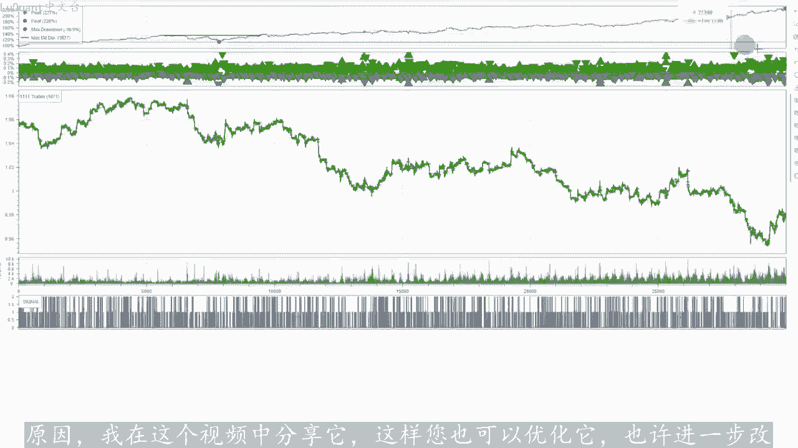
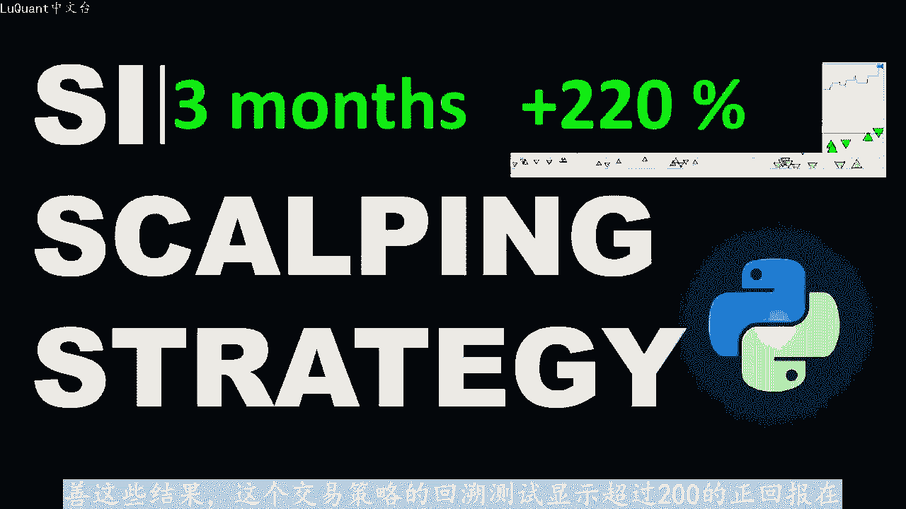
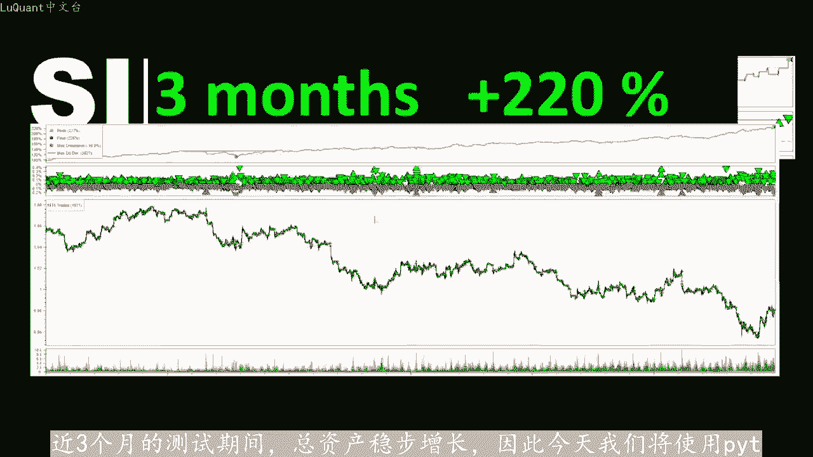
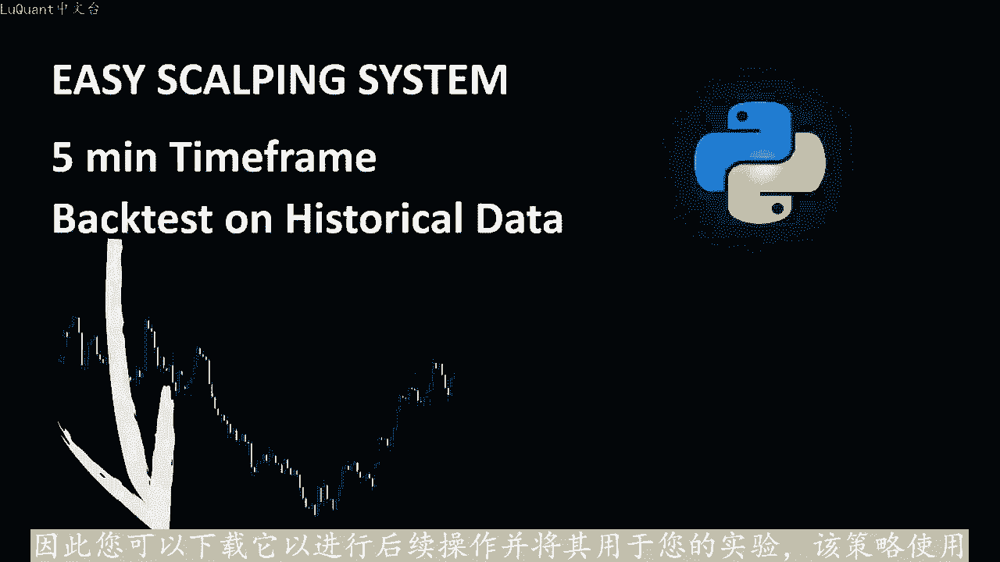
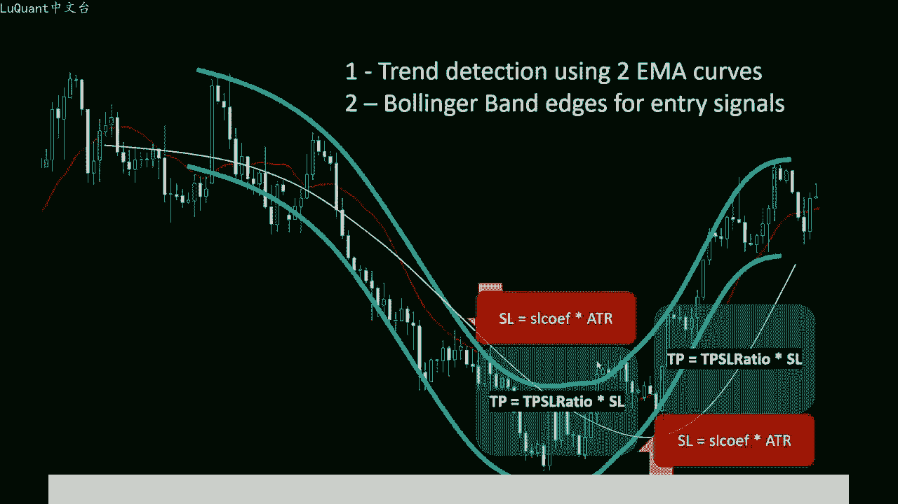
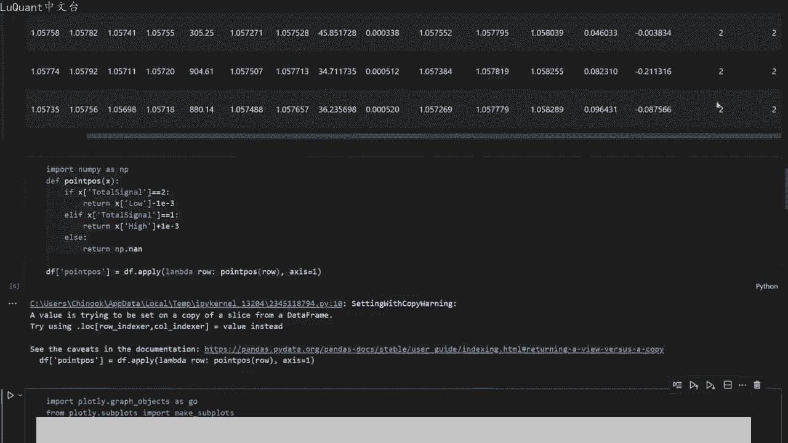
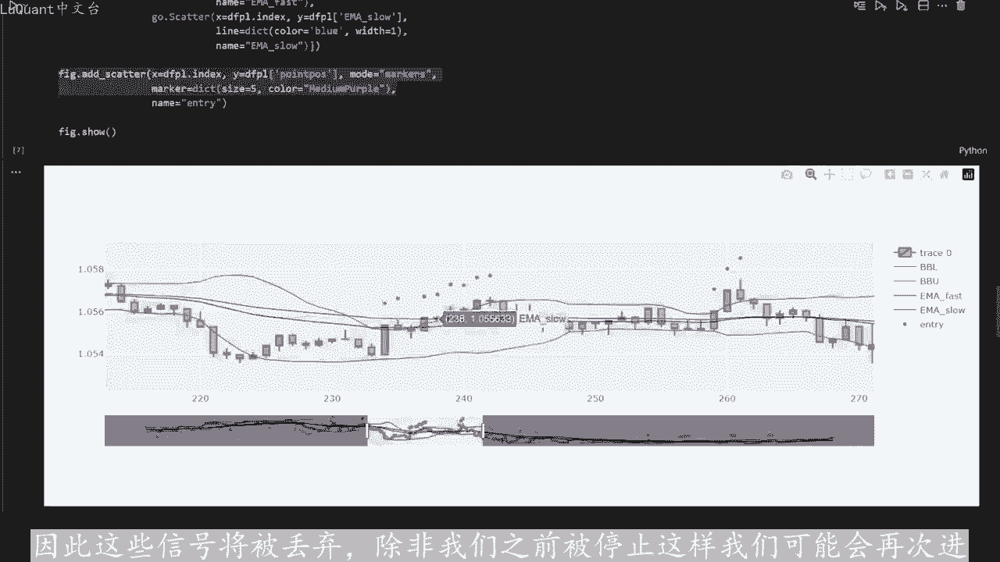
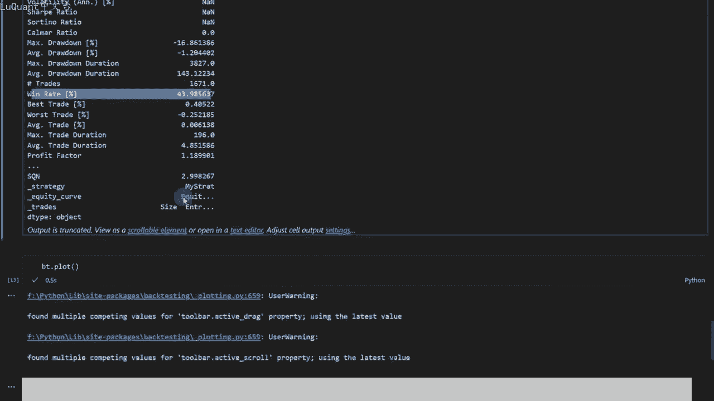
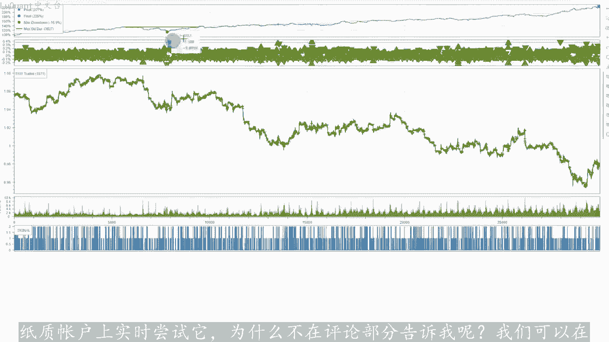
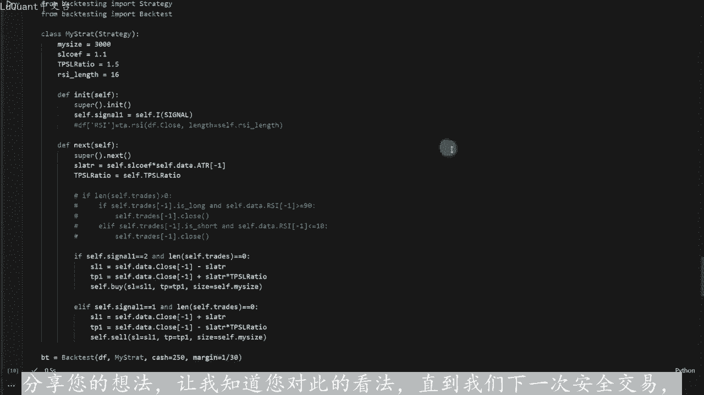

# python量化4：抢帽子策略 - P1 - LuQuant - BV1tH4y1W7zM

您好，再次欢迎这种不断增加的资产曲线，是我喜欢这个策略的主要原因。我在这个视频中分享它，这样你也可以优化它，也许进一步改善这些结果。这个交易策略的回溯测试显示超过200的正回报。😊。

近三个月的测试期间，总资产稳步增长。因此，今天我们将使用pyython策略测试这个简单的雕刻系统。该系统可用于手动交易和算法交易。它非常简单，适用于两种交易。我们。

使用5分钟时间框架来加快交易节奏，并增加交易数量。我还需要优化风险回报率和用于该交易策略的其他参数，这可以使用python和数值回测轻松完。我用于此回测的pyython代码。

可以从该视频描述中的链接下载。因此您可以下载它已进行后续操作，并将其用于您的实验。该策略使用两条移动平均曲线来估计当前趋势，如果快速移动平均。

高于慢速移动平均线，则我们有上升趋势。反之，如果快速移动平均线低于慢速移动平均线，则我们有下降趋势。在上升趋势中，我们只考虑多头头寸。在下降趋势中，我们只考虑空。头寸。

然后我们可以使用binG带边缘触发头寸进入点。因此，如果我们有上升趋势，我们正在寻找多头头寸，那么如果价格穿越较低的80格曲线，我们会建立多头头寸，反之易燃。如果价。穿越80格线上限。

则我们进入空头头寸，这是基于这样的假设。在穿越机之后，价格将始终收敛到80格线的中心，并在此基础上进行交易语翼。平均线趋势相同的方向。因此，我们认为这是对信号的确认。

快速和慢速移动平均线长度的确切数值以及biner带的参数将在编码部分详细说明这些可能不会最好的值。但到目前为止，它们效很好。所以您可能想事后进行自己的研究并使用一组改进的参数。

然后当交易打开或当我们有一个未平仓交易时，我们可以设置与以下相关的止损距离使用ATR计算市场的波动性。乘以一个变量或参数，我们将其命名为止损系数，止盈，这只是止损距离乘以止盈止损比率。

这也是我们可以根据我们的交易风格进行更改的参数。如果。看过我之前的视频，您会注意到这是非常相似的策略。我刚刚用两个em快速曲线和慢速曲线替换了趋势检测，因为我注意到它减少了之后，因为它也增加了之后现。

😡，只有一种方法可以确定系统是否值得让我们尝试一下，并使用python对其进行测试。因此，我们将在几个月的历史数据上回测该策略，看看会发生什么我们的股权和另一个提醒，我们现在将使用的python代码。

下载该视频的描述中有一个链接。您可以免费获取它并应用您自己的实验和快速提示，您可能想从应用更好的方法开始交易管理方法。因为我还没有用尽有关如何定义止损和止。

值得所有选项，这可能会改善您在后面的测试中看到的结果。所以这是我们的jupyter笔记本文件第一个单元格井用于导入数据。所以我使用CSV文件欧元美元蜡烛5分钟时。范围日期在2019年和2022年之间。

所以我们有足够的5分钟时间范围数据有很多蜡烛。在这里我们只是重新格式化，所以我只是删除了几分之1秒。因为这。是不需要的，并且我使用正确的格式，将索引转换为白天格式。所以现在我们有了正确的数据格式。

然后我过滤掉所有我们没有任何变动的蜡烛，这时蜡烛的最高点等于蜡烛。最低点的地方，所以我们不需要这些这些通常是休息日，周末和市场基本休市的日子。所以我们不需要这些没有任何变动。我们对此数据不感兴趣。

我们在更正格式后将索引设置为GMT时间，所以这只。😡，格式化数据，然后我使用padapo技术分析模块来计算慢速艾I长度为50的Mma和长度为30的快速M。所以这是我们的两个移动平均线，将帮助我们减。

趋势方向上升趋势或下降趋势，这里没有使用RSI，我只是保留它。因为我正在尝试退出策略，也使用RSI这条线计算biner带，因此长度为15，标准差。1。5，然后我们得到ATR及波动率测量的平均真实范围。

这将帮助我们定义止损距离。因此，止盈距离也是如此，这就是我们基本上。所有内容加入到我们的数据框中，我们有数据，这就是我们的数据框。这就是我们将格林威置标准时间作为索引的样子。

开盘价高点低点收盘量em码变慢，艾码变快，RSI我们现在不会使用，但它在这里以防万一，您需要进行使。我在这里保留了代码的注释部分，这是我们的退出策略。我们有ATR。

我们有biner带上线、下线和中线等等。所以我们拥有启动该策略所需的一切，这是一。称为MI信号的函数，它将采用数据帧，当前蜡烛以及后蜡烛的数量以及我们的方式要做到这一点。

我们将测试快速移动平均线是否高于慢速移动平均线或低于慢速移动平均线，具体取决。我们想要交易的方向，因此它将检测趋势，但我们不需要测试它针对一根蜡烛，它没有针对当前蜡烛进行测试。

它还测试了最后一个连续的蜡烛，它可以是最后6个连续的蜡烛，8个连续的蜡烛以此类推，就是为什么我们在这里有后面的蜡烛参数。所以我们不这样做，想要测试U信号仅针对一根蜡烛，这样做可能太吵了。

所以我们希望趋势相同，并在最后确认假设6。蜡烛如果我们在5分钟时间范围内考虑6根蜡烛，这是6乘以5，这意味着它是30分钟。所以过去30分钟，我们要么有上升趋势，要么有下降趋势。您可能想要更改此趋势。

并测试您是否获得比我在本视频中获得的结果更好的结果。仅此而已，我将此函数应用到我们的数据框中。这就是我们所说的m信号，我将其作为新列添加到我们的数据框中。所以现在我们有了emma信号或趋势信号。

然后我们可以应用该函数称为总信号。采用数据针当前蜡烛指数和后面蜡烛的数量，以便计算MI信号，如果趋势向上，则它使用前面的函数来计算趋势。因此，如果MI信号等于2，我们处于上升区。在这种情况下。

我们正在寻找买入位置，我们正在等待当前蜡烛的收盘价，收于低于当前蜡烛的下巴菱格线，这就是它的作用。所以这些是我们的这里有两个条件。在这种情况下。😡，有一个多头信号。而在相反的情况下，如果MI信号等于一。

那么我们返回两个，因此这是一个下降趋势，并且当前蜡烛的收盘价高于上80隔带曲线。因此我们有一个空头信号信号，我们返回一个。任何其他情况下，我们返回C，我将此函数应用于所有数据或数据切片的总信号。

我们刚刚在此处切片了最后一个或最远的3万行最。三万行，这几乎是3个月的数据，我们只是将所有信号和总信号保存在一个称为总信号的星列中，这将使我们在回溯测试中速度更快，这就是我们的数据真的方式。看起。

我们已经拥有了之前拥有的所有内容，最重要的是让我向右走。不，所以最后我们应该有总信号列。我们可以在这里看到，所以我们有一个等于一的信号，这意味着它是一个短信号信号等。长信号以此类推。

所以我们可以继续现在要可视化我们的信号，最好在图表上可视化事物。我们可以使用此单元格在有信号的地方创建蜡烛上方和下方的。并且我们可以绘制M数据框，我们可以像普通图表一样绘制蜡烛图。

添加ballinger带下代和上带emma快速emma慢速以。按信号的位置即我们刚刚计算的空头和多头信号，这就是我们所拥有的。所以只是为了直观的验证和验证事情是否按预期工作。我们没有在代码中犯任何错误。

所以我。

有我们的巴林格带两个移动平均线和这些信号，所以这些是短信号，因为它们位于蜡烛上方，这是一个很好的蜡烛。例如，我们正处于下降趋势，观察价格的上涨。他到达这里，他穿过了尚宾阁。所以它触发了空头信号。

无论如何，它有时会起作用，你有这些连续的信号，但这些只是一个信号。实际上我们正在采取第一个信号，因为一旦我们看到一个信号出现，我们就会开的一笔交易，并且我们一次开的一笔交。😊，因此，这些信号将被丢弃。

除非我们之前被停止，这样，我们可能会再次进入市场。现在我们可以继续进行回溯测试。我正在使用回溯测试派手术的大小是3000这里止损系数。

1。1，所以止损距离将是AT2的1。1倍和止盈止损比率是1。5丢弃。RSI正如我所提到的，我们没有在这个视频中使用它，所以我们正在初始化我们的变量已。我们想要的任何东西，现在我们可以定义止损距离。

所以它是satature，它等于系数乘以当前ATR最近的ATR值，只因止损比率等于这个。我们将在这里使用它来定义止损并止盈，这就是它的工作原理。如果信号等于2，那么它是多头头寸，这是多头头寸信号。

我们没有任何为平仓交易。我们。定义止损值和止盈值同样。如果我们有空头信号，而我们没有，我们将使用止损止盈和交易优的大小，再次在相反方向的其他条件下建立买入头。目前我们将定义止损。

只盈并使用这些来建立卖出头寸。我们将定义我们的回溯测试条件，以便我们传递数据，框架我的策略类。我们在这里看到的和初始的现金金额为250美元。比方。保证金为1比3，因此杠杆为1到30。

现在从结果中我们可以看到，使用我刚刚针对一个项目使用的参数，我们的回报率为25%，买入并持有的回报率几乎为-7%，因此最大下降幅度。-17%，在我看来，这已经很大了。

我不会交易低于-10%的任何东西作为最大下降幅度，但平均下降幅度还可以微负1。2%，交易数量为1671比，胜率几乎为4%到4%。基本上就是这样，简而言之，这是一个获胜策略。我可以向您展示绘图。

所以让我们绘制净值曲线。因为我们可以看到它是一个稳定增长的净值，昏睡期很少。所以这次是一个很大的时期。请记住，这是一个3个月。😊。

17、所以我认为这就像几周的昏睡期，所以2到3周的昏睡期应该没问题。这里的其余下降区域相对较短，但总体而言它在增加。因此。具有潜力，我知道您想增加佣金等等，它可能会影响策略的盈利能力。

但至少是指标我们将biner带与移动平均线结合起来的方式以及系统的简单性。我来说很有趣，所以它非常简单，并且现在表现的很好。我们可以进一步优化它仪使其真正高效吗？😡，将其实施部署在纸质账户上。

如果您希望我。只是账户上实时尝试他为什么不在评论部分告诉我呢？我们可以在未来的视频中这样做，这就是我要告诉您的全部今天。我希望您觉得这个视频有帮助。如果有的话，请通过点赞或发表快速评论来支持。

分享您的想法，让我知道您对此的看法，直到我们下一次安全交易，下次再。😡。

