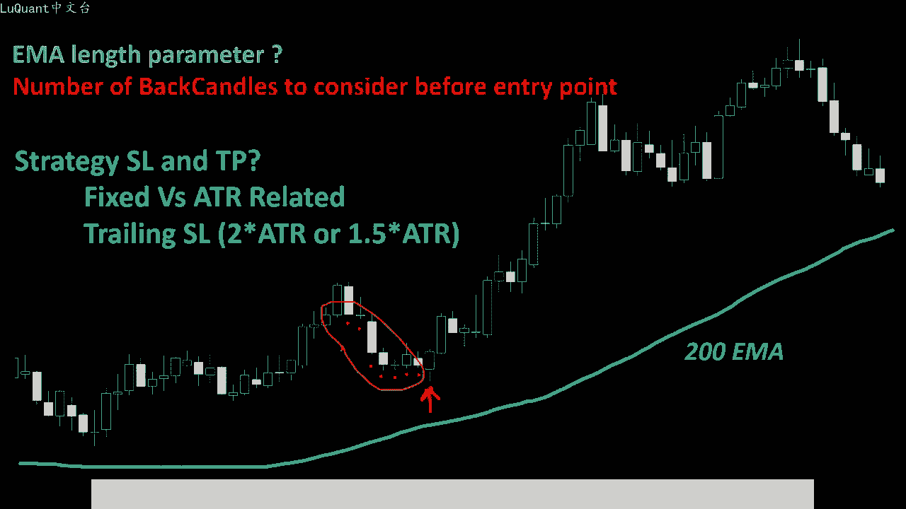
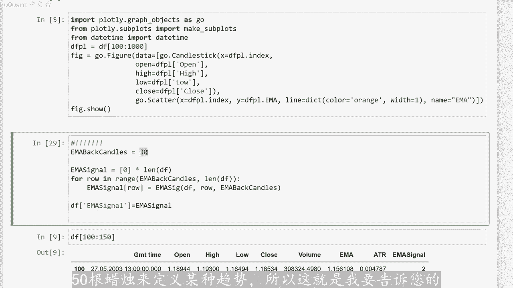
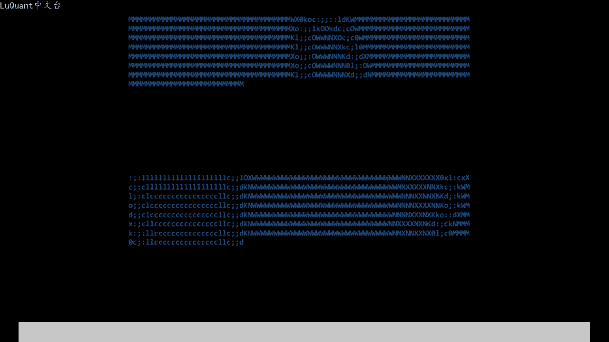

# python量化50：移动平均线 - P1 - LuQuant - BV13j421d7Pw

嗨简单的策略经常被忽视，因为我们自然倾向于更相信复杂的模型。所以今天我将向您展示一种非常简单的方法，仅遵循两个规则，可以与复杂的交易系统竞争，并且它会带来正回。😊，简单规则的优点是。

他们可以自动化进行算法交易。因此我们可以轻松的用pyython编写我们的策略，并在不同的货币上进行回溯测试，以确保它确实有利可图。如果您愿意，也可以手动使用它，但它也是自动化的一个很好的候选者。交易。

😊，还将解释主要挑战，以及我们需要充分利用这个的不同参数。因此，如果我们考虑这个例子，我们将使用第一个指标即200移动平均线曲线。因此，如果蜡烛位于曲线上方。处于上升趋势，我们正在寻找买入头寸。

当然您可以在相反方向应用它。如果您的烛台位于移动平均区线下方，并且您正在寻找卖出头寸，那么在本例中，我们处于买入位置。为了选择入场点，我们。检查价格跌破当前蜡烛之前的几根蜡烛的位置。例如。

如果这是我们当前的蜡烛，则这是我们当前蜡烛的较低值，我们将回顾之前的蜡烛及。感兴趣的蜡烛或我们当前的蜡烛之前的蜡烛。如果我们当前蜡烛的低值低于所有这些值，我们将寻找这些蜡烛的较低值。在这种情况下。

我们现在已经确定了我们的入场点或买入位置。显然就像任何其他策略一样，尽管这是一个简单的策略，但它有自己的挑战。第一个参数是我们应使用移动平均线的长度，是200是100还是不同的东西。但是我们可。😡。

通过对特定货币对我们的策略进行回溯测试来猜测和微调，并寻找最大回报。然后我们就有了在当前蜡烛图之前应该考虑的回蜡烛数蜡烛，我们应该采取7810或20根蜡烛并。

当前蜡烛的最低值与所有这些先前蜡烛的最低值进行比较，以免将我们的模型压缩为数字。我只是将其作为参数，它是我们代码中的变量，所以我们可以对其进行实验，我们可以更改。当您移动此参数的值时。

您可以检查策略的结果和回报。所以这是策略的简单部分，我称之为指标部分，但任何策略都应该是与交易管理方法相结合。因此，我们必须知道如何定义止损和。银值这些值将与市场的平均真实范围相关。

或者我们是否应该对所有交易使用固定值。这就是从我的角度来看，这是困难的部分。因为如果您不将其与正确的交易管理相结合，那么您可以拥有完美的纸。那么您的策略将不会给您带来正回报。因此。

我们的止损和止盈值可能与ATR或他们可以被修复。这样我们的所有交易都将具有相同的止损和止盈值，或者我们也可以使。与ATR相关的追踪止损。因此我们将在代码中尝试所有这些组合看看，即使是一个简单的策略。

或者即使是最简单的策略，我们也可以有相对大量的参数来讨论。所以让我们检查一下代。看看如何用pyython编写所有这些。好吧，这就是我们的jupiter笔记本文件。我们有一个单元格，我们在其中加载数据。

这是2003年至2021年之间欧元美元4小时图。所以这个单元格我们已经见过很多次了，我不会。😊。

更多时间在它上面，对于这个策略，我们正在使用指数移动平均线，我将使用padas underscore技术分析模块和函数emma，我们提供蜡烛的收盘。这里的长度是100，我尝试了不同的值。对于100。

我们有很好的结果。目前的结果我们还需要ATR来定义我们的止损或追踪止损值。对于AT2，我们必须提。每根蜡烛的最高价、最低价和收盘价。我正在计算长度默认情况下等于14，我们可以稍后更改他们。

以测试其对我们策略回报的影响。然后我将定义一个名为emos的函数，意思是emma信号，这就是。将测试蜡烛是否位于移动区线上方的位置平均值或低于移动平均线的区线。在这种情况下。

我们有上升趋势或下降趋势定义。首先，这个函数显然会采用我的数据的数据框。然后我们。蜡烛表示，当前蜡烛的行哀我感兴趣，我们有后面的蜡烛，所以我要回顾多少根蜡烛，看看他们是在曲线之上还是在曲线之下。

我不会拿一根蜡烛，我有没有意义，至少。😡，五或六或十根蜡烛都位于曲线上方，表示我有明显的上升趋势或者相反的情况，即我们所有的蜡烛组都位于曲线下方。因此我们有明显的下降趋势。所以这又是一个我们可。

更改参数，并检查其对我们策略的影响。这就是我们如何使用此函数，我调用em信号函数，我提供数据帧作为参数，我感兴趣的蜡烛型和要考虑的蜡烛数量，并检查他们是。位于曲线之上或之下。

以定义我们是否有上升趋势或下降趋势，或者我们返回第二个作为下降趋势信号的上升趋势。我们返回第一，如果我们没有任何明显的趋势，我们简单的返回零。此时我想。指数移动平均线绘制我的数据，并检查它的进展情况。

以便一切正常运行，以确保我们没有犯任何错误。到目前为止。在我们的代码中，我们可以开始使用我们的函数em信号。所以我定义了。后蜡烛。所以如果我在MI区线上方有40根蜡烛，我将采用40根蜡烛。在这种情况下。

我将有一个上升趋势。如果我有40根蜡烛低于移动平均线区线，那么我们可以说数据框中的每根蜡烛都有下降趋势。我们调此函数为数据框提供行号和MI数量蜡烛在这种情况下是40，现在你可能会说四十太多了。

我们可以从20或时开始，你是对的。实际上这只是我在代码中输入的一个数字，让我们看看。给出了什么？在这个阶段，我们的数据框看起来像这样，我们有时间开盘价、最低价和收盘价，我们有交易量。

emma现在是我们数据框的一列ATR我们稍后将使用，我们有emma信号。😊，当我们有信号，也意味着我们有一个下降趋势，这意味着所有这些蜡烛的所有前面40根蜡烛都低于艾曲线。

我们可以尝试不同的曲线以及不同的蜡烛。所以让我们采用这部分，并选择不同。只要我们绘制例如300和最多350根蜡烛，我们仍然有一个下降趋势，让我们寻找其他东西，让我们从100上升到150。这里我们有一。

上升趋势因为我们有第二个信号或者我们所说的M信号移动平均信号。所以这是我们的第一个参数。在这个策略中，我们仍然有一个参数，它定义了我们可以寻找买入头寸。寻找卖出头寸的切入点。为此。

我们需要一种称为高低杯蜡烛的东西。所以我将此参数称为或像这样的变量。我们将考虑当前蜡烛或感兴趣的蜡烛之前的8根蜡烛，我们将在数据框中添加一个新。它是称为DEF最小值的最小值。

用于检查当前蜡烛或每行当前蜡烛或当前行之前的8根蜡烛中的最小值。我正在为每根蜡烛取最低。换句话说，我们正在检查该特定蜡烛之前的每根蜡烛的最低值中的最小值或者这个粒子型。我们正在考虑8个后面的蜡烛。

这将是最小值。考虑到每个蜡烛的最高值，最大值也是同样的事情。然后我们可以定义一个名为HL或高低信号函数的新函数。它将检查先前的信号MI信号是一个。所以万一我。有下降趋势。

我们将测试最高值是否意味着当前蜡烛的最高值大于该特定蜡烛之前的蜡烛中的较高最大值。换句话说，是否会出现这种情。上面的提示在下降趋势中，这是迈出头寸的切入点的定义。相反，当我们有上升趋势时。

我们将检查当前蜡烛的低点是否低于之前8根蜡烛的所有最小。这是我们有买入仓位入场信号的地方。在这种情况下，我们返回两个，否则如果我们没有单元格或买入仓位的入场点，我们只需返回零。所以这将是我们的最终信号。

因为它使用我们已经包含在数据框中的先前em信号，并且还考虑我们在解释此策略时讨论的第二个参数，我们将将此函数应用于我们的数据框。因此我们有一个信。每根蜡烛的每一行的值，然后我们可以打印蜡烛。

其中我们只有一个信号，只是为了检查它总是更好的直观的验证事物。对我来说，检查图表更清楚。在这里我们可以看到我们。下降趋势和我们的算法识别的信号由这四个紫色点表示，因此这四个蜡烛代表卖出信号。

因为我们处于下降趋势。事情是当您在此处。单元格位置上持仓时，我们必须知道在哪里设置止损值，是为了不触及我们的止损值，并错过我们可以赚取的所有下降趋势利润。在这里我们再次看到另一个信号，我们可以看到。

所以如果我们想要的话，这也是一个卖出性。知道这背后发生了什么，让我们检查250，所以这些都是很好的信号。正如您所看到的，我们有一个持续的下降趋势，我们可以在这一点轻松触及攻击利润。

这一点也是一个很好的卖。😡，所以换句话说，它有效在大多数趋势时间里都很好。但是当我们出现趋势反转时，它可能不像我们想象的那么好。因为我们突破了趋势，我们出现了反转。如果您遵循趋势。

任何交易者都应该识别这。😡，算法交易策略，您在最后做出决定，这意味着他不是自动机器人，而是交易者正在检查此信号。该信号是为交易者提供支持，但最终决定始终留。交易者。因此在这一点上。

我们知道我们的信号工作正常，我们可以开始使用这些信号测试我们的策略。所以我将定义一个名为sign node的函数。它从数据帧中调用HL信号。因此，在这个策略中，如果信号等于2，如果信号等于一。

我将寻找买入头寸，我将在该特定策略中寻找卖出头寸。我们使用追踪止损。该策略考虑了ATR平。真实范围市场我们没有考虑任何因素，它在这里等于一，所以止损正好等于AT2。我们可以将它乘以1。5，它可以等于2。

5，具体取决于。您想要的距离类型，您的止损是希望它远离当前价格，还是希望有一个非常严格的止损，具体取决于您的偏好。所以目前我将把它保留为一个，这样我们就少了一。我们可以对它进行回溯测试。

我们拥有的所有数据的回报率约为29，因此最终的回报率为正。但如果您想评估该策略，我们可以查。其净值一开始工作的很好，此时增长到160%，但后来发生了一些事情，我们开始失去的不如我们赢得的那么多。

但他并没有在数据真的整个时间内都有。所以可能是这样策略在趋势市场中非常有效。但是当你有水平价格或水平市场变化时，它可能不如我们想象的那么好。我们可以尝试使用ATR固定止损和货。换句话说。

我们的止损和止盈以不同的方式做事，我们将使用此策略进行的所有交易的止盈值都是固定的。现在如何定义止损距离和止盈距离，我们将使用两个不同的比率。第一个是ATR下划线因子，假设它是1。5，所以我们将把买。

头寸的止损固定为当前收盘价，减去AT2值除以该因子。换句话说，如果我有等于此处的因子，则意味着我们正在采取止损距。如果您想保持原样，则等于AT2除以2，这意味着AT2因子等于一。

这意味着止损距离将完全等于ATR值而不进行任何修改，然后只因。使用止损止盈比率的止损距离。换句话说，当我们输入1。5时，这意味着止盈是止损距离的1。5倍。现在当我们运行此策略时，它会提供。回报-1。

5%，因为我没有时间调整参数并优化所有值以实现正回报。但这就是完成的方式。我将其保留在这里作为记录。您可以在下载的代码中使用它，所以您可。使用不同的数据进行实验。也许外汇数据或加密货币数据。

我们也可以尝试改进我们的模型或使用不同的HL回蜡烛值获得更好的回报。例。我们使用100M的移动平均值，您可以例如更喜欢使用200或150，具体取决于您要交易的货币或加密货币。还有另一个重要参数我。

在本视频中没有时间优化即MI杯蜡烛。所以我从40开始，我也尝试了30。您应该知道的是，当您减小此参数值时，您的模型会变得更加敏感，您将进行更多交易。这仅仅是因为更容易在特定区。

上方或下方找到较少数量的反向蜡烛。因此，当我们将其增加到50时，情况会如此变得更难找到。因为您必须找到曲线上方或曲线下方的50根蜡烛来定义某种趋势。所以这就是我要告诉你。

有关此策略的全部内容，希望你们喜欢它。希望您发现这些信息，像往常一样有帮助，可以在视频描述中找到一个链接。您可以在其中下载代码，这是一个jupiter笔记本文件，您可以同时进行实验和更改参。

如果您觉得安全交易，请不要忘记留下评论，并发表评论下次。