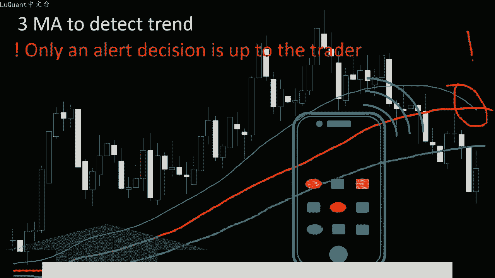
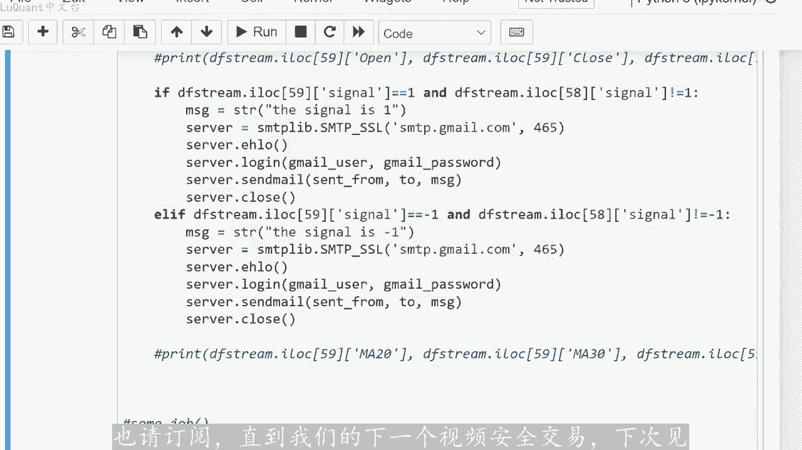

# python量化51：比特币实时交易 - P1 - LuQuant - BV1Rz421Z7Z3

您好，在这个视频中，我将向您展示如何使用拍放语言实现自定义交易指标来进行交易变更通知。我们将把它应用于比特币价格变动作为事例。因此，我将使用一些非常有用的东西，简单但人。有效。

这将是三个移动平均线比较来检测趋势方向。在这种方法中，我们将使用三个不同的移动平均线。第一个，我们将其称为快速变化移动平均线。第二个，我们将其称为中等移动平均线变化。移动平均线。

第三个是缓慢变化的移动平均线。因此，比较这三个不同的移动平均线，我们将得出价格趋势的结论，正如您所看到的，当我们有上升趋势时，这三个移动平均线有一定的顺。因此，我们有快速的移动平均线。

然后是中等的移动平均线，然后下面是最慢的移动平均线。在这种配置中，如果这些移动平均线具有相反的顺序，则我们有上升趋势，这意味着我们有慢速移动平均线向上，然后是中等移动平均线，然后是最慢的移动平均线快。

😡，低于它意味着我们有一个下降趋势。所以正如这个例子所示，只要我们有这些移动平均线的一定顺序，我们就可以认为我们有一个上升趋势，直到这个顺序被破坏或不再存在。就像这里的特殊情况一样，在这种情况下。😡。

可以说，趋势正在发生变化，并且可能是不清楚的趋势或者是反转为下降趋势。因此，我们的想法是检测何时发生某种顺序的移动平均线，显示上升趋势或下降趋势并发。信号使用专用电子邮件账户发送到我们的手机。

因此请记住，这里的想法是发送警报。执行交易的最终决定取决于交易者，这就是算法交易的全部目的，可以让您在交易过程中避免待在屏幕后面的痛苦。所。这些时间都在寻找趋势和趋势反转，特别是如果您将此作为副业。

您可能没有时间整天观察不同的货币，使用这种方法会使事情变得容易得多。因为如果您正在寻找某种设置在市场上无。您现在身在何处？该程序都会向您发出警报。当然，如果您愿意在更高级和更复杂的指标上使用此方法。

您可以修改程序，并添加适合您的任何内容，以及您将使用的策略。为了简单起见。在这个视频中我们。😊，打算实现三个移动平均方法。所以这是我们的jupyter笔记本文件。我们将首先导入pandas。

并使用reund box函数读取数据文件。它是1个CSV文件。所以我正在加。

比特币美元价格从2017年到2021年，我正在检查数据的状态。如果我的数据框中缺少值，但这里不是这种情况，我们可以打印数。况为了确保我们正在阅读的内容，我们已经正确读取了文件。

这样我们就有了日期和开盘价、最高价、最低价、收盘价以及每个蜡烛图每天的交易量。然后我们需要计算三个不同的移动平均线。所以。将导入pandata进行技术分析。我将在数据框中定义一个新列即移动平均线20。

然后定义一个新列即移动平均线30和移动平均线60。所以您可能。同意，如果您有不同的值，则2030和60作为此方法应使用的三个移动平均线。我的意思是，如果您想要使用40条、50条。

然后100条的移动平均线，您当然可。更改这些，并根据您的需要修改这些。所以我将使用2003060作为设置。我在这里使用指数移动平均线。如果您愿意，您可能想使用简单移动平均线，所以我将使用指。

移动平均线给予最新的价格变动更大的权重，而最旧的值的权重较小。所以我将用每根蜡烛的收盘价来提供这些权重，长度将在这里为20，然后为30，然后60，然后为。😡，确保所有内容都正确添加到我们的数据框中。

我将打印数据框的尾部或最后十行。我可以看到，我们仍然有初始列以及三个新列，我们添加了三个不同的移动平均线。203。和60条，然后我需要定义一个新函数，我们将其称为我的信号sick。

这样它将计算我们的信号是买入还是上升趋势信号还是下降趋势信号。因此，如果20根柱的移动平均。小于30的移动平均线，并且小于60的移动平均线。在这种情况下，我们将返回-一，这是一个卖出信号或下降趋势。

在相反的设置中意味着，如果快速移动平均线高。30中等移动平均线并高于最慢移动平均线60条。在这种情况下，我们有上升趋势，在这种情况下，我们将返回加一，否则在所有其他情况下，我们返回零，因为我们没有任何。

明确的信号，现在我们可以使用这个函数，我们可以将它应用到等于一的轴上的数据帧。我们可以将信号即该函数对每一行的结果存储到信号中列。所以这只是我们添加到数据框中的一个新。能够绘制内容并直观的检查内容。

以查看一切是否按预期工作总是很好。所以我们将再次使用绘图酷爱。我只是从指数100到1000的100中取一小部。我们将绘制烛台和三个不同的移动平均线。因此，如果我们绘制这些，我们将得到类似的东西。

因此它可以正常工作，我们可以放大较小的切片，并检查三个移动平均线如何。变化。例如，这里我们有快速的移动平均线，中等的移动平均线，黑色的移动平均线是最慢的移动平均线。正如我们所看到的，当我们有上升趋势时。

他们会采取这种特定的顺序。所以尽快因为我们有一个开关。例如我们可以使用一种策略，就像某。😡，天真的策略一样，因为它只依赖于一个指标。即当我们从一个订单切换到另一个订单时，我们可以开始我们的购买执行。

然后等到订。混乱，这就是我们要结束交易的地方。因此这是您可能想要在该指标上尝试的策略之一。但是该视频的目的不是展示策略，而是制作一个自定义指标，将直接向您的手机发送进。现在我们知道这是有效的。

我们可以继续使用代码，并开始我们现在要从市场下载新烛台的部分，分析这些烛台，计算移动平均线检查性。如果信号是正负一，则通过电子邮件将信号发送到在我们手机上同步的专用电子邮件账户。

这样一旦我们在市场上进行了某种设置，我们就可以收到警报这个。使用ONDP这个视频不是由LNda赞助的，我也不是在另一个经纪人上为经纪人做广告，只是碰巧我正在使用这个，他们也为模拟账户提供这些。

所以你不需要如。想尝试某种策略，则必须投入真金白银。您可以简单的开设一个模拟账户或练习账户。您可以生成我们所说的代币，您可以在网站上生成它，这基本上就像一个秘密代码。

可以让您从pyython访问您的练习账。这很重要，因为需要从该特定经纪人下载实时数据。现在我知道其他经纪人也有不同的API，他们有不同的库。我对另一个不太熟悉他们提供的工具，这就是为什么我。😡。

在这个视频中使用L do，我们将使用电子邮件，从某个电子邮件地址发送电子邮件，或者将电子邮件发送到某个电子邮件地址。所以我将使用gmail，我将在这里导入SMTP库。您可以输入，我们将用来发。

电子邮件的Gmail地址，您还需要密码，因此我不会将密码放在这里，也不会输入我正在使用的电子邮件。然后您可以将从某个名称发送的邮件发送到目的地电子邮件。因此，我向自己发送一封电子邮件到我将收到。😡。

电子邮件的同一个邮箱，在这种情况下，不需要使用两封不同的电子邮件，主题只是电子邮件标题，不要忘记这里的令牌变量，我们将使用。然后我将把其余代码放入一个函数中。因为我们稍后将使用它。

我们必须将所有这些都包。😡，到一个函数中，让我们将其称为某个工作。当我们调用时，这个函数中的所有内容都会按照我们想要的方式执行。因此，在这个函数中，我们将使用称为蜡烛收集器的东西。

这个函数基本上从UND平台下载最新的主。所以我们将提供我们生成的令牌。对于我们的账户，我们将提供我们要交易的货币对。所以我只是在这里插入符号美元下划线比特币，它可能会有所不同。我们。

检查我们将使用哪个时间范围。所以这第三个参数是您要使用的每日图表或每日数据还是4小时数据等等。所以在这种情况下，这部分。代码的前一部分无关。

因此前一部分该代码只是为了解释我们正在做什么来检查三个移动平均线等等。因此，我们不必将任何数据加载到我们的程序中，即可使其工作。您只需使用这个单元格，即可使一切工作。将在这里解释。

所以这是将使用蜡烛收集器下载烛台的部分，计算移动平均线或您想要使用的任何自定义指标，然后生成信号。然后如。信号符合特定标准，则发送信号，作为通过电子邮件发送给您自己的消息。所以在这里。

我再次使用低于60根蜡烛的移动平均线，这就是为什么我要定义一个称为蜡烛的东西。等于收集器点抓取61根蜡烛。请记住，我们从ON大蜡烛中导入了一些叫做pear，然后grand，然后蜡烛收集器的东西。

这就是为什么我们可。在这里使用这些函数，所以我们将获取61根蜡烛，因为我们不需要更多。因为蜡烛是某种列表，我们该列表中将有61个蜡烛，他们作为索引从零开始，因此，索引60的蜡烛将。😡。

我列表中的最后一个蜡烛，在这种情况下，它是尚未关闭的蜡烛，因此它是一个持续的蜡烛价格，仍在浮动，并通过该蜡烛变化。我不想使用该特定蜡烛，因为我们不知。😡，该蜡烛的最终状态，我们将使用该蜡烛之前的蜡烛。

因此就在最后一个蜡烛之前蜡烛，因为它已经关闭，我们已经知道该蜡烛的交易量以及收盘价到底是多少。因此我们将使用索引5。😡，作为最后一根蜡烛，无论如何，在执行此操作之前，我将创建一个新的数据框。

称之为DF流。它将有四列开盘收盘高价和低价。然后对于蜡烛中的蜡烛。将把它们转换为浮点数，所以我必须读取蜡烛点出价点、开盘价、蜡烛点、位点、收盘价、蜡烛蜡烛。高架等等，我将把它们放入低。流列中。

然后出于某种原因，我必须将它们转换为浮点数，只需添加这四行即可完成工作。在这里我们可以计算移动平均线，要么使用我们之前。本视频中看到的penda star技术分析，要么简单的使用滚动函数。

并对最后20根蜡烛，最后30根蜡烛和最后60根蜡烛进行平均值或平均值，并将它们存储到三个新的钟。然后我们生成信号，该信号也。DF流数据帧中的一个新列，它是一个小数据帧。

其中包含我们刚刚从经济商平台下载的最新烛台。因此我们在访问上应用函数my signal等于。它将完成读取三个移动平均线，并检查我们是否有特定顺序来生成买入信号或卖出信号的工作。

然后我们可以测试最后一个关闭的蜡烛是否是我们所说的指数59的蜡烛case等于。并且同时是前一个蜡烛，所以蜡烛58没有信号一，所以我们只是进入这些有序移动平均线的状态。我们看到它现在是一个买。信号。

所以它是一个上升趋势，我们将通过电子邮件向自己发送信号。我们正在更改消息变量的值，这将是一个字符串信号，是一个或任何您想要发送给自己的信号。否则如。我们有一个相反的方向，下降趋势减一。在此之前。

我们没有减一，在此特定蜡烛之前，消息变量作为信号为一。现在我们有这些行，我们将在其中使用mal。和电子邮件的登录属性，用户电子邮件和Gmail密码，我们将发送带有特定消息变量的电子邮件。

该变量在代码的此阶段进行了修改。因此最后我们可以关闭服务器，请注。为此，工作有时，Gmail有一个安全性锁定，您必须解锁到您的电子邮件。因此，您必须使用浏览器登录到您的Gmail账户。

并解锁您想要使用不同界面使用它的事实。应。必须首先从Gmail用户账户解锁，然后这是我们的函数吗？如果我调用这个函数，他将执行这些工作，这意味着他将在这里下载最后61根蜡烛。并。如果我们有某个信号。

它将计算三个不同的移动平均线，会给我们发一封电子邮件。如果没有他不会做任何事情，我们不想在每个烛台或每隔5分钟自动启动此功能，我们必须将其放入调度协议中因。😡，我们将使用称为调度程序。

我在这里导入了一个叫做AP调度程序的东西，使用起来非常简单。我们使用大约15分钟、15次、60秒的失火宽线时间，调用阻塞调度程序含。换句话说，如果pyython试图向您发送电子邮件。

则意味着15分钟并且没有连接或出现问题。我们将每隔一段时间重试一次，持续大约15分钟，然后在此特定时间放弃此任务并等待。某些作业功能再次启动，这是使用添加工作功能。所以我将使用调度程序启动总工作功能。

它是皇冠类型，然后是星期几我。仅从周一到周五每4个小时启动此功能一次，每4个小时一次。因此我构建了这个函数，就像我们使用4个小时条形图一样。如果您想将其用于每日图表或任何其他每小时图表。

您必须在此处更改这些值，让我们考虑一下。我们正在研究4个小时小时条形图。因此此功能从周一到周五每4个小时启动一次延迟5分钟，这意味着4小时加5分钟等。在函数执行时随机抖动120秒，因此您不会必须包括它。

实际上我只是想尝试一下。您还必须包括您在这4个小时内工作的时区，这4个小时将从午夜临时开。如果您更改该功能，它将影响该功能的确切启动时间时区，然后我们启动调度程序。

所以基本上它将安排我们启动总和工作函数的时间。我们不想继续不停的下载我们的烛台并计算一。平均线等等。首先它很多你的机器上的负债很大，你会用你的python程序发送的连续消息。

向你自己的电子邮件账户发送垃圾邮件。所以我们只想每4个小时使用一。事实上，在这种情况下，如果你想以这种方式工作，我们必须将这部分复制到这里。就像我们要把它放在这里一样，这样只有当这个条件可用时才会发送。

这部分也会将其剪切并放在这里。这样我。😡，就可以收到电子邮件。仅当它仅在我们进入移动平均线订单状态时才技术时，让我们再说一次。您不必拥有此代码前面部分中的任何内容。

需要发送电子邮件并进行测试的唯一单元格，里的蜡烛表明，如果你有某种设置则全部包含在一个单元格中，这个特定的单元格在这里，这就是这个视频的内容。我希望你们发现这些信息有帮助。如果是的话，如果您觉得可以。

请留下评论或许。😡，也请订阅知道我们的下一个视频安全交易。下次。

