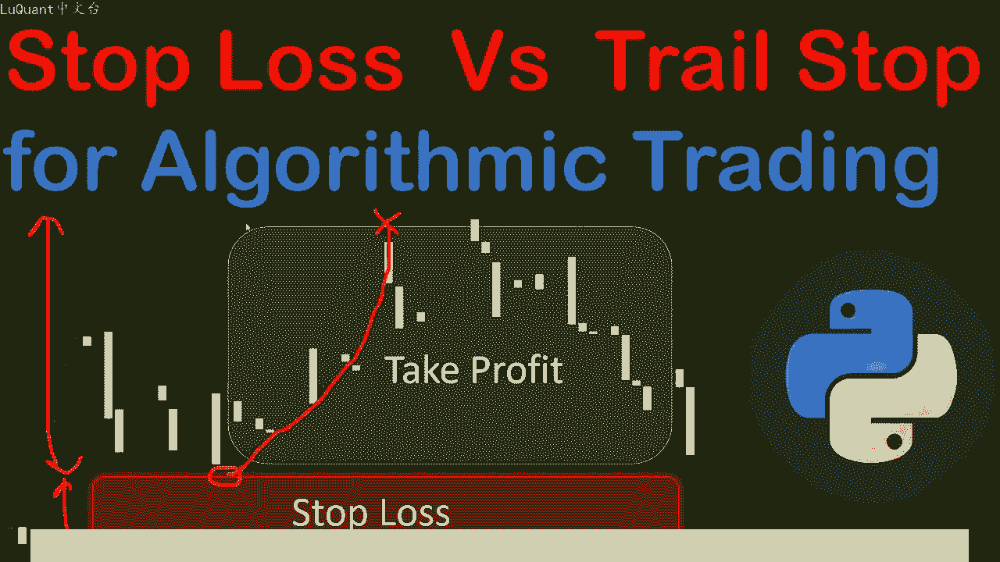
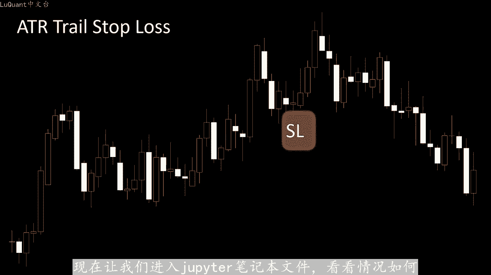
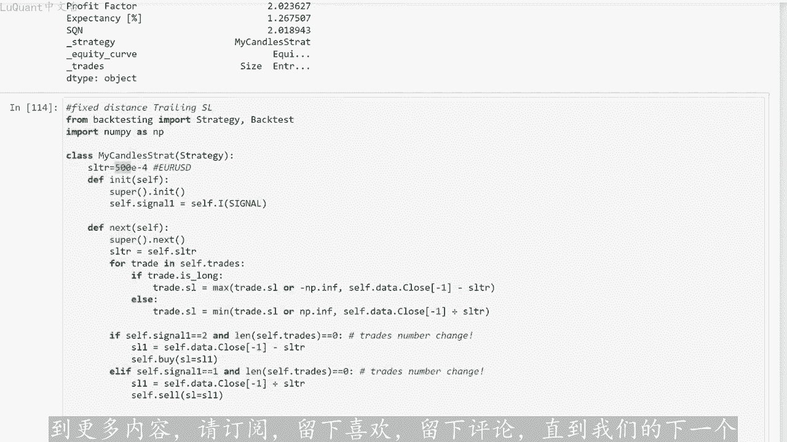

# python量化52：追踪止损 - P1 - LuQuant - BV16u4m1T7p5

大家好，欢迎观看本视频。我们将检查我们在交易时可以使用的不同止损方法。更具体的说，在算法交易中，我们专注于我们可以在数值程序中编码的内容，以及最适合包含在交易机器人中的内容。我这么说的原因。😊。

决定具体止损值的方法有多种，但有些方法在任何程序中都比较复杂。因此，在本视频中，我们将根据支撑阻力位和烛台回测相同的策略。之前在其他视频中描述过的模式，但对于止损值，我们将考虑四种不同的情况。

第一个是交易者在所有交易中固定的恒定止损距离。这意味着，如果这是我的买入头寸例如，我将确定一个值。

距离。无论买入头寸在哪里，我都会考虑头寸和止损值之间的距离始终相同。第二个更具动态性，它依赖于平均真实值范围值。换句话说，我们将选择。ATR直接相关的止损距离，例如ATR的2倍甚至3倍。

这样我们的止损距离将取决于特定市场的波动性。这就是为什么我们不会为所有交易设置相同的距离。也意味着我们将为每笔特定交易获得不同的止损距离。那么对于第三种方法，我们将考虑固定距离交易止损。

这是我们已经在之前的视频中描述和编程的正常追踪止损。固定距离止损意味着在任何交易或任何头寸。我们将考虑相同的止损距离，我们每个买入或卖出头寸的追踪止损。第四种也是最后一种情况是追踪止损。考虑。

我们执行交易投寸时，价格的平均真实范围，这意味着它是追踪止损，损失和上一个一样。但是，根据ATR来选择止损距买入仓位或卖出仓位的距离，它与ATR直接相关，这意味着它。与市场的波动性有关。

当我们执行买入或卖出头寸时，简单来说，我们将使用四种不同的定义止损值的方法来测试相同的策略。显然，这也意味着它将反应。我们的止盈值中，因为大多数我们的止盈值的时间将根据我们放置止损值的位置来选择。

同时考虑止盈距离和止损距离之间的比率。好吧，现在让我们进入jopeter笔记本文件，看看情况如何。

为一直关注该频道或之前视频的人们编写的这是一个非常经典的单元格。在导入pas模块之前，我们已经见过很多次了，然后我们正在加。欧元价格的CSV文件与美元相比，这些是从2003年到2021年的每日蜡烛图。

因此，我们正在定义要检查是否有空值的列，并且在清理空行后重置索引，这样我就不。花费在这方面花了很多时间。但在这里我们将pas技术指标或技术分析模块作为派包括在内。

我使用它来将ATR平均真实范围作为新列添加到我们的数据框架中。所以我使用AT。我们使用它的函数，包括数据针的高价，数据针中蜡烛的低价和收盘价，这是该函数需要的参数。我正在使。

我们所计算的蜡烛长度的标准值，我们要考虑何时计算14根蜡烛的ATR。然后我打印数据框，最后20行20行的尾部，只是为了检查一切是否正常工作，这就是我们的ATR值。正如我们在这里看到。

我们正在定义支撑和阻力函数。这些函数包含在之前的两个视频中，我们之前已经不止一次的解释过这些函数，所以我不会花太多时间在这上面。所以简单的说，这两个函。😊，将检测支撑位和阻力位同时考虑到这里的几个参数。

因此，我们假设蜡烛编号L考虑到数据框，假设FE并考。蜡烛L之前和之后的几根蜡烛，我们将进行检查这个特定的蜡烛是否是阻力位或在阻力位或支撑位上反弹。因此，在这种情况下。

我们返回这两个选项中的一个或其中一个。然后我还。介绍称为吞式的新函数，是心型和接近阻力位和接近支撑位前两个函数将检测这是否是一个特定的烛台模式。它是吞没模式，看涨还是看跌吞没模式或。

我们是否有流星锤子或到锤子或上吊线或其他任何名称。因此，这些警备编码为12。0一是看跌拒绝模式，二是看涨拒绝模式。而0。当我们根本没有模式时，同样的事情，在这里对于吞噬蜡烛，他是看爹吞噬蜡烛。

我们返回一个看长吞噬蜡烛。在这种情况下，模式和零表示无模式。因此，这两个函数也在之前的视频中介绍过，我不会解。细节他们也在我们已经解释过的策略之一中进行了测试。然后我们还有另外两个函数来测试特定的蜡烛。

足够接近阻力位或足够接近支撑位，考虑到一定的距离例。限制距离。那么我们将使用这些函数来构建我们的策略。我们已经在之前的视频中解释过这一点烛台形态的吞没形态或拒绝形。接近阻力位或接近支撑位。在这种情况下。

我们将在数据框中再添加一列，它是信号列，要么我们有看跌信号，要么我们有看涨信号，或者我们根本没有信号。所以这两个单元格只是添加这。特定的信号链。然后我们正在测试是否确实有任何卖出或买入信号。

我们对这些信号进行技术，只是为了知道有多少个信号，我们期望在我们的数据框架中。所以在这个阶段，我们的数据框。将如下所示，我们有时间不关心它，我们暂时没有在我们的策略中使用它。

我们有开盘价和收盘价的高低蜡烛，我们有蜡烛的成交量，这些是每日图表，只是为了提醒。然后我们有AT。列，然后我们有信号列，它是一个分类变量，它是01或2，具体取决于我们在特定的信号蜡烛，意味着在某一天。

那么对于回速测试，我们将是。称为信号函数的东西，这也是我们在使用回溯测试模块之前使用过的东西，它将允许我们使用不同的止损来回溯测试我们的策略。我们在本视频开头描述的方法。因此第一。

止损方法是交易者固定止损和止盈。换句话说，我们将定义距离是多少，以及我们将止损设置在哪里。对于我们在此策略中的所有交易，我选。这种特定货币例如欧元兑美元设置大约550点子。因此。

我们所有的止损值将设置在距离我们正在交易的买入或卖出头寸550点子以内，然后只因。稍微接近600点，只是为了考虑一些佣金或类似的东西，只是为了提醒您这些目前在某种程度上是随机数字。

但我试图检查我们可以在哪里获得最好的收益这。特定的策略。所以这是我们正在使用的策略，设置止损和止盈的方法，是由交易者手动确定的。如果我是今天的交易者，我将设置550点的止损和止盈止盈值有600的差。

那么我们将以1万美元作为现金开始回测这个特定策略，我将佣金设置为0。因为目前我们不想处理佣金，我只想比较不同的止损损失方法，看看哪一种。给出货提供最好的回报，这些是我们的结果。

所以我们总共有121%的回报，我们有70%的胜率，所以这实际上还不。我们的70笔交易正在盈利的交易。所以我们在70个案例中猜测正确。我们可以看到其他细节，例如，最佳交易百分比是5。6%。

最差交易百分比是5我们总共有98笔交易。如果我。从1万美元开始在我们的口袋里，我们将达到约22107美元的股票最终金额最大回撤约为21。所以这不是一个坏策略，但我们应。注意的是。

我们正在使用相同的止损整个交易期间的损失值。如果我们回顾我们的数据，我们从2003年开始到2021年结束我们的数据。所以这意味着，无论市场走势如何无。价格如何，无论我们有什么波动性。

我们总是在交易具有相同的止损距离。在我看来，这不太现实，因为市场随着时间的推移而变化，所以我不会对使用这种方法的模型抱有太多期望。仅。😡，经过一些试验和错误，他可能看起来不错，并且有效。

但是如果您向他提供新数据，在某些情况下，您可能会感到惊讶。因此，这更多的是关于模型的稳健性。但是这种模型的优点是他。快速策略放入两行代码中的最简单方法，设置止损和止盈值并没有花费我们太多成本。

因为这些值是固定的，我们可以测试这些值，因为我们可以很容易的通过我们拥有的数据看到。但。这种方法的主要优点是它是最简单的方法，输入几行代码，然后继续使用第二种方法即使用ATR定义止损值。

然后得出止盈距离。因此首先我们需。数据框中包含的ATR，我在这里定义了1个ATR下划线F因子，它等于0。2，止损不会精确的设置在买入或卖出头寸的价格，加上或减去ATR距离。而是我。

将使用一个因子或比率这两个数字。因此，在这种情况下，止损将等于该特定蜡烛的ATR值除以该比率。因此我们可以考虑将止损距。等于AT2除以2或除以3甚至除以一个小于一的因子，这里就是这种情况。所以我们取0。

2，因为我尝试了不同的值，这个值为我们提供了该策略的最佳结。然后我们还有另一个因子，即比率下划线F等于一，这是只盈止损比率。正如您在此处看到的那样，一旦我们定义了止损值，我们还可以记。

止盈值该值等于止损距离乘以该比率下划线F。因此，再此，如果我们将其设为一，则意味着止损距离也恰好等于止盈距离。并且我们。买入头寸和卖出头寸应用相同的程序。因此，在这种情况下。

我们也可以返回测试我们的策略。我们获得了125%的回报。而之前的方法是固定距离止损。我。获得了102%的回报。因此我们可以看到，在这种情况下，我们的回报几乎相同。

但我更倾向于相信我们拥有的这种特定策略更高一点的胜率，即71%。在之前的方法中为70%，最好的交易给我。😊，10百分号10点85，这还不错，最差的交易是7。7，所以这是定义止损的好方法。

如果您想要考虑市场的波动性，同时您不。进入更复杂的程序。因此，第二种方法使用更动态且更灵活的市场，而不是定义我们的固定止损距离在这种情况下将使用与ATR相关的东西。您有更适。价格变动的东西，正如我所说。

我通常更倾向于信任这个模型，因为它是在定义止损之前关注市场的东西，损失距离。而不是盲目的在所有交易中设置一个常数。那么我们有第三种方法。具有固定距离的追踪止损。这种方法的优点是我们只需要指定一个参数。

因为没有止盈止盈和止损值的比率，因此我们只定义开始止损价格的距离。然后如。交易朝着获胜方向发展。我们的止损值将在相同距离内跟随我们的价格，并且交易只有当价格回落并触及所谓的交易水平时才会平仓。因此。

在这个例子中，我对欧元对美元采取了500点的距。换句话说，我们将以500点的距离跟踪我们的交易这部分代码，负责根据追踪方法更改未平仓交易的止损值。如果我们尝试查。结果我们会得到大约131的回报。因此。

他略好于我们比我们之前发现的要好，我没有尝试太多来改善结果。所以我只是简单的输入了500点，这就是我们所得到的，我很确。😡，如果你尝试调整它，你会发现一些东西性能更高一些，并且非常有趣的是。

胜率仅为55%。尽管这明显低于我们之前。方法我们在这里假设为71%和70%。换句话说。我们只在，然而，在55个案例中，我们仍然获得了高。之前方法的回报，事实上，这显示了追踪止损的力量。

即使您在大多数情况下没有正确猜测价格趋势，有时您仍然可以获得长期的良好回报。因为这。追踪止损将使您的策略从任何获胜交易中获得最大收益。换句话说，您比使用之前的固定止损时，更多的利用了获胜交易止损策。

这是您在交易策略中可能需要考虑的事情。当然取决于您所使用的策略类型。然后我们到达第四种方法，这是本视频的最后一种方法。我们正在使用追踪止损。然而这一。它不是一个固定距离。

它还使用我们在市场上执行仓位时的ATR距离或与ATR相关的距离。所以在这里您也只需担心一个参数，它是一种因素或一种因素。ATR。止损之间的比率因为ATR是根据市场计算的。

如果您想将与该特定值相关的止损值添加到ATR值中，您只需将ATR乘以一定的比率。所以在这种情况下。使用ATR除以ATR下划线F比率。所以在这种情况下，我只是使用一个换句话说。

止损距离将恰好等于ATR职位。尝试这种特殊的方法，请注意。您可以通过两种不同的方式使用它，或者您在市场上执行头寸时修复它，然后止损距离将在整。交易过程中保持不变，或者您可以使其更加动态。

意味着您可以根据价格变动后的ATR更新此距离。换句话。只要价格变动，且您的仓位仍处于未平仓状态，您就可以根据更新的ATR值来修改止损距离。据说这是最通用、最具活力的最佳方法，可以更频繁的研究市场。

并调整止损值。就结果而言。我们。回报率约为69%，获胜交易百分比约为48，最好的交易百分比是6。3%，最差的交易百分比是1。9200分号。因此它。回报不如之前的策略，那么令人印象深刻。

但是如果您尝试不同的策略。您可能需要在回溯测试中考虑这一点，根据您的特定系统上的方法了解该数据的价值。我们有一个赢。实际上，固定距离交易止损提供了最佳回报率，分比为131%，可接受的胜率为55%。

因此他仍然高于50%意识到在所有这些方法中我。没有考虑佣金，所以我将佣金设置为0，只是为了能够比较这些不同的止损方法。这就是这个视频的内容。我希望你们喜欢它。如果您想看到更多内容，请订阅，留下喜欢。

留下评论，直到我们的下一。😡。

视频安全交易下次再。

