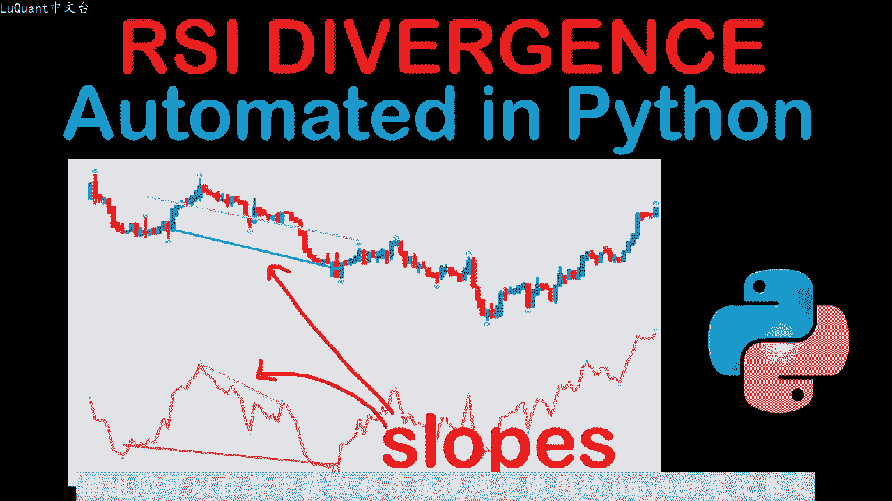
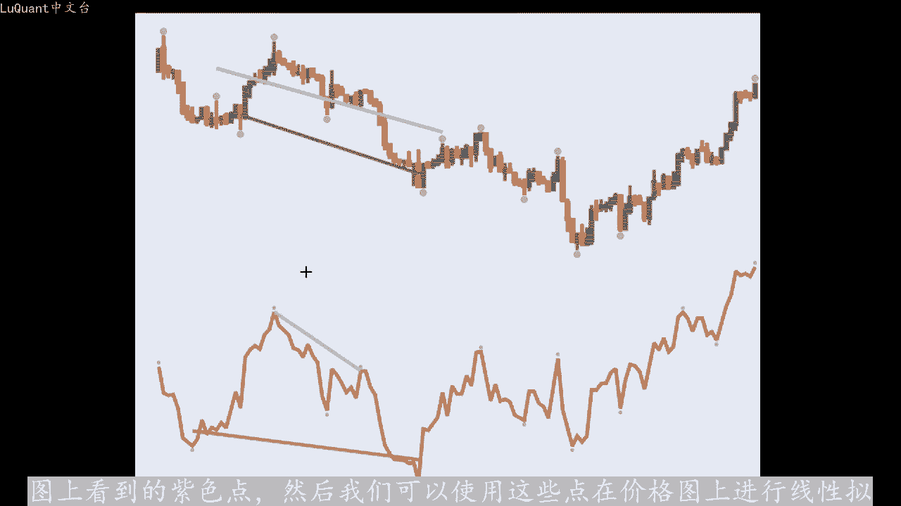
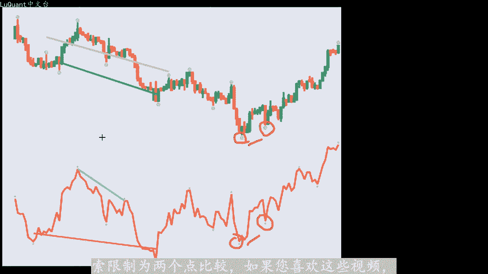
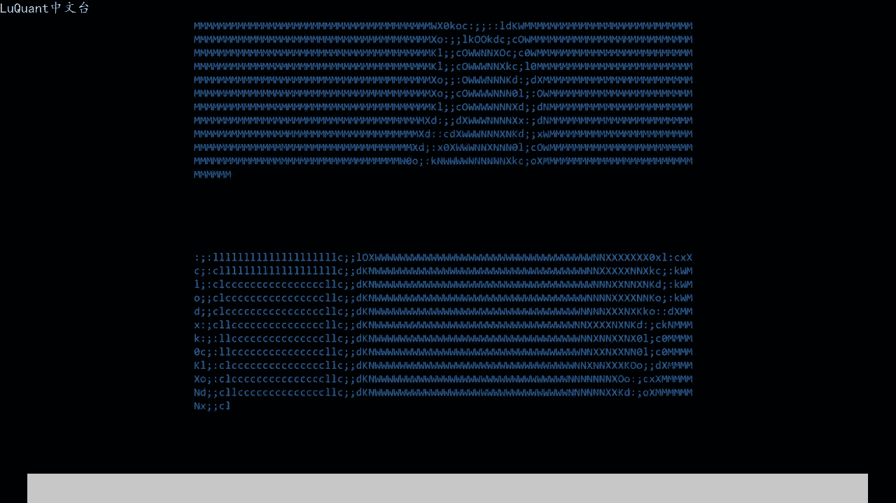
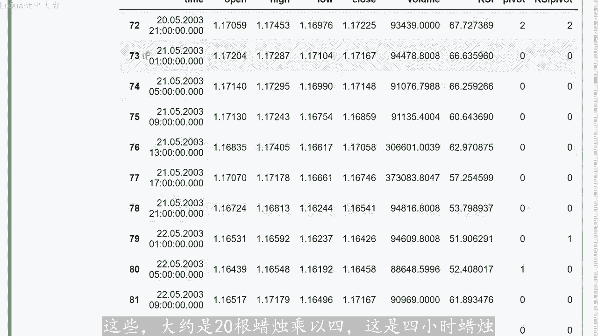
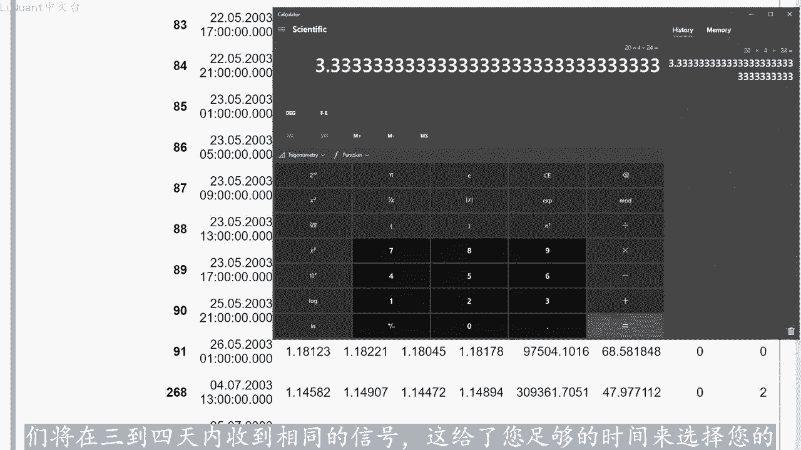
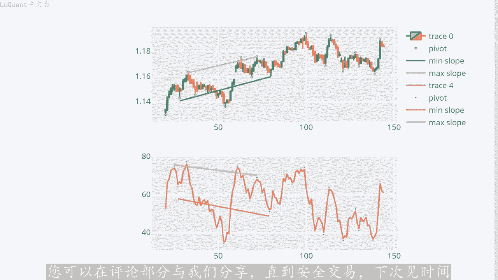
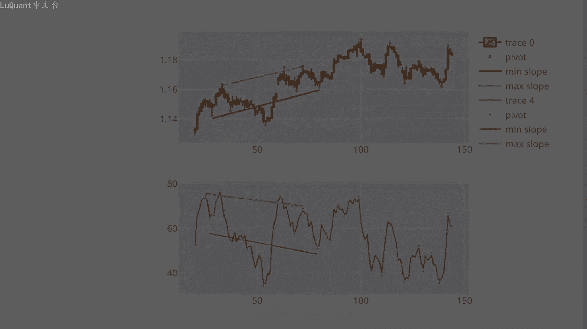

# python量化53：RSI发散 - P1 - LuQuant - BV1nm411d7wj

大家好，欢迎观看这个视频。所以今天我们正在处理RSSI背离，我已经看到了很多使用该指标的策略，并声称在我们继续之前在交易策略中使用它的潜在好处。我已将下载链接放。😊。

描述您可以在其中获取我在该视频中使用的jupiter笔记本文件。因此，我们执行此操作的方法是，首先编写一段代码来检测价格的最小值和最大值以及RSI的最小值和最大。

因此，这些是由我们在这张图上看到的紫色点标记。我为此使用的算法是。每当我有一根蜡烛的最高价，高于每一侧的5个相邻蜡烛。我就会考虑这一点作为最大值。类似的，如果我的蜡烛值较低。

低于左侧的5根蜡烛和右侧的5根蜡烛，那么这被认为是最小值。如果您想要一个极端，您当然可以更改这些数。最小值你可以说，我希望我的低点低于左边的十0根蜡烛，右边也低于1根蜡烛。在这种情况下。

你只能检测到墙最小值或强最大值位置。所以这是一种做事的方。😡，有不同的方法，方法可能性能更高，但这种方法对于述值方法非常方便，因此很容易放入代码中。实际上他或多或少工作的很好，除了某些情况。

例如您没有非常重要的下。例如这里的这一点，它就像一个非常低的下降，但它也被我们在这里使用的算法检测为最小值。例如你有一个由算法检测到的局部最大值，但它只是一。显示高值的蜡烛。

但由于这个高值高于左侧的5个烛台和右侧的5个烛台，我们的算法将其视为最大值，因此它并不完美，但它或多或少工作正常。我们。在程序的其余部分使用它对于RSSI效果更好。因为我们没有使用蜡烛图。

事实上我们只是使用简单的值，这与我们用来检测最小值和最大值的算法更具可比性。这是这里的一个事例。因此我。在此有1个RSI的最大值，此时我们有一个最小值，这些是我们在该图上看到的紫色点。

然后我们可以使用这些点在价格图上进行线性拟合。换句话说，我们将把最大值和最小值拟。

在一起，正如您在这里看到的，我们将有两个不同的斜律。例如。如果我此时有当前的蜡烛，我会回顾一下过去的20的蜡烛，我将检查最大值和最小值。然。我我将把最小值拟合到一个斜律中，这是我们在这里看到的绿色斜律。

而最大值将你合到这个紫色斜率中，换句话说，这些斜率是穿过数据的值。距离最近最大值点和最小值点，所以最后我将有两个不同的价格斜率，我将检查这些斜率是否为负。如果是的话，那么我知道我有一个下降趋势。

当然在相反。情况如果我的两个斜率都是正数，它们都指向上方。那么在这种情况下，我们有一个上升趋势。所以一旦我们决定哪个是我们的趋势方向，我们就可以对RSI最大点和最小点应用类似的方。将它们拟合成线性斜率。

更具体的说，在下降趋势的情况下，我们将寻找最小值，在上升趋势的情况下，我们将寻找RSI的最大值，并将它们拟合到新的斜率中。然。当我们有设置我们的斜率，我们可以将这些只与价格的斜率进行比较。

例如这里我们有相同符号的斜率，这意味着两个斜率都是正数。这意味着我们随着时间的推移，有更高的价格低点。并。我们有更高的RSI高点指向向上。所以在这种情况下，我们没有背离。

因为价格和RSI的斜率都指向相同的方向。并且我们在这里观察到的同样的事情，我们。一个价格下降趋势，这意味着斜率都是负数，它们的最大值和最小值。同时，RSI最小值的斜率也是负数。因此。

我们的价格和RSI都朝同一方向移动。因。在这种情况下，我们也不会出现背离。当我们价格和RSI之间的斜率符号不同，这意味着要么价格处于下降趋势，但RSI斜率为正，要么相反，我们的价格处于正上升趋势。

RSI斜率为负，因此有许多不同的方法考虑到这一点，我看到了一些策略，检查价格下降趋势的RSI最高点和价格上升趋势时的RSI最低。老实说，我还没有看到任何比较多项式拟合的斜率。

这只是我们在这里介绍的数值程序，允许我们一次获取两个以上的最大值或最小值点。所。想象一下，我们在数值上有3个点或4个点，最简单的方法就是将它们拟合到一个斜率中，然后使用这个斜率作为一个指标。

虽然该策略是在不同资源上在线描述的，但他们通常用于手动交易，因此它。描述的是不同点的趋势，主要是两个连续点。如果他们指向向下或上升趋势，但绝对不谈论拟合或者超过两个或三个点之间的多项式拟合。这让我想到。

下一个想法，我们可以简单的比较价格和RSI的最后两个最小值和最大值。换句话说，如果我在这里有感兴趣的蜡烛，例如我是今天我在这里向后看，我正在检查，这是一。😊，上升趋势。

所以我正在查看我正在寻找的价格的最小值，例如RSSI的最小值。但在这种情况下，我只采用最后两个价格和RSI的兴趣点。我正在检查这些点之间的水平差异。所以这里我。有一个更高的高点。

这里我们有一个更高的高点，所以我们没有背离，所以我们并没有真正使用这里的多项式拟合只是比较两个连续最小点或两个连续最大点之间的差异。我在这个特定指标的描述中更频繁的看到。意味着RSSI散度在本视频中。

我将向您展示我们的两种方法，我们将使用你和许多极值点的斜率来编码这种差异，或者简单的将我们的搜索限制为两个点比较。如果您喜欢这些是。

并且如果您发现这些有帮助，只需几秒钟按喜欢按钮即可。这是一条简短的消息，为该频道提供大力支持。如果您有任何意见，最好能对这些技术摘要的内容提供反馈。现在让我们跳到我们的jupiter笔记本文件中看。

如何用python编写所有这些内容，以便这是我们的jupiter笔记本文件。我首先导入pandas，然后从逗号分隔的值文件中读取数据，这是欧元对美元数据4小。那烛图从2003年到2021年。

所以如果您熟悉我之前的视频，您会知道我们已经多次使用同一个单元格。现在它只是读取定义。标题的数据并清除等于零的卷中的数据。因为这些天我们没有这样做有任何交易，我们对丢失数据不感兴趣。在我们的例子中。

我们正在重置索引，只打印数据框的前十行。😡，查看我们正在处理的内容，这样我们就有了蜡烛信息，开盘价、收盘价和收盘价音量列。我们有时间列，我们有数据框的索引，然后我导入ny，因为需要它。

我还导入panda。下划线它技术分析，这是一个包含我们预定义函数的模块，可以调用定义技术指标。例如RSI或其他指标。因此，我在数据框中定义一个名为RSI的新列。

是应用于我的DF数据框的ted side函数的结果，长度是标准值。我在这里使用14，我们当然可以将其扩展到我们想要的任何东西，我暂时就这样保留。在这里，我再次重新定义了RSSI函数。

我这样做的原因是我很好奇，那里有两种不同的方式，或者可能有更多不同的方式来定义RSSI这种方式由panda。under sport time模块提供使用指数移动平均线，而不是绝对价格。

而如果您熟悉RSI的公式，您可以简单的使用价格和蜡烛的收盘。这两种方法之间的视觉差异在于，当您使用指数移动平均线或任何移动平均线时，您的RSI会稍微平滑，因为您的极值将更接近。您使用价格的情况居中。

所以在我们不使用移动平均线的情况下，我们将在我们的研究中获得更极端的RSI值，这不会产生太大的差异。我只是简单的说，当我构建这段代码时，我很好奇，我包含。两种方法。所以如果你像我一样好奇。

你可能想尝试使用这两个函数，我将把它留在这里，以防你想对此进行实验。所以现在我们可以执行，并将我们的RSI添加。我们的数据中显然前十行没有任何值，因为在我们开始为RSI提供合理的值之前。

我们至少需要14根蜡烛。我们使用的长度参数在这里等于14。所以在其他中如。我要打印前20个蜡烛，然后从第14个蜡烛开始，我将看到我们有1个RSI值，然后我将尝试用RSI绘制数据的随机切片。

这些是我们的蜡烛，这是我们的价格运。这就是RSI。我们可以看到这些值是合理的。因为当价格下跌时，我们的RSI值较低。而当我们有蜡烛的上升趋势时，我们在RSI值，然后。将定义一个名为支点ID的新函数。

它将检测我的蜡烛数据中的输轴点。因此它需要一个数据针，它需要一个蜡烛ID就像我感兴趣的当前蜡烛的所引。我要测试的蜡烛之前的蜡烛数量，以及我感兴趣的蜡烛之后的蜡烛数量。我要检查L减去N一是否小于0。

这意味着当前蜡烛是否为如此间。我的数据框的开头，我无法看到N一根蜡烛后退。所以如果我去L减去N1，我是负的。所以我在我的数据框的边界之外，如果L加N2意味着同样的是。

数据真末尾的数据真大于或等于数据帧的长度。那么我返回零，所以我放弃这里的边缘情况，只是为了避免一些麻烦。然后我认为当前蜡烛是一个书轴IDD也是ID高的书。

我将检查是否在右减去N1和L加N2加1之间的范围内，以便将IDL加N2的蜡烛包含在我的计算中，将检查数据真低之时。意味着该蜡烛的最低值大于其邻居在L减去N1和L加N2之间的任何最低值。如果是这种情况。

则该蜡烛不再被视为低值。应。这不是一个低输轴点，我将书轴ide变量设置为0。我正在测试蜡烛IDL附近是否存在更高的值，这就是我正在测试的蜡烛。如果它是这种情。

下这个特定的蜡烛不再是其淋域的最高值或最高蜡烛。在这种情况下，它不被视为书轴点，因此书轴it high等于0。所以在我们检查。淋域中的所有蜡烛之后，蜡烛L我要看看我是否有一个书轴IDD和书轴ID高。

这意味着，如果该蜡烛同时比所有邻居蜡烛都更高和更低，那么我将返回一个类别号请。这里是第三个，否则如果它是一个低蜡烛，我将返回一个。如果它是一个高蜡烛，我将返回两个。在任何其他情况下，我将返回零。

换句话说，这个函数需要一个蜡烛需要一个数据针，需要一个范围再。😡，和N2之间蜡烛L之前和之后的邻居数量，它将返回蜡烛L的类别。L是书轴ID高还是书轴ID低是两者还是两者。

都不是那么我正在定义另一个名为的海。RSI数轴ID它的工作方式与烛台的书轴ID完全相同，但这次是针对RSI，我们没有RSI的高值和低值，它只是一个值。因此我。相应的修改了函数。

并且还保留了我们可以作为丑闻的返回值，获得相同类型的类别。现在我们可以使用这两个函数，我在数据框中定义一个名为书轴的星列。对于。行意味着每个蜡烛该列将包含以下类别，蜡烛是书轴ID高位还是书轴低位。

两者都不是。所以我们将所有这些都放在数据框中的新列中并应。我们之前在当前行定义的函数数轴ID使用5乘5。所以我在感兴趣的蜡烛之前取5根蜡烛。在感兴趣的蜡烛之后，取5根蜡。如果您不喜欢结果。

那么您可能需要考虑对这些蜡烛进行试验。那么对于RSI数轴，我们也定义了一个数据框中的新列，我们正在应用提供相同类型信息的RSI数据透视ID函数。现在我将定义两。新函数这些函数对于分析不是必须的。

但它们用于可视化我们正在计算的内容。并且我想要可视化这样的东西，我希望在书轴蜡烛上有。只是为了在图表上识别这些点，并能够直观的分析并查看发生的情况。以便这样做，我将定义这些点位置及所谓的点位置。

我的数据框我正在应用这两个函数应。😡，这些函数的工作方式如下，第一个是点位置X，它提供了一行或一个索引，如果它等于一，它将查找数轴列，我们将定位点低于蜡烛的最低值。所。如果我们有一个书轴。

也意味着我们有一个书轴低点。换句话说，该蜡烛是其邻居中最低的。那么我将在最低点减去类似的位置处放置一个点，例如一指数-3那么入。它是一个书轴高点，我将把该点稍微高于蜡烛的最高值。如果我们没有。

如果它不是一个书轴点，那么我们将返回一个n nine value，并不是真正。数值因为我们想在图表中丢弃它，那么对于RSSI，如果它是书轴低点则相同，我们返回RSSI的位置。单位一。

因此我们将点定位在正下方RSSI值。如果它是一个书轴高。我们将该点定位在略高于RSI值的位置。现在我可以运行这两个函数，并将这两个信息列添加到我的数据框中的两个新列中。好吧，所以我有这个单元格为了增。

点数让我们放5个，这样它就更明显了。我正在截取数据帧的一部分，我正在绘制嗯蜡烛，然后我添加与书轴蜡烛书轴位置相关的。高和竖轴低，我们可以定义标记的大小和颜色。当然这些都是美观的，让我们运行它。

并看看我们正在寻找什么。这就是我们的点的样子。一。验证事情是否进展顺利运行良好，我将放大切片的一部分，看看我们的算法到目前为止的表现如何。所以我们在这一点上有一个高数轴，在这一点上我们有一个高书轴。

这里也在这。😡，我们有一个完美的检测书轴低点，那么我们在这里有这些点，不知何故，它运作良好，你也很好，你总是有这些例外。例如这里的这个这个蜡烛就在这里，它不是一个真正。😡，高点它不是一个真正的拒绝点。

但因为它更高与他的邻居相比，他之前的5根蜡烛和之后的5根蜡烛，那么这个特定的蜡烛也被认为是一个书轴高点，这也是一个书轴负。所以这些不是真正的书轴，它不是真正的下跌，但他们仍然被我们的算法检测到。

我们可以尝试做同样的事情绘制嗯蜡烛图，但还添加带有点的RSI。如果我们只。此操作我们将得到类似的结果，我将再次增加这些标记的大小，因为使得读取事情对我来说更容易。是的，所以他对于蜡烛或多或少工作的很好。

但对于RSSI来说，他工作的很。😡，因为RSI没有这些高值和低值，你有一个像绝对值这样的点，然后它可以检测到相对于RSI值的相邻点来说是低点还是高点。现在我们有了算法。

检测峰值、高输轴点、低输轴点以及蜡烛图和RSI的ar。现在此时我们需要定义要考虑的蜡烛数量以检。感兴趣的蜡烛及蜡烛ID之前的输轴点。我要查找蜡烛ID之前的60个蜡烛检测该区域内的最大值和最小值。

然后尝试将它们拟合到斜率中以检测RSSI的散。因此，让我们定义8个nP数组或者最大值和最小值，及其此时的坐标，或可能是它们的索引价格的最小值和最大值以。RSI值的相同内容。

然后对于后蜡烛区域中的每根蜡烛，我们将测试我们是否有一个低输轴点。如果是这种情况，我们将附加其坐标。我们预定义的nP数组的最小值和某某最小值中，我们将测试它是否是高点，并且我们将在对应的数组中添加值。

对于RSI也是如此。如果它是1个DRSI数轴点。如。它是一个高RSI数轴点，我们将把所有这些点的坐标添加到相应的nP数组中，然后我们将把它们拟合到四个不同的斜率两个蜡烛图价格和两。RSI这请记住。

我们有最小值和最大值，因此每个图都有两个斜律，现在我们可以绘制它们，这样我们就可以将它们绘制在蜡烛图和RSI图。如果我运行这个，我们可以一起检查它将为我们提供什么。所以我此时打印了斜率。

只是为了验证值的大小，这也有助于我了解我们正在讨论的数字类型。这里我。有我们的结果如您所见，我们在烛台图上有两个下降斜率，因此这是一个下降趋势，在RSI处检测到相同的下降趋势。我们正在检测下降趋势。

我们有两个不同。下降斜率。所以我的函数经过验证，他们工作的很好，所以现在让我们继续看看我们可以用它做什么。如果您打算使用它进行交易，您会希望从分级中生成一个信号。所以我将我们之前定义的所有内容放。😡。

一个称为分歧的函数中信号它需要像感兴趣的蜡烛一样的型，然后它需要我们必须查看的后面蜡烛的数量，只是为了检测我们的RSI是否有分。并且在这个函数中，我定义了完全相同的方法之前。

我们刚刚用于绘制趋势斜率和RSI趋势斜率。我们只需要注意，当我们没有超过两个最小值或两。最大值时，我们无法拟合通过一个单点的任何斜率。因此，在这种情况下，我们返回零，这就是我们在这里测试的内容。

但如果不是这种情况，我们可以将它们放入我们之前解释过的4个斜率。😡，然后我将进行测试，如果蜡烛价格的斜率最小值大于10到-4，这意味着它是正值，最大值也是相同的，最大点的斜率也是正值。也大于10到-4。

但同时我们有这里价格呈上升趋势。但同时我的RSI最大值斜率小于-0。1。所以这是一。负斜率它正在下降，这就是我们出现背离的地方，价格显示更高的高点，但RSSI却显示较低的高点。

这就是我们在负面意义上出现背离的地方。因此，我们正在返回一个背。因此，我们预计价格可能会反转，并跟随RSI并跟随下降趋势，而不是当前的上升趋势。那么我们会遇到相反的情况，即我们价格最小值的斜率是负数。

因此价格正在下跌，它显示。较低的低点同时价格显示出较低的高点，因此这绝对是下降趋势，并且最小值的RSI斜率为正。因此，RSI低点显示。上升趋势反转。在这种情况下，如果我们没有这两种情况中的任何一种。

我们将返回两个信号作为信号。我们只是返回一个等于零的信号，这意味着我们没有任何背离，检测到当前蜡烛位置上的任何特殊情况。我。😡，使用散度信号函数，将此列添加到称为散度信号的数据框中。

我正在选取30个ho蜡烛，我只是查看感兴趣的蜡烛之前的30个蜡烛此刻，我们可以运行它并检查它在数据方面提供的内容。因此我们最终应该。这些可见信号处，每行的发散信号暂时为0。

但我们可以检查数据框中肯定有不同的值，通过过滤所有信号，例如所有等于一的信号，我们可以检查一下，让我们最后进行。所以这些都是一个信号，您可能会注意到，当信号稳定时，您可以有一系列行。

就像这里的不同蜡烛一样。我们有717。2345到90根蜡烛。所以看。通过我们在算法中使用的输入参数，当检测到反转或背离时，它会在一段时间内被检测到，而不仅仅是一个单一的蜡烛蜡烛。但假设在2到3天内。

这种背离已经稳。下来如果您希望进入市场，那么他为您提供了选择一个好的切入点的机会。并且您可能已经注意到，我只是简单的拿了一部分大数据真从0到500，所以只有50。根蜡烛。

其背后的原因是需要花费大量时间来计算此数据，而不是过多的时间。但我的CPU需要大约5分钟来处理此数据。因为对于每个我们必须回顾30根蜡。检查最小值，检查最大值，同时检查烛台是否适合RSSI。

所以看起来它开始对CPU造成沉重负担。当然，当您选择一个好的指标时，您可。如果您不喜欢，我们将最小值和最大值拟合到斜率中，并且您只相比较点，则可以根据需要启动任意数量的蜡烛。

然后只需等待半小时即可完成计算。在这一点上。我们可以做一些不同的事情。我们有一。修改后的转移信号来发挥作用。它几乎与前一个具有滑动差异的信号一样。我们将使用收盘价值和头寸或收盘价指数值。我们将。

蜡烛的最大值、最小值以及RSI来填充这些值。我们将蜡烛的收盘价拟合为多项式拟合斜率，这将定义价格的趋势。因此，如果我们有例如上升趋势意味。蜡烛收盘价的斜率大于10至-4。

同时我们的RSI最大值或价格本身最大值小于两个点。那么我们可以替测试M的背离，因为我们没有足够。点我们没有足够的最大值，如果收盘价的斜率为负则情况相反。因此我们有蜡烛的下降趋势。

但同时我们没有没有足够的RSSI点最小值点或足够的蜡烛最小值。我们也将返回零，因为我们现在无法测试背离。如果我们确实有足够的点，我们将首先检查。因此，如果我们有上升趋势。

我们将测试RSSI最大值的最后一个元素是。小于RSI最大值的前一个元素，因此这些是RSI最大值的最后两个点，我们是将检查它们是否显示出下降的水平。同时我们将测试价格本身的高点是。显示出上升的高点。

如果是这种情况，我们将出现背离，我们将返回一个和相反的情况。如果我们有下降趋势，我们将检查RSI的低点是否不断增加，价格的低点是否不断减少。在这。情况下，我们返回两个作为一个类别，这是一个新的背离类别。

否则如果我们没有检测到任何类型的情况散度，我们将返回零，我将把它作为一个新列添加到我们的数据框中。😊，其称为散度信号2，将散度信号二函数与30个蜡烛一起应用。

以记住我们的数据框切片包含500个不同的蜡烛。因此，从0到500，我们将尝试。信号添加到我们的数据帧中，它就在最后一列，我们将过滤例如等于二的信号。那么我们什么时候会出现分歧上升？

所以让我们检查一下我们的信号。在这里过滤等于一的信号，这意味着我们存在背离，并且RSSI显示较低的值，因此可能会逆转下降趋势。并且该信号中涉及的辣。在72到90之间91，所以我们有几天的信号显示。

如果我们想计算这些大约是20根蜡烛乘以4，这是4小时蜡。

除以24。所以这是一个在3到4天内稳定下来的信号。所以你我们将在3到4天内收到相同的信号，这给了您足够的时间来选择您的入场点。如果。

想如果您想加入市场，那么我们在268之间有另一系列信号，这是一个信号。然后另一个显示为358，指数注为350。到369，所以也大约是一天两天。我们正在测试从0到500的一段时间。

所以大约是两个月、两个半月、3个月。所以如果不是很多我们。这里有效的计算信号的数量，我们有两个信号，两个月内有两个信号周期。是的，还有一个买入信号，所以总共预计每月会使用4小时图表来绘制1到2个信号。

我们可以尝试实际绘制这些信。我们可以尝试绘制蜡烛图，比如说80号蜡烛，让我们在哪里可以绘制这个蜡烛图，让我们检查蜡烛的想法。比如说数字85看看发生了什么。所以确实我们有一个背离，价格的高点更。

我们的低点也更高，所以我们有上升趋势。RSI只显示下降趋势，因此算法是正确的，一切都工作的很好。我们可以看到这是一个检测到的背。如果我们考虑平均斜率程序，即使您采用两个不同的程序。

我们也可以确认这一点让我们检查一下价格的最后一个最小值。我们可以看到这些点显示出轻微的上升趋势，我们的烛台有较高的低。而这里我们有较低的RSID点，而且这些点在这里显示出这些点之间的价值略有增加点。

所以我们有1。17463，然后我们有1。175。但RSI的最大值显示下降趋势，所以RSI的高点较低，所以我们有背离。无论您使用什么方法，该区域都显示背离。但我猜什么是最重要的重要的。价格旁边会发生什么？

现在我不太熟悉使用RSI背离的策略。我刚刚构建了这个指标。所以如果你有任何想法，特别是如果你有交易这。特定指标的经验，我们可以一起研究这个指标，不要羞于在这一点上留下评论。

我已经阅读了很多使用该指标的策略，其中一些在你有RSI背离模式时，并行寻找特定的蜡烛模式或者其。一些正在处理RSSI背离，同时寻找支撑位和阻力位发生。所以无论如何，这是一个很好的例子。

这里我们有一个阻力位和支撑位，看看它在这一点上的反。然后回过头看看价格在同一水平1。16上反弹两次。我们确实有一个现在我在某处看到，如果你有上升趋势，并且RSI显示出较低。高点则意味着价格趋势仍在持续。

相同趋势将会更新，并且价格正在上涨。而正是在这里，它得到了事实上，价格正在支撑位上反弹。我认为如果我们也。在这里看看这些蜡烛，我们可以看到有长向上蜡烛确认的某种拒绝。

所以如果我们结合两个或三个不同的指标，我认为他们可以确认趋势仍在上涨，这就。价格所发生的情况，我们可以将止损绝对低于支撑位，并将止盈设置为止损距离的2倍或1。5倍左右。好吧，这就是本视频的内容。

希望你们发现这些信息有帮助。如果有。点赞订阅。如果您对使用RSI背离的行之有效的策略有任何评论，您可以在评论部分与我们分享，直到安全交易，下次见视。

