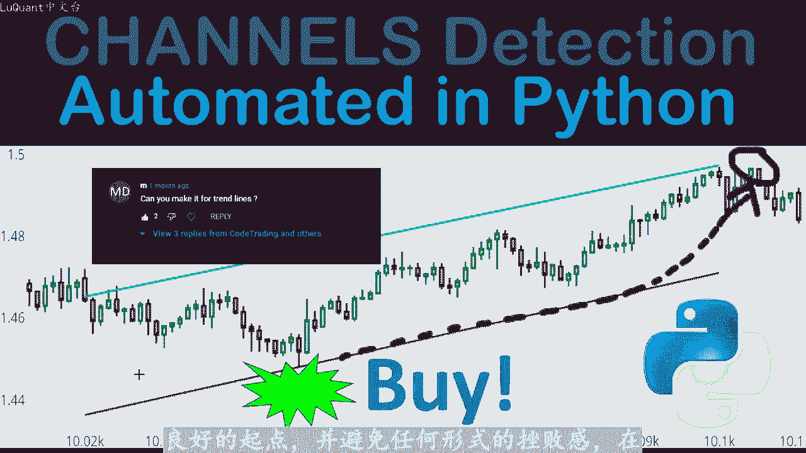
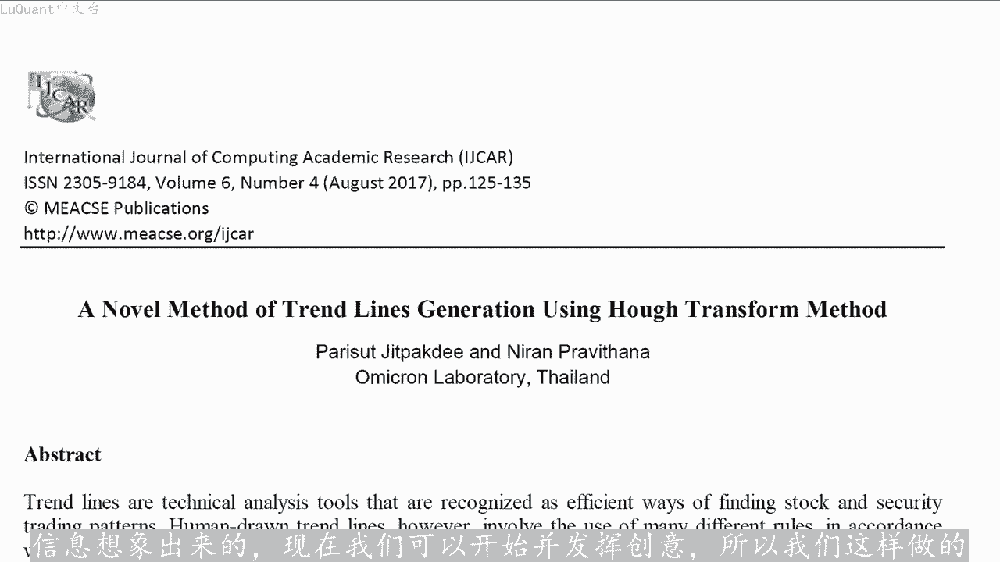
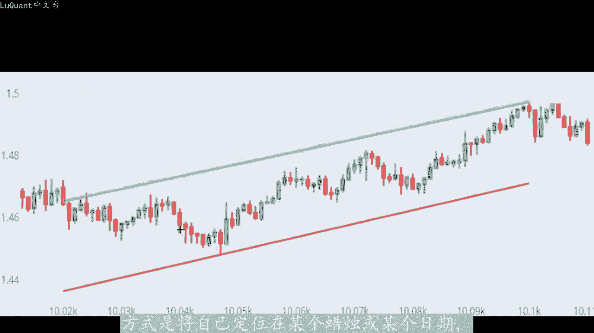
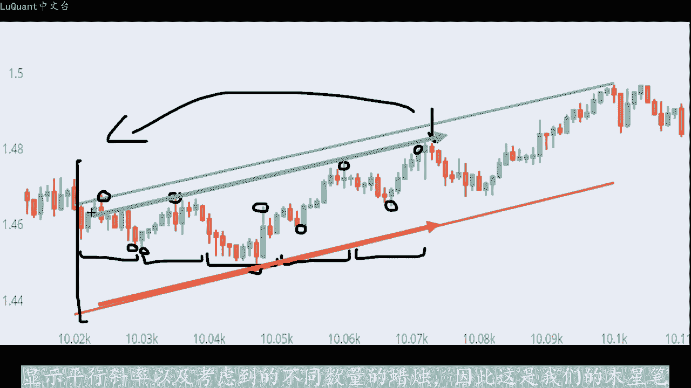
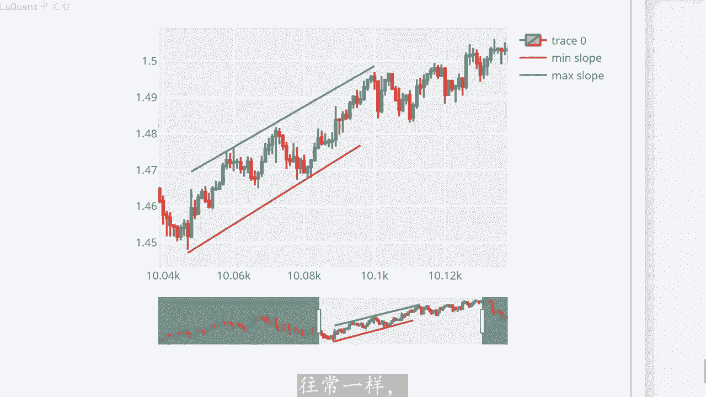
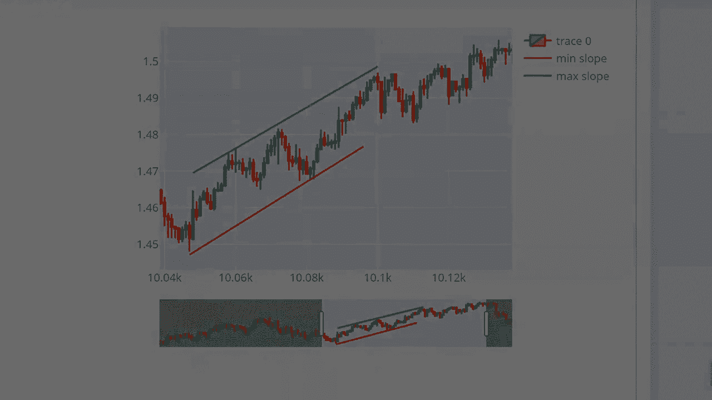

# python量化54：价格趋势 - P1 - LuQuant - BV1VJ4m177yg

大家好，很高兴您今天加入这个视频，我们将介绍一种检测价格变动通道的算法，我们将用pyython编写它。您可以从下面描述中的链接下载代码作为医生笔记本文件。这个想法是由评论部分的某人提。😊。

M先生或M夫人，无论您是谁，谢谢您的耐心等待，可能已经等了一个多月了。我希望这个视频不会令人失望，只是为了让新会员清楚这个频道的目的是教育性的。所以我们的想法不是提供您可以下。😊。

并用作任何目的的黑匣子的程序，而是解释思维过程以及程序是如何构建的。以便在本视频结束时，您将能够构建您自己的算法，可能以某种方式受到此视频中的算法的启发，并添加此。为介绍的扩展，我的意思是。

您可能正在观看此内容，但同时您有自己的交易逻辑。您希望按照我的视频理想的实现，该逻辑，将为您提供一个良好的起点，并避免任何形式的挫败感。😡。

开始该计划之前，我们应该了解一些事情。该主题仍然是一个开放的研究领域，这意味着我们仍然可以在学术和研究出版物中找到相对较新的研究，试图找到处理价格趋势和预测的完美方法。换句话说，由于我们将在计划中讨论。

😊，一些原因这并不是那么简单，主要是因为市场非常动态。我们无法坚持下去一组变量，只是计算出他在未来的其余时间里会很好的工作。趋势发生变化的时间内，事情往往会发生变化，而且趋势变化的速度也会同时发生变化。

所以这是一个非常非您试图预测的线性和动态世界。所以当应用于这样的环境时，只需接受数值模型的局限。因此我在这里介绍的算法完全是基于迄今为止，通过此渠道收集的简单信息想象出来的。现在我们可以开始并发挥创意。

所以我们这样做的方式是将自己定位在某个蜡烛或某个日。

因此，回顾过去，我们可以采取一定数量的蜡烛。例如，如果您正在工作，则为30天或30小时通过每小时图表或其他任何东西，我们可以计算一定数量的蜡烛。然后我们将把这个事。分成相等的部分。

在每个窗口或时间窗口的每个部分中，我们将找到最大值和最小值，它们是价格将触及的最高点和最低点。因此，我们将在所有相等的时间窗口内执行此操作。然后我们获取所。

最小值并将它们拟合到几乎涵盖所有这些点的多项式或线性拟合中。然后我们对最大值执行相同的操作。现在我们有两个斜律来描述最小值点和最大值点的趋势。请注意这些。是一级，这意味着我们处理的不是曲线，而是直线。

您可能还会注意到，这两个斜律并没有真正围绕价格。因为他们经过这些点，这就是多项式拟合的工作方式。因此为。😡，调整这一点，我们将提高这些斜率的节距值。这里我们有许多不同的值这样做的方法。

我们可以例如你和这些斜律来穿过最接近我们考虑的这个大部分大时间部分的中间的最小值点。例。这里的斜率将达到这个最小值，以通过这个最小值这一条将达到最接近该时间段的中间值的最大值，或者例如我将修改截距。

以便。两条曲线将简单的穿过，可以找到含义的最高点和最低点。我们可以在这个大时间窗口中找到的最高最大值和最低最小值。另一个问题是这个大时间窗口应该多长？例如我应该。当前感兴趣的柱后面取30个柱。

40个柱还是60个柱，这将是改变斜率，从而改变趋势通道的结果。因此，为了解决这个问题，我们将允许程序在负二循环中采用不同的值，但是这些值将受到用。输入的限制，例如。

我们将取该特定蜡烛后面30根柱加上或减去20根柱。因此，30和20是两个不同变量的两个值，我们将在每个程序之前修改它们。但随后程序将。30减去20之间慢游，例如50根柱到30加20。因此。

该特定蜡烛后面将有10个柱，它将检查我们为每个柱数找到的斜率。并。仅返回提供这两个斜率之间最平行情况的数字，因为这是最可能的情况。我们正在检测通道，这就是为什么我们会看到大多数结果。

显示平行斜率以及考虑到的不同数量的蜡烛。因此这是我们的木星笔记本文件。您可以从描述中的链接下载在这个视频中，我们首先导入pandas，我们将使用一个数据。

然后使用读取下划线CSV加载数据帧复制CSV文件的内容。所以在这里我获取了一个欧元兑美元文件，其中有4个小时的烛台，从2003年到2021。列的名称是时间开盘值、高低收盘值。

以及我们不会在该程序中使用的交易量。然后我将尝试检查我们是否有零交易量日或零交易量柱。其中可能市场关闭，或者由于某种原因，我们没有任何交。或者我们根本没有该特定时刻的数据，我们正在提高这些数据。

因为他们对我们不感兴趣，然后我们重置数据框的索引。因为我们已经删除了他的一些行，基本上就是这样，我们刚刚加载。数据只是打印了前十行，我们可以检查数据是由什么组成的。然后我可以将其可视化。

我有目视检查的习惯，只是为了确保这是有道理的。所以到目前为止，我们已经一切正常。现在我们可。😡，开始在由后面的蜡烛变量定义的时间窗口内搜索最大值和最小值。换句话说。

在这里我们将检查最大值和最小值点在蜡烛ID我感兴趣的当前蜡烛，之前的60根蜡烛。所以我在蜡烛编号8800处，我在该蜡烛之前查找60根蜡烛。

只是为了检查在哪里可以找到我们所在的最大值点和最小值点将存储在这些NP数组中。所以它被称。maxim和minium我们找到最大值和最小值点的位置的索引，存储在某某最小值和smax中，也是两个nP数组。

所以我们寻找的方。最大值和最小值是将后面的蜡烛切成小窗口的蜡烛的大窗口。换句话说，我正在考虑在我感兴趣的蜡烛之前的60根蜡烛，并且我将。间隔分成相等的部分或相等宽度的部分。即无每个蜡烛。

显然这些都是用户定义的变量。因此您可能想要尝试这些改变后蜡烛的数量。切片窗口的宽度，例如您可能会使用，我会说100个蜡烛，例如将它们分成每个10个蜡烛的窗口，我们正在寻找要存储。

这两个数组中的最大值和最小值点以及哪些位置将存储到这些数组中。然后对于I在蜡烛ID减去后，蜡烛之间的范围内。所以我们从第一个蜡烛直到蜡烛ID加一，这样我们就可以将当前。蜡烛包含到我们的计算中。

并且不长等于窗口的宽度。我们将在此处定义的这些值附加到最小数组中，因此它将是烛台低值的低变量。我们将在I和a plus窗口之间找到某些内容，这样我们就位于我们正在处理的切片内的窗口内。

并且我们希望提取可以提取的最小值，在这个特定的切片中找到并。其附加到最小数组中，同样的事情，我们将检查找到该最小值的索引。这就是我们在这里使用索引最小值的原因。我们将把这个值附加到某某中最小数族。

最大点相同，所以我们将最大点附加到最大数组中，注意我们在这里寻找高列高变量列，然后我们寻找其中的最大值，然后我们还使用索引max来替。我们要附加到smackax数组中的最大值的索引。

所以现在我有一个可以使用的不同数组，我将使用ny函数，我将用它来提供它最小值的索引。最小值以及我想要你和这些值的多项式次数。在这里我使用一个，因为我们需要一个直线斜率，我们不想进入曲线或更复杂的东西。

并且结果这个特定函数的返回值将。斜率和节距，我将它们存储到最小值的斜率和最小值的节距中。对于最大值，我们使用数组max和最大值相同的东西，我们有一次斜率，我们有一。多项是拟合，所以它会变成直线斜率。

结果存储到这两个变量中，现在我们可以尝试绘制这些斜率，看看事情是如何工作的。我要绘制直到蜡烛ID价。后面的蜡烛值，然后从蜡烛ID减去后面的手柄值开始。所以这些值之前已经导入了，所以我们不需要这些。

这是我们的烛台图，我将添加到。我们刚刚定义的斜率，因此X等于某某最小值，Y等于最小值的斜率乘以某某最小值，加上这些最小值的截距。因此模式是线。我们我。将把它称为最小斜率与最大斜率相同。如果我们运行这个。

我们会得到类似这样的东西，你可以看到，我们并没有真正将价格拟合到通道中。但我们有一个正确的拟合，不知何故我们。最小值适合一个斜坡，最大值也适合一个斜坡。这里的问题是，我们试图一次适合太多蜡烛。

所以如果我尝试减少这个数字，这里是100。假设我们取50和窗口，我要采取5个。如果我。再次运行这个我们会得到更好的结果。正如你所看到的，我们仍然没有调整拦截，我们还有更多的工作要做。

正如我们在本视频前面提到的，有不同的方法这样做，取决于您想要如何构建策略。现在一种方法是你。😡，结局已满足我们正在考虑的时间片中的最高和最低蜡烛点。换句话说。

我正在检查所有后面的蜡烛最高的高点和最低的低点。我正在你和我的坡度，以通过这些特定。我们这样做的方式是为最小值定义一个新的调整节距，为最大值定义另一个调整节距。

我们将计算我们可以在特定切片中找到的最小低点。我们刚刚计算的斜率给出的值之间的差异。因此，在我们具有最小值的特定点处，该最小点与我们的你和斜率之间的距离是多少？这个差异将是我们的截距。

我们将这个调整后的节距添加到我们。斜率方程中，然后我们的斜率将穿过这个特定的点，它是最小值，在最大值的情况下，它是最大值。所以我们执行相同的过程来修改最大值的调整结。这就是我们通过使用此过程得到的结果。

现在让我们看看它是否正常工作，这是我们的最小斜率。我们可以看到它正在穿过我们后蜡烛线中的最小点。所以如果我们重新获取所有这些后蜡烛图中的最低。😡，特别是这里的这个点，因此使用我们刚刚描述的内容。

我们迫使斜率通过这个特定点，然后最高点可能就是这里的这个点或某个点就是这个。我们迫使这个绿色斜坡穿过这里的这一点，正如你所看到的，它并不像我们想要的那么合适。所以我们将尝试一些不同的东西。

让我们尝试你和洁具，以便我们的斜坡，将价格蜡烛包裹起来。我的意思是他们。😡，高于最高点并低于最低点，实现这一点的方法是定义我们调整后的最大值和最小值的截距。

该截距等于我们可以找到的最大距离在斜率和最低点。最高点之间，换句话说，如果我发现这里的这条红色曲线，这个红色斜率高于低价的大多数低点，我将检查这些低价之间的最大距离是多少和斜率。它可能。

视觉上我们可以估计他在此处的某个地方，但我们将在数字上寻找它，这将是我们的洁句。我将修改我的洁句，以便我将这里的红色斜坡滑下来。所以它会经过所有这些的最低。所以我们并不是真正在寻找最低价格。

而是寻找最远的点或距离我的坡度最远的价格，我们将对最大值做同样的事情。我们在这里使用这两个方程来做到这。所以我在smackax处测量最高价格和斜率提供的价格之间的距离。通过计算所有这些价格的差异。

我可以提取最大价。我用来查找最大值的高劣值之间的距离，以及我使用powerfi函数找到的你和斜率对于最小值也是一样的。如果我们使用此过程，我们可以运行它，并绘制我们所拥有的。看起来更干净。

我们有一个清晰的通道，这是一个上升趋势通道，这两个斜律定义了价格再次攀升的幅度，没有完美的方法可以做到这一点。因为你可以看到，这将很大程度上取决。😡，你到底在寻找什么？你的策略会是什么样子？😡。

你现在想用它做什么？我担心的另一个考虑因素是，我们应该考虑多少根蜡烛，它可以是5040还是30，这取决于有时。拥有的价格，一个会持续几周的通道，有时你有一个会持续几个月的通道。

有时你的通道会在3到4天内被打破，所以使用恒定数量的后蜡烛图并不是正确的方。考虑到这一点，我们将更动态的定义它。我们将定义后面蜡烛的范围。所以我正在考虑一定数量的后面蜡烛。假设我们每天有6个后面蜡烛。

因为我正在使用4小时图表，所以如果。考虑我想检查我的通道15天到目前为止的平均值，但然后我将定义一个称为B范围的东西。如后面的蜡烛范围，这是我允许的范围修。厚蜡烛数量的程序。换句话说。

假设我的后蜡烛数量等于50，那么B范围等于10。因此允许我的程序测试从40到60后蜡烛的不同厚蜡烛值，如果我选择20。是30到70个后蜡烛，程序将选择最小值和最大值之间具有最平行斜率的情况。

因为这是我们最有可能出现趋势通道的情。通道，所以我们这样做的方式是我有我的蜡烛ID我有我的窗口，目前等于3然后，我有称为优化后蜡烛的参数，目前等于蜡烛，我们有之间的斜率差最。斜率和最小斜率。

所以首先我将其设置为等于100，它只是一个随机数，它必须大于我们现在可以实现的值。因为R1在后手柄减去B范围到后手柄加B范围之间，我们。定义4个nP数组、最大值、最小值以及最小值和最大值的索引。因此。

对于由221变量定义的后蜡烛图的每个值，我们将填充这些最小值和最大值。及其之所引到各自的nP数组中，我们将再次使用polyfi函数。然后一旦我们有了最小值和最大值的斜率以及截距。

我们将测试斜率之间的绝对。最小最大值来检查它是否小于我们当前拥有的斜率差，并且最初设置为非常大的值。所以现在我们要寻找这种情况，即这两个斜率之间的最小差以。我们的方式这样做的目的是。

每次我们要测试是否存在这种情况时，我们将定义新的斜率差及SL最小值和SL最大值之间的新绝对差。然后我们。优化后的蜡烛数更新为当前的R1值，然后优化的斜率最小值将等于当前斜率最小值。

优化的斜率最大值等于当前斜率最大值，然后两个节距也保存在内存。我们添加了这些优化值的选择斜率和节距，所以这个优化将再次保留在内存中，参数定义了最小值和最大值之间最平行的斜率的情。

所以我们将绘制我们的烛台，然后我们还将调整我们的洁距，以某种方式经历特定的点。这两个斜率将包裹价格移动的边辑。因此。如果我们将这。斜率绘制在烛台顶部，这就是我们针对一个特定烛台得到的结果。

我们可以在这里看到，I已经打印了优化后的蜡烛数，因此在本例中为46，请记住，这将。我们在此处放置的结果，因此我们放置了40个后，蜡烛加获捡1。

因此它将在30到50之间返回要测试的蜡烛小切片窗口宽度为6个蜡烛。我们正在测试蜡烛ID。三000的蜡烛，这里值得一提的是，有时您根本没有一个通道，您没有一个真正定义的通道及包装价格。在某些情况下。

他可能会很好的工作，让我们采用不同的蜡烛ID例如4000，我们可以看。它几乎是平行的，所以算法正在尝试找到我们有几乎平行的斜率的情况，我们也可以再尝试一个，例如让我们检查5000的蜡烛ID好吧。

这不是我们也可以检查。蜡烛ID让我们检查5000例如这里我们有另一个定义的通道，用于包装价格变动。无论如何，这个通道看起来更好。因此您可以看到它是并不是很完美，它不像我们想要的那样。

因为有时我们并没有真正的价格区。但算法仍然试图找到一个，所以它可能看起来不像我们希望的那么干净，决定总是留给我们。在这种情况下，交易者可以尝试进行更多优化，但我们仍然可以尝试进一步优化。

现在让我们尝试一些不同。方法假设我们不寻找平行斜率的情况，而是检查斜率最接近的情况，因为有时价格会有很大的波动，尽管可能有平行的斜率，但这完全没有意义。因。这两个斜律之间的距离定义的范围是如此之大。

以至于你不想在这个通道之间进行交易，这是一个很大的风险，这不是安全交易的最佳情况。因此，在这种情况下，我们将重复之前所做的完全相同的事情。😡，不是寻找我们之前使用的斜率之间的最小差异。

我们将检查分隔这两个斜率的最小距离，所以这是应该计算的距离，我们的距离等。最大斜率乘以蜡烛ID。所以我们考虑蜡烛ID位置处的距离，加上我们拥有的截距最大值，到目前为止，找到的减去最小斜率乘以蜡烛I。

加上最小值的截距，所以这是定义最小值和最大值斜率的两条直线之间的距离。如果距离小于我当前的距离，我们可以说我有找到。一个新的最小距离，一个新的情况，我有一个更小的距离。在这种情况下。

我将保存新的斜坡距离。所以这个来自之前的复制和粘贴，我将保存优化后的蜡烛树。当前的RE值，那么我还将保存优化的斜率最小值，优化的斜率最大值和截距一。最大值和最小值以及我们用来你和最小值和最大值斜率的点。

然后我可以绘制我们使用的内容，再次调整最大值和最小值的截距。我们可以调整一些参数进行实验。例如我不想。算法的范围提供很大的选择。我想说，我们需要100左右蜡烛，平均正负50个厚蜡烛。

然后如果我们查看结果，我们可以看到它几乎完美的包裹了价格走势，它看起来更干。😡，并且我们在该价格周围有一个清晰的通道，因此斜率是正的，因此我们有如果斜率为负则趋势为正，因此我们有负趋势。

因此在这种情况下，如果您想在该指标之上添加测。您可能会说好吧，在这种情况下，我将寻找买入头寸。每当我我非常接近最小斜率，我可以看到有一个烛台模式，有些特殊的东西，比如拒绝模式或看。😡。

吞没模式就发生在这个非常接近最小斜率的区域。在这种情况下，我可以进入一个负仓，设置止损损失低于此斜率，并将止盈设置为止损。买入位置距离的两倍或3倍。因此它将位于此处附近的某个位置。所以是的。

如果您想进行交易，那么您将获得小风险高回报在通道内部。有些人更喜欢不同的策略，他们检测通道，然后等待价。向上或向下突破通道，这就是他们将通过出售或购买他们的头寸进入市场的地方。如果你像我一样好奇。

我们可以检查另一个蜡烛ID，例如让我们以15000索引15000。运行这个这样我们就有了80个厚蜡烛的东西，这就是算法找到的内容，这就是它的外观。所以我可以放大，我们可以看到它或多或少是一个通道。

记住我们未。这里的这个特定的ID和这里的这个特定的蜡烛，这是我们到目前为止所拥有的。所以这就是算法发现的。你可能想尝试同时拥有两者，就像并形一样，这两个斜坡最平行的情。😡，同时也是最小距离。

因此我们可以尝试同时将两者放入您的程序中，我们再次运行它，我们将看到会发生什么，这几乎是结果相同。所以此时我们无能为。我们还可以再次尝试不同的蜡烛ID让我们说我不知道13或12000。

这里我们有一些东西，所以让我删除我们刚刚拥有的条件，补充说我将坚持自己的距离。😡，不再需要这条线了。是的，这是一个很好的算法，可以找到价格上涨或下跌的通道。正如你所看到的，它就像一个闭合三角形，好吧。

再见。这个视频之前，我们再进行一次尝试，假设101000个蜡烛，如果我们运行这个我们有54个厚蜡烛，这是最佳数量，这就是算法找到的结果。所以让我们放。我们有一些不错的东西，这里有一个拒绝蜡烛。

我们有一个很好的上升趋势。😡，而且我们有一个很好的通道内的价格变动，因此我们可以轻松的在此时建立买入头寸，并在低于最小斜率的某个位置设置至。然后随着价格上涨，利润是我们止损值的两倍或3倍。好的。

非常感谢您坚持这么久。我想这个视频就这样了，希望你们发现这些信息有帮助。如果可以的话，请喜欢并订阅。这将是对这个频道的大力支持和往常一。😊。

我正在等待您的评论，直到安全交易，下次再。

