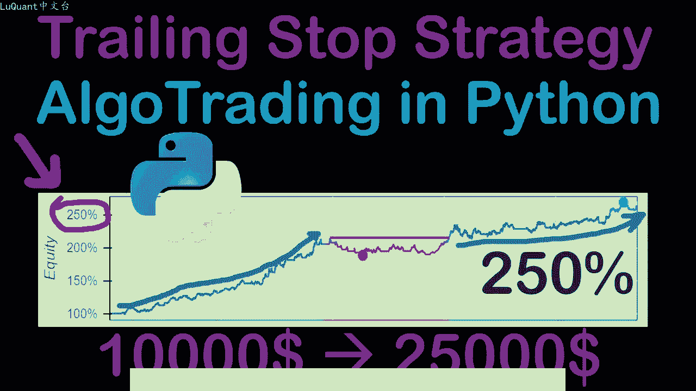
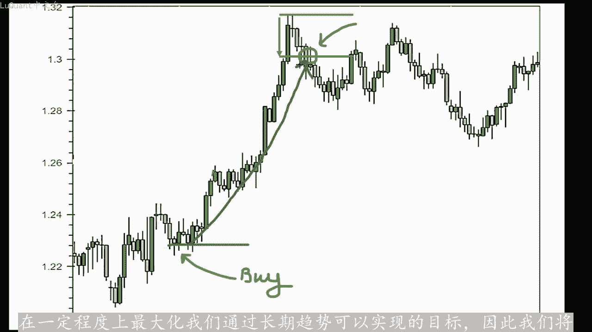
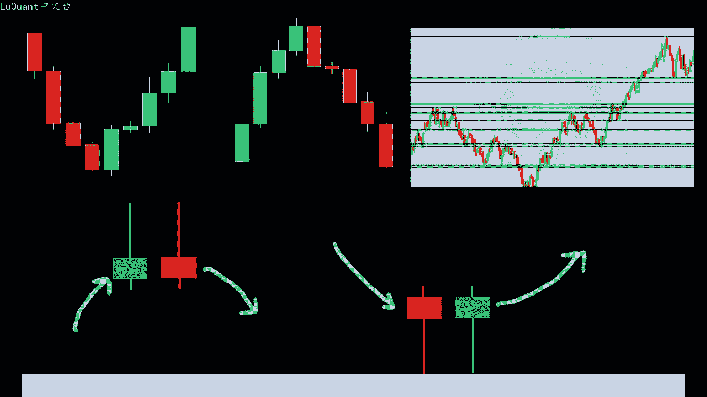
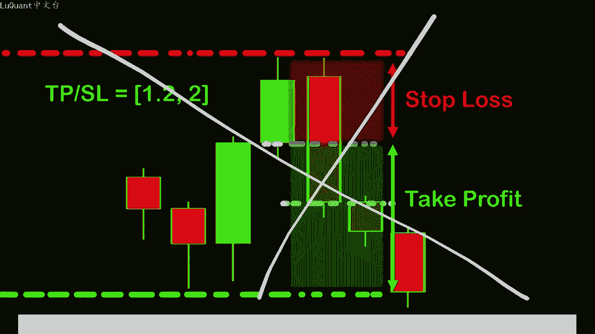
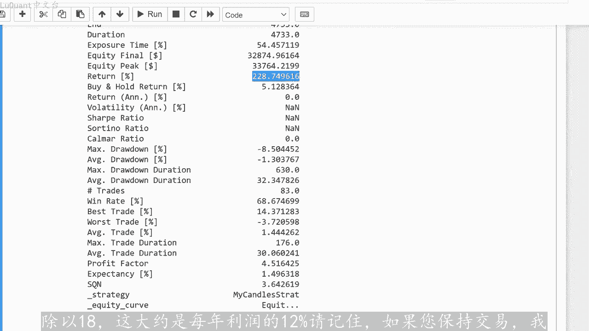
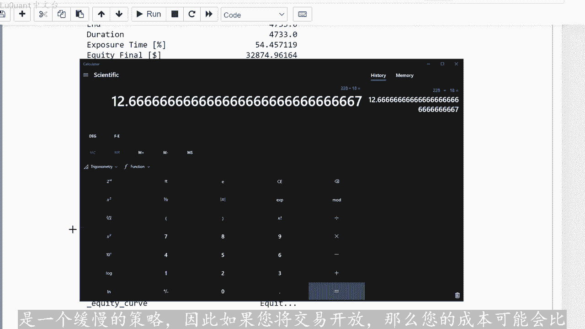
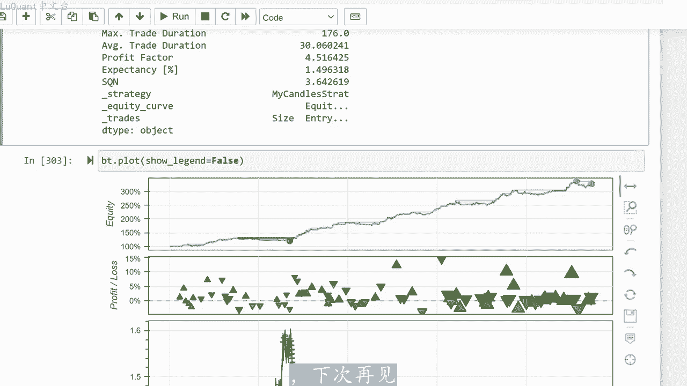

# python量化55：追踪指数2 - P1 - LuQuant - BV1rr42187FE

大家好，欢迎回来。今天我将向您展示如何在pyython中编写追踪止损代码，我们将把它应用到我们在之前的视频中已经介绍过的策略中，并在我们的网站上查看这种方法的结果。股本和我们的回报。因此。

如果这是您第一次观。😊，此频道，我建议您观看此播放列表的前几个视频，主要是最后2到3个视频。我们在其中详细描述了我们将要使用的策略，并像往常一样python代码是一个jupiter笔记本。您可以。

描述中的链接下载，这样您就可以自己微调参数并进行实验。请记住，这是一个教育频道，因此，目的并不是真正构建最终的交易机器人，而是相反，为了演示如何从算法交易。角度或我们将简要使用的策略中完成事情。

我们已经自动检测了支撑位和阻力位，并且我们将检测围绕这些特定水平发生的烛台模式。然后我们根据这些信号执行我们的订单例。

此时我们有一个买入信号，这是一个看涨吞没模式。前面有一个强烈的拒绝蜡烛。我们可以在这里看到，根据我们的策略，这是一个买入信号。所以如果我们执行买入订单，此时我们需要定义止损，通常我们将。

固定在距离我们的购买价格一定距离的点内。例如，在这里我们采取了这个距离，并且我们考虑到这个距离在我们的交易过程中将保持不变，只要价格朝着好的方向发展。我们将获利的方向追踪止损就会跟随价格。

因此在这个例子中，这是一个买入头寸，价格上涨，止损也是在一段时间内跟随价格上涨的一定距离，但仅限于一个方向。因此，如果价格试图回调，止损将保留在。😡，最后位置，如果价格回调并触及止损。

我们的交易将被平仓。正如您在此事例中看到的那样。因此，我们跟随价格从这个买入位置一直到这里的这个特定位置，然后价格开始回撤，止损值将保。不变，在这种情况下，它不会返回，否则毫无意义。

我们永远不会达到可以关闭交易的点。因此，在这种情况下，该值将保持不变，保持在最后一个位置，价格将回撤。当我们触及此处的这一特定点时，我们将解。😡，交易。这将是我们能够最大化利润。

特别是当我们有长期价格趋势时，我们不会使用止盈值提前结束交易，这会限制我们的利润。我们将让止损跟踪，跟随价格运行，这样我们就可。在一定程度上最大化我们通过长期趋势可以实现的目标。因此。

我们将再次将此事例应用于我们之前详细介绍的策略和之前的视频。因此，我们将使用我们已经详细介绍的相同程序。如果您不知道这些，您可以打开播放列表。

检查最后两个或三个描述的视频烛台模式以及支撑位和阻力位检测的自动化。唯一的区别是我们不会像之前描述的那样使用固定止损或止盈比率。但我们。

在最后，用追踪止损代替他们，我将回测此策略向您展示，我们可以通过使用此追踪止损方法获得什么样的回报。因此，这些是我们之前使用过的部分。我不会为了实现此目的，而在这些上花费太多时间，首先视频较短。

是我们要加载数据的单元格，这是欧元对美元的每日蜡烛图。从2003年到2021年，我们将使用一系列函数来检测支撑和阻力位，还可。通过流星和烛台的拒绝模式，再次检测蜡烛的吞没模式。

如果您想了解这些代码的详细信息，可以在之前的视频中找到信息。那么我们将生成我们的信号。如果是买入信号，我将写入2。如果。卖出信号，我们将写入一，如果在特定蜡烛上没有任何信号，我们只需将信号型保持为0。

这就是我们的数据框，是这样的，我们有开盘价、最高价和最低价，收盘价是我们不。用于此策略的交易量，以及我添加到数据框中的信号列。然后我我将使用回测包来回测该策略。该包是再次播放列表的最后一个视频中引入的。

因此我们需要定义一个名为sign的函数，该函数将简单的放。我的策略类所需的数据真的信号列，然后我们开始回溯测试，因此我将从回溯测试中导入策略，它是回溯测试包中的一个类，并且我还将导入nP回测类。

因为我们。在这里使用它，我们需要来自numpty包，我将定义我的类称为我的蜡烛策略。它继承自策略类，我们将重写两个函数，初始化函数这个和下一个函数如回溯测。包文档所述，然后我将定义一个变量即止损轨迹。

该变量等于500乘以10指数-4，具体取决于您此处数据的精度，我们的精度为10到-5。所以这是一个我们可以进行实验的值把600650等等。快速尝试了几个不同的值。我发现。

对于初始化函数中的止损轨迹500乘以10减4距离有很好的结果。我们将从这个继程类重写该函数，我将定义类的变量sign一属。等于函数I这里定义了一个指标，我们还重写了策略类的函数指标。在这种情况下。

我的指标将是我们定义的信号函数的返回值之前，您在这里可以看到的内容。换句话说，这些。我在数据框中注入的最后一列的值，因此这是一个信号，将告诉我是否应该在该特定行买入或卖出头寸。

这意味着在这个特定的烛台上，这也意味着这是我们要出售或买入头寸的特定日。然后我们重写下一个函数，该函数也在每个烛台上执行，这意味着我们交易历史中的每一天。

我将假设止损跟踪值等于我们在这里为类别和交易中的交易定义的。因此。如果我有未平仓交易，他们都会记录在交易列表中的某个位置，并且对于此中的每笔交易交易列表，如果交易很长，并且有止损，我将执行以下操作。

所以我不得不说，交易点止损新的止损值。等于这个金额，并且这个金额等于这部分之间的最大值及交易当前交易止损，或者如果交易没有先前定义的止损，则称为负MP点无穷大。意思是减去无穷大。因此它是这两个值之。

和止损的新值及当前蜡烛的收盘价减去我提供的止损追踪距离。换句话说，该追踪止损只能向上，不能向后，因为我们总是去。止损和新止损值之间的最大值，这对于多头头寸来说是正确的。

但是对于其他头寸及空头头寸、空头交易头寸，我们将采取相反的做法，将取我们在这里定义的就止损值和新止损值之间的最小。如果您发现这种尴尬，您可以在他们的网站back testing pie上找到更多信息。

他们在gass up上，您几乎没有可以帮助您进一步理解的事例，但这需要一些时间。因为您有大量信息。大量课程需要阅读，否则如果我有一个等于二的信号，并且我的交易长度等于0。

这意味着我在当前状态下没有任何未平仓交易。我将开立一个新的买入头寸多头交易，其止损值等于SL1该。在此处定义，这是当前蜡烛的收盘值，减去止损值。我们在这里定义的损失轨迹距离同样的事情。

如果我有一个短信号，意思是，如果self signal一等于一，同时我暂时没有任何其他为平仓交易，那么我将打开。交易是一个带有一定止损的单元格头寸。如果您不关心是否有未平仓头寸。

我将使用与止损轨迹相同的方法在这里定义止损。我的意思是，您想要允许要同时拥有两个或3个，甚至更多为平仓头。您可以简单的删除此部分。在这种情况下，每次您收到信号时，您都将打开一个新交易。

无论您是否已经打开了上一个交易，或者不是这样。如果您有一笔未平仓交易，您可以并行开设一笔新交易或者第三笔。第四笔交易，只要你有这些信号，如果您想在整个交易年度中挤出最大交易量，那么我们可以使用回测函数。

我们将向他提供逐台值的数据框，然后策略类记住这。我在这里定义的策略类，所以这就是我在这里的所有策略。我们将给出一个初始值现金价值1万美元。我将佣金重置为0到目前为止，我不想使用佣金。因为我想知道在没。

任何其他参数的情况下，事情进展如何？但是当然一旦您调整策略，您就可以添加佣金，并检查您可以从算法中获得多少回报。然后我们可以运行回测方法，并将统计信息存储在名为state的东西中。我将打印此内容。这就。

我们在这里得到的内容，所以我不打算在这里查看所有细节。因为我们在之前的视频中已经解释过这些，更有趣的是检查回报百分比。因此，我们使用此处使用的当前参数获得了162%的回。我们当然可以尝试不同的方法。

例如，我要在这里删除这个，我可以将其剪切，并暂时放入注释中。只是为了增加我们的交易数量，我将再次运行它并检查我们拥有的内容。所以我们大约有161个，这几乎是相同。实际上变化不大。

或者也许您想添加轨迹距离，让我们运行它并查看结果，这样我们就有了减少。我们有149%的回报。记住我们有160，让我们尝试一些小于500的东西，例如500450。我们的回报率为65%。

所以不值得我要回到500，这是我们目前的最佳价值。因此有了500，我们将获得161%的回报。那么我们的最大回撤百分比为负10%。最大回撤期限为1069天。因此，当我们看到回报时，这实际上非常重要。

这太好了，令人难以置信。我的意思是，在18年里，他赚了161天，可以。😡，每年几乎是9天，这作为回报来说还不错。然而您交易的条件并不是很好。这样看，您必须等待特定的交易。例如，最大交易持续时间为495。

因此超过一年，您必须。交易保持开放状态，超过一年，为了获得结果，可以通过减少追踪止损来修复这一点。这意味着我们已经采用了该距离的高值，或者您可以返回并修复此程序中策略中的其他参数。例如我将让你。

这些参数进行微调和实验，需要花费很多时间，所以这是最难的部分，实际上只是更改参数并检查结果，而不是迷失在所有这些中。无论如何，我们的胜率是69%，这是令人惊讶的，最好的交易分比是20%，这也非常。

所以最差的交易百分比是-3。8，这是很好的结果。所以我们的策略实际上并没有那么糟糕，但您需要调整它已适应真实的交易习惯。但您不。真正开仓并保留两年才能获得结果。您必须开仓，并在最多一两个月内平仓。

因为请记住，我们现在使用的是日线图，我很好奇尝试一下。每小时图表或4小时图表上使用相同的程序，但我们必须重新调整所有参数，以适应这个新的时间尺度。

而我在上一个视频中没有的一件事是我实际上拥有的绘图功能下载并安装了就版本的反向交易库。就是为什么他在我之前的视频中不起作用的原因，我更新了版本，现在我有了最新的版本，他似乎工作正常。

所以这是我们要从中获得的权益100到250%，这里实际上是262%，因为我们的回报率为161%。您可以多年来观察您的进。我们可以在这里观察这个回撤期的长度。它在我们进行利润交易的同时。

以红色标记丢失的交易，用红色和绿色标记交易的大小反映在三角形或delta符号的大小中。然后我。可以在此处观察烛台图，您可以看到我们进行的不同交易。您可以看到我们允许同时进行多笔交易。因此。

由于此时我们有多个信号，这一个是吞没信号，这是一个看跌吞没信号。因此我们可。在此时卖出，这也是一个吞没信号，拒绝信号，这也是一个卖出信号。正如您所看到的，我们有不同的信号导致不同的交易。

同时并行开立不同的订单。所以我要做的是测试我们可以得到什么样的结果器。我们是否可以将他们放在这里？这样我就不会一次允许超过一笔交易，我将再次运行此操作，这就是我们现在得到的结果。我们可以看到我们没。

两个或更多交易交易同时开立，因此，我们一次只有一笔交易，看起来更合适，且风险更小。在这种情况下，我们还可以添加一个条件来平仓我们的未平仓交易，以防我们遇到相反的信号。

这样我们就可以平仓在此处进行交易的条件是我。满足止损值追踪止损，或者如果我们在这种情况下遇到相反的信号。如果交易是多投，同时如果我们有等。一的信号我们可以在此处添加，这是一个卖出信号。那么我将关闭交易。

我们可以对其他交易应用相同的操作。因此，如果我们有空头交易，并且信号是买入，我们将关闭该特定交易。因此这两个交易是额外的。在这种情况下，我们不。仅通过使用止损值来关闭交易。而且当我们遇到相反的信号时。

这将减少我们的交易长度。因为正如我们所见，有些交易太长了，我们有等待一年或一年半来关闭一些交易。在交易生活中是不真实的，我们必须使其更适用。所以这就是为什么我们添加了这两个条件。所以如果我运行，第一个。

我要检查对回报率的影响，我们现在的回报率为228%，这是一个巨大的回报，然后我们的最大回撤减去百分。8。5%平均回撤为1。3%，最大回撤持续时间是两年，差不多两年了，这仍然很糟糕。

我们仍然有一些需要微调的地方，但看看盈利，我们的交易中有68%是盈利交。最好的交易是14，最差的比率是-3。7，最大的比率是现在交易时间减少了176天，比以前好，虽然仍然很长，但是比以前好很多。

不到一年只。半年，所以我们可以处理这个问题。记住，如果我们使用的是日线图，预计如果您不耐烦，并且希望事情进展的更快。那么您必须降低蜡烛的时间尺度，也许4小时图对于算法交易来说是一个好处。

它在某种程度上是慢交易和慢交易之间的折中方案，极快的交易，这些类型的算法作用不大，平均交易持续时间是30天，一个月，这是完美的。你有你的回报，我们有我们的回报百分比，我们有我们的平。😡，交易持续时间。

这两个参数都非常好，很好。换句话说，1万美元，您最终得到的金额是32800美元，峰值是33000美元。所以它离我们的最终净值不是很远。从图形上看，这就是我们所拥有的。所以我。没有。

我们以前见过的那些较长的提款持续时间不再有，我们有更短的东西，所以更短的提款持续时间。从这个角度来看，我们的净值看起来非常有吸引力。正如你从这张图中看到的，我们的绿色多于红色，所以我们的大部。😡。

评级正在赢得头寸。如果我们想进一步查看蜡烛图，例如，我们可以看到，在发出信号之后，一切都进展顺利。因此，我们在这里有一个相反的信号，对于这个空头头寸，我们在这里有一个买入信号，所以我们平仓单元仓。

在这里和这里都是一样的。所以这里我们有一个亏损的交易，这是一个单元仓位。我们这里有一根看爹吞没蜡烛，所以我们在这一点上卖出。但随后我们有一个不同的信号。所以这。😡，一个亏损的交易，这也是一笔亏损的交易。

我们有一个看涨吞没模式，这里有拒绝蜡烛，所以这是一个看涨信号。我们在丑闻开始时都持仓，而且价格似乎下跌，而不是上涨。所以我们在某个时候平仓因为这根蜡。😡，具有很长的拒绝尾部，并且它正在宣布下降趋势信号。

所以无论如何，当您在这里有混合信号时，很明显，我们应该远离这部分市场。没有交易者可以猜测这样的未来价格变动。因为看看所。这些拒绝故事，所有这些蜡烛都以某种方式显示出我们有混合信号。

算法在这里搞乱是正常的。因为任何交易者都会做同样的事情，最明智的做法就是远离这些时期的市场。所以每年的金额是220。除以18，这大约是每年利润的12%。请记住，如果您保持交易。

我们没有考虑佣金、吊期幽灵和任何其他费用隔夜。当您将这些交易开放一周。

一周以上时，一些经纪商会向您收取更多费用。正如您所看到的这是一个缓慢的策略。因此，如果您将交易开放，那么您的成本可能会比您想象的要高一个月左右。但无论如何，这是一个获胜策略。

我的意思是考虑到阻力支撑位和烛台模。😊。

肯定会给您带来相对于市场的优势。所以这就是本视频的内容。我希望你们喜欢它，我希望你们觉得这些信息很有帮助。如果有的话，请喜欢支持这个频道，虽然不多，但他确实鼓励我继续构建这些程序并。😡。

您展示更多可以在交易中使用的策略。还有一件事，这些想法中的大多数都来自评论。我正在阅读并收到您发来的电子邮件。不幸的是，我没有时间立即提出所有想法，但我认为我们都可以。😡，讨论中受益。

所以请不要羞于在下面留下评论。如果您是该领域的初学者，也请不要犹豫，您可以发表评论。我可以告诉您从哪里开始学习，如何构建此类程序，感谢您这么长时间的关注，请继续关注更多信息，下次再。😊。

