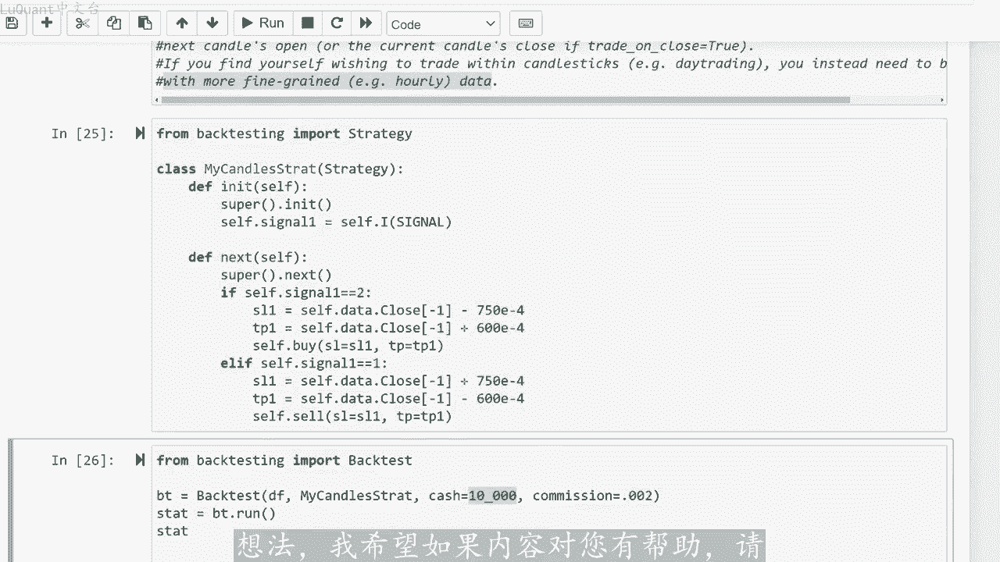

# python量化56：回测综述 - P1 - LuQuant - BV1pm411k7UT

大家好，欢迎回到今天的另一个视频。我想讨论一些对我们的交易策略非常重要的事情。这是回溯测试。到目前为止，我们提出了不同的策略，我们仅依靠统计技术来检查我们的模。😊，估计是否可靠，对于交易回测。

我们的策略带来了一个额外的信息，吉您在一定时间内将赚取的利润金额。这个利润百分比对于定义，您是否正在考虑？您的策略进行任何类型的投资非常重要。所以在我像往常一样继续之前。

该代码是一个jupiter python笔记本。您可以从该视频描述中的链接下载，并且该主题是由您的一条消息提出的。因此再次感谢您分享您。😊，想法从您的反馈中获得非常有趣的想法。

如果我没有时间讨论所有提出的想法，但我保留了一个列表。我想我们现在将其用于回溯测试工。网上有很多可用的库，我并不真正了解所有这些库。因为老实说，我更喜欢用这种方式编写我自己的函数。

我确切的知道我的代码内部发生了什么，特别是在回溯测试方面，我们需要一些真正可靠的东西。但是在建议的包中，我有两。😡，选择要么使用名为vectorpt的包，我发现学习起来有点困难。

因为你无法在几个小时内真正学会它，并开始将它用于你自己的策略。我面临的问题是，在我看来，文档有点稀。😡，而且我有很多细节通过论坛和在线事例进行挖掘。据说它具有巨大的潜力，它是一个很好的软件包。

有很多选项，但是我不愿意仅仅为。测试一个简单的功能，而花一个月的时间来熟悉所需的功能。该视频的策略，我选择了第二个选择，该包称为back testing pie。在我看来，它提供了一种更简单的方法。

好吧，所以让我们跳入其中看看我们的策略对于我要测试的这个事例会赚多少。😊，之前的策略，所以我完全采用了之前视频中关于该阻力的文件，并支持自动检测和蜡烛形态检测。因此这是两个组合在一起的指标。

我们将在本视频中使用。所以我将跳过这。部分之前已经解释过了，所以这是我们加在数据和清理数据的地方。然后我们有支撑和阻力函数检测。所以如果这是您第一次在这个频道上观看，我认为最好返回并检。

之前的内容视频如何检测支撑和阻力功能，以及我们正在解释如何检测吞没模式。流星和上吊线所有烛台的常尾拒绝模式的视频。在这里我。将计算我们的信号，它是买入信号吗？或者是卖出信号，或者可能暂时没有任何信号。

因此，如果我们接近支撑位，我们将考虑买入信号，然后我们会在支撑位旁边出现拒绝烛台模。或者反之亦然确实。如果我们接近阻力位，并且阻力位旁边的烛台显示拒绝模式，我们将考虑卖出信号。因此我们标记了两个信。

稍后将在数据框中填充一列，我必须运行这个单元格并运行这个单元格。然后我只需计算我收到了多少个信号，只是为了检查我的功能是否正常工作。所以我收到了98个销售信号，我们还可以检查此。我们有87个购买信号。

请记住，我在这里考虑了大约18年的数据。我认为是从2003年到20月21日，此时我必须更改我的专栏标题，以便他们能够适合以下内。😡，与我们使用的backag testing pie包兼容，它区分大小写。

因此我们还必须尊重大小写和列的名称。在这里我更改了列的名称，以便可以识别它们。但我也首先选择一系列。让我们一起检查所有行，然后我们稍后将应用一些选择。简而言之，我的数据框包含以下内容。

我们有时间我们有开盘价、收盘价和收盘价，我们暂时不打算使用的题。我们有之前刚刚计算过的信号，我将定义一个信号函数。它简单的返回，我们已经计算出这一系列或这列数据的信号。稍后当我。

要定义我们要使用的策略的类时，将需要这个框架。所以现在我们到达最有趣的部分，即定义我们的策略，并对其进行回溯测试。我从网站上保留了一些评论以及back testing pad文。

因为我发现在构建类时记住这些非常重要，所以他们说新策略需要扩展策略类，并重写其两个抽象方法init和next。所以这些。我们将重写两个函数来构建我们的策略。其中的方法我认为是在您第一次调用该类时。

在策略开始时初始化第一个变量或第一个函数，以便在理想情况下运行策略之前调用。它用于预先计算策略所依赖的任何指标和信号，因此需要计算的任何内容都必须在这个init函数中完成。它在类开始时仅运行一。

现在调用下一个方法，接下来，它会被回测实例迭代调用，所以这很重要。这实际上是您要调用信号并向市场应用诸如卖出和买入头寸之类的操作的地。back testing pie无法在烛台内做出决策和交易，因此。

它要么被执行或者订单，要么以蜡烛图的收盘价或开盘价执行。了解这一点非常重要。因此，任何新订单。将在下一根蜡烛的开盘架。如果您使用的是四根蜡烛直行，及当前蜡烛的收盘价小是烛台图或每日烛台图。

您需要更精细的东西我。意思是您需要在一天中的特定时间执行订单，我们可以简单的使用每小时数据。例如，这个backag testing pi在这种情况下仍然可以工作。好吧，所以让我们看看如何编码。

我将导入测。这是一个交叉点，这是慢速移动平均线与快速移动平均线交叉的一个例子。这是他们买卖或平仓的信号。所以我将删除。现在我将定义一个新类，我将这个类称为我的蜡烛策略strap。

它将采用我们刚刚导入的策略作为参数。我首先要定义in内。就像他们建议的那样，在其中我将其称为虚拟函数。我不知道它是什么，我不知道他做什么。😡，只是建议将它放在那里。他可能在我们的情况。

但我只是将其保留在这里。然后。像某种变量一样，调用self signal一，该变量失内的成员将等于self点。I我是在该策略内定义指标的函数，所以我正在重载这个函数和。

用信号函数提供它信号函数将从我们的数据帧中带来计算出的信号。现在数据将成为我们类的一部分。所以我们的类，我们的策略类是现。从我的数据帧中知道了这个称为信号的指标，所以这是使用它的最简单的方法。

这是我能找到的最简单的方法，也是你第一次学习这个的最快的方法，只需使用普通的pyython定义你想要的任何内容及。经典的pyython函数和示例将所有内容放入一列中。如果你有多个信号。

则将它们放入更多列中，只需将它们放入数据框中的列中，定义将返回这些列的值的函数，然后将它们作为指标注入。您的类中，只要您遵循这种方法或此处的符号，您可能可以拥有任意数量的两个、三个或4个指标。

因此请记住，使用I函数非常重要。这样对于正在考虑的每根蜡。信号将是特定于此蜡烛的确切值。如果您不将I函数放在这里，您只是简单的发出信号，您将同时注入所有数据，您将拥有一个s。数组。

而此处的指标函数是将选择一个特定于当前处理的蜡烛的值，因此，选择一个与我们当前正在读取的蜡烛相关的值非常重要。然后我们定义另一个函。它是我们类中的下一个函数，并且再次我我要放置super next。

我不知道它有什么作用，他们只是建议我们放置它。在我们的例子中，它并没有太大变化。所以如果信号是二货当前蜡烛，我们。定义止损值并指盈值。这将是当前蜡烛的当前收盘价减去750指数减去4。请记住。

在我们的数据中，我们有点5位数。信息点5位数的数据，我们需要将这些时间乘以-5或-4考虑到这一点。所以这里750指数减4意味着我们正在考。当前收盘价和止损之间的750点差，那么止盈是积极的。

因为记住我们在这里买入，这是买入信号，所以为我加了600。为什么我选择750和600，这完全是随机的。实际上我选择了这。😡，我正在尝试这两个值中的哪一个会给我一些好的东西，好的结果，好的收入。

然后当设置好后，我们可以执行我们的买入头寸，提供止损值和止盈值。我认为您还有其他选。😡，例如，更改订单或其他内容的大小或追踪止损。例如，我没有诚实的深入研究所有细节。因为我刚刚了解到这一点。

但我发现目前这非常有趣，只是为了保持简单并测试我们的策略。然后如果这。😡，信号是一个卖出信号，我将定义一个新的止损和一个新的谈论利润值。然后我我将使用止损和止盈值作为参数来传递卖出头寸的订单。好吧。

让我们运行这个，这样我们就有了我们的班。好吧，这将需要一些时间，我们会收到一些警告，然后从回溯测试中，我导入一个叫做回测的东西。我正在定义一个新的变量回测，它等于这个函数回测，他将把数据真做。😊，参数。

他将把我的类我的策略类我账户中口袋里的初始现金，然后是一个百分比或佣金的值。这些参数实际上您可以更改，就像您希望测试您的策略一。这些参数还有止盈和止损，他们取决于您的策略。您也可以输入其他内容。

例如平均真实值这里的范围，作为我们数据框内的一列ATR或其他任何RS。无论使用paest do，就像我们在之前的视频中展示的那样，并将它们放在您策略的类内部。现在我们可以很容易的进行回溯测试。

只需运行这个单元格。我已经做了，你可以看到这。好吧，我们有一个小错误，我没有运行函数信号，所以我必须运行这个，然后让我们运行这个这些是我们要运行的结果回测变量，然后检。我们交易策略的统计数据，因此。

这些是我们的参数，起始蜡烛，其指数为零结束蜡烛，其指数为4733，这是我使用每日图表的总天数。这是。我的数据框中的蜡烛总数，那么持续时间是相同的，所以我没有使用日期。实际上我正在使用此处的索引。

您可以使用日期，但我没有，然后我们有风险敞口分比82%权。😡，最终为18000几乎19000峰值权益的最大峰值为2万。请记住，我们从1万现金开始。所以如果您想了。更多详细信息。

这实际上是一个有利可图的策略。关于此策略。您可以查看之前关于此特定策略的视频，其中，我们使用烛台与支撑位和阻力位检测相结合，总共获得89的回。然后我们获得买入并持有回报。我的意思是。如果您买入并持有。

您将获得5在此期间，他还为您提供最大回撤百分比20和平均回撤百分比2。1。8最大回撤持续时间为927天，这很大，这不好。那么平均回撤持续时间为36天。没关系，大约一个月你会损失一个月。没关。

你会在下个月弥补总共184笔交易的数量。如果你将这些除以几乎18年的数据持续时间，我想你会得到这样的结果，每年10笔交易，所以数量不多，但请记住，您可以。不同的货币上运行此策略。

您不必仅在欧元对美元上运行，您可以并行的将其写在三种或5种货币上。您将获得5倍的收益，其中大部分交易的胜率实际上很有趣。我们。胜率是55%，因此。我们在市场上有5%的优势，最佳交易百分比是5。4%。

这是您在一笔交易中可以获得的最大利润，最差交易为-6。百分号平均交易百分比为0。3738，所以这没关系，我猜你每笔交易赚取0。38，最大交易持续时间180天，这太多了。

认为您是否可以等待交易开放3到4个月或半年，但是平均交易持续时间是21天。没关系，所以我们将在开仓后一个月内关闭交易。并且我们还有一。我没有时间的其他数据，不管怎样，你可以看到这是一个很好的策略。

我们很容易的回测了我们的策略。我们没有花太多时间来做这件事。所以我认为你现在可以使用这个文件来提出。😡，自己的策略并应用你自己的策略修改后，我们可以返回到后面的蜡烛测试。

更改我们考虑检查支撑位和阻力位的天。再次运行此操作。所以现在我们只考虑从蜡烛向后30天来检查支撑位和阻力位。我们将看看我们将会得到什么结果。所以我们有。万美元之上还有202万美元750美元。

我认为这更好。因为你可以看到我们有17。5回报百分比，我们仍然可以继续更改有关该策略的其他一些参数。我的意思是，如果他是吞。模式还是新型或任何您可以对参数进行任何更改来微调该策略。

并拥有一些不错的东西的东西。最后有趣的是，如果你提取一些数据片段，比如我花了1000天的一段时。他也会给你带来积极的结果，就像你总是会得到一些回报。就像这里我们现在有47%。

如果你采取例如像100天这样的小片段，您可能会得到负面结果。例如让我们在。😊，100天到第200天之间尝试一下，现在我们在这100天期间有3。5%的回报。有些时期，例如两三个月甚至6个月。

或者模型并不总是会给你带来积极的回报。总的来说，如果你花一年、两年或三年的时间，你总是会得到积极的结果。有一个令人沮丧的部分，我没有成功运行，那就是ba testing plot。

所以我们应该有一些直观的东西来评估我们。策略就像一根蜡烛棒，上面有我们买入头寸，卖出头寸以及这些头寸平仓的点。但似乎我的安装缺少一些东西，我收到了这条消息，所以他不会工作。老实说。

我没有花太多时间在这上面。😡，只是想建议你，如果你打算使用这个可能会出现一些问题。如果你试图使用回测库来绘制这些，也许在将来如果我花一点时间的话，更多时间，我将与您分享如何使其发挥作用。这样您。😡。

知道我们在这里期待什么？我期待类似权益之类的东西，以了解他在您有利润和亏损的交易时间内，如何攀升每笔交易以及烛台图上的头寸。您是否进行过交易在哪里开仓，以及在哪。平仓关于此策略。

这是真的这是一个获胜策略。我的意思是很高兴能证明这种方法以某种方式击败市场，但是我们不应该忘记数据是。2003年到2021年运行的。所以我们谈论的是大约18年。如果你想在18年里赚到100%的钱。

那么可能不会那么多在你开始这个策。交易之前你可能需要考虑这一点，所以107%除以18%，每年大约有6%的利润，这还不错，但他也不会让你一夜暴富。很多人和朋友总是问我，为什么算法交易者不是超级富。😡。

而且他们并不都拥有超级跑车，这就是答案。通常一个好的算法交易策略会让你每年赚大约5%的钱，所以这足以支付你度假或度假的门票。但是对于超级跑车来说，这还不够。我认为通过更多研究。

我们可以将其扩展至10%或许15%。但我预计每年使用自动交易机器人的次数不会超过15%。老实说，出于经验，也许其他人有不同的经历，也许他。😡，有更积极的结果，您可能希望在4小时图表。

而不是日图表上运行此策略。这样您将获得更多交易信号。因此您可能会有更多交易要做。我不知道这是否会是积极的或负面的事。😡，对结果有什么影响，我将把它留给你，只要接受它，享受调整代码的乐趣，并享受你的交易。

所以再次我要感谢你们所有人的评论、消息和想法。我希望如果内容对你有帮助。😡。

继续关注更多内容，我们下次再。

