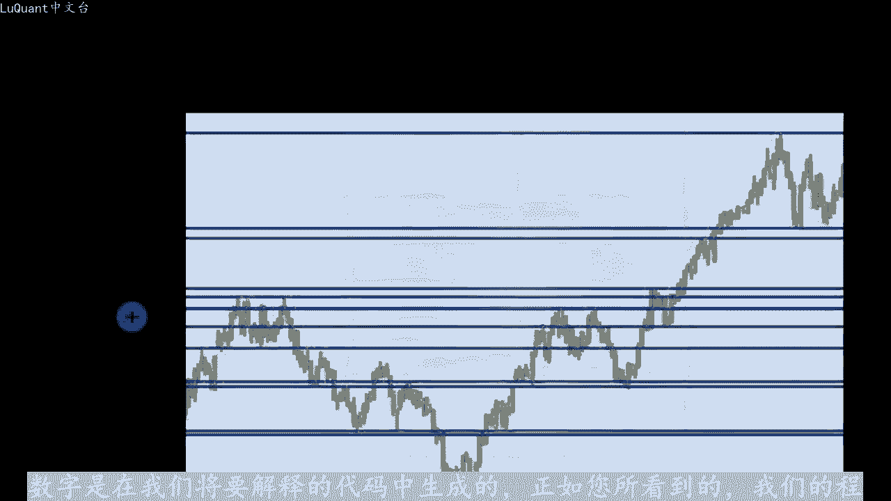
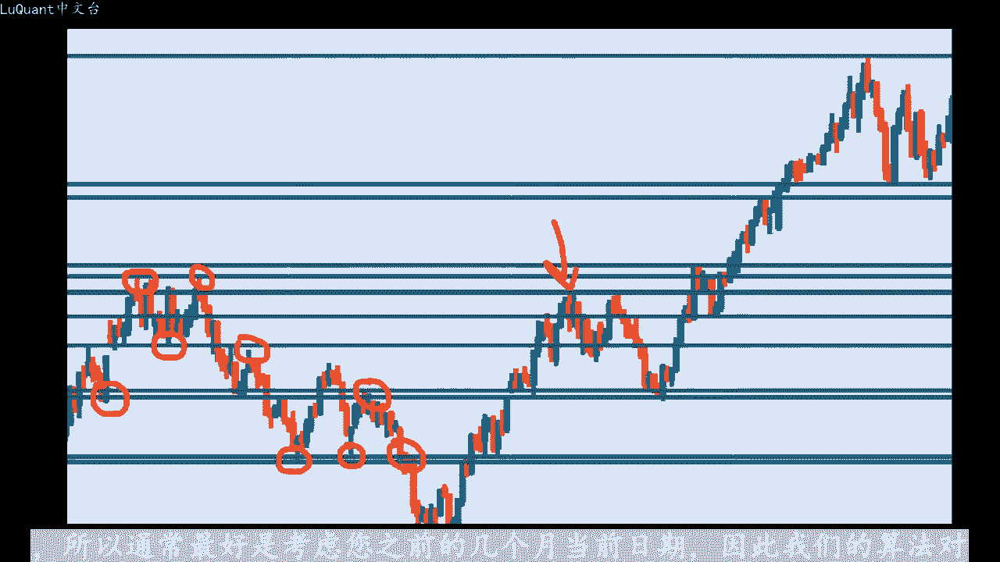
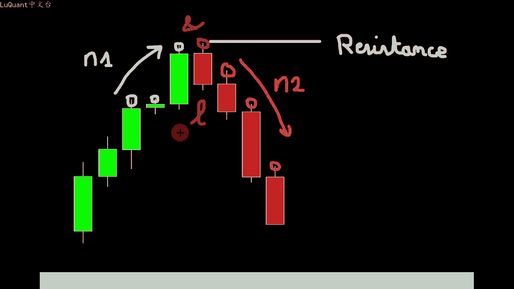
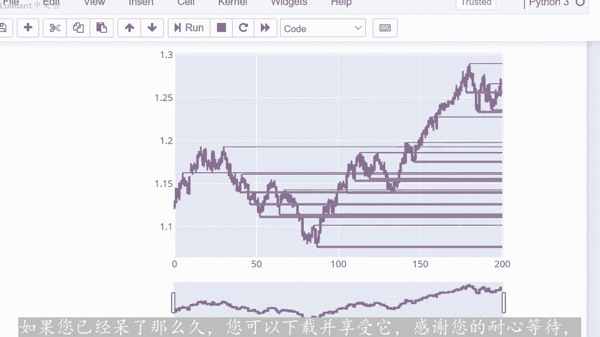

# python量化58：自动化阻力与支撑检测 - P1 - LuQuant - BV1Nw4m1d7Uf

大家好，欢迎回到本视频。我们将解释如何在pyython中自动检测支撑位和阻力位，这是您的评论之一提出的一个好主意。所以谢谢您。像往常一样，不要忘记该程序可以从下。😊，描述中的链接下载。

它是一个jupiter笔记本文件，您可以将其用于自己的实验。您可能想在不同的货币或不同的时间范围上尝试这项工作，并且可能更改我留下的一些变量。如果您。本视频内容之外的内容感到好奇。

那么这里就是为您提供的，尽管很容易直观的看到支撑位和阻力位。但如果您正在查看价格走势图，当涉及到气动定义时，它可能看起来很复杂，但它是没那么。复杂使用适当的算法进行编码也很简单。

该算法可以自动执行整个检测过程。这样您就知道，我们在本视频中介绍的并不是唯一的算法，还有不同的方法来检测支撑位。阻力位，这里我们认为在代码中实现相对简单。

因此您在这里看到的数字是在我们将要解释的代码中生成的。正如您所看到的，我们的程序正确检测到了支撑位和阻力位。😊。

起作用在任何情况下，对于任何不同的货币，但这仍然不是完美的算法。您可能会在这张图表上注意到，某些级别没有被检测到，我们稍后会在视频中讨论这一点。所以想法是通常当。😡。

想要定义您必须在一定时间内回顾的级别，例如一两个月甚至更长时间，具体取决于您想要在策略中包含多少级别。您拥有的数据越多，您将发现的级别就越多。因此您可能想。考虑像我们在这里看到的那样的日线图。

如果在像这里这样的某个特定日期，我们想要进行交易。那么我们需要那些支撑位和阻力位，我们可以在一定的时间内回顾。例如，在一个时间内，假设我们发现了。这个特定日期之前一个月发生的那些水平。

这就是我们要在程序中模仿的内容。我们将考虑在有限的时间内检测这些水平。因为如果我们尝试运行我们的程序，根据我们拥有的所有数据寻找阻力位和支撑。我们最终会得到大量这样的水平。

这对于任何交易策略来说都不方便。所以通常最好是考虑您之前的几个月当前日期。因此，我们的算法对于支撑位的工作原理如。

我们将寻找在我们感兴趣的蜡烛之前的一定数量的递减低点，并且丑闻应该具有比其他蜡烛更低的低值。那么我们必须有三个递增的低。感兴趣的蜡烛之后的低点，当我们有这样的模式，并且对一组蜡烛验证了所有这些条件时。

我们就知道我们已经找到了支撑位，该支撑位的值等于这些蜡烛中价格的最低值，阻力位也是如此，我们必。有一个不断增加的高点，然后是感兴趣的蜡烛的高点，而不是在感兴趣的蜡烛之后不断下降的高点。

这就是我们如何找到阻力位及这些蜡烛中的最高价格。现在这个阶段的一个有趣的参数。😊，您应该考虑在感兴趣的蜡烛之前和之后有多少蜡烛。因为这取决于用户最好尝试不同的值。

我们将在我们的程序中将它们定义为两个不同的变量，称为N一和N。感兴趣的蜡烛的索影将是一个名为L的变量。我们将在程序中使用它。现在我们可以继续看看如何在pyython中编写它。

这是我们的jupiter笔记本。我通过导入pandas开始并使用reund box。

函数加载我们的数据，我使用的是2003年到2021年之间的欧元美元每日图表，这几乎是18年的数据。所以如果您看过我以前的视频，您知道这是我重复的部分，不会详细介绍所有信。

我们只是在这里过滤柱行图或没有交易的日子。这些基本上是市场休饰，且训练量等于零的日子。我们可以看到数据是正确的，已清理，因为我们可以检。清理前后行数的差异，这样您就可以看到，我们丢失了近2000行。

且交易量为0。然后我们将定义两个函数支撑函数和阻力函数。这些函数需要4个函数参数。您想要在研究中包含的数据框。指树我们在本视频中已经提到过，它是我们正在测试的烛台行，它是否涉及支撑位或阻力位。

具体取决于您所使用的功能，然后使用两个数字N1和N2。考虑蜡烛L之前和之后的烛台数量，就像我们在算法部分中解释的那样。然后我们将检查蜡烛L之前的烛台值是否较低。如果不是这种情况，我们将按降序排。

如果不是我们将返回临并退出我们的函数，然后我们只需继续，我们将检查感兴趣的蜡烛及这里的蜡烛L之后的N2根蜡烛。如果他们如果我们发现一个异常则值越来越低，那么我们应。立即返回零，因为考虑到参数N1和N2。

我们正在寻找的设置在蜡烛要的情况下不存在。因此，如果我们在函数中达到此阶段，并且我们还没有脱离循环。返回零，我们可以返回一，因为我们知道我们正在寻找的设置就在那里，所以我们有一个支撑位。

或者我们有一个设计支撑位的烛台，对于阻力位来说也是如此，函数采用相同的4个。😊，在这种情况下，我们正在检查每个蜡烛棒的较高值。因此我们正在检查我们正在测试的L蜡烛之前的N一根蜡烛的高点。

并且我们希望寻找增加的更高值。如果我们有一。另外，这意味着蜡烛I的高值低于蜡烛I的高值减1，我们将返回0。因为这不是我们正在寻找的，并且N2跟蜡烛也。感兴趣的蜡烛之后进行了测试是蜡烛L。

我们正在检查较高的值，并且我们希望这些值按降序排列已具有阻力。因此，如果我们发现一个例外，其中蜡烛I的高值高于前一个蜡烛I的高。减去一则意味着我们必须返回零，因为它会扰乱我们正在寻找的设置。

如果我们在函数中到达这个阶段，并且我们还没有突破我们将返回一的函数。因为我们已经有了我们所拥有的设置之前，在这个视频中描述。😡，他定义了阻力位，所以再次简单的说，这些函数它们采用特定行或烛台的索引。

以及带有数据针的这些参数。如果是支撑位或阻。喂则返回一，否则返回零，现在我们接下来要做的是，我们必须使用这些函数来测试我们感兴趣的所有蜡烛。因此蜡烛的型应该放在这里，它是L蜡烛，这就是我。

要做的地方从蜡烛零开始，然后蜡烛一，然后蜡烛二等，只是为了检查该蜡烛是否触及阻力位或支撑位。请记住，如果您采用N一，假设等于2，这意味着您正在考。L之前的两根蜡烛，你不能从零号蜡烛开始。

因为之前没有任何东西，所以如果N等于2，我们必须从第二号蜡烛开始以此类推。因此，对于每个蜡烛，我们将使用该函数的阻力和支撑，以防万一这两。函数返回一个，我们知道相关蜡烛图即DL行的蜡烛图是支撑位。

或者正在触及支撑位或触及阻力位。在这种情况下，我们将检查其较高值或较低值，只是为了支。哪个是支撑位？我们正在讨论的支撑位或阻力位，我们将把这些值保存在某个列表中。所以我将定义一个名为S2的空列表。

作为支撑阻力位，我将取N一等于3。这意味。我在我正在测试的蜡烛之前寻找三根蜡烛。在这根蜡烛之后，我正在寻找两根蜡烛，它不必是对称的。您可以采取三根三根，或者让我们说三根二根或两根一根，无论您是什么。

更喜欢这。😡，我留给您的东西，您可以对这些值进行实验，以检查这些值对您的算法有何影响。然后对于特定范围内每行的每个蜡烛，它可以是N一，也可以是3到205，意味着我花了2。😊，天。因为我们正在处理日线图。

如果支持意味着如果该函数返回已考虑到，我们正在查看N一和N2的数据框型。我将应用此条件。那么在这种情况下，这个特定的蜡。触及支撑位。在这种情况下，我们将把丑闻的最低价格值附加到我们的SR列表中。请注意。

我们正在附加一个包含三个值的元组。该行表示，当前的索引蜡烛最低价格值一个用于支撑只是一。指数如果我们谈论阻力，该指数将变成2。因此，如果函数阻力返回一，这意味着，如果我们当前正在测试的蜡烛触及阻力水平。

我们也会做同样的事情将附加航索引来聊。该阻力位涉及哪个蜡烛以及该蜡烛在索引二下达到的最高价格，只是为了知道这是我们正在讨论的阻力位。我们需要这两个索引，因为我们将这些植付。到同一个列表中。

如果您不想使用这些索引，您可以简单的定义两个不同的列表，一个用于支撑位，一个用于阻力位。然后您可以简单的附加两个元素的元组，将低执行和最高执行。然后我们可以会。我们的结果我们要做的方式是。

首先我们将绘制蜡烛，然后我们将添加我们拥有的阻力线和支撑位线，找到并存储在我们的SR列表中。所以我使。位于此处的包图，它使此事例的事情变得简单。

我们使用包的函数adship here在起始X和目标X最小值之间添加线条以。绘图范围的最大值，因为我们希望这些是水平线，所以我们可以简单的在Y轴上放置相同的Y零和Y一值。请注意。

我使用数字仪作为第二个索引，因为这是价格在此处的索引号一。这就是我们的程序发现的内容。您可以看到，某些级别已正确检测到，有些级别由于条件不存在而被遗漏。因此我们设置了一组条件，因为算法没有找到这些条件。

这。水平的条件忽略了这些。因此，根据我们定义的条件，这些水平不是支撑位，也不是阻力位，但请注意，许多水平都被正确检测到，我会添加这一水平。因为这是一个共同的支撑和阻力区域。正如我们在这里看到的那。因此。

这是我们的算法遗漏的一个重要水平。你也可能会注意到某些水平彼此非常接近。但为了更清楚的看到这一点，我们必须将支撑位和阻力位用颜色分开。因此，我们不能将它们用作在同一个列表中相。😡。

因此我还添加了代码部分，其中我将值存储在绘图列表一和绘图列表二中，无论指数是支撑位还是阻力位，然后我对这些列表进行排序，按升序排。只是为了检查是否有任何连续值，彼此非常接近。在这种情况下。

我们会将它们合并到一个级别中，这样您就不会希望同一级别绘制您想要的两行或三行，非常接近。😊，现货非常接近的支撑或阻力水平合并在一起，成为一个水平。这样您就可以在图表上看得更清楚。

这也是您也可以干扰和修改这种差异的地方。算法会寻找并合并这些线。在这里我们说，如果这两条线中的任何一条都比0。005更接近。在这种情况下，我们将删除其中一条。如果您增加此值，您当然可以更改此值。

您将合并许多非常接近的线，或者如。您想保留更多详细信息，您可以简单的将其更改为较低的值。因此，这就是您可以做到的方式。我们对第一个列表此处为绘图列表一执行此操。

然后为该代码的第二部分中的绘图列表2执行此操作。然后我们可以重复之前的部分，及此代码的绘图部分，这次我们可以用两种不同的颜色区分支撑位和阻力。因此，这里我仅绘制支撑位，我们可以取消注释这部分。

以绘制两者，以便支持水平为紫色，阻力水平为蓝色。您可以看到我。在这里定义了阻力水平。实际上，如果我们将这些线缩短到围绕检测到这些水平的烛台计算的位置，就会更清楚。所以我们要为了立即执行此操作。这次。

列表分为两个列表，一个是SS表示支撑，另一个是RR或阻力，这样更容易将它们分开。因此，如果我检测到任何支撑位，我会在此处M将附。这些级别的值和列表SS阻力级别将放入R2列表中。

然后我们可以在烛台图表上绘制I上的线条，这就是我们的烛台图表之前已经看过这部分，但不。在X0之间绘制整个图的索引的起点，即从烛台0到烛台200或205，我将在设。阻力或的烛台处开始绘制线条支撑位。

所以这是这里的支撑位。因为我使用SS列出SS的长度，并且我将采用C行的SS值。所引零意味着它是蜡烛的索引减去3。我们将从特定蜡烛之前的三根蜡烛开始，我们将在图表上看到这一点，这将更容易解释。对于Y来说。

它几乎相同，所以它是所引C的值。在这个特定的列表。第二个值是索引一的价格值，请注意，我们不需要像之前那样附加任何索引。我们放置一和二，只是为了区分支撑位和阻力位。因为我们我们将它们存储在一个列表中。现。

😡，我们有两个列表，我们可以丢弃此元组格式中的第三个参数。另一个X是X，我们将从X02行的起始位置到行的末尾。如果您想要更美观的图形，我们可。简单的缩短它，但就本视例而言就足够了。Y1基本上与Y0相同。

因为我们正在绘制一条水平线，因此它将是Y0和Y1以及相同的值。然后我们。电阻列表做同样的事情，我们将检查该列表中包含的值，并绘制具有不同颜色和不同宽度的线，这就是我们现在拥有的。所以你可以看到。

我们有我们的水平开始在该特定蜡烛之前绘制仅三个蜡烛。因为我在这里放置了3。您当然可以放置不同的东西或简单的为零。如果我删除那些例如，他将是这样现将立己。触及支撑位或阻力位的蜡烛，我们可以看到。

在某个点上检测到某些水平，并使用某种蜡烛模式。但是此处此处或此处均未检测到相同的水。因此，这只是为了告诉您，我们的算法不是最敏感的算法，它不是最好的算法，但没关系。

它仍然可以根据需要检测一些支撑位和阻力位，但它不会检测到所有这。如果您正在使用这个支撑位和阻力位建立一个策略，比如说吞噬模式，所以我们算法的敏感度也将取决于N一和N。参数正如你所看到的，我的意思是。

如果我们将他们从三个更改为两个，假设我们将在此处放置22他，将为我们提供更敏感的内容。因此我们将有更多行。现在我们可以看。😡，检测到此级别，即使此处检测到此级别。

因此您可能需要更改这些值恩一和二并进行一些实验。你应该知道，在L蜡烛之前和之后考虑的蜡烛越少，你的模型就会变得越敏感。所以。就是我们在这里所做的，我将N一的数量从三减少到两个。在这种情况下。

我们检测到了更多级别，所以它毕竟还不错，但是你必须调整它，你必须知道你正在使用什么，然后你只是盲目的将它应用某种策略，仅此而已，我不得不告诉你这个算法。我希望你们喜欢他，再次感谢在评论中提到这一点的人。

这是一个很好的主意，能够在pyython中自动检测支撑和。😊，水平，我将再次将jupiter笔记本文件留在说明中的链接中。如果您已经待了那么久，您可以下载并享受它，感谢您的耐心等待，希望下次见到。

