# python量化5：EMA和布林带优化 - P1 - LuQuant - BV1LH4y1W7fJ

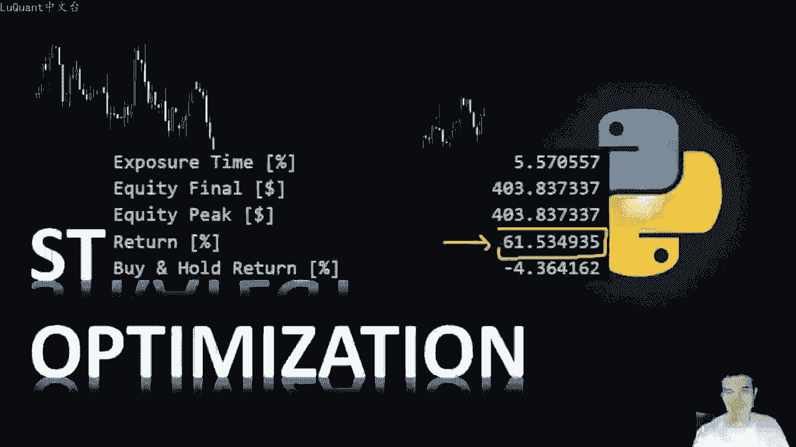

对于这个，我选择了一种非常简单的策略，使用指数移动平均线和binG带边缘的趋势检测来生成入场信号。因为我们可以看到，通过识别最有利可图的方法，我们在回溯测试方法中成功的挤压了61%左右的力。

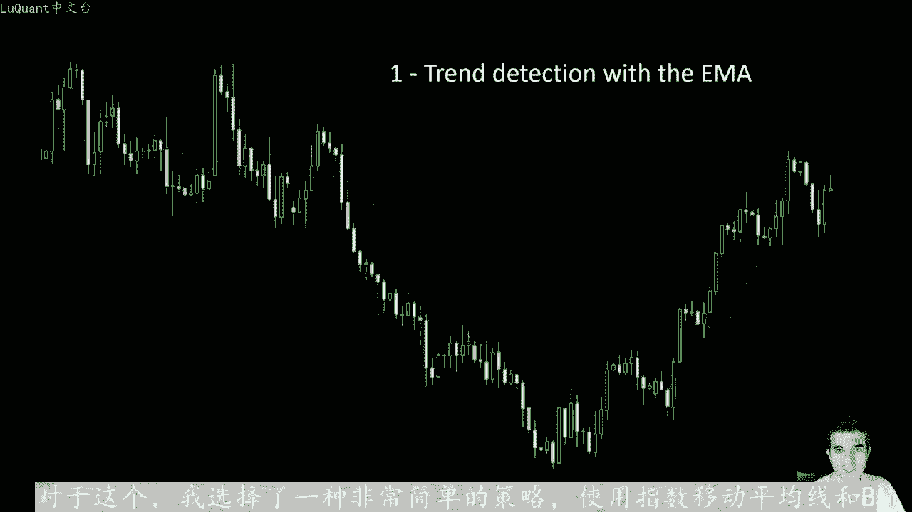

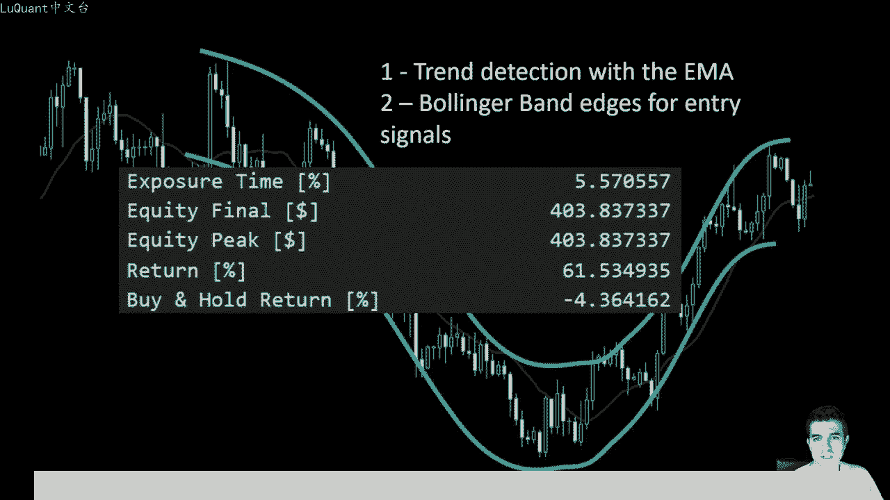

使用回溯测试包的优化函数进行参数组合。在本视频中，我们将讨论策略优化，我将引导您完成一个pyython代码。该代码将优化我们策略的参数，增加我们的回报。理论上为我们提供最好的回报。在我们继续之前设置参。

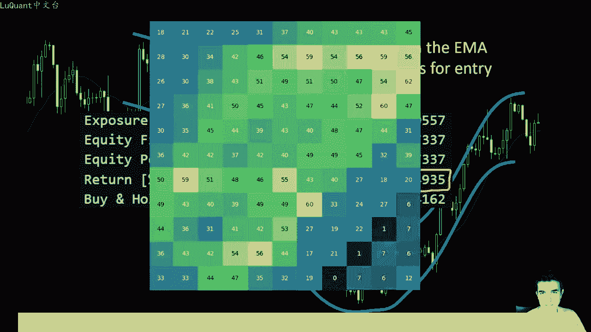

我想感谢您在评论部分分享的想法，事实上，所有视频都是从您的评论和我们一起进行的那些小讨论开始生成的。所以我们将编写此策略，并根据历史数据对其进行回溯测试。我使用。😊。

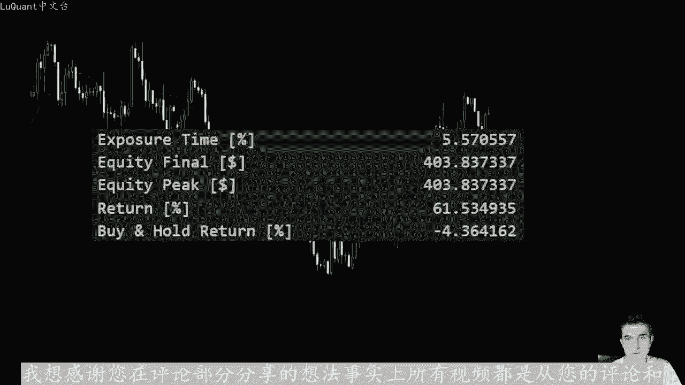

分钟的时间范围进行此测试。因此我们正在寻找快节奏的交易方式。如果这是您第一次进入此频道，您可以从以下链接下载pyython代码下面的描述，以便您可以使用joptter，而不是笔记本文件进行实验。

并尝试不同的参数级，看看它如何影响我们的结果。所以回到我们。😊。

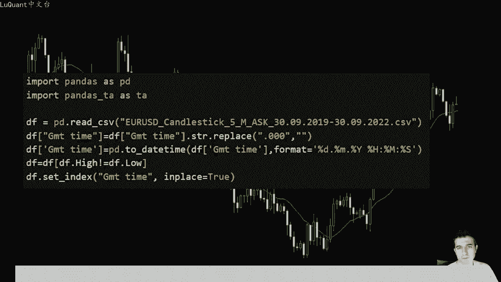

策略如果完全检测到后续蜡烛，我们将使用指数移动平均线来检测趋势低于移动平均线，则我们有下降趋势。反之，如果蜡烛高于趋线，则我们有上升趋势。在下降趋势中，我们只考。空头头寸在上升趋势中。

我们只考虑多头头寸要测试的连续蜡烛的数量，对于趋势检测与策略的任何其他参数一样，保留为可调变量。因此您可以对其进行修改，以改进结果。然后对于入。信号我们将使用80格带的上边缘和下边缘。因此。

如果蜡烛收于上方，则在下降趋势中，80格边缘上方，这将是我们的卖出或空头切入点。因为在下降趋势中，我们认为价格总是。在副方向上收敛回狂潮的中心，这是一个事例，我们检测到下降趋势。

以下是蜡烛收盘于巴0格带上端上方。因此，在该图表的第二阶段，这是一个很好的空头入场点。有上升趋势，蜡烛收盘于80节待下轨下方。因此，一旦我们收到入场信号，我们就可以开仓。这是一个很好的多头入场机会。

头寸和止损被定义为系数参数与AT2的成。平均真实波动幅度和止盈被设置为止盈止损比率，乘以止损距离或我们用于止损的任何值。因此，这是我们稍后将在止损系数和获利值。比率上优化的两个系数。

我们不知道这些参数的最佳值是什么，因此这就是为什么我们将运行优化算法来检测最佳可能的组合，这是我们将在pyython中进行编码回测和优化的策略。这是我们的jupyter笔记本文件。您可以下。😊。

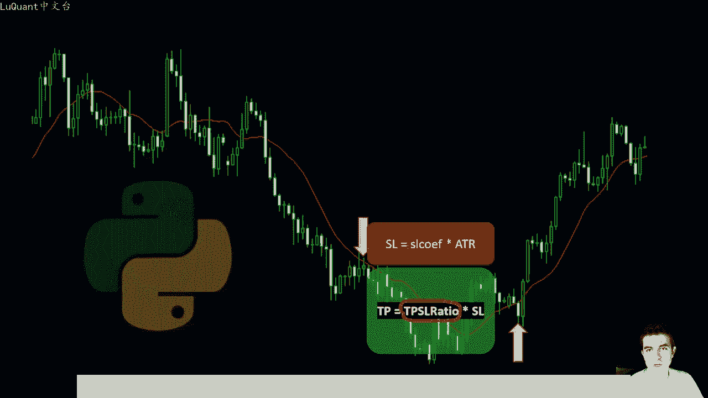

它并将其用于您的实验。我还与您共享我正在使用的数据文件的CSV文件欧元美元数据2019年至2022年之间的5分钟时间范围。所以我在这里做一些清理，然后我记。

长度为30的指数移动平均线RSI以防需要长度为10的宾格带，长度为15和标准差1。5。然后ATR长度7。所以我认为你也可以稍后在本实验室。juter文件中修改这些参数。

因此您可以使用此文件做很多事情来实验不同的参数。我们正在计算所有内容，将所有内容添加到数据框作为新的数据列，所以一切都准备好进行测试。然后我定义这个函数称为m性。😊。

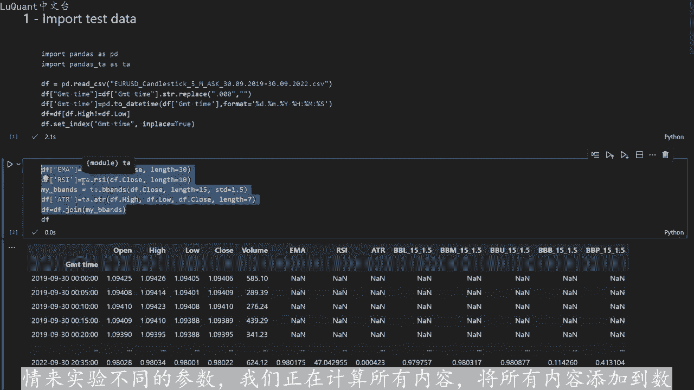

这基本上是一个函数，用于测试我们是否有连续蜡烛位于移动平均线上方或下方，这样我们就可以决定是否这是上升趋势或下降趋势。在上升趋势的情况下，我们返回二在下降趋势的情况下，函数返回。在任何其他情况下。

他将返回零。但如果我们遇到一些发散或奇怪的情况，我们有两种趋势，同时我们返回三个，这基本上根本不应该发生。这意味着数据中有错误或者发生了可疑的事情。只需。7保留在那里进行测试就可以了。

所以这是我们的函数。然后我们可以使用它我选择了最近的1万根蜡烛中的1万根，所以这大约是6周5到6周。我认为时间交易时间，所以这是一个半月的数。😡。

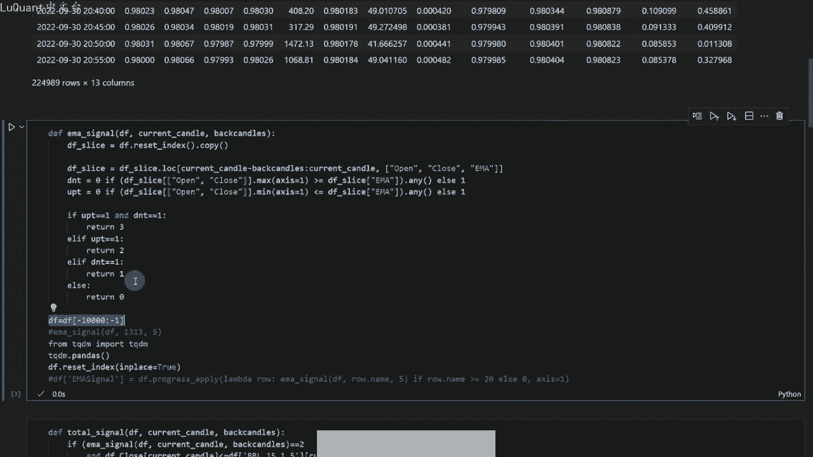

仅仅是因为它是5分钟时间范围内的大量数据，所以我不想在225000行上应用这些函数，此时没有意义。而且需要太多时间，所以我只选择最近的1万根蜡烛。我们将。

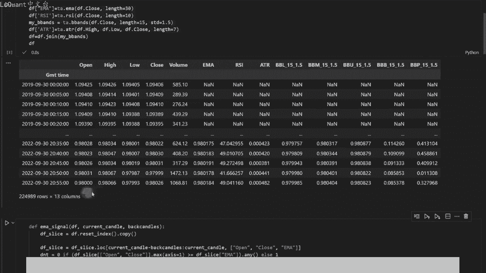

最新数据应用优化，现在我们有一个名为总信号的新函数，它采用我们需要考虑的数据针，因此它采用当前蜡烛的数据，然后是后面蜡烛的数量，以及它采用当前蜡烛指数的原因。我们需要应用，稍后会针对每根蜡烛进行此操作。

因此，每当我们有一根蜡烛时，我们都会在此处传递其指数，它将测试我们是否有上升趋势或下降趋势，然后是否有冰格带在向上或向。方向交叉以基本上生成信号入场位置信号，这就是为什么我们有数据。

然后是当前的please指数，然后我们这里还有这个后蜡烛参数，当我们调用M函数时也会使用该参数。因此，MI信号指数一。平均线信号是趋势信号基本上在这里。所以这是您想要考虑的蜡烛或连续蜡烛的数量。

以测试它们是否高于或低于移动平均区线，以决定我们是否有上升趋势或下降趋势。所以您可能想。例如，我需要6个在我考虑并确认我有下降趋势之前，连续蜡烛线要低于V趋线，或者有时您想要考虑15根蜡烛。

而不是仅仅6根蜡烛，因此取决于您想要的选择性或您的系统。现在应。考虑我们的所有条件，在这里我们将生成这个总信号，我们有一个长信号，我们返回两个函数，返回两个，我们有一个短信号，函数返回一个。

在任何其他情况下，只要我们没有任何有效信号，我们返回零，并且我们是将生成这些信号并。😊，他们放入数据框中的星列中，以便为测试做好准备。所以这一步需要一些时间。所以我花了大约一分钟的时间。

每当你在更大的机器上运行时，数据帧显然需要更多时间。所以然后我正在测试看看我们是否。

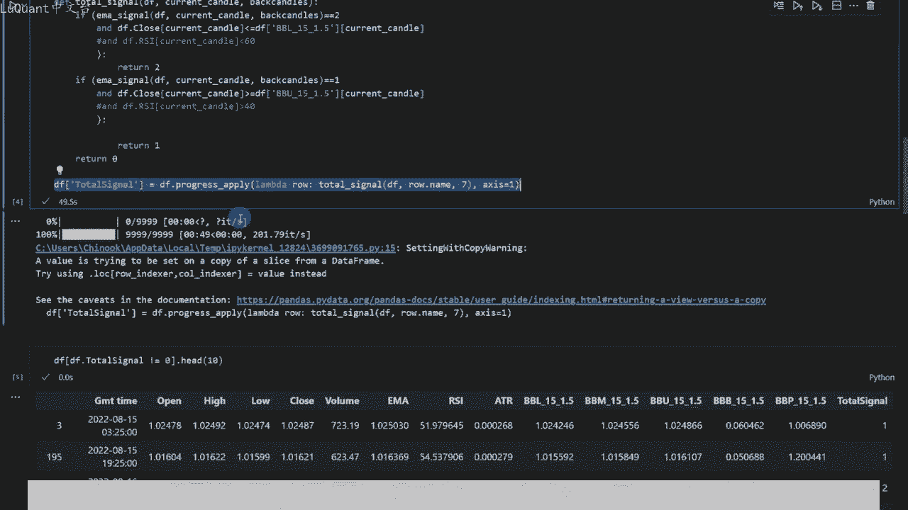

任何信号，所以我只是打印数据真的行，只要我们有一个不同于零的总信号，这是一个样本。我们正在得到这样，我们可以直观的验证这一点。因此，在这种情况下，例如我绘制这些只是为了可视化这。😡。

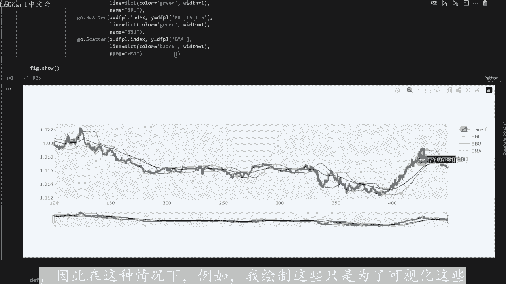

蜡烛在哪里？这些信号在哪里？我验证我的代码是否正常工作，所以我没有弄乱任何代码型。在前面的函数中，我们可以定义这个信号函数，它将返回列DF做总信号。😡，稍后将在回测的回测类中使用这个函数。

我正在导入策略和回测，我们将用来创建新类的类。因此，我在该函数中定义该类的构造函数，我只是初始化该过程，然后定义一个名为S一的新应变。sign one，所以它是一个实力变量，等于is signal。

所以isthan是一个从后面的测试包继成的函数，我们将调用它，并且我们将向它提供函数的名称，及此处称为信号。请记住此函。将返回信号值，因此这基本上是一个复制和粘贴的内容。

您可以将一个策略复制并粘贴到另一个策略。您不必担心它只需定义一个信号函数，即可返回您的信号信号列，并在构造函数中实现这一步。他应该可以工作。因此此类中最重要的部分是这些变量。请注意，我正在定义这些变量。

这些是优化函数将循环更改的变量这些值。所以我定义。止损系数，我现在将其初始化为1。2，但稍后它会发生变化，然后止盈止损比率等于25，还更改了手术的大小。但我们我不会优化这个，我只是暂时把它放在这里。

所以每当我定义。😡，ATR相关的止损时，这就是我使用self stop loss的距离。止损系数等于ATR最后一行的最后一个值，以此类推，然后只盈止损比率也等于self。take profit止损比率。

因此它等于该实力的等效实力变量，变量就在这里。如果你不明白pyython中的面向对象编程，也许可以回顾一下，阅读一些关于udme的课程，也解释了这些内容。所以如果。可能对此感兴趣，但无论如何。

这些信息也可以在youtube上免费获得，或在任何其他在线平台上。所以现在如果我们有一个或多个未平仓交易，我们可以通过触及止损或止赢来退出这些交易。而。只要RSI直达到某个极端阈值。

我们也可以退出这些交易。所以这是这里编码的部分，是我们交易管理系统的一部分。然后如果我们有一个等于二的信号，并且我们没有任何未平仓交易，因为我们在市场上一次允许一笔交。😊，我定义止损和止盈值。

然后我们使用此处的买入功能传递多头头寸。如果我们有等于一的信号，并且我们在市场上没有任何未平仓头寸，则同样的事情，我们将传递空头头寸头。位置就在这里，使用止损和止盈值。我们首先定义回溯测试。因此。

我们传递参数策略，我们需要使用的数据框其实缓存保证金及杠杆率。现在我们不使用佣金来将它。与我们之前编写的其他策略进行比较，但您可以稍后添加佣金。通常您可以每100添加一个，这作为佣金是相当现实的。

然后我们可以使用优化功能。所以从后面的测试包中，我传递了。想测试的参数的止损系数列表，我在这里使用for尔循环，理解循环值，从1到2进入浮动步骤。因此，从1到21。11。21。3等等。这种方法实际上可。

还有其他方法，您可以用numb page函数替换它。例如它也很好用，我只是用这种方式，止盈止损比率也是如此介于一和2之间AAP不长为0。1，因此它将采用值一，然后是1。11。2，以此类图。

知道两个条件是最大化返回百分比结果，这就是我们想要最大化最大尝试300的结果。因为这是一个网格搜索类型，因此它将检查这两个参数的所有组合。最终可能会进行超过1万次尝试。

您希望将尝试次数限制为此处拥有的任何条件片段或制片段。您可以使用此参数在这里。我认为300基本上覆盖了我们在这两个列表中定义的所有。然后随机状态等于0，我想返回这些参数的热图，以便能够直观的绘制这些。

现在我们可以运行这个单元格，我们将观察优化过程，所以这需要一些时间。因为它正在尝试所有参数的组合，如你所。但我们可以等待几秒钟，现在我们有了我们的结果，因此最大结果是61%的回报。

正如您在此处看到的那样，我们可以访问该策略的参数，我们可以访问这是止损系数和止盈止。😡，比例的最佳组合。因此我们可以打印此是一个系列，我们只需在这里打印统计数据，我们将在此处添加下划线策略，这是关键。

它将为我们提供最佳的参数对。因此，止损系数。😡，1。2只盈止损比率相等到2个。所以我们在这里得到了这两个参数的61%回报。然后我们可以绘制股票曲线。我们可以在这里看到这个月。

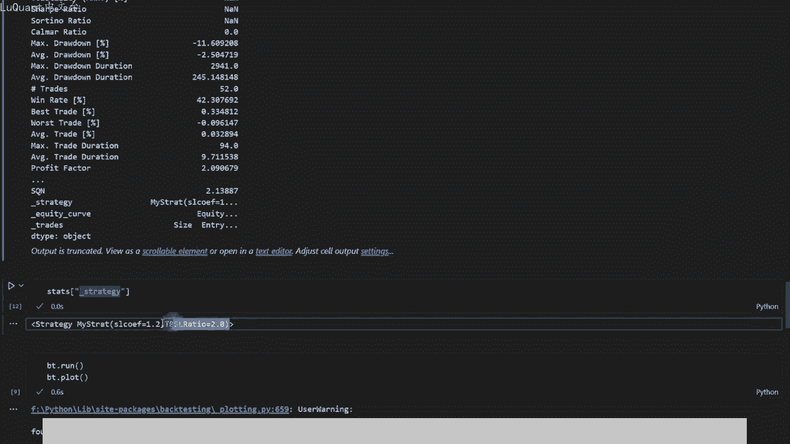

在前几周或三周内有一个非常缓慢的改善。但随后的两周，实际上，我们的结果有了很大的改善，我们的净值呈上升趋势，这就是您可以直观的评估该策略的方式。您可以绘制净值并查看它。😊，表现，如果你有这些尖峰和下降。

这意味着它是非常危险。但无论如何，这个运行良好，现在我们可以用参数绘制热图，这对于验证非常重要。我们看到的是我们在X左侧尝试过的止损系数。

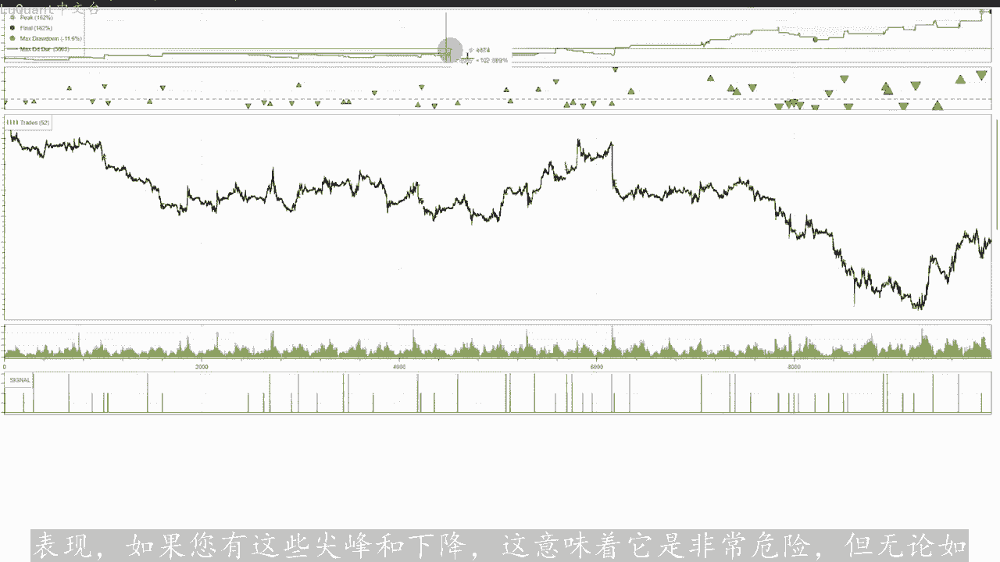

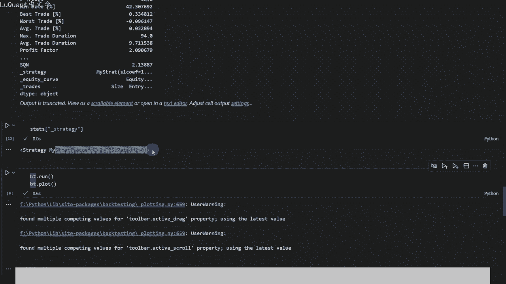

轴上我们有止盈止损比率，我们可以看到的止是回报的百分比。所以我们要寻找的是那些高回报区域，我们不是在寻找孤立的值。例如我们这里有60%，这是。只盈止损比为1。6，且止损系数为1。70获得的。

我不会考虑这种情况。例如我不会说这是一个好的结果。因为一旦您一触该区域，所以想象一下不是1。6。😡，盈止损比率而是1。7，你立即下降到33%，这是非常糟糕的。所以从60移动到49%没关系，53也可以。

即使在这个方向，如果你从60移动到1。8止损息。为27%，所以这不是一个非常稳定的结果。我的意思是，市场状况将会发生变化，它们非常动态。因此，如果您适合获得最佳结果。

并且您正在选择以下组合参数市场条件的任何并。😡，都会导致您的回报大幅下降，这不是我们想要的。但是如果您在此处查看此区域的结果，如果您更改一个参数，您的回报率仍然会下降到10%以内。如果你选择这个。

那就更好。😡，所以我们寻找的不仅是最高的回报，而且是最安全的区域。所以如果当前参数发生一些变化，我仍然能够获得不错的利润或良好的回报。这就是我们正在寻找的。所以不要寻找一。组合最好的价值。

寻找最好的价值，周围还有可接受的价值。因为当市场发生变化时，你仍然希望处于那个区域，那就是我必须向你们展示这一点，我希望你们喜欢他。如果是的话，请发表评论。我再次对你们的想法感到非常好。😡。

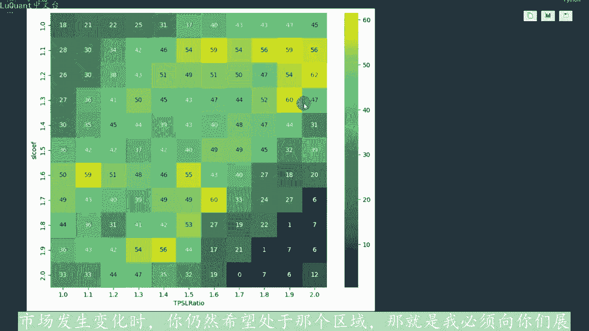

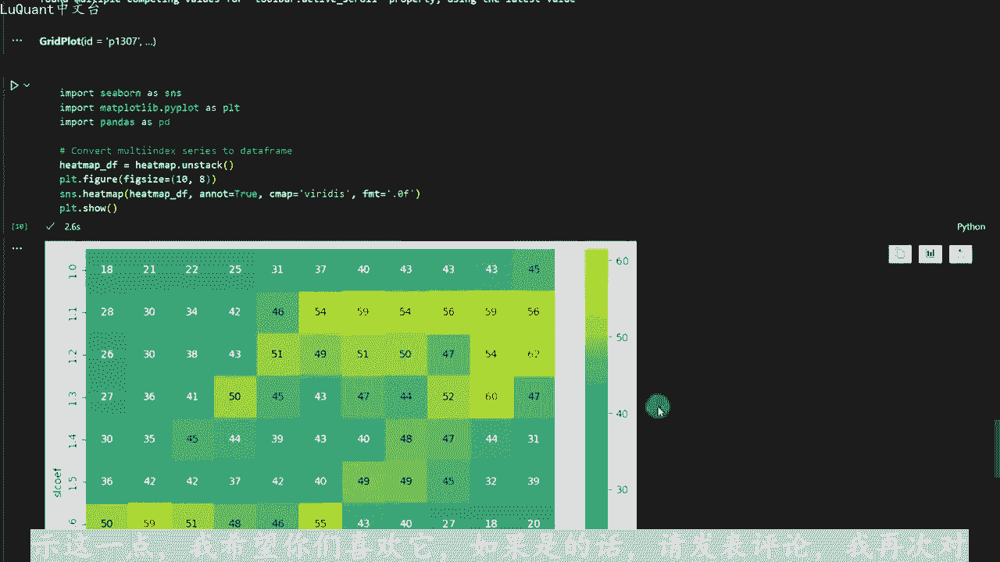

这是视频是从评论部分生成的事例之一，所以谢谢你们，感谢您的贡献。直到我们下一次安全交易，下次再。

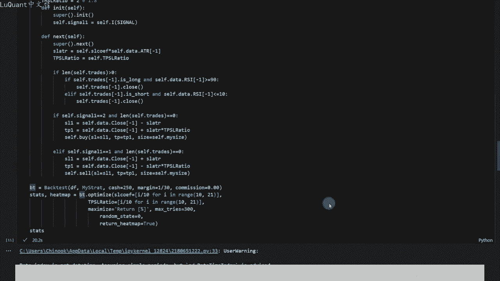

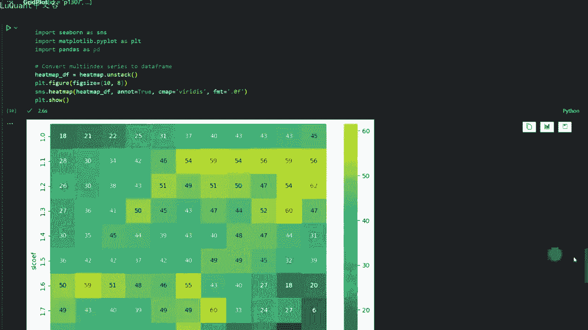