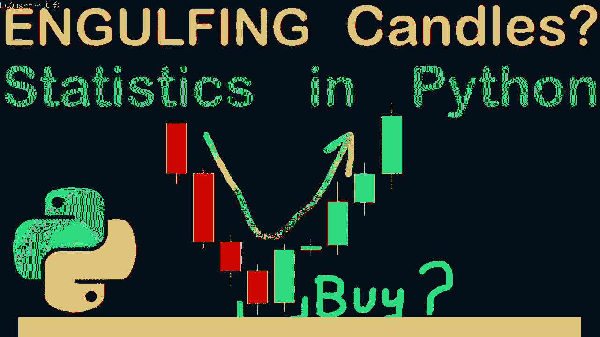
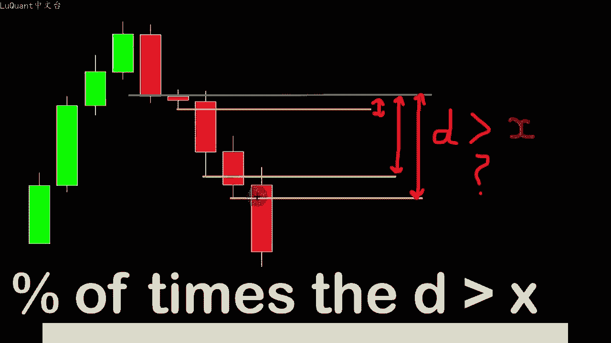
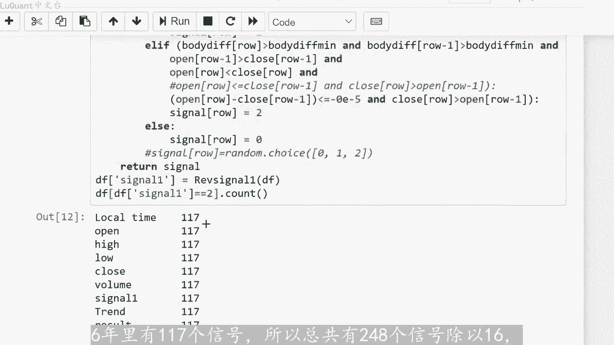
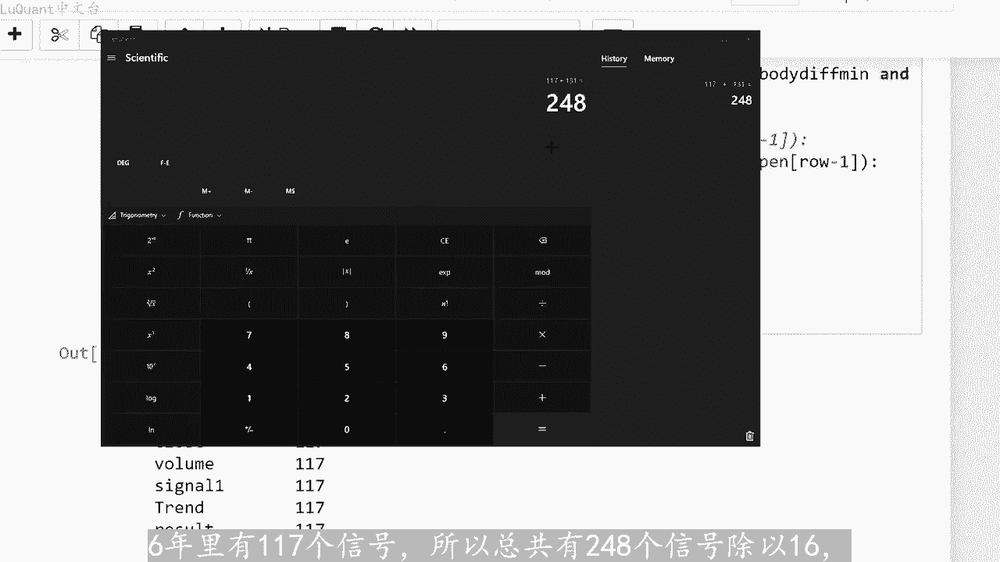
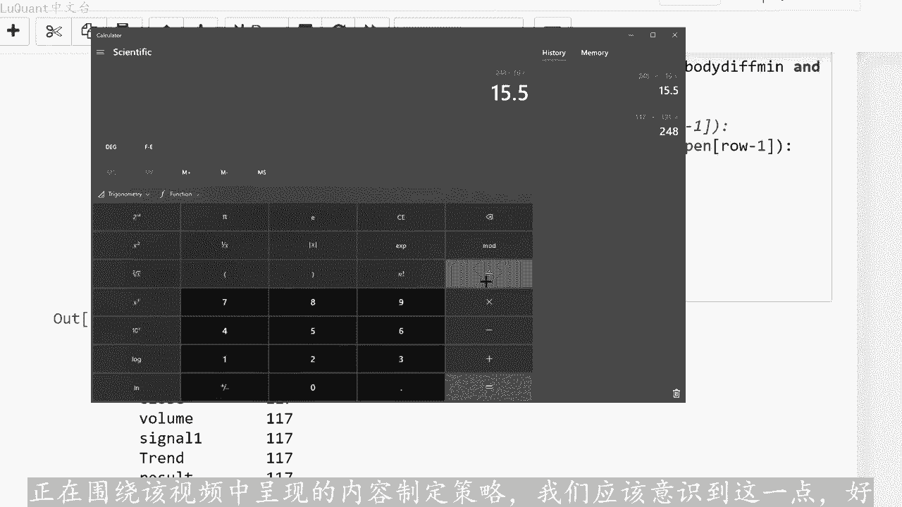
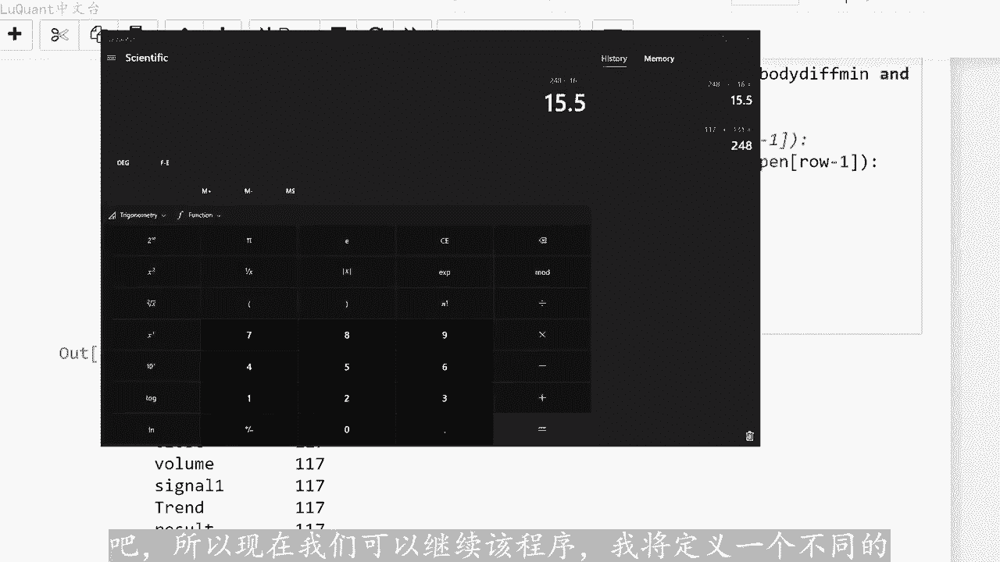
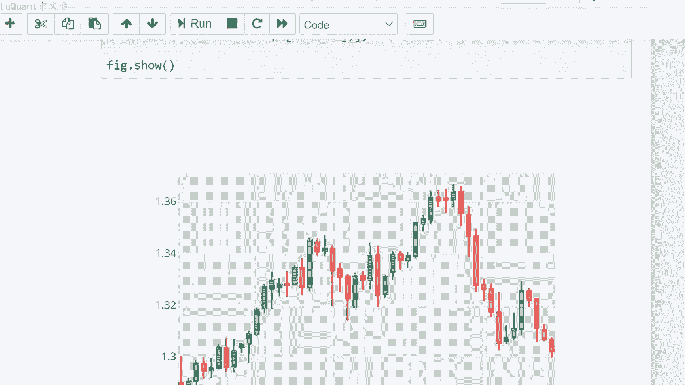

# python量化60：自动化价格分析2 - P1 - LuQuant - BV1Bz421Z7Vv

大家好，欢迎回到这个视频。我们将为熟悉这些的人讨论吞噬蜡烛。我们正在谈论看涨和看跌吞噬模式。我们要做的是获取欧元的历史数据，相对于美元，我们将考虑大约10。😊，的数据。并且我们将在本视频结束时。

使用pyython中的一些简单统计数据来分析这些数据。我们将更清楚的了解这些模式是否实际上具有统计意义或意义。这只是一个神话。如果您尝试使用蜡烛作为指标来构建交易策略，那么这可能是至关重要。

如果您有兴趣，您可以从下面描述中的链接下载完整的代码，它是一个木星笔记本文件。因此您可以轻松的放松，并基本上吞没模式以两种不同的形式呈现。看涨模式是指当你有多。

下降趋势蜡烛后跟一个上升趋势蜡烛，该蜡烛开始于或低于最后一个下降蜡烛的收盘价，并且收盘价高于开盘价前一个蜡烛。所以通常该形态表。从此时开始，我们将有一个上升趋势，并且当你有一个上升趋势。

蜡烛后跟一个看跌吞没形态时，看跌吞没形态正是对称的含义。这意味着蜡烛开始于或高于前一根蜡烛的收盘。和收盘价低于前一个丑闻的开盘价，这就是我们所说的看跌吞没模式。这个丑闻将表明价格将从此时开始下跌。

所以在这个视频中，我想为了验。这种说法是否真实？如果这些模式确实表明了市场的某种典型行为，通常看涨吞没模式表明市场上的买方比卖方更强，而看跌吞没模式则表明相反的情况。所以我们的方式我们。验证这一点。

即我们将在python中编写一段代码来检测何时出现看涨或看跌吞没蜡烛。然后我们将检查以下几根蜡烛，可能是一根两根或三根蜡烛或者更准确的。为了了解价格是上涨还是下跌，我们将考虑最后一根吞噬蜡烛的收盘价。

如果我们谈论的是看涨吞没模式，那么我们将考虑每一个的所有高。考虑蜡烛，我们将测量该蜡烛的最高价和收盘价之间的差异。因此，三个最高价将具有三个不同的值，我们将其称为小D，然后我们将测试。

差异或其中任何一个差异实际上高于某个限制。我要定义的变量可能是20、30或40点，这取决于您的选择。然后我们将记。此差异较高的次数百分比与看跌吞没形态的点限制X相同。我们将考虑以下蜡烛的最低值。

看看吞没蜡烛的收盘价与这些低点之间的差异是否高于我们。变量X换句话说，我们在这里所做的是，我们正在获取吞没蜡烛的最后收盘价。我们正在检查之后的价格是否会在2到3个蜡烛内超过看涨或看跌值，并且我们将检。

核实的百分比价格在这种模式之后显示出预期的行为。这里要记住的一件事是，这些差异之一应该超过我们的变量X。我们不考虑其中三个同时超过X的情况。所以如果价。低于丑闻收盘价一定数量的点。

这种模式的预测被认为是成功的。当然，看涨吞没模式则相反，我们正在寻找上升趋势差异。但。在这里强调的是，三个差异之一，超过X就足够了。我们不必多次超过这个点数限制。所以现在让我们检查我们的代码。

看看它在pyython中的行为方式。这是我们的jupiter笔记本文件，首先导入panda。

然后声明一个名为DF的新变量，我们将使用pas中的reendnder sports函数来加载我们的数据文件，这是我们数据文件的名称。所以现在我们有一个数据真存储在变量DF中的文件。因此。

我可以打印数据针的尾部或头部，通常打印尾部。因为我有关于数据帧中包含的行数的信息，所以这里我们有本地每根烛台的时间，我们开盘。高点和低点以及收盘价和交易量，请注意，每一行代表一根烛台，意味着一天的交易。

因此我们有4326天的数据，这对于统计来说应该足够了。此视频中的事例中，我们可以使用此处的这一简单型来测试数据框中是否有任何奇怪或缺失的值。并且我们可以看到数据已被清理。因此我们不必担心这一点。

因此我们可以继续。现在我们到达了程序中的一个重要点。将声明一个采用数据帧的函数，这就是我们要测试是否有吞噬蜡烛的地方。因此我们将识别所有信号在我们的数据中，我们有吞噬蜡烛。所以首先我要生。

一个名为lex的变量，它将保存我的数据帧的长度，机星数和蜡烛的数量。然后我们拥有所有称为高低收盘的列表，打开这些将保存数据框。最高价、最低价、收盘价和开盘价。然后我们还需要一个列表。

它是相关行的信号列表。相关烛台在这个信号中，我们将放置，如果信号是看涨吞。形态则为一，如果信号为看长吞没形态则为2。如果我们没有吞没蜡烛则为0，因此目前它只是零，我们将把它乘以长度。这样我们的列表将距。

我们的数据真的长度相同，对于主体差异来说，主体差异只不过是开盘价和收盘价之间的绝对差异，它只是烛台主体的长度。目前它是一个零乘以长度的列表。我们。数据库现在对于每个烛台或每一天的每一行。

我们将计算主体差异。然后我们将声明一个称为主体差异最小值的变量，我将其等于0。00。大约为30点，这将帮助我忽略这些烛台的主体差异，小于该值的所有信号。因为我不想在市场不确定的情况下采用小烛台也不确。

您是否这样做，无论是看涨趋势还是看跌趋势，都没有强烈的趋势，它只是蜡烛的小实体。这些实际上在我们的计算工作中不算在内，这就是为什么我要测试每个信号的原因。我的蜡烛的实体差异是。😡，高于蜡烛的实体差异。

我们在这里测试第一个信号和第二个信号的最小允许值，看涨或看跌吞噬蜡烛必须与之前的蜡烛相结合，他们必须吞噬之前的蜡烛。因此之前的蜡烛也应该。更高的主体差异大于最小值，这就是我们在这里和这里所做的。

因为这两个信号都是看涨和看爹吞没模式，然后我们将测试这是否是看爹吞没蜡烛。为此，我们必须满足以下条。😡，前一根蜡烛应该小于前一根蜡烛的收盘价，因此它应该是下降趋势蜡烛，并且当前蜡烛的开盘价应该高。

当前蜡烛的收盘价，因此它应该是上升趋势蜡烛，所以我们有下降趋势蜡烛与上升趋势蜡烛相结合，但当前蜡烛的开盘价应该高于或等于前一个蜡烛的收盘。现在这可以用不同的方式来写，就像这样，以及我这样写的原因。

是因为有时您没有完全相等的值，但是两根蜡烛的开盘价和收盘价之间存在微小差异。因此为。考虑到这一点，您可以添加允许的5个点的小差异。让我们这样说，您可以从数据中获得更多信号。

最后一个条件是当前蜡烛的收盘价应低于前一。蜡烛的开盘价。因此，如果满足所有这些条件，我们将赋予一个直移到当前行的信号或当前蜡烛的信号。因此，在我们的程序中，信号中的数字一代表看。吞没模式。

然后我们将对看长吞没模式执行相反的对称过程。哎，我现在不会详细介绍细节，只是为了节省观看视频的时间。如果我们没有任何信号，我们就没有任何看长或看爹吞。😊，模式我们会将值令归因于当前行。

因此这将是我们函数的结尾。最后我们必须返回信号列表，我将把这个列表添加到我的数据帧的最后一列。这样数据帧。新列称为信号一等于函数的返回值。为了确保一切正常工作。

我将计算16年数据中我的数据框中有多少个等于一的信号。因此，如果我正在运行所。这些我将运行它再次只是为了看看它是否有效。在所提供的条件下，我们有63个看跌吞没模式的信号。现在我们必须注意。

63个信号在16年里并。😡，如果我们想做一些统计，我们需要有足够的数据，所以我将稍微放松一下我的条件。我将在这里放一个0，这样我就不必在当前行的开盘价和前一行的收盘价之间有很大的差异。我要再次运行这。

😡，这里我们在16年里有131个信号，对于看涨吞没模式，我们在16年里有117个信号，所以总共有248个信号除以10。

每年大约有15个信号，所以你每月必须预期大约一个信号。如果您正在围绕该视频中呈现的内容制定策略，我们应该意识到这一点。好吧，所以现在我们可以继续该程序，我将定义一个不同。

函数称为我的目标，需要在当前吞没模式之后，要考虑的数据框和注述，因此这将是我的真实趋势。之前我们有信号，如果他是看涨或看爹吞没蜡烛，但我们有真正的区。我们必须进行比较稍后，我的目标是每次突袭30点。

我想检查在看涨吞没模式之后，我的价格是否会在提供给交易者的注数和蜡烛数内有多少次超过30点的差。在这里函数。所以当我使用这个时，我使用3天作为参数，但你也可以将其更改为4或5天左右。我们暂时不关心。

让我们直数3天。所以当我我正在进行交易，我希望在3天内获得30。😡，正如我们在本视频开头的算法中所解释的那样，我将查找吞噬信号之后的所有行，并且我将检查价格是否会超过这个差异。即在两个方向之一上。

所谓的点肢体。所以如果价。下跌我将发出一个等于一的信号，因此这是一个下降趋势。如果30点我这样称呼它超过上涨，价格很高，我将把趋势设置为等于。如果价格将保持。😡，-30点和正30点之间。

我们将称其为趋势等于0。所以我们没有在此阶段清除趋势，该函数将返回趋势类别列表。稍后我们将其作为列存储在数据框中。请注意，由于我们已将这些参数放。此处的参数中，因此需要考虑的注数和数据框的名称。

如果您想要50点，您也可。在此处更改此值，这样您就可以下载aljupiter笔记本文件，通过更改参数并更改点限制，可以很容易的在以后进行实验并自行实验，以找到最佳参数。

然后我将使用nP来检查我的预测结果。因此，首先我将设置两个条件，其中去。真实趋势等于一个含义，这是下降趋势。我的信号是看跌吞没模式，也预测下降趋势。所以如果两者都为真，我将在我的结果栏中写一个。

我将添加到我的数据框中。如果两个真实趋势都。😡，等于2，并且该信号是看涨吞没信号，意味着它等于2，那么我将在结果列中放入数字2。因此，仅当我的预测进行时，我的结果列中才会有第一和第二与真实的趋势。

这将允许。计算我的预测的精度。所以如果我这样做的趋势等于一个意义的看跌吞没模式。我们将打印我的结果等于一个意义的次数。我对下降趋势的预测正确的次。除以我预测该趋势的次数，我只有等于一的信号。

所以这将为我提供预测的精度及次数。我确实有一个很好的预测，除以同一方向的所有预。我们可以看到，我的预测有74%的时间是正确的，或者下降趋势，意味着投注吞噬模式在74%的时间里是正确的。请记住。

考虑到我们这里的条件及30。并在前面取三个注，这意味着在信号发出后3天，我们可以采取更多，它可能会改变，让我们以四个为例，在信号发出后4天，我们将保持在假设是7400分号、7500分号。但如果我。

只在Om信号发生后两天，我们将得到大约70%或71%的信号。因此，如果您输入50点，而不是30点，您可以看到它对您在这些参数中输入的任何内容都很敏感点子。我们将。6162左右遇到更困难的62%。

所以请记住，无论您在这里输入什么，都会影响您的结果，让我们保持30点子，不要太贪心。我们可以为尝试同样的事情，看涨吞没形态，我要检查一下，它是5658百分号，无90百分号。所以。😡，要给他更多的时间。

比如说三天回到3天，他大约是82，所以请注意两天后他发生了多少变化信号或信号后3天，我们从60%上升到82%。这就是您测试预测精度的方法，而且我对物报感兴趣，这意味着当我的预测是上升趋势时。

但是然后我有一个零趋势或下降趋势。为此，我在这里使用这个命。我将检查这些，我将打印我有物报的所有条形。例如，这里我有一个信号等于二那么趋势，实际上是看跌趋势。所以你可以看到，在这种情况，下列结果等于0。

因为这两。不同的，而这里是相同的。所以我打印这些的原因是因为我们可以通过图形测试，我们可以直观的看到发生了什么。我将采用该烛台的编号，例如224，我将使用代码的最后一部。😡，尝试打印烛台。

假设从200到250，我将执行这个这就是他的样子。所以我们要检查蜡烛编号224，它是这里的绿色蜡烛正。您所看到的这是一根看涨吞没蜡烛，但价格实际上没有上涨，足够它正在下降，所以这是一个下降趋势。

但我们预测了一个上升趋势，所以这是我们的误报错误信号之一，我们还可以验证另一个信。😡，它会起到同样的作用，让我们说417，我要去这里，我要绘制从蜡烛编号400到450。

假设从417开始是一个非常强的看涨吞没模式，但随后价格。这里下跌看起来很触动，让我们在上涨之前将其称为我的止损限制。因此这应该与如果您要使用这些蜡烛，这是一个很好的策略。所以现在我要回到。😡。

看到的百分比或精度，我们有82%，对于下降趋势，我们有大约74%，实际上这一点也不差。但是我们如何知道这确实是一个重要的预测结果，我们将把它与随机选择进行比较。所以我要回到我的信。😡，函数。

而不是做所有这些，而不是测试吞噬信号，只是将我的信号类别替换为这三个数字之一，0或1或2之间的随机选择。为此。😡，需要导入我的随机包并使用随机选择函数。所以让我们现在继续运行，它唯有随机选择。

正如你所看到的，我已经有更多信号了，因为这些信号不再被某种条件过。这只是一个随机选择，我将运行所有这些检查精度和我的精度。如果我M使用随机选择是0。46，意味着46%。对于上升趋势，它也大约是46%。

我将。我们的模型对我们的预测变得更加困难，让我们删除0，并说我们只是随机预测它是上升趋势或下降趋势。这里我们将有大约5048左右的值。对于下降趋势，我们也将有40。即使我将用一个数字替换我的所有选择。

给他最大的机会，他会给我大约48的值，所以我们永远不会超过50。但根据烛台模。实际上我们会达到80%，这很重要。现在由您选择一种策略来避免您的损失。您损失的时间是使用这些精确值的20次。这个精确的设置。

如果您想。更强大的东西，您可能需要将这些信号与不同的指标结合起来，也许是趋势的斜率，也许是移动平均线的斜率或者其他东西。所以我认为有可能使用烛台，无论是流星还。吞没形态在这个视频中。

我们已经证明了吞没形态是一个很好的指标，但它们不足以单独使用，它可能将它们与不同的指标结合起来会更安全。所以这就是我要告诉你们的有关吞噬模式的全部内容。

我希望你喜欢它你们可以拿木星笔记本文件并尝试这些4个小时的数据。因为在这里我使用的是每日数据数据，这样你就会有更多的信号，我个人更喜欢日线图，因为我发现他们噪音较小，不确定性也较小。这是。

此类研究更容易助你交易安全，下次再。

