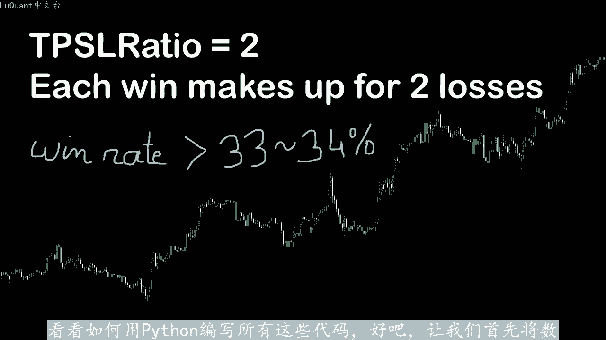
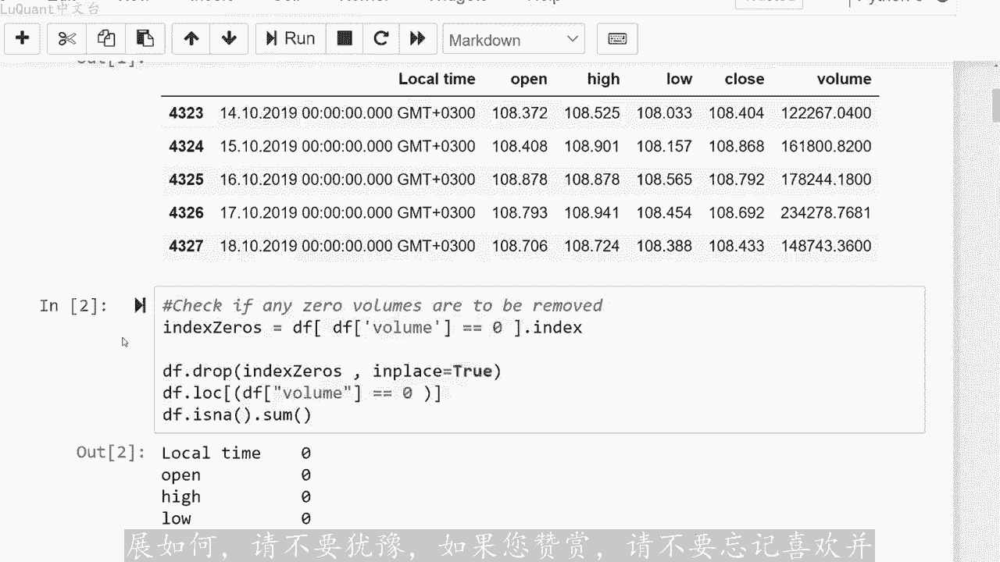
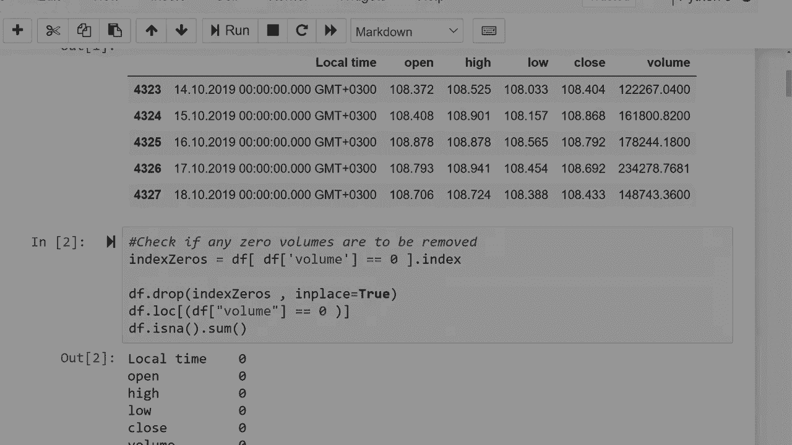

# python量化61：射击之星可信吗 - P1 - LuQuant - BV1FK421i79F

大家好，欢迎再次观看其中一个视频。这次我们将讨论烛台模式如何在pyython中对其进行编程，以便我们的代码将识别特定模式，并可能检测价格趋势反转。然后我们。使用烛台信号回测试策略，通过简单的统计方法。

我们将检查依赖烛台预测的自动化机器人获胜的机会有多大。因此，如果您对内容感兴趣，可。从下面描述中的链接下载程序文件，我希望你们会喜欢这个视频，所以这个视频并不是专门解释烛台模式的。

我假设你已经知道这些模式，只是让我们浏览一下一。最著名的烛台形式，并记住这个列表并不详尽，所以还有更多的模型。我们现在只关注基础知识，您可能已经知道十字星显示出未定的结局。然后我们。😡，流星。

所谓的流星，您不必有两个彼此相邻的，您可以采用第一种形式或第二种形式。最重要的是让这条长尾位于烛台主体上方。例如，当您看到这。并且您有上升趋势时，它可能表明您可能有一个上升趋势，在这种情况下趋势反转。

所以您可能会预期在这种烛台之后，您将转向下降趋势。然后我们有锤子线，锤子与流星非常相似，尽管它以某种方式倒转。所以这表明您是否有上升趋势，此时有某种拒绝长低尾。在这种情况下，您可能会出现趋势反转。

可能表明您的上升趋势即将结束，此时您将出现下降趋势回撤。然后我们进入看涨吞没模式。这是当您处于下降趋势时，您的最后一根蜡烛。此处的红色蜡烛，但随后他完全被更大的向上蜡烛、绿色蜡烛覆盖。

这可能宣布下降趋势的结束和后续上升趋势的开始。然后我们有看跌吞。形态当您的看长吞没形态与我们所看到的看长吞没形态完全相反时，就会发生这种情况。您有上升趋势，那么你有两个烛台，其中一个是向上烛台。

这是上升趋势的最后一个烛台。然后他。被更大的烛台覆盖宣布上升趋势的结束，并且可能是下降趋势的开始。因为我已经说过，我们还有其他烛台模式，但我们不会在这里便利所有烛台模式。因此您可以看到三个人。等等。

但在这个视频中，如果您将下降趋势反转为上升趋势，我对流星或锤子特别感兴趣。为什么因为这是我最喜欢的模式之一？它清楚的显示。市场对趋势的反应上升趋势。

我的意思是你可以清楚的看到卖家进入市场并拒绝一定的价格水平。这就是为什么我比其他模式更倾向于信任这种模式。尽管你可能。同意我的观点。当然，这取决于你如何使用这些模式，和您将这些模式与什么相结合。

我的意思是您可以使用不同的指标或仅使用烛台，这取决于您使用的策略和许多不同。参数。但在我的情况下，在我们的视频案例中，让我们采取这个一个是大米被拒绝的一个很好的例子。卖家的反应非常强烈。

这使得这个烛台的形状像。😡，在这里看到的那样，以及我们在这里称之为流星的长尾。特别是我们感兴趣的是，如何用pyython编写此模式，如何让我们的机器人识别此类模式。当然您可以随时教我们。😊。

在本视频中看到的内容扩展到您更感兴趣的不同模式。然后我们还将回溯测试该策略，我们将依靠流星来检查这是否是一个获胜指标，或者它只是一个随机指标，就像许。其他有希望的指标一样。

所以让我们继续看看当您看到我们应该关注的烛台模式时，它是否自然值得对于卖出信号。你有该水平的开盘价，然后您。该水平的收盘价。但与此同时，在此烛台的时间范围内，你有非常高的高位和非常接近的低位。

低位和收盘价非常低此处非常相似，要在pyython中进行编码，我们可以执行以下操。最高值减去开盘值除以主体，主体是开盘价，减去收盘值，这是烛台的主体长度。所以我希望最高价减去开盘值。

打开这个距离除以身体长度应。高于一定的比率。如果它是两倍高3倍，高4倍，高我十质，暂时不知道，我要在代码中测试这些大案顺序。为了让我的代码识别这个形状。第一个规则。与尊重的比例进行比较。

然后同时我不想让这个下尾太大，所以为了限制这个我要这样做收盘价，减去最低价，除以最高价，减去开盘。应该至少是这条长尾的一半或4分之1。所以这里的这条尾除以长高纬应该等于0。5025用户或您。

根据市场进行调整或优化。因此请记住，我们这里有两个比率，比率一和比率2，这是用于买入信号的卖出信号。我们可以应用完全相同的方法，仅采用对称值，现在不详细介绍所有细节。但。

单独使用烛台并不足以获得准确的单元格或购买信号。因此，他们应该与您最喜欢的指标相结合。在这种情况下，我们将把这些信号与RSI以及某些值相结合RS。相对强弱指标。

您可能更愿意将这些指标与不同的技术指标甚至基本面分析一起考虑。也许仅仅蜡烛图本身不足以现在用于回。我们预测方法的胜率。我们必须将其与策略。首先我们确定买入信号，稍后我们将讨论技术细节。

但此时我们知道我们需要一个止损值，因此，对于买入信号来。它将是价格值减去平均真实范围，这就是ATR的常见用途。如果您不熟悉的话，ATR是决定止损位置的一个非常好的方法，因此它不会太接。

以至于经常触发也不会太远。如果现在由价格值触发，将会导致巨大损失。因为当您的市场非常波动时，您的ATR将足够大以增加您的止损缺口。如果您没有波。您的止损缺口将会非常小。AT2。在这种情况下。

您的止损将相对接近您的价格。那么止盈等于价格加上一定的比率，我将其称为止盈止损比率乘。ATR对于本视频中的事例，我们将止盈止损比率等于2，这意味着止盈是止损的2倍，这样每笔盈利交易都会弥补两笔亏损交易。

让我们考虑一。例如，我在某个时刻有一个买入信号，然后我将根据这里的公式计算，止损值，它是价格减去ATR，然后止盈与我的买入信号的距离是止损的2倍。应。他将处于这个水平，这是我的指盈。

我将让我的程序针对这些烛台向前运行，并检查价格是否会首先触及止损。在这种情况下，我将进行亏损交易。如。他首先触及止盈值，我将进行盈利交易。因为我们将止盈止损比率设为2。

这意味着理论上每笔获胜交易都会弥补两次损失。在这种情况下，我们需。34次正确才能拥有获胜系统。我们之所以说理论上是因为这里我们没有计入交易成本、经济商费用和隔夜掉漆价值，现在让我们保持简单长。

看看如何用pyython编写所有这些代码。好吧，让我们首先将数据加载到文件中，以美元日元为例，对每日烛台进行评估。因为我相信。

每日烛台进行分析更容易，与较小的时间范围相比，噪音更少，波动更少，不确定性更少。我拥有的数据是在这两个日期之间的第五个日。2003年5月和2019年10月19日，它是1个CSV逗号分隔之文件。

因此我将在此处使用pandas模块中的读取下划线CSV函数，并将所有这些内容存储在一个数据框中，并将其存储。我的pandas数据框中要调用F，并确保所有内容都正确读取。

我将简单的打印DF尾部或数据框的头部。因此这里我们有4327行，然后我将测试是否。任何烛台的交易量等于0，因为这些是天数，如果你有问题，要么是数据本身有问题，所以我要去掉这些。正如你所看到的。

接下来我们没有任何。成交量为零的烛台，因为我将使用一种策略，其中我需要ATR之和RSI指我必须将它们包含在我的数据框中。所以我将使用panda support。技术分析模块它就这么简单。

我将把ATR列称为函数ATR返回的值。从技术分析模块考虑到我们使用每日烛台以来的过去时。RSI我还将默认使用过去14天的RSI函数添加它，并且我将删除所有无效的数据正确清理后，我们将定义一个函数。

该函数接受一个数据帧，并根据烛台模式返回一个信号。如果。买入信号或卖出信号。在此函数中，我们将测试一个单翼模式，即流星或如果你想检查买入信号，那么在这个阶段。必须重置我们的索引。因为当你删除NA行时。

所以将不再是连续的数字，所以我们必须进行重置。然后我将存储将我的数据帧的长度放入变量。高列表将包含高列值，然后包含存储在低列表中的数据真的低列值，关闭列表和打开值的打开列表。然后我将定义零值相。

长度的数据帧列表，一个用于每个烛台的信号，一个用于AI差异、低差异、实体差异，以及我们之前在算法中解释过的两个比率。现在我们准备开。在此函数中进行分析，对于数据框中的每一行高差等于最高值。

减去开盘价和收盘价之间的最大值。应。如果您想回顾一下我们刚刚解释的内容。这就是高纬的长度，您可以在此处查看此表格，这是烛台主体上方的高纬的长度，主体差异只是该主体的长度。

高度它是开盘价减去收盘价之间的绝对值，因为值将影响我稍后的计算，如果开盘价等于收盘价，那么我不希望它具有零值。在这种情况下，如果主体差异为0，那么我将得到零值小于0。002。这是一个神奇的数字。

我只是随机选择这个，这样我们将给它一个主体差值0。002。换句话说，它不能低于这。Zhi。那么负债差值就是开盘价和收盘价之间的最小值价格减去烛台的最低值。这是您可以在烛台主体下方看到的小尾巴的场。

然后我们定义第一个比率，比率一是长尾长度除以主体的高度差，身体长度和比率二的差异比率二等于低差除以。差异好吧，在这个阶段，我们可以开始寻找我们的细胞信号。在我们的例子中是流星，我要开始通过测试。

如果比率亦高于2。5，这意味着这里的尾部长度处。烛台主体的长度严格高于2。5。同时我希望下面的低纬部将是比最大长度的高纬的3分之1短。所以我要说的是，低差异小于高差异的0。3。现在我在哪里得出这些值0。

3和2。5，这些是您可以优化的参数。你自己的没有规则来决定这些，但是选择比率亦高于二是有意义的，只是为了拥有这种流星形式。具有低纬部，它可以是0。2或0。3，你必须测试哪一个会给你更好的结果。

同时获得结果。我不想拥有非常小的烛台主体。我想将烛台差异限制在0。03以上这。条件将定义我的流星烛台模式。但同时我们已经说这本身还不够，所以我还可以使用RSSI相对强度指标。我希望我的LSI高于5。

百分号并低于70%。我使用这些值的原因是低于50%，可能是一个表明我们货币超卖。但是如果您的价。高于70%，则也可能表明强劲的上升趋势。当您的RSI值如此高时，我不想以单元仓位进入市场。因此我认。

销售的最佳值在50到70之间。所以如果所有这些条件都成立，我在该特定行的信号将等于一。所以这是我们的第一个类别即单元格类别。同时我们可以执行相同的方法。为了减。买入信号显然，烛台将具有对称形式。

你有一个较低的较长尾部和一个非常短的高纬部。当然，这也与RSI值相结合，我采用的RSI小于50。百分号，但也高于30。所以您可以看到它不是很对称。您在买卖之间存在一些细微差别，这是非常有趣的。请记住。

市场不是对称的，您不能对销售机器人使用相同的条件。而。对于购买机器人或购买信号，我更喜欢以完全独立的方式优化买卖信号。在这个阶段，我们的功能已完成，因此我们应该简单的返回信号。

然后我可以通过调用将这些信号添加到我的数据框中。如果我想计算我的数据框中收到了多少个脉出信号，我可以简单的在此处执行此命令。正如您所看到的，我们现阶段有36个脉出信号所。

只需记住这些是15年内的36个信号，所以数量并不多，他每年为您提供大约两次交易。但是您不必坚持使用一种单一货币，您可以对10种不同的货币应用相同的程序或相同的机器。这将导致每年大约20个信号。

所以现在我们可以移动并测试我们的策略，我将定义一个名为目标的新函数，它需要两个参数，前面的柱形图。从某个位置或从某个烛台开始的数据框的名称，该函数将查找前面的多个柱形图。

假设提前16根柱线或提前18或20根柱线，它将检查价格是否会首先触及值。或获利。在这种情况下，我将定义我是否有盈利交易或亏损交易止损，这里给出了损失，价格和止损之间的差距是由这里的点差提供的。

正如你所看到的，我使用的是ATR屏。真实范围值，我没有将它乘以任何它乘以一的值。当然，这样我的交易将是有效的，止损必须有一定的最小值，它不能太接近价格。所以在这里我们。😡，日元美元交易的最小值设置为1。

1，止损获利比率设置为2，这将定义价格和止盈值之间的差距。然后该函数将执行其预期操作，它将预。测试所有条形图，看看价格是否会首先触及止损或者首先止盈。如果价格没有触及这两个值中的任何一个。

我们有第三个类别，它等于0。趋势类别0，这意味着我们对某个烛台或某个柱没有明确的趋势，并且基本上就是这样，这就是这个函数的作用。它会返回结果值，我将向您展。此阶段的数据框，好吧。

我们有开盘价、收盘价、收盘价、成交量列ATRRSI这些只是一开始的无效数字。因为请记住，我们至少需要14或10个值才能获得第一个实际。具体取决于您使用的参数，然后我们会得到信号。如果我们有射击。

则信号等于一星型。如果它是倒转的流星，则它等于2，即表示购买趋势反转的信号。我们为每个烛台的每一行都有趋势列。现在让我们尝试检查数据框的尾部，基本上就是我想要的这里要测试的是我的信号等于一的次数。

这意味着细胞信号并。实际上，真实趋势也等于一。因此，我的信号对于我想要的买入信号也是正确的次数，百分比测试我预测品牌等于二的次数。这意味着购买信。以及信号正确的次数，意味着同一行的趋势值也等于2。为此。

我将进行设置一些条件。如果趋势等于一，并且信。同时等于一或者如果趋势等于，并且信号也等于。那么在这种情况下，我将有两个值，我将把这些值存储在结果部分中。结果列是一个新列，我将把它添加到我。数据框中。

现在我将单独测试每个类别信号的精度，这样我将打印我们的次数，真正的阳性细胞信号除。细胞信号总数对于我们上面取的值，我们有61%的精度。请记住，在这种情况下，任何高于34%的值都是赢家。

因为我们的止损获利比率等于两个，现在为。完成分析，我还可以绘制或打印误报，这意味着我的信号何时给我一个错误信号，这就是我们在这里所做的我正在打印所有物报，让我们以这里的烛台为。数字580。

让我们下去绘制550和650之间的烛台。我要检查数字580。好吧，如果我在这里看对了，这个就是580。所以你可以看到他实际上是流星，所以我的程序工作正常，但是他背后的趋势有点上。😡。

似乎在下跌之前触及了我的止损值，然后价格再次上涨。所以看起来我正在触及止损值。在这种情况下，在触及止盈值之前，所以这是烛台的错误性。但请记住，我们还考虑了RSSI。

因此这两个信号不足以防止我的模型在这种情况下给我一个误报。我们可以继续检查另一个例。数字760candlesstick760。在这种情况下，我将绘制candlestick700，直到假设800。

我将去检查760。好的，就是这个。如果您可以在屏幕上看到它它是一颗非常漂亮的流星，它相对于烛台的主体有一个很长的尾巴，开盘价减去收盘价或这些值的绝对值。然后我要去价。上涨。

然后似乎在触及止盈之前触及止损值，尽管价格正在下跌，所以这并不是一个完整的信号，这是一个真实的信号。但是这里市场的波动。使得我们在进入正确预测的趋势之前，触及了止损值，这样您就可以看到模型运行正常。

我认为它是正确的，并且60%的情况下。确实很好，但是您总是需要此帮助人类的特征，这就是自动交易机器人与算法交易之间的区别。在自动交易机器人中，您完全不会干预所有交易，所有交易均由您的程序自动完成。😡。

算法交易就像我们在这里所做的那样，它是一个定制指标，就会给您一个卖出或买入信号。然后您需要人工干预来决定是。应该进行该交易。在这种情况下，如果您看到该信号，并且您的程序会收到一条通知，表明您有卖出信号。

你自然会把止损设置在这个值之上。所以在这种情况下，我想。😡，实际上这是一笔获胜的交易。现在我们可以同时检查我们的买入信号。在这种情况下，我们在15年内有92个买入信号。

所以它是我们考虑的参数的卖出信号的3。我将在这里将其更改为2，如您所见，我们约为42%，因此它的表现不如卖出信号，但它仍然高于34。所以理论上你仍然是使用这个系统的赢家。当然我们可。😡。

像销售信号一样继续进行，我们可以检查物报。例如我将选择40039烛台或39烛台，所以让我们继续下去检查400和480。我要绘制这些，我要检查439好吧，所以这里是这个，这是439。

因为你可以看到有一条长尾巴，实际上它具有购买的形状性。看起来RSSI也没有阻止它，但是在这个完整的信号之后，我们出现了下降趋势，并且我们显然在上升到止盈值之前触及了止损。因此您可以看到它并不完美。

但您不。发现总的来说，完美的系统就是这个视频的，我希望你们喜欢它，您可以使用jupyter笔记本，并修改这些参数，并自行调整这些参数。也许您想在这里使用不同的。

也许您可以应用这些值不同的货币或不同的股票市场等。如果您想修改任何内容或对此主题有具体问题，请在下面的评论中告诉我进展如何，请不要犹豫。如果您赞赏，请不要忘记喜欢。

订阅此内容，下次再见，祝您交易愉。

