# python量化62：常见的量化交易坑 - P1 - LuQuant - BV1gm411k7th

您有没有想过？如果有一个程序可以在睡觉时代表您执行获胜交易，或者您在有或没有编程知识的情况下享受自由的乐趣。那么拥有一个获胜的交易机器人会是什么样子。您可能已经想过了，像我一样，也您花了几个小时。

几个月甚至几年的时间来实现这个神秘的代码。当引入机器学习时，他可以解决圣杯并改变您的生活方式。许多人可能认为他可以在市场上创造奇迹。而对于许多人来说，这是事实。😊，营销销售等许多其他领域。

机器学习仍然在两类应用中遇到困难，它们是天气数据和价格市场预测，这是由。

在这些领域获得的数字具有高度随机性。因此，人们经常会问同样的问题，说实话，是否有可能使用机器学习来预测价格。答案是一个灰色地带，只有当预测类型与适当的交易策略相结合时，我才会将其限定为。

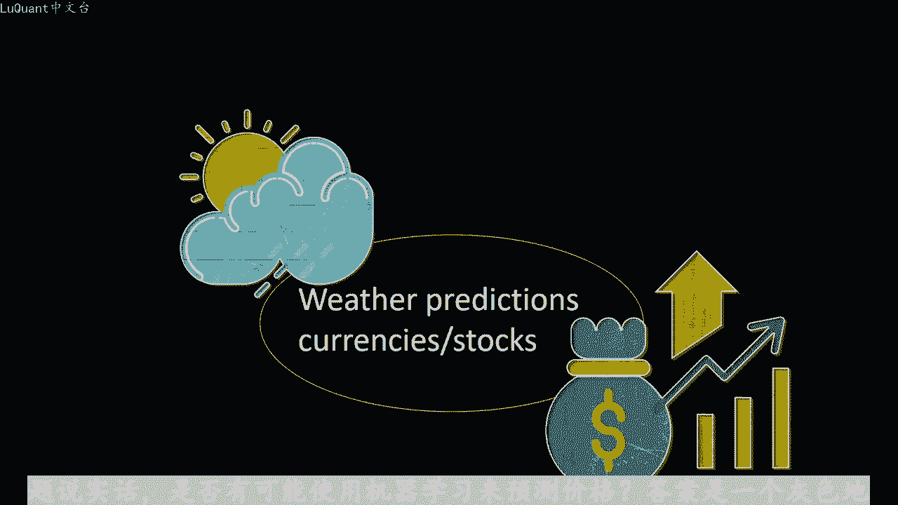

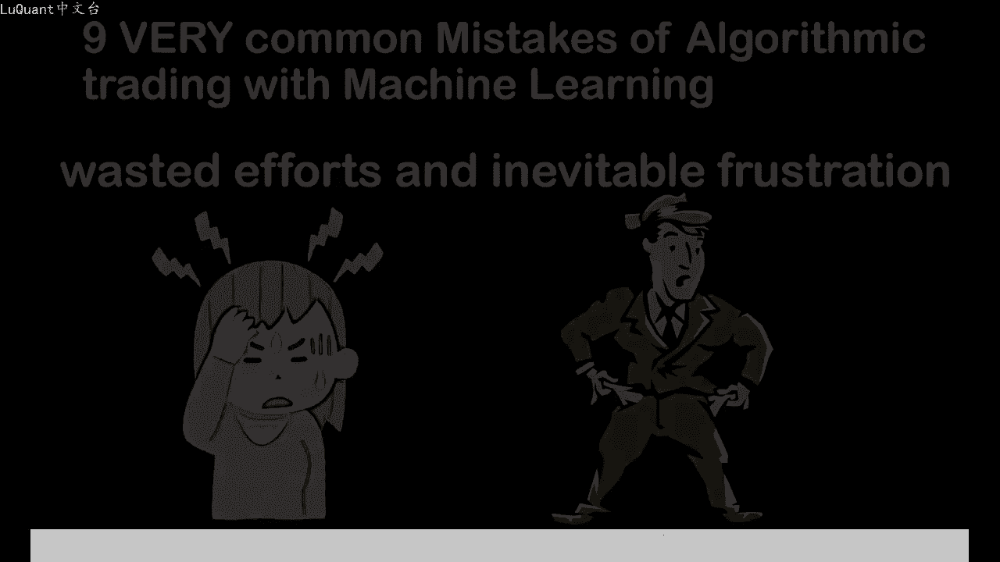

好吧，所以这不是一件容易的任务。但很好新闻是我要告诉你哪些错误会阻止你的模型工作，避免这些错误，会增加你成功的机会，节省你的时间和精力，让我们从第一个初学者的错误开。😡。

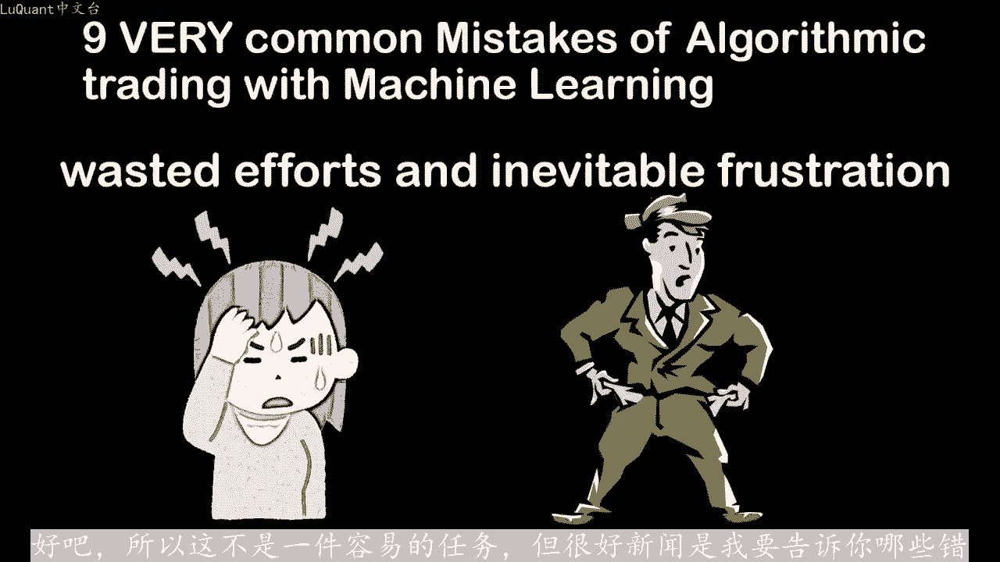

使用回归器将价格值拟合到机器学习模型中，尝试预测下一个市场价值并不是这样的这种方法可以为与其他一些可衡量指标自然相关的值提供出色的结果。例如，如果您尝试考虑房屋。表面机器学习回归量来预测房屋的价格。

在这种情况下是您的最佳选择。但是股票和货币市场与时间变量之间没有明显的相关性，没有自然趋势，迫使价格朝两个市场方向之一发。只是因为时间参数令人惊讶的是，很多文章都在积极做广告这种方法。在我看来。

这只是向不知情的人推销梦想。如果你将回归器过渡你合到价格值，你会得到一个非。😡。

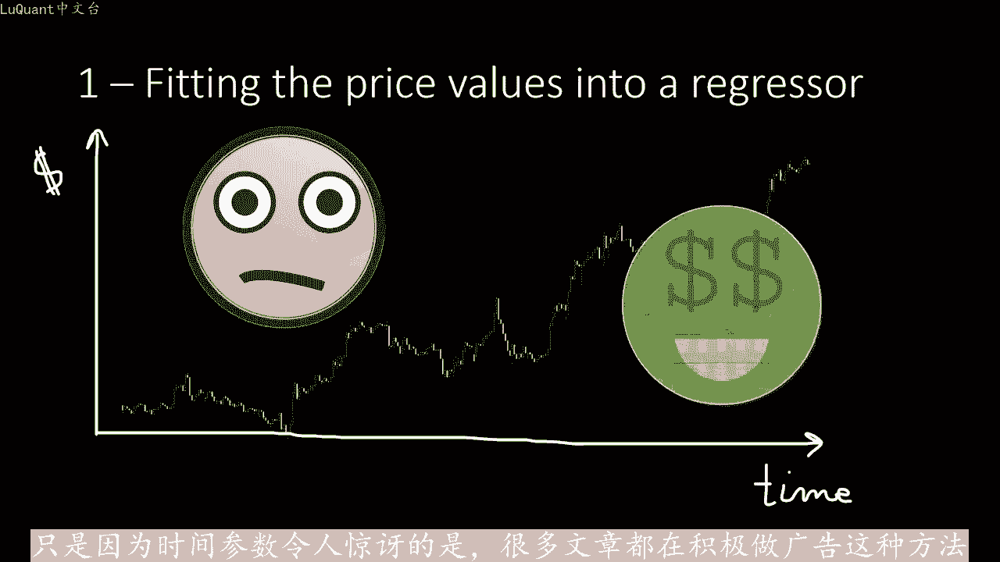

令人满意的你和曲线。但是这是你使用机器学习的最糟糕的方法，因为它肯定会破坏您的账户错误。第二个，使用绝对值作为模态输入，使用价格或计。指标值，这是另一个陷阱。如果您提供开盘价、收盘价、高价和低价值。

甚至移动平均线和其他指标，这并不意味着该信息是足以猜测未来价值这样看。如果我一次向您展。价格和三个不同的移动平均值以及RSSI。您是否能够猜测当前趋势或可能是几个小时内的价格平均值。您可能会注意到。

它是这是一个相当随机且困难的选择。对于您的模型也是如。事情是，我们的大脑在看到全局图像后用于处理信息。通过处理的信息，我们现在主要指的是价格变动和移动平均线的斜率。如果我向您展示整个价格变动。

你可能会猜测趋势。向上的，因为你可以直观的估计价格变动的一般斜率使用随机训练测试数据分割的错误。第三个采样数据，你熟悉sscreenn训练下划线，测试下划线分割功能。

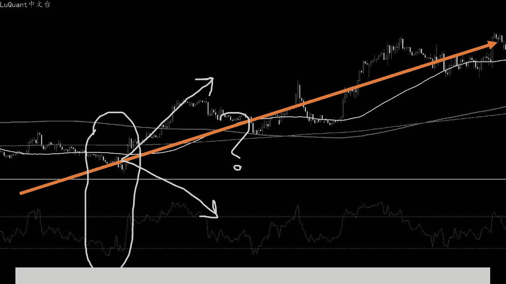

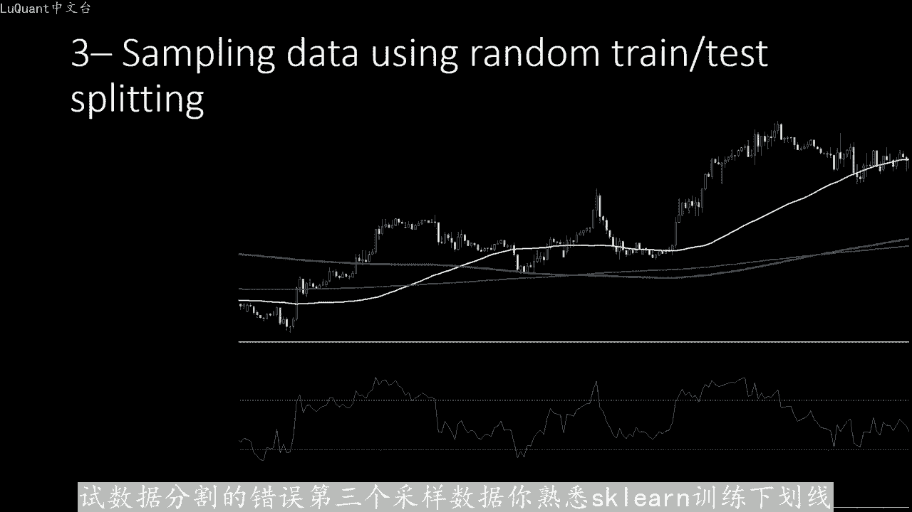

对于价格市场数据，应该避免使用它。尽管这是机器学习中非常常见的程序，在训练集和测试集之间随机分割数据，但在处理时间序列分析时，这是一个非常常见的陷阱。即使在已发表的学术研究中，我也看到了这。

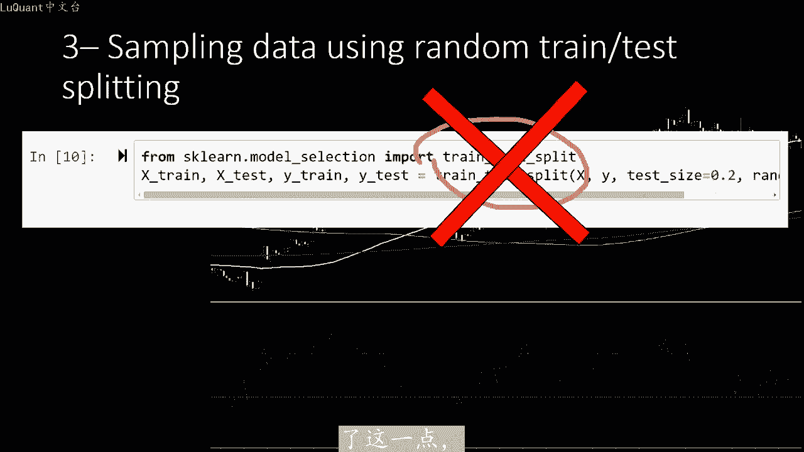

如果你使用训练测试、分割函数或任何类似的程序，您将以均匀的概率在数据点中随机选择，让我们在这里考虑我们的价格烛台。假设我们使用该函数选择80%，作为我们模型的训练数。剩下的20%。

我们将用于测试我们模型的精度。事实是我们的模型将适合您的训练级，但是您的测试集并没有太大差。

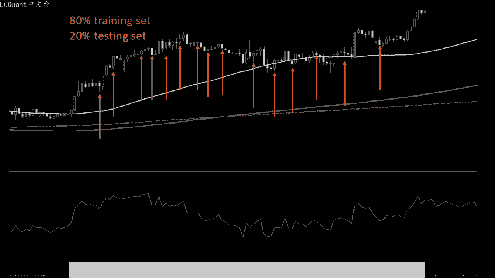

考虑到所有参数和技术指标，任何烛台都将与其邻居非常相似。因此，调整后的模型在发现相似性并为您提供良好的预测方面不会有任何问题。因为结果与训练烛台相似。换句话说，您在训练阶段第一次模型呈现给相同的情况。

两次还提供了未来价格的答案，以及第二次测试阶段的答案。这意味着您可能会在回溯测试模型时获得出色的结。但是，当面对仅依靠技术分析的新的实时数据错误。第4号时，同一模型将陷入困境。

虽然机器学习模型基于使用基本和自定义技术指标的数字。与任何方法兼容。但是即使您的模型在时间样本上表现良好，如果您不考虑经济因素，从长远来看，这也不够日历远离重大事件，因为他们可能会破坏您的结果。

并可能使一。

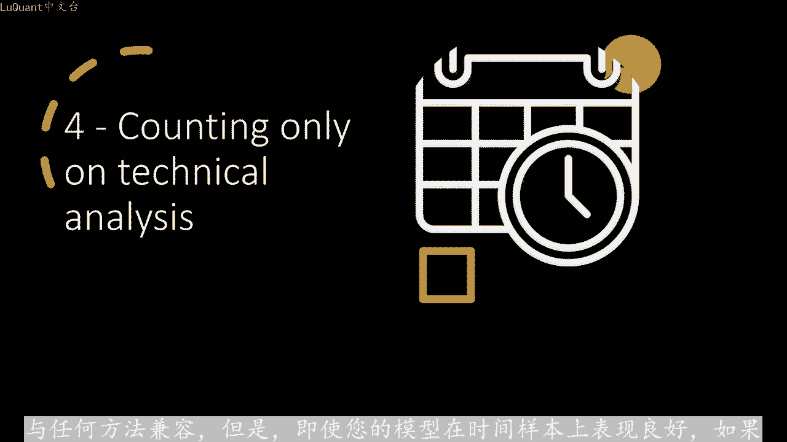

好的，模型名誉扫地，您可以在代码中插入一个函数，禁止在重大事件之前和之后执行订单错误，不考虑适合模型精度的策略，让我们考虑一下预测精度为40的模。

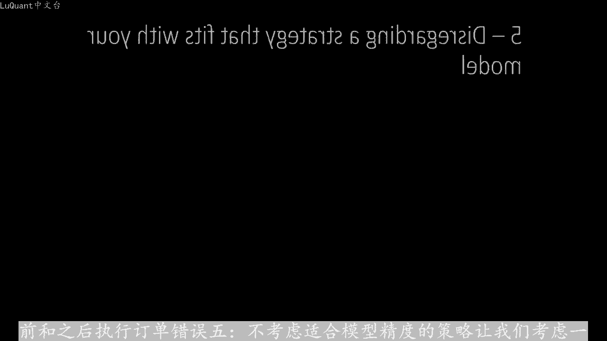

可能看起来像是一个亏损模型，因为40%低于50%，但如果将其与正确的策略，例如使用2比1的止盈止损比结合起来，这种精度可以使您成为百万富翁，将使每笔盈利交易的价。

相当于两笔亏损交易。换句话说，一笔盈利交易将弥补两笔亏损交易。在这种情况下，任何高于33%的模型精度都可以成为赢家。您明白了，不要评判模型，再将其与优化策略结合起来。

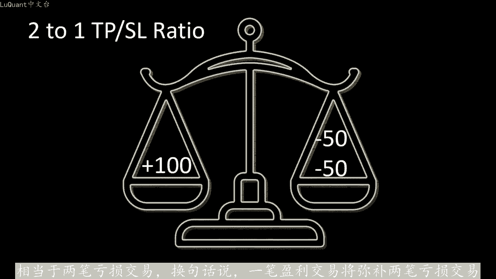

并进行回测之前，第六个错误仅依赖于模态链预测并跳过进入策略。这与前一点有关。其想法是，即使您的模型提供了良好的预测，您仍然拥有，要知道如何选择最佳模型来执行。订购换句话说，定义市场进入策略。

让我们以这里的趋势为例，并想象您的模型将预测正确的趋势方向在本历中它是上升趋势。但如果您执行买入订单，在错误的时刻，您可能最终会。达到止盈之前被止损价格补获。尽管您不会获得预期的结果。

并且如果您考虑佣金和交易费用，这甚至可能导致净值减少。即使您的模型提供了好的预测，这让我们直接进入下一个错误。第七点。没。考虑交易费用和佣金，而开始用简单的方法思考你的模型是件好事。

忽略费用和佣金可能会改变大多数算法交易机器人的游戏规则事实上或胜测。

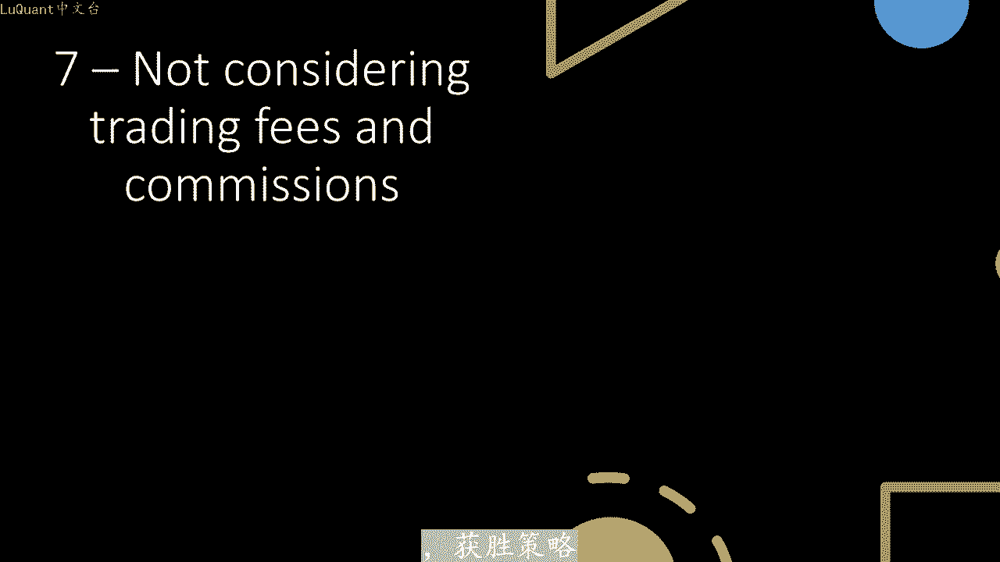

和失败策略之间的差异非常小，大多数获胜的技术模型只有百分之几的优势。我想说，3%到4%，这种优势可以被佣金和交易费用抹去。但是你可以避免通过遵循最小化这些费用的策。

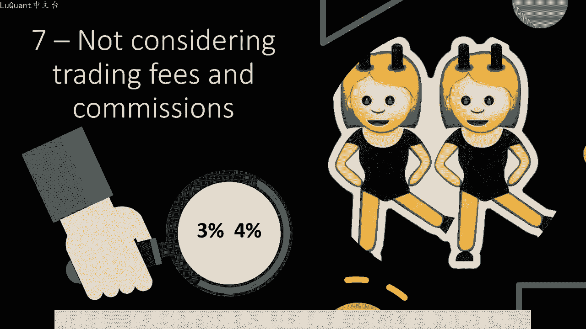

例如，在同一天关闭交易，而不是过夜或在周末。接下来在一小段时间内对模型进行回溯测试。就像标题所说的那样，在模型运行之前，您无法确认模型是否有效在不同的条件下进行测。

采用任何模型，并在一小段时间内对其进行调整。它看起来像是赢家，这就是销售获胜机器人的公司所做的。他们会向您展示他们的程序，给出积极结果的月份。但事实并非如此，意味着这种股票趋势将永远持续下。事实上。

这可能是该计划满足您期望的唯一时期。如果您想确定您的结果，您必须在6个月内测试您的交易程序，并且您的结果是否收敛，要想获得积极的收益。😡，您可以考虑开始投资。我们在该视频中的最后一点是。

当模型没有发挥作用时，我们会变得不耐烦并干扰交易。高精度模型通常对市场不是很敏感。换句话说，它会等待对于在执行交易之前发出强烈的信，这是很好的，因为它会增加我们赢得交易的机会。

但是我们会错过很多市场机会，一个好的交易者可能会比程序创造更多的机会。但如果你不这样做优秀的交易者，不会变得不耐烦。

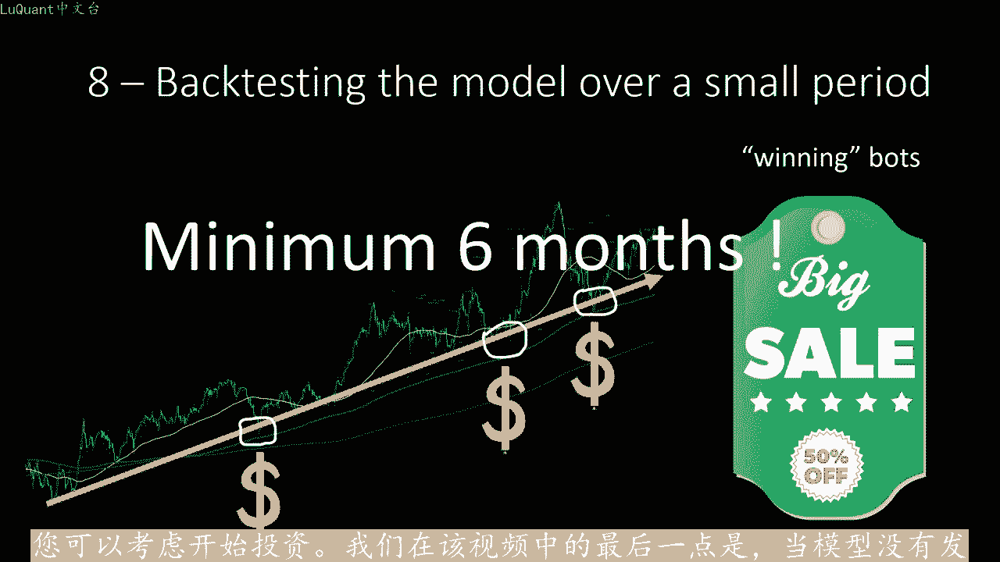

不会触动您的账户，不会干扰模型，不会开立新交易，也不会关闭您的程序开立的交易。即实已经过去一个月了。而且你已经没有为平仓交易，请记住零交易比亏损交易要。

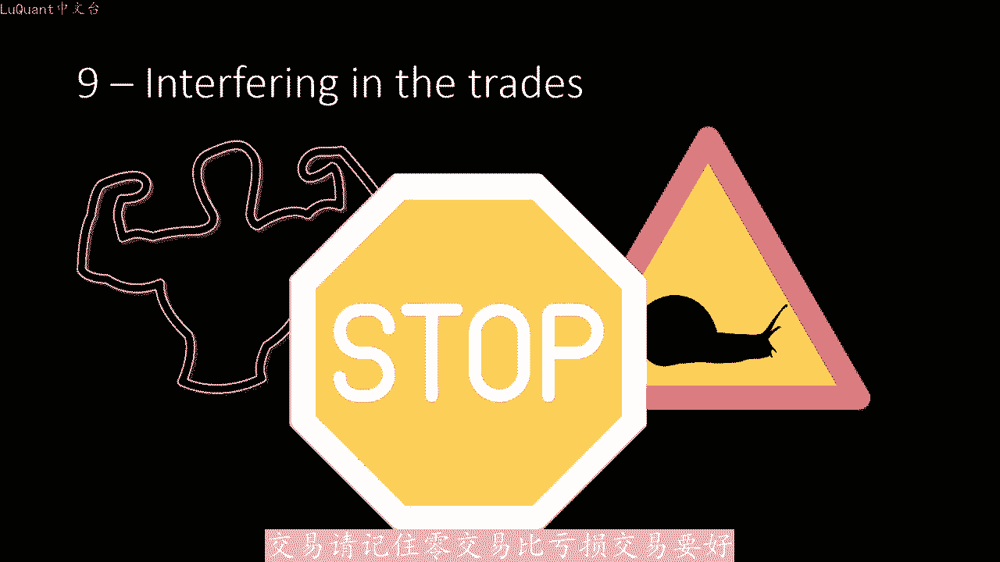

现在就这样，我希望这些信息将帮助您改善您的交易体验，并记住您的算法是否尚未准备好进入市场，但不要过度关注出去订购一份美味的热披萨切片，别忘了享受乐。

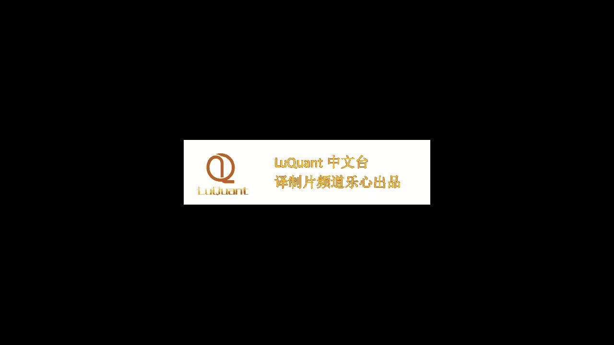