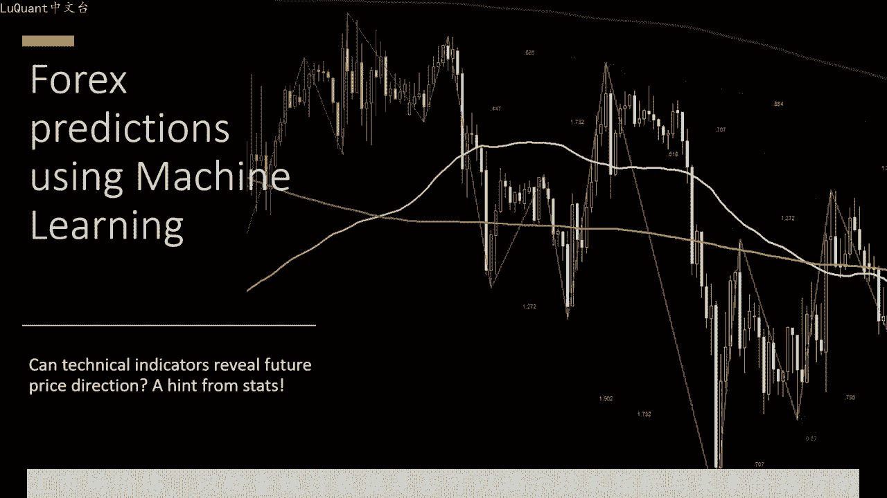
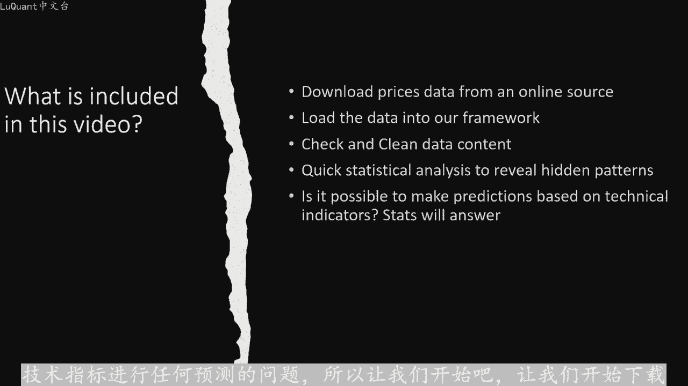
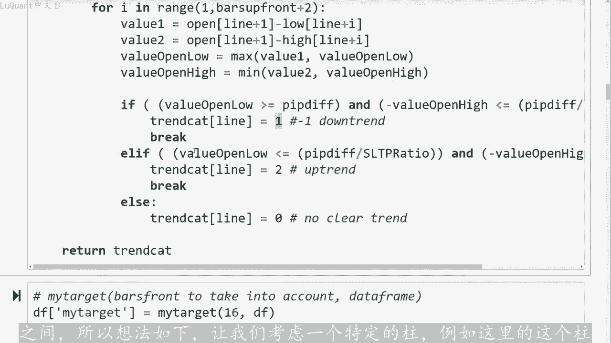
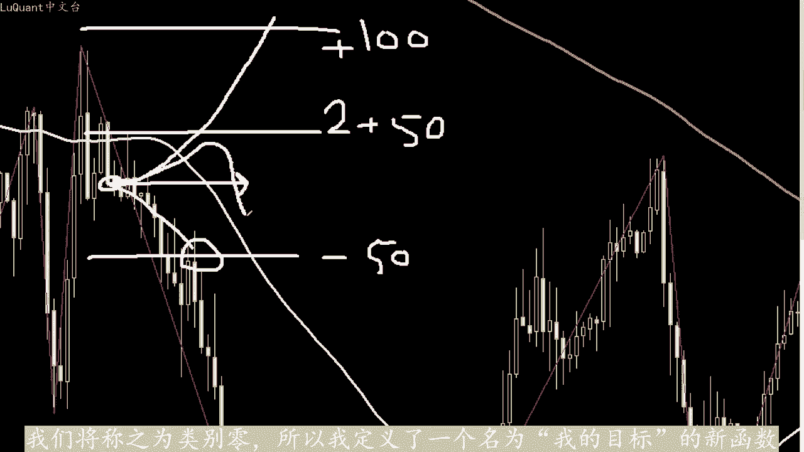
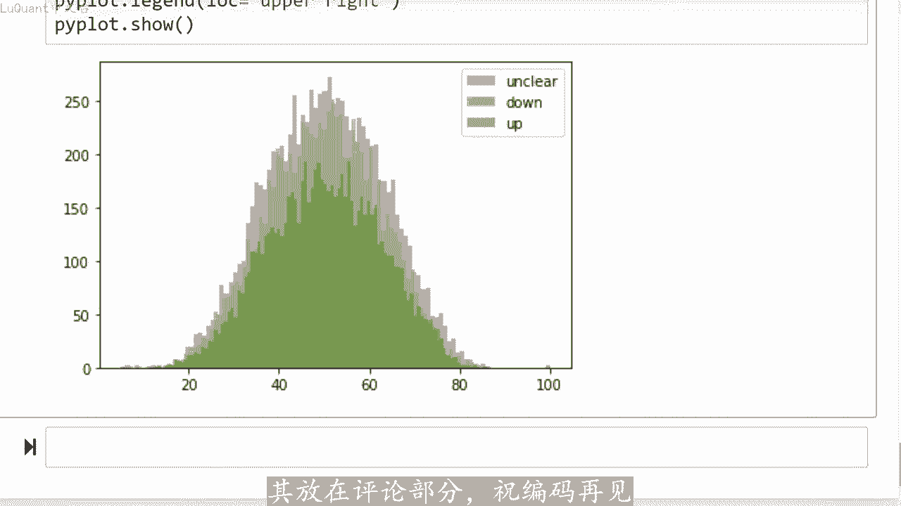

# python量化63：技术指标的计算 - P1 - LuQuant - BV1Er42187V3

大家好，欢迎再次观看本视频。我们将尝试使用pyython分析外汇市场价格，以检查统计数据是否可以揭示技术指标与未来价格方向之间的任何相关性。对于本视频，您不必是交易专家或编程。😊。

如果您熟悉基本技术指标，例如移动平均线和相对强度指标，也称为RSI，这将会有所帮助。您可能已经了解pandas和一些描述性统计数据，这肯定会有所帮助。但是如果您只是来这里了解一下关于。

机器学习应用程序和交易的快速想法。那么也欢迎您。因为我们将尽历使事情变得简单。在本视频中，我们将了解如何下载货币兑换数据，如何使用padas，将此数据加载到我们的pyython程序中，以及如何开始检。

😊，在我们开始考虑你和预测模型，并直接进入预测市场的复杂性和混乱之前，先了解数据的特征，了解数据的每一个可能的细节非常重要，这将使我们其余的编码变得更加容。因此。

我们还必须清除数据中的缺失值或奇怪或无用的值，并且从简短的统计分析开始，可能会揭示数据中的模式或相关性。如果您试图猜测如何构建和测试新的交易，这可能会很有。模型甚至新策略。因此，在本视频中。

我们将尝试回答是否可以仅根据技术指标进行任何预测的问题。所以让我们开始吧，让我们开始下载我们的数据，我将转到catop点com网。

并访问此页面在右侧您可以看到历史数据源，只需按一下它，它就会引导您到此页面。您可以在其中有不同的选项，您可以下载外汇数。也可以下载债券和股票等您感兴趣。我将选择主要货币，并选择美元对瑞士法郎。

您可以在这里选择主。时间范围我将选择1小时和4小时烛台，你也可以精确，如果您对出价或要价感兴趣。那么我们的此类研究视频并不重。您可以指定您感兴趣的时间段的日期，您也可以从数据中过滤掉周末。

因为在周末你没有价格变动，所以最。从数据中删除这些值，我自己更喜欢禁用过滤器。因为我将在python中手动清理这些值，然后你按下载按钮，它将引导你进入登录页面。如果您有账户则可以登录。如果没有，您可。

创建一个免费账户，例如模拟账户，它还为您提供对所有这些数据的相同访问权限。因此，让我们通过导入paestly，并使用读取下划线CSV函数来开始我们的工。将下载的文件加载到我们的数据框中。

为了检查数据框是否正确加载，我将调用tll函数，它将显示数据框的最后5。我的数据中有什么？我们第一列有6列列是当地时间，试住的日期和时间，然后您将获得开盘价、最高价、最低价和住的收盘价。

最后一列将为您提。cco提供的交易量，因此这可能会有点不同，具体取决于您下载数据的位置。然后我必须对我的数据框进行一次小清理。我将检查卷列等于零的条件以。验证此条件的所有型，我将获取他们的索引。

并将其存储在索引林中。然后我将使用drop函数，删除所有这些型。我想从我的数据框中删除这些型，然后为了确保这些。已被删除，我将重新检查再次。如果DF卷等于零对任何型都有效。如果我运行此命令。

您可以看到我没有任何卷为零的型，那么我将检查我的数据框中是否有任何缺失值，并使用A。NA点总和，我将对所有这些缺失值进行求和，但我没有任何值，所以这很好，有点干净。现在我们可以继续下一步。

我将导入n piece和pandas技术分。这是一个专门用于技术的模块分析指标。因此它有一个函数列表，例如通过范围相对强度指标的平均线、移动平均线、简单移动平均线等。如果。想知道此包中包含的指标列表。

您可以运行指标函数。否则如果您想要获得有关特定函数的特定帮助，您可以简单的运行帮助函。因此，我将开始在我们的数据框中添加一些技术指标。我将从调用函数ATR的平均真实范围开始。如您所见。

这里需要一个参数及长度。其设置为20，这意味着将考虑最后20个柱来计算ADR我还添加了RSI，但我没有在此处设置任何参数。所以默认情况下，我认为它需。最后14根柱线，那么您就得到了平均值。

我称之为平均值。事实上它是每根柱线的中间价格，这里的三个移动平均线，第一个考虑了最后40个柱线。第。各是80个柱线和最后一个柱线是160根柱线，这是外汇交易中的一种常见做法。

考虑三种不同敏感度的三种不同移动平均线。这意味。40根柱线移动平均线将对价格变动非常敏感，而80根柱线移动平均线的敏感性较低，或平均平均最不敏感的是160个。

然后我将定义一个名为get slope的新函数，它在参数中接受一组点，并返回由这些点定义的平均斜率。我将将此函数应用。三个移动平均线，40柱型移动平均线，80根柱线和160根柱型移动平均线。

然后我也将其应用于中间价格和RSI。因此我将在数据框中添加新供。定义中间价格和的移动平均线的斜率RSI我正在采用每个特征的最后6个值来计算斜率。我当然可以将其做。变量增加，但X是一个很好的数字。

我的意思是，它足以猜测平均斜率，并猜测每个特征的趋势。现在我们可以查看这些功能的新数据框，我将运行。T函数正如您在开头看到的那样，我们仍然有关于价格的起始列。但随后我们添加了ATR和RSI中间价格。

我称之为平。去除平均值，然后是每个的斜率。所以如果我们有一个负斜率，意味着这里的RSI正在向下。如果它是一个正斜率，我们有一个增加的RSI，所以我们也可以猜测去。价格趋势之上的技术指标好的。

所以我认为我们现在已经准备好开始一些分析。但是此类研究的最大挑战是定义你的目标，你的目标是什么。我已经看到很多研。尝试在我看来，估计或猜测第二天或接下来两天的未来平均价格，这太雄心勃勃了，他无法公。

如果假设您想猜测是否价格将会上涨100点，或者将会朝着-100点的方向上涨，这是两类。第三类。价格将保持不变，假设在一定数量的柱内将保留几乎在正-100点之间。所以想法如下，让我们考虑一个特定的柱。

例如这里的这个。

他就在这里收盘，我将关注未来的下1个十或15或16或20根柱，检查价格的趋势是什么。假设我将止盈固定为100。这是-100，我希望价格下跌100点，我的止损是其一半，即加50点。

所以我的利润止损比为2比1，这意味着每笔货。交易将弥补两笔亏损交易，然后我将检查价格是否会在该区域附近徘徊，但随后会下跌，并超过-100点。再不触及我的止损加5。点的情况下，这对我来说是一个下降趋势。

所以我会将其标记为一个类别。我们可以说，另一方面，如果价格在不触及我的止损的情况下，上涨至加100点，是-50点。所。😡，这对我来说是一个上升趋势，我们称之为第二类。

如果价格将保持在-50点和正50点之间，我的意思是不超过这两个边缘。那么这是一个不明确的区。我们将称之为类别零，所以我定义了一个名为我的目标的新函数，它需要两个参数，前面的柱形图和数据框的名称。

您还必须设置两个值，其中一个是您的止盈的点。

我将其设置为450点和止盈止损比率，在我们的示例中应该约为2。因此，基本上这个函数将为我们完成工作。它将我们的趋势分。三种不同的趋势，下降趋势、上升趋势和无明确趋势类别。然后当我运行这个函数时。

我将在我的目标列中添加几。然后我将运行我的headide函数来检查我的数据框的内容，让我们检查结果。你可以看到这里的最后一列成为我的目标。我们可以看到我们对三种价格趋势有三个类。因此。

为了进行快速分析事例，我们将绘制数据框中的一些特征的直方图，主要是交易量ATRRSI中间价格移动平均线和计算出的。目标也包含在我们的分析中，这是我们所拥有的这些是所获得值的直方图，这是平均真实范围分布。

我们可以看到它从0到0。0。然后你有中间价格和中间价格斜率，并删除平均值RSI它工作正常。它在0到100之间，RSI斜率和我的目。列实际上我们可以看到三个类别的频率。

上升趋势和下降趋势的类别趋势几乎具有相同的频率，但是无趋势或不明确的趋势类别。频率稍高，如果您愿意将其纳入机器学习模型，则应考虑到这一点。那么您将获得斜率和交易量。而我不会详细分析这些图表的含义。

我只是想向您展示如何。快速查看数据并检查数据框中是否有实际值，或者是否有一些奇怪的异常值会显示在直方图上。所以我们的数据目前看起来很干净，让我们记。检查是否可以单独使用RSI作为趋势指标。因此，为此。

我们将定义三个不同的数据帧fop down和F不清楚，我将过滤误差大小上。趋势条形图并将它们存储到fu中，与将下降趋势条形图存储到F盾中的方式相同。不清楚的趋势条形图将存储到DF下划线中不清楚。

将绘制3个RSRSIS的直方图。对于这三个类别，我使用100个并，它有点透明。所以我们可以通过直方图看到，好吧，让我们看看我们得到的结。正如您所看到的RSis是对称的。

并且那里三个直方图之间没有明显差异，这意味着三个趋势类别将显示具有相同RSI概率的相同。这有点欺骗性，您不能仅依靠RSSI来猜测价格趋势，但不要气馁您可能想要尝试使用不同的技术指标进行相同的分。

也许可以将两个或三个不同的技术指标组合在一起，并检查这是否会给您猜测可能的价格趋势带来优势。我将在此停止观看此视频。我希望你们发现这些信息有帮助。如果您有任何具体问题，也可以。其放在评论部分，驻编码在。

