# python量化64：最实用的策略 - P1 - LuQuant - BV19f421f7zp

嘿，大家欢迎回来。我想我们在过去的几个视频中，一直在等待这个我们整理了一个基本的交易策略，优化了一些参数，并使用过去的数据进行了一些回溯测试。然后我们迈出了一大步，将我们的策略进入一个实时自动交易机器。

使用AWS服务在云上启动它，并让它运行整整一个月，今天我们将查看结果，显示交易的权益以及我们的交易机器人在近一个月的实时交易中的表现。这是代码交易。如果这是您第一次放。😊。

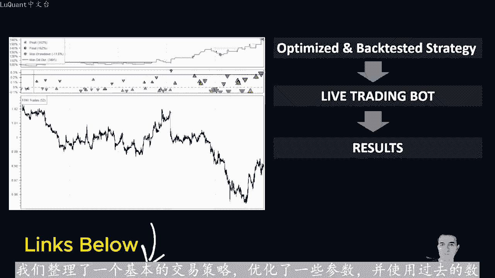

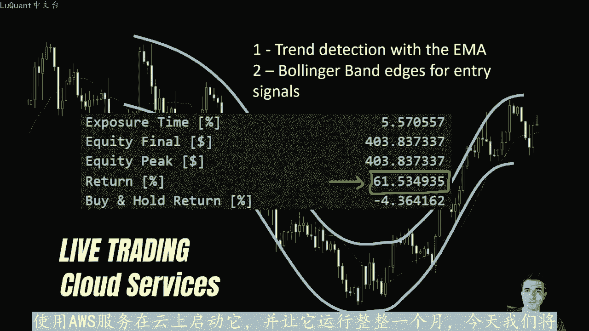

此频道，我通常会在视频描述中提供python代码和数据文件。如果您正在开始交易和回溯测试的算法之旅，您还可以查看我的一些python课程。python中的策略只是一个快速提醒。该策略非常简单。

我们使用两。😊，移动平均线来估计趋势，并使用biningerband来生成入场信号。如果您对该策略的详细信息，感兴趣回溯测试和之前的相关工作，我将离开描述中还有一些指向之前视频的链接。好吧。

那么现在我们是如何做的？我们的策略是如何运作的。

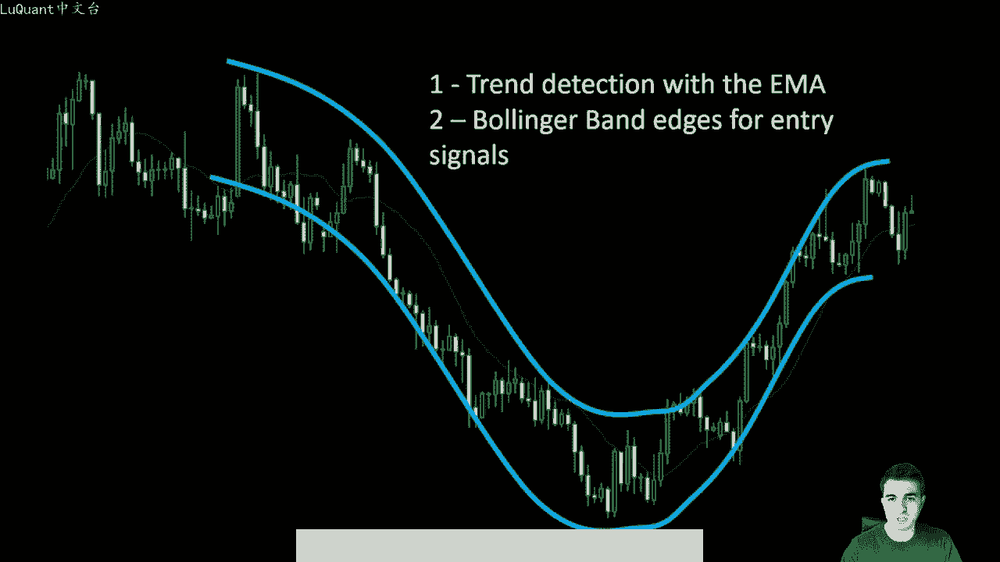

从我的经纪商平台下载了交易数据，该数据包含我们需要了解的所有详细信息、交易入场、持仓日期、退出时间、佣金和费用成本、利润和损失等等。所以我们需要的所有详细信息，我将数据加载到padanda数据框中。

看起来像这样，我们拥有所有详细信。

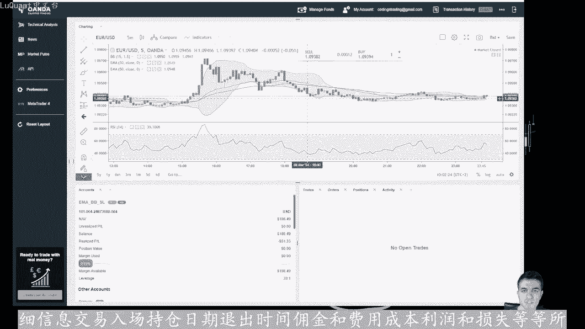

交易日期、交易类型，一些详细信息工具，例如，欧元因为机器人主要处理该资产、价格、单位、方向等。所以我们拥有通过经纪人提供CS。交易文件来分析交易所需的所有详细信息。然后我们就有了数据框架。

我只是选择了一个小的交易日期列的一部分。因为我们暂时不需要时间，我只是选择日期的天数，所以这就是交易日期列的修改方式。我们将交易日期和时间转换为日期时。😊。

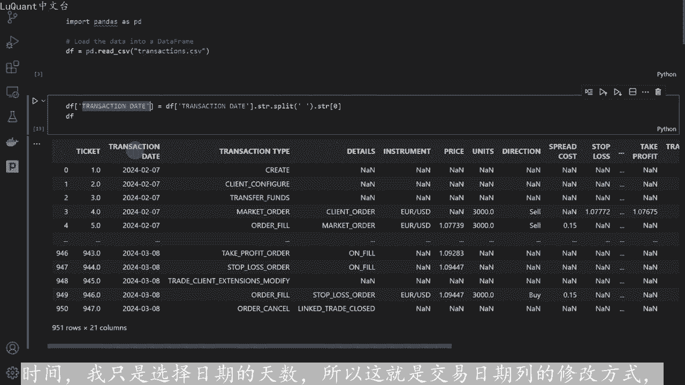

我要做的第一件事是清理利润损失比较劣中的空行。请注意，由于这些交易中的每一个都以多个行表示，因此，当订单创建时，它可以是一行。当创建订单时，它可以是另一行交易在关闭时，又打开了另一笔交。以此类推。

因此每笔交易都可以有三行或四行，我们感兴趣的只是这部分，目前是利润损失，所以我们对这些只感兴趣。所以这一项是02。34等等。所。当我们没有任何利润损失值时，我们将清理所有空行。

这就是我在这里使用这条线所做的。所以我们减少了子级利润，损失栏位等于true。然后我绘置U余额，余额意味着权益。所以无论我们这里有什么，我认为这。

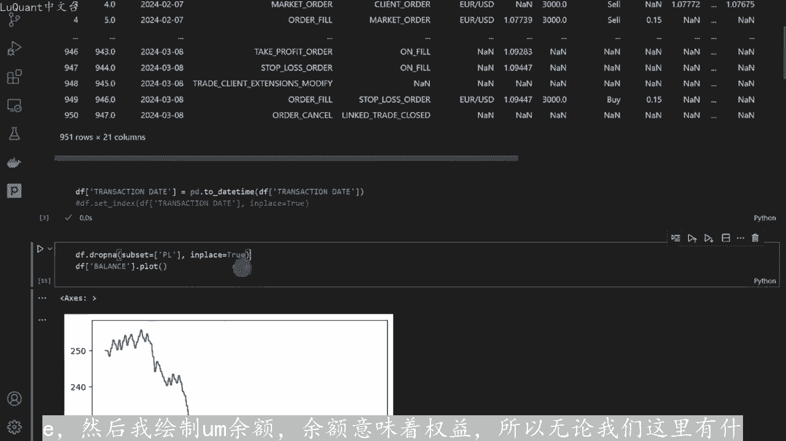

最后一栏，并注意，每当我们有一笔以盈利或亏损结束的交易时，余额就会被修改。因此这就是我现在想要绘制的，只是为了看看本月EO交易是如何发生的。我们可以看到我们。

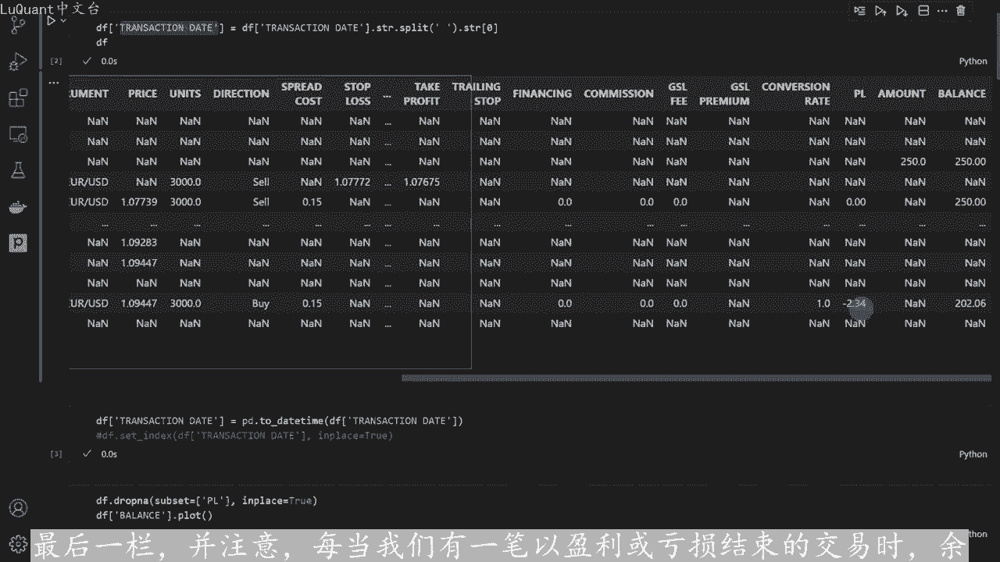

净值不断减少，我们从250跌至近2200美元。我们在一个月内损失了50美元，即现在我们的股本为20%，这并不是很奇怪。因为当我们回溯测试该策略时，我们确实经历了漫长而急剧的下跌期。但总体而言。

我们预计该策略会回升，使用此回溯测试的有趣之处在于，我想到了一些想法，当我看到结果后，我明白了为什么我们会有这种夸张的R下降。因为根据我们的回速测试，我们通常预计每月大约15到10的下。😊。

让我们继续分析，我们将讨论改进一会儿在这个单元格中的想法。我们正在绘制每天的损益。所以对于每一天的总体结果，我们都有一个积极的一天，例如，我们在250美元左右，大约2。5美元或3美元。

所以这不是一个大数目，我只是使用它作为纸质账户来测试我们的策略，这些都是积极的。然后我们也有消极的日子，并注意到这一天是非常消极的一天。所以这是机器。😡，表现不佳的地方，我认为我们应该寻找到目前为止。

如果我们想分析问题出在哪里，那么我们可以在2到3天内进行详细分析，看看我们是否可以改进和过滤这些错误信号，或者只是关闭机器人。阻止其进行交易例如，当未来发生相同的模式时，但总的来说。

我们可以看到我们的负面日子比正面日子更多，而且我们有更尖锐的负面天。然后从交易数据中的数据来看，我有兴趣知道。😊。

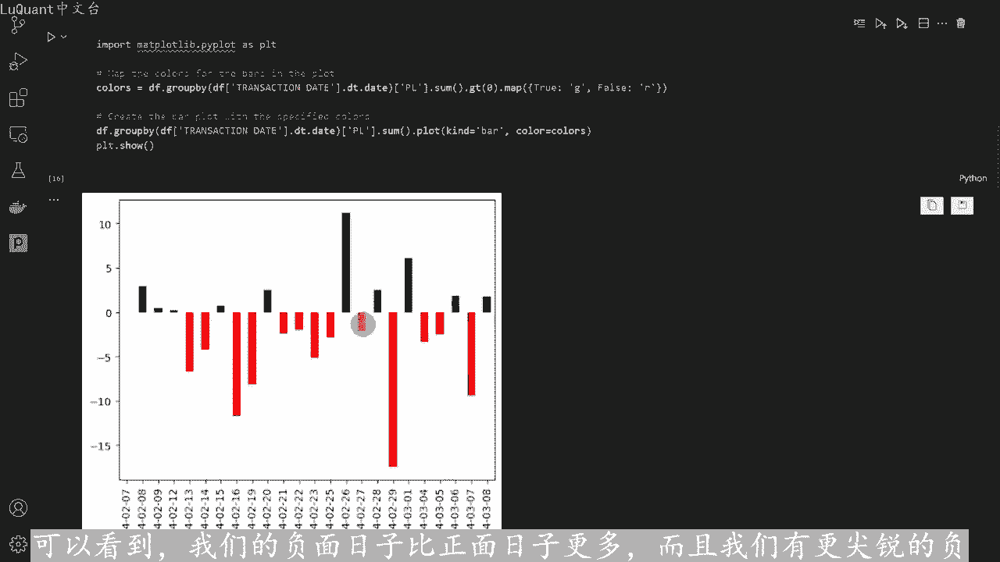

时间的推移，机器人的表现会更好。所以如果在早上或者根据交易时段，这就是为什么我们也可以分析交易时间。所以无论我们在时间部分之前丢弃什么，我们都将重新加载CS。😡。

交易文件我们将把交易时间保留在不同的列中。所以现在我有交易日期，但我也有交易时间列。他将向我显示交易的时间，让我很快的向您显示数据框。所以我们。交易日期，最后这是我们添加的交易时间，这是晚上9点。

晚上9点整，上午7点上午8点等等。顺便说一下，这是加2GMT。所以现在我们可以绘制正收益交易。

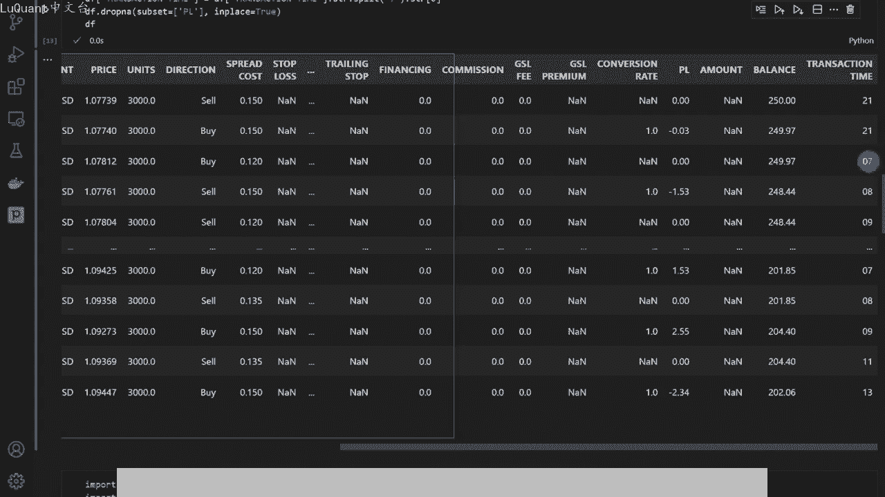

负收益交易的历史记录，看看正收益交易和负收益交易的时间是否有变化。这些是蓝色的，是利润损失负值。我们可以在蓝色背景中看到这些积极的。这些所以我没有看到时间上有任何差异，所以策略可以经历积极或消极结果。

在一天中的任何时间进行交易。所以在这种情况下，我们没有任何首选绘画。为了确认这一点，我们可。😡。

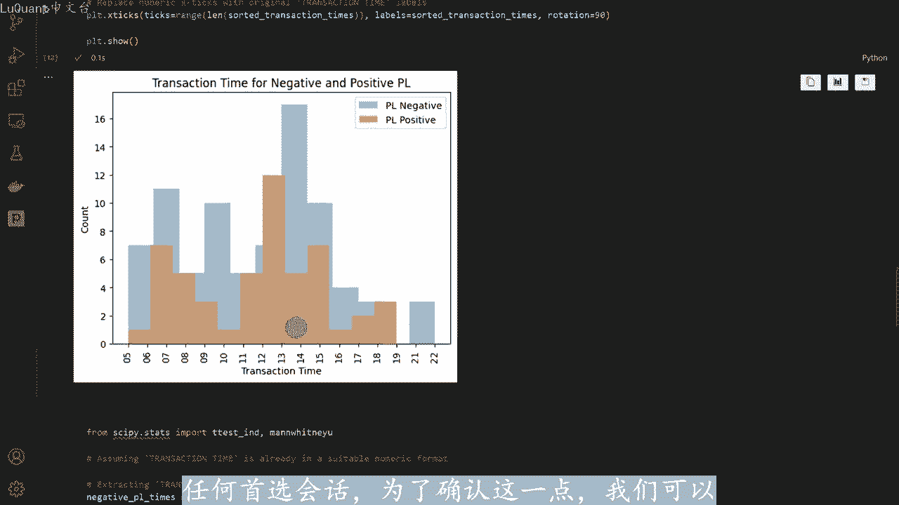

应用推论统计测试测试。现在的问题是，交易时间采用字符串格式，就像我们之前所做的那样，所以我们必须将其转换为整数或付偏要时间以及正利润损失时间。这就是我们在这里所做的。然后我。

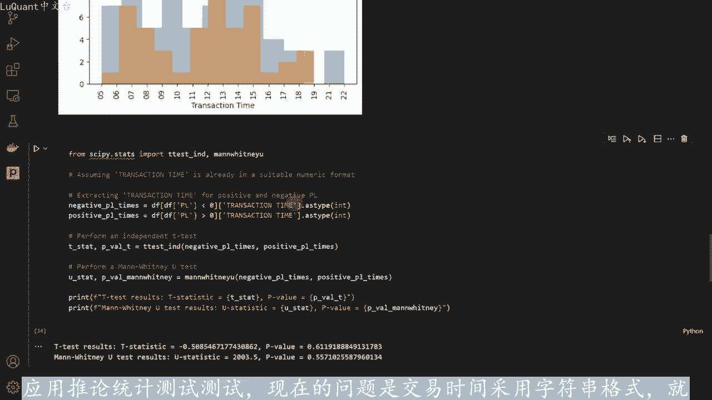

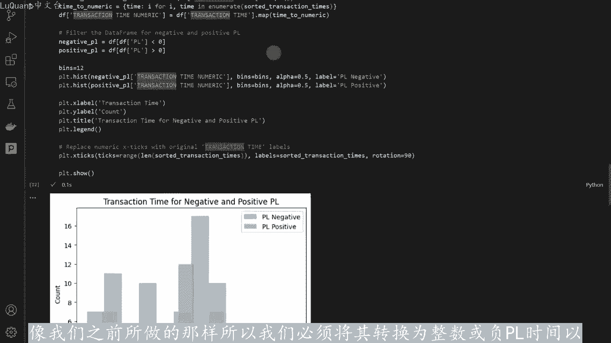

应用两个测试T测试和can Houstonton测试为什么？因为T检验假设这两个分布都是正态分布，但我们没有对此进行测试。通常我们还应该应用夏皮罗威尔库克警。

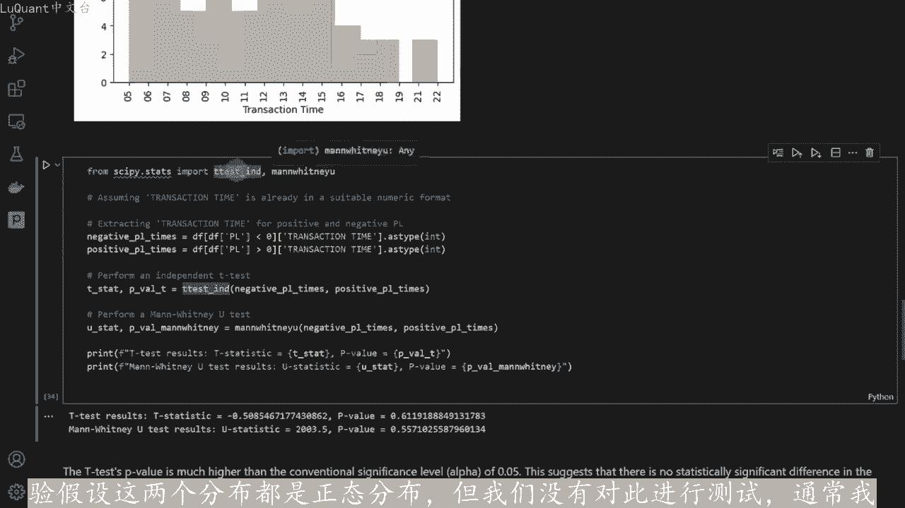

只是为了测试这两个类别的数据的正态性、负利润损失和正利润损失。但无论如何，如果不正常，我们应用惠特尼仁惠特尼测试，这就是为什么我应用两者只是试图。😡。

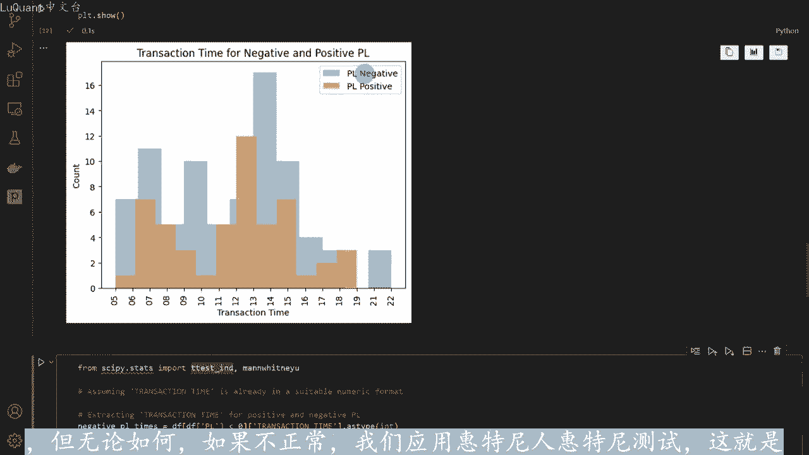

快速方式做到这一点。在这里我们得到的结果是P值高于500分号0。05，这个它也高于0。05。所以简而言之，我在这里为我们这两个测试做了一个简短的描述。他们表。

交易时间均值均值或中位数没有统计上的显着差异，因为T检验使用均值和均值惠特尼使用中位数，所以基本上这证实了我们的视觉假设及这两个类别之间没有区。

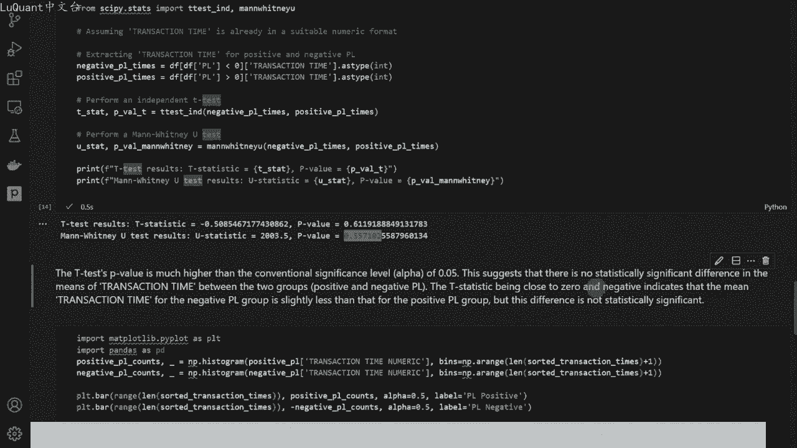

负利润损失类别和正利润损失类别，它们都有非常接近的分布，非常接近中位数和非常接近的平均值。这是另一个图像我们展示。

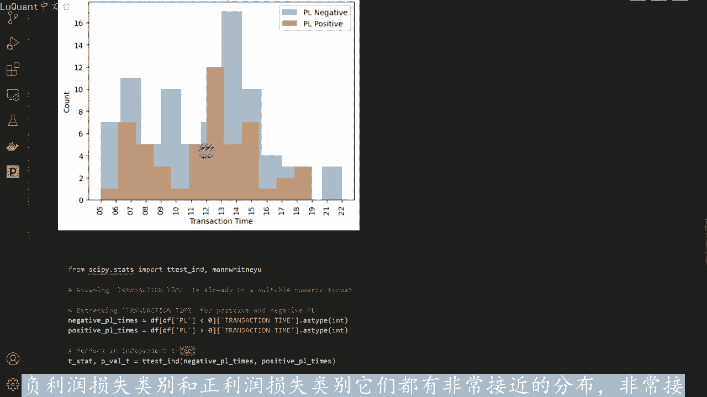

每个交易时间累计的正和负利润损失交易。因此，对于每个交易时间，从早上5点一直到22点及下午1000点。我们可以看到我们有一些正交易，然后有负交易，这两者的总和将为您提供。结果即每个交易时间的红线。

所以这里我们只有这两个交易处于负负负状态。总体而言，POS处于积极状态。因此，如果我们根据交易时间汇总数据。不同市场绘画的不同时间段内的性能是相同的。因此，机器人没有执行的首选时间。

尽管我们这里的交易很少是积极的，但这些不是有意义，因为我们再次没有足够的数据，我们应该在一个多月的时间内对此进行测。😡，以获得足够的交易，以便我们可以收敛到更确定的结果。但无论如何。

这向我们展示了上个月的表现，现在只是一个提醒我对此并不感到惊讶。因为在我们的回溯测试中，我们看到了一两个月。😡，下降期每次都在-10%到15%左右。所以我们确实预计，即使您在某个月进行手动交易。

也会出现下降期是负面的。但由于我们现在看到这些结果，我们可以有一些想法。我们可以将其应用于交易机器人，改善结果，并只是为了限制我们的沉睡期。我首先省略了一些影响我们实验的细节。

只允许在上午8点至晚上7点之间进行交易。使用arm使用这个机器人，这样就加上2GMT时间，所以如果。😊。

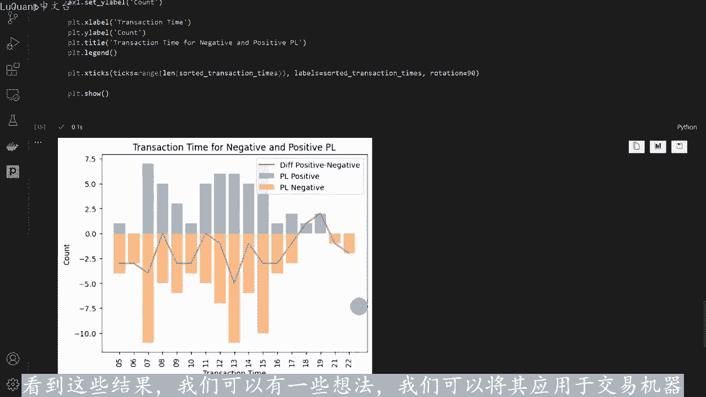

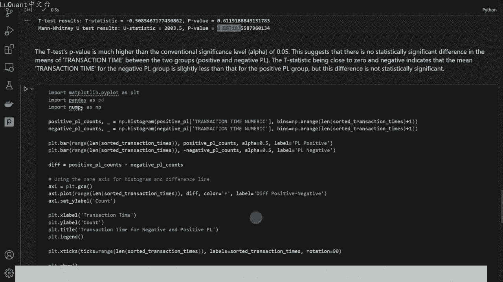

想按时间研究交易，我应该全天候收集交易，我们会更好的了解时间如何影响我们正在使用的策略。因为现在数据仅限于我们一直在交易的数据，并且也仅限。上午8点至下午7点之间。

加2GMP时间第二点是优化应用于两年前的数据，因此，止损系数和止盈等参数是针对就数据获得的，但最好将策略设。最新数据显然，我们需要更多的数据和更多的交易来减少结果的不确定性。

我们在解释代码时已经在pyython代码中提到过，最后这些点是匆忙过程的结果。所以我们可以关。这个视频我可以向您展示这个快速分析，正如您所看到的该过程需要时间和很高的精度。此时，我正在更新代码。

以便每周日在周一市场开盘时间之前执行自动优化。这将。允许我们使用根据最新数据优化的参数进行交易。我仍然相信我们使用的指标组合非常出色。这意味着bininger代与两条移动平均线相结合。

我们系统的弱点是我们的交易管理部分使用一种非常简单的方。只是为了让我们的测试在市场上运行，但我们可以改进这一点，主要是何时关闭亏损交易以及何时关闭盈利交易。这就是这个让我知道您在评论中的想法下面。

知道我们下一次视频交易安全。下次。

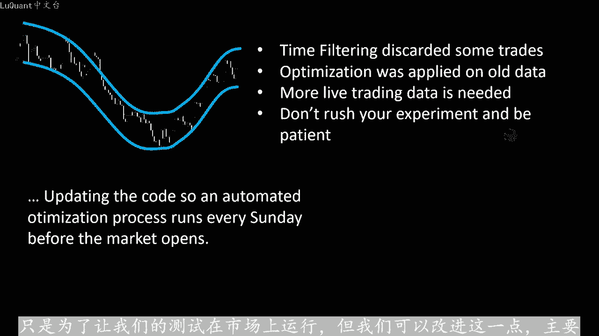

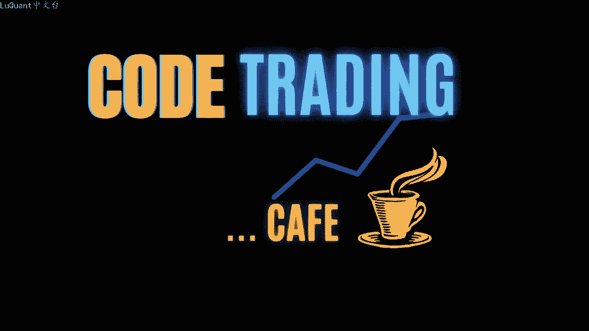