# python量化6：价格突破策略 - P1 - LuQuant - BV1Px421Q7EJ

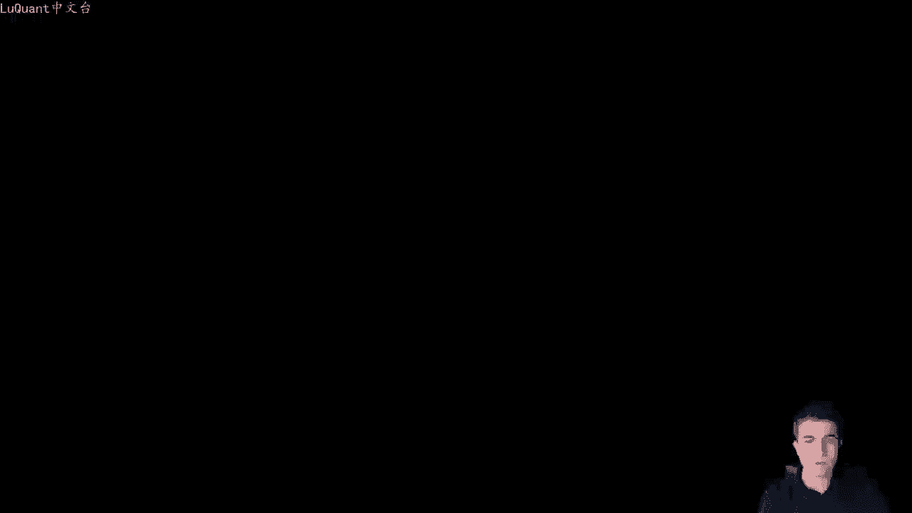

大家好，欢迎今天我们将回顾如何通过在python中自动化新指标来交易价格通道突破，算法将能够检测价格通道。当突破发生时，它将生成突破方向的交易信号。然后我们。

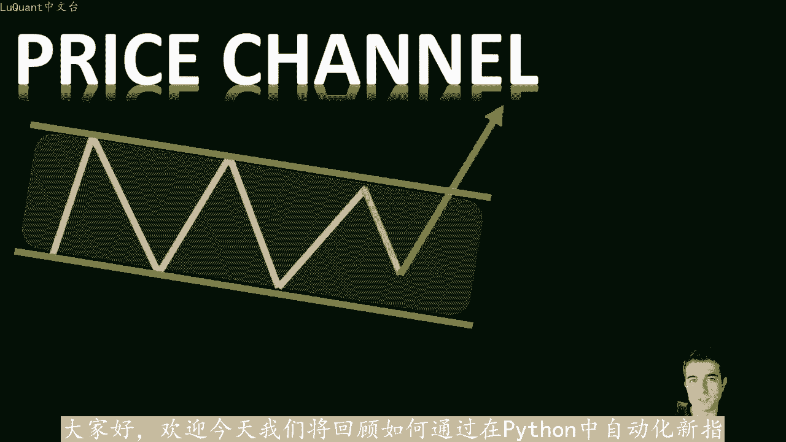

在策略中回测该指标，该策略还显示了智能交易管理变化，这将使我们的回测回报率从20%增加到近32%。因此，这里的目的不仅是向您展示算法交易方法，而且。提供您也可以将这些强大的想法引入到经典的手动交易中。

但首先我们将通过回溯测试，以数字方式证明这些想法，以确保他们确实有效，以便您可以看到，这是一个很好的方法。我会带您去通过策略本身的详细信。然后我们将在pyython中进行编码和回溯测试。

如果这是您第一次使用此频道，pyython源代码可以像往常一样从下面描述中的链接获取。因此您可以下载它您自己的实验指标构建如下首。我们需要寻找书轴点，这些是具有极端价格值的蜡烛。

其中价格高于或低于两侧的所有相邻蜡烛。这些是我们可以看到的紫色点在此图表上，它们带。我们的算法检测到的数轴，因此我们可以看到，这些确实是极值，并且该算法提供了良好的结果。第二步是将这些点拟合为线性斜率。

然后第三步是定义一组简。有效价格通道的条件。那么这些条件下的有效价格通道是什么？首先我们需要至少有5个竖轴点，这些竖轴点可以是两个高数轴和三个低数轴，也可以是相反的三个高数轴和两个低数。

总共也可以有5个以上的点，但5个是开始检测通道的最小值，因此6个也可以。然后当我们应用拟和斜率时，拟合值的RSQ优度应大于阈值。本例中为I，如果您不熟悉RSQ系数，则取0。9。

它本质上是我们尝试你和穿过这些点的斜率的点的接近度。因此，我们需要该系数尽可能接近一对。高数轴点和低输轴点拟合。第三个条件是高斜率和低斜率之间的差异，应小于阈值。例如本率中约为10%。

这意味着斜率几乎平行。请记。价格通道应具有这些斜率几乎通道，否则我们将陷入不同的模式，例如三角形上升三角形、下降三角形标志等等。这就是我们在数字上检测有效价格通道的方式。接下来我们需要检。突破。因此。

每当我们有通道时，我们都会等待开盘价和收盘价低于或高于通道的蜡烛。在本例中，我们看到的是看跌蜡烛，其开盘价和收盘价均低于通道的下斜率。因此我们可以确认这相反方向的突破信号。如果我们有一根蜡烛。

其开盘价和收盘价均高于通道的上限。然后我们在正方向上突破。这就是在两个方向上生成信号的方式。现在我们需要将所有这些放在一起。制定一个势力策略，我们可以回测一下，以这个看跌突破为例，因为这是一个看跌突破。

我们只会考虑开空头头寸。但当检测到信号时，我们不会立即这样做。而是会在当前收盘价上方一点的位置下一个卖。信号发生的价格，我的意思是在当前价格的几分之1内，它位于我们在本历中看到的这条绿线附近，请记住。

这只是一个订单。因此它不是一个未平仓头寸。这样如果价。回撤到订单水平，它将触发我们在市场上的头寸，这是我需要验证并向您展示的主要想法之一。在本视频中，我们这样做的原因是因为我们预计价格会在突然突破后回。

采取正常的趋势方向。因此，每当出现突破时，我们预计价格会在执行新趋势之前回到一定水平。并记住，我们正在努力在每笔交易中多挤压几个百分点，以利于我们的利益及。开盘。所以我们要与市场做斗争。

我们需要使用我们可以使用的所有工具。即使它只有几个百分点对我们有利，那么我们就可以定义止损。该止损也固定在与市场的几个百分点以内的距离。当前价格和止盈。通过止损距离乘以止盈止损比率获得的。所以总而言之。

我们有三个参数定义我们的交易管理系统的订单百分比百分比止损距离和止盈止损比率将。pythM编写所有这些内容，我们还将使用RSSI来包含一些变化。例如，我们将看到它如何影响我们的交易系统。

并且整个代码可以从下面描述中共享的链接下载，祝你好运。

joptter笔记本中介，这是我们的jupiter笔记本文件。我正在导入我们需要的任何内容。作为库，我们正在读取CSV数据文件。因此，欧元美元蜡烛在2003年至2023年之间的每日时间范围内。

所以这给触。大约20年的数据，然后我们使用一个函数来检测书轴点，所以这些是我们在视频开头的演示中看到的紫色点，这些是书轴高点和书轴低点。所以这个函数采用蜡烛锁。然后是一个窗口。

它是在测试它是书轴高位还是书轴低位之前要考虑的蜡烛左侧和右侧的邻居数量，并且该函数返回一个整数，其中一个表示书轴高位，两个表示书轴低。和三点，如果你同时拥有一根蜡烛，它具有极值。

因此它的所有邻居同时更高和更低，这是非常罕见的情况，但我们也需要将其分类为其他类别，然后我们可以定义另一。名为colect channel的函数，他接受蜡烛指数，他接受后面的蜡烛的数量。

他接受一个窗口和一个名为parallel的参数。所以这是百分比百分比阈值用于检查高点和低点数轴的斜率是否为并行正。您在此处看到的，当我们使用该函数时，我们使用的并行等于0。1%即10%。因此并行等于0。

1%，这意味着10%正如我们在本事例中提到的那样。因此该函数在。采用要测试的蜡烛的索引当前蜡烛，因此，将测试当前蜡烛是否前面有通道价格通道，以及我们要在当前蜡烛之前考虑的蜡烛数量只是一个切片窗口用。

检测是否存在通道的先前蜡烛受到此数量的限制，因此后面的蜡烛的数量通常我会采用40个，正如您在此处看到的那样。因此对于每个蜡烛，我都会考虑之前的40个蜡烛来测试我们是否有一个通道通道。

如果我们在它周围有任何突破性。😡，那么我们就有一个窗口，这是一个间隙窗口，我们要离开它，以避免前瞻偏差。所以无论我们在做什么，我们都不需要研究未来。由于我们使用的是书轴蜡烛，需要在左侧和右侧读取应。😡。

在蜡烛的未来中，我们无法在未来真正读取。所以我们将转移我们所有的东西，研究这里的一定量称为窗口。因此，这就是引入窗口的原因，以确保我们的计算仍然正确，仍然现实。并。😡。

窗口应该始终大于您在此处用于书轴的窗口窗口。所以如果我们使用了3个，如果我们使用4个作为书轴，那么这里应该至少为3个。例如我们应该使用5个或至少4个，这样只是为了避免展望位。因为这不再是正确的。

它在内部是不现实的。在此函数中，我们采用本地数据框。因此我们要应用研究的蜡烛切片，我们正在检查是否是书轴。因此我们要应用的是书轴，然后我们正在寻。😡，竖轴的高点，如果我们有3个。

那么我只取其中的最后3个。所以如果是两个，那么我们只取两个，但我们将切片限制为最后三个点。同样我们也存储了索引高点和低点也是如此，他们都在索引。😡，记住我们此时最多取三个低点和三个高点。

然后我们检查总长度。如果总长度高于我们总共有多少。5个。所以这是我们已经讨论过的条件，我们需要至少5个数轴点。收集通道，这是这里的条件。那么我们同时还需要至少两个低点和至少两个高点。

所以我们不希望例如有4个高点和一个低点。因为在这种情况下，此条件已得到验证，但我们无法构。😡，通道因此，这些是能够将N点拟合到通道中的条件。

然后我们将使用线性从统计数据回归提供低点指数和低点的unve值以及高点和它们。指数，所以这就是我们如何将数轴你合到两个斜率中，然后我们将在斜率上应用条件，以确保它们几乎在几个百分比内平行。

这是这里的参数值现在成为平行。如果我们提供平行等于0。我们将放弃这个条件，我们将采用任何类型的通道，它可以是三角形通道上升三角形、下降三角形等等。但是只要您为平行提供正值，我们就可以确定我们只选。

有点平行的斜率。比如说在这个提供的阈值内，这样您就可以看到这个函数将非常通用。您可以复制它，并将其粘贴到您的不同程序中。您不必仅在这个joptter笔记本中使用它，您可以按原样使用它。

确保也适应您的不同策略。好吧。所以现在我们已经定义了后面的蜡烛等于40，我们的windows等于4，我们将定义一个名为点位置的新函数。这仅用于可视化目的。因此，每当我们有一个书轴时，我们将。

蜡烛下方或上方添加一个点，具体取决于它是否是一个点书轴高点或书轴低点，这只是为了能够在这里可视化这些点。所以我在这里定义这个函数，我们在计算数轴之后，将其应用到数据框，无论我们在哪里有数轴，要放置一。

点，我们将提供一个蜡烛，例如感兴趣的中心蜡烛，例如在蜡烛周围切片，然后我们将在其周围绘制蜡烛棒。我们将使用广告添加，将点位置分散在我们有书轴的任何地。我们也在此时计算信号，只是为了确保，如果我们有信号。

我们正在计算或我们正在这里打印它。所以目前对于这根蜡烛，我们不有一个信号，这就是我们所拥有的。所以此时我们可以在我们感兴趣的蜡烛周围绘制任何蜡烛图或切。😡。

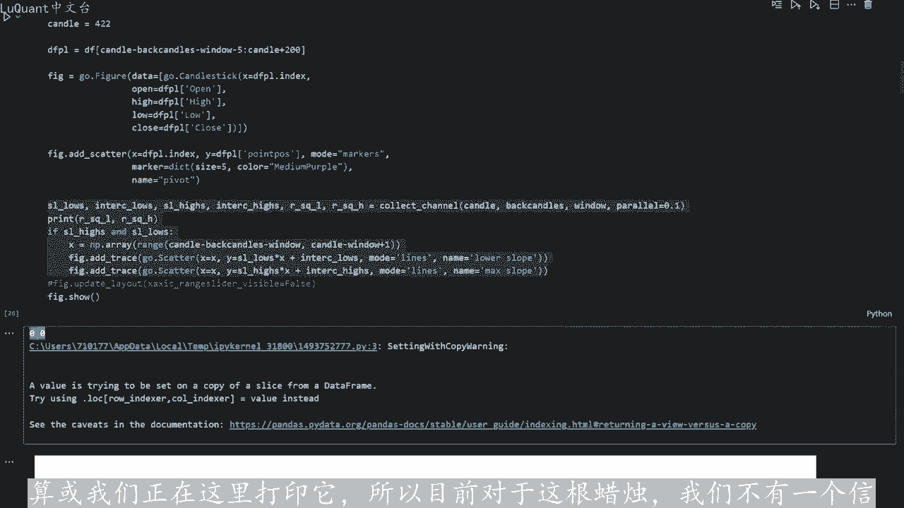

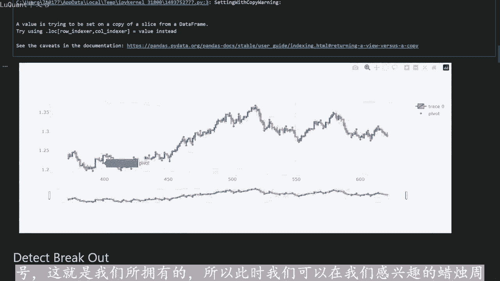

这是蜡烛图422，我们可以直接到这里。所以44202就在我们附近的某个地方，这里没有任何信号，所以没有考虑突破，只是我们正在切片，我们正在绘制数。点，我们也在绘制未来。

以了解万一我们有信号之后会发生什么。所以现在我们到达我们算法的重要部分，所以我们将在突破发生时检测突破。所以首先我们定义这个函数是突破，它需要一个蜡烛索引。所以如。😡。

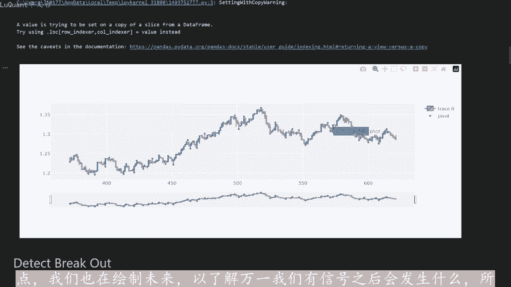

蜡烛是突破，它将返回信号一个整数，通知我们突破的方向。因此，如果是看跌突破则返回一。如果是看涨突破则返回2，然后我们考虑后面的蜡烛和窗口参数。我们之前解释的那样以及平行线，所以这这只是一种边缘情况。

那么我们在这里定义这些参数，因此我们将收集通道，并且我们之前定义的收集通道函数不仅返回一。信号还将返回很多参数，将返回低点的斜率，高点的斜率和许多不同的参数。这些参数保存在这些变量中。

因此我们有低点的斜率、低点的惰性节。

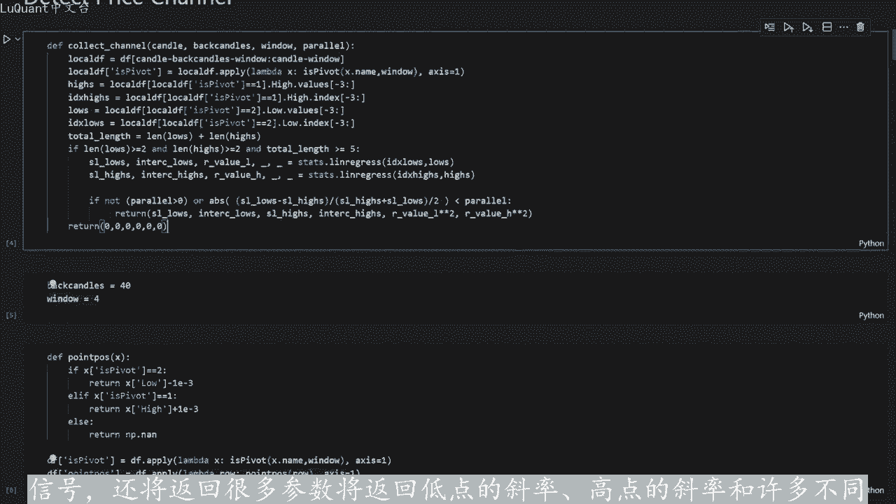

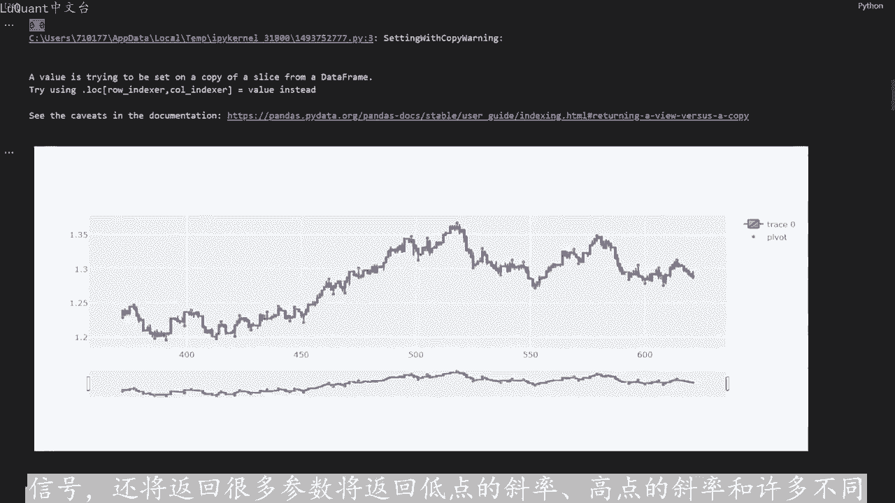

高点的斜率、高点和低点的R方拟合以及高点的二方。因此我们将在函数中需要所有这些参数，然后我们将在此处定义变量级。因此之前的。索引是前一个蜡烛的索引，请记住，我们将此函数应用于特定的蜡烛。

因此前一个索引是蜡烛减去一前一个高点，是前一个蜡烛的高点，前一个低点，也是前一个蜡烛的低点前一个收盘。等等。然后我们有当前指数，当前高点、当前低点、当前收盘价和当前开盘价。

我们将使用这些来定义突破的不同变化。因为您可能想对这些进行实验立。当前设置如下，当前开盘价或当前蜡烛的开盘价低于通道的下斜率，同时收盘价也低于通道。因此，整个蜡烛的开盘价和收盘价均低于通。的最低线。

同时，而最高点和最低点的SQ均为0。9。然后我们返回一个，因此考虑这一点很重要，因此这是一根开盘价和收盘价低于当前2。通道的蜡烛，但您可能想要进行不同的实验。您可能想说，如果他在通道内打开。

那么你可能想放弃这个条件，你只是希望它在通道下方关闭，好吧，所。😡，在这种情况下，你会更加灵活，选择性更少。所以我们只保留一个条件，您可能还想添加最高价和最低价。您可能还想考虑之前的蜡烛条件。因此。

这取决于您希望如何检测突破。在这种情况下，我采用一个简单的情况。如。😡，当前蜡烛开盘，并且收盘价低于或高于通道，那么我们就有一个信号，但同时我们需要一个良好的拟合，所以斜率拟合在0。9%以内。

所以这很好。当。引入了高斜率和低斜率的并行设置，这是在收集通道中引入的一个条件。所以它就在这里。所以无论如何，如果我们没有并行通道，我们不会有任何返回值，基本上就是这样。如果我们有一个信号。

我们返回一个货量。取决于信号的方向，否则我们返回我们返回零，所以这是突破函数。现在我们可以将它应用到我们的数据框，所以我再次定义窗口等于5，现在后蜡烛等于40，这是两个，您可能想。😡。

使用和实验的参数可能会改变并影响我们的最终结果。为了这个视频，作为一个例子，我在我们的数据框中定义了一个新列，称为突破。在所有数据帧上应用S突破函数和必要的参数。

这就是我们现在有一个名为office突破的新列的方式，它将保存信号。如您在此处看到的那样，如果他是看爹或看长信号或者两个在这里我打印所有蜡烛，其中我有一。不同于零的信号，我们稍后将使用它。

这样我们也可以可视化这些信号。所以我正在寻找利。1840这样的蜡烛让我们检查一下，所以这次销售只是要绘制蜡烛图，绘制书轴点，然后绘制信号或突破点，让我们看看这个。所以我们有这个信号，他们在这里连续。

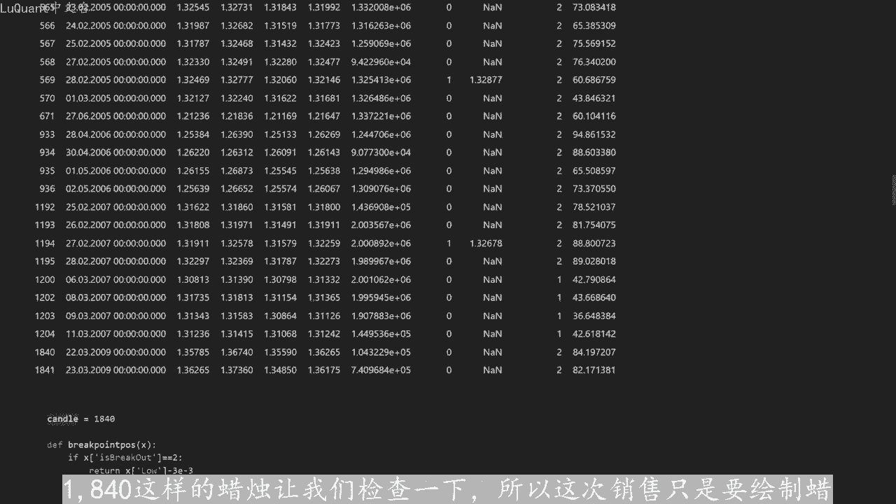

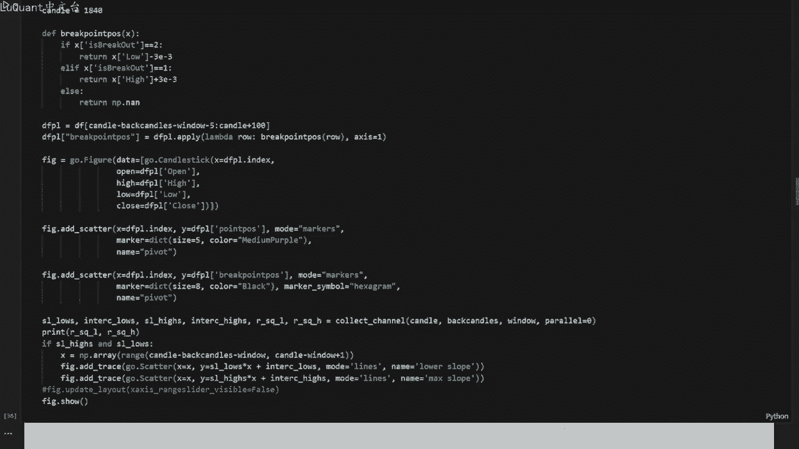

信号，但它基本上是相同的信号，我们只需要最早的一个，因为我们需要尽早知道发生了什么，所以我们不会等待更多的信号。正如你所看到的，我们有一个通道正在运行下跌并突破。然后信号在这里被触发，我们将。

当前收盘价的几个百分比内下一个稍低的订单。如果您采取我不知道的方式，这将是在附近的某个地方，3%或2%，它应该在这附近的某个地方。所以这很好，所以我们在这里开盘，然后我们等待价格回升。

我们也可以尝试另一根蜡。😊。

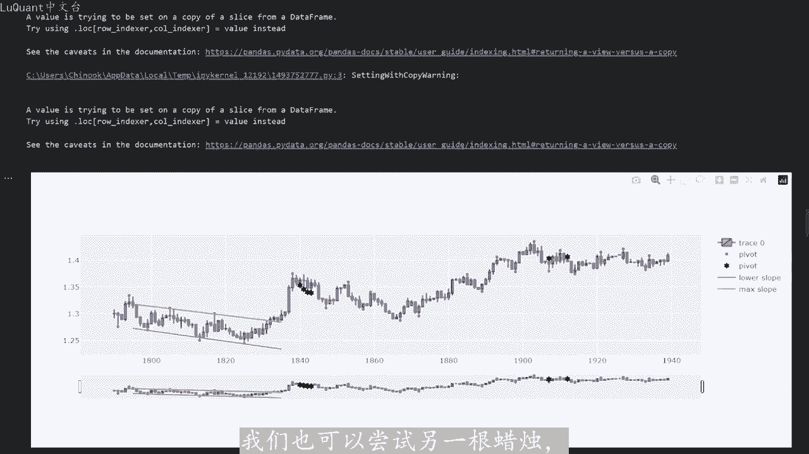

例如，让我们看第一根109，所以我要在这里改变这一点。所以我们就这个，然后我们也有向下通道，正如你所看到的，然后我们在这里有一个突破。

是一个很好的信号，所以我们刚刚突破了。如果我们把少几个百分点，我们将抓住一个非常好的上升趋势。正如你在这里看到的那样，只要我们知道何时退出这个趋势，因为那样它就不是无限的。但从这个角度来看。

它对我来说看起来很好。😡，记住，这是每天的时间框架，所以即使你离开一个月，这也会是胜利的一个月。所以这是一个很好的信号，让我们实际上检查另一个信号。所以这些109110111121314到16。😡。

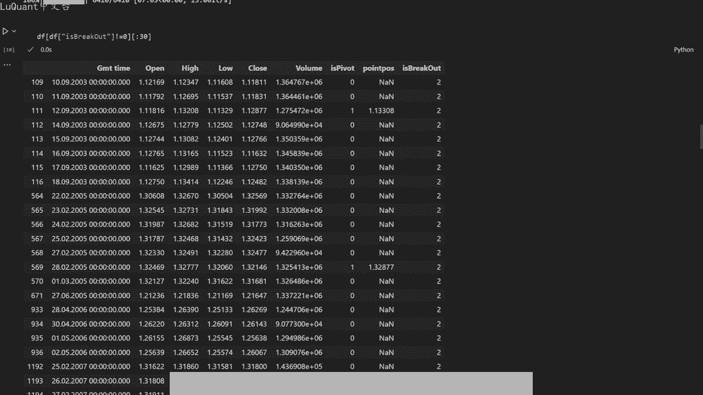

与你相同的信号可以在这里看到这些是连续的星星，所以这些是在这里发生的连续信号。所以这是一个信号，让我们检查另一组信号，例如564，所以560。😊。

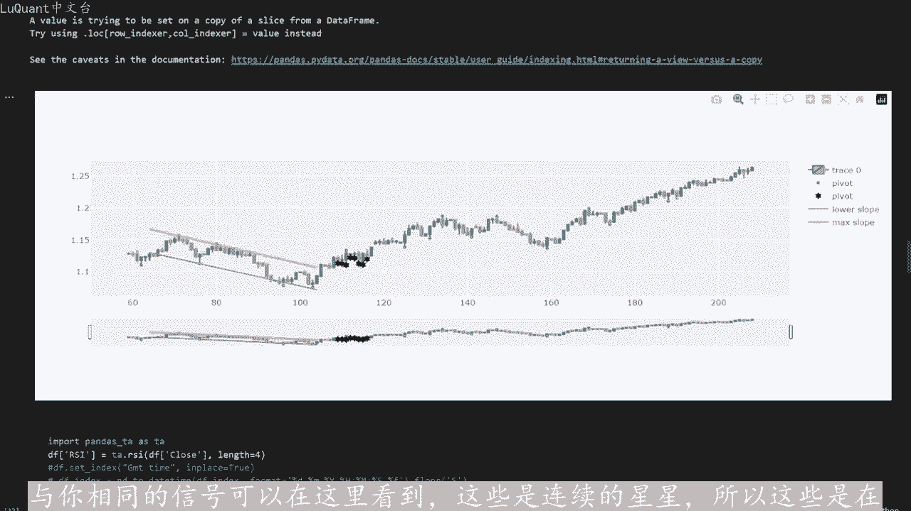

这里相同，我们有一个下行通道，然后我们有一个信号向积极方向突破，我们没有一个很长的上升趋势。所以我们可以看到它非常有限。但如果你有一个良好的交易管理系统。在这种情况下，不应该遭受很大的损失，但无论如何。

所以算法运行良好。我们不知道从长远来看，该策略本身是否足够，但我们可以对此进行回溯测试。因此，为了回溯测试，我正在使回溯测试库的策略，我们提供了大小在所有交易头寸中，我采用的止盈止损比率为1。

500分号0。03。正如您在此处看到的那样，这是止损百分比，所以我没有使。

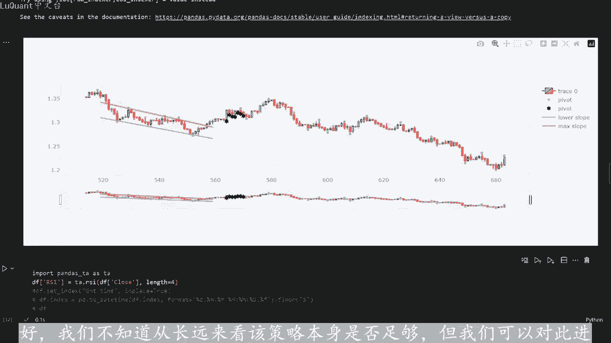

我们直接进入市场的订单。当信号发生时，我们使用5分之1的保证金，因此杠杆为1到5，缓存为1万美元，作为开始运行这部分。所以首先让我们计算RSSI，因为我们稍后将使用。所以RSI长度4G组。

这是每日时间范围。嗯定义了信号函数，该函数只是从数据帧返回突破组，然后我们可以开始回溯测试，我们的回报率为10%。

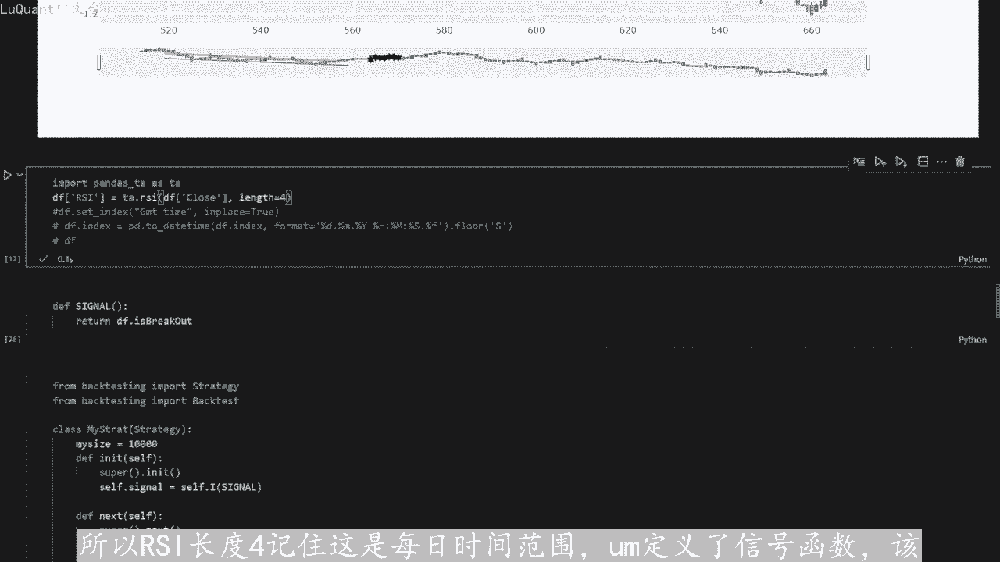

获胜率为46%。请记住，我们的止盈止损比率为1。5%，因此1。5应该可以满足46%的胜率，并且我们的下降幅度为15%，这已经很多了，我不建。低于10%的值，平均下降幅度为负1。39%，所以没关系。

这是一个很好的结果，但最大值有点吓人。所以这是我们的沉睡期的最坏情况。我们可以绘制这个。实际上我们会尝试绘制这个。如。

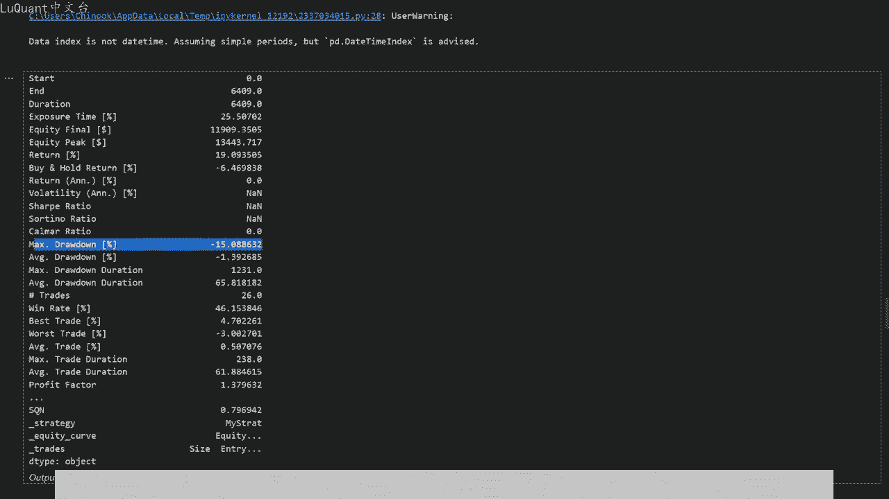

我们有一个不断增加的净值，我们有沉睡期，正如你所看到的，但我们的权益不断增加，我们最终获得了19%的回报。一些交易在正确的时间发生，其中一些交易被停。

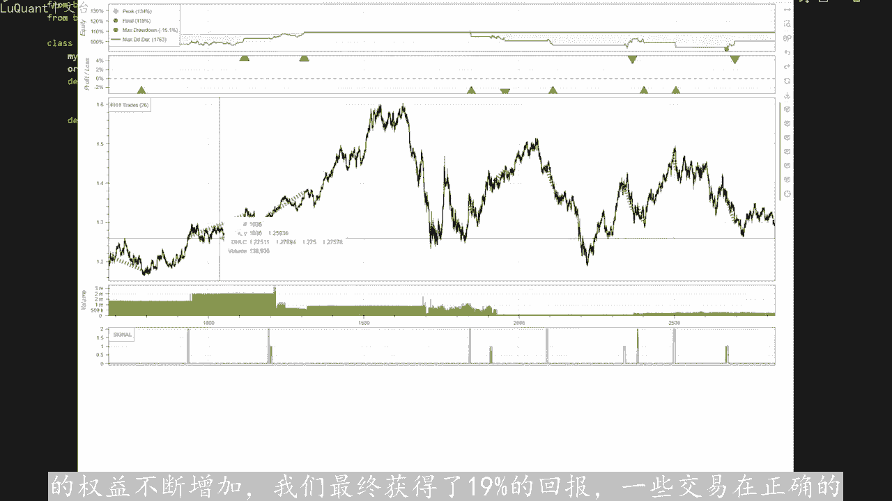

所以现在我们将引入另一个百分比，这是订单百分比。我们将把这两个变量分开，这样我们就有了止损百分比和订单百分比订单的百分比是0。01%，所以我采取1%而不。直接开仓仓位。

我将在低于或高于当前信号1%的位置下订单，然后止损百分比，将止损距离设置为3%，我将添加另一。退出交易的方式，即如果我们持有多头头寸且RSI升至95以上，那么我们将立即平仓。因为我们拥有超额资产。

相反方向也是如此。如果我们持有未平仓投。空头头寸且RSI降至无以下。那么我们也将平仓，即使我们尚未达到止损或止盈值也会平仓。因此我们将使用RSI作为退。策略或退出交易的另一种方式。

这次我使用的止盈止损比率为1。8百分比0。01。对于订单我可以这样做，因为我们使用的是百分比，请记住，我们没有直接进入市。我们正在从市场等待回调中挤压更多一点对我们有利的优势。

这这就是为什么我可以在此时立即增加止盈止损比率。因为我想从两个方向对我们有利。我们开始交易的点开始，这就是我们使用订单的原因，也是从我们现在开始交易的点开始的原因。结束交易。

这就是指盈止损比率出现的地方。所以两个方向上进场点和出场点都变得更宽。如果你明。😊，我的意思的话，然后止损百分比是0。03，所以现在我们可以返回测试这个我将运行这个回溯测试。

我们将看到这里的回报率为32%。因此，我们使用相同的指标改进了我们的结。只需修改我们的交易方式，即可正在进入和退出交易。这是为了向您展示交易管理部分在交易中的重要性。如果我们从20%攀升至30%。

这是我们回报的3分之1。所以之前我。对同一指标有大约20百分号，十九百分号。现在我们有32%，即我们回报的13%，这只是通过改变交易管理方法。所以我认为我们也应。强调这一部分。

因为我们正在集中精力预测价格方向和良好的交易指标，现在我们可以用来绘制我们拥有的任何东西。我们可以看到我们。

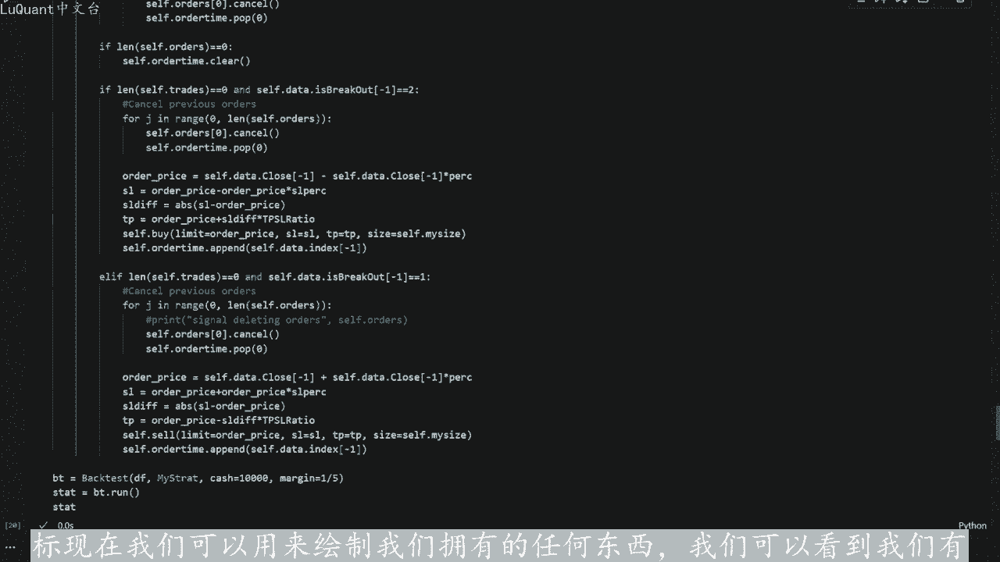

我们有一个不断增加的净值，所以我们有一些下降区域，正如你在这里看到的，但总的来说，这是一个不断增加的方向。所以这是在欧元上，美元正在波动，所以它不是一个流行的市场，它在各个方向上波。

所以它不偏向于买入或卖出，它在交易中使用两个方向，这就是这个视频的内容。我希望你们喜欢它。我希望您发现这些信息有帮助，直到我们下一次安全交易。下次。

