# python量化7：价格突破和动态管理 - P1 - LuQuant - BV1wm411d7gM

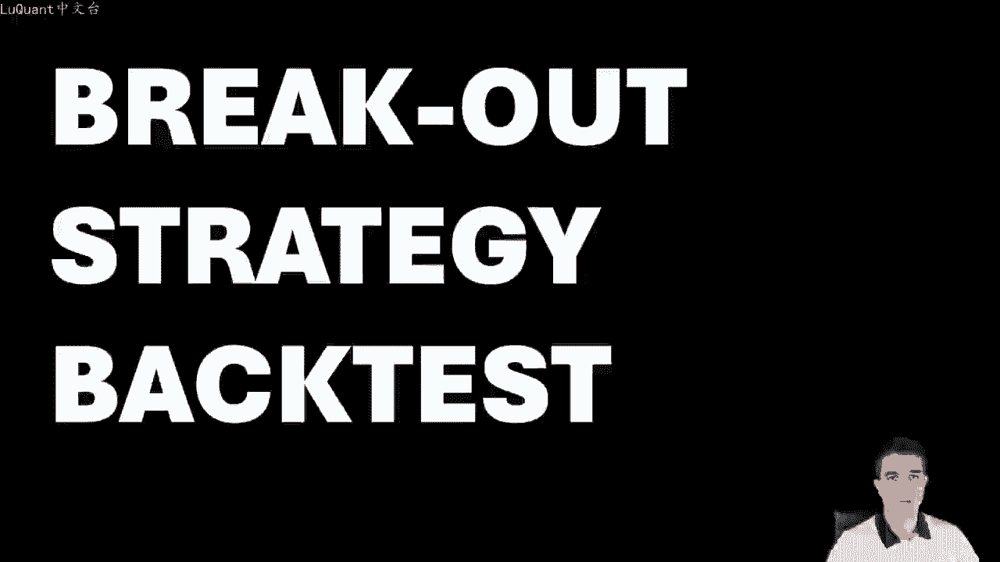

大家好，欢迎今天我们将使用pyython回测价格突破策略。然后我们将应用不同的交易管理方法，并将利润从10%增加到几乎100%。然后再继续。如果您对编码部分感兴趣，可以下。

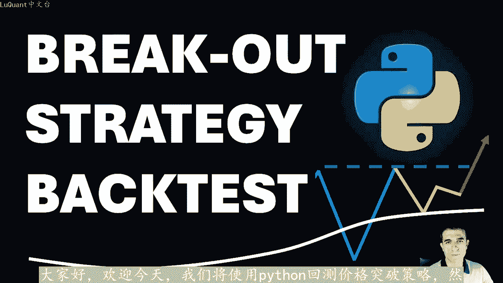

python我们将在本视频中使用下面描述中的链接中的笔记本。今天的结果可以应用于手动交易和算法交易。因此，如果您不喜欢算法交易，您仍然可以使用我们的回测信息进行。手动交易快速回顾一下。

我们在上一个视频中介绍的指标，我们将寻找支撑或阻力关键水平。其中，价格在突破关键水平之前会反弹3次，并且蜡烛收盘价高于或低。关键区域具体取决于价格方向并检测趋势方向。今天我们将使用移动平均线。

我们将检查一组蜡烛是否高于或低于曲线，以确定我们是否有上升趋势与下降趋势已完。我们的回溯测试需要交易管理规则，这基本上意味着止损和止盈条件。假设我在这个上升趋势突破蜡烛之后持有多头头寸。

我可以使用止损距离的固定值和比率固。比率来确定止盈距离。因此，这些值在整个回溯测试期间将保持不变。显然这不是最好的方法，因为市场可能会发生变化，并且这些值可能不再是最佳值。

我们可以使用RSI做出更动态的东西。市场变化例如，每当我们持有多头头寸时，我们都会在RSI跨越阈值时将其平仓。例如这里我使用80，而对于空头头寸，我们可以在RSI降至20以下时退。例如。

当然这些值只是作为示例事例，您可以更改这些，并实验他们如何影响我们的交易。第三种方法也将在本视频中进行测试。即使用。当前价格值的百分比形式获得的止损值，并使用两个止盈值更接近的止盈水平。

将关闭我们一半的仓位。同时，当我们关闭一半的仓位时，我们会将止损移至入场水平或盈亏平。以防价格回落，这样我们就可以确保一半的仓位利润，我们避免损失。如果价格继续对我们有利的方向上涨。

它将触及第二个止盈水平及最高的止盈水平。我们以全额利润关闭另一半仓。这种方法限制了我们的DRW dance，因为它限制了我们的仓位损失，基本上就是这样了，让我们浏览一下代码并检查结果。

这里的目的是证明交易管理的力量，同时回溯测。我们在上一个视频中介绍的突破指标，以便您可以选择其中任何一个结果，并在您的手动交易或算法交易中使用它们。如果您再次需要源代码，说明中会有一个链接。

正如我已经提到的这是我们的jupyter笔记本文件。我正在将这一行中的数据加。

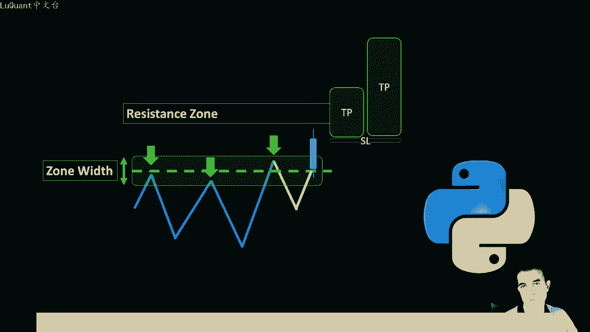

到将数据框转换为pandas数据框。我使用欧元美元数据，2003年至2023年之间的每日时间范围。然后我重命名列，以便我的函数能够正常工作，它只是将大写的第一。字母替换为小写第一个字母。

因此您可能需要根据您拥有的数据类型，您正在加载的数据以及列的标题来更改这些内容，然后过滤掉我们没有任何移动的所有型，以便体积等。0这些不是这些通常被丢弃，所以我只是保留蜡烛或数据框交易量列不同于零的行。

所以这些是我们有市场波动的行，我们避免假期和周末。所以所以。只是清理数据的一部分，然后我重置索引。因为显然我们已经提高或删除了一些行，因此我们需要重置索引，只是为了有一个连续增加的整数。

所以我正在计算指数移动使用此处导入的panda。技术分析包计算平均值，因此这是使用我们提供收盘价的M函数来完成的，长度等于50。因此，我使用长度50作为该指数移动平均线，这基本上用于定义。如果我们。

该曲线上方有一系列蜡烛，则趋势将是上升趋势。如果在曲线下方有一系列蜡烛，那么我们认为我们有下降趋势，并且在移动平均曲线上方或下方进行测试，我们将其称为趋势检测单元格应。我取回等于十0的蜡烛。换句话说。

对于每个当前蜡烛，我检查前十根蜡烛和连续蜡烛，如果这十根蜡烛都高于指数移动平均线，则我们有一。等于二的信号，如果它们都低于移动平均区线，则为上升趋势，我们有一个下降趋势，因此信号等于一。

在任何其他情况下，我们要么为0，要么为三一个信号。然后当我们说。来自MI的趋势信号时，我将创建一个名为MI信号的新列，我将其添加到数据框中，它等于此列表中填充的任何内容，并且填充在该列表中在这里循环。

是因为我。基本上循环所有行或所有蜡烛来测试我们是否有上升趋势信号或下降趋势信号或根本没有信号。所以此时我可以添加一个单元格，然后向您展示什么是数据框，看起来像这样我们。开盘价、收盘价和交易量列。

我们有刚刚计算的emma，我们还有我们也在单元格中计算的emma型号。因此，如果需要我们也有GMT时间列到目前为止，我们还没。使用它，但如果您需要它进行测试，您也可以将其设置为索引。然后根据需要使用它。

然后我们有一个函数可以测试蜡烛是否是书轴或分型，是其邻居中的高点或低。这基本上只是将蜡烛的极值与左侧和右侧的邻居进行比较，只是为了看看这些蜡烛是否是书轴、蜡烛或分型。所以我们要么有一个分型低点或分。

高点书轴低点和书轴高点，或者如果我们没有任何信号。如果它是普通蜡烛，我们可以返回零。如果两者都是，则返回3。因为有时您会遇到那些比所有蜡烛都更高和更低的极端蜡。同时，这个函数即Pvot在这里应用。

所以我们在数据帧上应用该函数，然后我们将结果保存在数据帧中的一个新列中，称为我们正在使用的Pvot窗口等于6。换句话说，我们正。考虑为每根蜡烛在其左侧或蜡烛之前放置6根蜡烛，在蜡烛的右侧未来。

在其右侧放置6根蜡烛，只是为了检查当前蜡烛是否大于或小于蜡烛图，左边有6个邻居，右边有6个邻。此时我们可以绘制这些书轴，所以我将运行这个单元格函数，我将运行以下单元格。所以这个可能需要一段时间。

因为我们重新应用于连续的蜡烛或连续的型，因此您可能需要稍等一下来计算所有内容。但。一旦完成，我们可以绘制这些书轴点或书轴蜡烛，我们可以用一些点直观的标记它们。所以我将使用这个函数。

我们使用的另一个函数是情节全局对象和烛台开盘。

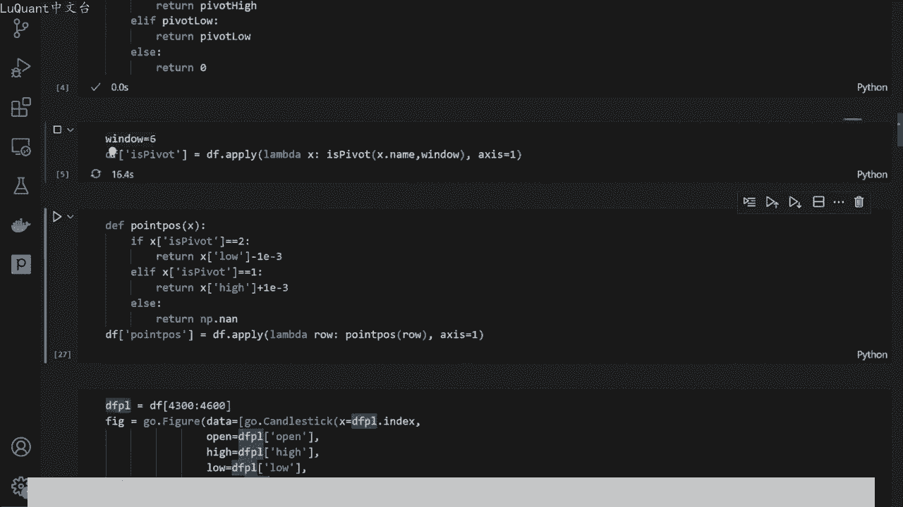

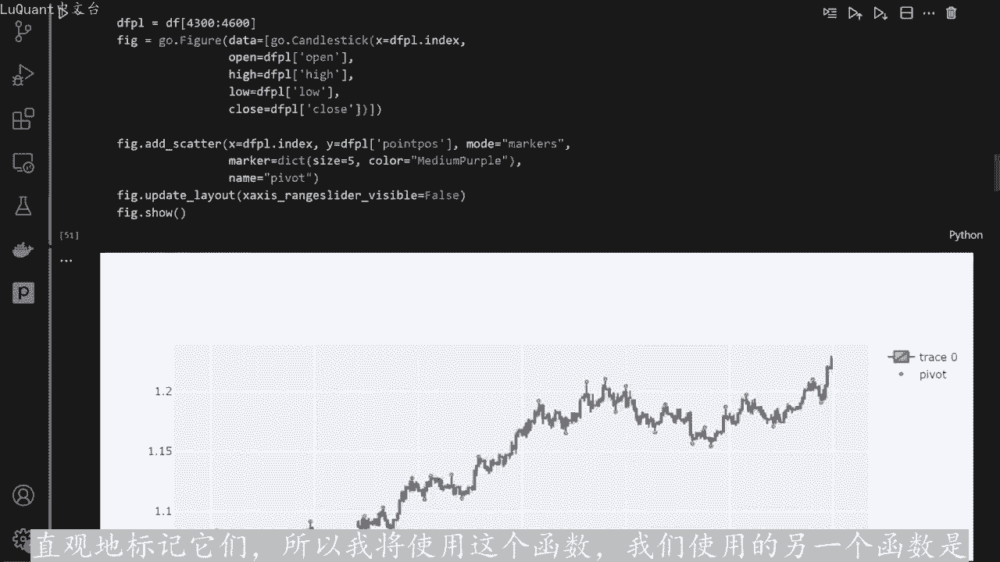

最低价和收盘价，然后我们再检测到这些数轴蜡烛的任何地方添加这些点，这是我们获得的结果。所以我们知道它正在发挥作用，我现在不会花太多时间因。😡。

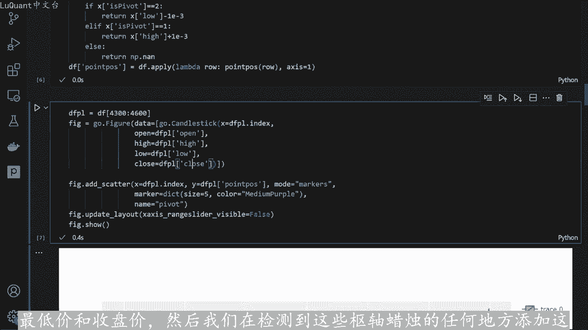

到目前为止，我们一直在之前的视频中重复这部分。所以无论如何，我们有分型，有书轴点，我们已经识别了这些神奇的蜡烛，我们已经标记了它们。我们可以直观的看到它现在运行良好，我将使用上一个视频中的检测结构函数。

😡。

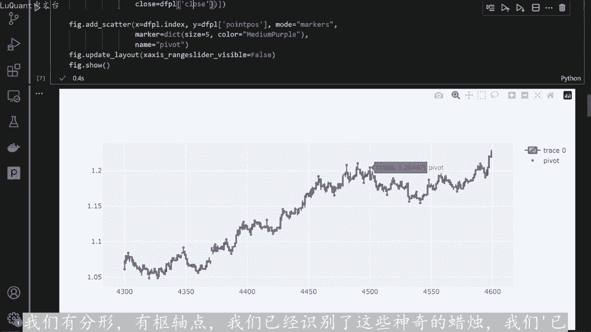

基本上是检测支撑或阻力区域，并检测我们是否有突破的函数关键水平。因此，它将检测同一水平上的三个弹跳。该水平可能是支撑位或阻力位，因此该水平将被标记为关键水平。

然后该函数还将测试我们是否在上方或下方突破较低的方向，取决于我们谈论的是阻力位还是支撑位，并且它将返回一。数字，因此，如果我们有支撑位突破，我们将返回一个数字。因为它在下降趋势方向上向下突破。

所以我们返回一在相反的方向上，如果我们突破阻力位，我们将返回2。所以这。我们再次返回这里的水平突破变量。我们将此函数应用于整个数据框，所以我将运行CR函数单元格。

然后运行以下单元格来计算所有信号或检测这种突破模式。数据帧列中的所有结果存储在名为检测到的模式的新列中，然后我们将进行打印任何我们有几行或几行的地方。只要我们有不同于零的信号，正如我们在这里看到的那样。

我们也有上升区。😡，突破和下降趋势突破这两个类别。所以我不会详细介绍这个函数的所有细节。因为这些已在上一个视频中进行了解释。如果您需要返回到上一个视频，我们刚刚构建了指标，那么这将是个好主意。

因为在本视频中，我们。更多的关注回测部分。所以现在我们可以使用技术分析包再次计算RSRSI我只是使用此函数RSI传递收盘价，并收集RSI值，将它们保存。名为RSI的新列名下的数据框中。

然后我们将索引设置为GMT时间列，所以我使用，而不是使用pandas默认提供的整数索引。我有一个名为GMT时间的列，所以我使用它作为索引并。我正在更改格式，因为记住我们有长格式，所以我们先有日期。

然后是时间，然后是秒的小数部分。因此，当使用每日时间范围时，不需要这些详细信息，请注意小时分钟秒和秒的小数部。😊，始终为0，因此我们可以丢弃这些，这就是我们在这里所做的。所以我将运行单元格。

我们将检查当前数据帧的状态，以便我们有GMP时间索引，我们有开盘价、收盘价、成交量艾ma艾I信号是输。位置点，这是只是为了绘制和检测到的模式，这基本上是我们的信号和RSI。

我们稍后将在我们的交易管理中使用它。当我们应用回测时，现在我们可以回。策略，所以我使用回测。拍包我从策略类继承。所以首先我们定义我们将为每个位置采取的手术的大小。所以现在它将是1万。我正在定义构造函数。

我们可以看到这里，我们使用信号函数哎信号函数只是为了查询来自该函数的信号，所以这是信号函数，它只。返回每行检测到的模式列值，所以这基本上是我们的信号。如果我们有一个，这是一个卖出信号。如果我们有两个。

这是一个买入信号。如果我们有零，我们就没有信号，所以我们不会执行任何交。😡，除非我们检测到这种模式信号，即返回不为零的值，这就是信号函数的作用。我们将在此处将其用于我们的指标，然后我们将定义值。

止损比率此处它等于2，百分比也相等到0。03，这将定义我们的止损距离。它将比当前价格低或高3%，这就是我们的交易方式。如。我们有一个不同于零的信号，同时我们不这样做，当前市场上没有任何未平仓交易。因此。

当前未平仓交易的长度等于0，同时检测到的模式列等。当前蜡烛的2，然后我们将执行一个买入头寸，就在这里如此自我。买入时设置止损，止盈手数大小，止损等于收盘。当前蜡烛的当前收盘价减去收盘价乘以百分比。

这就是我们的做法，它是当前收盘价或当前蜡烛的百分比，所以它是3%，所以-3%。然。我们计算止损差，这是止损和收盘价之间的绝对值，所以它基本上是距离实际上从止损到当前蜡烛的当前收盘价，这将用于止盈。

因为我们需。止盈是止损的两倍，在这里完成。因此止盈是相等的当前蜡烛的收盘价，加上我们刚刚计算的止损距离乘以此处的止盈止损比。基本上就是这样，这就是我们执行买入头寸的方式。如果按模式。

那么对于卖出头寸也是如此检测到，等于我们当前在市场上没有任何未平仓交易，我们定义值。嗯止损距离，然后使用比率定义止盈，然后我们可以使用以下方法传递卖出头寸或空头头寸止损止盈和头寸大小。

然后我们定义回测器，我们提供数据。我们刚刚定义的策略类的名称，然后我们有一个1万美元的起实缓存，我正在使用利润率为5分之1，所以这是1到5的杠杆，只是为了稍微增加我们的利润。所以当我们运行这个回。

测试这个策略时，我们的利润约为20%。所以在整个数据框架中，每年的回报并不多，总是几乎接近1%，所以这没什么有趣的。我们的剩。57%，我们只有7笔交易，这就是为什么我们的回报如此之低。但看看胜率。

它是57%，止盈止损比率是相等的到2，这是一个很好的指标。因为如果您。😡，止盈止损比率等于2，则意味着如果您的胜率高于33%，那么您的策略就是赢家。在本利中我们有57%。所以它是总体而言。

这是一个很好的策略。总体而言，它是一个很好的指标，唯一的缺点是。没有得到我们想要的那么多信号，这可能是由于我们以某种方式调整了一些参数，也因为我们正在使用每日时间范围。因此，如果我们使用较慢的时间范围。

我们不会频繁的重复此模。最好将此指标调整为从4小时到1小时的较低时间范围，或者每小时时间范围，可能会在DRW down中产生更好的结果。我们的最大drawdown为负7%，平均dr。

downown为最小-1。6%，因此考虑到我们在这里使用全自动机器人，这是安全的。所以好吧，所以我们有了策略，我们如何改进它，这是第一部分，我们的止损和止。整个回溯测试期间是固定的。

所以现在我们要采取更动态的方法，我们可以包括我们可以包括的RSSI不同的事情。我将把这部分包含在我们刚刚在这里定义的单元格中，这样它就在下一。函数的开始之后，所以每当我们定义了这个百分比参数时。

我要把它粘贴到这里，我们可以取消注释它起作用，基本上是。如果多头头寸和空头头寸。RSI分别高于80和低于20，它将平仓。因此，正如我们所提到的，我们可以取消此处的止损。但我要为了保留它们。

我们将使用两种退出策略，以先到者为准。要么RS。高于或低于阈值。要么我们已经触及止损或止盈值，让我们尝试这样做，我们将运行这个策略。所以到目前为止，我们已经获得了20%的回报，我将再次进行回溯测试。

现在RS。已降至99。5%，所以这不是一个好主意，有时有效，有时无效。我们将检查我们是否可以更好的改进这一点。现在让我们使用两个止盈，因此我们将。😡，我们的交易分成两个部分，请注意。

我们在这里两次应用买入头寸，第一次使用止盈TP1，第二次使用止盈TP1与TP2。为什么？因为我们有两个止盈值，第一个基本上等于2。止损距离，第二个等于止损距离乘以止盈止损比率。所以我们有两个止盈值。

我们将再次使用百分比和可变百分比。就像我们之前所做的那样，我将替。尺寸以便能够与之前我们使用尺寸1万作为开始进行比较。所以我们在这里这里将使用完全相同的止盈止损比率。这次我们将把止。分成两部分。

将交易规模分成两部分。这里发生的情况是，因为我们应用了两次买入和两次卖出函数。我们要开两个头寸。为了公平的对待之前。回溯测试，我将把它分成两部分。因为现在如果我们开两个头寸，每个头寸为5000美元。

那么两个头寸一次都是1万美元。只有当我们在市场上有一笔交易时，这意味着一半的头。😡，已经平仓，我们已经达到了止盈之一，我们才会改变止损、并使器等于入场价格。就像我们一样，在本视频的开头，我们已经讨论过。

当我们介绍这些交易观。😡，方法时，当我们运行此回溯测试时，我们得到了大约14%的总回报率。到目前为止，我们的胜率为57%，这是最大的下降，平均下降率为7%和1。3%。这还不错，但到目前为止。

我们还没有太大改进，让我们尝试增加规模。那么如果我们用50%的股权进行交易。那么这里我们有44%，我们可以进一步增加。0。99，我们正在用10%的股权进行交易，回报率将达到99%左右。

所以我们只是增加金额或我们的头寸规模买入并持有回报将。-11。3%，我们的跌幅为负20%，这是最大的跌幅。所以这个数字增加了，因为基本上我们使用的是1到5的保证金。😊，而且我们还增加了手术大小。

所以风险会更大。这就。😡，为什么下普比率预计会很低？所以我们有0。36以及hirtino和0。57。所以在这种情况下，我们有13笔交易，因为我们将交易几乎乘以2我们。胜率是61%。

所以我们的胜率稍微好一些。我认为我们这里有577%，这里我们有61%，这基本上是因为我们使用更接近的止盈值有。价格比多头更快，更容易达到这些值或者进一步的止盈值。我们可以看一下净值。

我们注意到我们没有太多交易，所以它不是很频繁，但当它发生时，它或多或少运作良好。所以我们。

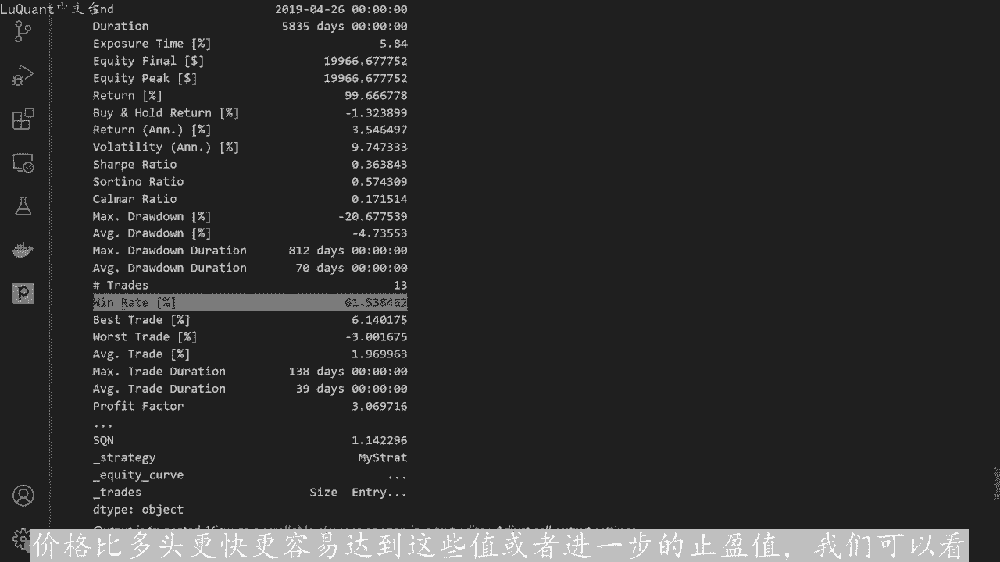

径值随着时间的推移而增加，所以唯一的挑战是如何使其更频繁。如果您想获取代码并更改一些参数，您也可以尝试包含这部分及RSI部分，以防您想使。

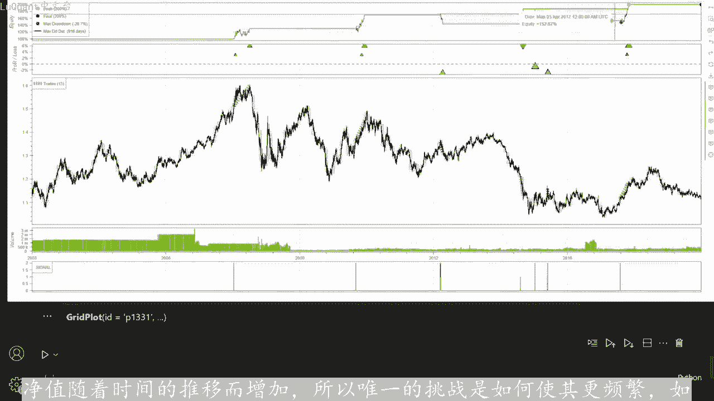

两者来结合使用两个交易管理，获利了结并使用RSI值。所以让我们检查一下，我们可以实际运行它，看看它是如何工作的。我们有但效果不佳。显然我们。42%的回报，而不是99%的集聚回报比率。0。

25steno是0。37，我们仍然有一个很高的单一利率，及61%最大下降。-27%，这是一个巨大的这正在成为一个非常危险的策略。所以我将在这种情况下保留RSI部分的评论，只是为了您的实验。

您可能想更改此处的百分比，您可能想更改啊。比率让我们尝试1。5等等。

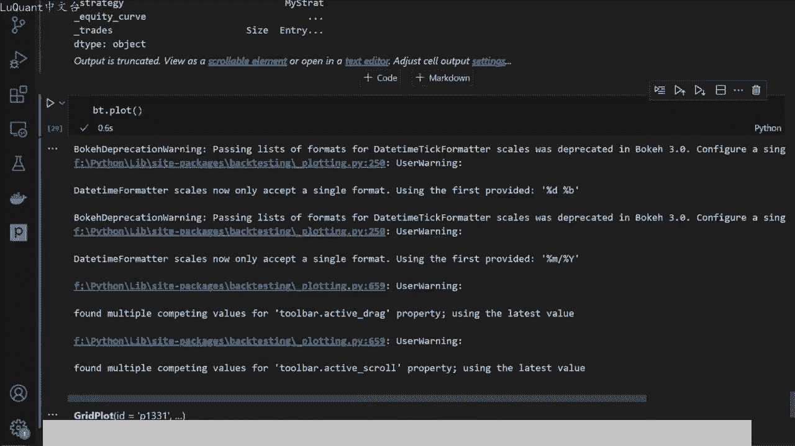

您实际上可以根据您的交易风格对其进行优化，这基本上就是突破的回溯测试，表明我们在上一个视频中介绍过，我希望你们喜欢。

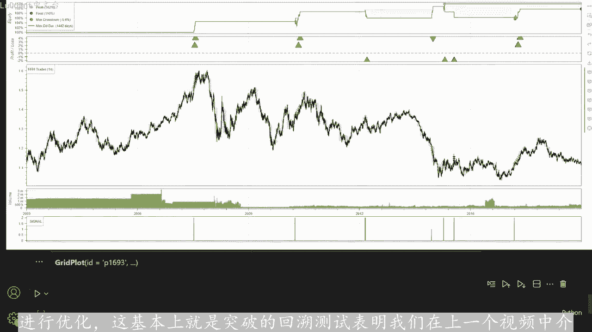

我希望你们看到这些结果不会感到非常失望，所以这不是一个快速致富的计划。但至少我们知道，当我们用这个进行交易时会发生什么一组参数。因此，如果我们采用3%的止损距离，如果我。😡，采用二的止盈止损比率。

并且如果我们使用欧元美元每日时间框架进行交易，那么使用三的突破策略弹跳点等等。我们在这个视频中采取的所有细节。所以这些。我们应该期待的结果，到目前为止，我们还没有添加任何佣金。如果你想制作一些东西。

这也是需要考虑的事情。你想在现实生活中的交易中实现，所以只需考虑你可能想要尝试的所有这些菜。😡，改变事物，优化整个代码中的这些参数，也许你会得到一个比我在这个视频中向你展示的更好的组合。

祝剩下的一切顺利。直到我们下一次视频交易安全，下次再。

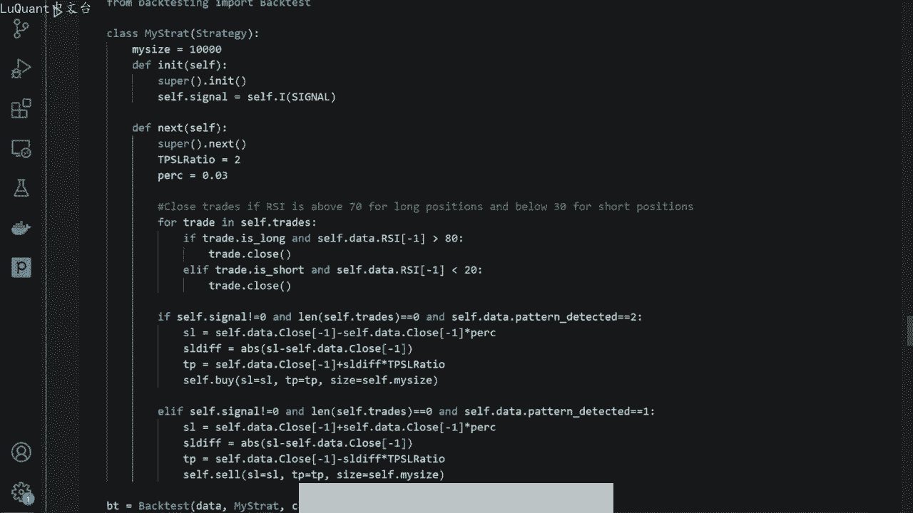

