# python量化9：阻力与支撑检测 - P1 - LuQuant - BV11C411b73c

大家好，欢迎今天来到这个频道。我将向您展示一种非常简单的方法，可以揭示交易中的关键水平。例如强支撑位和强阻力位。我们正在重新审视支撑位和阻力位，但我们没有检测到我们所检测的所有水平和任何。😊。

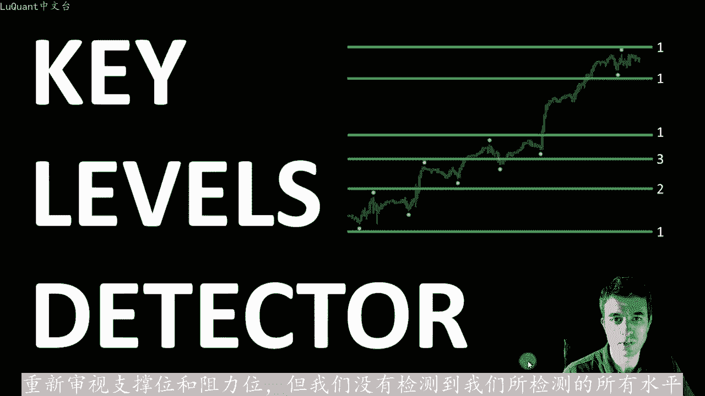

水平只对识别强支撑和强阻力感兴趣，其中价格更有可能反弹，而不是突破这些强水平。如果您对编码部分感兴趣，我们将根据历史数据进行此检。我将在下面的描述，以便您可以下载它用于您自己的练习和实验。

首先我们将加载我们的数据，我们将检测分型或书轴蜡烛。这些蜡烛高于或低于其邻居，因此我们可以拥有高书轴蜡烛入。😊。

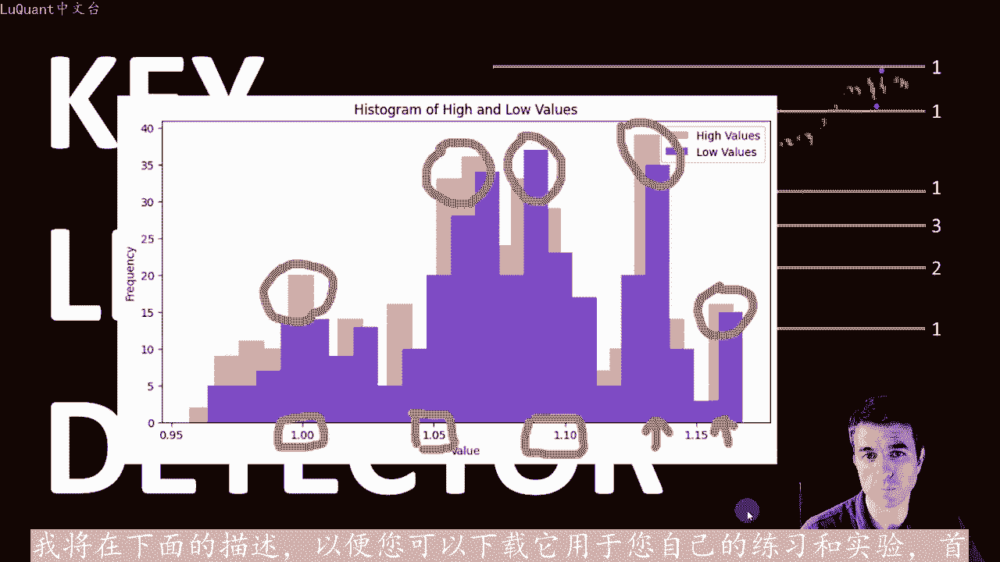

蜡烛高于其前面的蜡烛或邻居，并且也高于其后面的蜡烛，或者蜡烛以同样的方式位于右侧。如果我们有一个书轴低点，如果蜡烛低于左侧和左侧的所有邻居右边这些。用紫色点标记的蜡烛，正如我们在该图上看到的那样。

然后我们将绘制支撑位和阻力位，我们将计算价格在每个水平上反弹的次数。我们这样做是为了分配强度美。级别的分数，例如区域在这里被一个点触及，所以分数等于一，这个分数被一和两个14阻力为触及。

另一个作为支撑位。所以我们分配分。这里是第二个，然后是这部分的一2和3等等。记住这一点非常重要，我们没有采用精确的水平值。而是围绕它的支撑和阻力区域，我们将看到如何。

编码部分以便我们可以为每个级别分配一个强度分数。如果需要，我们还可以将阻力分数与知识分数分开，或者将它们合并，并将它们视为一个单独的级别，并为我们的每个级别都有一个混合分。

我们将在编码部分详细介绍如何做到这一点。我们将看到这种简单的方法，如何揭示过去数据的关键水平。如果您有水平，从某种意义上说，我们可能仍然会在未来的交易中考虑重要的水平过去，表现出强大的支撑。

阻力将来可能仍会表现出相同的反应。所以现在我们可以开始浏览pyython代码，并讨论我们的一些结果。这是我们的joptter笔记本文件，我正在加载CS。

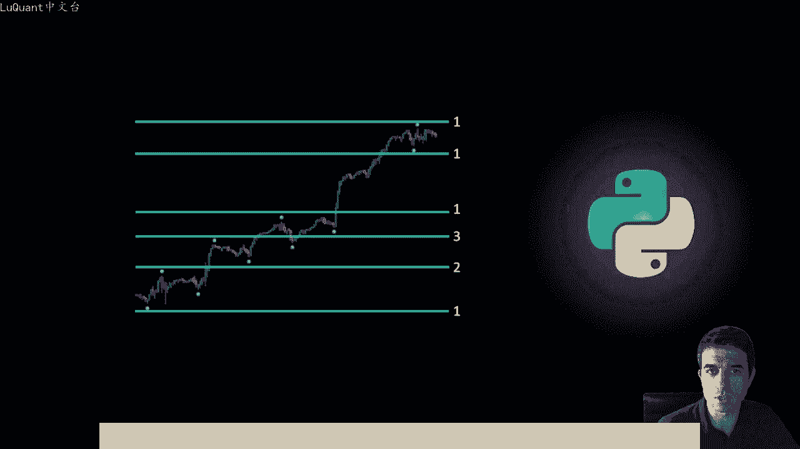

我拥有的文件数据文件是欧元美元烛台一小时时间范围。2020年到2023年，所以近三年的数据，所以这些是我正在过滤没有任何交易量的行德列的名。周末和休息日市场没有变动，然后我正在重置索引。

我正在检查是否还有一些缺失值使用。然后我正在打印数据框的头部或前十行，以便我们有时间列开盘价、收盘价和成交量列。然后我们定。书轴ID函数它需要数据框和蜡烛索引来测试它是书轴高点还是书轴低点。

然后是左侧要考虑的邻居数量，以及当前蜡烛右侧要考虑的邻居数量。我们测试该蜡烛是。高于左侧的N一根蜡烛和右侧的N两根蜡烛，如果是这种情况，那么它是一个书轴高点。因此如果是的话。

我们返回两个低于左边和右边的邻居。如果他同。具有高弧须、高尾巴和低尾巴。那么我们返回一个竖轴低的一个。所以如果他在两个方向上都超过左边和右边的所有邻居，我们返回3个，我们对这种情况不感兴趣。

但我们只需要返回蜡烛的正确标签。如果这。😡，条件都不成立。那么我们返回零，我们没有任何类型的当前蜡烛信号，正在将这个数据透视ID函数应用于所有数据框数据框的所有行。无论结果是什么。

我们都将这些结果存储在数据框中的数据透视列。该数据框是数据框中的新列。所以现在我们可以检查我们数据框的内容，我正在运行。这个我们有时间开盘高低收盘和交易量列，但我们还有刚刚计算的数轴列的附加列注意大多。

符号信号为0，这很好。因此。我们不希望所有蜡烛只返回那些满足这些条件的信号。所以现在我们可以可视化这些馈送蜡烛。为此，我们正在定义一些点，如果蜡烛信号。书轴信号，那么它是一个书轴低点。

我们是如果它是书轴高点，则在蜡烛下方放置一个点，我们将在蜡烛高点上方放置一个点，并将此函数应用于数据框的所有行框架所有蜡烛。我们将这些数据框。名为点位置的星列中的点位置，因此我们稍后可以在此处使用它。

以便能够在烛台图表的顶部绘制这些点，这就是我们所拥有的。所以这些是书轴高位。因为我们可以看到这些是书轴低点。我们。

蜡烛下方有点，我们可以看到我们编写的用于识别和标记这些书轴蜡烛的算法工作正常。因为我们可以在此图表上直观的验证这一点。所以我们首先从切片部分开始我们的数。

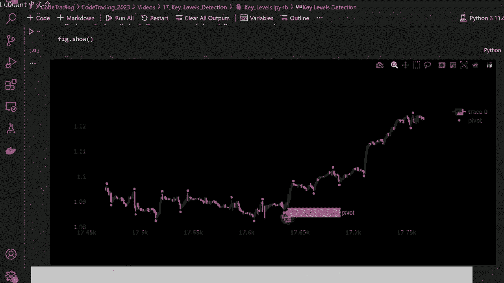

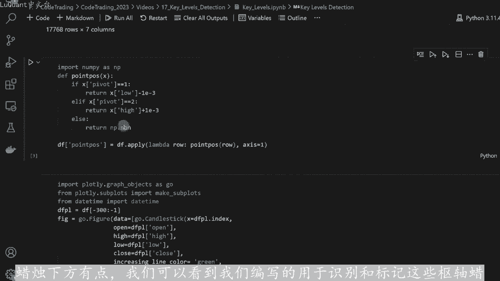

框获取蜡烛的最新数据，以及我们选择高值的型。因此，当我们的主元ID等于所以它是主元高时，我们将检查当前蜡烛的最高值是多少。如果我们有一个低书轴，那么书轴等于。我们将检查当前蜡烛的低值。

并将所有这些值存储在我们将用来绘制的高值和低值中。我们的直方图。然后我们有bin with直方图，总是有一个并宽度，所以每个并的宽度是多。

因为在X轴上，我们有欧元对美元的价格，所以它是价格资产的交换价格be with只不过是我们想要考虑的区域宽度想象一下。例如这里的这4。

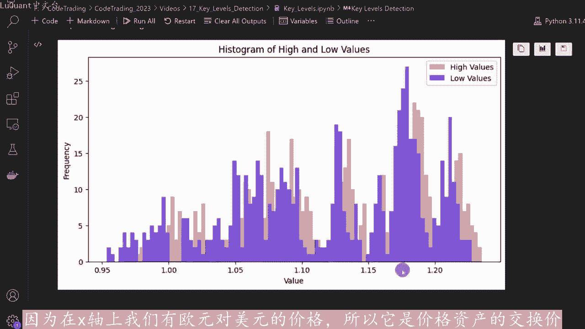

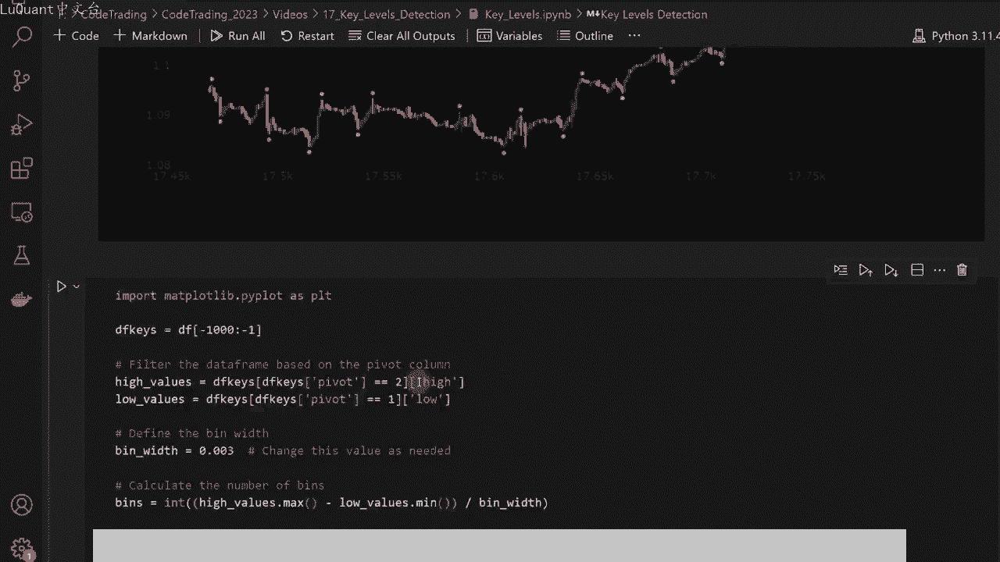

点我希望他们属于同一个区域支撑或阻力区域。例如，在这种情况下，我将检查1。09之间的差异，721-1。09439，这就是我。阻力区的宽度，因此由我作为用户来定义s been with并记住。

这也是我们当前支撑或阻力区的宽度去定义。所以现在我只为这个例子取了。

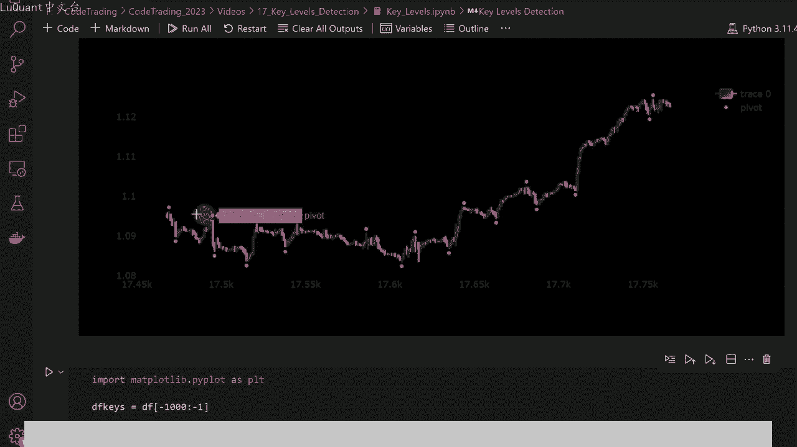

003，然后我计算并的数量，并考虑并的宽度。因为直方图函数需要这里的并的数量，所以我们可以绘制我们的直方图，我们有俩。直方图，一个用于高值，一个用于低值，它们都需要 alpha法透明度的箱数。因此0。

5以防万一我们这两个直方图重叠，我们仍然可以在视觉上看到这些直方图位于另外，我们有标。

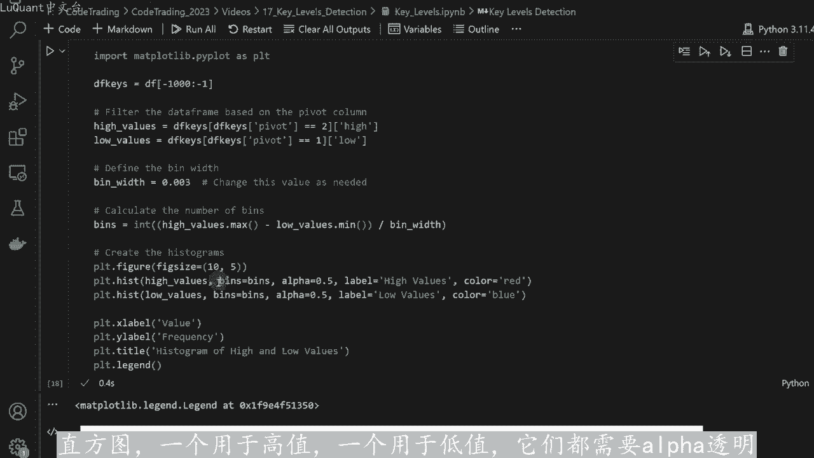

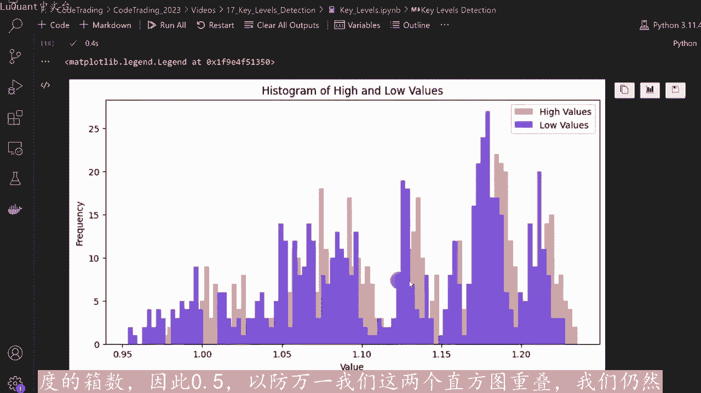

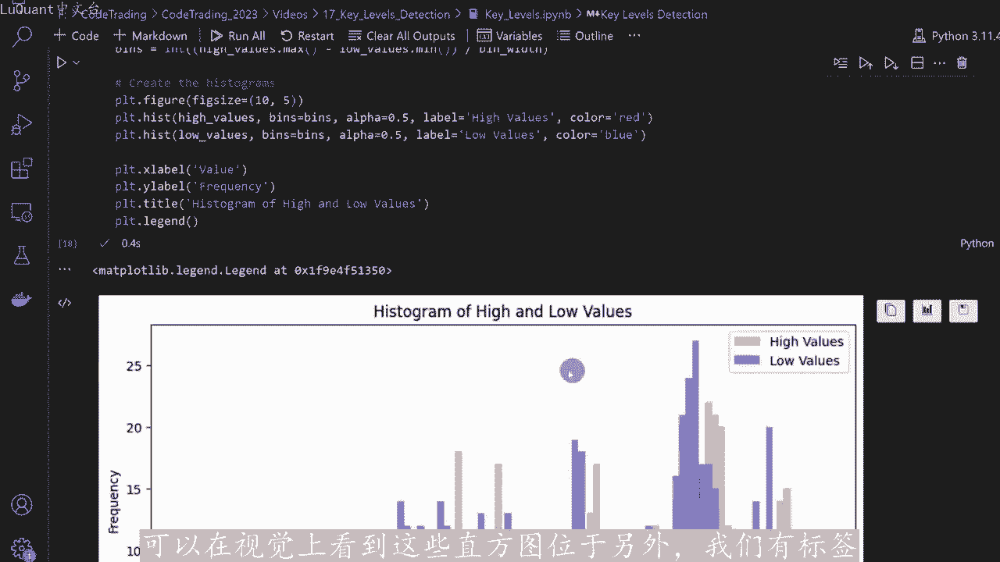

高值和低值，我将它们着色为红色和蓝色，这样我们就可以绘制这些直方图，让我看看。如果我们绘制这些，这就是我们刚刚用这片1000定义的视力小石或1000根蜡烛。

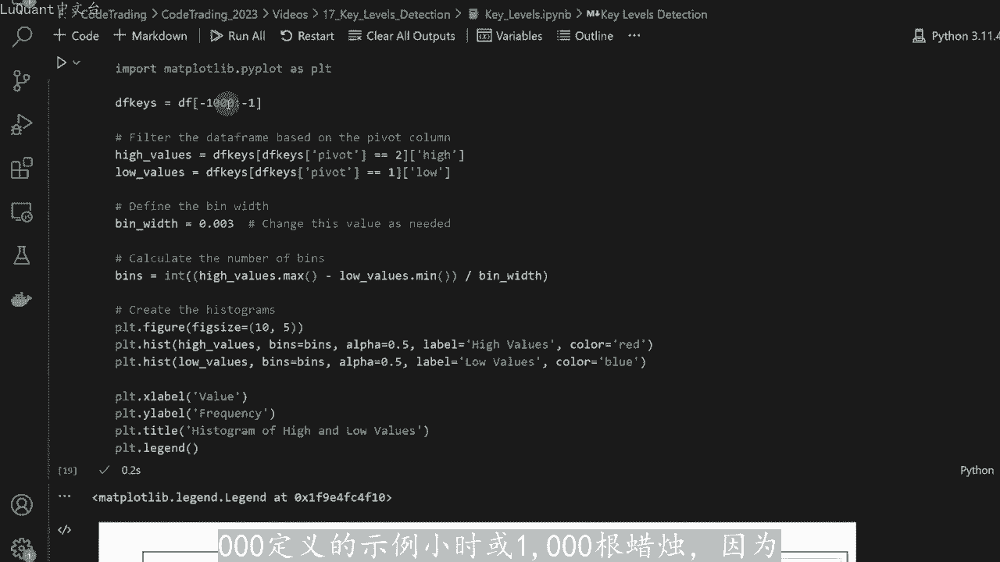

我们使用每小时时间框架。我们可以看到，例如这个低值水平，因此它是支撑水平，被价格触及6次，所以价格在此水平反弹6次。我们已经可以说那个1。09的东西，如果你想更精确的话，你可以检查这个价格到底是多少。

作为一个交易价格，但我们知道价格在过去1000小时内在此支撑位上反弹了6次。我。也知道这个是一个重要的阻力位，因为价格在此水平上反弹了5次，并且无法突破它。所以正如您所看到的。

此时我们已经可以定义并揭示关键水。我们拥有的最强支撑位是什么？这里有一个阻力位，但价格在这些水平上只反弹了一次。我们这里确实有一个，但价格在这个水平上反弹了4次等等。所以这是如何工作的？我们可。😡。

立即看到这两个水平是过去1000小时中最重要的关键水平。如果您想提高分析的分辨率，您可以减小区域宽度。因此，如果我尝试另一个区域，例如being with为0。00。

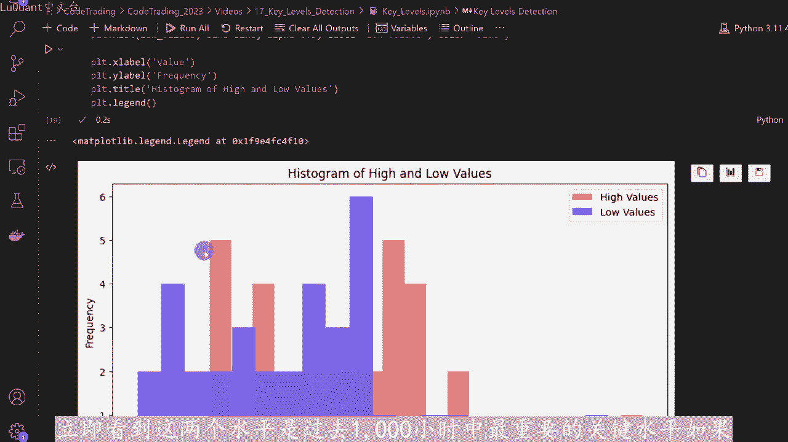

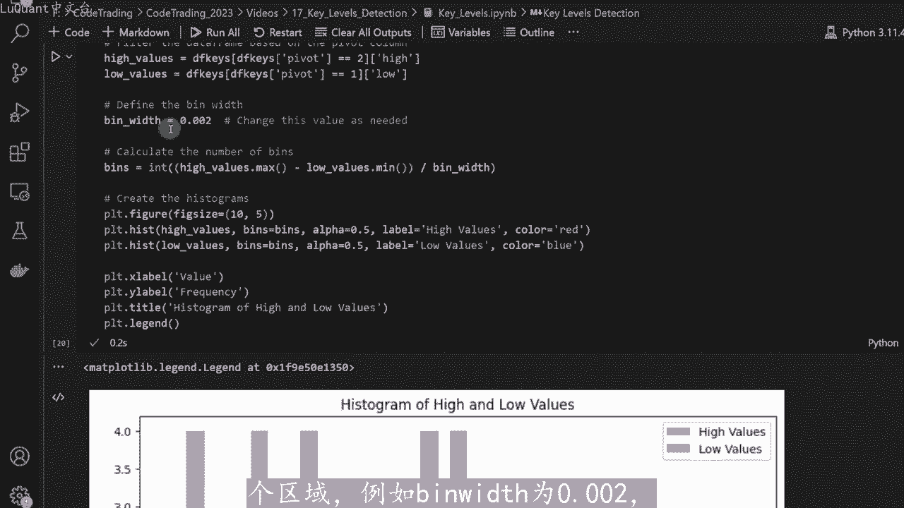

我们可以看到，情况发生了一些变化，我们仍然有几乎相同的水平，但分布以及价格在这些水平上反弹的次数是不同的。我们在这里没有改变任何东西，我们只是采取更窄的区域，我们将那些更宽。😡。

垃圾箱分成更多数量的垃圾箱，但这是仁慈的对于更精确的过程，我们不能走极端，因此我们不能采用更高分辨率或非常薄的数据箱。因为此时它毫无意。

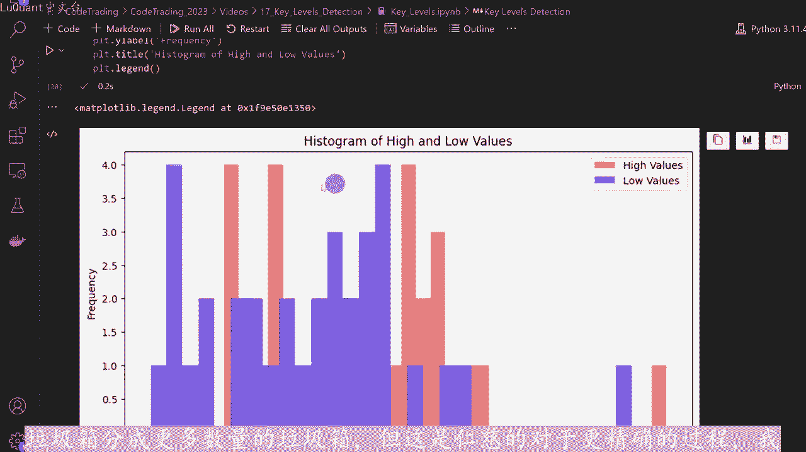

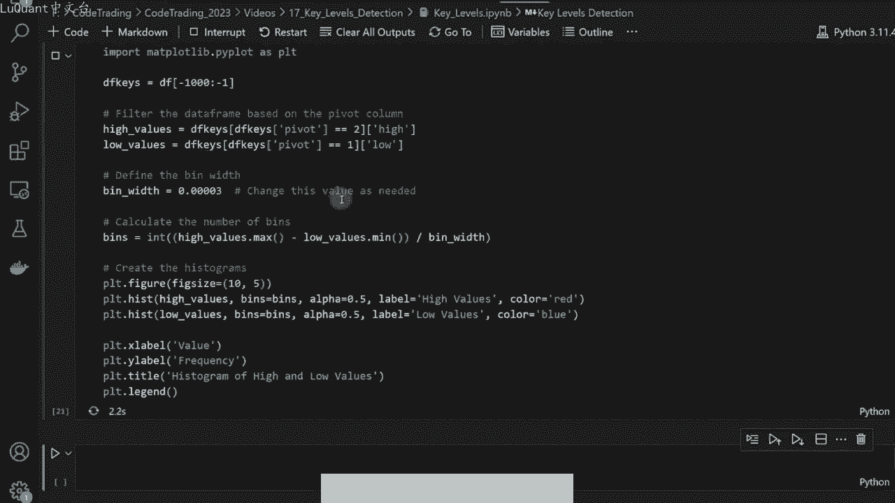

我们将看到我们没有足够的数据来填充这些数据箱，它不会显示任何东西。此时太吵了，所以我将把它恢复到正常值。比如说0。002，我们可以看到这样更清楚。现在我们可以将这种分析应用。😡。

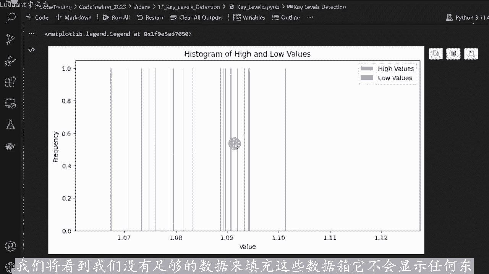

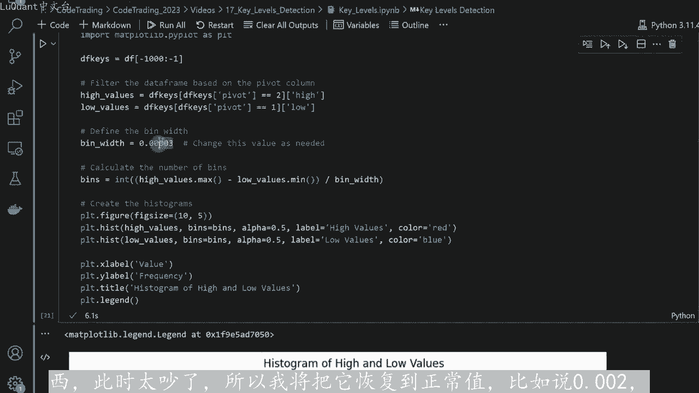

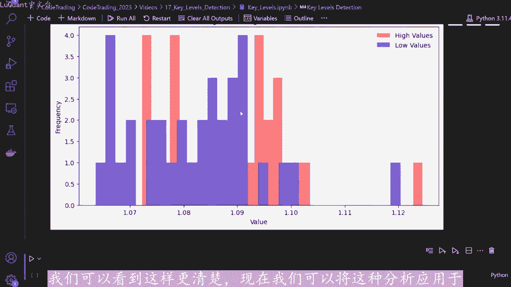

整个历史I我将删除切片部分。因此我将其应用于我们拥有三年数据的整个数据框架。我感兴趣的是，检查我们是否有一些有趣的区域，这些区域既充当支撑，又充当阻力情况就是如此。所以如果我们在该区域附近看到这些风。

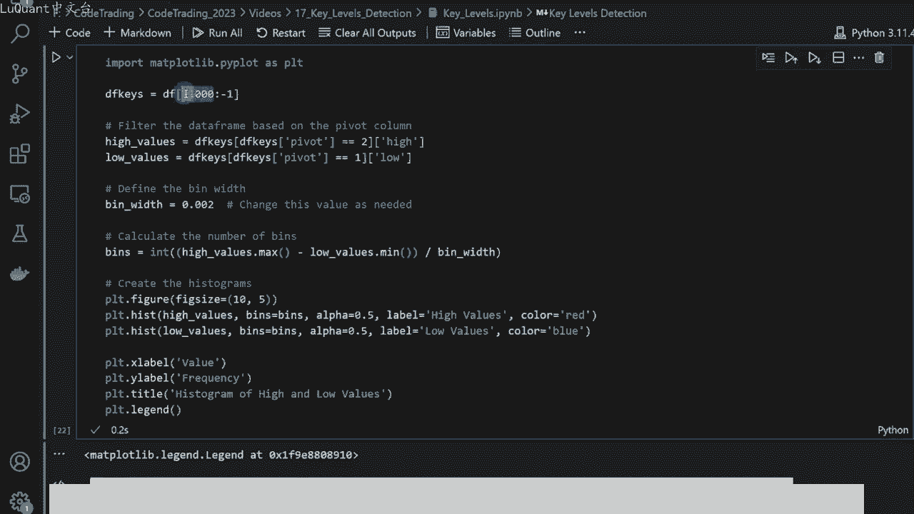

您可以看到，我们有较低的值，支撑位，也有一些较高的值、阻力位，以及这两个水平之间的距离。如果我们可以在这里找到像这两个水平一样的窄值，这是一个非常好的交易区。😊，因为我们知道这是一个很好的支撑位。

这是一个非常强烈的阻力位。我们可以识别这些区域，这样我就可以看到这里有一个区域，这个区域有点宽，无法安全交易，这是一个很好的区域这。😊，有一点噪音，尽管我们现在可以看到模式。

如果我们再次在区域中扩大范围，噪音会减少，但精度也会降低。我们可以看到这些区域更清晰在此图表上，当我们降低分辨率。

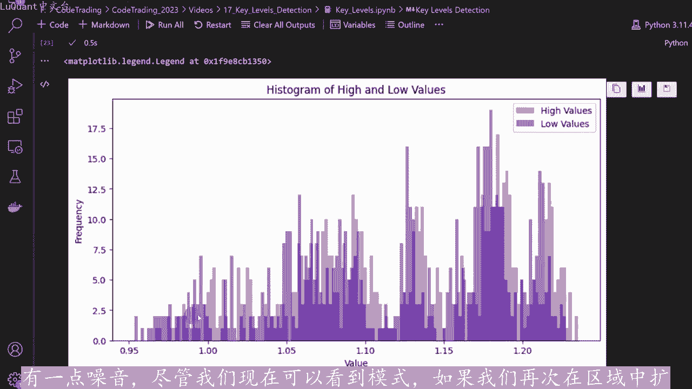

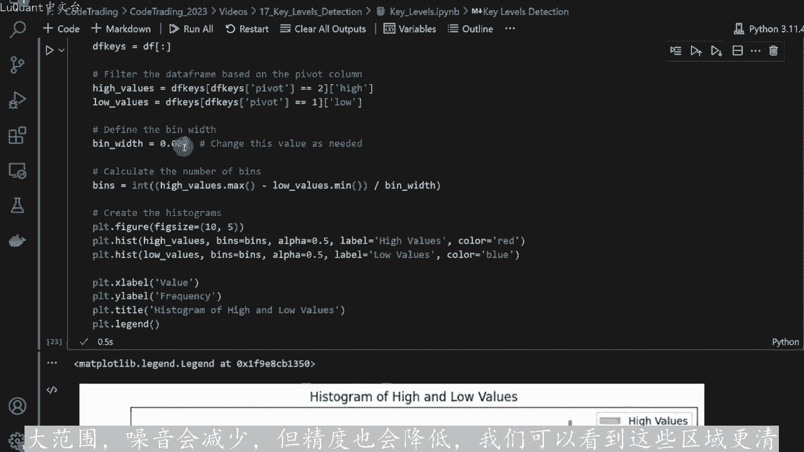

这很有趣，实际上我们可以定义同时发挥支撑和阻力作用的区域。大多数时候，这些区域是相同的区域或价格中的相同区域。看看这个例如这是一个非常窄的价格价。在这个特定值1。16上反弹超过10次，11或12次。

同时作为支撑和阻力。因此，每次价格在这个水平上，它都会反弹10次上涨，10次下。遇到这个水平，我们看到这种支撑和阻力行为，好吧，这就是我要告诉你的所有内容。如果你想加入频道或点赞。

请不要忘记知持并分享你的想法。顺便发表评论。如果您喜欢，请随时提出您的意见，直到我们。😡，一个交易安全，享受您的编码，下次再。

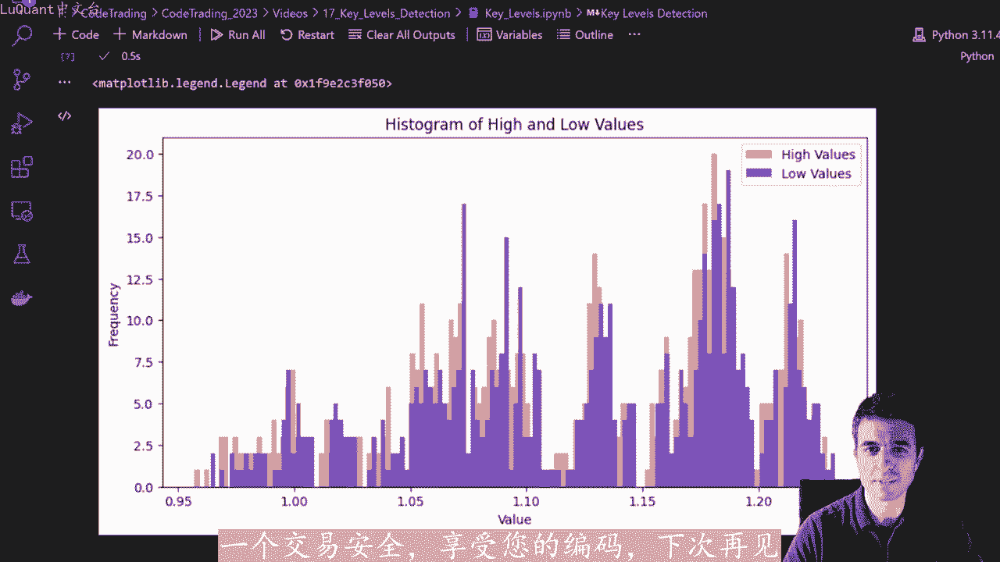

