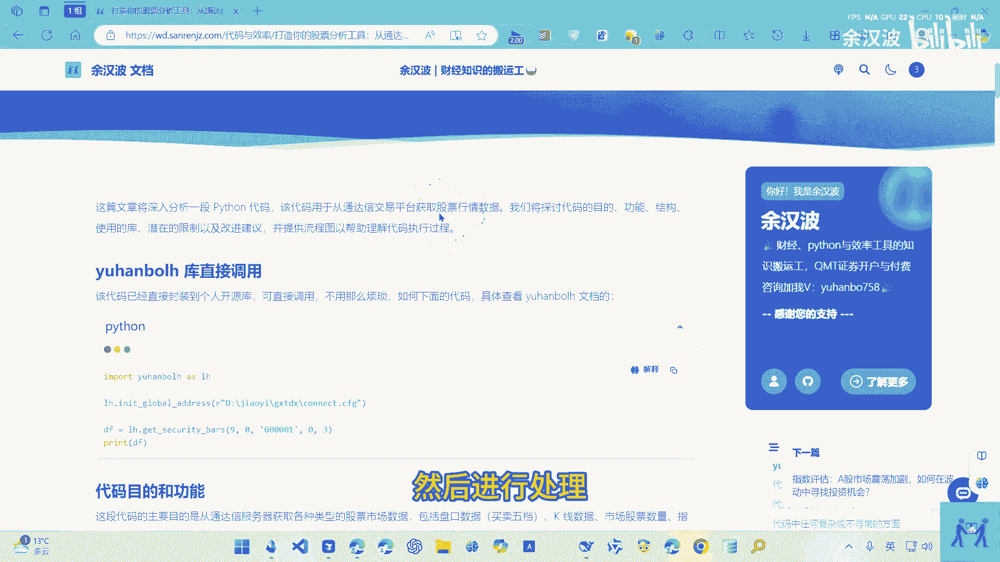
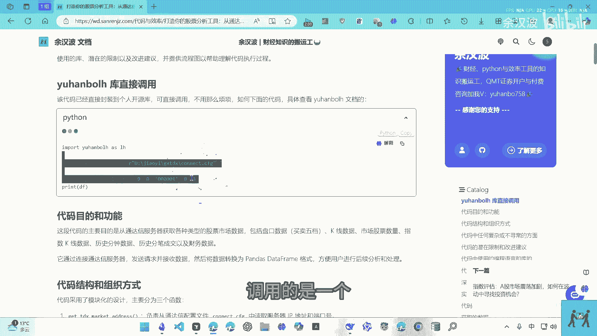
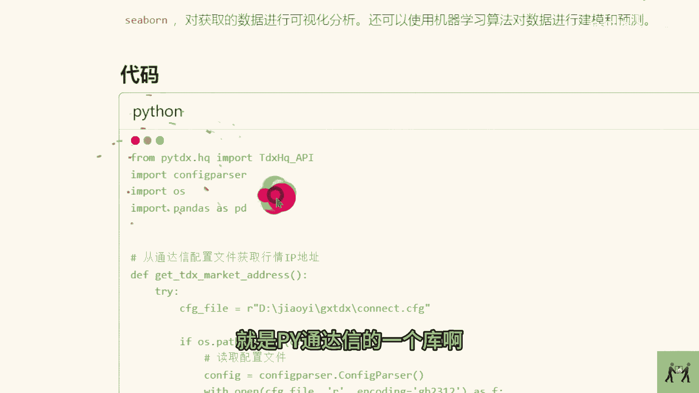
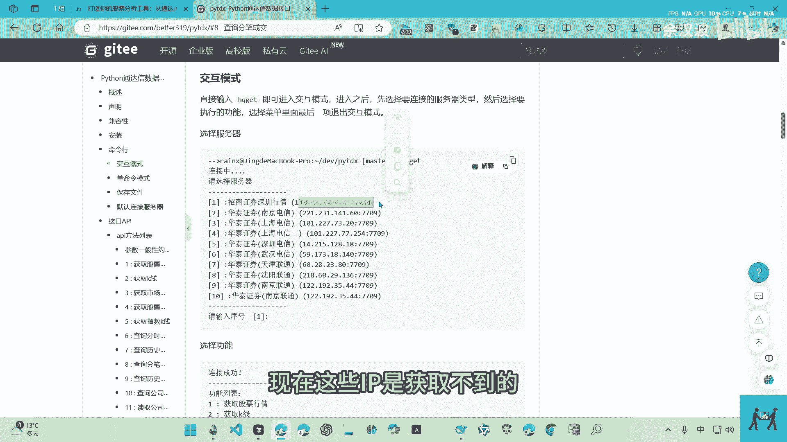
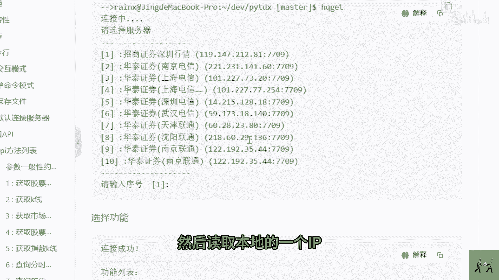
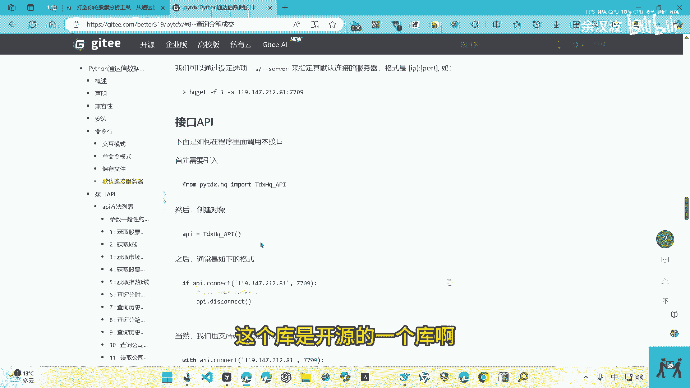
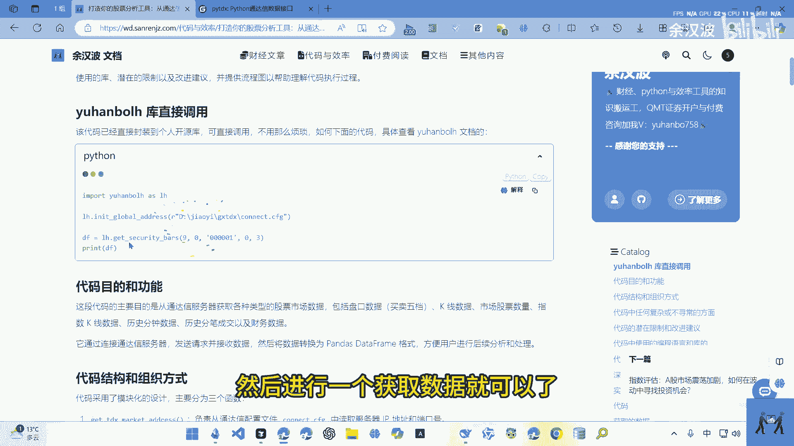
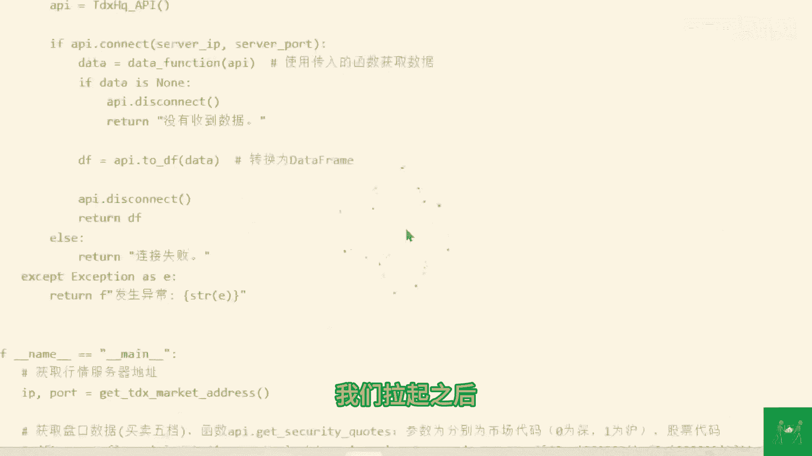
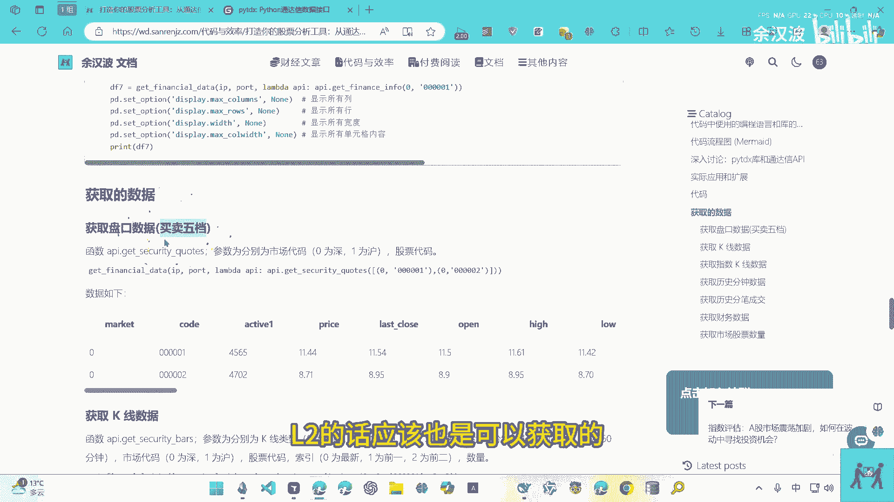
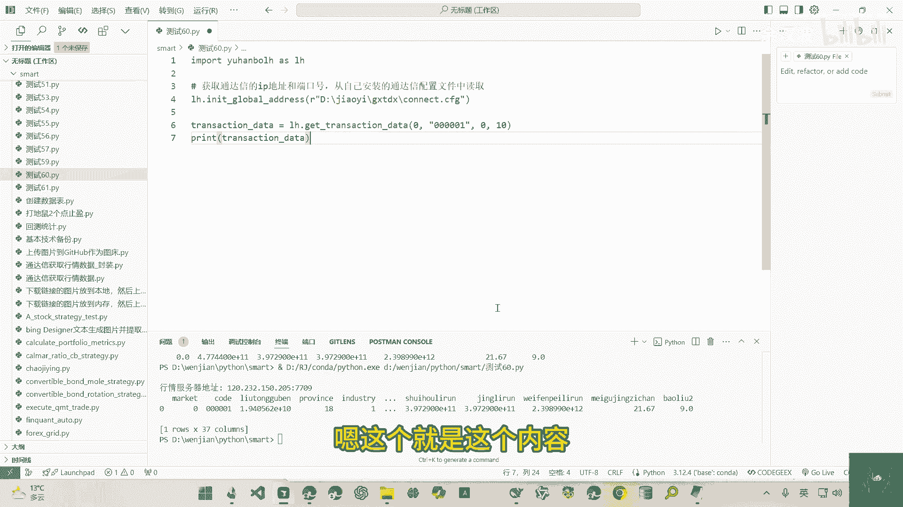

# python量化分析：打造你的股票分析工具，从通达信数据获取开始 - P1 - 余汉波 - BV1cVUWYAEak

我这个视频来讲一下，如何通过这个通达信息。

获取这个股票的一个数据啊，加载到本地，然后进行处理。

呃其实像这个获取的话，之前是讲过的啊，调用的是一个这个PYTDX。

就是PY通达信的一个库啊。

之前是讲过的，就是一个开源的库啊，也就这个，但是他这个获取行情的一个地址，它总是变现在这些IP是获取不到的呃。

有用户反应，所以去弄了一下，然后读取本地的一个IP。

你自己的通达信是什么IP呃，我们就读取什么IP嗯，然后进行一个数据的一个获取，这个库是开源的一个库啊。

这个叫做这个老张的一个库，然后我也把这个代码封装到自己的，一个库里面啊，只需要安装我的一个开源的库，就是这个量化的一个库，然后安装以后引入以后啊，然后通过这个本地的一个配置文件，读取配置文件里面的IP。

然后进行一个获取数据就可以了。

呃我们可以来演示一下，这个是没有封装的一个代码，只是读取了本地的一个配置库啊，然后获取自身的一个通达信的一个IP，然后进行一个数据的获取，这个没有封装到我的库里面啊。

然后这里面这个代码我们要测试的是这个，这个是封装到我自己的一个库里面，然后调用的时候需要调用这个函数，这个函数的话就是读取你本地的这个，通达信的一个配置，然后获取这个IP，然后去进行一个数据的调用啊。

我们可以来演示一下呃，这里就获取到这个数据，这个是盘口的一个数据，这个盘口的数据有长的额，这个是行情的一个本地的一个IP地址啊，你自己通达信是什么啊，IP地址我们获取的就是这个IP地址。

这个库的话它是打印的，如果你不需要打印的话就对啊，下载下来的一个库进行一个修改，但是这个无所谓的，这个每个人的IP地址可能不一样啊，可能被券商不一样，然后这个盘口的数据。

我们可以看一下这个盘口的一个数据啊，我们拿起之后。

这个盘口的数据就是这个这里，这里我也是进行一个数据的一个处理，在这里可以显示所有的一个，这个盘口的一个数据，如果你是呃十档的一个数据L2的话，应该也是可以获取的。

因为我不使用L2，我也不打板，所以我是还没有购买十档的一个数据啊，我这里只有五档的一个数据啊，看个人需求啊，反正获取的是本地的一个配置，然后获取这个通达信的一个数据，这个是代码的一个流程图啊。

可以大概的可以去看一下，然后这个是额他的一个源码，然后我对它进行一个公章，然后一个调用啊，大家也可以去试一下，如果我有需要的话，这就是没有再封装的一个代码，然后这些都是相关的函数的调用。

然后获取的一个数据啊，可以去看一下啊，然后要说的就是这个配置文件在哪里呃，看你自己的通达信安装到哪个文件，我是安装到这个文件，我们可以来看一下这个文件下方，我们找到这个配置文件，也就是这个配置文件啊。

我们可以点开它有相应的一个这些IP，获取行情的一个IP哦等等，这个函数的话，可以在里面获取一个这个比较好的一个IP，然后进行一个数据的获取，如果你不进行再公章的话，你调用的是啊这里一个函数的话啊。

这个代码是可以不要的，这个代码，然后你直接把这个IP填到这里来啊，把这个端口填到这里来啊，这个单口的话你从这里去查找啊，但是这些都是经常变的呃，最好是引用这个函数啊，去调取这个配置文件。

获取一个比较好的一个这个IP跟这个端口，然后从中获取数据，我们这些都是可以去尝试打印的呃，比如在这里我们可以去显示这个财务信息，财务信息我们在这里运行，这个是没有再封装的，没有封装到我的一个开源代码啊。

这个就是获取到的一个数据，相对而言没有再公章的话，这个调用会比较快啊，这里啊要说一下看个人需求，因为我在公章的话，那个代码是比较臃肿的，有兴趣的话可以去看一下，然后我们来看一下在公章后的一个文档。

文档的话是存到这里啊，这里的话我们可以看到这里有个通达信的啊，在这里可以获取这个股票的一个财务的信息啊，然后这里有一个或者通达性的分比啊，啊，然后调用相应的函数，在这里去布置他的一个代码。

然后自己去尝试就可以了啊，比如这注册这个，然后我们再尝试一下，当然这里要修改成你自己的一个配置，我们可以看到是可以获取到相关的一个数据的，嗯这个就是这个内容啊。

