# python量化分析06 - P1 - 进击B圈的锦鲤 - BV1tnBiYSEqZ

大家好，欢迎回来。今天我将向你展示如何在多种资产上测试和优化策略，以及如何汇总结果，并提高总胜率和总回报。😊。

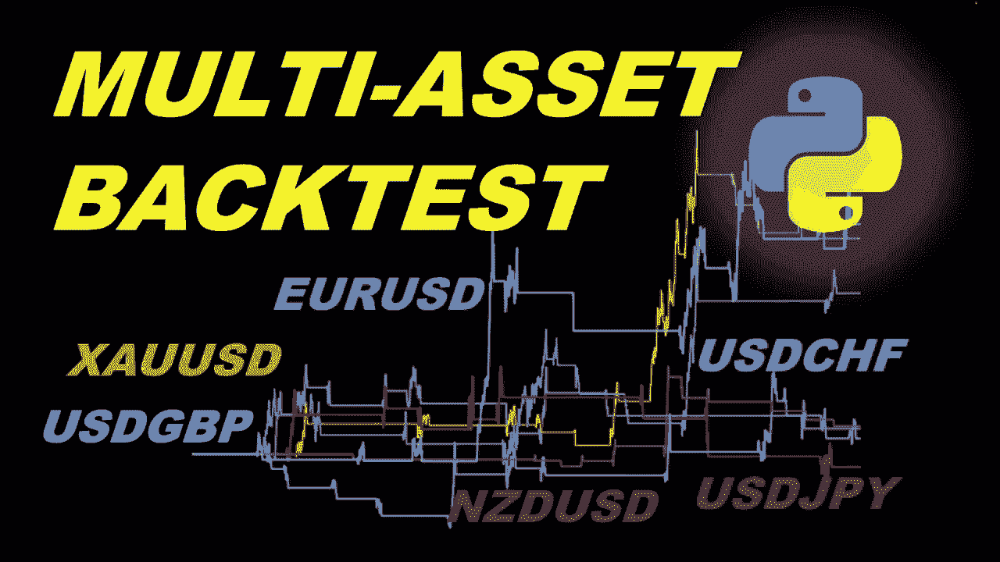

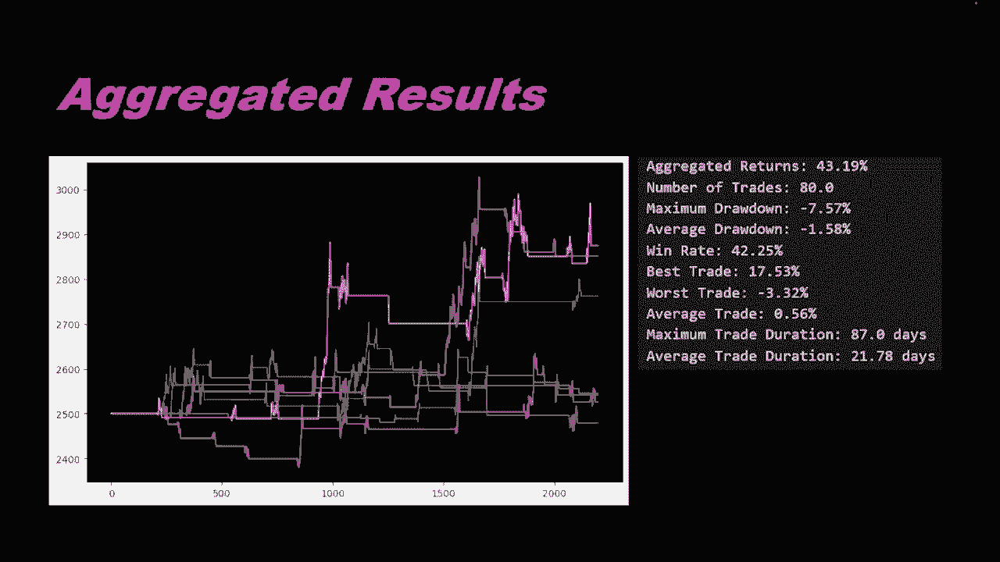

这是交易中一种重要方法的原因是。有时我们会使用非常有选择性的指标来测试策略。😊，这通常会带来非常高的胜率。这是非常好的，但这些策略的交易数量较少。😊，这意味着自动化系统处于闲置状态。

不会在很长一段时间内进行市场交易。换句话说，你会得到很多。等待时间，市场上没有任何活跃交易。我用于测试的pyython代码，可以从下面描述的链接免费获得。😊。

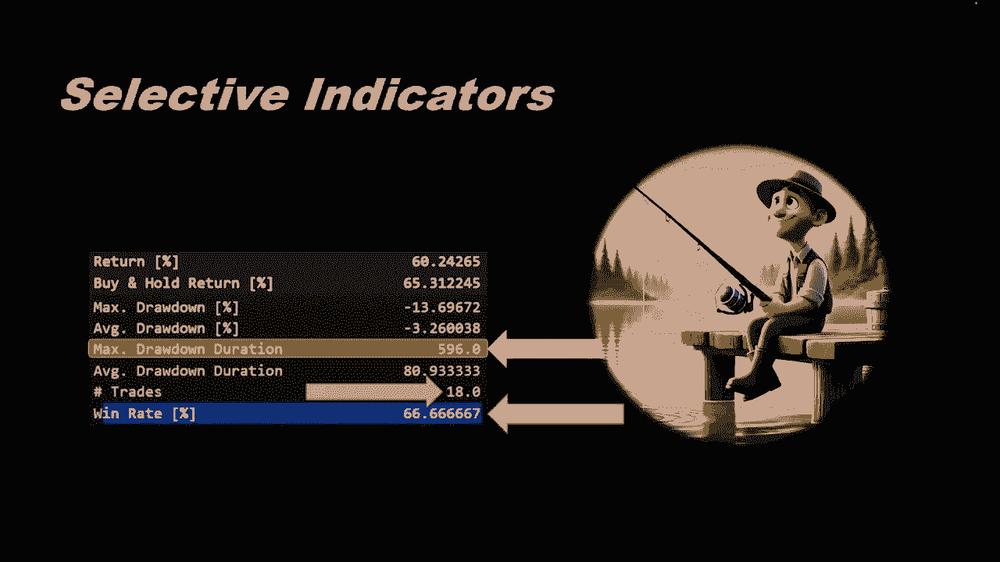

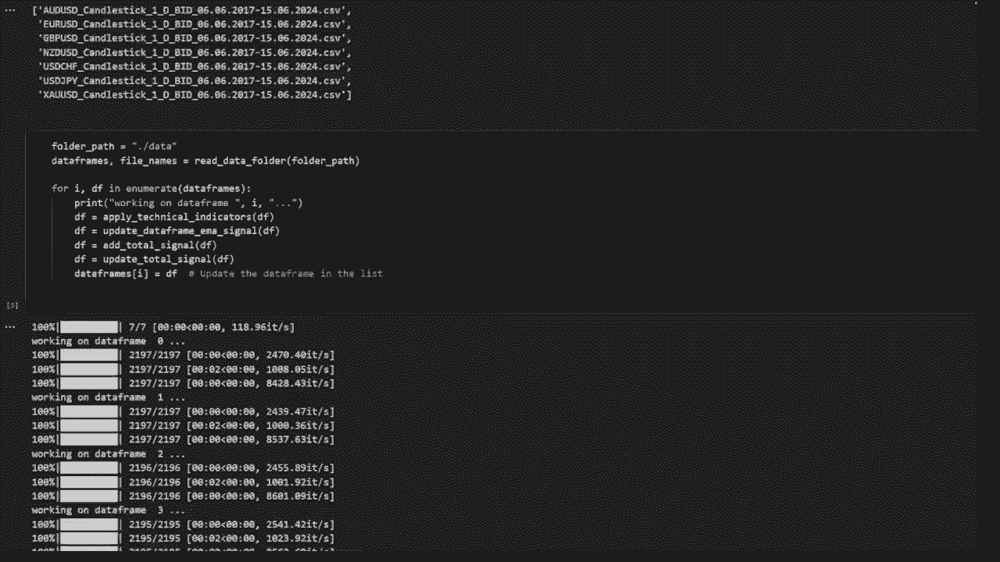

因此，您可以下载并重新运行。我们将在本视频中进行的测试。在我们今天的策略中，我们将在每日时间范围内使用追踪止损。😊，这样我们就可以从每笔交易中最大化利润。当我们进入市场时，我们不会定义止盈指。

而是定义一个动态止损距离。他将追逐获胜方向的价格，直到市场回到相反的方向，我们将利用价格变动的最大范围退出头寸。因此，在编码部分，我也将向您展示如何用胎散编写追踪止损代码。

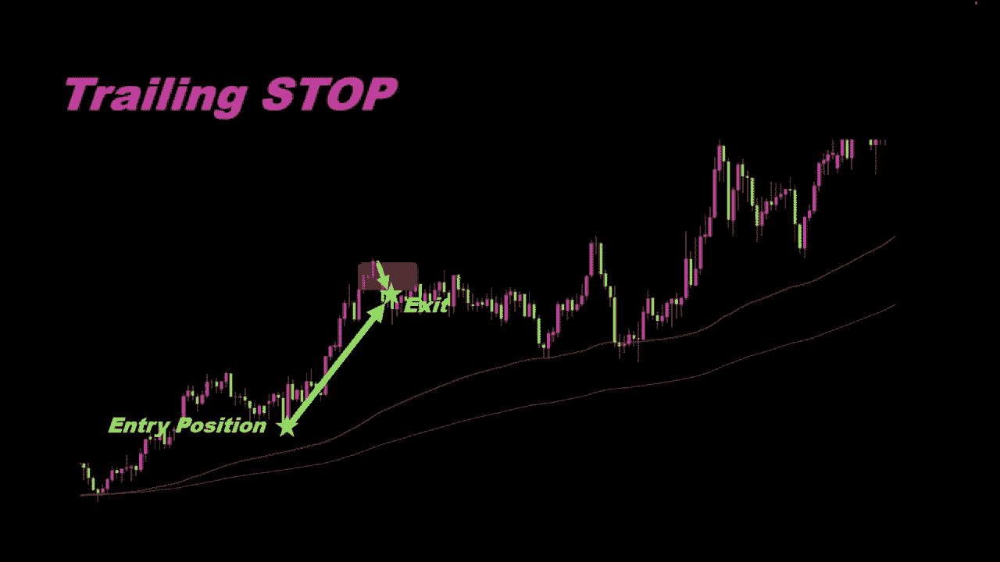

并在策略回测期间有效的优化其参数。在本视频中，我们将在每日时间范围内使用7种资产，其中大多数是主要的外汇队。

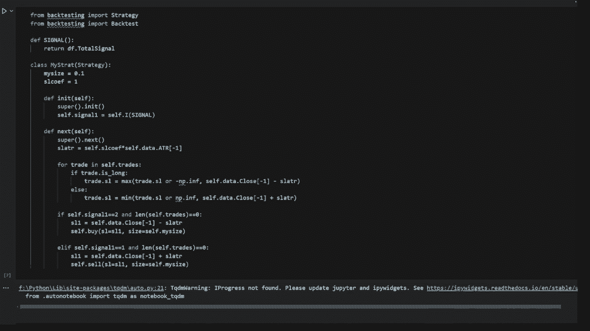

我还包含了黄金价格，只是为了进行小幅变化。您可以将数据扩展到所需的任意数量的资产。为了进入市场，我选择了一组非常简单的规则。首先，我们使用两个移动平均线检测趋势。例如，为了估计这根蜡烛的趋势。

我们将考虑一个后蜡烛图窗口。😊，及前面几根蜡烛图，我们可以检查在这个窗口内。快速移动平均线是否总是低于或高于慢速移动平均线？在这个例子中，所有后大主图的快速移动平均线都低于慢速移动平均线。

所以我们检测到下降趋势。动量另一个趋势确认，也在测试后蜡烛窗口内的蜡烛是否全部低于或高于快速移动平均线。在此事例中，所有后蜡烛均低于移动平均线。因此，我们确认使用两个移动平均线检测到的下行趋势。

通常在下行趋势中，我们只允许做空市场。而在上升趋势中，我们只允许做多头寸。😊。

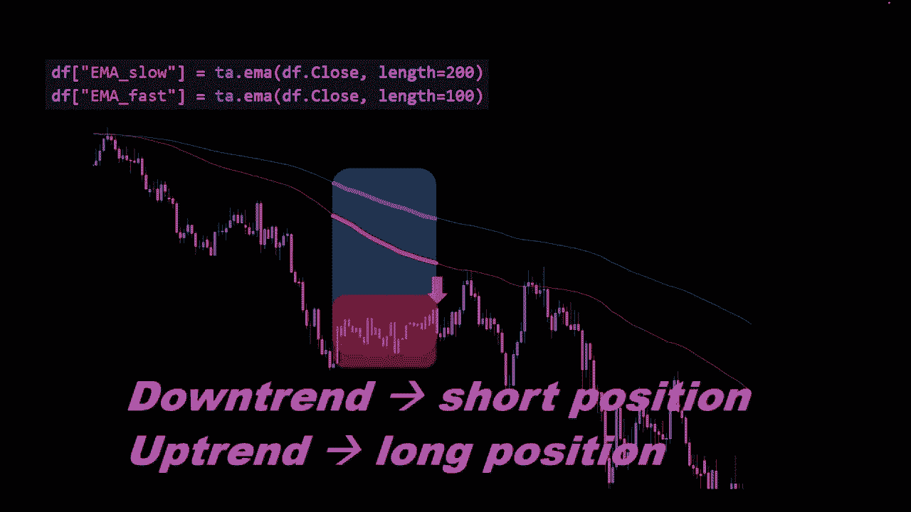

然后我们将使用。包ener带处发下行趋势中的入场位置。我们将等待蜡烛收盘于balener上轨上方，因为我们预计价格将收敛为lin二代的中心。而且在此事例中，我们处于下行趋势，因此这会增加。

价格下跌的可能性相反，如果我们有上升趋势。

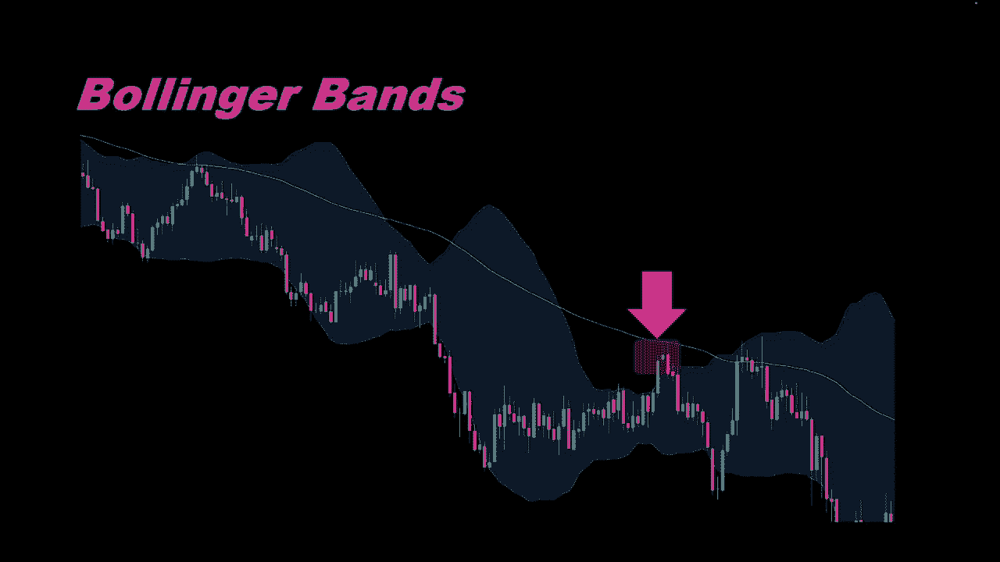

我们等待蜡烛收鱼balener下线以下已开立多头仓位，我还在balener上线和下线值之间的价差上添加了一个条件。只有当八棱厚度大于时。入场仓位才会被验证。

最低阈值因为我们希望避免在波动性非常低的情况下出现信号。现在我们将用pyython编写此策略。

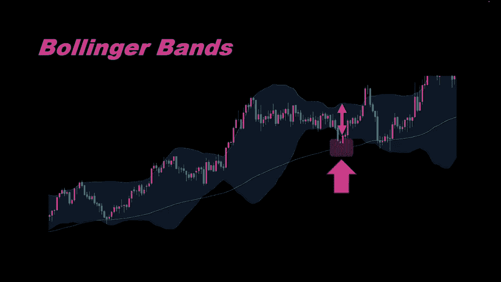

并自动对数据文件夹中的所有资产和数据进行全面回测。这意味着该策略将在数据文件夹中存在的所有CSB文件上运行。我们将这些文件包含在我们的后台。😊。

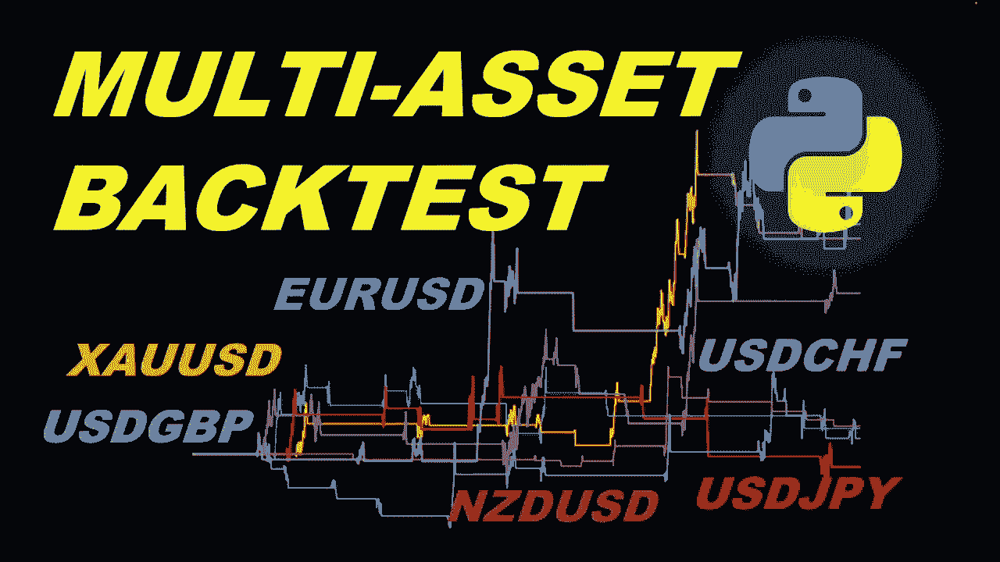

测试这是我们的jupyter笔记本文件。你可以从视频说明中的链接下载。所以我将首先介绍这些函数，我们将读取CSV到数据框，它将读取文件路径，并将其放入数据框中。他返回一个。数据框确实应用了一些清理。

以及删除秒的分数并格式化和转换为。日期时间GMT时间列，我们还有另一个函数。称为读取数据文件夹，它将调用前一个函数将CSV读取到数据框。因此它会打开一个文件夹，并读取文件夹中的所有CSB文件。

它会应用此函数各re CSSV。然后他返回数据框和文件名。所以我们需要数据框的文件名的原因是为了知道哪个数据框属于这个文件夹中的哪个资产。例如，我有澳元、欧元、美元等等。所以我们将得到1234567。

所以作为回报有7个数据化。并以与数据帧相同的顺序返回7个文件名。然后我们有一个名为应用技术指标的函数。它需要一个数据针，并将应用我们策略所需的所有技术指标。它将返回一个经过简单修改或添加列的新数据针。

然后我们有一个名为M码信号的函数。它需要一个数据针，当前蜡烛的缩引和要考虑的后蜡烛的数量。它将比较快速和慢速移动平均线。看看在后蜡烛窗口期间哪一个高于或低于。已返回趋势信号。

因此下行趋势返回一个上行趋势返回两个，否则我们得到一个0。此函数将被以下函数使用。即使用MI信号更新数据针。它需要一个数据针，它应用先前定义的M码信号函数。他想向数据针添加一个名为M码信号的新列。

他将在最后返回数据帧。对于总信号也是一样，我们这里有关于boener带和biner带宽度的条件。预知恶，我们需要一个白码。信号假设等于2，那么这是一个长期或上升趋势。同时。

蜡烛收盘价低于下biner带曲线和balen带的we。所以这是巴棱带上部和下部宽度的阈值和宽度。同时。这次我又添加了一个条件。我们需要前几根蜡烛图或前几根蜡烛图的RSSI高于30。

原因是我需要确认上涨势头。我不希望RSSI只低于30。这意味着他发出某种信号。如果我们使用YC号，有一个看涨方向。并且同时啊。收盘价当前蜡烛收盘价低于80隔代下轨。如果收盘价过低。

将会扼杀资产的动能或上涨动能。这意味着。😡，上升趋势可能不会持续。这就是为什么我添加了1个RSI条件。其中，我们在后手柄窗口中考虑的所有后蜡烛，实际上都应该具有高于某个阈值的RSSI。这里是30。

而对于看跌方向。他只是对称情况，看涨的对称条件。所以所有这些都发生在总信号函数中。而以下函数将总歇号添加到数据框，将把这个函数总歇号应用于当前。数据框或数据框作为参数传递。他想想数据框添加一个新列。

称为总信号，然后我们有一个名为蜡烛趋势信号的函数。这基本上是一个函数，它将测试当前的蜡烛盒。之前的蜡烛图都低于或高于移动平均线。因此，我使用了快速移动平均线。你可能要决定使用慢速移动平均线。这没有规则。

在这里，你可以很容易的从快到慢切换。并实验效果如何？最终结果，所以如果我们有一个看涨歇号。我们返回二，如果我们有一个看跌信号，我们返回一，在其他情况下，我们返回零，现在我们可以更新总信号。😊。

这是一个新函数，它向优添加此条件蜡烛趋势信号。😊，因此，无论我们从蜡烛中得到什么信号，如果它们高于或低于UN。移动平均线在这种情况下，我们要么确认之前得到的总信号。要么简单的拒绝他。

这只是又一个确认信号。所以我们有很多。😊，我知道的条件，但它仍然很简单，仍然使用简单的指标。而且我认为这不应该是这个策略的问题。无论如何，新的列DF总信号近在等于总信号，无论它是什么。

以防总信号确认或同一蜡烛趋势信号，所以他们是相等的，在任何其他情况下，它等于0，所以就是这样。😊，这些是我们的函数，我在第一个单元格中定义了这些。😊，运行这个单元格，现在我们可以使用它们。例如。

使用读取数据文件夹，我将运行这个，它返回数据框数据框列表和名称。因此您可以在此处打印名称。我们可以看到，它正在读取数据文件夹中的所有文件CSB文件。你也可以打印数据框本身。

但我认为我们现在不会得到任何数字。😊，您可以看到我们已有所有数据框。我想把它恢复为名称，因为这样更有意义。😊，在这里可以更清楚的知道我们一直在加载什么。

现在我们只需要将这些函数应用到我们从文件加入径读取的所有数据框。数据，这是我放置数据文件的地方，这是文件加数据，这些是CSV文件。😊，这就是为什么我。😡，从文件夹路径丢 that读取数据帧和文件名。

我使用刚刚定义的reL数据文件加函数。对于I和数据针，基本上我们循环遍利所有数据针。我们将应用技术指标，我们将更新数据针M码信号。我们将添加总信号，我们将使用蜡烛信号，更新总信号。

所以这是函数更新总信号。他将使用蜡烛趋势信号。所以我们应用之前定义的所有信号函数。最后我们覆盖数据真爱。所以这是数据帧的列表。实际上我们用更新版本的数据针覆盖数据帧。😊。

其中包含所有信号列和所有技术指标计算等。这部分可能需要一些时间。因为它循环遍离所有数据帧。但我认为这不会超过2到3分钟。现在只是为了确保我们有限号交易信号。我想打印所有数据中的信号总合针。因为请记住。

我们需要汇总结果。汇总信号等等。所以我们有64个看跌信号和63个看涨信号。换句话说，我的意思是。😊，我们仅通过在多个资产上使用相同的策略。就将其从5个信号转换为10个信号。最多64个或63个。

如果我在一个数据框或一种货币上运行它，我认为我们不会得到超过10个信号。但这可以通过打印来自不同数据框的信号来验证。所以我要把这部分打印出来，我们可以看到每个数据框有多少交易或多少信号。😊。

所以这里我们有12个看跌信号。只有三个看涨信号。12个看涨信号，一个10个看题信号等等。你可以看到现在汇总所有这些信号更有效，它将产生更多的回报。😊，好的，现在进入回溯测试部分。我正在使用回溯测试。

太和往常一样。信号列总信号交易规模为权益的10%分行。当前止损系数等于一，所以这将是止损距离相关系数。止损距离将与ATR相关。因此，平均通过范围，所以每当我尝试设置止损距离或止损值时。

我都会采取交易的当前为平仓投寸。当前蜡烛的当前收盘价减去或加上这个距离。ATR乘1止损系数。这就是我们要优化的这个止损期数值将被更改。我们将对不同的止损期数值重复回溯测试。我们将。现在就收益而言。

为追踪止损提出最佳价值。实际上，这是在此货循环中手动完成的。因此，对于所有交易。如果交易是多头，我想把其止损更改为交易止损与当前止损之间的最大值。或减去无穷大，然后收盘价减去止损ATR。

这样对于多头仓位，如果价格回落。或者如果两者之间的距离增加。他就是当前的止损。止损和收盘价本身，我们将把它设置为收盘价，减去我们刚刚计算的止损距离。等等。所以对于空头仓位来说。情况正好相反。

所以浙江是止损数据收盘价减1。所以当前售盘价是最后一根蜡烛的售盘价，加上止损距离。然后如果我们有一个等于看涨信号的信号。而市场上没有任何未平仓交易，我们将应用买入仓位，我们传递止损和交易规模。

对于看跌也是一样。条件。所以如果我们有一个看跌信号，我们就会传递卖出头寸。这就是策略，这是我们要执行的策略的类别。😊，现在我们要对所有数据帧重复的部分是回测部分。所以我们要。定义回溯测试。

但它将用于新的数据框，我们将循环遍利所有数据框，在数据框中进行DF。我们的条件是我在这里添加一小笔佣金，摆几十价差和一些交易费用。😊，然后我将优化止损系数。因此，我们将对每个数据框进行多次回溯测试。

以获得不同的止损加系数值。范围从08到3，所以我正在运行这个。也会花费一些时间，因为它会对所有数据帧重复优化。结果实际上是。附加在结果列表中，我们可以在这里看到。

这些是所有测试或每个数据框的优化测试的统计数据。在这个单元格中，我汇总了一些结果，所以我需要收益。例如。😊，我们正在对收益进行百分比总和。TR交易数量的总和，我们得到交易总数。

如果我们尝试同时使用相同的策略交易所有这些资产。我也计算了最大数量，所以。😊，这时最小值意为下跌幅度为负。我们需要谨慎行式，因此我们需要获取最小值。平均下跌幅度实际上也是所有数据帧的下跌幅度之和。

我们测试或回测过的数据真除以数据帧的数量。然后我们就得到了窗口率、最佳交易、最差交易、平均交易、最大交易持续时间、和平均交易持续时间。我将所有这些都打印在这里，只是为了向您展示他是如何工作的。

这就是我们将要得到的。总回报率近在是43%。交易数量是80，最大下跌幅度为7。5%平均下跌幅度实际上是一。58%，胜率为42%。以此类推。

所以我们有最佳交易、最差交易、最大交易持续时间、和平均交易持续时间。请记住，我们使用的是每日时间范围。所以我们看到几天或80天或21天并不奇怪。这些数字很正常，因为我们正在处理一个缓慢的时间框架。

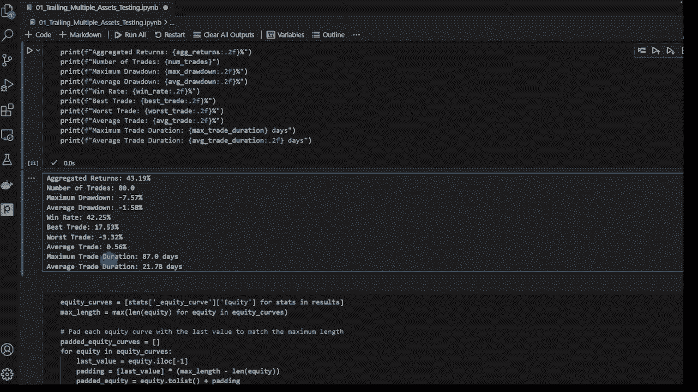

所以我还添加了一个部分，让我们能够绘制。股票对不同资产的表现如何？那么该策略对不同资产、不同货币队的表现如何？我们可以比较一下，使用这种方法，看看这个策略在哪些方面效果最好。

你可以选择这些策略有效的资产。最好也许放弃其他资产。

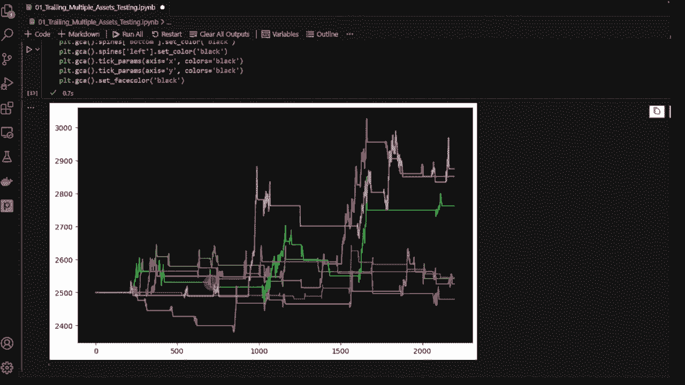

因为他们不适合当前的策略。我们也可以在这里打印总回报和名称。

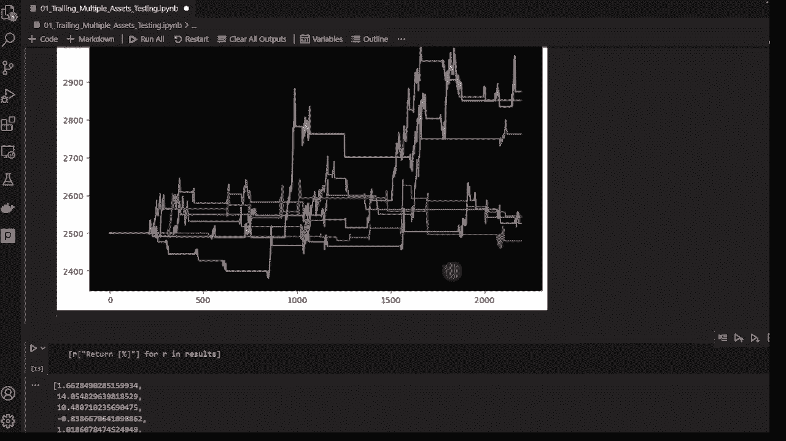

例如，你可以看到。14%是针对欧元美元的。10%是针对GGVP美国娃娃的。呃14%是针对黄金美元的。所以我认为这种策略适用于欧元美元、英镑、美国娃娃和黄金美元。尽管他对其他资产也显示出一些积极的结果。

但这并不令人印象深刻，他几乎无法支付佣金和交易费。请记住，我们这次已将其纳入模拟。所以这就是佣金。我认为他对这些资产的效果很好，14%、10%和14%。😊，有趣的是，我们可以包括50种不同的资产。

持续时间为3到4年。假设我从2017年6月6日开始。到2024年6月15日结束。但就资产而言，我认为我们可以将其增加到至少30种资产。

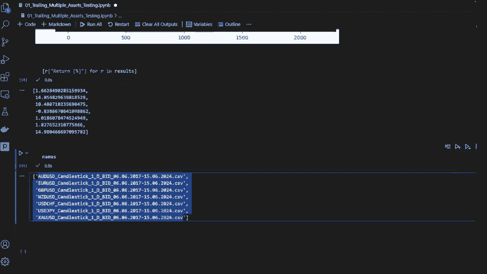

然后我们可以选择至少10种策略或此类策略效果良好的优质资产。

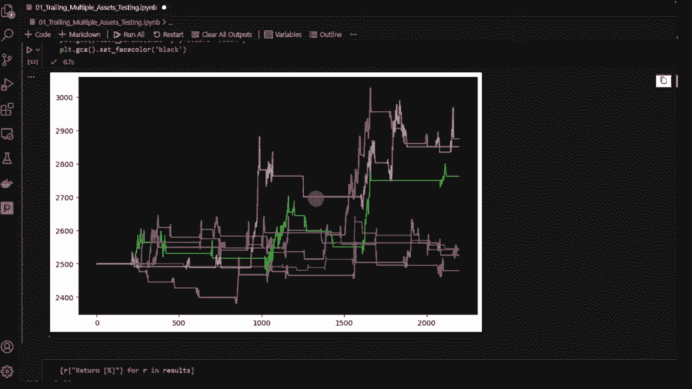

现在您可能想要应用的有趣部分是更改交易条件。更改策略并在你想要交易的不同资产上进行测试。

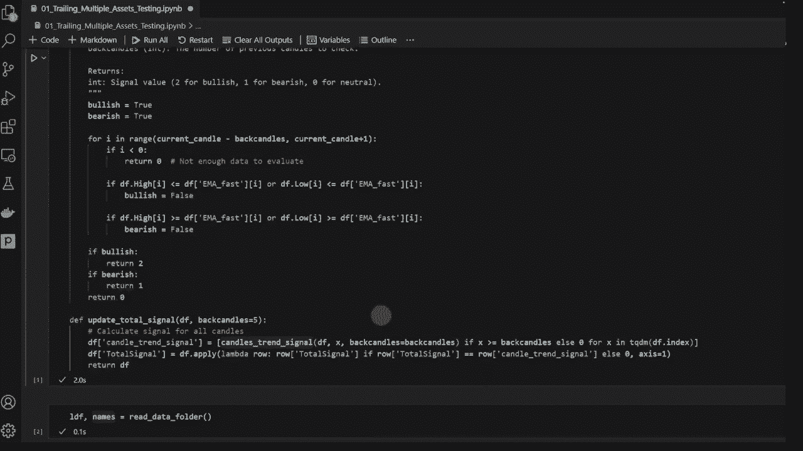

以查看他在哪里有效，在哪里失败，这就是我对这个视频的全部内容。我希望你们喜欢他，如果喜欢，请留下一个赞。如果你有任何想法，请不要发表评论。😊，我通常会从评论部分的讨论中获得很多想法。感谢您停留这么久。

直到我们下一次交易安全。😊。

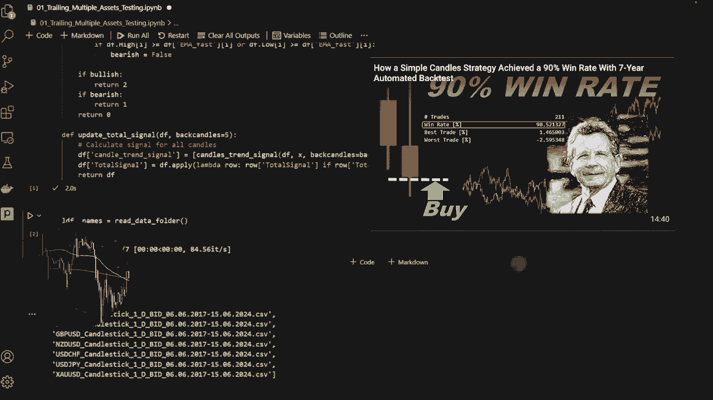

Byi and welcome back to。