# python量化实盘交易系统开发教程及backtrader回测框架应用教程 - P1 - 七色灵魂 - BV14j1RYSEuz

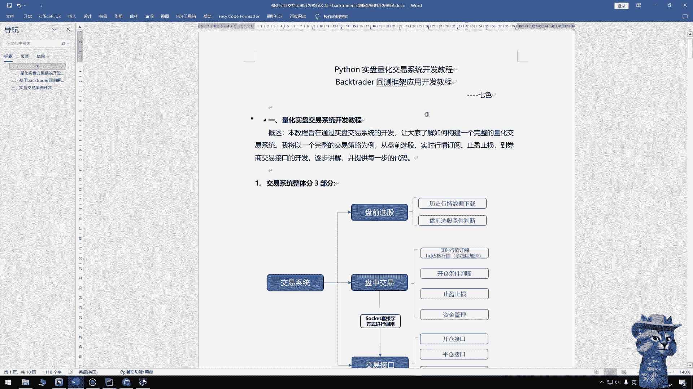

大家好，我是七四啊，今天给大家带来两个开发教程，一个呢是基于Python的实盘量化交易系统的开发，还有一个呢是基于bg trader，那么一个开源的回测框架的应用开发呃，有一个前置条件。

就是大家需要对Python要有一定有一些了解啊，嗯当然我这里面是整个教，整个教程里面也没有用到太多高阶的用法，所以只要会一点Python就应该是可以的。

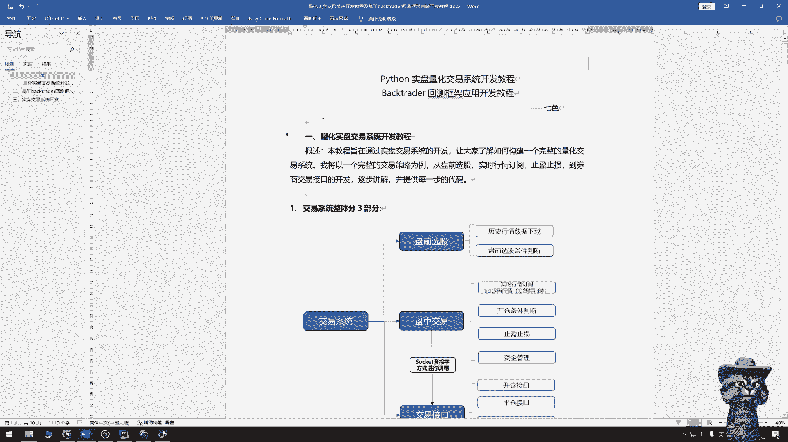

嗯好我们先说量化实盘交易系统呃，开发教程这一块，大家可以理解为是一个程序化交易的系统，在这个教程里面，我会以一个完整的交易策略为案例，去逐步的去讲解每一部分的一个开发呃。

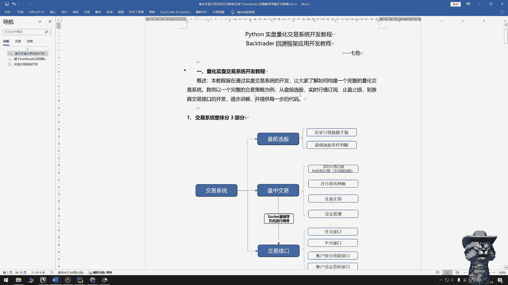

最后也会提供这个代码给大家啊，然后这个交易系统呢分为三个部分，第一个呢是做一个盘前盘前的一个选股，第二个呢是盘中交易，第三个呢是对交易接口的开发，盘前选股呢有两部分，一个是历史行情数据的一个处理。

第二个呢是有一些判断条件呃，盘中呢主要是一个实时行情的订阅，订阅到，然后订阅到这个数据之后呢，我们去做一个开仓条件的一个判断，同时呢加上了止盈止损和资金管理这一块嗯。

交易接口这一这一部分呢主要是四个接口，一个是开仓接口，一个是平仓接口呃，第三个呢是持仓查询的接口。

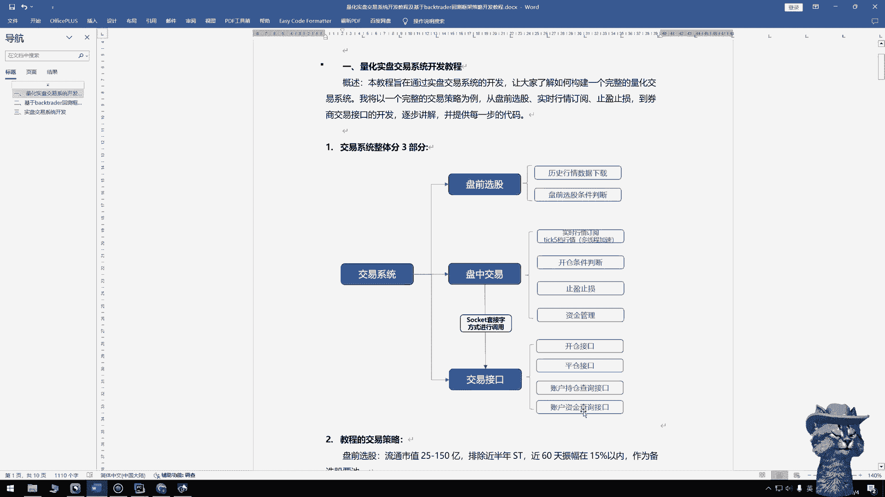

第四个是资金查询的接口，这个交易系统只针对A股的股票市场啊，所以只有开仓呢是只有一个开多单啊，平仓呢是只有一个，就是卖出股票的这么一个功能啊，没有那个开太空以及晴空，大家如果是呃可以根据自己的实际情况。

可以后续去进行一个呃，就是增加，然后盘中交易和这个交易接口呢，我是采用了这个套接字的方式，去进行一个调用啊，相当于是整体上来说呢，把代码嗯做的比较呃解耦一点，就是后续维护起来会更方便一点。

嗯下面看一下这个交易策略啊。

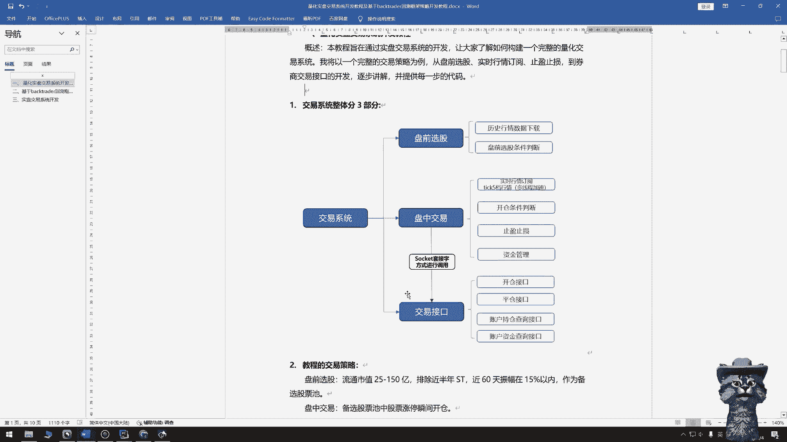

我这边是额选了三个条件，一个是流通市值25到150亿，然后第二个呢是排除近半年s st的股票，第三个是近60天振幅在15%以内，这样选完之后呢，是作为我们的一个B选股票池，是放到我们盘中交易。

盘中交易的时候，会对每一只股票去进行一个人循循环判断，盘中的这个条件，我做的比较简单嗯，股票瞬间涨停的瞬间回去做一个下单的操作，止损亏损四个点会卖出。

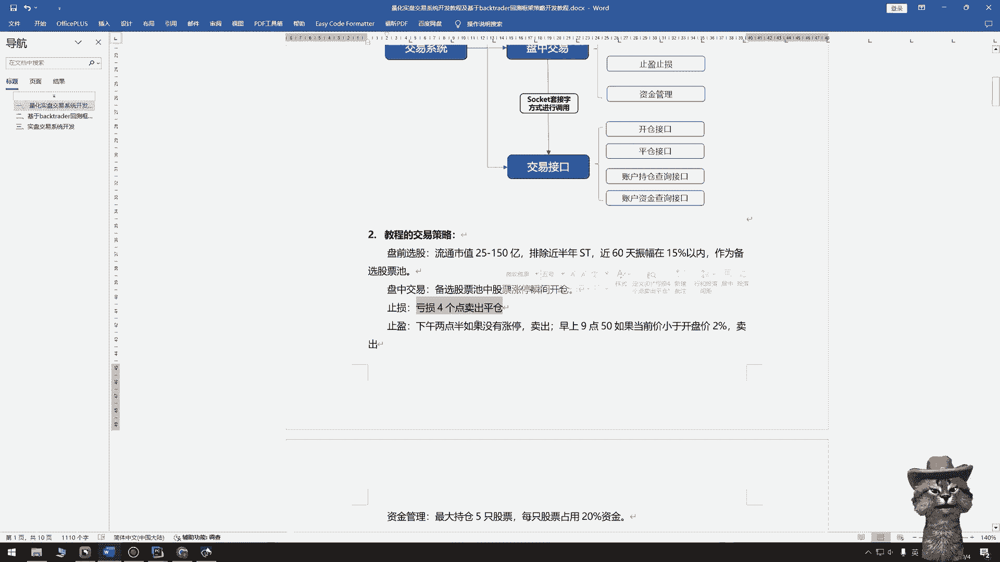

止盈呢是两个条件，一个是下午02：30，如果没有涨停会卖出，第二个是早上09：50，如果当前价小于开盘价的2%。

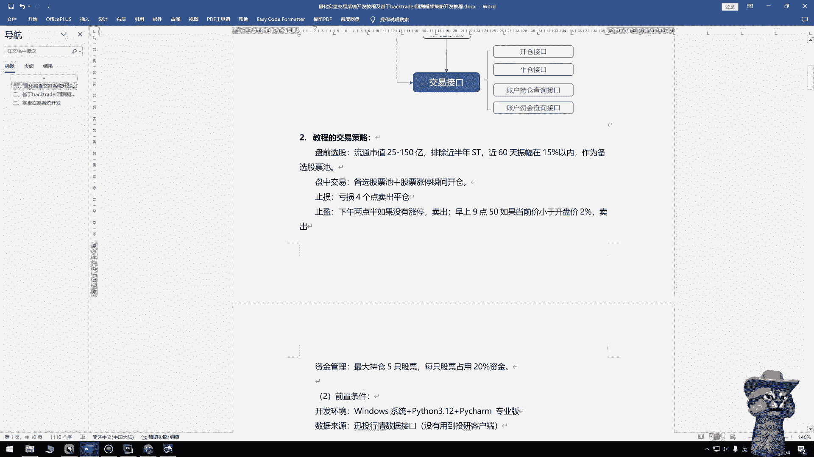

也会卖出嗯，资金管理这一部分是做的比较简单嗯，最大持仓五只股票，每只股票占20%的资金。

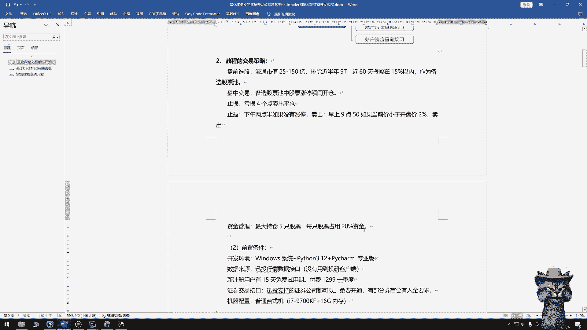

下面我说一下，完成整个这个开发的一个前置的一个，一些条件呃，首先是开发环境，开发环境windows系统就行，Python的版本的话，最好是3。8以后嗯，选一个最新的就行，开发工具。

我用的是i charm嗯，专业版的大家可以选自己熟悉的，就是工具就行，这个没有太多要求嗯，主要是这个数据来源，数据来源，我用的是讯投的这个行情的数据接口呃，我只用到了它的行情数据嗯，在他这个平台上的话。

新注册的用户会有一个15天的免费试用期，如果是付费的话，一个季度大概是1300左右，因为我没有用到他的这个图研客户端嗯，所以会也不算是很贵啊，嗯证券的这个交易接口呃，只要是讯投支持的证券公司都行啊。

大家可以找自己的券商，去进行一个开通的申请呃，有部分券商他会有入金的要求啊，便宜的话大概是2万2万块钱，如果呃有些券商大概要50万的一个，入境要求嗯，这个可以大家根据自己的情况去去开通嗯，机器配置的话。

机器配置这一块的最好是内存高一点，最好是32G，因为他要接这个实时的数据，所以回内存要求高一点嗯，CPU最好也能够好一点，因为他要做这种实时的计算，所以嗯配置来说的话相对好一点，会会有性能会好一点吧。

这是所有的一个条件啊。

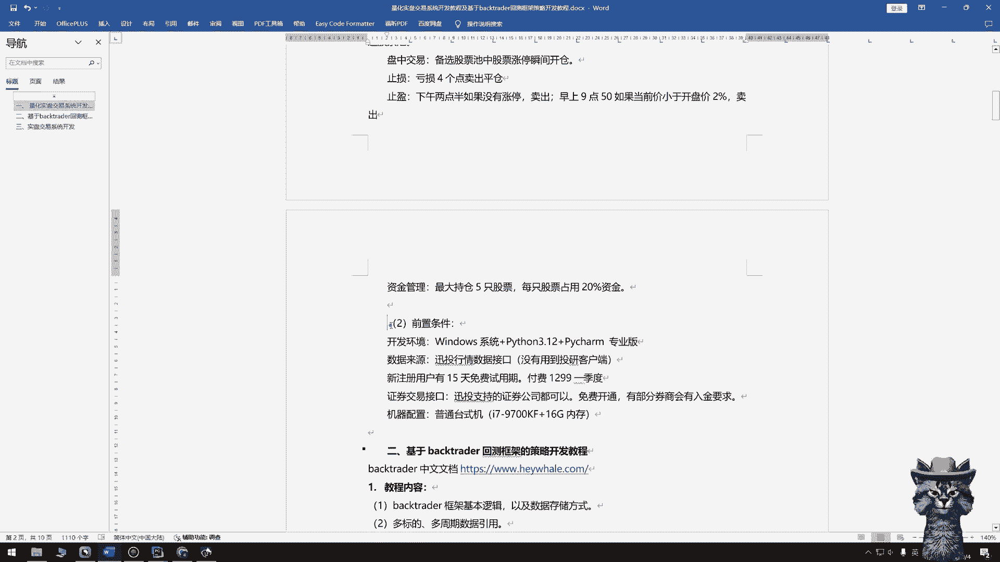

唯一付费的呢就是在这个数据接口，这是这个交易系统的开发的内容嗯。

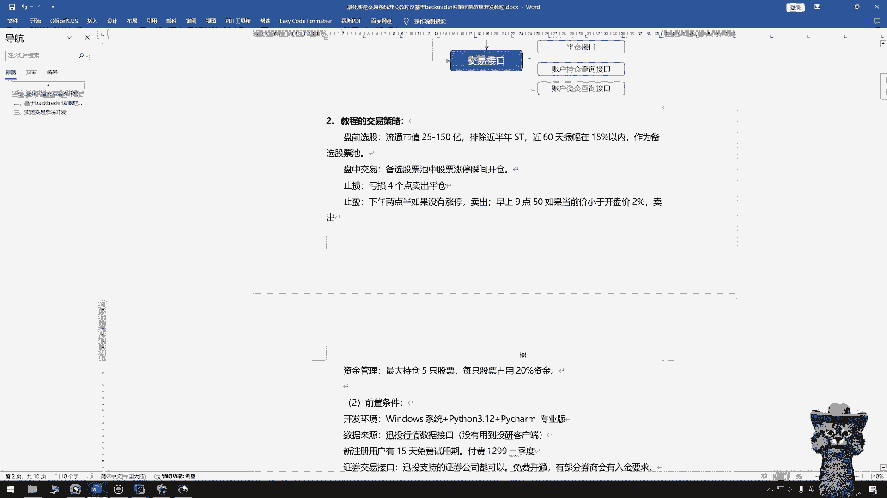

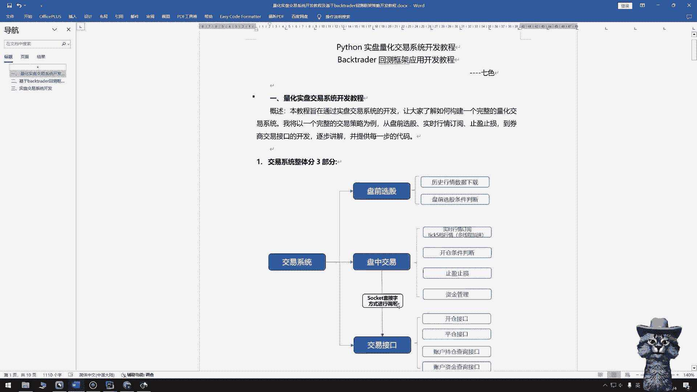

嗯下面我再说一下BACKTRADER，这个回测框架的一个开发的内容和要求。

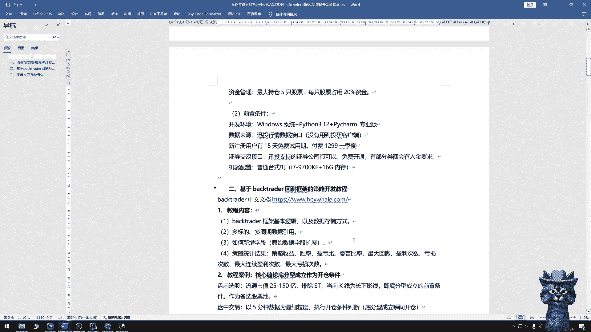

开源的框架也有中文的文档，大家也可以上去先看一下，然后这个教程的内容呢主要是有主要是四部分，第一个呢我会讲一下，白格trader这个框架的一个基本逻辑，也主要是他这个数据存储的方式啊。

呃因为我们只有比较好的去了解，它是怎么去存储这个数据的，才能够去呃调用数据的时候，去做我们策略开发的时候，那才能避免一些比如说对未来数据的一些应用，那第二个呢是对多标的，多周期数据的一个应用呃。

因为在他的这个文档里面，基本上都是单标的，单周期的数据的一个案例的讲解呃，我们怎么去对，比如说几千只股票，然后在日线上，分钟线上的数据怎么去使用，然后我这里会在这个教程里面。

会会会穿插的讲到第三个呢是怎么新增字段，因为它原始的默认的字段呢只有讲开盘价，收盘价最高最低交易一量啊，这些比较常用的字段我们怎么去新增呃，新增一些字的一个呢，是怎么去统计这个策略的这个结果啊。

比如说它的收益啊，胜率啊，盈亏比下普比率最大回撤盈利次数，亏损次数这种啊。

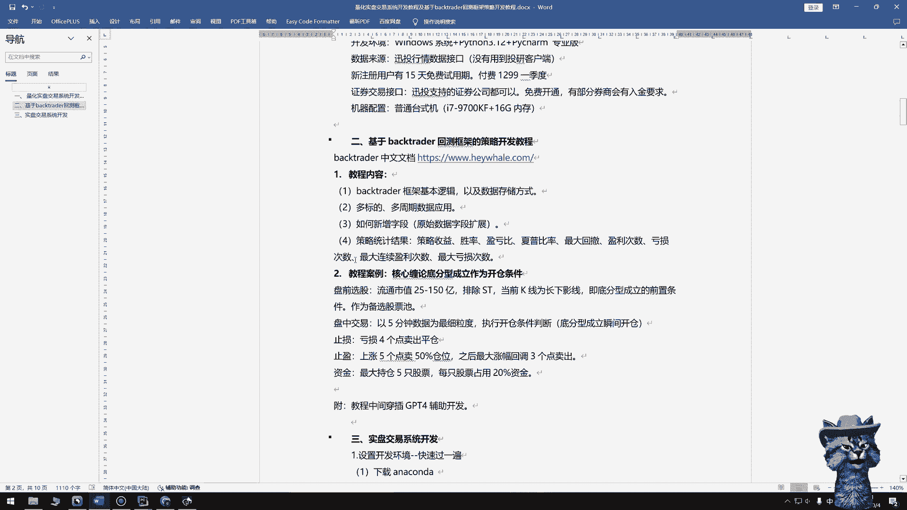

当然它有自己的一个模块去做这一块，这一部分的事情，我这边也准备了一个案例，去做整个教程的开发呃，案例的这个核心呃，是我不知道大家有没有听说过缠论呃，就是以它底分型成立的时候，去作为一个开仓条件啊。

这个后面我也会大概讲一下这个底分型是什么，嗯整个叫整个案例呢也是分为了盘前选股，盘中交易止盈止损和资金管理这一部分呃，盘前选股呢有流动市值的一个选择，也是排除了s st的股票呃，以当前K线为长下影线。

因为当前K线为长，下影线是底分型成立的一个前置条件，所以我们在盘前的时候就把它判断出来了，判断完之后呢，这些会作为我们的一个备选股票池，然后放到这个盘中交易里面去，盘中交易，我现在这个回额。

选取的是以一个5分钟力度的数据，止损是亏损四个点啊，卖出平仓止盈，我这边是做了一个移动止盈的一个方方法呃，上涨五个点卖，卖出50%的仓位，日后最大回调三个点也会卖出，资金管理，这这一部分也比较简单。

最大持仓五只股票，每只股票占20%的资金嗯。

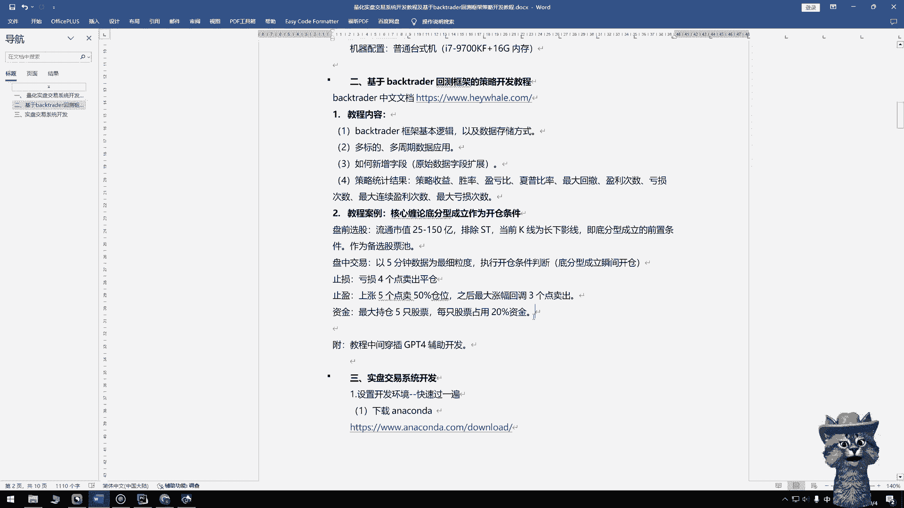