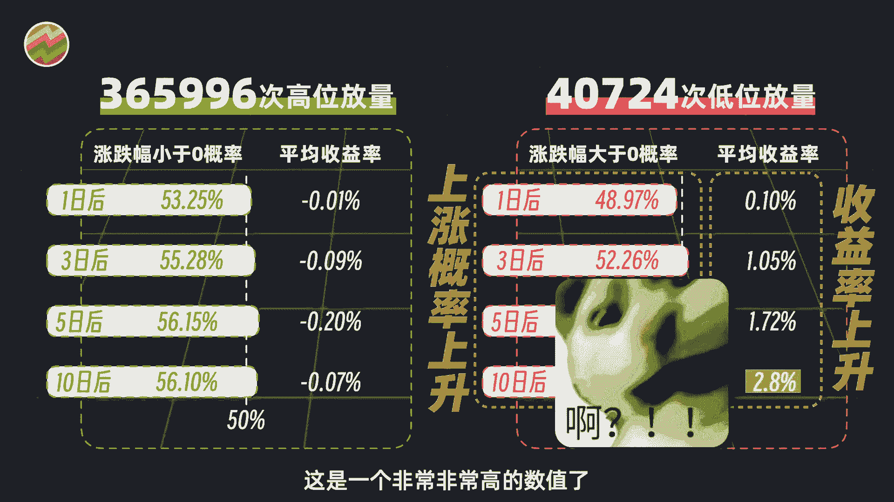
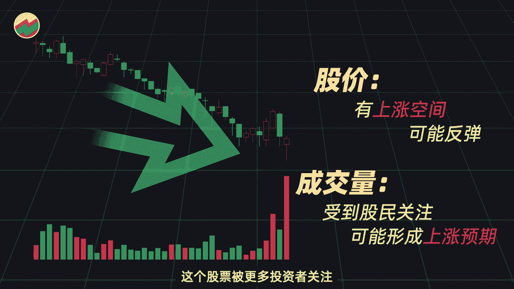
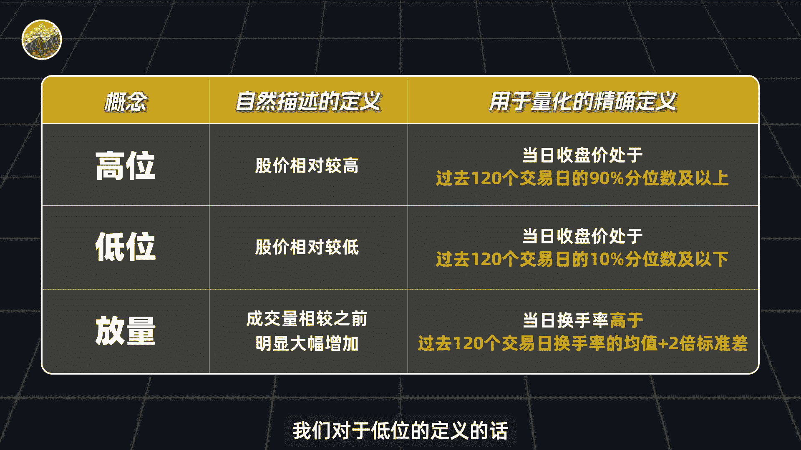
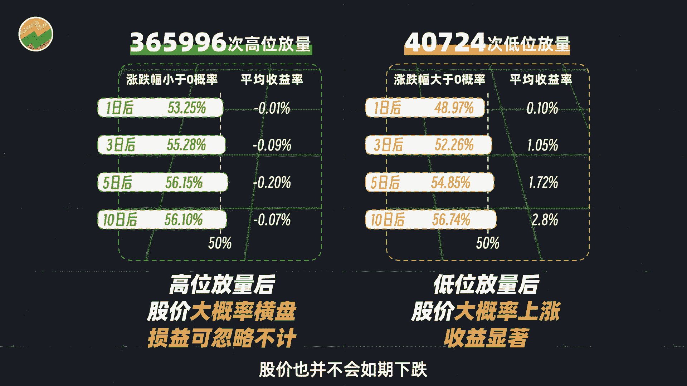
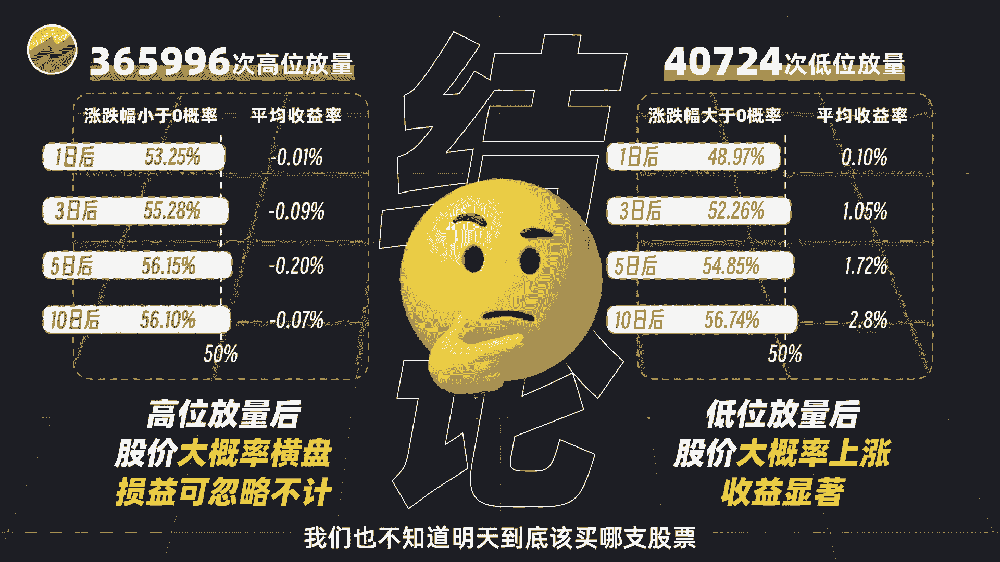
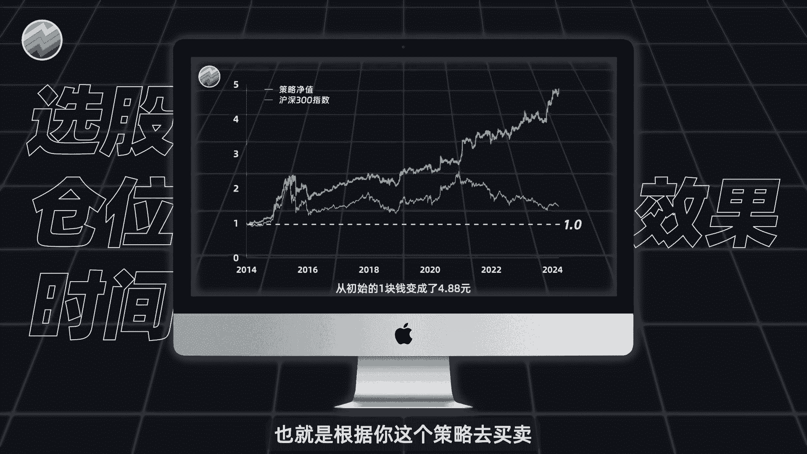
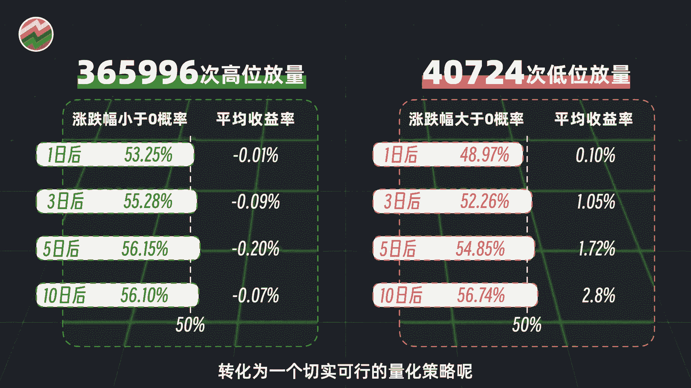

# python量化成交量， 股票什么时候放量会上涨？【量化交易邢不行啊】 - P1 - 量化交易邢不行啊 - BV1p7c7eEES5

大家好。

我是专注于量化投资的，行不行，关注我科学投资，不盲目，从2007年至今，A股历史上共出现了37万次，高位的放量和4万次低位的放量，看来我们大A放量还还集中在高位啊，可能更容易跳水吧，出现高位放量。

一天三天，五天，十天之后，股价未来下跌的概率都显著大于50%，最少也有53%，反过来说，也就是未来上涨的概率，50%都没有到，不要小看这个概率啊，你要知道在赌场上面，庄家针对你的优势可能也就只有51%。

52，但是人家已经可以赚的盆满钵满，比较可惜的是呢，高位放量后的平均涨幅虽然都是负数，但都比较低，可以忽略不计，这更像是在高位放量之后，股价开始横盘震荡，而不是下跌，我们再来看低位放量。

发生在低位放量后，我们预期股价是会上涨，数据统计结果呢也确实是如此，低位放量之后的一天，三天，五天和十天涨跌幅呢大于零的概率在稳步上升，平均收益率也是同样如此啊，十天之后的平均收益率居然高达2。8%。

这是一个非非常非常高的数值了。

要是每十天都能有赚这么多的机会，那我们一年就可以实现资金的翻倍了，但其实反过来想一想，既然价格已经在相对低位了，那么买入后再度下跌的幅度也不会太大，反而有更多的上涨空间，再结合放量这一条件。

很可能也说明了这个股票被更多投资者关注。

反而可能形成一致性的上涨预期，并且啊，如果你仔细观察我们对于低位的定义的话。

应该可以发现，其实低位放量更多的会出现在熊市和震荡市里，那是不是意味着这个指标如果构成策略的话，会更适合下跌行情，甚至会让我们在熊市中更有机会获得正收益呢，更有甚者是否可以精准找到牛市的起点呢。

这些都是值得我们去研究的方向好，那么至此呢我们可以发现啊，低位放量之后，股价确实是会上涨，并且收益还是很不错的，高位放量之后呢，股价也并不会如期下跌。

反而会出现盘整的趋势，然后呢，我们这次展示的只是低位放量和，股价确实会上涨这样一个结论，但即使有了这个结论呢，我们也不知道明天到底该买哪只股票。

这个呢就只是一个结论，它并不是一个量化策略，因为我们量化策略呢需要非常精确的告诉你。

明天需要买多少股票，占你多少仓位，以及什么时候卖出，也就是有一个非常清晰的可执行的策略，最后我们还可以得到一条资金曲线，也就是根据你这个策略去买卖。

到底会赚多少或者亏多少，如何把我们这个结论转化为一个，切实可行的量化策略呢。

时间关系啊，我们就要放到下期视频来讲了，我是专注量化投资的，行不行，关注我科学投资。

