# python量化股票放量现象，妙用成交量精准构建买卖点【量化交易邢不行啊】 - P1 - 量化交易邢不行啊 - BV1pEc7emED6

大家好。

我是专注于量化投资的，行不行，关注我科学投资，不盲目如去定义低位高位以及放量。

有人说这很简单啊，比如说这个图里面我一眼就能知道他在高位，并且这个是放量合起来呢。

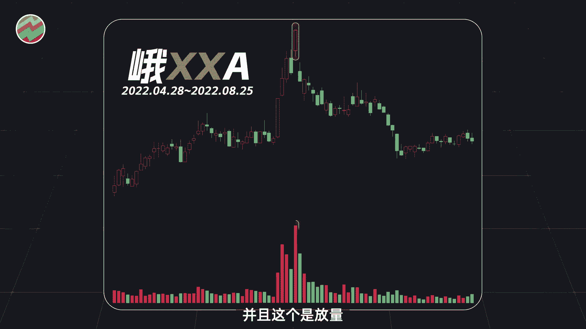

这就是高位放量无疑了，但是啊我们不可能自己用肉眼，一个一个股票去判断。

这根本不现实，我们肯定得编程，让计算机帮我们去寻找，那么这个时候呢，我们就需要把我们之前对低位，高位放量的自然语言描述的定义，一个非常不精确的定义，转化成我们计算机可以理解的一个数学定义。

或者说是程序定义它必须得非常的精确。

比如说我们这里低位放量的概念当中，股价在什么位置上才算低位呢，成交量要做多大才算放量呢，这些话我们人脑可能看图会比较容易理解，但计算机是理解不了的。

它只能理解一行一行的代码以及明确的规则，也就是说，我们需要把一些模棱两可的所谓的经验，设计成一个有精确买卖点的策略，这一步一般来说会难倒很多人。

此时呢你也可以暂停一下视频，想想如果是你的话，你会怎么去做，然后呢和我们之后要讲的方法去对比一下。

看看哪个好哪个坏，这样呢可能对你有更大的启发好，那我们接下来呢就首先来定义什么是低位。

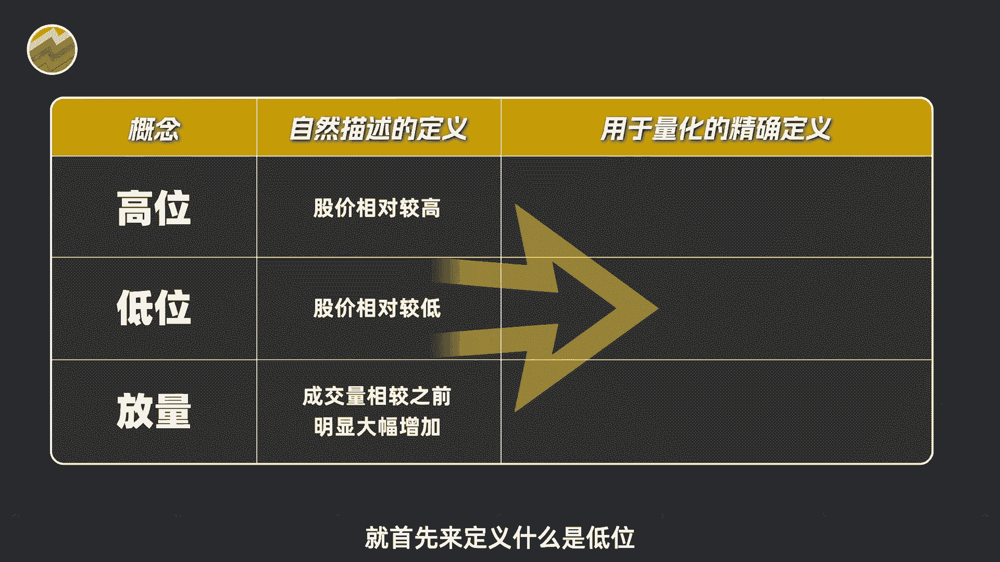

什么是高位，假设我们每天都把过去120天的收盘价，从大到小进行排序，只要当天的收盘价呢能够排名在前10%，我们就认为这一天处于高位。

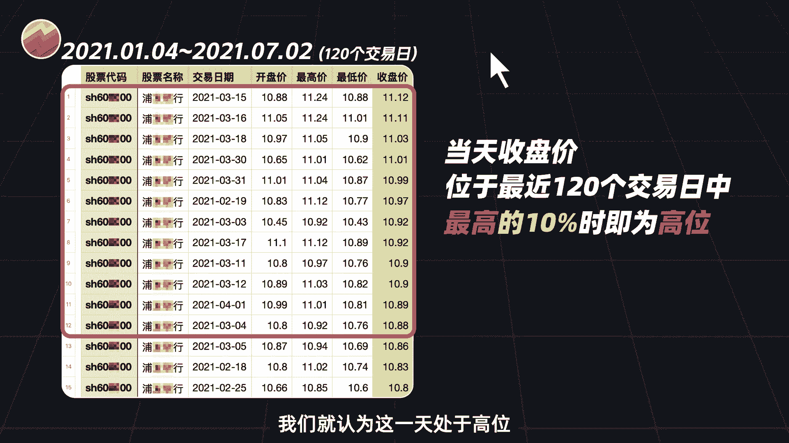

如果排名后10%呢，就认为这一天是处于低位，其实啊，就是把当天的价格和过去120天的价格。

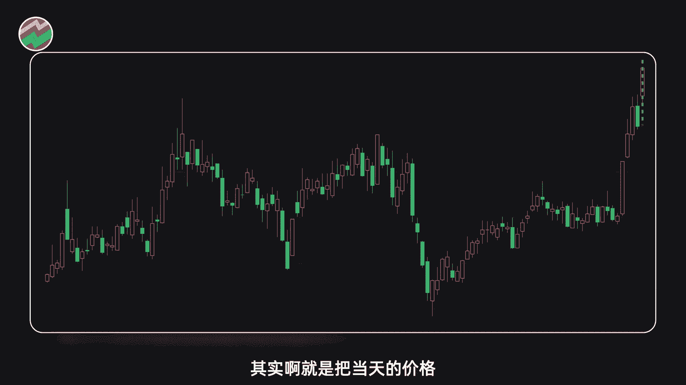

进行一些比较，看一下我当天价格在过去120天当中。

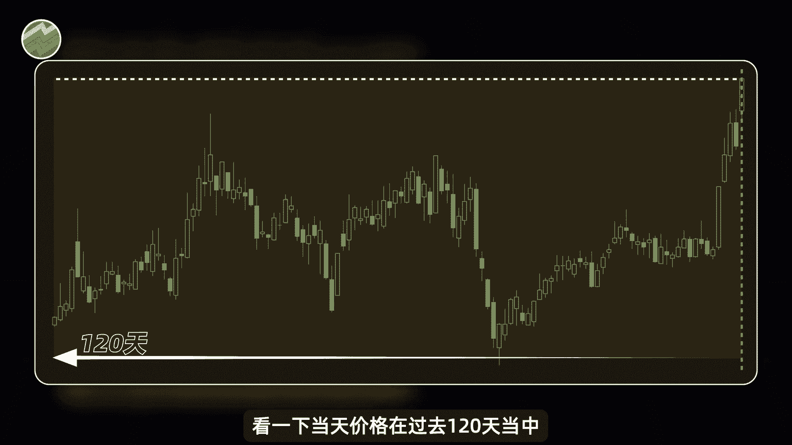

处于什么位置，通过这个位置来判断目前处于高位还是低位，当然啊这个只是我们自己做的一个定义，你可以按照你的想法去定义，比如说你可以要求当天的股价，必须是过去120天当中最高的位置。

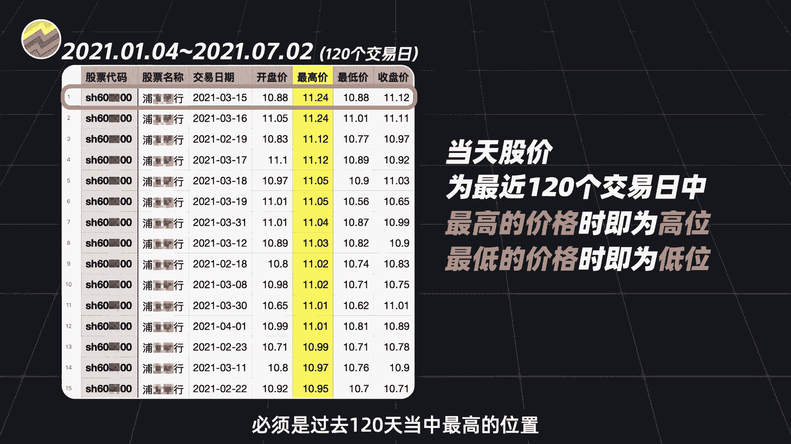

才能算作高位，这样也是可以的，本期视频中呢，就用我们之前给出的方案来寻找高位和低位，那放量又该如何定义呢，我们之前的视频呢，用标准对成交量放量做出过定义，感兴趣的可以去看一看。

本期视频呢给大家介绍一种新的定义方式。

我们首先呢把成交量转换成换手率，换手率的定义很简单啊，就是拿这段时间的成交量除以它的流通股数，得到的一个比率，比如说今天的换手率是3%，那么说明今天有3%的流通股被交易了，换手率越高啊。

说明这个股票交易越活跃，流动性越强，接下来呢我们就针对换手率指标来研究放量。

然后呢交易经验丰富的，你们肯定也知道一个经典的技术指标布林带。

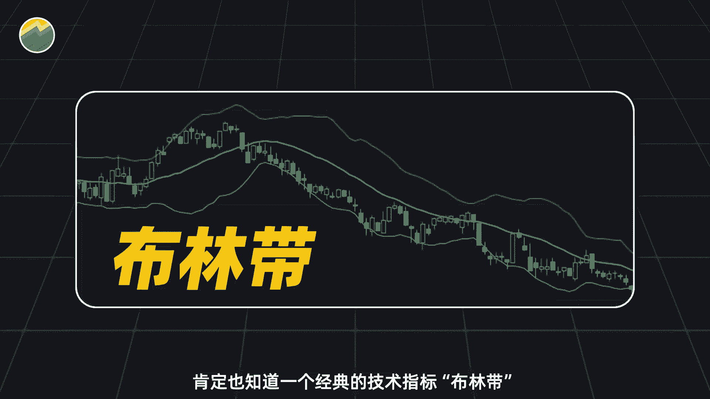

它的计算公式呢是这样的，我们呢就借鉴一下他的公式。

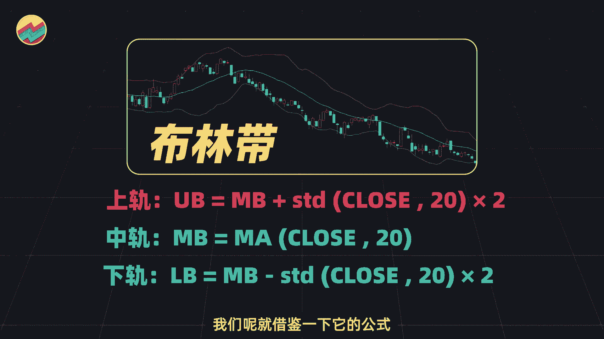

只不过呢我们把其中的收盘价替换为，我们前面提到的换手率，我们的换手率也有了条所谓的上轨，和布林弹一样啊，只要我们当天的换手率高于这个上轨，也就是过去100天换手率的均值，加上两倍标准差的时候。

我们就认为今天放量了，我再次强调一下。

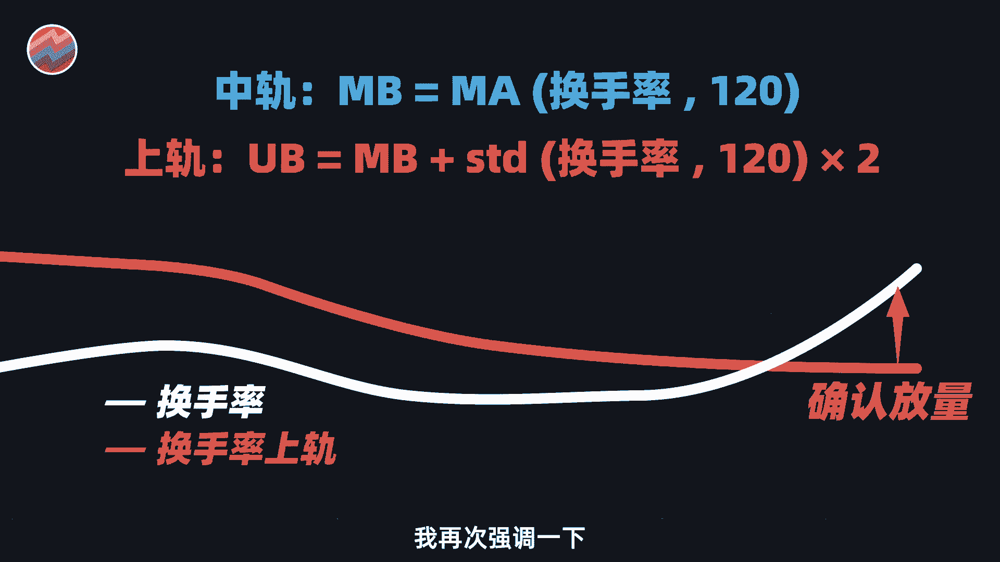

这个关于放量的量化定义是见仁见智的，不同的人会有不同的方法，我们自己也会用好多种方法，大家也可以用自己的方法来定义放量，比如说你也可以尝试一些更简单的方法，看一下过去120天的成交量当中。

今天的成交量是否能够排进前十呢，如果能够排进去。

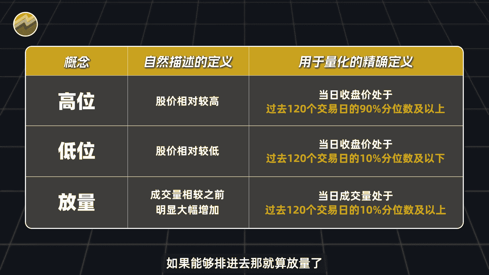

那就算放量了，诸如此类方法都是可以的，以上的这些定义呢，我们其实也已经写好了相应的代码。

供你去做测试，你当然也可以在评论区留言，问我要了数据和代码之后，去尝试的定义你自己的高位放量和低位放量。

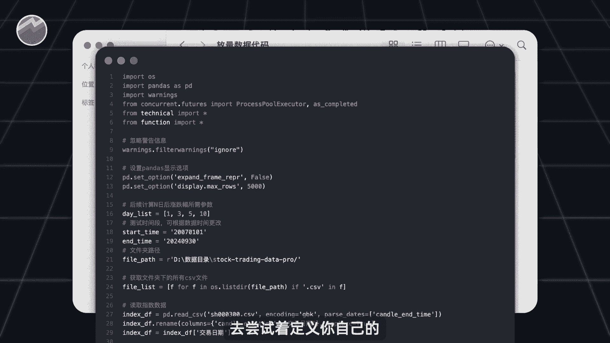

测试一下它们的效果好，那么不管怎么说啊，我们对高位放量和低位方呢，都做出了量化的定义，你可以看到我们把完全自然语言化的描述。

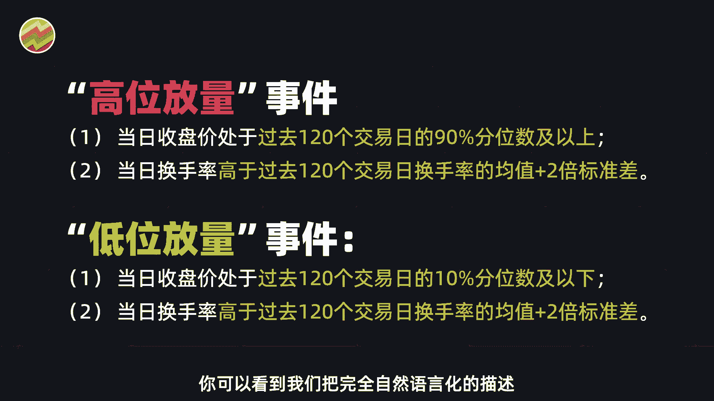

变成了非常精确的规则，通过这些规则啊，任何人都可以精确的找到。

高位放量和低位放量的位置，没有半分的差错，也没有半分的模棱两可，接下来呢我们就可以借助全部的A股历史数据，和Python代码，来找出历史上所有低位放量和高位放量的位置。

然后呢去看一下放量之后，这些股票的表现到底如何，我是行不行，关注我。

