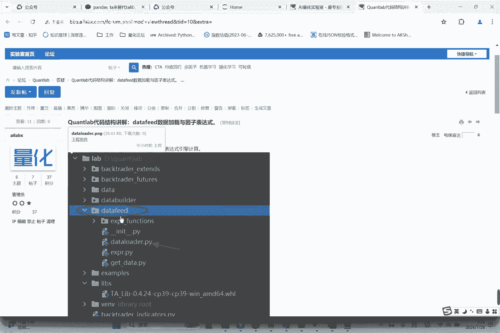
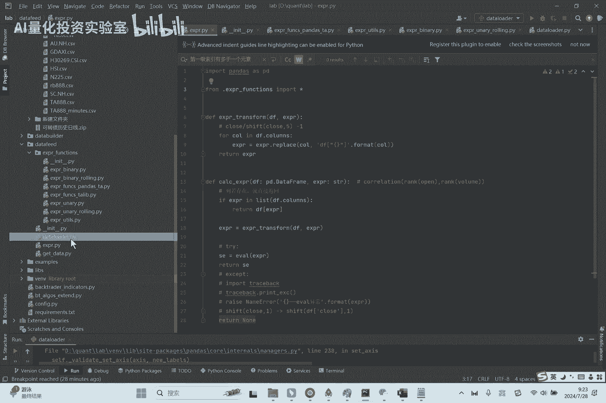
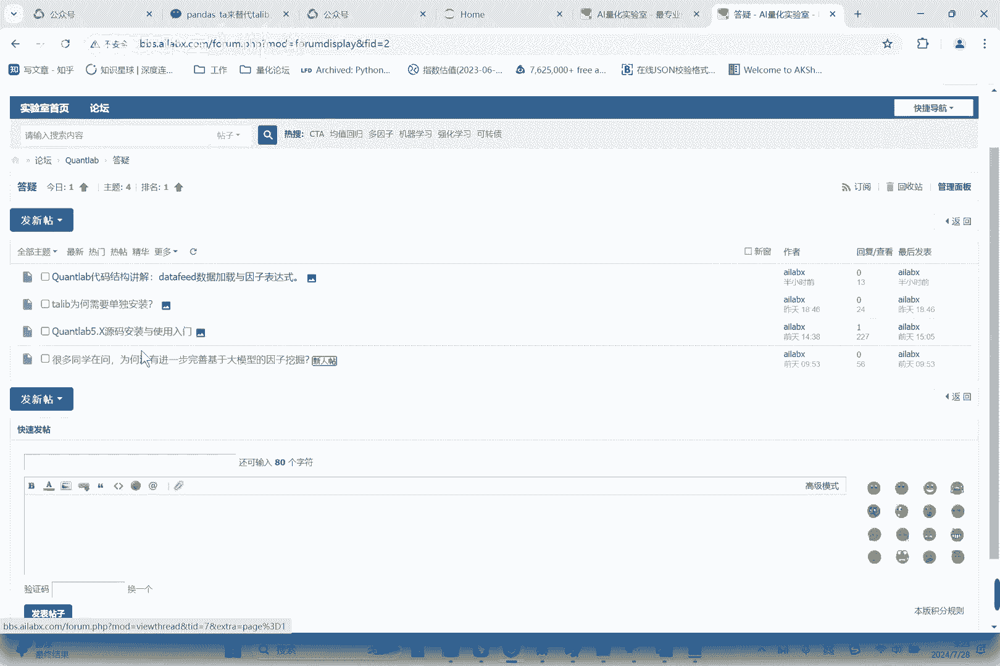
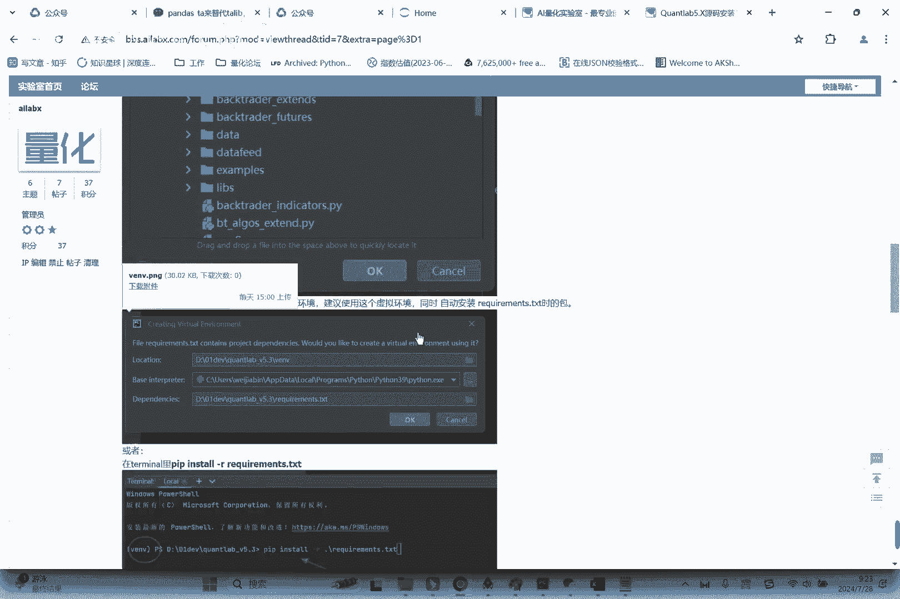
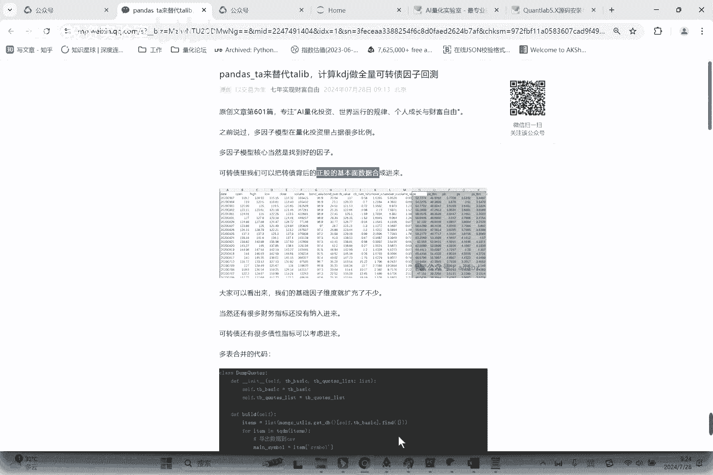
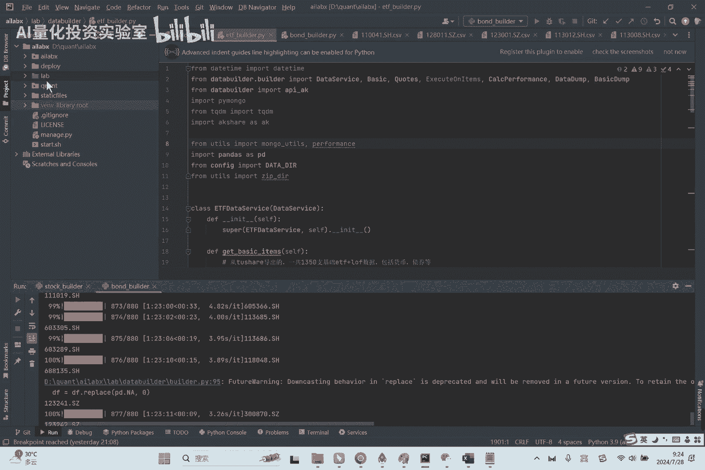

# quantab代码结构讲解之因子表达式 - P1 - AI量化投资实验室 - BV18tvHeoEm2

好各位同学大家好啊，咱们今天继续来分享量化投资啊，昨天在群里有同学问起，就是说想怎么样快速的复习咱们的框架，life的代码啊，尤其是昨天问了因子表达式相关的东西。

比如说我们写个一个ROC20l c clock，20是怎么怎么计算出来的，呃所以我今天就结合的代码结构来说一下呃，目录在这lab跟目录下面有个data fait。

咱们直接看代码，data fit这这一块就是数据加载，data loader是总体数据加载的一个入口哈，数据加载，咱们现在是使用那个CSV，从本地目录去加载数据，本地目录去加载数据，这个就比较简单了。

就是嗯咱们把这个data目录下，比如说你cos就这些，比如说这一个个指数数据，CSV这种数据嘛对吧，结构都是一样的，一个个CSV读进来就是一个data frame，这个比较简单了。

然后呢把它合并合并成一个，你一个个CSV读进来，然后pk的就是联合起来，然后做一些呃时间范围的筛选啊，这个索引转这个日期啊，然后索引的设置啊，日期范围啊对，然后进行排序就OK了，所以这一步是比较简单的。

最重要的是，下面这一步就是大家可能不好理解的一个点，是叫计算表达式啊，就我今天刚实现的，这是后面要说的这KDJ怎么算的啊，就是你你我们可以这么写啊，你这里可以多个表达式对吧，然后你这里是写他的名。

就是你自己起的名，就这变无所谓，只要ROC20就行对，这个函数是我们可以任意自定义的，你可以叫记叫因子函数，这个就是字段对吧，Hio clothes，就是你的data里的字段。

就相当于我们引用了你这个序列而已，Hello，Close，你可以用volume，只要你这个表里有的都可以，别人这里你就可以用turn over对吧，这个是你自己知道的，你自己加载任何数据。

只要是有原始数据都可以，amount都可以好继续回到这里来，这个计算表达式，他的逻辑其实也很简单，我当然是循环你所有的这些组嘛，然后一个个算，那它的计算，其中某一个这个计算表达式在这也非常简单。

最重要的在这evil其实就一行函数，什么意思呢，我可以把你这个文字的表达式，evil的意思就是用用用把这个文字的表达式，当成这个呃函数来执行，那这个时候呢。

我需要引用你的那个本地的global和local，空间里的变量，我怎么知道它是那个常数呢，在这啊，我们import新，所以大家可能没有看到显示的import啊，这里就是相当于我。

因为因为你未来你会自己添加很多的这种，自定义的函数，如果你要一个import，那就非常麻烦，所以我import exp l functions，import新，其实相当于import它的INIT。

在INIT里我又导入了所有的这种这几个文件呃，这个什么意思呢，binary2元的一元的UNERARY，然后呢binary的LOING2元滑动，UNERARY的LOING1元滑动，什么意思。

一元就是一个变量嘛对吧，我在你的一个序列上，通常这个是收盘价啊，收盘价做20天的这个回溯的收益率，回看收益率它是一个滑动的嘛，所以它是lonely嘛，shift就是个LONING函数。

对他经常有一个loading，就是我们叫滑动窗口的一个概念，对binary loading，就是比如像你要计算两个序列的相关性对吧，两个序列的相关性，那这个时候就用的binary对。

这只是起了个名而已嗯，然后我们今天还导入了我们之前用ti lab，大家发现说ti lab安装很你比较困难，所以用pandas tr lab来替代对吧，KDJ其实它是三元的。

他要传入high low close，当然还有其他一些参数，我使用默认的，然后调用了函数之后，我会返回它的序列给到他，对嗯。

这里有两个宏定义叫care about simple跟care by date，因为咱们是整个嗯，你有多个symbol的这种data frame嘛，所以你care by symbol。

相当于是我这里做了一个good bye，就是goodbye是在统一做的，所以你看每一个函数上面都会有，绝大部分都是here by symbol嘛，就是每个symbol是单独算的嘛。

有极个别的别的像rank就是排序，还要截面排序，那就得carby date，就是按日期来来group by，然后再来计算你这个函数嘛是吧，这个好理解，理解了，这个就理解了整个因子表达式的计算了哈。

对理解经济表达式计算，对这里我刚才讲的过程，在这个论坛里我都贴出来了，对就答疑，就大家如果遇到问题啊，可以先到这里来看看，先到这里来看看，包括ker lab源码怎么安装。

怎么使用啊，我做了基本上是手把手的一个使用教程哈。

使用教程怎么来调试这个策略之类的对嗯，然后另外一点呢就咱们还在做了这个嗯，数据的，就是我们把转债，要把正股的基本面已经整合进来了，这个数据基本上我看到都已经已经合并完了。

有后续会分享给大家。

对这个数据就相当于是转载的数据，加上了它背后的正股的基本面的数据，比如说PE啊，P s，所以我们明天就可以用PE或者PB啊，因为很多研报里说了，科朗债可以用PE是一个就是正骨的，PE是一个很好的因子。

我们明天就可以来回测一下，来回测一下，然后还有很多同学说不知道，是因为有些同学不了解知识星球哈，就大家看每篇文章，我有时候会带一个，这是个优惠券，大家如果有兴趣可以扫码加入。

或者每天我都会带着这这一篇的介绍啊，这篇的介绍里是由咱们知识星球，常就是常用的这个二维码或者介绍都在这呢，嗯好今天的分享。

今天的分享就到这里。