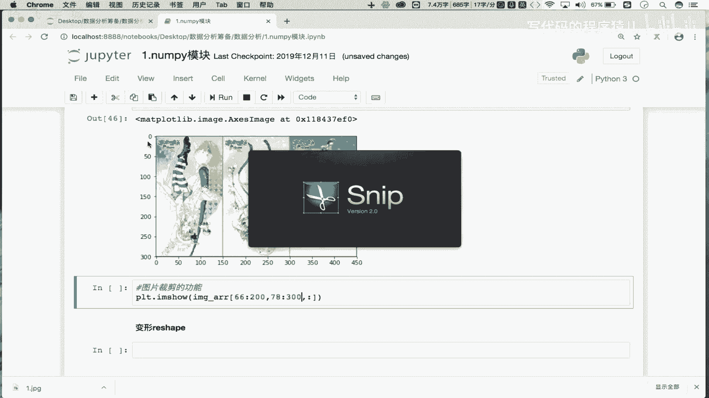
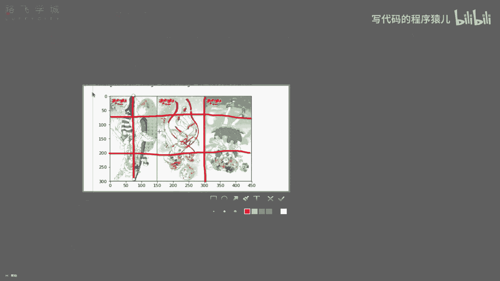
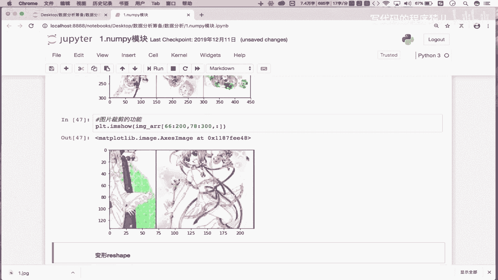

# 【2024新版--5天拿下Python金融量化+股票分析+数据清洗+可视化从入门到实战】100集（全）附视频课件 资料 代码等等 - P6：05 numpy炸天之索引和切片 - 写代码的程序猿儿 - BV1Q7SdYkEhS

那么接下来的话，咱们来看一下NIKE的索引跟切片的一个操作啊，那首先这个NIKE的索引和切片，是咱们整个NIKE模块当中的一个重点内容，OK吧，大家一定要仔细的去理解和仔细的去听。

那首先我们知道这个索引跟切片，咱们之前在列表里边是不是已经用过了对吧，已经用过了，那我们说这个索引和切片是可以帮助我们去呃，取得我们的数组或者列表，这样的一些个容器当中任意的数据吧对吧。

那么在我们的这个nip模块当中，它的索引和切片更加的灵活，那怎么去用呢，我们依次来看，首先先看一下索引操作啊，那么nip数组索引操作跟我们数组啊，跟我们这个列表索引操作是一样的啊，nip模块对吧。

它的索引操作跟我们列表索引操作是一样的，比如说咱们在这的话，先有一个error吧是吧，array啊，创建一个这个NP数组，我们用一下random，第2random int，我们先创建一个单位数组。

从1~100size给他一个啊，五行六列可以吧，好在这先打印一下error，这是一个五行六列的一个nip数组是吧，那它的索引怎么用呢，error中括号一对吧，那这我取的是什么呢是吧。

取的是不是数组当中的第一个数组元素啊，那谁是数组当中的第一个数组元素呢，是不是列表套列表的第一个列表啊，就他吧是不是第一行对吧，那这块我们就通过索引取出了什么呢，取出那nip数组中的第呃。

这个这个下标为一的行数据吧，是不是呢，这取的是不是单行啊是吧，那想取多行怎么办，你看在这我写一个一三，OK吧走这返回的是不取出来，下标为一，下标为三，下标为四，这三行数据啊，就是取出什么呢，多行对吧。

那这个就是我们的nip数组的索引操作，它跟列表是不是一模一样啊，对吧，是一样啊，重点是看他的切片操作，OK吧，切片，那首先切片怎么切呢，首先在这看一下第一个需求，我们想切出谁呢。

切出error数组的这个前两，行的数据吧，先量行的数据啊，那这块的话怎么去切呢，首先error是吧，这是我们原始的数据吧是吧，切出它的前两行中括号这里边就放切片呗，零冒号二走，这切的是不是前两行对吧。

所以说我们这个error中框里边放的，是不是我们的行切片对吧，就可以切出指定的行，那想切裂怎么办呢，好在这看一下系数，切出error数组中，的前，两列吧，这个怎么玩呢，error中号，这写一个零冒号。

二一定切的是行啊，你想切列怎么办，在这加一个逗号，OK吧，好试一下走，这切的是不是前两列，OK吧，那这个逗号啥意思呢，我们会发现error中括号逗号左边是什么呢，左边需要放行切片，右边放列切片。

那现在你看行切片我切了吗，没切吧，这只对列进行了一个切分呢，所以在这是不是切出了前两列啊，对不对，好，很有意思，是不是啊，那在这前两行跟前两列我们都切了吧，那第三个需求切出前两行的前两列。

那这个就毋庸置疑了吧对吧，还是使用我们逗号的机制吧，error中括号是零冒号，二是前两行逗号，零冒号，二是前两列走，是不是前两行的写两列啊，对吧好，那接下来看一下反转，那如何将数组进行一个反转的。

什么叫反转，看一下我们原始的数据是不是长这个样子的，反转，就是说我们可以将所有的数组元素，进行一个倒叙啊，比如说你看88是最后一个元素吧，69是不是第一个元素啊，那到这之后是不是69成最后一个了。

88是不是最低一个了，对不对，当然我们也可以让指定的行和指定的列倒置，比如说在这我们先提一个需求，这个将数组的什么呢，行倒置啊，将数组的行倒置怎么倒置呢，中括号这里边写一个冒号，冒号一，那这种形式走。

你看一下是不是将我们的行到这了，原始的数据看一下是不是这样的呀，我六十九七十三十七是不是第一第一列，第一列吧啊然后呢我这是现在看一下，现在看一下啊，我们在这啊，我们是将行到这是吧，这个是不是第一行。

六十九八是不是第一行，现在六十九八是成成最后一行了，原来五十四六十三最后一行吧，它是不是成第一行了对吧，这是将我们的行道置能将行到制，是不是也能将列到值啊对吧，将数组的列倒置列倒置怎么玩呢。

error中括号好，再加上逗号是吧，逗号左边是行行到这吗，不倒置列到这么倒置冒号冒号一好，这表示数叫列到这走，看下下，现在你看是不是44，34，是不是最后一列，现在是变成第一列了对吧，列导致。

然后呢还可以将整个的元素导致，所有元素倒置，那所有元素倒置不就是行列都到这吗是吧，就是冒号冒号一逗号冒号冒号一走，你那现在所有的元素都到这了吧对吧，原来69是第一个元素，现在88乘第一个元素了吧。

OK吧，这个是我们切片实现的数组的行列，包括元素的一个倒置吧对吧，那么导致你会了之后呢，我们来看一个呃具体的一个效果吧，比如说在这，我们能不能将一张图片进行上下左右的反转呢，可以对吧，可以怎么可以呢。

好在这我们看一下啊，将一张图片进行什么的进行这个左右反转吧，那首先我得先有一张图片啊对吧，比如说image杠error等于PLT是不是matt pack lip啊，D i m read。

是不是read哈，这读取的是当前目录下，有一个叫做一点JPG的一张图片，是不是好，我们先显示一下原始图片呗，IMSHEMAZARA好，这个是我们显示的原始图片吧对吧，并没有对其进行一个倒置吧对吧。

那我们怎么对它进行一个倒置呢，OK啊在这我们就进行一个倒置的工作，那倒置的话，是不是对我们的图片进行一个什么呢，进行一个这个左右翻转啊对吧，左右翻转跟你说，应该是对行倒置还是对列倒置呢。

你想看看我鼠标这是不是一行一行一行，如果行倒置的话，不就是说让图片上下翻转吗，是不是列倒置才是对图片左右反转啊，对不对，那咱们就来试一下啊，那怎么玩呢，PLT点r i m show。

还是对图片进行一个展示吧对吧，那只不过展示的不是我们原始的image error，这样的一个数组了吧，我们需要对其进行一个反转，那首先你要知道这块的image error，点sheep。

看一下它的形状是不是三维啊，是不是三维啊对吧，那三维每一个维度各表示什么意思呢，你看前两个维度表示的是图片的像素，第三个维度表示是图片的颜色，OK吧，那我们只是不想让图片进行一个，这个左右翻转啊。

颜色不变吧，那么意味着你看这个是像素，意味着300是行450，是不是列呀，对不对，那行列是组成我们的一个像素对吧，那所以说啊，所以说在这，我们想要让我们的图片左右反转的话，就是说让我们的列反转吧。

那300是行450列吧，好冒号对吧，就是行行不用管吧，冒号冒号一是不是列导致啊，好第三个维度是不是颜色颜色用管吧，不用管吧对吧，走你看一下图片有没有左右划转，对比一下是不是左右方向啦对吧，所以换成啊。

那所以说在这我们的image error中，括号它的每一个维度各表示是什么呢，各表示行列和颜色吧，我们是不是只能列到这了对吧，到这你是不是可以通过同样的操作，使得我们图片上下翻转，图片上下反转对吧。

还是一样的，PLLT点i m show对吧好对image error，它的行进行冒号冒号一到这吧，列动吗，不动吧，颜色是不是也不动啊对吧走，你看一下是不是上下方转了对吧，上下翻转啊。

那通过图片的一个显示，我们可以更加清晰明了的看见，我们整个反转的一个效果，是不是啊，反转的效果好，那么接下来咱们在这还可以基于我们切片，实现一个什么呢，图片裁剪的功能对吧。

你比如说我想将图片的局部的区域，给它裁剪下来，怎么裁剪试一下啊，比如说在这啊，p LT d r m show对吧，我在这展示的不是PL，不是我们的这个IMAERR原始数据了吧，我需要对其做一个什么呢。

局部数据的捕获吧，比如说在这啊，我就想捕获到什么呢，捕获到将它的什么，将它的这个啊啊你看第一个维度是不是行，第二个维度是不是列，第三个维度是颜色，颜色是不用管啊对吧，不用管就不用切，冒号就不用切呗。

那行想切的话，比如说我在这啊切下行行的话，我就从这个从66切到200可以吧，那列的话，我们就从这个这个78切到一个300K吧，对吧，说对行进行了切片，对列也切片了对吧，颜色没切吧，那对行列切完之后。

我们就可以拿到局部的一组数据了，你看我们行切的话怎么切的呀，等等啊，行我们切分的话是这么切的。

行是从66切到200吧，66是哪啊，大概是这吧，是从这切到200的位置对吧，列怎么切的，列是不是从七十八七到300啊，78是哪，大概是这的位置吧，不切到300，就这的位置，最终咱们切出来的不就是这部。

不就是这部分的内容吗。

对不对，那是不是呢，我们来看一眼吧，看一眼啊，走这样的话，是不是把局部的一些个内容就剪辑出来了对吧，所以说通过咱们的切片，还可以将我们的这个图片进行一个裁剪，OK吧。

这些都是基于咱们的切片跟索引的一个功能，实现的吧，OK吧好，那这块的话各位一定要熟知。

一定要熟知啊。