# 【2024年Python】8小时学会Excel数据分析、挖掘、清洗、可视化从入门到项目实战（完整版）学会可做项目 - P69：02 自定义模块 - Python金角大王Alex1 - BV1gE421V7HF

OK同学们，这一小节咱们来学自定义模块，那之前我们的这个调用都是按模块的导入，都是导入官方自带的是吧，那我们现在自己写一个。

看看能否也能这个实现调用啊，那答案当然是可以了，咱们就来写一个试一下，我在这里创建一个模块叫my first mode好吗，那这个时候我就在这里随便写一个函数，一个函数咱们来验证一下啊，print啊。

我是被调用的，OK然后呢，这个同时为了验证我上节课说的一句话，也就是说只要这个模块一被调用，整个这个模块里的，整个这个文件里的所有代码都会执行所有代码，所以呢怎么验证呢，我就在这里print一个。

哈哈哈是吧，那如果从别的地方调用的时候执行了，这个是不是就代表我说的话没错呀，也就是说一导入就会全部执行啊，当然这个不会这样啊，这个这个你必须要加括号是吧，那我就在这个地方直接直接import。

我们的模块叫my first mode，好吧啊，不要看他这个红色报错啊，只是Python，这个Python就是不知道我们自己写的这个模块啊。

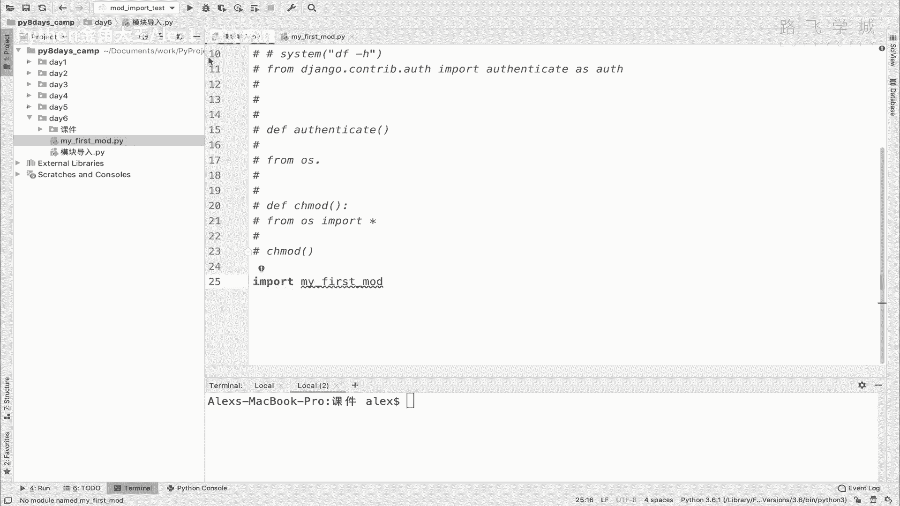

但是我们执行它不会报错的。

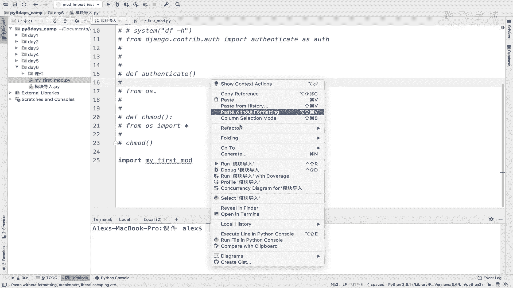

大家看唉我一执行是不是哈哈哈就出来了，这代表着是不是只要1import，相当于其实是执行了这个脚本对吧，就跟我们在这个命令行，直接Python后面跟这个脚本的道理是一样的，是不是相当于Python。

然后my first啊，first mode点PY啊，是不是相当于执行了那么一条命令啊，OK吗，那接下来我再去my first mode这个say hi，大家来看一下。

就可以调用我这个模块下面的所有的啊，这个函数了，是不是每个函数都可以直接这样调用，就跟咱们OS点system是不是一样的一个逻辑啊，啊一样的逻辑好，那这个就是咱们自定义模块很简单啊。

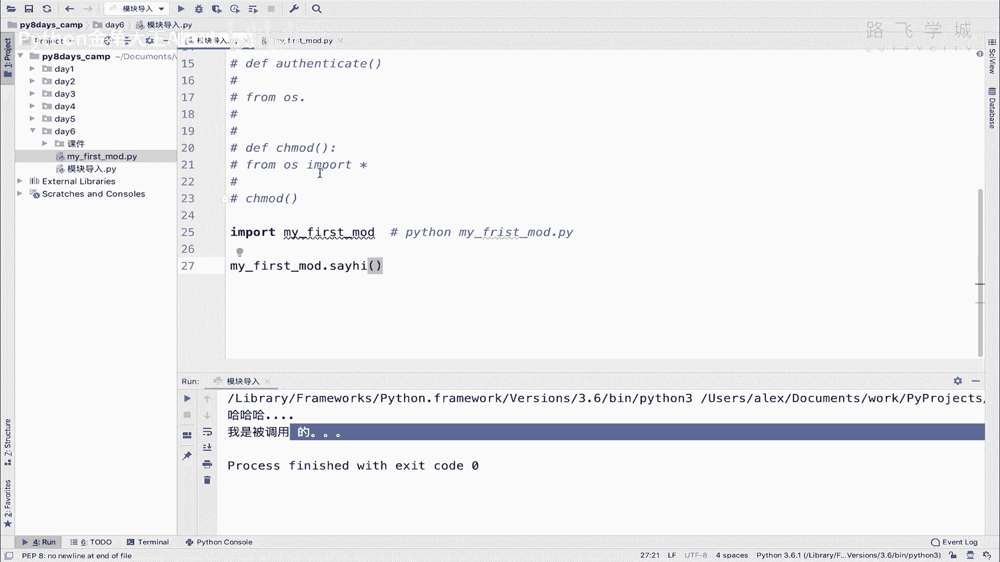

随便写一个文件，它就是一个模块好吗，随便写一个文件进行一个模块。

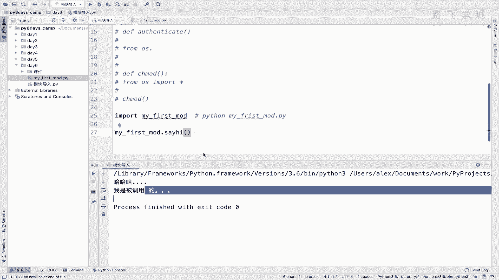

那OK现在我们发现你看啊，我现在这两个文件是在同级目录下对吧，我在执行的时候啊，现在执行也没什么问题，对不对啊，那现在呢我想那现在呢我想诶，他到其他的目录下，我去导入这个模块，是不是也没问题呢。

咱们来试一下，我到我的课件这个目录下，注意了啊，他俩不在同一个目录啊，我到课件目录下啊，这一堆东西啊，你不用管，我创建一个文件，这个文件是啊，这个什么吧啊是是是是是叫model import test。

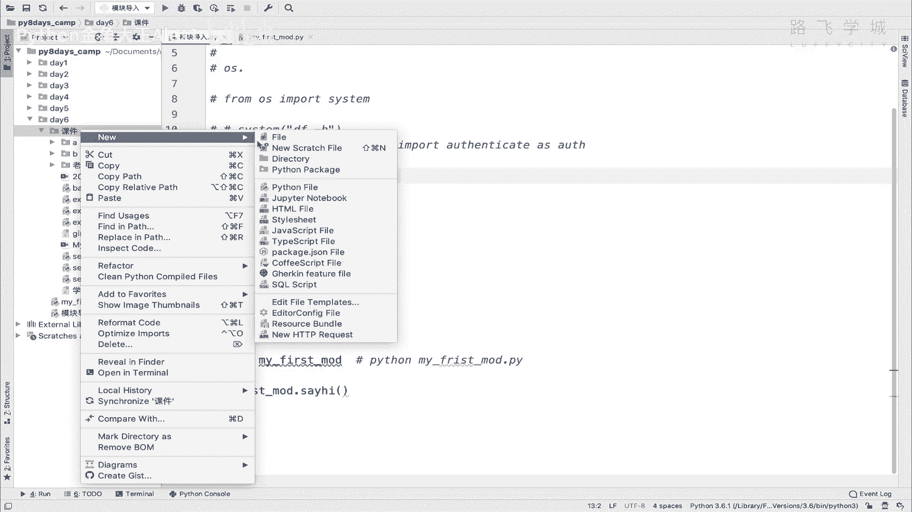

可以吧，然后呢我在这个地方去import这个my first mode，看到没有，哎，相当于现在看着啊，他已经跨目录了，对不对，他这个相当于是对吧，你看不在同一个目录，对不对，这个时候我去导入的话。

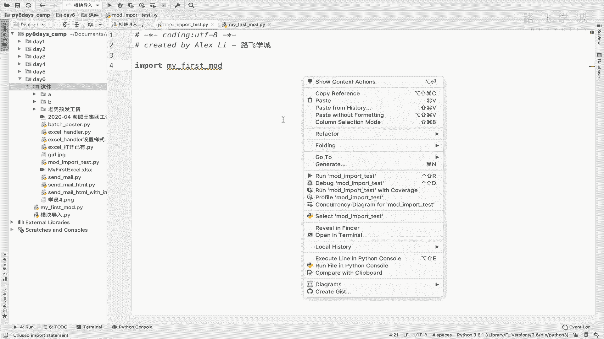

是不是也没有问题啊，也没问题诶，大家发现报错了，报了一个什么错呢，报说这个啊，Module not found，就是模块没找到，说没有找到一个名字为my first model的一个模块，诶。

这个是为什么，怎么说没找到呢，我明明在啊，明明在啊，后缀为什么啊，这个很正常，大家思考一个事儿啊，你看你现在写了这个呃啊这个这个这个模块，然后你就扔在这个位置了啊，扔在这个位置了呢。

那大家知道说它毕竟它就是一个文件，是不是你在这导入，其实Python解释器先要去找这个文件对吧，他找这个文件，那这个你现在在同级目录下，那应该是Python解释器，它有个规则说默认在同级目录下。

我就对吧，就直接能找到了，但是你现在换了目录之后，我告诉你，你的Python解释器是不知道你要导入这个模块，是在哪的对吧，你当然肉眼可以看到说哎他是隔着一层目录。

但是Python解释器可不知道它在哪个地方，所以Python解释器就是嗯就是去找模块的时候，他肯定有一个找的规则啊，肯定有找到规则，就说哎我去哪找去哪找对吧，如果这一堆地方都找得到了，找得到了呢。

我就去给你加载进来，找不到啊，我就扔了，我就报错了，对不对，他不可能说到你执行那么一条命令，他到你这个操作系统所有的目录下找一遍对吧，去找这个文件不可能的，因为那样就太慢了对吧。

那既然在这个windows上或Mac上，你去搜一个文件对吧，他会找很长时间是吧，那你这个一导入他就都去找一遍的话，它就累死了啊，累死了，所以呢他肯定去到固定的一些目录下，路径下去找对吧。

那他怎么去定的这个规则啊，怎么就是确定到哪个目录下去找它，是这个这个这个在Python解释器背后啊，这个规则是在就是规则在哪定的，我们来看一下这个规则就是在这个什么呀，cs pass啊，就是系。

就是Python解释器的一个系统的一个一个变量里，PON解释器的一个系统变量里，在那里存着说模块的查找路径啊，那我怎么去说，把这个模块查找路径的规则看出来呢，大家只是这个时候需要导入一个模块啊。

导入一个官方自带的一个模块叫cs模块，cs模块里面就你可以直接print cs点pass，cs点pass，就是这个什么呀啊，这个模块查找路径它是一个列表的形式，列表的形式咱们执行来看一下。

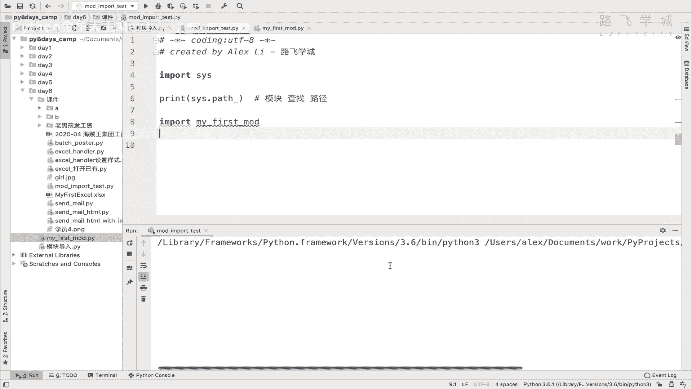

看到没有这一个列表形式，我们把它打印到这里来，给他可以什么呢。

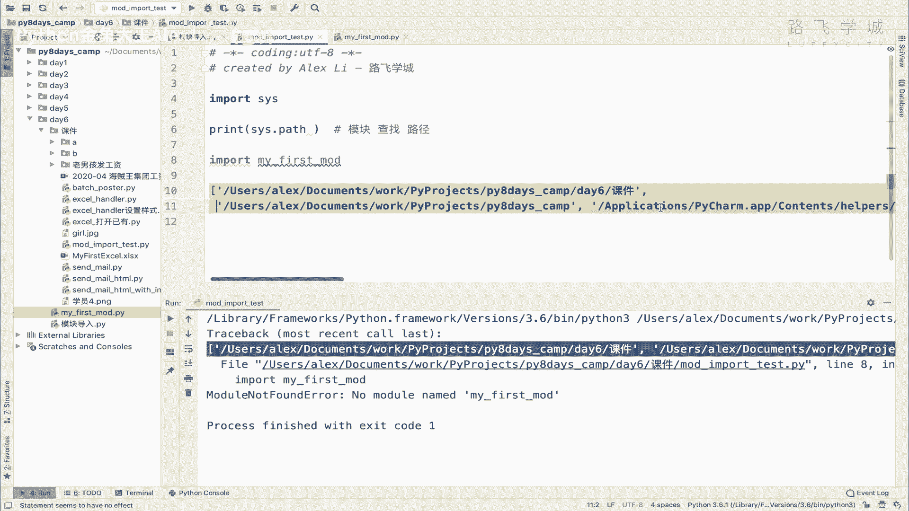

这样啊，大家看你看其实就是一个个的路径，对不对，他就是一个个路径，那我现在告诉你，你导入的任何一个模块，它都会按照这个路径去找，先从就从就是对吧，依次的去找，再如如果在这个路径下找到了。

那我就不会去后面找了，如果这里没有，我就继续找，继续找，继续找，找到最后都没有，我就报这个错，看到没都没有，我就不好意思说对吧，这几个路径里都没有啊啊都没有啊，那你就代表这个模块不存在，明白吗。

所以你如果想让你的这个模块对吧，能在任何一个地方可以导入，在任何一个地方可以随意的导入对吧，那你就得要确保你这个模块在这些路径里面的，至少任意一个里面明白吗，至少在任意一个里面。

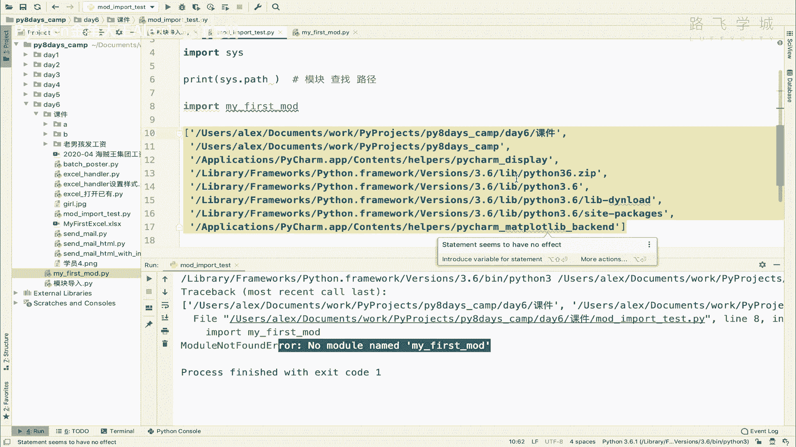

所以呃这个事儿就是那么一个情况，那那问题就来了。

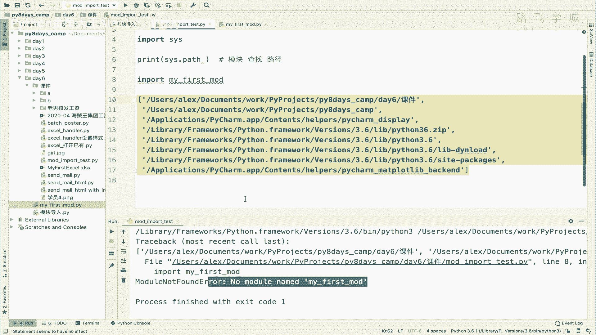

说我我现在我现在这个怎么讲，我现在跨目录，我怎么能让我这个模块能出现在。

我这个模块能出现在这个路径里面呢。

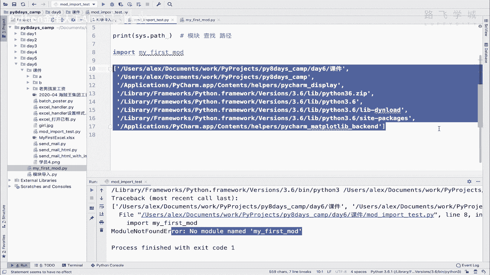

啊怎么能让它出现呢，同志们好，但这个很简单，你是可以修改的，它是个列表，你可以往里面添加啊，那再往里边添加之前，我先可能解答，可能有些同学的一个疑惑，就说哎为什么在同级目录下它就可以导入。

在同一目录下对吧，模块和它对吧，在同一目录下它就可以导入，但是我跨了目录啊不行，那在同级目录下他就不去查找这些路径了吗，同志们在同级目录下的时候，他依然会查找，注意了，看第一条。

第一条大家看这个目录路径啊，是这个什么，到day6下的课件，看到没，到day6下课件，也就是说这个什么呀，同级目录现在你看啊，注意了，看着啊，我现在这个脚本，Sorry。

我现在这个model test对吧，这个脚本所在的目录是在课件这一目录，对不对，然后呢注意了，所以呢它它这里这一条是这一条，就是我这个文件，我这当前这个脚本所在的这个目录，对不对。

所以呢你会发现一个问题，他他就是你好像是说好像是啊。

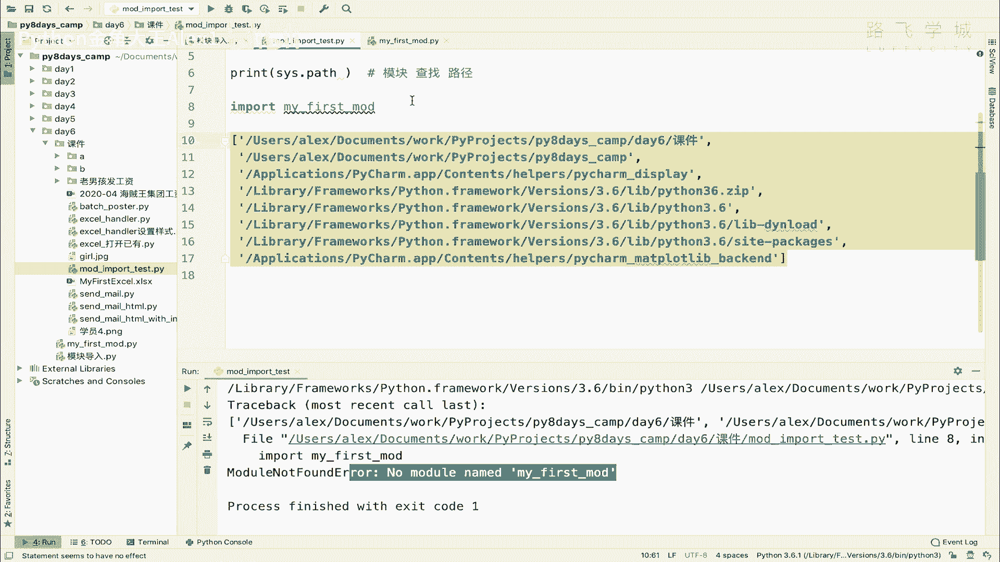

你不确定啊，现在就是说只要我这个脚本，就是我这个文件在哪对吧，在哪个目录，它就是在这个整个的这个环境变量，就是这个列表里查找，列表里就会把我当前这个文件的目录加进去，明白吗，把当前目录的文件加进去。

它就会在同级目录下去找，这也就是说为什么注意的这个是动态的。

如果你是执行的这个问题，你在这里打印的模块，等在这里打印的cs，你看着啊，Sorry，Impulses，你在这里打印的cs pass，注意了，你看那个第一条就会变化就行。

大家看你看他的第一条是不是day6啊。

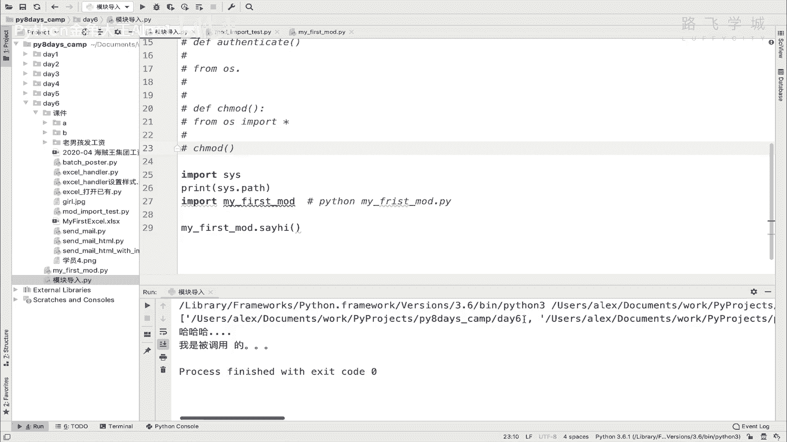

是没有，不像这个对吧，这个是第一条是day6下的课件。

所以也就是说你看解释器给你干了一个事，只要它是动态变化的，你这个这个调用的这个脚本，就是就是主动调用的这个脚本嘛对吧，你这个脚本在哪，就是说这个查找路径的第一条就是它，所以就导致你同级目录下可以导入。

明白吗啊那现在你看现在是课件。

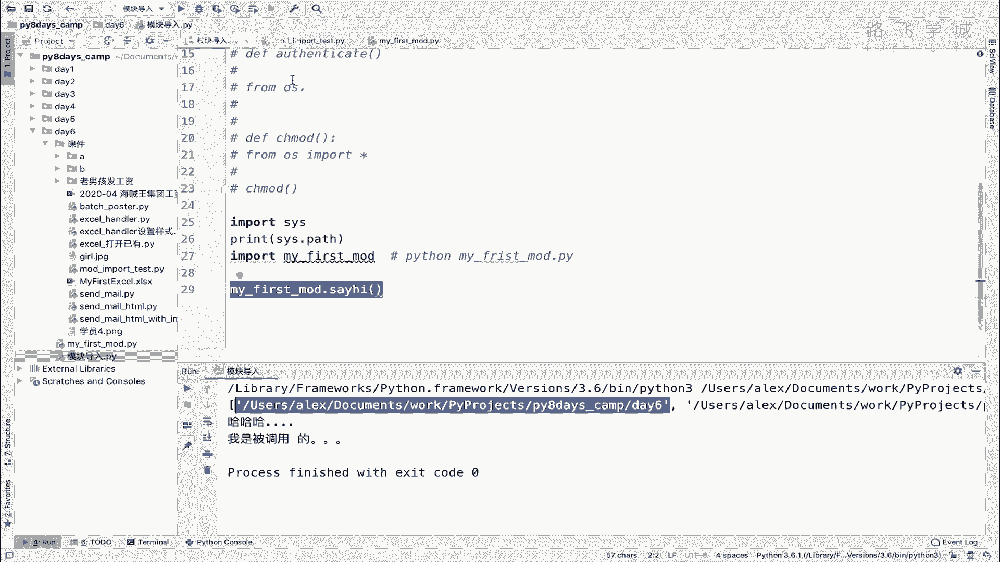

他就在同级目录下课件下发现找找不到啊对吧，找不到，那怎么办呢，啊它它在外层呢对吧，再再上一层目录，这个这个对吧，跟课件平级的是是不是啊，所以你怎么办，你可以这样办，你把它变成这，如果你把它变成这样。

我告诉你它就可以导入啊，那怎么能变成这样呢。

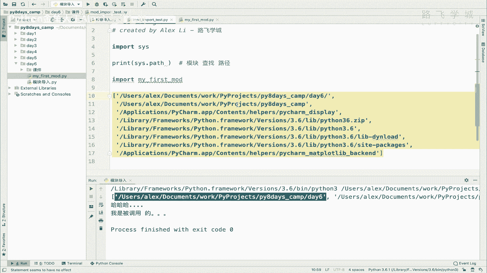

你可以听刚才讲过了，你这个表是可以改的啊，你这个表是可以改的，你只需要把它添加进去就可以了，明白我意思吗，把它添加进去好，我们那就咱们来试一下，把它添加进去啊，我们先给他写死。

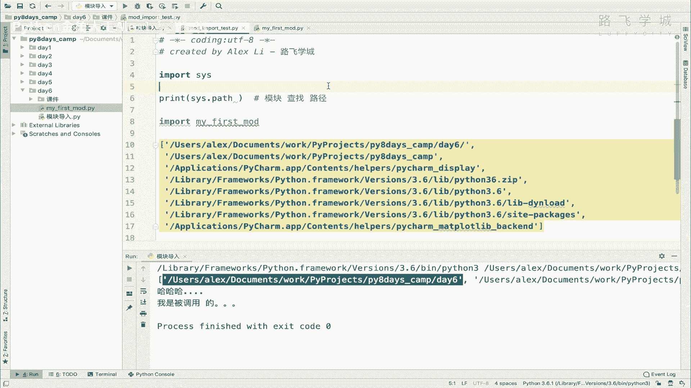

在这好吧，先写死就是day啊，day6的pass好吧，Day 6pass，然后我们就给他写到这，然后接下来我就干一个事，直接是C4点pass点append，但是一个列表嘛对吧。

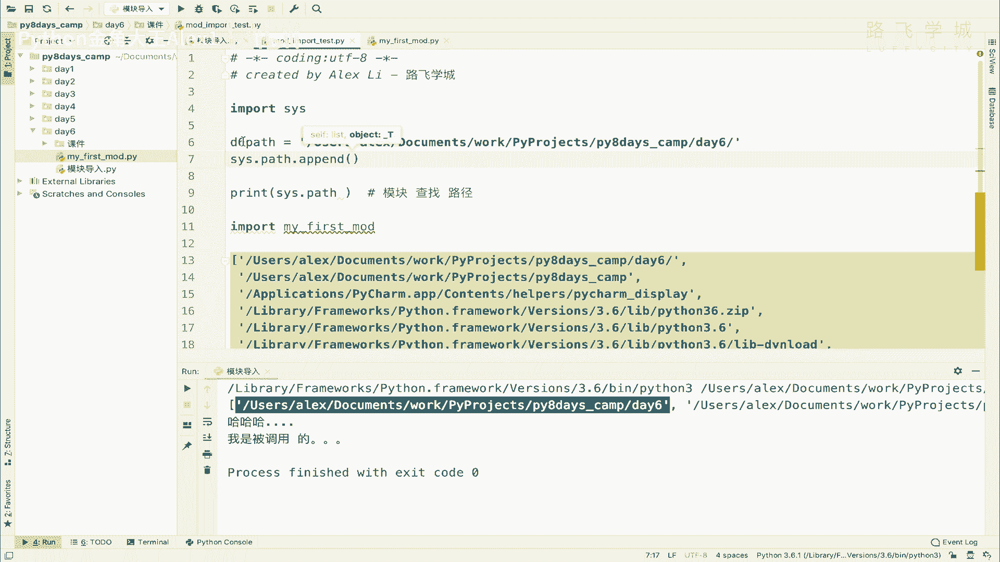

直接把它添加进去，看到没有，你直接把它添加进去之后，我告诉你同志们，你再去导入的时候啊。

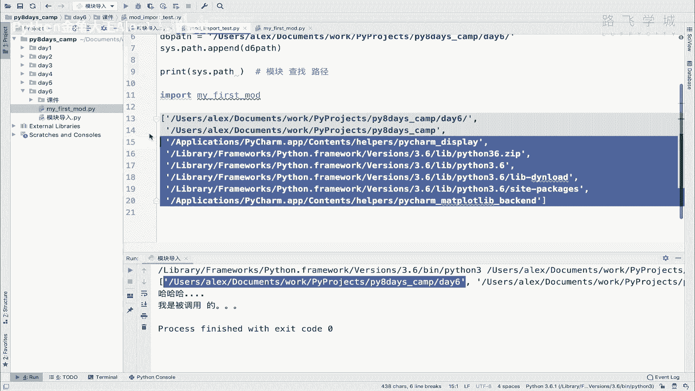

你再去导入的时候看着看着它就不报错了，大家看是不是不再报错了，你如果不添加，那就报错，能理解意思吗，对吧，你添加了就不报错了，不添加就报错，所以你理解这个这个这个这个东西了，是不是所前面啊。

这所以你这个列表是可以改，然后呢这个第一条是Python解释器自动给你加的，然后后面这些啊也是Python解释器自带的，这里面是放一些什么第三方啊，或者是说自带的这些啊，官官方自带的一些内置模块。

这个先不管你就是反正你要是确保对吧，你自己呢能到处导入的话，你就得做一个这样添加的一个动作，明白意思吗啊那有的同学说了，你这个东西啊怎么讲，你看啊，我现在我现在是不是把这个东西写死了对吧。

就是一个固定的写死路径，那就意味着什么呢，我如果把我这个啊，整段这段代码copy到你的电脑上，copy你的电脑上就会报错，为什么，因为你的那个电脑路径肯定跟我不一样，是不是前面，所以呢你如果想不报销。

你就在这里自己再改啊，自己改也不是不行啊，但是你要是就这么天天改，那你可能就忘记了，就就就不好对吧，就容易报错，所以呢能不能把它变成一个动态的，就是说你到哪个点电脑上，就自动的把这一段。

把他的这个路径给他拿到对吧，就这个这个绝对路径嘛，这叫把它路径拿到，然后呢自动替换掉，能理解意思吗，因为后面其实是一样的，后面对吧，我高P到你，那这个结构也是这样的，只不过前面不一样，能不能呢。

当然是可以的啊，所以怎么办呢啊怎么办呢，很简单啊很简单，你呢就直接这个什么呀，但咱们这里有一个变量叫杠杠file，杠杠file，注意了，它的作用是打印，打印这个什么呢，打印这个啊文。

当前文件路径就是当前脚本的，当前脚本文件路径，明白搭建脚本文件路径，我们来打印看一下。

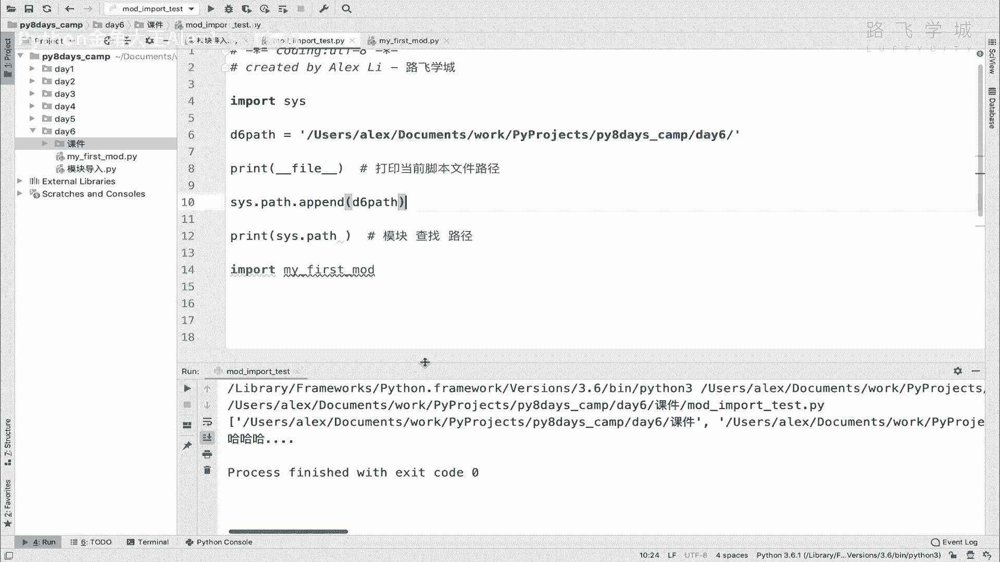

看到没有，看到没有，是不是把我这个相当于绝对的路径，给我打印出来了，明白吗，如果把绝对路径打印出来了之后，我干嘛呢，我直接把想办法把这两个给它剃掉，看到没有，这两个给它剃掉，然后只保留这个的话。

你看到没有，相当于你在你的电脑上执行这条命令的话，你就是打印了你电脑的路径，所以你把这个给他动态的变成替换掉，这个的话，那你是不是动态的添加到这个里面，那你就是不是就实现了。

我把这个代码copy到任何一个电脑上都可以，不用改就可以直接调用了，能理解这意思吗，好那咱们就通过杠杠file就可以实现了，好吧，那我们怎么办呢，很简单啊，我们直接是干嘛呢。

就是这个时候需要一个新的模块，新的模块啊，这里可能讲的有点多啊，你不要蒙啊，你明白我的逻辑啊，OS模块OS模块可以干一个什么事呢，咱们现在要做的事情是不是把这两个替掉，对不对，把这两个替掉，很简单。

你就直接T就行了，怎么T呢，直接有一个叫，后端后端的我就直接在这里给你print啊，再来一遍吧，Print os，点pass，点d i r name，看到没有啊，Dir name，Dr em。

它这个函数的作用是什么呢，只保留目录名，不要文件名，所以他就会把第一层给他踢掉，看着，大家看是不是把第一个文件名给他剃掉了，哎把第一个文件名替掉了之后，同志们。

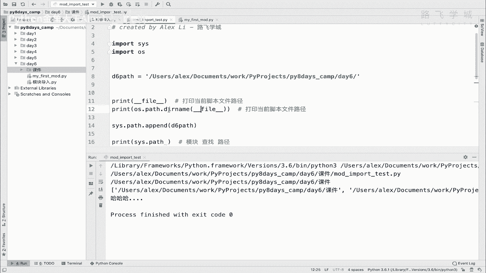

我告诉你，你继续干怎么干呢，你再把它包一层，OS点pass点DR。

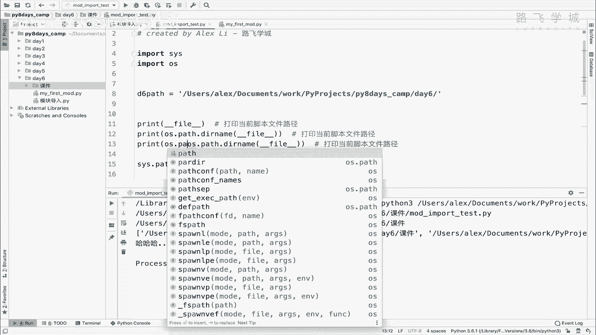

看着再把它包一层，你再包一层的话，是不是相当于在这个课件的基础上，课件基础上之后注意了，他还会把这个剃掉，还有同学说，你不是替代替掉文件名吗，啊你你这个是个目录，注意了，或者我说的不严谨。

他会把最后一个踢掉，就甭管你是文件名还是什么，原则上他是T文件名，但是他不会去检测啊，他检测你是不是跟目录闹，你只要是把这个目录路径扔进去，它就会把最后一个替掉，他认为最后一个就是文件名，明白吗。

所以我又包了一层之后，大家来看，大家来看，你看是不是什么呀，是不是就就这个这个这样了对吧，就这样的话，他是不是拿到一个动态的，这个这个这个这个路径的地址，拿到动态的路径地址之后，哎你在任何一个电脑上。

你的路径可能都不一样，哎就会动态的显示出来，所以我就把这个对啊，就是就是base pass吧，好吧，把这个OS点pass掉，看到没有哎，就拿到这个pass了，拿到这个pass之后。

我要在做的时候不是不是导入。

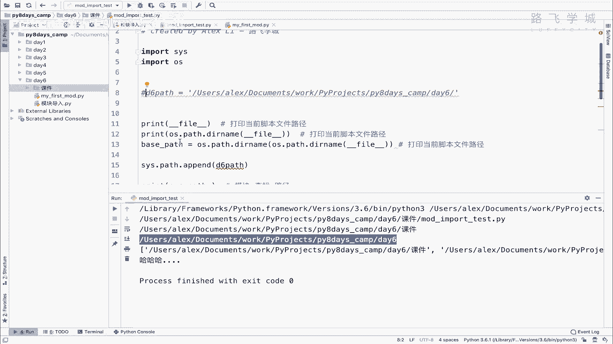

不是添加day6了，我是添加这个，明白这意思吧，我添加这个的话，同志们。

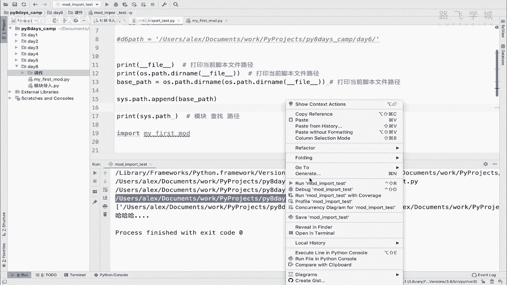

你看是不是也没问题啊，是不是也不报错呀，是不是也能那个调用啊。

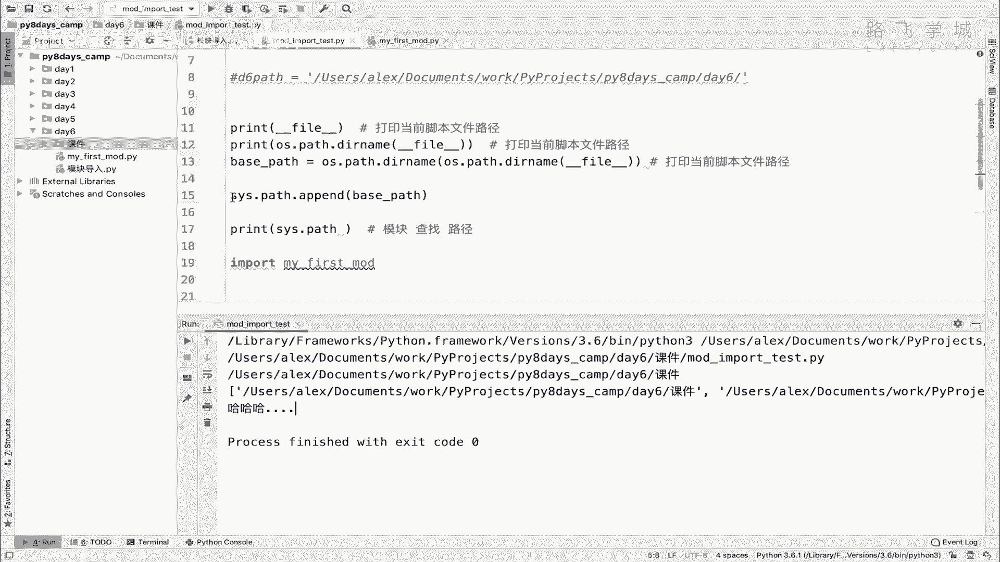

对不对，哎，这样的话就相当于把我这个啊动态添加进去了。

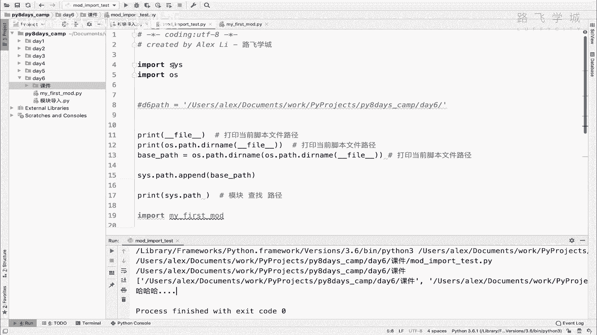

可以理解吗，可以理解吗，OK那好哎到这样的话呢，咱们这个自己写的模块啊，就可以实现一个跨目录的啊，导入跨目录的导入好不好，OK那下一呃对。

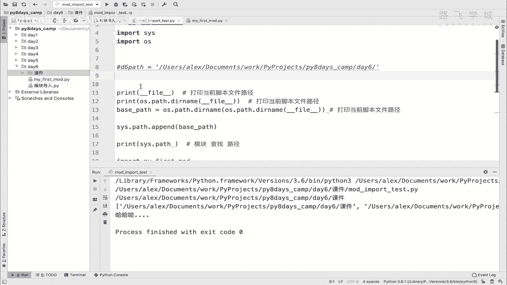