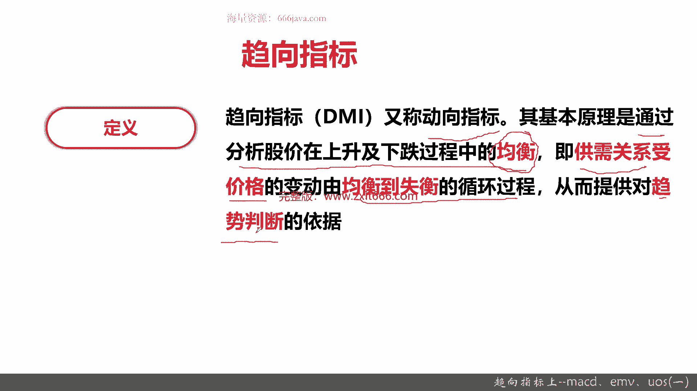
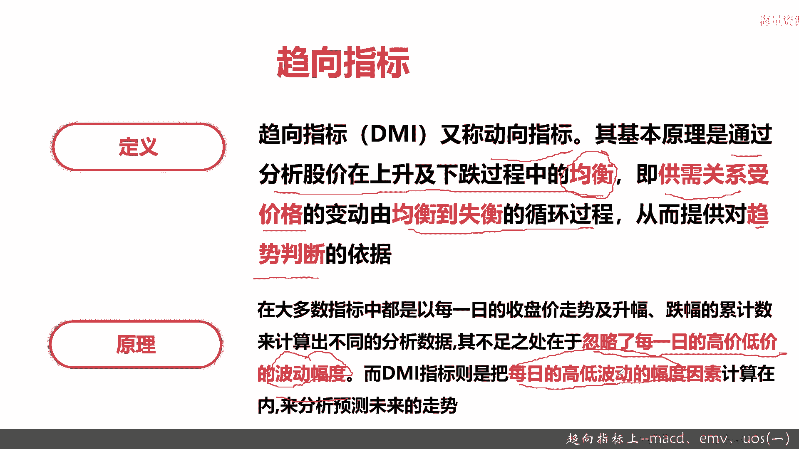
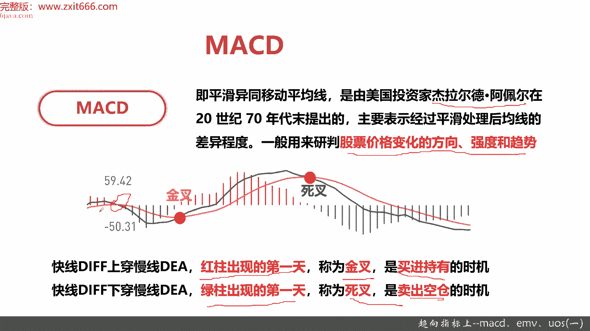
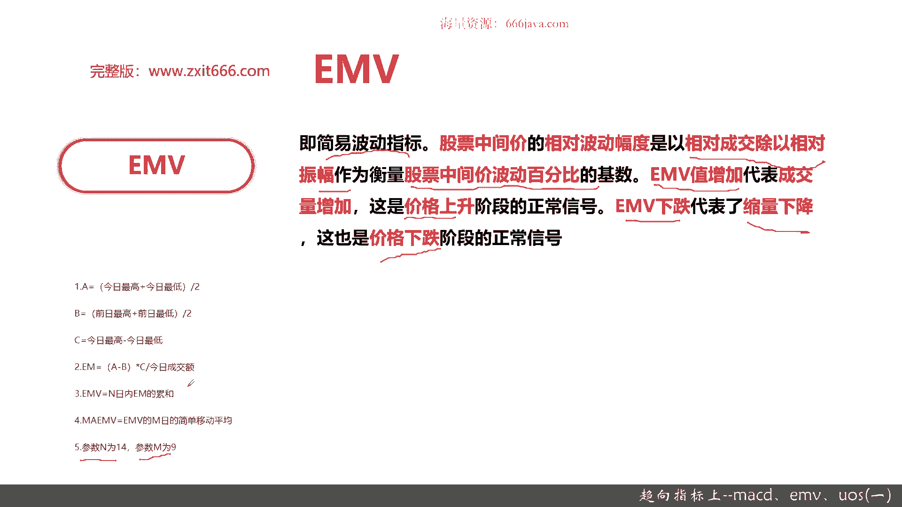
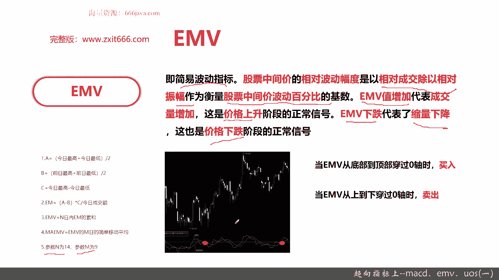
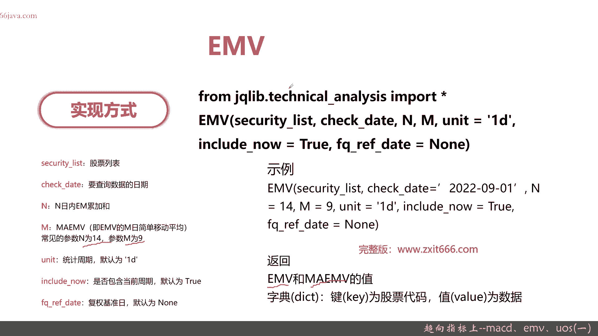
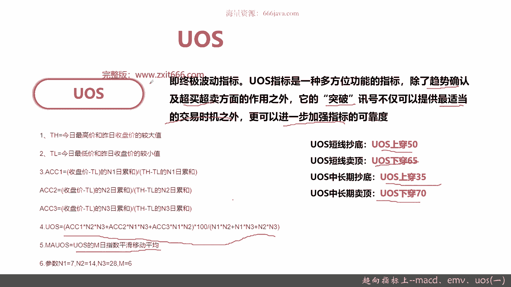

# 基于Python的股票分析与量化交易入门到实践 - P40：10.2 Python量化择时--技术指标函数_趋向指标上--MACD、EMV、UOS(一) - 纸飞机旅行家 - BV1rESFYeEuA

大家好，我是米切尔，在上一节呢，我向大家介绍了量化择时的一些基本概念，还有常见的分类以及技术分析常见的一些指标，那么这一节呢我给大家介绍趋向指标，由于趋向指标这个分类呢，涉及的指标种类比较多。

我们将分三节给大家介绍。

那么这一节呢将向大家介绍三种趋向指标，首先我们给大家介绍一下，趋向指标的一些基本概念，接着我们给大家介绍一下MACD，然后是EMV，最后是us，其中呢MACD大家可能比较熟悉，EMV呢是简易波动指标。

us s呢是终极波动O，那么最后呢还是老样子给大家进行代码实战，那么这一节呢，主要是给大家介绍这种各种趋向指标的概念，然后还有它基本算法，常见图形的作用以及代码实战，那么接下来我们就可以进入正题。

先给大家介绍一下趋向指标，上一节呢给大家简单的介绍了一下。

趋向指标定义，那么这一节呢给大家介绍详细的趋向指标，趋向指标又称动向指标，他呢上一节给大家介绍趋向指标，既不捉顶也不补底，这是它的特点，这一节给大家介绍一下，趋向指标为什么能做到这点，基本原理是。

通过分析股价在上升及下跌过程中的均衡，注意是均衡，这个均衡其实怎么理解，就是供需关系受价格的变动，然后呢，由于供需关系受价格变动引发均衡到失衡，这是一个循环过程，注意这是个循环过程。

然后根据这个均衡到失衡的循环过程来表述，进行趋势判断，OK这是趋向指标的原理，注意它主要是跟踪股价在上升及下跌中的均衡，然后呢，关重点关注是股价及价格的变动的均衡和失衡，这个循环的过程。

然后呢由于均衡和失衡，它就会带来一个趋势的研判。

OK比较绕口啊，然后呢给大家进行一下详细的原理介绍，在大多数指标当中，基本都是以每一日的指标的收盘，就是股价的收盘走势及升幅跌幅来进行计算的，但是呢这样子不足就是除了趋向指标之外。

它不足是忽略了每一日的高价和低价的波动，注意是波动，这就是找到了趋向指标一个特点，他们关注的是每一日高价和低价的波动幅度，然后呢DMI其实就是动向指标，它重点就是关注每日的高低价格的波动幅度。

通过每日高低价格的波动幅度，来预测未来的走势，好趋向指标大家记住一点，它主要是把每日的高低，就是每日股价的高低波动的幅度计算在内，然后来预测整体的股价的未来走势。

那基本原理给大家介绍了，那么接下来呢给大家介绍MACD，之前都是给大家介绍简单的MACD啊，然后我们这里也先给大家回顾一下MACD的定义，MACD是在20世纪70年代，由美国投资家杰拉尔德阿佩尔提出的。

其实就是平滑处理后的均线的一个差异程度，一般用来判断股价变化的方向强度和趋势，这个其实很简单，重点给大家看看，首先怎么去应用，这里有幅图，重点是这几个点，我给大家标出来了，这是一个MACD股价均势图。

还有K线图的例子，这里是个点，它是什么叫金叉，这里是个点，它是什么叫死叉，什么意思，如果股价是在这样上扬的进行交叉，同时往上涨，OK这个就是金叉，然后经过交叉以后，它变成了一个死叉，OK它就是往下跌。

这就是MAACD，当然了，这也不是绝对的，只不过呢这是一个概率，而且是大概率这样，其实这里你看这也是一个死叉O，那么接下来呢给大家要从那个MACD的角度呢，给大家介绍一下，那MACD主要是两根线。

一个DF线和D1A线，当快线上穿慢线的时候，也就是红柱出现第一天的时候成为金叉，OK就是这里，然后呢是买进持有的时期，注意金叉就是买进，因为你会赚吗，当快线下穿慢线的时候，也就是绿柱出现的第一天。

OK是死叉，就是卖出的，像这个点它其实就是死叉，因为它是绿柱出现的第一天好，这就是MACD，大家记住MACD主要就是发现金叉和死叉，然后金叉买进死叉卖出金叉，红柱出现的第一天，死叉绿柱出现的第一天。

那么接下来呢是MACD的代码公式嘛。

因为之前给大家介绍过了，我们就这次就不再介绍了，实现方式，在距宽里面就是MACD已经抽象成了一个基本函数，其实实现起来非常方便，用的是technical analysis，就是技术分析的一个包。

只要把这包按照那个全引全部import就行了，有专门的函数MAACD，那他那有哪些参数呢，Secur ret list，当然它可以传单只股票也可以传list，Check date。

Shout lag m d，那这些参数啊分别是什么意思呢，Security list，股票列表可以传单值，可以传列表，Check date，哪一天的macd short快写long慢写mid。

然后具体计算MACD的EMA均线，一般来说那个就是SHT，那个是12，那个long是26，MID是九，当然你把long27校才13，这个也OK，然后这个是个示例啊，那这个例子就是举了一个MAC的例子。

然后呢这个函数返回快些，脉线还有MSD，它的返回呢是一个dictionary，主要的key呢是股票代码值是value，这三者DFDA和那个MACD都是dictionary，这是MACD。

接下来给大家介绍EMV，EMA可能同学们没有听过，EMV其实就是简易波动指标，那他重点发现，他重点关注的是股票的中间价，所对应的相对波动幅度，那它是怎么算的呢，是相对成交除以相对正负，注意啊。

相对成交乘以相对政府，作为衡量股票中间价波动百分比的基数，它主要是计算股票中间价波动百分比的那个，EMV值增加代表成交量增加，这是价格上升，注意这是em位置增加，价格上升，em m值下跌代表了缩量下跌。

其实就是价格下跌，OK接下来给大家介绍一下那个EMV的公式啊，他要算ABC那AABC是分别是什么呢，A就是今日最高价加上今日最低价除以二，就是股票的今天的中间价，B就是前一天的中间价。

就是前日最高加前日最低，然后C是今日最高减去今日的，也就是这个差值，然后em就是A减B乘以C再除以今日的成交额，EMV就是N日内的em的累加，就是sum了，然后ma其实就是MV的一些简单的移动均线。

那一般来说记住参数N为14，参数M为九好。

那这里呢给大家介绍一下，常见的那个EMV那些图，这个图可以看到上面是K线图，下面是EMV和ma e mv，然后呢这里有两个点，这里我们就看到A点，这里是B点，可以看到呢A点它是从上往下。

那其实这个就是一个卖点，在阶段性的，其实它就对应的是这里它就会下跌，然后这里它是一个买点，可以看到它是在上升阶段，那这条线呢是零，注意啊，EMV和那个MACD不一样，它是有个零线。

那这个零轴主要看你上穿还是下跌，这个零线你可以看到这里就适合买，它对应的其实是这里好，当然了，在这里呢它又会往下，那这里其实是一个卖点，EMV的一个简单的口诀呢，就是当烟V从底部到顶部穿过零轴的时候。

买入就是一个上升的趋势，它是零，当EMV从上到下穿零轴卖出就是表示要下跌了，注意EMV主要是看剧跟零轴的关系，这条线是零轴，那给大家简单介绍了EMV这个简易波动指标，后面给大家介绍一下EMV的代码实现。

因为就是我们用的是区块和平台，这里也把EMA给抽象出来，其实他也是用技术分析这个包，然后呢EMV呢它是一个函数传参呢，Security list check date nm，因为它多了几个参数啊。

Unit include now，还有一个FREQUENCE，那个f q ref date好，那分别给大家介绍一下这些参数的意义啊，security list它是股票列表，它既可以传单只股票。

也可以传个list，Check tate，你要哪天的EMV，然后N就是N日内的em的累加和，M就是那个EMV的均线常见的参数，记住N为14，M为九，unit就是统计周期默认呢为一天。

include now是否包含当前周期，默认为true f q y for data，赋权的基准日，默认为那默认其实后面几个，比如unit include n赋权的ref data。

这些基本上都选默认就可以了，好给大家看一下代码的实际例子，这个实际事例呢也很简单，根据你传的security list，默认呢可以选20190年14就没什么EMV，返回两个dictionary。

一个是EMV，一个是ma e mv，那它字典跟之前的MACD一样，它是个key，就是股票代码值就是value好，现在给大家介绍完EMV。

再给大家介绍一下US，US呢孔雀你肯定也没有听说过，它叫中极波动指标，它跟EMV呢又有点区别，US呢是一种多方位的功能指标，它除了趋势的确认以及超买超卖，还可以提供最适当的交易时机。

更进一步呢还可以进行加强指标的可靠度，注意他有个突破这个讯号，这个可能这块比较绕口啊，没关系啊，到时候可以实际点，大家再举个例子啊，下面呢给大家介绍一下US的算法，US呢其实这个算法其实也比较好理解。

它有几个重要的，第一个THH，今日最高价和昨日收盘价的较大值，它是一个较大值，然后呢，TL是今日最低价和昨日收盘价的较小值，然后呢AC c one就是收盘价，就是今天的收盘价减去TL的N1日累和。

能用ACCY是N1日嘛，然后再除以TH减TL的N1日累和，那AACC2呢就是N2日累和除以N2日内核，其实这个算法都一样，只不过AACC123呢他是分别算出来，其实这些呢相当于一些均线了。

然后US呢最终呢其实就是这个公式，它也是个百分比，acc one乘以N2乘以N3呢，加上ACC2乘以NY乘N3，加上AC3乘以Y其实就是一个累乘，然后乘以100，再加上N12，加上N1乘N322乘。

然后呢MAUS呢就是US的那个M2，持股平呃，那个平滑移动均线，一般来说N1等于七，N2等于14，N3等于28，M等于六，这是一般的，然后呢us呢注意这几个词，他为什么刚才这么说啊。

us s其实它是同时可以支持短线和长线的，短线一般来说是一天到最多不超过一周，这是短线，然后呢数周到半年甚至一年是中长线，所以根据那个us这个指标设计的，它既适合于短线，又适合于长线。

其实主要是看它的一个定量的分析啊，如果你是做短线的抄底，US上穿50就够了，短线你要抛，那就是下穿65，然后us s的中长期的中长线抄底，就是上传35US的那个中长线卖，就是下穿70好了。

这个就是US的那个指标的基本原理。

