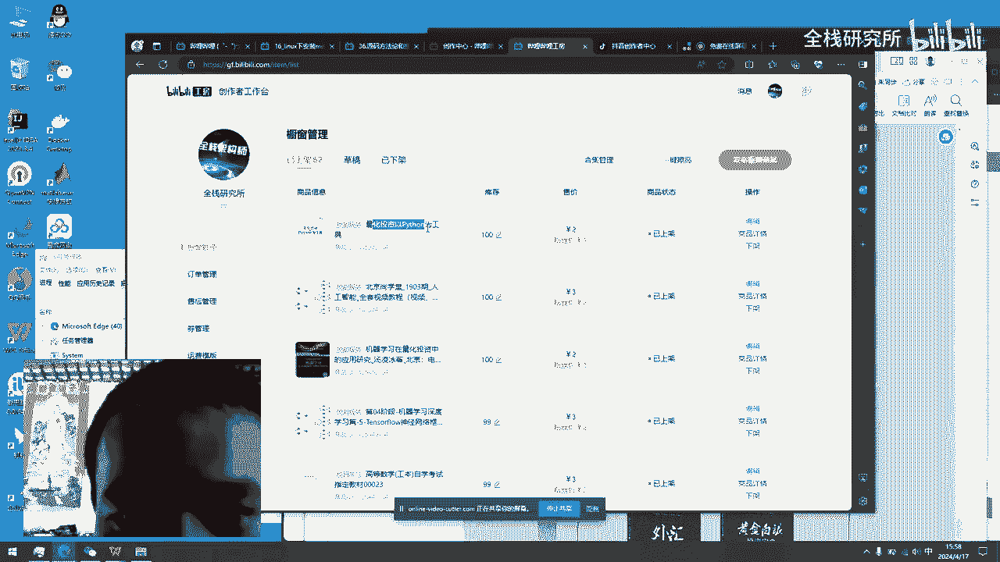
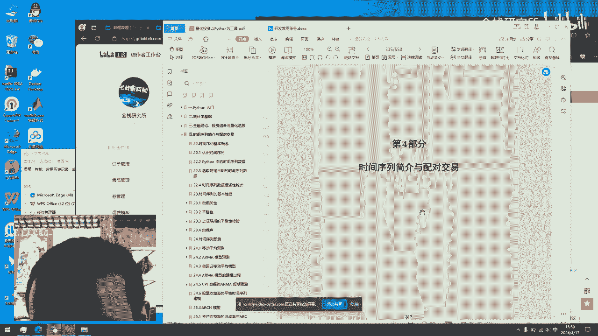
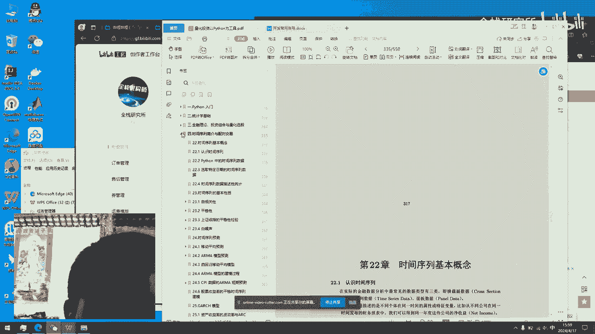

# 《量化投资以Python为工具》 - P1 - 全栈研究所 - BV1Zp421D7o1

好大家好，我今天给大家分享一下一本书，就是量化交易，以量化投资，以Python为基础，然后可以看一下这本书，我已经放在了我这里的工坊。

然后就看一下学这一本书能学习到哪些东西，第一个是Python的入门，那其实Python他这里就有一些常用的，除了能够学习编程之外，那他还可以去呃学习一些别的知识，其呃其实量化就和他会学到统计学。

统计学的一些基础，就是说如果你有编程基础可以学，没有的话，你也可以学，你就去重点看看一下它对应的这种章节的内容，就OK了，如果你有Python基础，那前第一章可以不看，直接看统计学。

统计学学完了再去看金融理论，投资组合与量化选股，然后这种然后的话它还会有对应的Python代码，就是说代码写出来之后，然后拿到的不同的啊策略啊，另外还有什么因子选股，什么模型之类的啊。

所以说这一本书其实还是比较全的，还有第四部分，其实就是时间序列简化与配对交易。

这一部分他也是可以学到很多东西的，嗯然后第五部分的话就是一些技术指标。

就比如说你想去学这些K线呃，嗯包括RSI线之类的，嗯其实很多东西都可以学到的，这这本书的内容好了，今天给大家分享。

