# 【2024年Python】8小时学会Excel数据分析、挖掘、清洗、可视化从入门到项目实战（完整版）学会可做项目 - P12：11 常用运算符 - Python金角大王Alex1 - BV1gE421V7HF

OK同学们，这节课咱们就来学这个Python的运算符，那咱们现实生活中有这种什么加减乘除啊，这种数字运算啊，计算机里它也有啊。

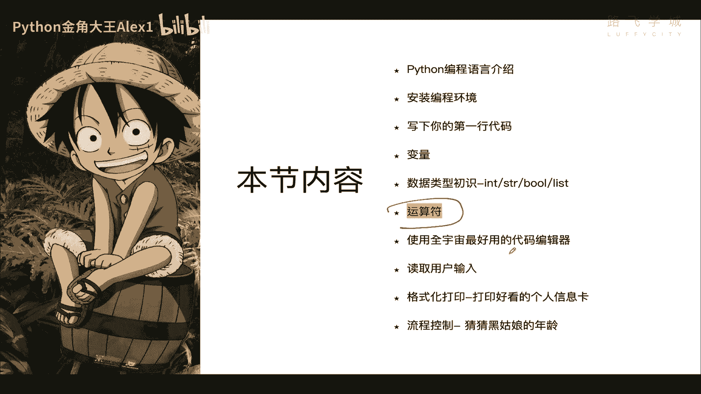

他也有，在数据计算机里呢，它很强大，它不仅能做这种简单的说加减乘除的这么运算，OK吗，它还可以进行很多种啊，很多种其他的运算，那按照运算种类，我们可以分为什么呢，算术运算也就咱们的加减乘除。

还有比较运算，大于小于，还有逻辑运算，一会儿讲还有赋值，成员身份未运算很多种是吧，那我们今天呢来给大家讲算术，比较逻辑赋值和成员OK吗，这两个现在咱们用不到啊，基础阶段用不到，先不讲，就讲这几个。

OK吧，咱们快速的来一起学习。

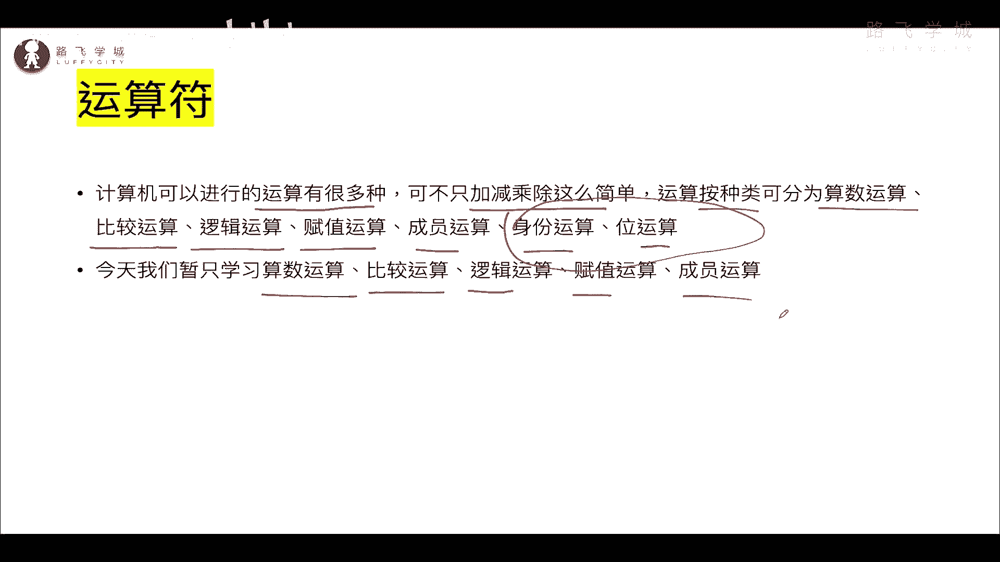

好吧啊，Sorry sora，Sorry，Sorry，Sorry，在哪，OK在这啊，这个我在这里直接给大家把这个课件做好了啊，课件做好了对吧，那首先我们来看算术运算，这个是最简单的啊。

最简单的在这里设了两个变量，A等于十，B等于一个20啊，在这里进行对每个运算做了一个例子啊，那呃算数就是加减乘除，这个就不用试了吧啊，这个只不过在计算机里稍微的写法不一样，这个乘是这个星号。

而不是那个X啊，然后这是除号，对不对，你看算的话就是相乘相除啊。

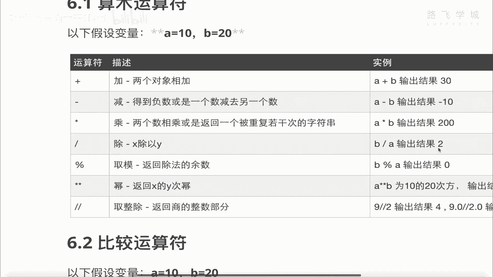

相加减就可以了，那重点这三个值啊，这个可能大家没接触过啊，来看一下第一个。

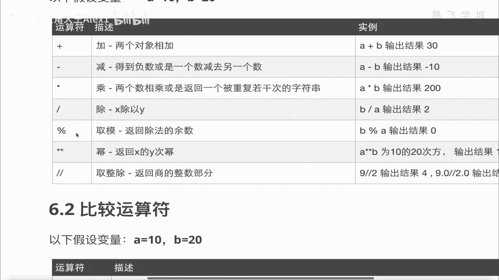

这个就是百分号，百分号是干嘛的，叫取模运算，取模是个什么东西，哎很简单，解释了，就是返回除法的余数，返回除法余数，我们对吧，两个数相除，对不对，如果能整除，没有余数是吧，没有如果不能整除。

比如说10÷3除不开，除不开它就有余数是10÷3，余数是一，是不是就有有这个余，它返回的就是这个余数，明白吗，我们来十啊，除以这个三，对不对，来得到余数是一明白吗啊10÷1个四，得到余数是二。

这个没问题吧，对不对，好这个就是余数，那取模它有什么用途啊，取模有什么用途，我告诉你当然有用途，我们可以用它来做奇偶数的运算啊，因为咱们用旧车还是有用的，你比如说这张表格，这张表格你发现它一个什么特点。

没有从这个第二行到最后什么特点，就是它每隔一行这个颜色不一样啊，指数行看到没有，1357对吧，几数行是白色，偶数行，偶数行是这个灰色，是不是啊，哎所以它会通过判断你这行是奇数还是偶数，决定打印什么颜色。

对不对，那那你得先判断什么，就把奇偶数判断出来，怎么判断奇偶数很简单呀，我就拿这个数对吧，跟这个二对吧，所有的数除以二，如果能整除是吧，能整除它就是偶数，不能整除，就是奇数，是不是啊，这不就简单了吗。

我拿一个九来，拿一个八来去取模二对吧，他就是偶数，拿一个九去摸二，不能它返回有余数，就代表它是一个奇数，能理解意思吗，哎这个就是奇偶数判断啊，这个大概知道这奇偶数判断就要用取模，行了好吧。

然后另外一个是求多少次方啊，也就是幂返回X的Y次幂是不是这个多少次方，对不对，他这边没办法写出来A的什么，直接在那个右上角写那个数字啊对吧，A的这个这个这个这个这个呃。

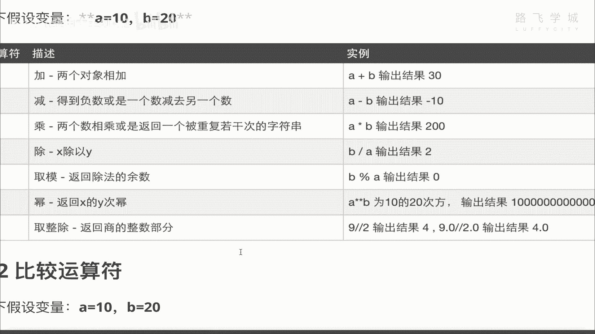

这个就是这种对吧，A的多少次方。

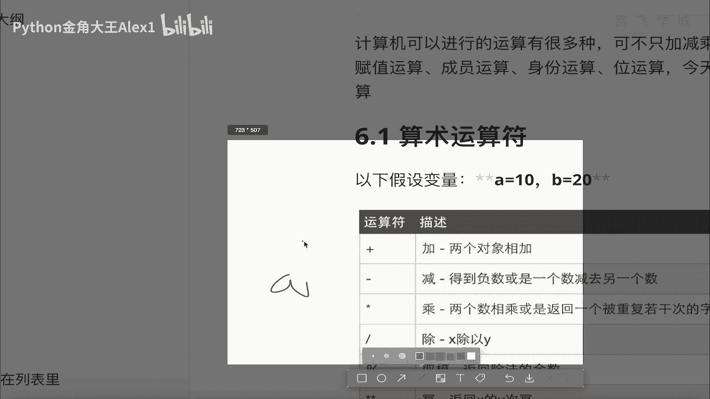

二次次方他没办法这么写啊，它的表示就是两个星号啊，两个星号对吧，两个星号就是它的多少次方，OK啊，这个你自己试一下就行了啊，另外就是取整数，取整数就取sorry，取整除取整除返回商的整数部分。

什么意思啊，就是就是就是就是就是来来给大家算下，返回商的整数部分啊，来比如说我们九现在正常除以个二，它是不是4。5啊，它这个取整除加两个斜线的话，它会返回商的整数，这是它的商，是不是它会返回这个四对吧。

这是返回整数部分，小数就不要了，对不对啊，哎是不是只返回整数部分，能理解意思吗，唉这就是取整图啊，取整图大概知道就行了啊，好算术运算就是这些对吧，算术运算就是这些很简单哈，那接下来我们来看一下比较运算。

比较运算啊，必要运算呢就是大于等于小于。

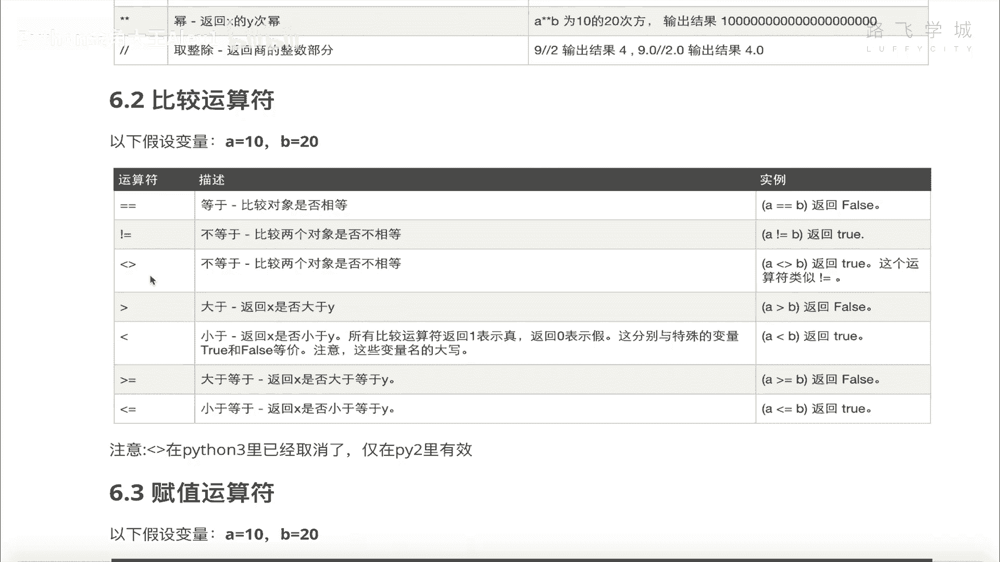

大于等于小于等于，是不是啊，哎咱们来看一下这几个值，看一下这几个值，首先啊首先先说两个等号，注意了，单个等号咱们是什么来着，单个等号咱们是不是变量赋值啊，看到没有，单个等号，双等号是判断两个值是否相等。

OK吗，判断两个值是否相等，OK啊，你比如说A是否等于B看这两个值变量是这样，A是否等于B啊，返回是false，它俩不相等，明白吧，你要不能是A等于B单个等号，那么就赋值了好吧，不等于啊一个叹号对吧。

哎这个不等于注意这个这个是什么玩意儿对吧，两个对着的尖括号，注意了，把这个忘记掉，这个是python2里的一个语法，并且已经被废弃了啊，这个这个因为它有很多歧义，所以大家没人用这个了啊。

我这个图里没去掉啊，忘记这个啊，忘记这个好，不等于就是这个OK吧啊不等于就是这个，然后大于大于啊，不用说了，小于不用说了，大于等于K小于等于K吧，没问题吧，就直接这么写就行，看到没有，你就这么写就行。

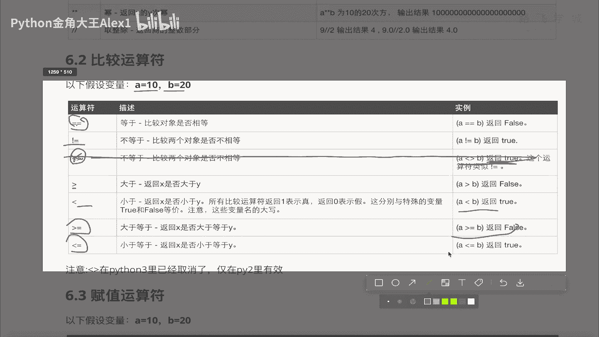

非常简单，是不是啊，非常简单啊，OK这是比较运算符啊，你重点是知道这个双等于双，等于是代表啊判断这个是否相等好吧，OK啊，那要不然我把这个双等一判断一下吧，对不对，九等于十，明白吗对吧，对不对啊。

就相当于两个数值进行判断好吧，OK看一下这个赋值运算，赋值运算是什么意思呢，你看这里有什么，加等于减等于乘等于啊，再正常数学里可能啊没有，但是咱们这里有啊啊等于不说了，这个等于就是变量的赋值嘛。

是不是简单的变量赋值，然后这里加等于是什么意思，加等于你比如说你看啊，sorry啊，我在这里A等一个一，是不是啊，那现在呢我想干一个事儿啊，这个我把A进行，就是我把这个A这只是在往上加一，就自己加一。

自己加一，我们会怎么写，A等于一个A加一，这个是什么意思呢，就是我看着右边那个看右边那个值，相当于就是我拿到我A这个变量是一对不对，我要给它进行自加，所以我加1+1完了之后，我是不是要再付给我这个A呀。

看到没有，先拿到A这个旧的变量的值给它加一，然后再付给我旧的A相当于对吧，旧的A是本旧的A本来是一对不对，然后加上一就二了，把二再付给原来的这个A是不是A就等于二了，对不对，哎这个就是自家的一个动作。

这种自家动作也可以写成A加等于一个，一看到没有。

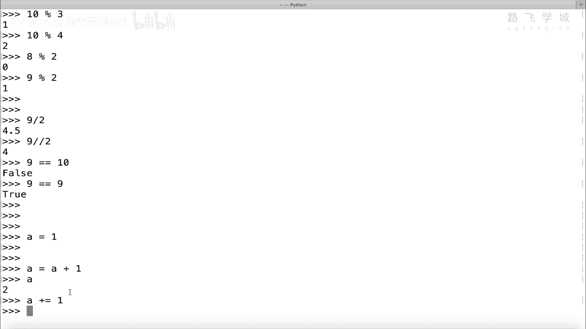

A加等于一，效果跟不是它的原理是跟这个是一样的，能理解吗，A加等于一其实就是等于一个，这其实这就是说先把原来的A拿到再加一，再把它赋给这个原来的A相当于就加了一了。

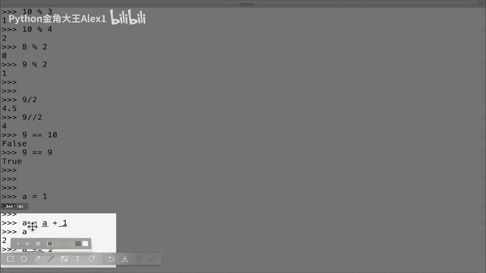

这就是A加等于一，能明白吗，那这样我A减等于一个一也是一样的，我我正常是A等一个A减一是不是等于二，然后我也可以改成A减等于一，能理解意思吗，OK吗对吧，后面的这些A乘等于除等于啊。

这个取模等于都是一样的啊，都是一样的逻辑，OK吧，都是一样的逻辑啊，基本上我们常用的也就是A加等于减等于啊，乘等于都比较少用啊，你知道一下就行了，好不好，OK这是赋值运算，那接下来我们来看啊。

这个叫逻辑运算，逻辑运算稍微的有一定的复杂度啊，有一定的复杂度，它是用来判断什么啊，判断我先不用看这个图了啊，它是用来判断这个多个条件啊，多个条件咱们这里比如说我们在这里，A现在是一了啊。

B等于三吧好吧，现在ab这两个值啊，咱们现在基本上A小于B对不对，或者A大于B这都是一个单个条件判断，是不是，那这里呢这里有一个叫逻辑运算是什么呀，他给了三个值，一个是and一个or一个not。

看这个and和or and all，就是说它允许你把两个条件拼在一块，比如说A大于十，and b大于十，这是两个条件呢，这两个条件哦，OK吗并OK咱们直接在这里来看，比如说我现在直接写一个A。

现在A实际上是1B是这个呃，这个这个这个三是不是，那我就这么写啊，A大于个0and b小于个三，同志们，我问你这个条件是否成立啊，首先你就注意了，这里其实是有两个条件，对不对，咱先看第一个条件。

A大于零吗，A是大于零的，对不对，哎这个没问，也就是说这个词这个小条件成立的，那我们来看一下B小于三吗，B并不小于三，B是等于三的，对不对，所以啊这个条件是不成立的，但是这里这个and是什么意思。

and注意听啊，and的意思是把这两个公式连接起来，这两个条件必须都成立，也就是这个条件要成立，并且and就是并且的意思，并且这个条件也要成立，就两个都为真，它才会返回真，如果这里面有一个不为真。

这个部位真对不对，它就会返回false，大家来看是不是是不是，所以and就会把，相当于将就把多个条件连在一块啊，并且它起到一个，它就是一个并且的意思，你就记住它是。

并且以后判断的时候就是这个的结果啊为真，并且这个结果也要为真才行，能理解意思吗啊这个就是and的意思对吧，你比如说我在这里再写一个CC等于五，C等一个这两个十看啊，ABC对吧，一三十。

那我可以不光写一个，and我可以写多个，and就是说A大于个好大一个零，and b小于一个三是吧，还是上面那个公式对吧，这个呢并且带按的一个C干嘛呢，C啊C大于五吧好吧，那这个你能告诉我。

它会返回的结果是整体是真可假，注意了，还是那句话，他现在是三个条件吧，这三个条件既然是and的连接，那就必须都为正，必须都为真，那好同志们，我们来看从左到右啊，第一个第一个条件为真吗啊A是大于零的。

没错，第二个条件为真吗，A小于三啊，B小于三不啊，所以这个不为真，第三个呢，C大于个五，这个是为真的，那好同学们说这里面第一个条件，第三个条件是为真的，但是第二个条件不为真。

所以这整个加返回也是false，对不对，没错吧，但是我告诉你同志们这个计算机的这个运算，我告诉你他从左边开始算，注意听啊，咱们刚才是把这三个都算了一遍，对不对，但是计算机我跟你讲，他为了提高效率。

他只他从左边开始算，既然你这里是and的，对不对，是不是and的呀，对吧，一看是and你这个第二个条件不成立，就整个包括第三个也是按的，对不对，他就导致他第三个值都不用算了，为什么。

因为因为你中间那个条件不成立，导致这个整个公式都不成立了，所以他就没必要往后走了，能理解意思吗，他没必要往后走，所以他呢就是啊第一个算完，第二个算完，然后一看一看后面还有一个and。

就知道他就后面这个值就不用算了，能理解意思吗，OK所以你们咱们以后用人啊肉眼来计算的时候，也可以这样啊，这是你看第一个啊，就看这里面有几个and的，如果都是and的，那你就从左往后数数吧。

只要中间任何一个公式不成立，整个公式就废掉了，能理解吗，哎这是并且的意思，OK那接下来我们再来看一下这个什么呀，叫all all all是什么意思啊，在这里啊不要看它中文解释了or是什么呀。

跟这个and的正好相反啊，and是并且or是什么呀，或者or是或者啊or是或者啊就是什么意思呢，就是啊呃他不要求你看啊。

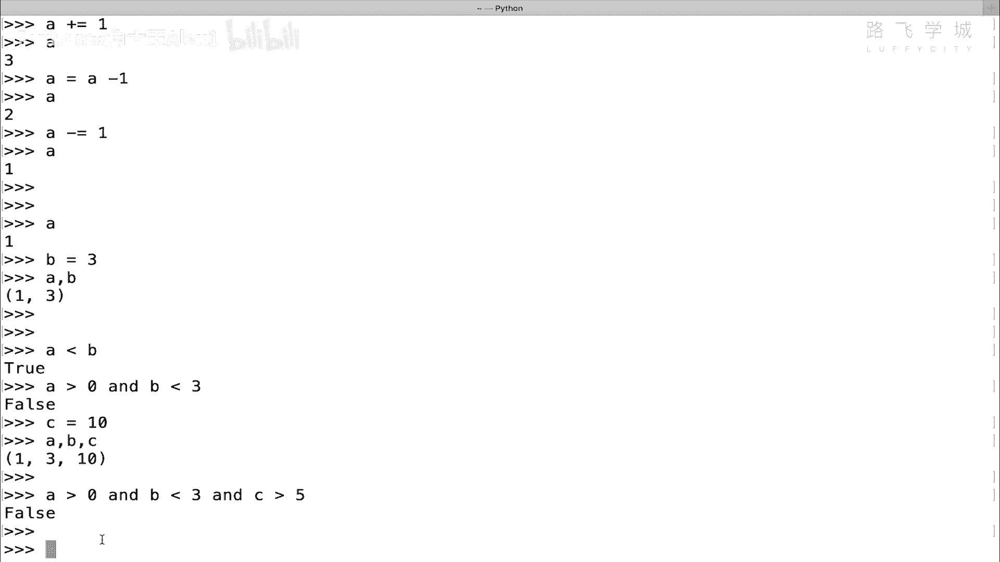

他这里对and是要求这三个公式都为正，但是如果你把这里都换成or的话，都换成all的话，这两个它会变成这三个公式，里面有任何一个为真都可以，就是这三个里面只要有任何一个为真就行。

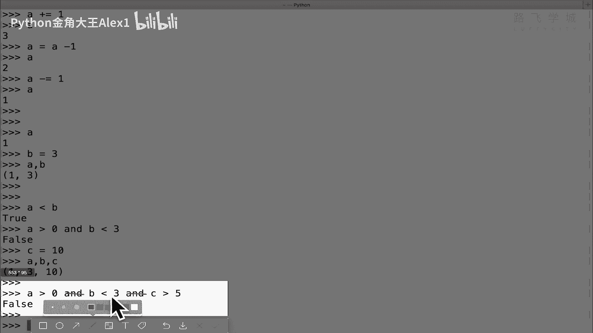

要么就是或者的意思啊对吧，那我们依然是AABC3个值是吧，我们就把它改成2A大于零吗，大于零，2B小于三对吧，哦这个啊先不要加第三个了，就这两两个现在判断，你看啊A大于零对吧，或者B小于三，B小于3万。

B并不小于三，但是这个公式我告诉你它会成立，为什么呢，只因为这两这两个公式里面，它要求只要有一个成立就行，or是或者的意思，对不对，只要有一个成立，那你看这个不成立，那这个成立就行，能理解意思吗。

所以或者好不好啊，或者然后你把这个再三个加上也行，对不对，再加一个二个C大于五也是一样的，因为只要有一个成立就可以能理解意思吧，那假如说同学说我这前面两个都不成立对吧，A大于五，A也大于五。

所以这两个条件前面这两个都不成立了，它依然会成立，为什么，因为C成立，对不对，如果C也不成立，你看它就返回false，这三个是不是都不成立了对吧，三个都不成立，它就会返回false，能理解吗。

好好最后再给大家说一下，这个or和and的混合用啊，这个会稍微复杂一点，大概看一下啊，A还是B还是C好吧，那我们写能不能把or和and的混合用在一块呢，是可以的，比如说我依然是A大于一个A大于零。

对吧啊啊然后加一个判断哦，这个B小于个三，是不是正常的话，这两个是成立的，对不对，这个成立这个成立对吧，就可以，然后我在这里加一个and呢，我加一个and c啊，大于个C大于一个什么吧。

大于十大于十好不好。

哎大家看这样的话就导致两个两个啊，相当于or和and连在一块，而且就放在一块了，对不对，or和and放在一块了，大家来看一下，你说这个会成立，还是不成立，我们来看一下A大于这个A大于十，不是A大于零。

这个是成立的，对不对啊，这个公式这个子公式啊是成立的啊，这里有一个或或的话，那就是啊这个B小于三，B小于三，这个不成立，对不对，这个不成立，那这个不成立，然后啊我这个成立就写一个写一个零吧，算成立的话。

我就写一个yes吧好吧，然后这个不成立就写一个N，然后这里and对不对，这个and先看这个C大于十吧，C大于十成立不成立，C大于十不成立对吧，也写一个N是吧，那好同志们，两个不成立，有一个成立对吧。

有一个成立，那最终这个整个公式成立不成立的啊，最终整个公式成立不成立的啊，那我问你，你说这个or啊，相当于它是它是算完，这个就是这个or是跟跟跟右边这个啊，算完就可以了呢，还是说怎么讲呢。

就是这个or它是分的，它是跟它是分成了一个这样的公式呢，看到没加括号，就是说这个和这个分出来了，还是说真的这个和这个呢，你们觉得你们觉得呢啊因为这个怎么分，它会决定两个结果，你说是不是啊，如果是这样分。

你看这样分的话，他这个公式对吧，这个公式是成立的，它是yes，对不对，但是加上an的这个N对不对，这就按照这个后面的它是不成立，所以它所以这个他俩整体是不成立的，对不对，如果是这样分的话。

但是如果你这样分对吧，对吧，如果这样分的话，你看啊这个成立或者后面的，对不对，那这两个这整个公式，只要这左边这个公式成立了，后面这个不成立也没关系，对不对啊，对不对，咱们来看一下结果。

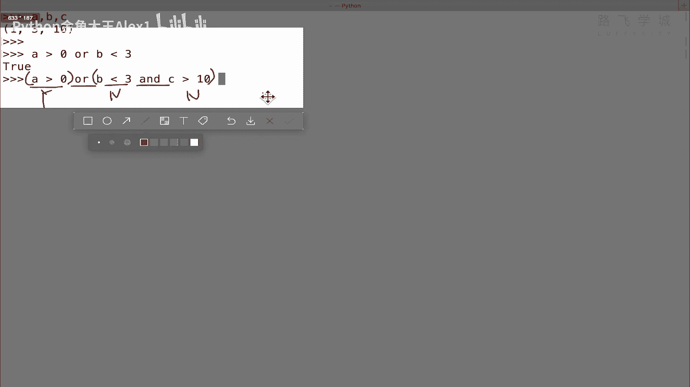

他到底是怎么分的，好不好，我来把这个截图先给它贴到这，贴到这啊，就在这，然后看看怎么分的呢，一回车是个true啊，一回车是个true的话，那就代表代表是什么呀，它代表肯定是这么分的，对不对。

也就是说只要就一碰见or，它就相当于把前面这个算出来，后面整个的，我不管你后面有多少and或者多少什么，我都给你算成单独的一个公式，就给你相当于加了一个括号，对不对啊，哎这个就是这么一个逻辑原理。

好不好，你自己试一下啊，你自己试就是重点，一定一定要知道它是怎么分的，对吧啊，他这个不是按照你这种说，哎我一看哦，跟这个分出来，然后再加按的，你会你或者这样，你理解or的优先级会更高就行了。

你永远理解or的优先级更高，就知道怎么分了对吧，的，优先级啊更高是吧，所以只要一碰见or他就直接把后边全都给他，分一整半了好吧，左边是一半，后面一整半，OK好，这个是啊。

这个这个这个这个混合在一块用好吧，然后接下来呢还有一个叫not not的话，取反取反呢，不要啊，对取反直接就是怎么讲，给大家说一下吧，你比如说我现在是A现在是B对吧，我A小于一个B正常是true。

对不对，但是我在前面加上一个note，对不对啊，就相当于正好把这个结果取一个反，它就变变成false了好吗，在一些特定场景下会用啊，特定先大概知道这个就行了，好这个就是逻辑运算。

接下来快速给大家讲一个啊，成员运算我们就讲完了啊，成员运算只有两个，一个是in啊，一个是not in，其实就只有一个in，加上not就是正好跟上面这个取反是一样的啊。

其实加上这个not是not是合在一块了，就是in或not in，就是判断一个值在不在，比如说一个元素在不在一个列表里，怎么判断呢，就是直接写这个元素名in这个names啊。

或者not in这个names，他就会给你说不在说我这个不在里面，对不对，返回false代表什么，在返回false代表cos，对不对，如果返回正常in的话，在的话返回true对啊。

这个除了判断列表还可以判断字符串啊，可以判断字符串，对不对，你比如说我这里写一个name等于一个啊，ALEX对不对，我就可以判断A这个字符，看A这个字符在不在这个name里面，对不对。

他在是不是让我发写一个两个字符呢，对吧啊，L在不在他不在，他就返回false ok吗，所以它能判断字符串列表，还能判断以后会学的元组字典集合，但是不能测试数字啊，你不能说你不能说这个什么。

我这个这个这个这个呃呃这个这个叫什么呀，这里有一个数字叫C对吧，你不能说我这个0in c啊，这个是出错的，对不对，你只能判断这个什么呀，你只能判断啊，对你是不能判断，只要对吧。

这个in和not in是不能做数字的判断啊，但是能判断这几个值好不好，哎，这个就是成员运算啊，成员运算我们来看一下，其实我们讲的这几种运算只有这个什么呀，逻辑运算的这个混合应用在一块可能会啊。

有点不好理解，其他的其实都是比较简单的好吧，大家先把这个啊自己在每一个都跟着试一下，好不好。

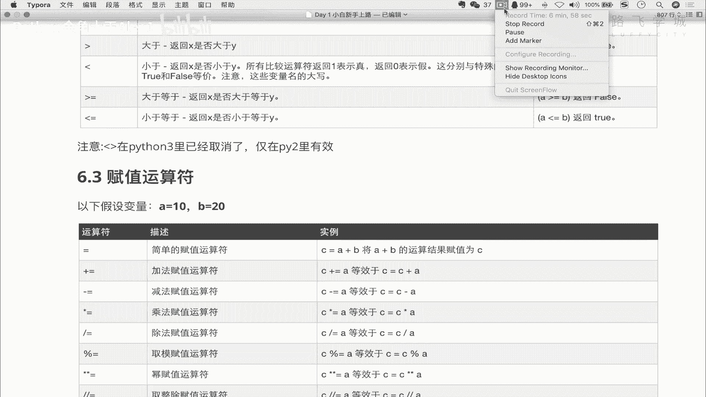