# 【2024年Python】8小时学会Excel数据分析、挖掘、清洗、可视化从入门到项目实战（完整版）学会可做项目 - P13：12 安装配置全宇宙最好用的代码编辑器 - Python金角大王Alex1 - BV1gE421V7HF

OK同学们，这一小节呢，咱们要给大家讲这个，全宇宙最好用的代码编辑器啊，为什么要讲这个呢，因为咱们前面写了一些代码啊，要不然就是但是一般是在交互器里，或者是咱们也简单的，在一个文件里写了一个代码是吧。

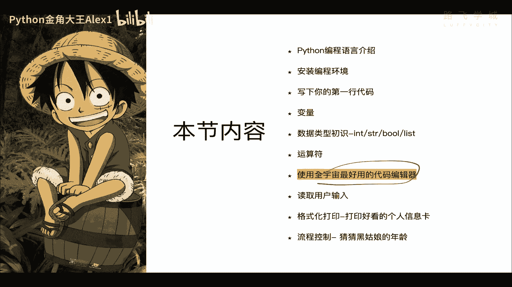

在一个文件里写了一个代码，还记得这个吗，写了一个代码，但是现在的问题就是什么呢，你在这里写完了之后，你得执行它，对不对，你执行它呢，你还得把它这个拖拽到咱们这个什么呀。

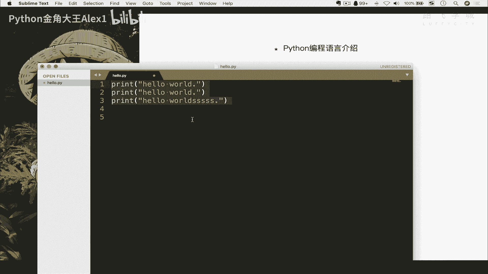

Python这个终端，然后再移回车去执行是吧，然后如果出错了呢，你再改还得再回到这里改，再重新保存，再拖到这里去执行，是不是就其实很麻烦，效率很低啊，能不能就是整个结合在一块儿。

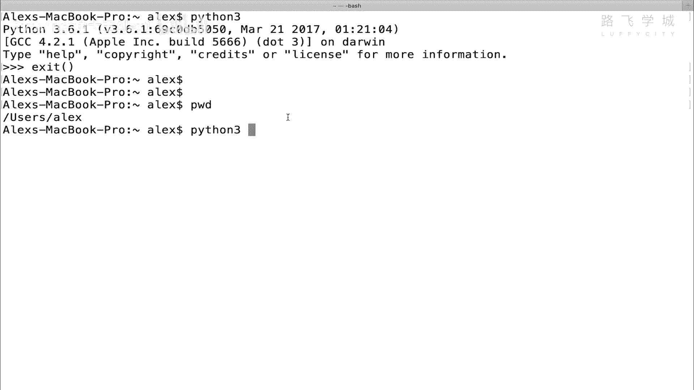

我在这里写完代码又单击夸执行了，对不对啊，然后直接在下面给出结果了啊对吧，唉那样效率才很高，对不对，没错啊没错，所以呢这个时候啊，现在你写的代码还少，等你写，可能你这里有100个文件都是代码。

并且互相之间还调用来回的，那这个时候你把它你你你你你要想效率高的话，就得借助代码开发工代码编辑器啊。

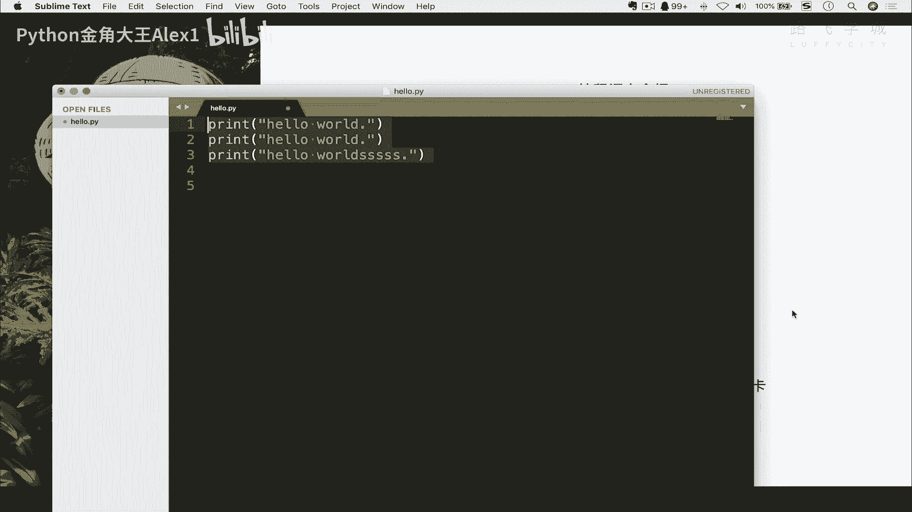

所以这个代码相机是什么呢，哎就是咱们接下来要学的叫啊顶配版的排插，PYTHM呢后面是一个公司，他专门去研发各种代码编辑器，其中最出名的就是这个啊，这个软件叫PYTHM啊。

这个PYTHM是专门给Python用的啊，Python用的他这个软件就是长这样啊，看着好像挺复杂是吧，其实会了之后发现很简单啊，它的名字要记住叫什么呢，IDE集成开发环境，你一听别人说ID就知道啊。

就是一个代码编辑器好吧，英文叫这个，仔细看啊，Integrated development environment，OK那咱们接下来就把这个东西装上，带着大家啊，然后呢执行一下这些功能。

哎你把这些功能学会了，你说白了你你就足够你写所有代码了，OK吗，哎咱们快速来装一下啊。

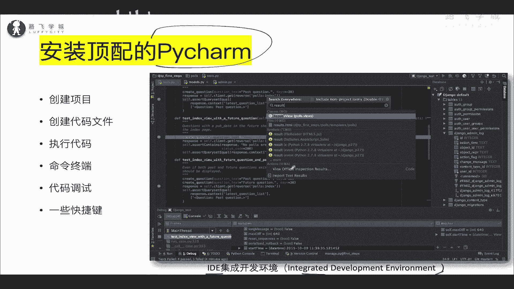

你装的话呢这个下载还挺慢的啊，因为它是一个国外的一个公司啊，下载300多兆，300多兆的话呢，你也可以百度搜一个啊，但是建议建议从官网吧下载下载，打开这个啊，下载呢找打开这个就到了，这直接它的下载中心。

下载中心呢这里有两个版本啊，一个叫专业版，一个叫社区版，专业版的话呢是花钱的啊，基本上七八百块钱吧，还挺贵的啊，对于我来讲当然很便宜，所以我买的是正版的，真的是正版，那社区版的功能会少一点，但也能用。

我给你们的建议啊，直接用专业版，如果你是新用户，没关系，他这有一个叫free trial，看到没有，是不是free trial啊，free file就是说可以免费的试用，免费试用多久呢。

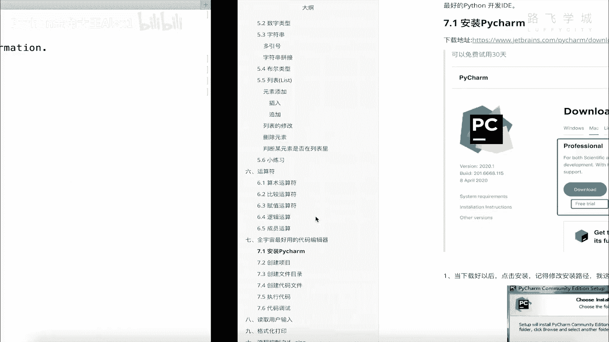

免费试用30天对吧，也可以使用30天啊。

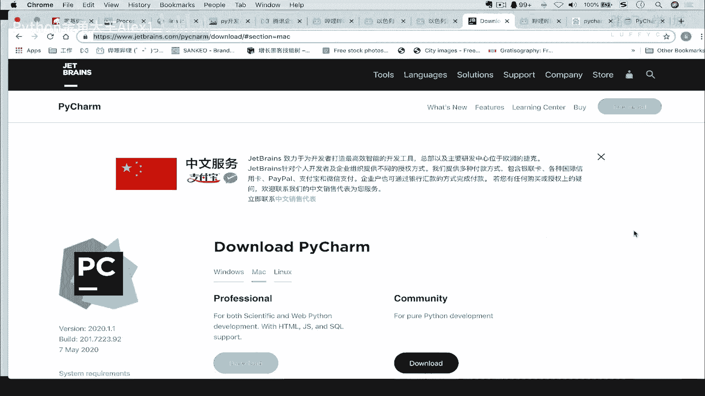

在这里你看还支持支付宝支付啊，有钱的可以付钱啊。

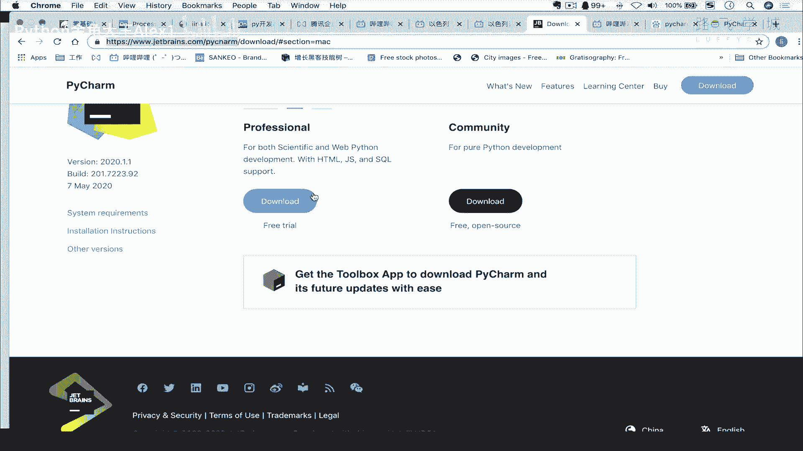

七八百块钱，那你下载完了之后就直接啊，就就就就就免费试用30天就行了，等你到期了之后啊，我告诉你啊，怎么去怎么去怎么去解决对吧。

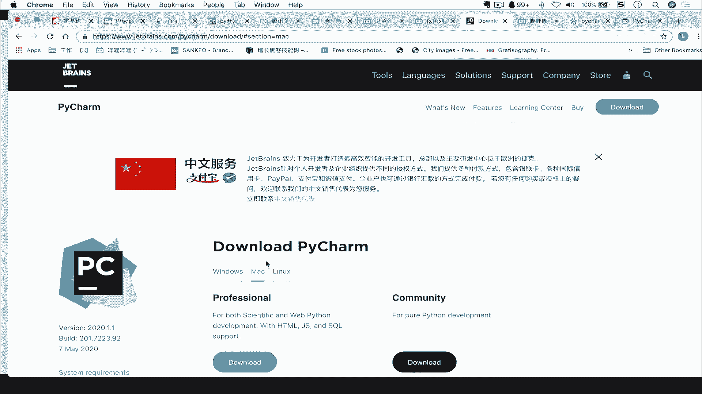

万能的淘宝啊，可能这就可以解决一切问题，那下载吧，下载完了之后你就点击安装，点击安装呢啊你就到了类似这个地方对吧，它会让你选一个路径啊，装到哪个地方，装到哪个地方，这个一般你可以自己选了啊。

就跟装软件选装到你那个盘里一样，他会这里会弹下弹出来一个说这个什么呀啊，这个这个，这个是让你创建这个什么桌面快捷方式啊，桌面快捷方它应该是默认选中了一些，你就不用动不用动好吧，直接下一步就行了。

这下一步啊，然后包括后面也都下一步下一步啊，基本上下一步就完了，下一步完了之后呢，基本上装完之后装成功之后，注意了啊，你双击它打开，应该类似出现一个类似这样的页面，我这是2017年的截图啊。

所以你那个新的版本，19820的可能不太一样，但是总之啊。

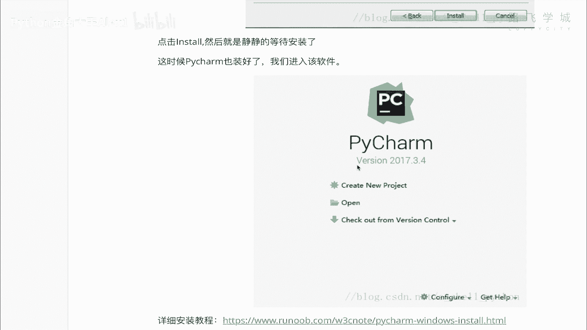

我觉得他至少即便你是二零的新版本，它应该也至少有一个类似这样的东西，叫prt new product，创建新项目啊，什么意思，就是他为什么一上来就让你先创建新项目啊，或者打开一个项目已存在的项目啊。

为什么要这样，是因为咱们写的各种软件，比如说我做一个网站，它就是你要先创建一个网站项目，因为这个网站里面它会有很多的代码文件，它不光是一个，它可能有上百个，所以他们都要把这个按组织的给它。

给它规划在不同的目录里，但是总之总之它会有一个总的目录，这个总的目录就是一，咱们就管它叫项目吗，什么意思，就是你创建一个项目，其实相当于创建一个目录，这个目录下又分了很多子目录，每个目录下就有代码文件。

能理解意思吗，啊OK吗啊，所以就是你创建一个项目，就其实是创建一个文件夹好吗，但是咱们写写写写项目就是写代码，什么叫先创建一个项目，OK啊。

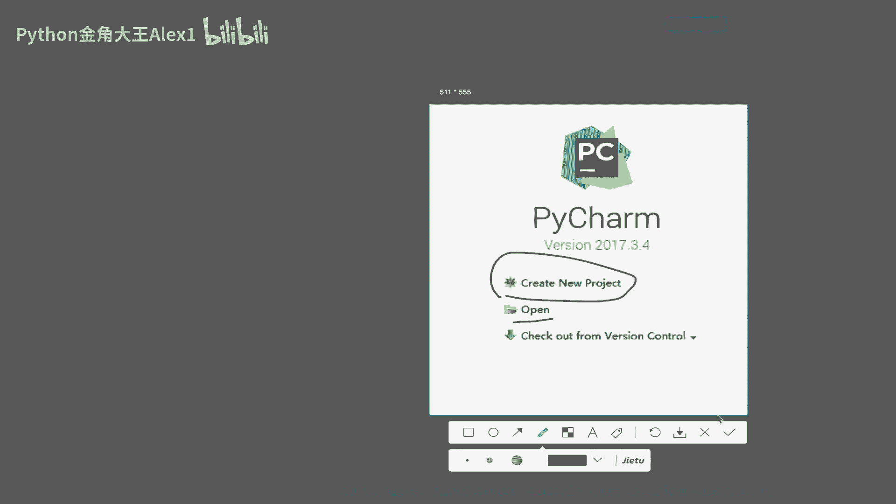

以项目的形式管理，所以呢你到你就直接点创建就可以了啊，接下来我就可以给下面的步骤，我就可以给大家啊实际操作了，实际操作了好吧。

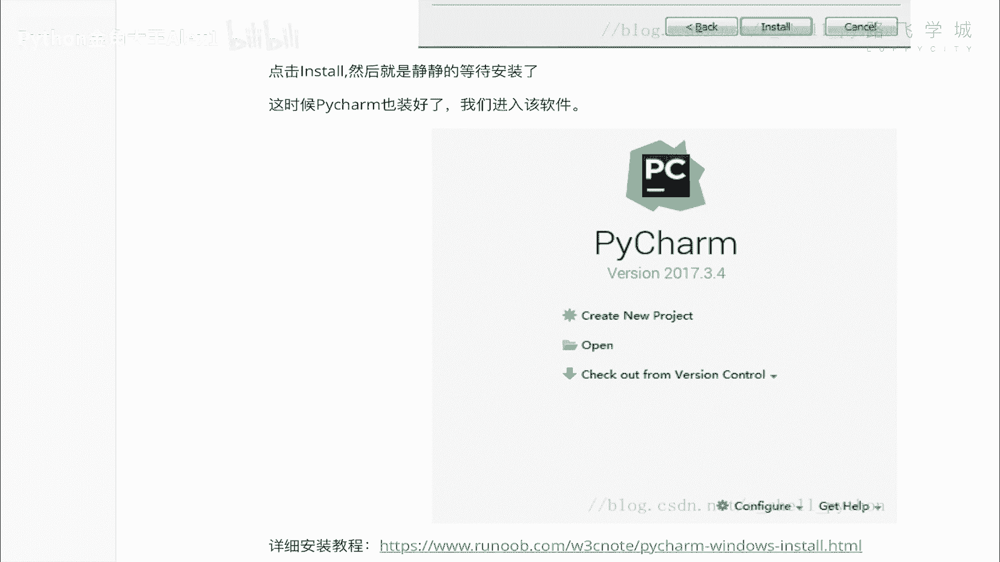

我在这里已经打开了我的这个排场。

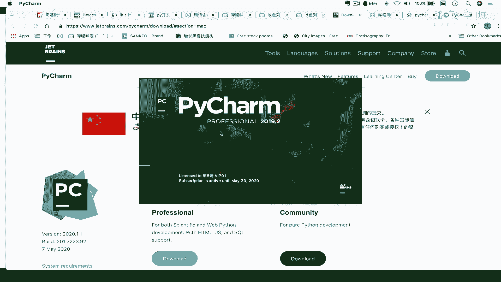

然后呢啊我这个不是新装的，所以我右边有一些这个已经创建好的项目，它它是让我直接打开，但是呢你那边可能没有，你那边应该是这样的对吧啊，创建项目下面这个不用管啊，你就点创建项目对吧，这里呢让你选择啊。

左边这是什么，左边是让你选择是你创建什么类型的项目，你是哎sorry，您创建Python项目还是jungle，jungle是web框架，就是创的网站项目对吧，网站还有很多种啊，什么jungle框架。

flash框架一堆啊，一堆还可以创建，创建什么前端项目，就是这个，但是咱们现在就学这个pure Python纯Python项目OK吗，选了这个之后，同志们再来看这个地方啊。

这个地方是location位置啊，也就是说你要写上你这个项目的啊，这个目录这个untitled的啊，有的同学直接就这么create一个create就点create了，这UNTITLE是未命名。

你在这里要先给人家起个名字，这个项目名人家是让你自己改的，OK吗，你改成什么呢，同志们改成什么呢，这个路径你都可以自己改啊，一点对吧，就这个都可以自己选好吧，放在哪啊，但是呢这个名字咱给它起个名字吧。

我这个就叫Python py啊，PY88天集训营，七天集训营对吧，大家对cap吧，集训营的意思啊，cap好，这个就是我的项目名好不好。

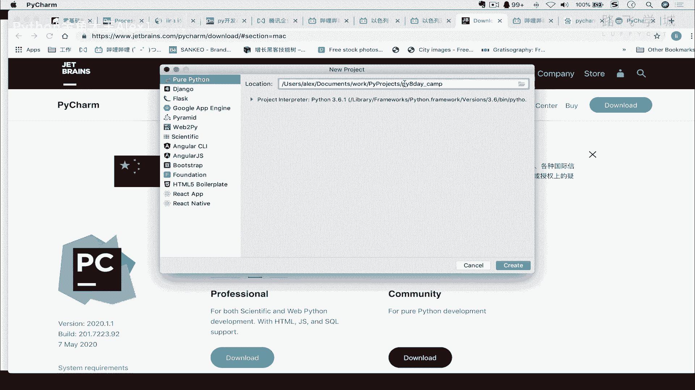

然后下面这个地方下面这个地方注意了，要要了解一下这个地方是什么呀，项目的这个是什么意思啊，Interpreter，interpreter是解释器的意思，也就是说你这个项目的解释器OK吧。

它默认他我这个是已经找到了啊，你看他就是我Python装到啊，它已经从我的系统里默认找出了，我装好的这个Python的环境解释器，咱们之前不是装了个Python解释器吗，对吧哈，注意了。

你这个拍charm，它也只是一个相当于咱们之前写的这种，写在记事本里的一个加强版，什么意思，就是他也是一个代码编辑工具，写完了之后，是不是也得执行执行，交给谁执行，是不是还得交给解释器。

那你既然交给解释器执行，你是不是先要告诉PX，你的解释器放在哪了对吧，他也不知道你的解释器你可能装到C盘了，可能装在D盘，可能装在E盘了，对不对，哎你得告诉他在哪，所以呢如果你之前装的时候。

已经把这个环境变量，就是那个解释器的环境变量都配置好了的话，它就自动能发现你的Python在哪啊，你要是没发现，你得自己再重新配置啊，啊如果对应该你那是能自动发现的啊，对如果是他找到了。

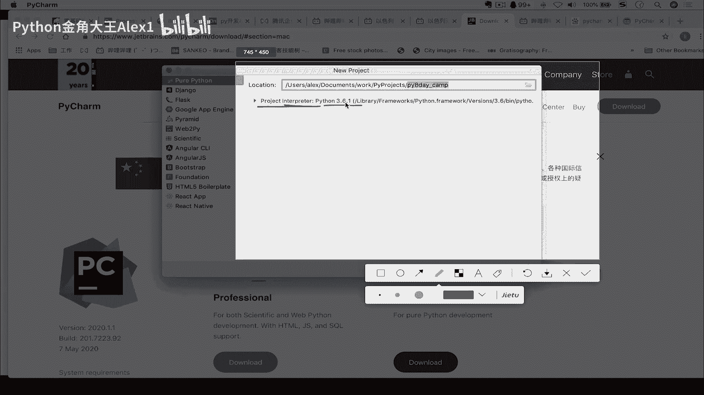

你就不用动了，如果他没找到他，这里应该会出现一个类似警告啊什么的提示，告诉你要找你要配置解释器，让你配置的话，你就得下拉了，下拉了之后呢，你你就选这个吧，那他可能默认选的是这个，但是你选这个。

你选这个选择existing就已存在的解释器，这个时候就什么意思，就是说让你去找这个本机，你的解释器放在哪了，我这个解释器你看是我这里有好几个版本，2。73。5对吧，3。6，我现在就是装到这了。

你在你的windows上就去找找到你的什么，可能是C盘呀，哪个盘呀，看你装到哪，然后呢找到它，走到beam下，选择这个Python，选择一个Python的可执行文件啊，点ex e在windows下。

Mac下的话，就是Mac下你装到哪，你也得去找对吧，然后你就create就行了，好OK我们在这里选好了这个解释器之后啊，你找到你的解释器，然后你就可以create了，好吧，一点create哎就创建好了。

创建好了之后呢，同志们，大家来看左边有一个什么样目录啊，这个目录是可以收起来的，看着点这里可以收起来，这边是空的，这个一会儿是写代码的地方啊，注意了，你会出现一个目录是吧，这个目录然后呢往下是空的。

没问题，这边有一个什么external library，这个不用这个里面不用管，这个是你的Python解释器里，安装的时候自带的一些东西，先不用管好吧，你就看这个目录，这个目录下呢，咱们这就是你的项目。

你要接下来在这里写代码，写代码的话呢，我们这样八天嘛对吧，咱们八天七天的，咱们就每每个创建一个右单击啊，new然后在这里选中啊，在这里选中看啊，你这里可以创建文件，可以创建草稿，可以quest是草稿啊。

可以创建目录，可以创建包啊，Python包这个先不用管，没学呢，就你就现在知道创建目录和创建Python file就行了，就这两个看到没有，就这两个Python目录Python file好吧。

我们先创建一个day1，然后在day1的基础上又单击再创建一个Python file，看到没有啊，他这里默认就可以叫first吧啊first code吧，好不好，就叫这个，然后一回车就行了啊。

你那里可能没这个东西啊，这是我自己配的，忽略掉啊，你看这个时候同志们，你这里就出现一个文件，你就在这里可以写代码了是吧，可以写代码啊，我把我的呃，我把我这个字体放大一点，你是我的Mac。

可以直接随意放大，然后呢print是吧，他怎么没有过提示，没有过提示，看是不是有这个代码提示，看到没有print就会有代码提示，然后呢你在这里面写东西啊，Hello，Are worlds，对不对。

然后你这个时候就可以执行了，你可以执行了，你怎么执行呢，又单击看到没有，又单击run，看到没有，右单击run ok吗，一执行我同志们，我告诉你看代码是不是直接就显示在这了。

是不是直接就显示的很神奇吧对吧，哎你以后执行，你以后再执行对吧，你可以直接这样点右单，反正右单击执行就行，或者你在这里看到没有，在这里一点也是执行，看到没有，这个时候你的这个代码文件就在这了。

然后你想再写一个第二个文件没问题对吧，second对吧，然后你看又出现了一个新的文件是吧，那你在这里随便写个东西，对不对，我就写一个没写的函数啊，对不对啊，print啊，哈哈哈哈对吧。

然后呢say hi，对不对，然后你看你在执行也是一样的，也是右单击执行，看到没有对吧，是不是你这样的话，就明显能感觉我这个代码文件都在这里，管理的很好对吧，想想想用哪个就用哪个，它自动给你切换。

是不是哎想怎么改怎么改啊，这个这个就是并且你写的语法如果出错了，他会给你提示你，比如说你写的是一个啊这个对吧，你看他没有这个语法，它就会给你出现波浪的横线就会报错，对吧啊，报错给你提示。

比那种什么这个这个这个这个刚才那个黑框里，咱们写的那个那个记事本。

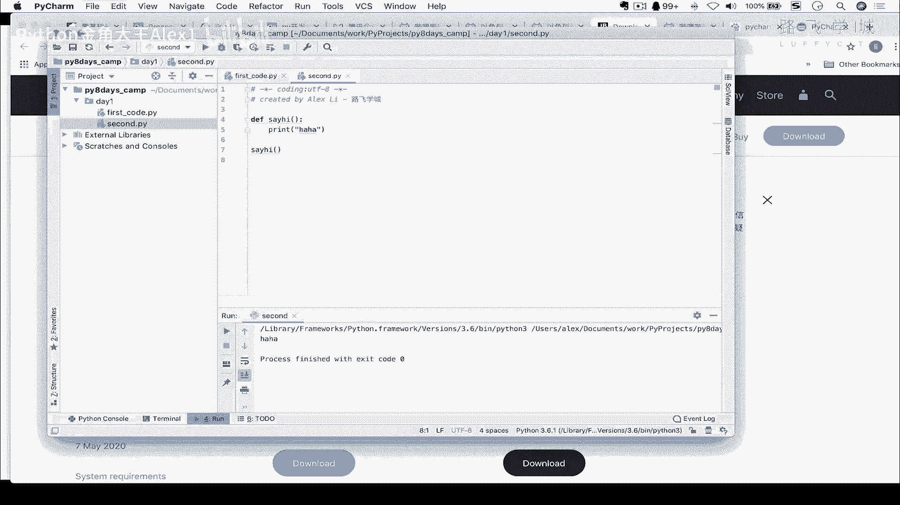

对不对，比那个比比这个好好用太多了，OK吧好这个就是啊你已经把它装上了。

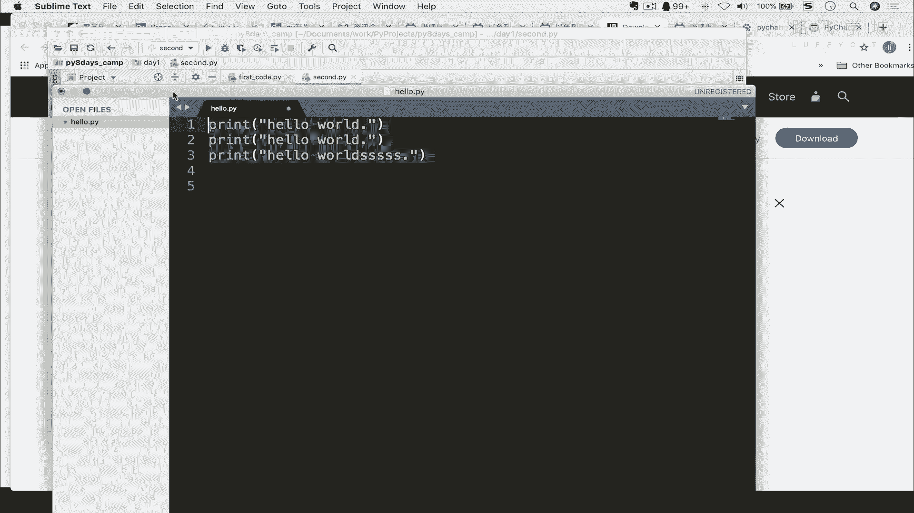

装上了之后呢啊能写代码了，能写代码呢，并且能执行，咱们来看一下我们还有什么东西没有做啊。

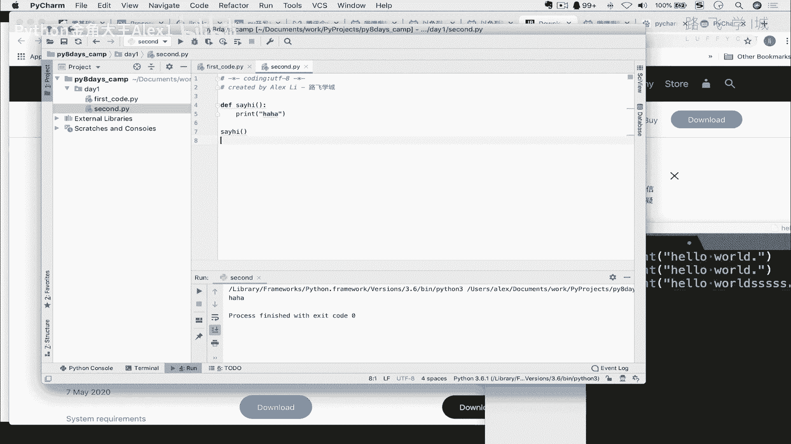

什么东西没有做好吧，嗯嗯什么东西没有做呢。

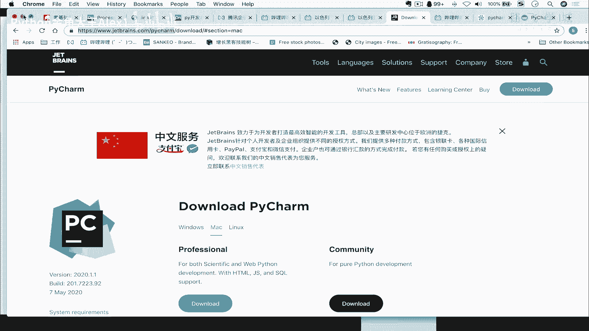

呃我看一下啊。

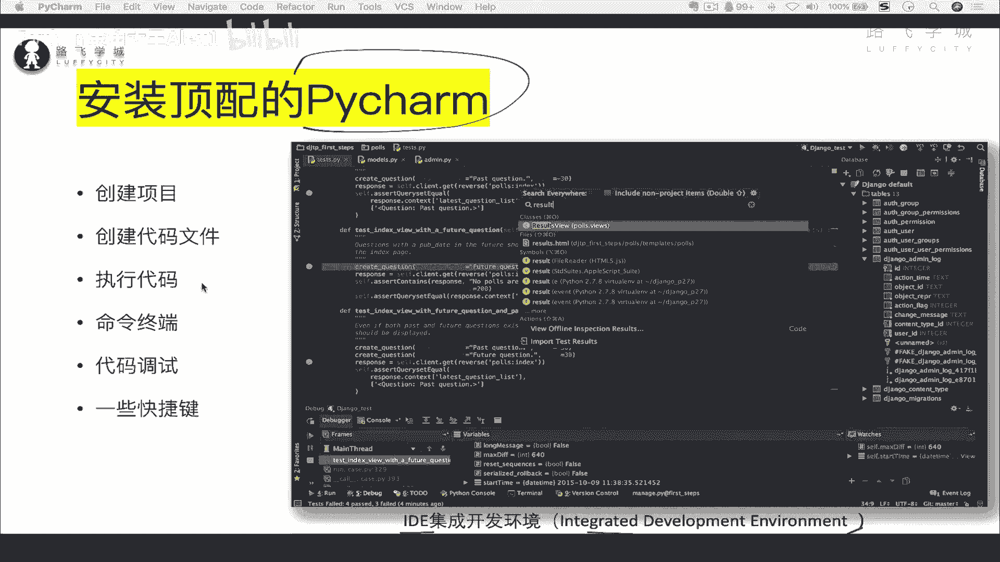

哦执行代码，然后命令终端对了，你还在这里可以直接把Python的命令终端调出来，看着啊，下面有一个叫terminal，看到没有，这个terminal直接相当于如就如果你是windows的话。

就帮你把那个windows那个那个那个那个那个DOS文道，doc的那个啊命令黑框，把那个黑框自动相当于给你打开了是吧，你在这里就可以直接输入，你这里相当于输就是windows的那个黑框。

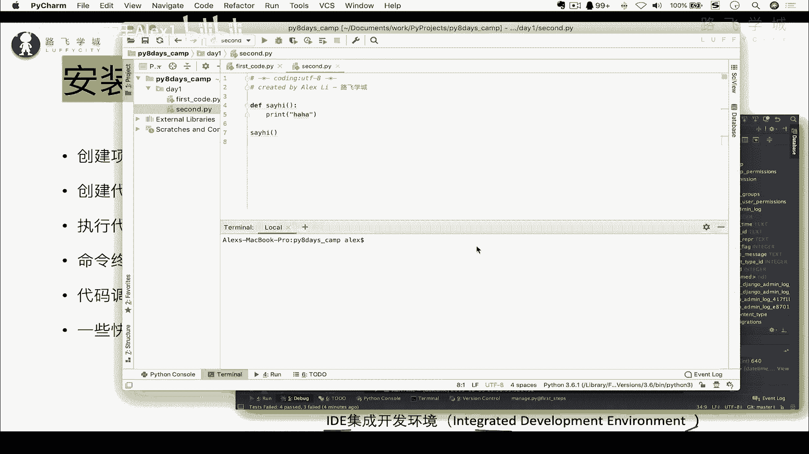

或者是Mac的这个终端，就相当于我Mac的这个终端。

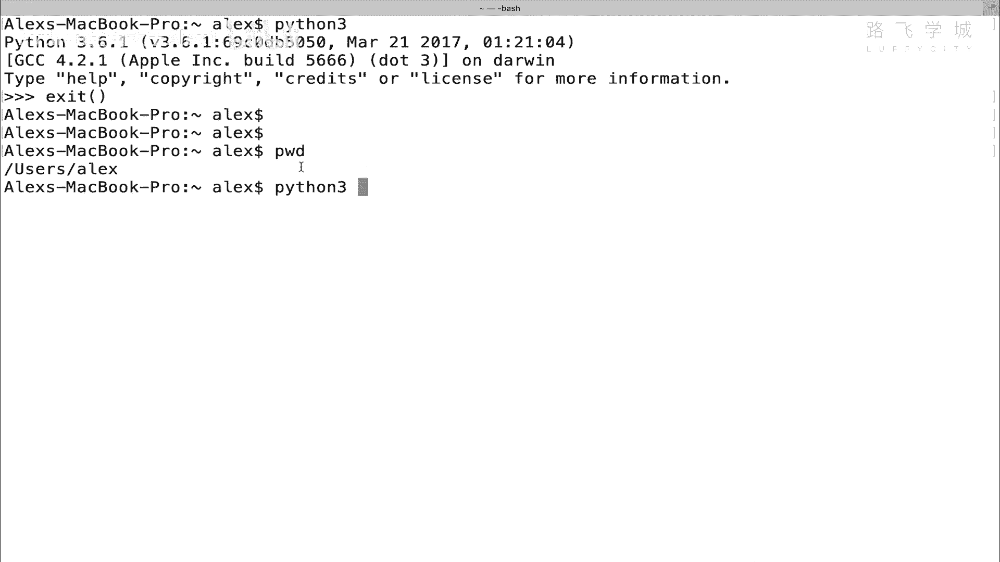

明白吗，你在这里可以直接写代码的，看到没有，哎我这次LINUX命令都没问题，然后我在这里还可以进入Python环境，看到没有，对不对啊对吧，可以可以干干任何事情对吧，没问题吧，哎我可以退出啊。

所以你这里给你集成了这个终端对吧，还给你直接集成了Python的这个什么呀，Console，这个，你你在这个这个终端是一个，相当于你操作系统的一个终端是吧，命令行中断。

然后你这里是直接Python环境给你进入了，看到没有，你直接进入Python环境了是吧，你在这里直接也可以写代码，那么还能提示，对不对啊是吧，有报错啊，总之你在这里先哦对这个是Python交互器对吧。

咱们叫Python交互器是吧，直接进入它的调控器，反正就是run to do，这个不用管啊，都不用管，所以这个是命令终端也给你了，OK吗，好就是这些，所以还是很方便的啊，还是很方很方便的。

并且它还有代码调试，代码调试的功能，嗯嗯代码调试功能我我现在就教给你吧对吧，很简单啊，很简单啊，我在这里大家来看一下，我在这打了五行代码，对不对，然后我在这里是啊，1sorry啊，123，看到没有啊。

我行代码就说，有的时候你写的这个代码可能变得复杂了之后，你想知道每一行执行每一行的时候啊，执行每一行的时候，这个啊这个叫什么呀，这个代码就是现在出现，就是你你你这个比如说一个变量。

但现在也是处于一个什么状态，对吧啊，比如说你这样吧，这样吧，N等于一，sorry啊，N等于一，然后你接下来干的事情是N加等于一是吧啊，然后你看执行了好几好几行，是不是好几行。

然后呢你想知道在这在执行到这一行的时候，这个N是几对吧，你就可以给他进行一个代码调试，代码调试呢给它加断点，加断点啊，看我这个点的红点了吗，这个东西叫做断点OK吗，这个断点是干嘛呢，断点是干嘛的。

就是它能让你看到程序走的每一步，注意了，你加上断点之后进行调试了，再调试，执行的时候看着右单击，不要点run，点这个debug debug，就是调试，看到没有，点debug一点看着啊，注意了，见证奇迹。

这个时候同志们，你看你的程序，你夹断的，它会从头开始走，走到你第一个断点，这个地方看到没有，程序就停在这了，程序停在这之后，你这里的时候你可以看啊，注意了，你这里看有一个叫variable。

variable就是变量的意思，也就是说你现在能看见，当前你这个程序走到这的时候，所有的变量六单击，看着啊，他们不用你来直接点，然后点一下这个special revival，注意了。

你看现在这里面有一些什么下划线开头，这些都是系统自带的一些，就这个Python Python解释器，要执行你这个文件自带的一些变量，你不用管啊，不用管，你现在开始点下一行，看着点走一步点。

这个是走一步啊，走一步看着看到没有，你看到看到一个什么了吗，这里是不是多了一个N，也就是说在这个时候这个状态下这个N是一，并且他把这个N等于一，在这里你看用这个灰色的字给你显示了。

你再点一行看看这个N啊对吧，你每点一行它就往下走，是不是这个N就变成二了，对不对，你先走到这一行了，这里也变成二了，对不对，你再点一行，当然后面没断点了，它就会结束了对吧，所以呢我告诉你这就是调试啊。

调试现在这个咱们代码不复杂，你看不出来代码复杂了之后，你就得看我操这一行，走到这一行对吧，我这个变量变成什么了，对不对啊，为什么不对呀，为什么什么呀啊为什么逻辑有问题啊，你都通过断点调试可以做出来。

这是很强大的一个功能啊，以后我们也会会用，好吧对最后再给大家教一些啊，这个快捷键快捷键刚才交了一个杠，CTRLD是不是CTRL我我我没有交是吧，CTRLCTRLDCTRL加DOK吗。

就输入一个CTRL键，一个D键啊，它就会可以复制这一行，看到没有复制这一行，OK然后你不想打印这些行的话，你还可以把这些代码进行注释，就不让他执行哦，注释这个功能我没交，现在就顺便交给你了，直接选中。

看到没有，直接选中哪些行，比如说这些不想用，对不对，选中，然后也是control加一个问号，CTRL加问号，加你这个问号上去，我把这个问号打出来OK吗，CTRL加问号就可以把这几行给它注释。

注释怎么注释，前面是井号，这个是Python的语法，加上井号就能把这一行给注释掉，在Python里面啊，它里面OK吗，这个是我我之前没交的，没交的，他现在一块交给你吧，啊改成注释。

OK这个就是咱们的这个啊开发工具，开发工具以后，我们再写代码就直接在这个里面了，好不好啊，你们自己把它下载安装，然后按照这几个，这几个这个这个这个这个这个这个这个什么呀。

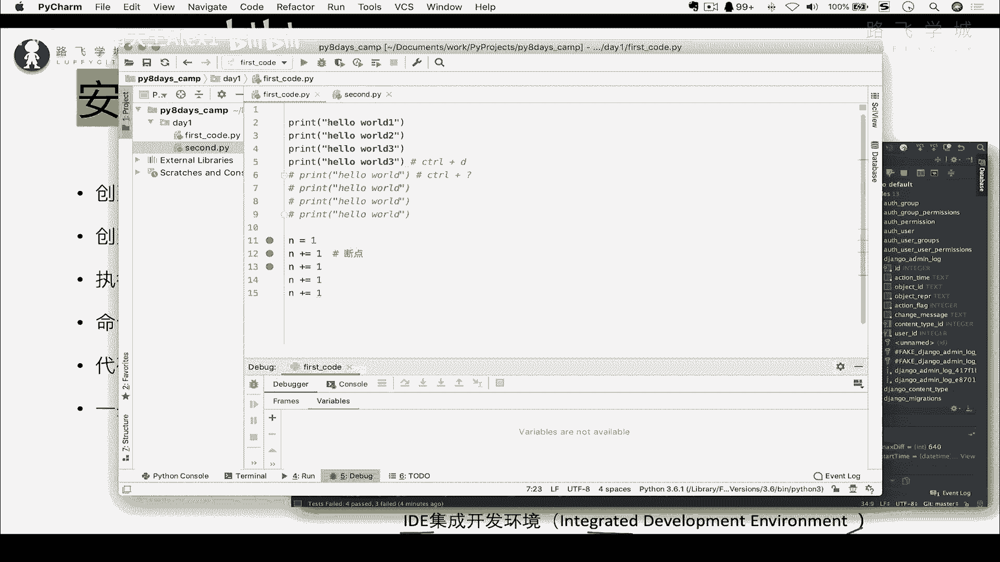

啊东西对吧。

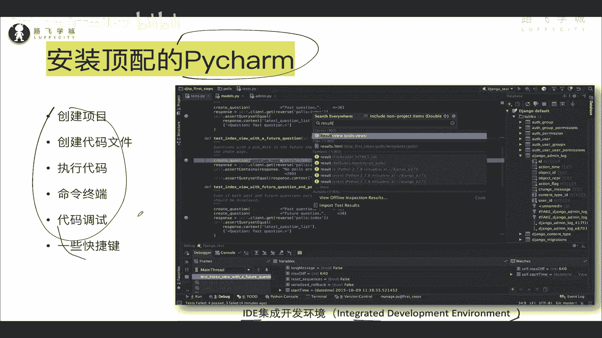