# 【2024年Python】8小时学会Excel数据分析、挖掘、清洗、可视化从入门到项目实战（完整版）学会可做项目 - P17：16 Python的代码缩进规范 - Python金角大王Alex1 - BV1gE421V7HF

OK同学们上节课啊，咱们提到的缩进，那这节课正式讲一下，大家看这个代码里面对吧，这个这个这个双分支里面，这里有两个缩进，对不对，在第一个条件里面有一个缩进，第二个条件有一个缩进是吧。

那并且这个缩进呢是四个空格啊，我打了一个tab键，我打了一个tab键，但它会被替换成四个空格啊，tab会被T就是你打一个tab键啊，会被替换成四个空格，相当于就是打了四个空格，那这是为什么呢。

也就是这个缩阴做的作用到底是什么啊，这个就是Python的一大特色啊，PYTH1大特色，就是说基本上就只有Python语言独有，那么一个一个一个要求，就是说你只要是什么呀，第二层代码相当于就是子子代码。

就必须要进行缩进，为什么，它的目的是为了让你的程序，让你整个程序知道每段代码依赖哪个条件，每段代码依赖哪个条件，比如说这段代码依赖这个条件，这段代码依赖这个条件，看到没有啊，如果不通过缩进来进行区分。

注意了没有缩进对吧，全都是这种顶层代码，看到没有，那程序怎么会知道你的条件成立之后，我是要执行这个代码，还是要执行这个代码，还是要执行这个代码，明白意思吧，就是条件成立之后。

他不知道要要因为他们没有层级关系，没有层级关系，对不对，对对对，程序来讲他是没办法区分的，说哎我我怎么去区分呀，我怎么区分我要去执行哪个，所以就是说你通过一个缩进啊，只要一缩进成这个解释器。

就会一一看到缩进你就知道了啊，这里面的这个缩进里面的代码都是上一，都是这个上一个这个这个条件的子代码，没有意思吧，哎所以这个就是缩紧的作用，为了啊让你的解释器能自动的区分出来，这个代码的层级能这意思吧。

代码层级啊。

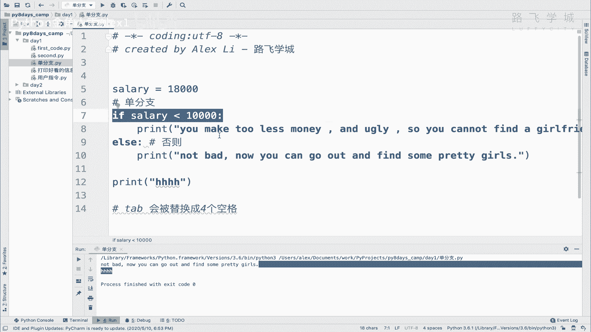

那为什么说这是Python独有的，因为在其他语言里，大家不是用缩进来去啊，去区分这个层级的，因为首先我们理解这个需求，需求就是他的目的，目的就是说为了区分这个代码的层级，是不是啊，就是哪个哪段代码跟哪。

是属于哪个的子代码对吧，在其他语言里，它不用缩进，他用的什么呢，他用的什么小括号啊，大括号的方式来实现的啊，我在这里给你贴一段代码。

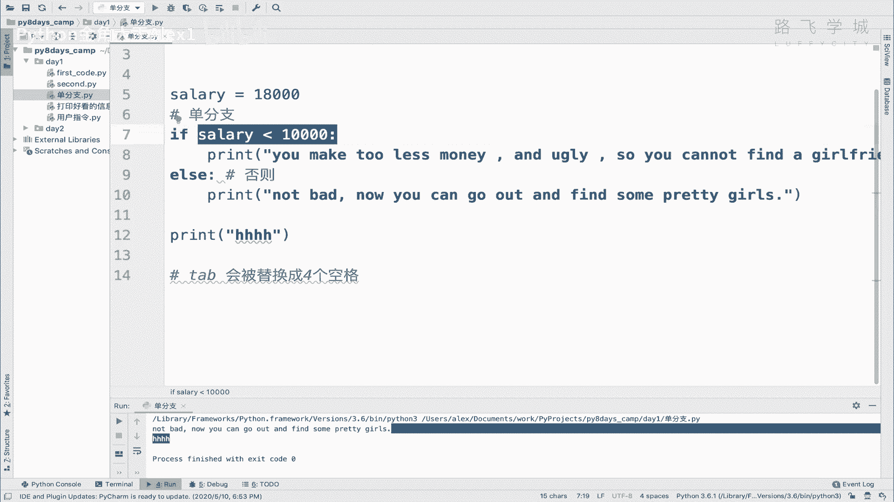

这段代码呢啊这段代码我直接给你贴过来，这段代码是这个什么呀，啊这个这个这个JS的代码，JAVASCRIPT是前端的代码啊，你你不用，你不用看红的，它它既是Python解释器，所以他报错啊。

但是你看他这个也有，这里也有else，但是它你看它这里面就没有缩进我这两行，你看我故意的，我可以缩进写，当然啊，但是我这样写其实也没有问题，我就直接顶行写也没有问题，为什么。

因为它不是通过缩进来区分层级，它是通过什么，看这有个大括号了吗，看到没有通过这个大括号，也就是说你写完这个条件之后，这里的有一个大括号，大括号开始到大括号结束，都是这个条件的子代码，明白吗。

那else也是一样对吧，开始大括号开始和结束都是它的子代码，所以它不需要通过缩进来去啊，进行这个什么，但是你会发现一个问题，那虽然通过这个大括号它可以实现啊，这种判断，这种就是吧。

看出来你这个是是是是哪个是它的子代码对吧，但是你会看上去非常的不清晰。

你直观人人眼来看非常不清晰，你就很难看出来层级。

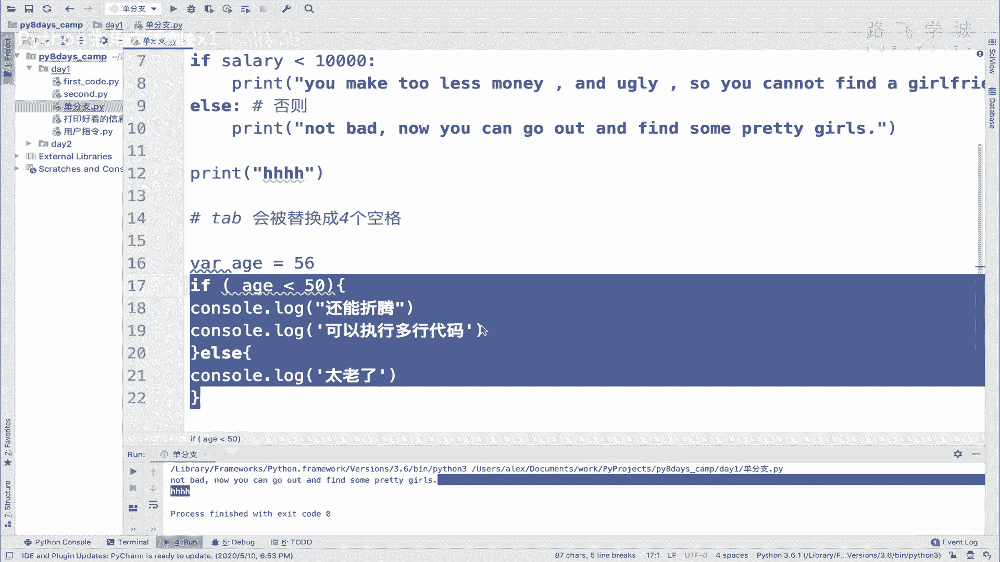

你看是不是啊对吧，但是你像Python的话，它就非常清晰，它很容易的看出来哦，这这是两段代码，对不对，他有两次对吧。

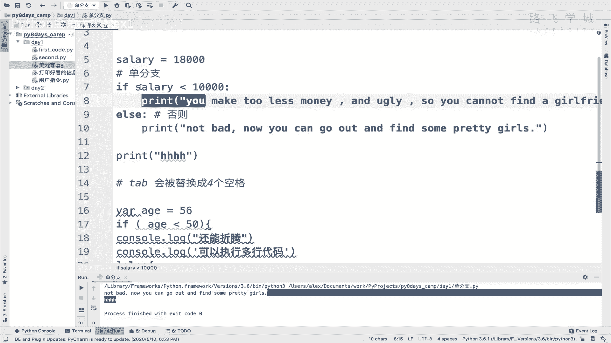

一个是这个层级，一个是这个层级对吧，它有两段代码，像这种的话，你得非常认真的看啊。

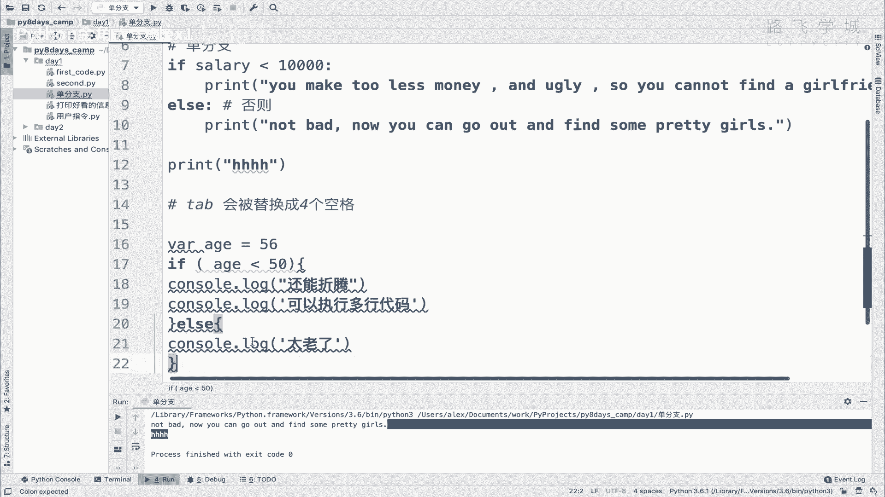

你赶上那种赶上那种不守规矩的程序员，野生程序员他就这么写对吧，这么写给你列出来50行对吧，你想去看那个代码，你就看不懂啊，非常的非常的这个这个这个这个啊不容易理解。

不清晰，不简明对吧。

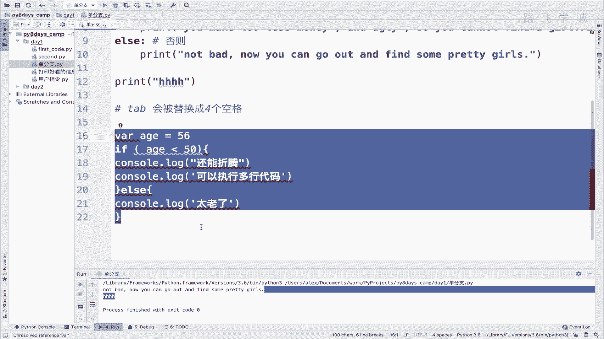

所以Python的这个特性就是简洁明了对吧，所以他在这个语语法上就强制你啊。

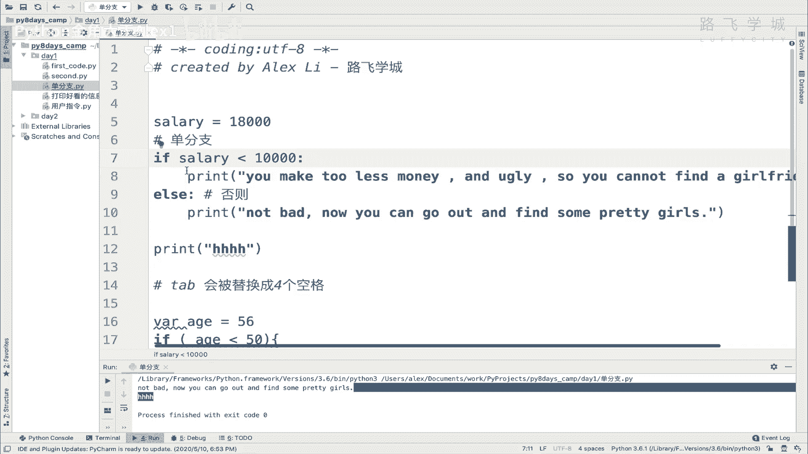

我也不用这个什么大括号啊，小括号啊，我就直接这样强制你对吧，这个通过缩进来表示明白吗，这个就是它的一个啊一个缩减的作用啊。

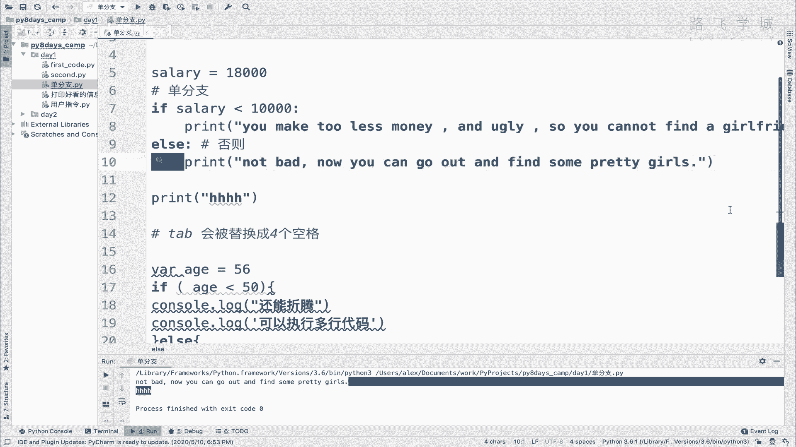

去确定代码层级啊，确定代码层级，那明白这个之后，我们来看一下啊，这个Python的缩进它是有几个原则的啊。

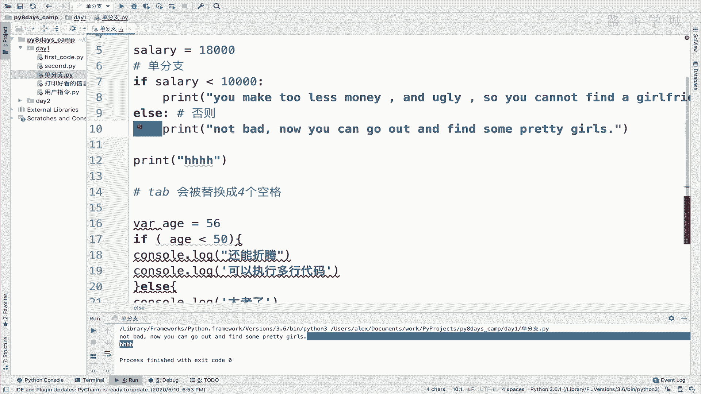

有几个原则的啊，它有哪几个原则呢，第一个原则叫什么呀，顶级代码必须顶行写啊，顶级代码必须顶行写啊，我在这里直接给你拿过来吧，拿不过来啊，我直接copy过来，顶级代码。

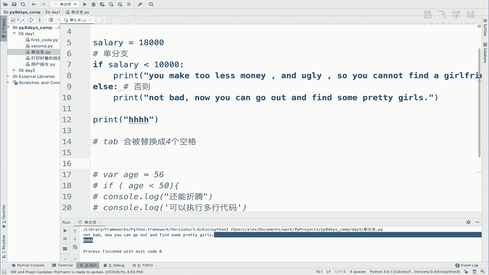

看看原则啊。

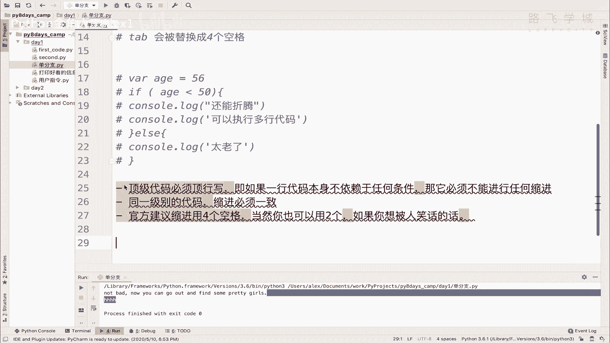

顶级代码顶行写什么意思，也就是说他如果这个代码不任何，不依赖于任何条件，那他就必须顶行写，知道吧，它上面没有任何先天条件，先天的这个说对吧，是属于谁的子代码的话，那他就是顶级代码对吧啊，顶上写，然后呢。

同一级别的代码缩进必须一致，什么意思，同一级别代码，你看啊，现在这俩都是子集的，对不对，子代码，那呃sorry，这一行是子代码，然后呢我在这再加一行print啊，呵呵对吧。

那这个时候他俩是同一级的子代码，这个时候呢你的缩紧必须一致，你不能你不能这样看到没有，你这样他直接报错了啊，你看这两个相当于他认为又是两级了，所以你你同一级别的代码必须得同，就是缩进是一致的。

你看这样看着就很清晰，对不对啊，很清晰，然后呢，你这个代码的这个代码的这个叫叫叫什么呀，这个这个缩进的啊，风格你可以用四个空格，这是官方建议的，Python官方建议要用四个空格。

也就是你在PTAP上打一个tab键，就是四个空格OK吗，那当然你也可以用两个空格啊，你要用两个空格，比如说你直接打两个对吧，直接手动打两个，但是这样的话这个什么呀，这这个是是是是它它就不规范，你懂吧。

就不规范，就相当于是说你不要闯红灯是吧，你非要闯红灯，你闯红灯啊，这个怎么想啊，这个这个这个在中国这个情况下，这个大家都都都是这么干，但是啊不代表这是对的，对不对啊，不代表这是对的。

所以就是说关你要遵守官方的规范啊，官方规范虽然你写两个他也不出错，他不会报错，明白吗，他不会报错，只要你缩进一致，你写一个空格都不会报错，但是你不要这么写，明白这意思吧，好这个就是缩进的三大原则啊。

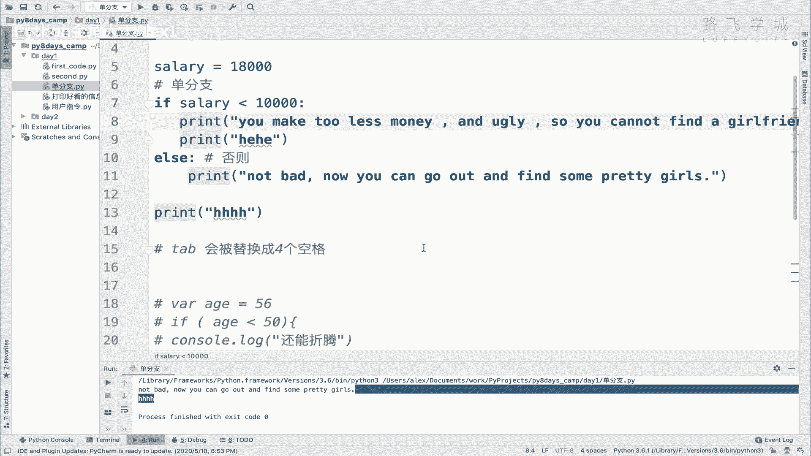

就很简单，你遵循这三个原则就OK了，可以吗。

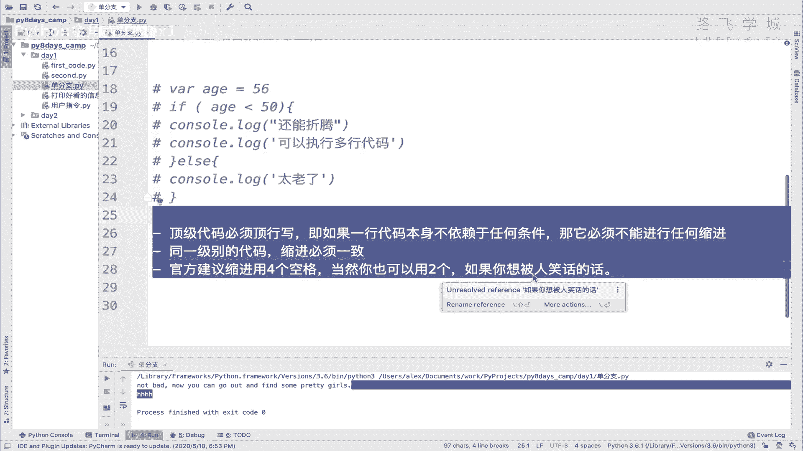