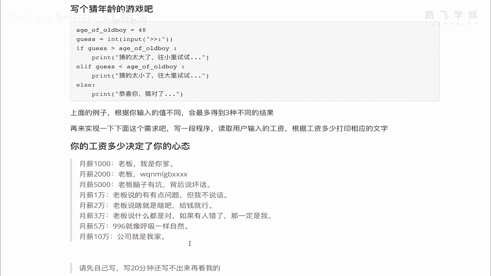
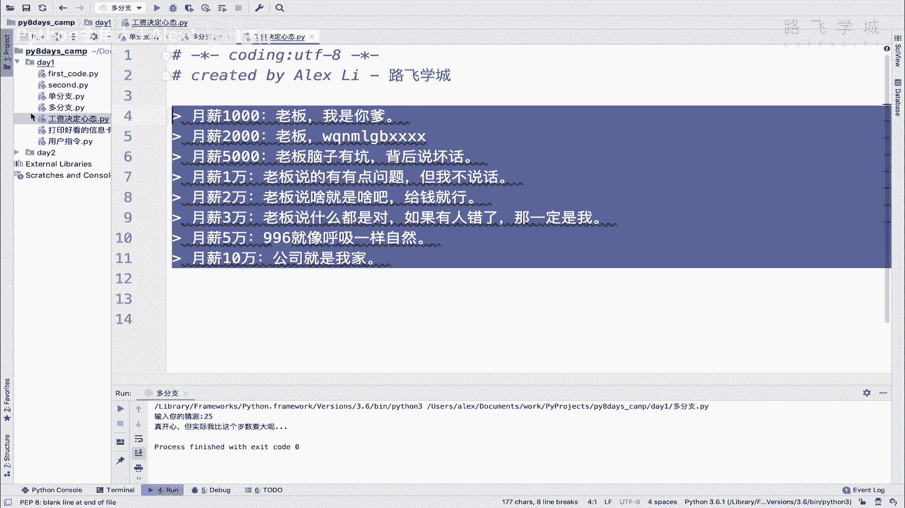
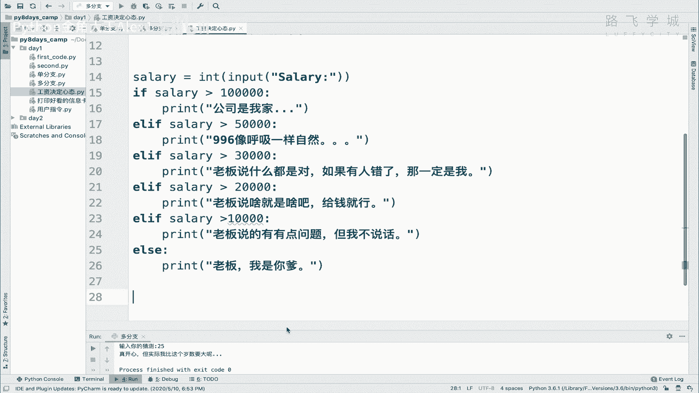
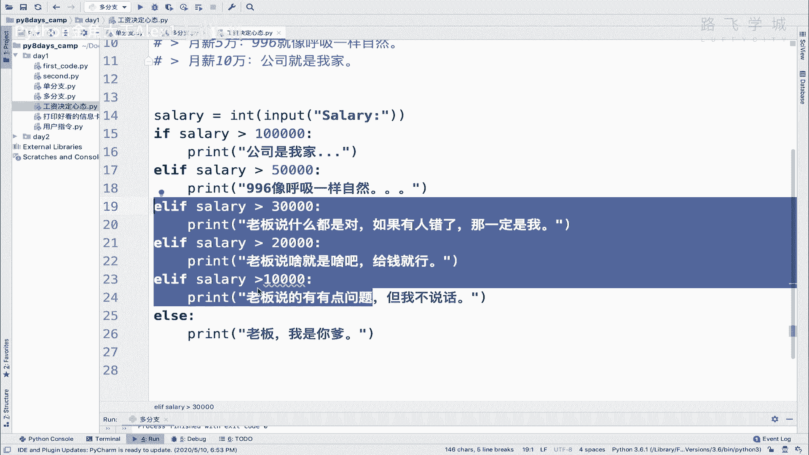
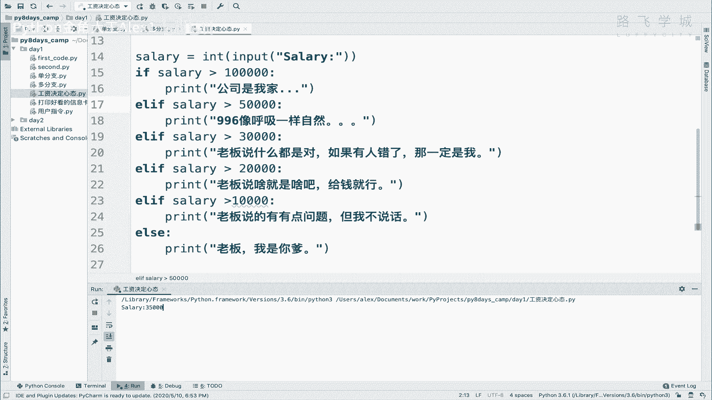
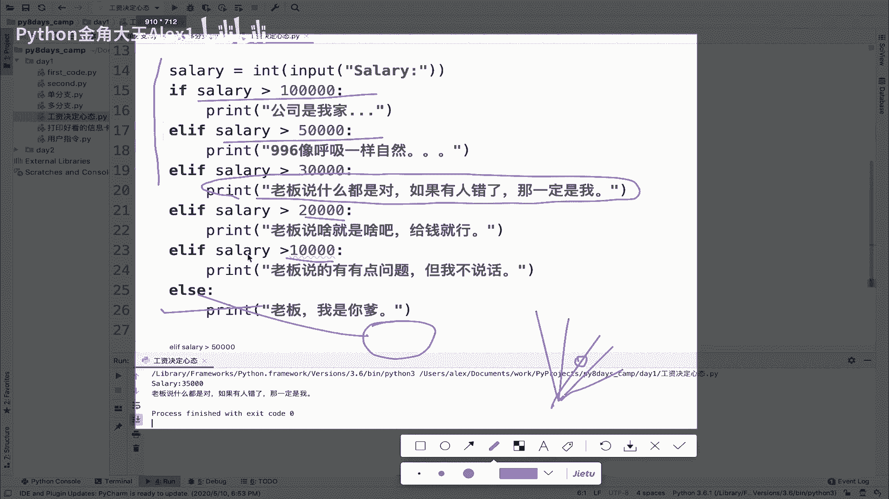
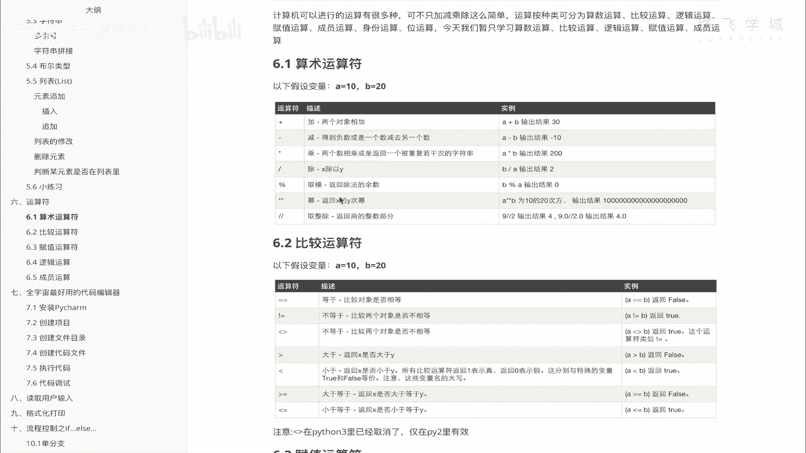

# 【2024年Python】8小时学会Excel数据分析、挖掘、清洗、可视化从入门到项目实战（完整版）学会可做项目 - P19：18 你的工资决定你的心态程序实现 - Python金角大王Alex1 - BV1gE421V7HF

OK同学们，今天最后一个视频，咱们帮你把这个小练习给你实现一下啊，实现一下，看跟你自己编出来的那个有没有什么不一样，好吧，那我在这里创建一个代码啊，叫什么呀，叫所工资决定心态啊，其实还真是这样的。

对不对，那些老板们，我自己也做老板对吧，你这个东西说白了你给员工发的工资又低，然后你还想让人家努力干活，其实又不傻，对不对，这个东西就是这样是吧，这个这个这个嗯，大家都不能光站在自己的角度对吧。

那你给人家发5000块钱的工资，还想人家多努力，这不可能啊，不可能，Anyway，这个来咱们把这个这一段粘过来好吧，这段粘过来啊，不用粘过。

粘过来，这是咱们的需求是吧。

然后呢我们来看啊，月薪就是他反正就是说白了其实多个条，多个结果，那你就啊写多个LF嘛对吧，我们可以啊，就是先从这个10万开始判断起，就是说如果他你输的工资大于10万，那公司就是我家大于等于10万对吧。

然后再就是大于等于5万，大于等于3万好不好，那我们就先让用户输入对吧啊，your salary是吧，那个也是int一下，给个input，salary是吧，然后if这个salary是吧。

大于一个10万是吧，那就print，对不对，公司是我家是吧，很简单，是不是啊，那否则的话注意了LF对吧，如果不大于10万啊，不大于100000lf salary是吧，大于个大于等于一。

我就直接大于大于5万是吧，这多少这50万是吧，想钱想疯了，是不是啊，这个996是吧，像呼吸一样好自然，OK然后呢再就是什么呀，再就是大于一个lf salary大于个3万是吧，3万也挺好啊。

3万在北京对吧，在一线城市也算是这个不错了啊，我们那一个老师相当于一个正常的吧，讲的还算OK的，老师啊，也不算是最牛逼的，基本上就3万块钱啊，3万块钱是吧，那老板哎老板说什么是对的啊，如果有人错了。

所以你会发现我们那个是挣得多的老师，大家就感觉每天还挺开心，这个虽然很累啊，他们也很辛苦，每天讲课，但是很开心啊，因为挣钱多嘛对吧，那如果LF啊这个什么呢，这个salary啊大于个2万，对不对。

那大于2万其实是一个很稀松平常的一个公司，在这个一线城市，对不对啊，其他行业咱不知道啊，但是在这个IT行业，2万块钱其实算是很普通的啊，那大于2万相当于老板说啥就是啥，给钱就行对吧。

还有大于1万的对吧啊，LF我就不全写了啊对吧，这个时间有限大于1万是吧，然后我就print是吧，这个老板说的有点问题，但我不说话，老板说的有点问题，但是对吧，那假如咱们判断到这。

最后也就咱就不判断什么5000啊，2000的了，咱们就最后直接写一个else，也就是说如果还小于1万对吧啊，你的工资小于1万，我跟你讲啊，甭管你是做什么行业对吧，你要在一线城市。

你工资如果挣不到1万块钱啊，其实算是，反正就是就就就只能维持生存的那个阶段，是不是只能维持生存，你自己想办法往上蹦啊，想办法往上奔啊对吧，这个那你就直接说吧，啊老板我是你爹，对同学们啊。

你的工资只要低于1万，你就去骂老板就行了，OK所以注意了。

这是上面这几个多个分支之后，最后如果都不符合对吧。

也就小于1万了，小于1万我就直接走最后一个条件，明白吗，那我们执行一下，大家来看一下对吧，执行一下，我输入我的工资是吧，是9万啊，那996对不对，然后输入一个4万是吧，老板说什么都是对的对吧。

然后呢输入一个8000是吧，我是你爹啊，所以这个多个条件就出来了，这个时候我再输入一个呃3万5吧对吧。

输入一个3万5，我想跟大家来看一下啊，咱看一下这个执行的流程是吧，看下执行的流程啊，那啊如果大于个三，如果输的是3万5，首先这个条件不满足对吧，这个条件也不满足，那这个条件是不是满足的。

它所以它会so这个条件对不对，走这个条件啊，这个条件是满足的，但是同学们这里带来一个问题，我问你啊，我说的是3万5，它大不大于这个2万大于，对不对，3万5大于这个他也满足这个呀。

所以这几个条件他都满足啊，对吧啊，这几个这三个条件，至少这三个条件都满足，他为什么只走了这个这两个不走呢，唉这个就是上一节课我跟你讲的，这里你虽然有多条路对吧，但是经过了一系列的判断之后，你只能走一条。

你比如说你选择了这条路，那其他其他的这两条路你都不会走了啊，其他这几条路都不会走，只会走一条诶，这个也是一样的，整个程序它会由上到下往下走对吧，每一个条件去判断，当他发现有一个条件符合了。

比如说这个条件满足了，他就执行了这个执行了这个之后，后面的这些即便满足它也不走了，这个非常关键，一定要了解啊，就是后面这些条件即便满足他也不走，就是从上到下发现一个条件满足，它就会执行，会执行就结束了。

理解吗啊执行就结束了，OK那这个是你要知道的，另外一个就是这个else，这个else是所有条件不满足才会走else，注意了啊，所有条件都不满足才会读else，当else不是你必须要加的。

也就是说我是不是有同学说，我是不是必须要配合elf，那你可以不写这个，你如果不写这个，他就走到这儿。

走到这，如果没有了，后面就没了，明白这意思吗，所以呢我也可以在这里去掉对吧，去掉之后呢，它只会判断到1万这个地方，我如如果输了一个9000，你看他就没反应了，他就不走了，因为你后面没东西了是吧。

9000是上面条件都不满足，不满足也就结束了，所以else不是必须的，但是一般我们会把L放上，因为你上那么多条件了，你总会是要思考，如果条件都不满足，我总得给用户指条明路吧是吧，让他最后走哪条路。

明白这意思吗，啊这个就是说了两个点啊，第一个点是吧啊，程序由上往下啊，由上网下发现一个条件满足就执行啊，就是执行就不再不再不再往下判断对吧，哎这是一个另外一个else，最后的啊，最后的else是吧。

是代表啊，所有当所有条件都不满足时的最后第一条路，对吧啊，当然你也可以不给人留最后一条路对吧，他不是必须的啊对吧啊，但一般我们会加上一个else，就OK这个就是咱们的这个小程序是吧。

你把后面那个五千两千的自己加上就行了好吧，那你可以看一下跟我写的是不是一样啊，是不一样，那接下来到这里为止，咱们今天内容其实就讲完了啊，今天内容讲完了，这个什么讲了什么输入啊，格式化，打印呀，变量啊。

对吧啊，这个流程控制，那接下来今天有一个小的综合练习题啊，综合练习题你把这个做出来，代表今天内容掌握了匹配成绩的小程序啊，那这个这个什么呢，呃叫咱们一般学校里成绩都有ABCDE嘛，几个等级对吧。

五个等级，然后呢与分数的对应关系是这样的，当你90~100分对吧，你得90~100分就是A，80~89就是B对吧，六十七十九就是C1次啊一次，然后呢啊之前，然后呢你要求用户输入0~100的数字。

注意了0~100的数字啊，也不用输入太大了，然后你能正确的打印它对应的乘积等级，比如说他输的是75，你就打印是什么呀，是这个C明白吗，哎这个就用到咱们的多分支，也用到这个用户输入，对不对。

你能把这个练习题自己做出来，OK那代表你今天的内容就全掌握了，好不好，哎咱们非常不容易，你能坚持学完一天给你点赞好棒，OK今天咱们就到这里加油，明天有新的挑战啊。

