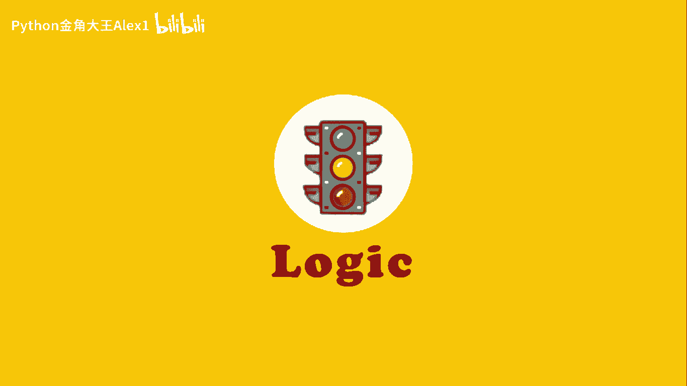
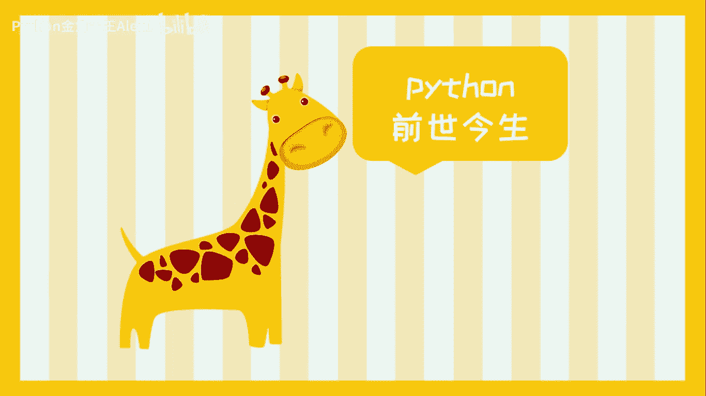
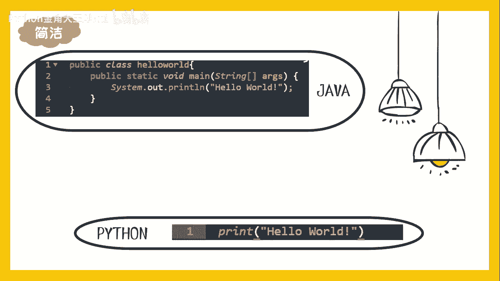
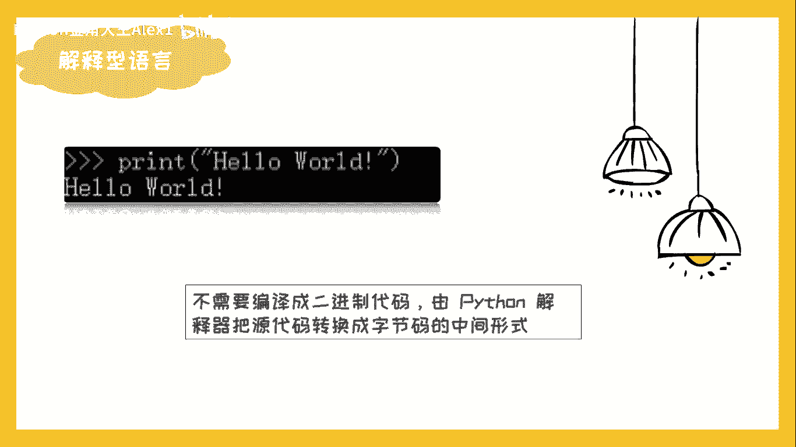
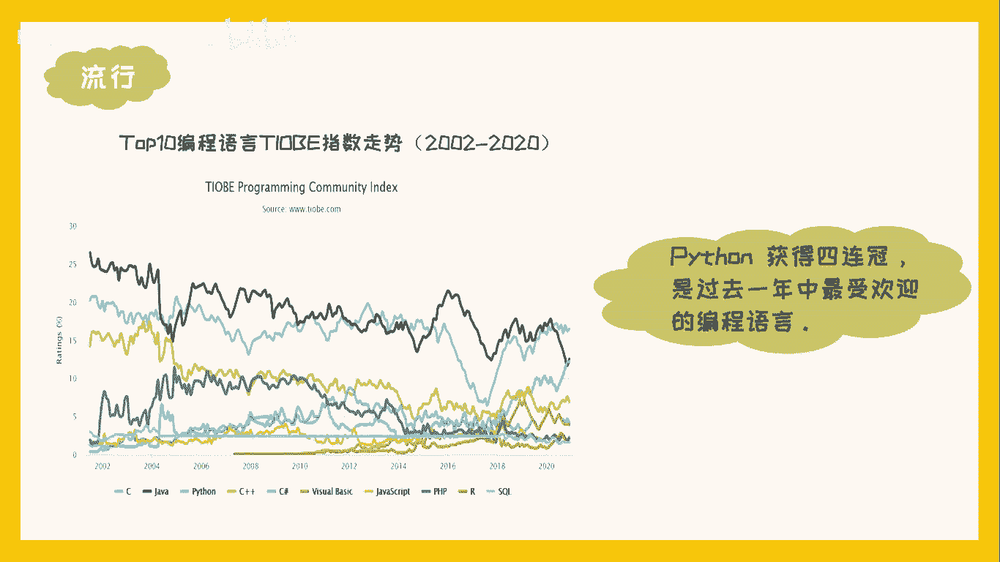

# 【2024年Python】8小时学会Excel数据分析、挖掘、清洗、可视化从入门到项目实战（完整版）学会可做项目 - P1：python的前世今生 - Python金角大王Alex1 - BV1gE421V7HF

大家好，学习Python，首先就要了解Python的前世今生，世界上有众多的编程语言。

在茫茫的编程大海中，我们为什么要选择开放呢。

首先请听我讲一个故事，实际上，编程语言的发明，大多都是源于人们对现状的不满意，有一天，荷兰的程序员归属widow then ROM，认为当时的各类编程语言十分复杂，麻烦，便发明了一门功能强大。

语法简洁的新语言，Python开放的设计理念就是优雅明确简单，所以对于初学者来说，Python是最合适不过的语言了，在1989年的圣诞节，龟叔开始着手编写新的脚本，解释程序，到1991年。

第一个用C语言编写的开放编译器问世了，龟叔慷慨大方的把开放开放给所有人，让拍放在众多程序员的呵护之下，逐步强化，1994年1月开放新版本，一部2000年开放二诞生，2008年开放3。0成功面试。

开放逐步成为一门现代化的编程语言，归属的体恤上印有人生苦短，我用Python的字样，这句话不止表达出他本人对拍放的爱，也说明了拍放的高效，它为什么叫Python呢，一个编程语言能和蟒蛇有啥关系。

难不成龟叔喜欢蟒蛇，实际上之所以取这么个名字，是因为龟叔当时在追一个英国喜剧，Multi paythslide circus，于是便用像团体的名字来命名，新程序语言的名字，而之后由于这个名字的缘故。

Python的logo被设计成两条排尿的骏马，随着大数据，人工智能的兴起，开放风头无两，在数据科学和机器学习中得到广泛应用，全球范围内如同海啸一般的数据，通过开放进行收集整理分析。

应用将会不断造福整个社会，许多知名网站如豆瓣，知乎，谷歌等都使用开放开发，曾经风靡一时的阴阳师和魔兽世界。

都是利用Python开发的，Python的代码非常简洁，易于读写，你会发现你读起来就像在读英文一样，我们将它与编程语文章的一对比，是不是一目了然。

Python还是一门解释型语言，Python代码不需要编译成二进制代码，而是由开放解释器，把源代码转换成字节码的中间形式直接运行。

并且开放具有丰富的库，当然想要使用某个功能时，他人说不定已经帮你写好了，因此他大大提高了工作效率，在top是编程语言，TF指数走势上，我们也可以发现，Python是过去一年来最受欢迎的编程语言。

还在等什么。

