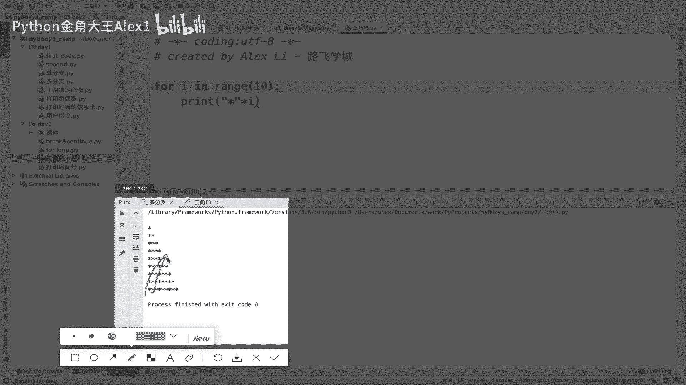
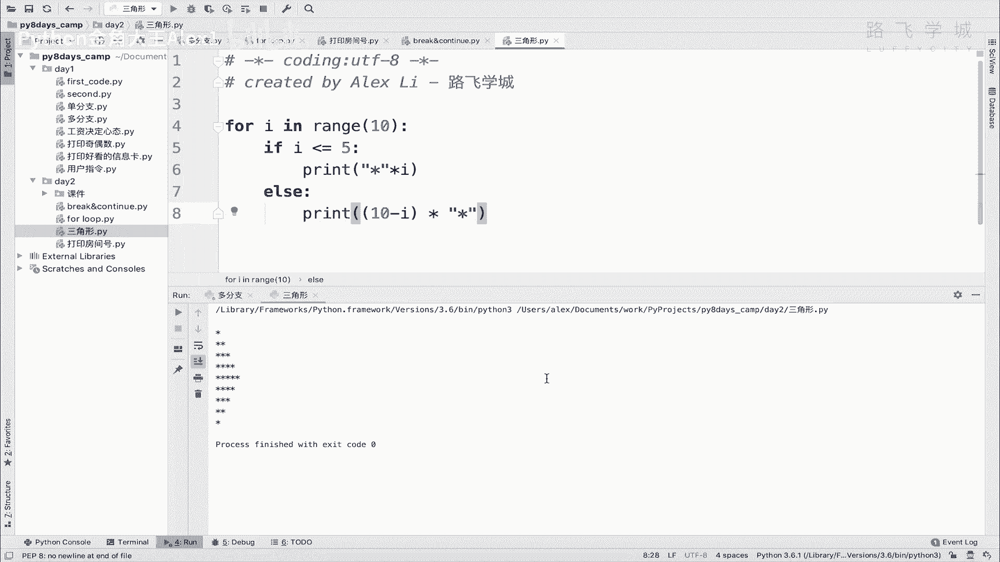

# 【2024年Python】8小时学会Excel数据分析、挖掘、清洗、可视化从入门到项目实战（完整版）学会可做项目 - P23：04 for循环打印三角形 - Python金角大王Alex1 - BV1gE421V7HF

OK同学们，这个小节呢咱们来练习一个啊，打印三角形的这么一个小程序啊，小程序呃，需求在这了，你就给我打印成长这个样就行了，看到没有啊，通过星号相当于对不对，把这个三角形给它堆积出来。

大家来分析一下这个形状，分析一下这个形状啊，你看是不是相当于啊一行一个星号，这一行两个星号，这一行三个星号，四个五个就把它堆起来了，对不对，然后呢再四个三个四个对吧。

最终看出来的结果就像是一个啊三角形是吧，那相当于用循环我们打印个十行，我们知道怎么弄，对不对，打印十行，每一行不断的加一嘛，看到没，每每一行这个信号不断的往上加，看到没有，咱们来试一下。

不断的往上加怎么做啊，诶诶我的，啊在这在这啊这就放大吧，打印三角形，Ok，啊你们听视频会不会听睡着啊，我这个这个这个这个由于就担心时间录的长，对吧，一个都十来分钟啊。

这中间呢就导致时间限制不能像线下一样，我给是吧，这个这个这个讲一点有的没的，开开玩笑扯扯淡是吧，可能是讲干货啊，没有没有没有什么鸡汤什么的，Anyway，这个打印多少啊，十行对不对。

每行这个星号加一对吧，每每行多一个星号是吧，坚持一下啊，咱们是目标驱动是吧，先打印一个型号，就每一次每一行就每一次循环打印一个型号，这个就很简单，对不对是吧，然后但是我们想要的是每一次一个星号。

就每一行多一个星号，那怎么办对吧，形成一个I呀，是不是因为你每一次循环这个I就加一嘛，是不是啊，所以呢形成一个I，你会发现诶这不一个三角形就出来了吗，对不对，但是这个三角形还不行，这是一个直角三角形。

人家要的是一个什么呀，这种等边三角形啊，不是不是等边三角形，这两边这个边相等的三角形，看到没有啊，相当于那这个问题就来了。

看到你这个三角形就变成了走到第五行的时候，看到没有，走到这个第五行的时候，从这个地方再往下看，到没有，再往下这么去，一个个在变少啊，这么一个三角形的玩法，那可怎么办呀，那可怎么办呀，嗯其实很简单。

在里面加逻辑判断就行了，你判断你当前这次循环是第几行，如果他是小于等于五的，比如说小于等于五，对不对，那我就继续不断的往上，每每循环一次就加，如果超过五了，比如说这个当前的循环次数超过五了。

我就每次就减对啊，就就就就拿这个剪一下，就是拿谁剪呢。

注意了啊，拿谁剪呢对吧，走到的时候再看吧，呵呵走到时候再看吧，那所以我们在这里做判断，if这个I小于等于五，是不是啊，我们就直接是这样的是吧，那你会发现它只打印了五个，对不对。

再接下来它是不是往下走啊对吧，在接下来第六次循环，他应该往下走，那我怎么实现让他打印四呢，怎么实现让它打印四呢对吧，第六次循环的时候让他打印四，很简单呀，同志们，你想一想，第六次循环的时候让它打印四。

Very good，想到了诶，想到了你们想到了吗，你看第六次循环下说这个I是不是等于一个六，我是不是一共有十次循环，我让10-6，是不是就是四，第七次循环是不是10-7就是三，第八次循环是10-8。

就是二，对不对，所以我得出来的一个结果就是这样了对吧，l else else是吧，不小于就是大于嘛对吧，else然后我直接print这个什么呢，先去十减个I对吧，第六次循环就是六嘛，这个I就是六嘛。

减完I就是减完I就是四，相当于结果是四，然后乘以这个型号对吧，乘以S乘以你这个星号对吧，括起来啊，这样同志们啊，这样同志们嗯，那你就实现这个效果了，就来看是不是超级简单呀，是不是超级简单呀，对不对。

能理解这个逻辑吧，你自己琢磨一下是吧，OK那这个三角形的小练习咱们就实现了啊，还是那句话。

