# 【2024年Python】8小时学会Excel数据分析、挖掘、清洗、可视化从入门到项目实战（完整版）学会可做项目 - P26：07 京牌摇号小程序 - Python金角大王Alex1 - BV1gE421V7HF

OK同学们，这节课呢，咱们来学一个叫京牌摇号的一个小程序，的一个练习题，那它还是一个练习题，这个比前面稍微复杂一些，还有同学问说，哎你会发现这个你怎么搞了那么多练习题啊，其实就是说为了让大家大量的练。

因为呢编程啊，编程大家记住它是一门实践性的学科，实践性的学科什么意思，就是说他就跟学自行车学开车是一样的，它需要大量的练习啊，它可不是一门叫知识性的学科，什么叫知识性学科，为什么我们的英语学不好啊。

大学上学的时候就是因为啊都哑巴英语，因为一就是因为你用错了方法，你把一门实践性的学科，像英语，它就是实践性的学科，当成了一门知识理论学科来学，比如说像什么马克思主义啊，这属于属于理论性的学科。

你就靠死记硬背理解就行了，但是英语这种它是实践和大量的练对吧，所以你学的方法错了，就导致大家都是哑巴英语，对不对，大家都是养员。

But by me my english is very good oral english，对，那，那因为因为我后面有有专门参加过，系统性的培训啊，就学英语这种，所以就是把那个就就不是亚宾语。

不是哑巴英语了，不，Anyway，也就是说呃咱们这个编程我大概估了一下，你你可以自己去判断，就是说你这种看视频和你练他的这种比例，应该是一比三，一句话你你花一个小时看视频，应该花三个小时练习。

这样啊你才能什么呀，就就就这成长起来，哎有的同学就说嘛，哎我老师我代码能看到过，但我一到自己写没思路了，为什么没思路，为什么没思路，就是因为你写的太少，对吧啊，你写的太少导致对吧，你无从下手啊。

我从大概知道哎，这个东西是应该干嘛干嘛干嘛对吧，但是让你自己下手去做，你又不会做，就是这样啊对吧好，所以呢大家一定一定不要陷入一个叫啊做一个，做一个叫什么看客啊，说我只是看看就行了。

所以咱们这个集训营利设置了有大量的练习题，有作业，你必须要做啊对吧，这个甭管你是处于一个兴趣爱好也好，还是说处于一个转行，我就想把这个编程学好，找工作对吧，那你既然参加这个课了，大家就是对吧。

你你说白了你你你如果怎么讲，你你如果不按照正确的方法去学，那你以后就咱们这个八天很短就学完了，学一个基础，那你以后再去自己学也好，或报班学也好，只要你的方法不对，你你你还是学不好。

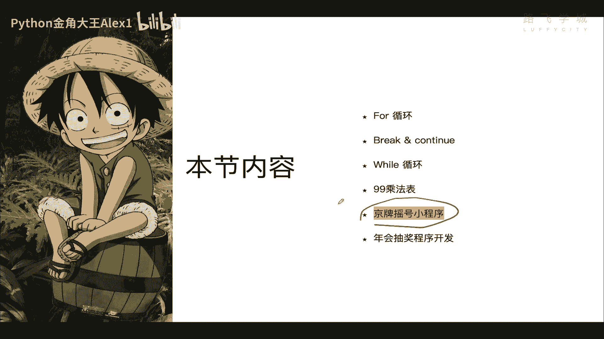

你还是学不好啊对吧，那咱们就进入咱们这个啊话题啊，课题这个摇摇号小程序啊，这个是一个摇号机啊，我记得我当时这个就是选车牌的时候啊，选车牌的时候，他那他给你一个就像ATM一样，让你在那上面选，每次1。1。

11点开始，他就给你出现啊，20个车牌号，20个车牌号可用的，然后你选择哪个，比如选那个选这个唉一点确定，那这就是你的车牌了，如果这一组你不满意，你还可以点换一换一组，他就又出来一组，能理解吗。

哎我就想让大家做一个这样的一个小程序啊，小程序对吧，每次给用户出现20个啊号码供他选，随机的20个号码供他选，如果他不满意，可以对吧，继续点下一个在下一个对吧，然后直到选到了为止。

我们在这里呢最多允许用户选三次对吧，这个应该知道很很很怎么做，就写一个循环就行了，好接下来每次放出20个车牌，但注意了他是随机车牌，随机车牌啊对吧，这这个可能就是一个问题，就是说怎么把这个随机的数字啊。

并且这个车牌是有有数字和字母再组合，对不对啊，把它实现出来OK吧，然后并且他这个车牌是有规则的啊，车牌是有规则的，什么意思，就是说啊你看前面这几个数啊，前面这几个数这个啊这个这个这个这个什么呀。

后面这几个值是随机的，看到没有，后面的是数字和字母随机，前面这个是固定的，前面这个是固定的啊，就是所以前面这个第一个字母应该是，就是从A到Z啊，他们不能是数字，反正这个我观察到的这个车是这个样子。

大家来看一下我这个车牌的规则啊，对吧，哎无形要无形装逼了啊对吧，这大家看这个看到看到这个什么标啊，对不对啊，这个这个是特斯拉啊，202016年就买了特斯拉啊，对不对，纯粹靠写代码写出来的。

一行一行代码垒出来一个特斯拉啊对吧，那个前段时间那个特斯拉的这个啊，这个这个类似他这种销售中心啊什么的，给我打电话，说说说这个ALEX你这个这个车要不要换啊，换新的呀。

这个我们新出的版的这个加速二点几秒还便宜，对不对，然后呢这个你拿你这个旧车去换，然后呢再加个多少钱，加个二三十万就可以换一辆新车啊，就这样的策略，我就告诉他，我说我不换，他说为什么呀，我说我我不要换啊。

这个为什么呢，因为我就要开这个旧的，我就要让别人知道我很早就有钱了啊，啊刚下出来，那大家来看一下这个车牌的这个呃，这个这个规则啊，就说你看前面这是我的真的车牌号啊，你可以去查也无所谓啊，没什么隐私。

前面这个是精Q看到没有，后边这个是是是这个什么呀，是这个随机可以变的，这个数呢就只能是A到Z大写字母，大写字母啊，后面这些是字母数字组合，所以你在第二个这个地方，它不能是数字，只能是字母好吗。

所以它其实是两组数据，两组数据啊，这个要随机限制在A到就是A到Z的大写字母，这个是数字和字母的组合，那么这是它的规则好，那知道这个规则之后，我们就来思考这个东西怎么做啊，这个东西怎么做吗。

如果想实现这个程序啊，有两个，我认为有两个问题要解决这两个问题，第一个呢你如何实现输出随机数对吧，咱们没学过，不知道怎么输出随机值啊，第二个呢就是随机值还要限定在数目，数字和字母的组合，对不对。

还不能有什么其他的特殊字符，还并且都是大写，所以呢其实难就难在这儿，只要能搞定随机数的问题，我们这个这个这个就可以做出来了，OK吗，所以呢我这个随机数啊，咱们在这个叫什么呀，课就是前面的课程里并没有讲。

并没有讲啊，所以呢它是一个超纲的知识，超纲的知识，但是呢咱们还是去需求驱动，所以呢我就借着这个需求，咱们就把那个啊需要的这个知识，给大家讲出来啊，讲出来对吧，这个做自己就咱们要输出随机数呢，你靠自己做。

我告诉你啊，就你现在这个能力你是做不了的啊，你做不了的啊，再学俩也可以，但是呢好，我告诉你这个这个Python它之所以强大一点，咱一开始就说了，它有丰富的啊，非常强大的一个叫什么呀，叫叫叫叫模块库。

模块库啊，这个模块库你可以理解为是弹药库，弹药库什么意思，就是说啊或者是工具箱工具箱啊，你想干什么事，你都可以从这个工具箱里啊找出相应的工具，找出相应的工具对吧，比如说你想往墙里砸一个钉子。

你就可以到工具箱里找锤子，对不对，哎所以呢咱们向输出随机数，那可以到这个工具箱里找一个，能直接产生随机值的随机数的那么一个啊模块，一个工具明白吗就可以了，OK所以咱们来学一下，诶我怎么去。

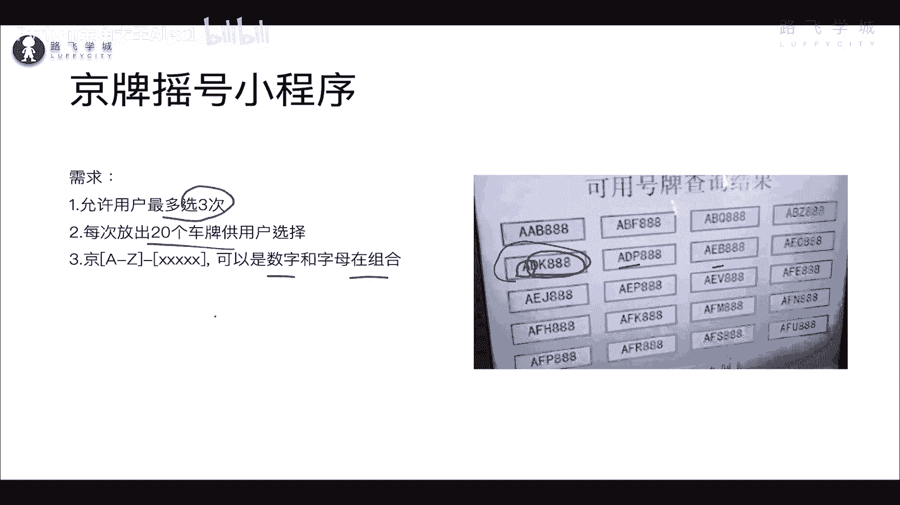

后挡后挡在这在这大家来看啊。

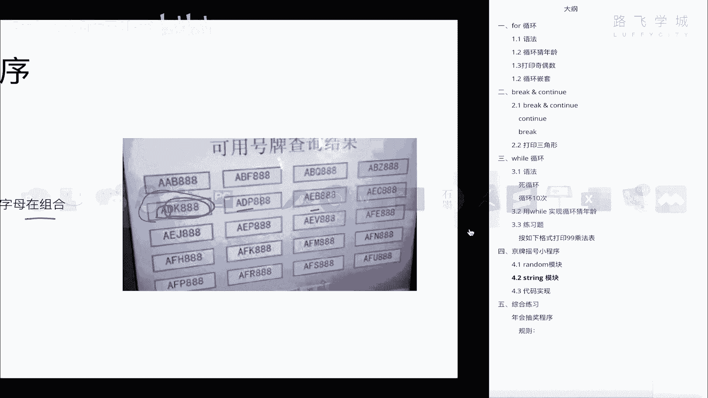

我们呢来先学一个咱们这个课，咱们这个要实现这个功能呢，需要两个模块，一个是random模块，一个stream模块，先来学这个random模块，OK吧，那这个random模块呢。

其实就是说产生指定范围内的随机数和字符串，随机数和字符串，OK啊，所以你要先干嘛呢，先导入这个工具啊，导入这个工具也就是你正常你的解释器，就因为它是工具箱啊，你不可能每天出门带着一个工具箱，对不对啊。

那所以但是如果你要确定是需要的，所以你就把这个工具箱对吧，拿出来，然后呢从里面导出来你要的一个工具，就找到你要的一个工具，所以import random，就相当于从工具箱里拿出来这个工具。

把这个模块加载到你这个程序里，明白吗，把这个模块加载你的程序里，OK你就可以在程序里就可以调用，就可以用它import导入导入的意思，random就是这个模块名OK吗，就是这个工具的名字。

然后呢接下来我们只学它里面三个用法啊，它里面其实是挺多用法的，但是我们只学三个，OK吧，只学三个给大家来这里看一下啊，诶诶，稍等啊，我怎么给他移过来，移不过来啊。

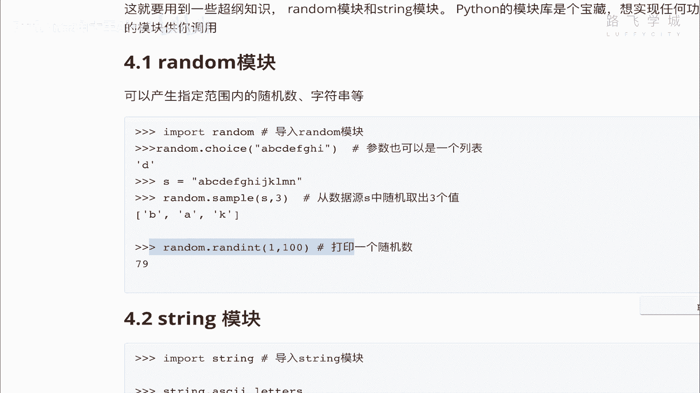

移不过来，移不过来，我在这里看吧，这里看也行。

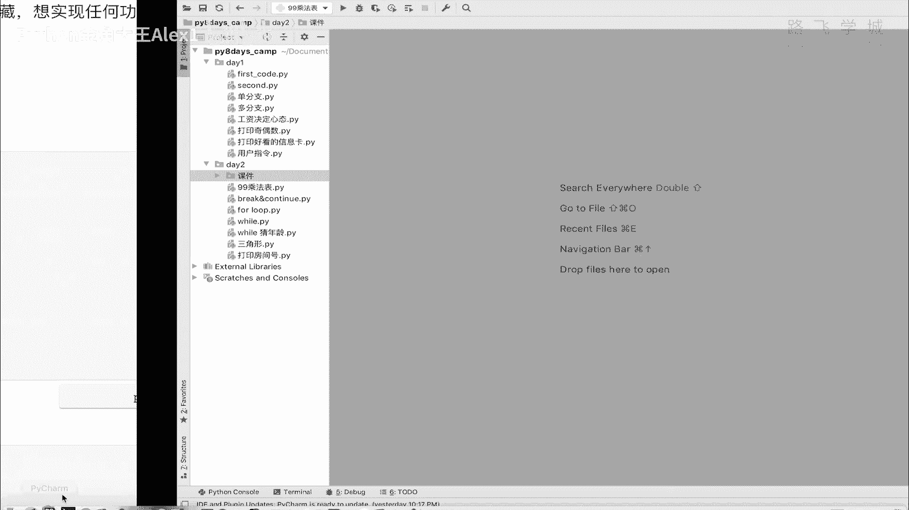

大家能看到我的屏幕是吧，这个没办法放大是OK，我们在这里直接import random，啊大家来看一下random呢，其实你看打一个tab键，它有很多的方法啊，那呃很多的这些功能。

但但是呢我们今天只学这三个啊。

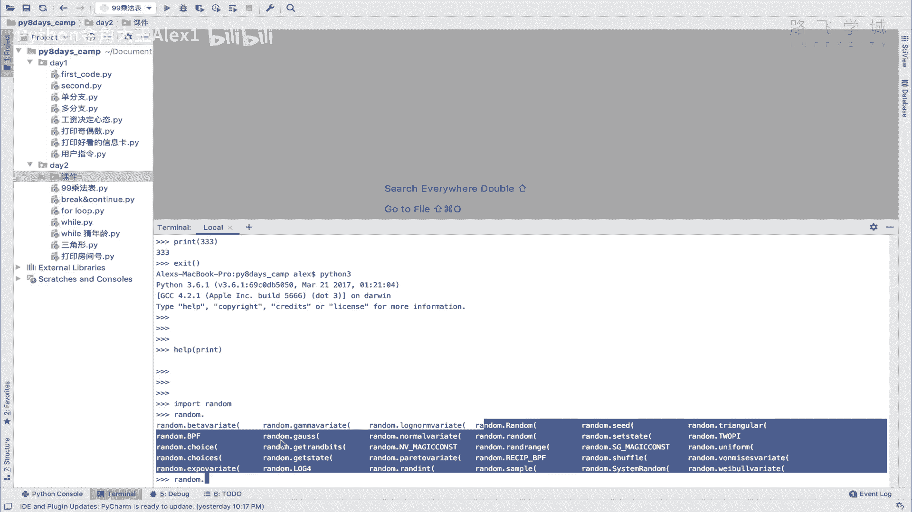

咱用到啥学啥对吧，用到一个用到哪几个呢。

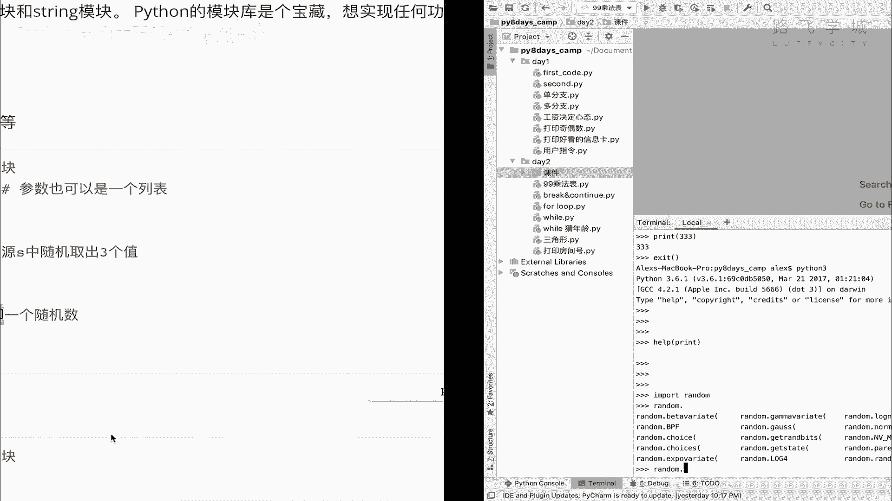

一个叫CHOS啊，这个一个叫三跑，一个叫random，这个choice大家来看是干嘛的啊，这个就看现象就能看，就看他的这个表现形式就知道了，你说了一段这个字符串进去对吧啊，然后呢他给你返回一个值。

这是什么意思，我告诉你，它是从这段字符串里面给你随机抽一个值进去。

也就是说你给它输入无论多少值对吧，它会从里面给你找出来一个值，ABCDEFGHIJJKLMN对吧，26个英文字母，你看啊，你每次输出都是不一样的，看到没有，它是随机的，同志们，它是随机的。

OK他根据他自己的一些算法，就给你从里面随机找一个值出来好吧，那同志们，如果也就是说如果有这就有这个东西的话。

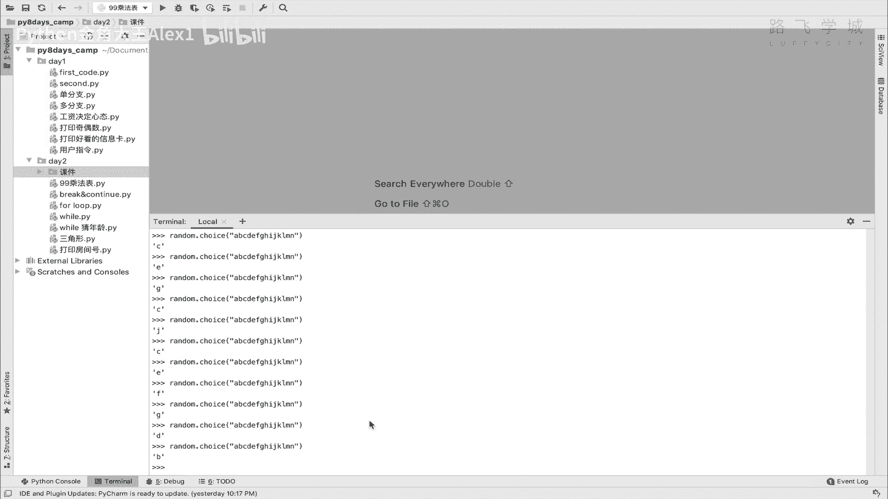

我们其实就可以解决我们第一个需求了。

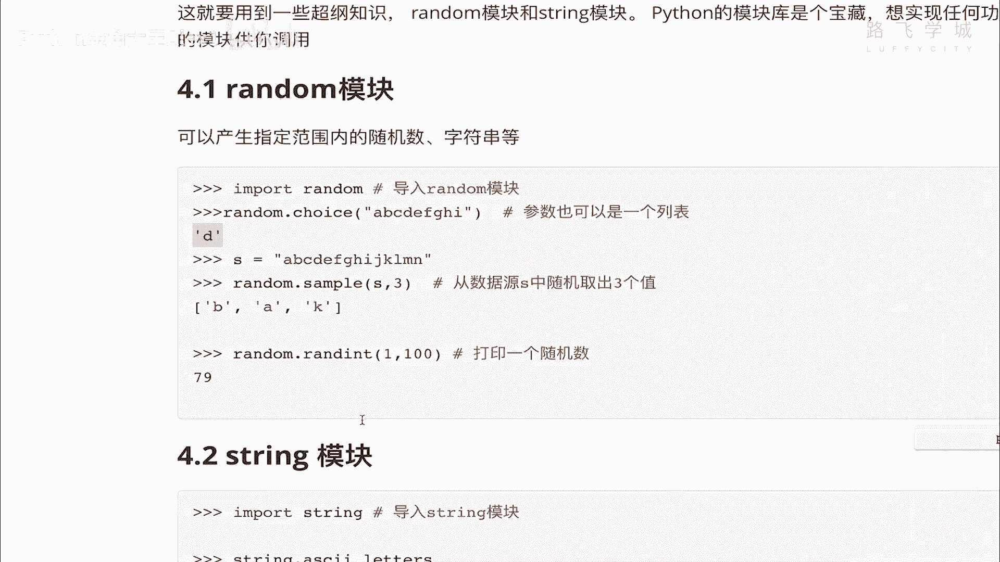

咱们第一个需求是什么呢，你这个车牌的第一个，第一个这个英文字母是一个是一个是第一个啊，这个号码是一个英文字母对吧，我们只需要并且限制到是A到Z，我们只需要通过choice，在咱们这个里面输入。

大26个大写的英文字母，对不对，他每次输出的就是一个随机的英文字母了，你说对不对，哎所以这个random choice啊。

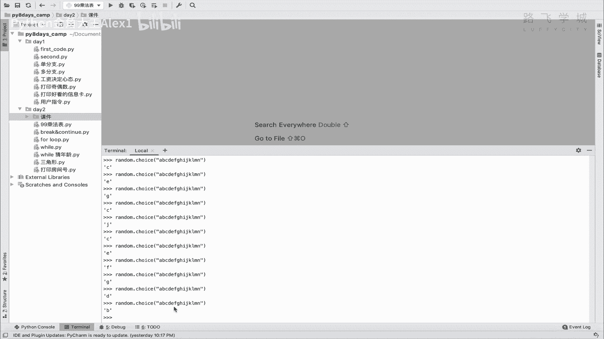

这个就能解决我们的啊，第一个小需求，就是第一个字母就插排在第一个字母的问题，然后呢第二个就是什么呀，这个这个叫叫叫random sample啊，random sample是干嘛的呢。

好再再补充一下这个choice choice。

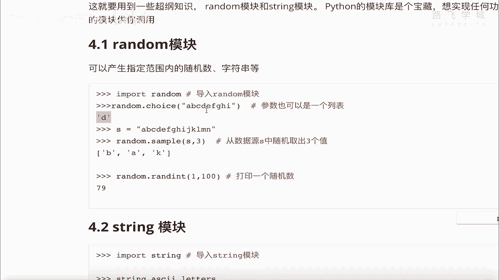

这里面不光是可以输入字符串，也可以提供一个列表啊，你把一个列表传进去也是一样的啊，列表传进去也是一样的啊，比如说等一个alex jack啊，然后rain对吧，假如说你传了三个元素进去，然后呢。

他也依然会给你随机产出一个产出一个值，看到没有看到没有，它其实是随机的啊，因为你三个太少了嘛，所以它它它有的时候看上去参数都一样，Anyway，这个是choice，那另外一个是sample。

sample的作用是什么啊，sample的作用是什么呢，我们来这个看一下看一下啊，这个叫我们生成一个列表吧，先生成一个列表啊，这就AA等一个list，啊20是吧，range是产生一个加上类似。

是不是产生一个列表啊，大家看我生成了一个列表，然后呢我在这里random点sample啊，看着你只需要把这个呃A传进去，然后呢哦对还差一个值，再输入一个三，比如说大家来看这个现象。

你自己推测一下它是干嘛用的啊，干嘛用的，想一想，他就是你传一个列表给他，对不对，这里边很多值它会你这里又输入一个三，它会从这个列表里每一次随机找出三个元素，注意了是随机找出三个元素。

这三个元素找出来是可以没顺序的对吧，它不是123345，而是说随机找出三个值，大家看如果是这样的话，好像又解决了一个问题，同志们，咱们咱们看咱们这个车牌后面这几个值，是不是说啊随机组成的对吧。

数字和字母，那只是不是我只需要把我这个列表里扔进去，什么呀，我把这个列表里扔进去，大写字母和所有数字的组合，所有的数字对吧啊，0~0到九的，这这这这几个数字再加上大写字母拼起来。

然后每次啊就变成一个列表，对不对啊，就是每个字母嘛，每个字母就变成列表里的一个元素嘛，对不对，然后交给这个sample，每次输出固定几个值，它是不是就变成随机数了，大家是不是看没错吧对吧。

你比如说我在这个列表里再添加点东西，哎，append append是追加咱们学的是不是A对吧，然后再装加一个RB对吧，咱们再来看看看，有的时候他可能就能出来啊，现在看到没，是不是就出来一个A呀。

这样是不是数字和字母的组合就出来了，对不对，没问题吧，OK这个是sample这个sample啊，那哎只不过我们打印的时候，大家看你看现在他还是一个列表的形式，我们打印的时候再把它变成字符串就可以了啊。

变成字符串，打印的时候变成字符串，这个很简单啊，就是怎么办呢，你直接把一个列表里的元素全都拼成字符串啊，全拼成字符串，只需要这样看着点join方法，前面写你的这个字，写写写写两个空格，看到没有。

然后呢后面点join看到没有，然后直接把这个啊叫什么呀，你这个random sample给的这个结果，给它包起来就行了，这个直接copy过来也可以啊，你来看一下啊，大家看我是不是把这个。

你看它首先会生成五个值，对不对，然后呢我这个点join方法，点join的这个方法，就会把元素里的这每个值给它拼起来，拼的格式是什么样子的呢，就仅这里面这里面你可以写，你可以写一个用用横杠拼起来。

看着就会出现的结果，Sorry，John eight，我知道了他哎，Sorry sorry，他这种拼音还会出来一个问题，为什么，因为因为因为他这里他这里怎么讲啊，我我我我我得在这里给讲一下。

大家不要蒙啊，因为这里有一些特殊情况，它它显示说你这个，你这个都就是他期待的是STR就是字符串，但你这里面有int什么意思呢，它这个join方法对特殊，你要是拼的话，全都必须是字符串啊。

你不能是这里是字符，这里是数字，那这样它是没法拼的啊，你这都是字符串，所以这个这个的特殊情况处理一下，但是我先给大家教一下这个dog方法，既然已经讲到了对吧，我现在比如说在这里随便给大家写。

然后里面全都是字符串的对吧，大家看一下就没问题了，AB对吧啊，C大家看是不是就可以拼起来呀对吧，然后你这里可以这个拼接符什么也不写的话，它就直接是ABC明白吗，这是我想教给大家的啊，然后至于这里面对吧。

这是数字，对不对，那那我们很简单，只需要把数字变成字符串，再进行拼接就可以了好吗，这个是join方法啊，我就在这里顺带给大家去讲了吧，顺带给大家讲了，稍等我把这个先copy过来。

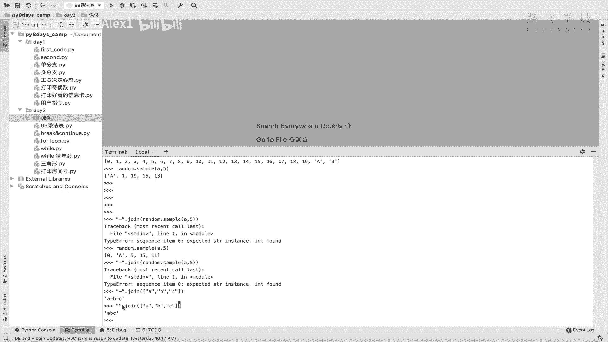

先copy过来，然后讲到哪了，放到这儿啊，这是顺带给大家讲了，然后具体怎么去把数字转成字符串再拼接，到时候咱们再写代码的时候再再用好不好，OK这个时候你知道的choice sample。

还有一个join对吧，然后呢咱们再学一个小知识，就是叫什么呀，叫int啊，Random a random int，random int是什么呢，打印一个随机数，看到没有，哎我就不用试了，甚至是啊。

你看你只需要输入这个对吧，它就是1~100之间给你产生一个随机数对吧，每次都不一样。

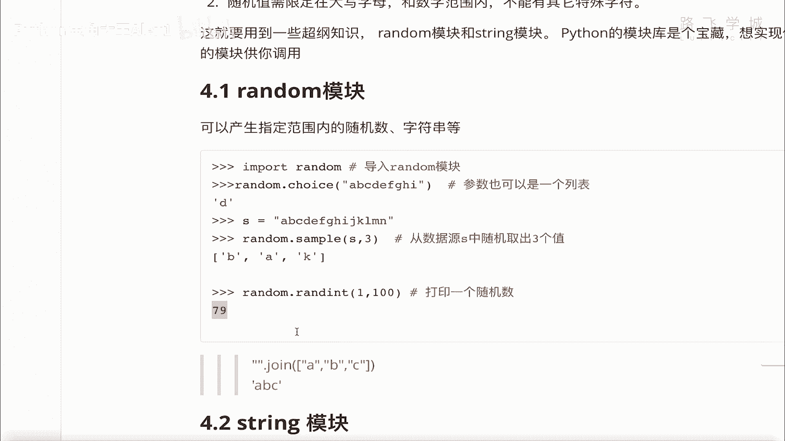

试一下吧，每次都不一样啊，大家看是不是每次都不一样吧，那这又能解决什么问题呢，这个能解决的问题，就是说我们说白了就把这个这个这个。

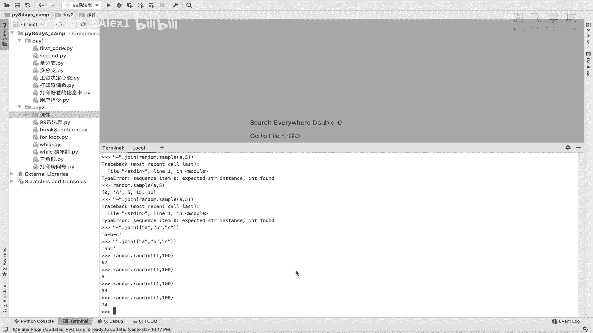

这个这个叫什么呀，0~9的这个数字。

就相当于，因为咱们产生的那个车牌号是是什么呀，是数字的组合嘛，就是0~10嘛对吧，产生这么几个值给他啊，给他这个什么呀，给他，就是因为你每一个每一，每一个字母可以随机的嘛对吧。

每一个数字可以随机的嘛对吧，所以你就让他可以啊用这用到这个功能啊，用到这个功能。

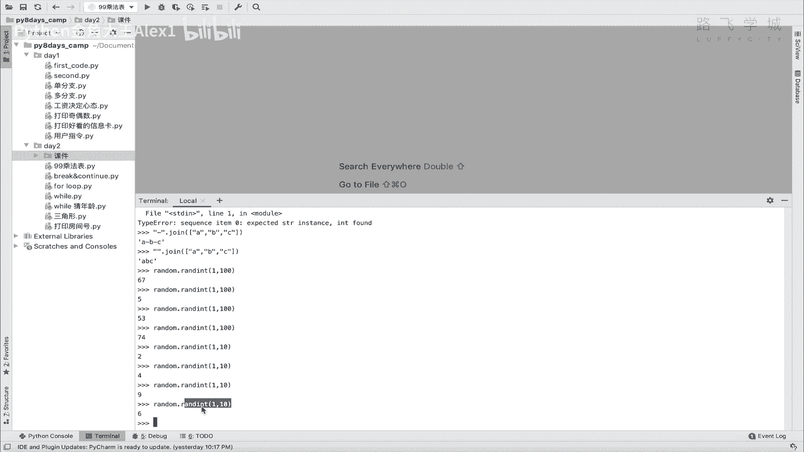

反正你知道这个就行了啊，咱们看看写代码的时候能不能用到，好吧，OK那random模块我们就知道了啊，它就可以产生随机数字和随机字符，OK吧，那另外呢就是在还需要一个模块叫stream模块，你看啊。

我们在这里是不是自己要手写，ABCDEFG要写进去，把这个大写字母和小写字母对吧，才能让他去随机生成，其实呢还有更简单的方法看stream模块，它直接可以给你，它们它直接可以给你生成这个什么啊啊。

叫呃字母和数字的组合，你看你导入这个string这个模块，然后直接string点asked letters，阿斯克码是咱们计算机的一种编码，我们在下一下两第第三天，第三天，第四天应该会讲啊。

你总之就是说这是计算机的编码，然后呢string aska letters就会把所有的小写字母，大写字母都给你输出出来，明白吗，如果你想要大写字母，你就uppercase大写吧对吧，把大写就输出出来。

所以你就省的在这里对吧，手动的自己再写一遍吧，啊这个其实就是啊，这当然你手动写也行，你不用这个是吧，只不过麻烦一点，然后小写就是lowercase，看到没有，Punction，Function。

Punctuation，Punctuation，它是所有的特殊字符，对不对啊，给你展现出来，如果你以后需要的话，比如说生成随机密码，你就可以用到这个对吧。

然后string digits就把所有的数字看到没有，也给你展现出来了，所有的数字，所以我们可以用到这个stream模块对吧，stream模块它因为我们的这个给这个叫什么呀，random的。

这个这个输入源应该是数字和字母的组合，对不对，所以我们很简单的，只需要把这个up case和这个string the digits，给它组合起来，交给这个random是不是就可以了。

明白这意思吗，我可以试一下，看着我们导入一个，string模块string这个叫什么呀，Case，case对吧，大写字母加上一个string digits，大家看是不是就是数字和字母的组合，对不对。

那这个就是我们的数据源的话，然后我们再直接random sample，对不对，然后直接输入数据源是S对吧，然后呢输入产生五个值，大家看对吧，你的车牌号不就出来了吗，对不对。

剩下的是我们只不过就是把这个拼成一个，用join方法，对不对，给它再拼成一个啊，叫叫叫叫N吧，然后用join方法给它拼起来，车牌不就出来了吗，啊对对吧对吧，因为这个N0写错车牌是不是就出来了。

明白这意思吗，好只对，有了这个东西啊，有了这两个模块，我们就解决了咱们的随机数的问题好吗，下一小节咱们就把这个代码给它写出来，OK你先自己试一下这两个模块的一些方法。

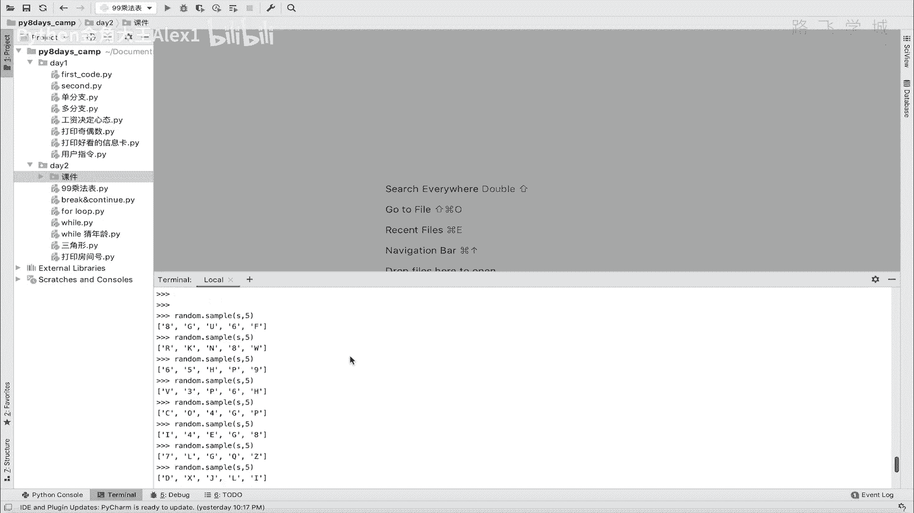

探索一下啊。