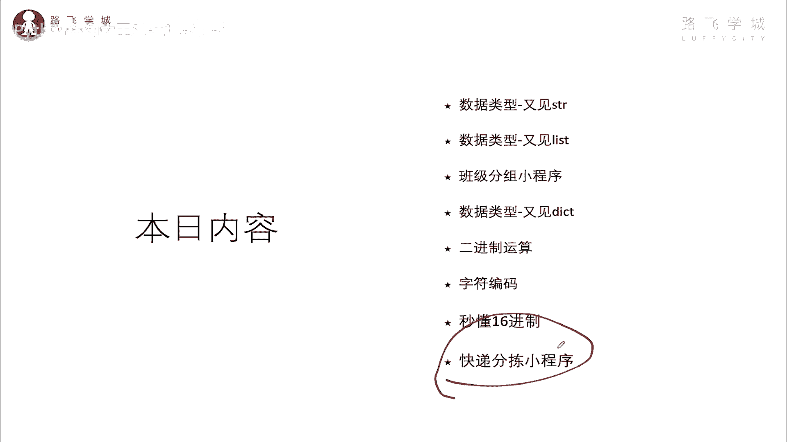
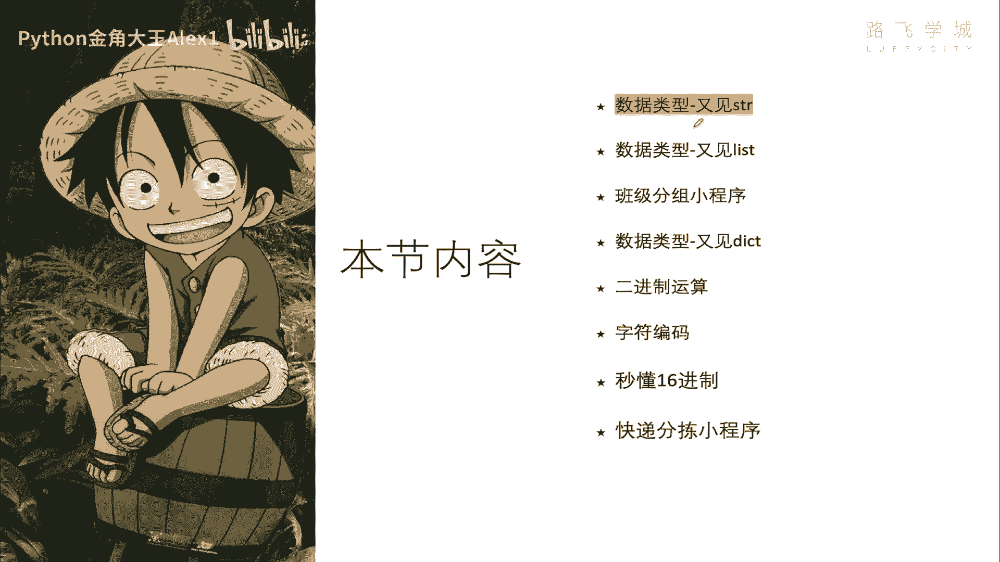
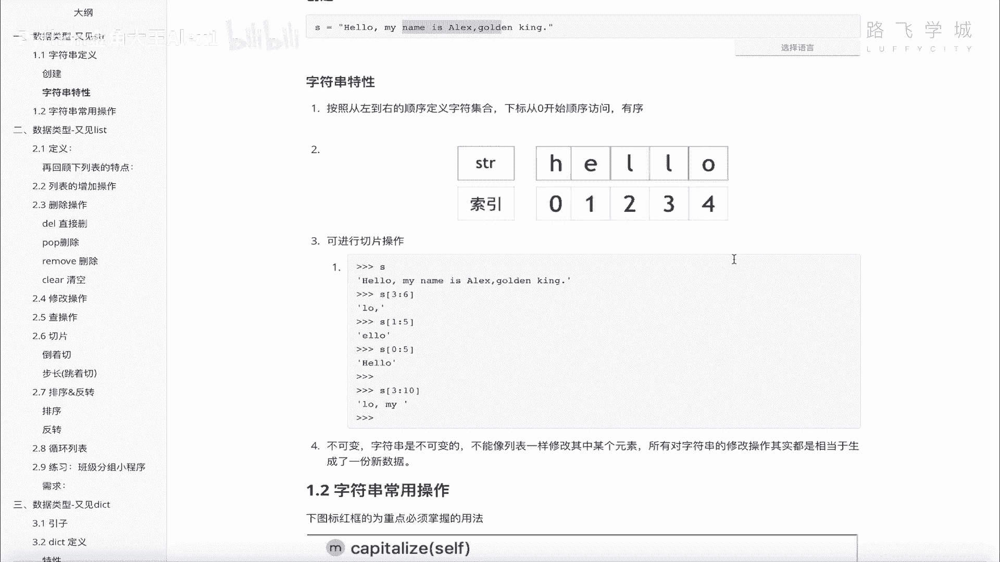
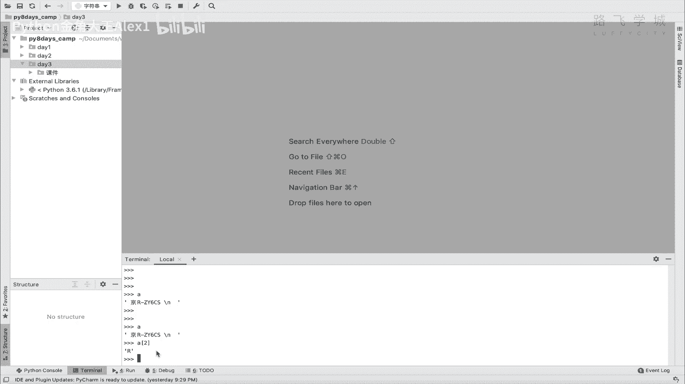
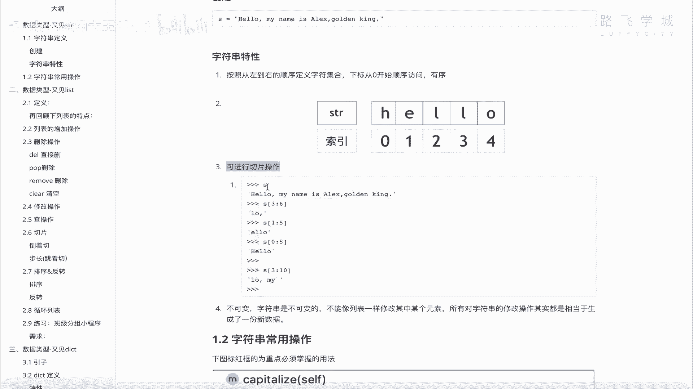
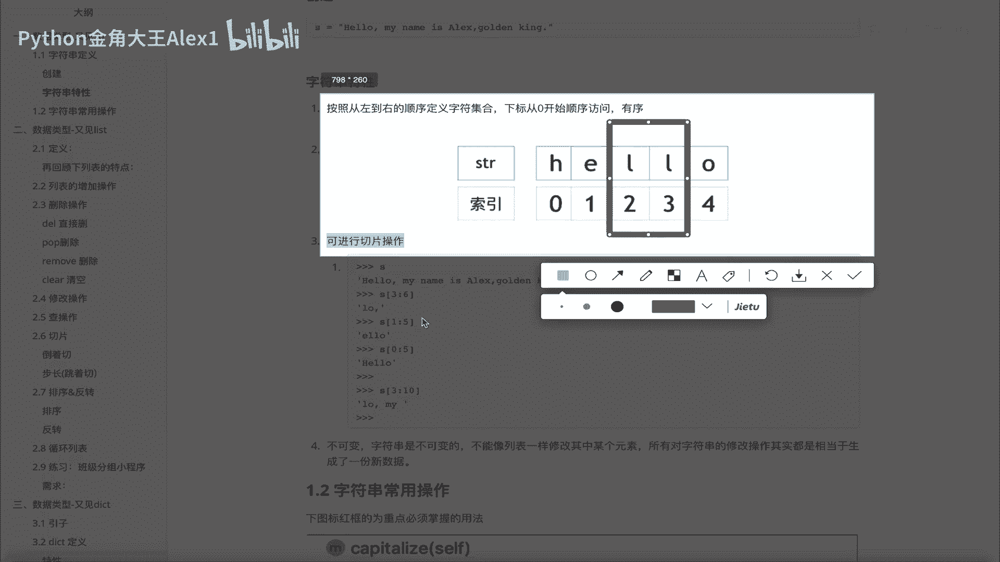
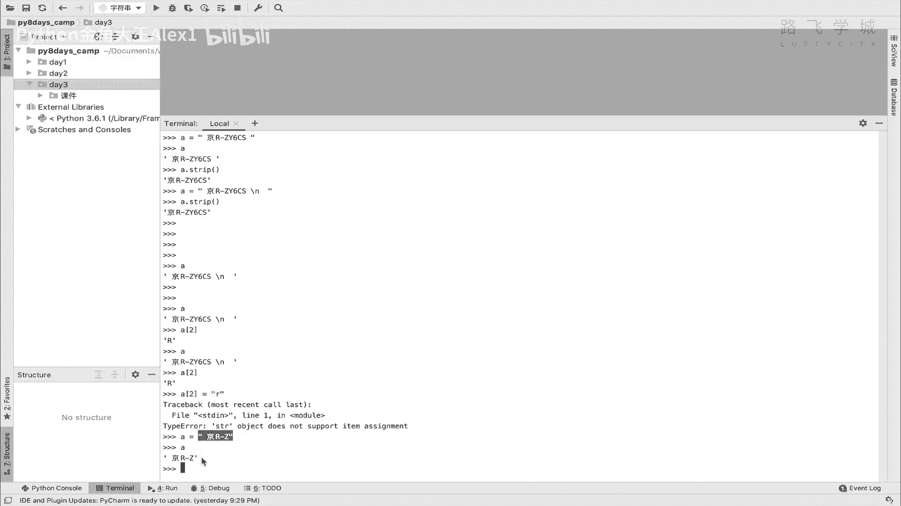
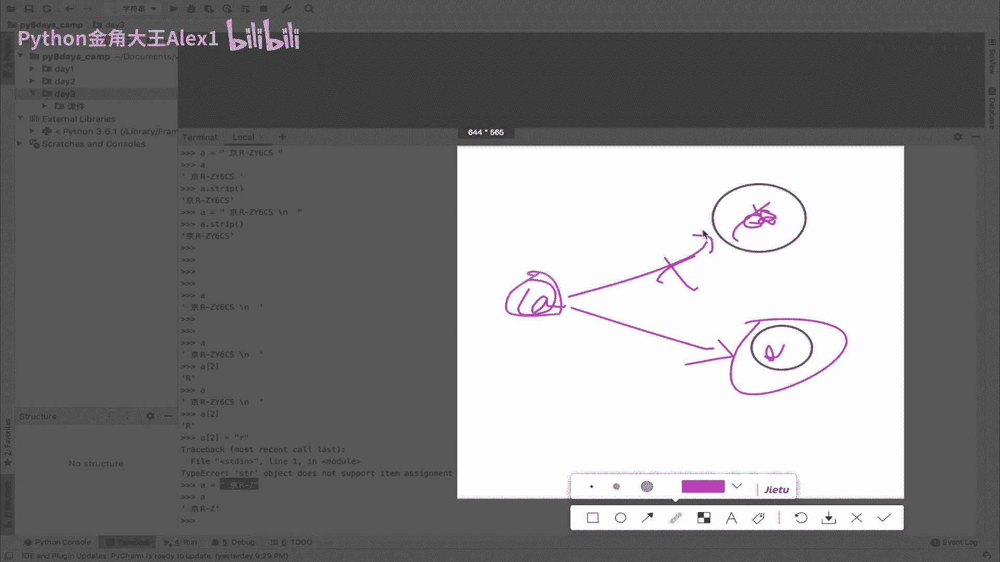
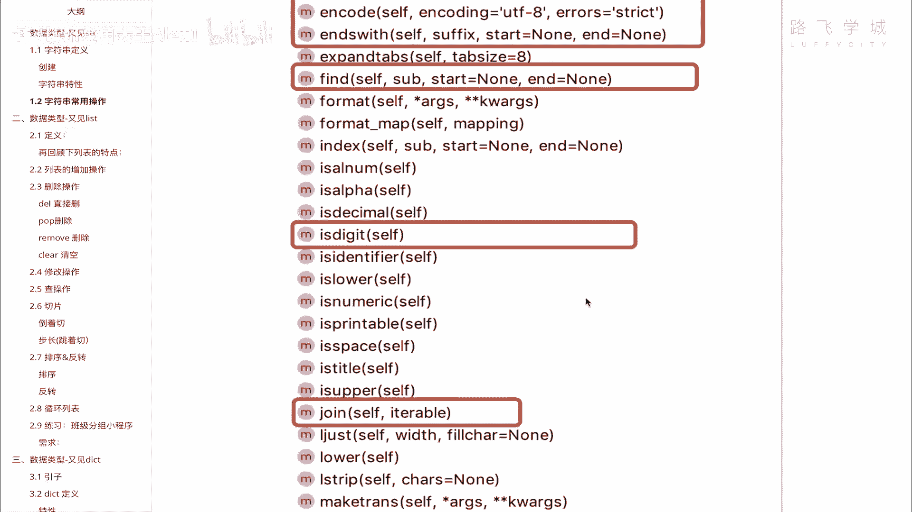

# 【2024年Python】8小时学会Excel数据分析、挖掘、清洗、可视化从入门到项目实战（完整版）学会可做项目 - P29：01 数据类型-字符串各种骚操作 - Python金角大王Alex1 - BV1gE421V7HF

Hello hello，同学们，那怀着激动的心情，我们进入第三天的学习，今天的内容就是要开发一个快递分拣的程序啊，这个咱们天天寄快递啊，你思考一下，顺丰他每天接收上亿个快递，他的这种全国跟全世界各地。

那他肯定是做了有这种自动的分拣的，分娩的这种机器人给他做这种分脸把，就是把说白了把这一批快递就分门别类的对吧，寄到山东的，寄到广州的都给他分开，那这个程序是怎么实现的，学完今天我们就可以做出来，OK吧。

咱们还是带着这个需求驱动去学习，要做出来咱们这个东西呢需要学习很多的东西，你看啊一堆啊一堆数据类型，二进制，字符编码，16进制，最后我们再来开发这个东西好不好，那咱们就直接进入第一小节的内容。

就是啊这个呃数据类型右键字符串，为什么叫右键，是因为我们在第一天的时候，其实已经给大家基础就是这个做了一个字符串，基本数据类型的一个初始是吧，把这个字符串啊，列表啊啊数字啊这些大概讲了一下。

哎呀sorry，早上吃了茴香馅儿的包子，今天啊那感受到这个味道了吗，哈扑鼻而来啊，伴着咖啡很香啊，那我刚才刚喝了一杯手磨现冲咖啡，那这那这个怎么讲，你你有一个大概的了解的训练。

那这节课呢我们啊认真的再去深入的，把这几个数据类型再去学一学好吧。

那这个直接咱们就来看咱们的这个呃，这个字符串字符串我们来学习一下啊，这还在这我们要学习一下字符串的定义啊，特性啊，以及字符串的常用操作，整个其实都是比较简单的，大家也没什么逻辑性可言啊。

大家跟着一块看就可以了啊，诶sorry sorry，应该是切到这里来了，那我们来看一下啊，这个字符串的一个定义，这个字符串定义呢它是什么，它是一个有序的字符的集合，注意了，它叫有序，什么意思。

它就是有顺序的，你定义了一个，比如说这一个字符串啊，Hello，My name is alex golden king，Golden ke，它不会它是有顺序的，他不会说你你你你不改它。

它不会自己说哎这个你你打印一下，调用一下它，它这个顺序乱了，把hello自己加到后面去了，明白吗，所以大家思考啊，计算机里的任何一个东西，它背后都是有你你看到的任何一个现象，它背后都是有原理的。

比如说你去想啊，它你你可能没思考过诶，为什么我下次打印的时候，它还是这个顺序对吧，他既然是有序的，那它一定是计算机背后设置了一些什么东西，导致就一去去维持它的这个顺序，对不对，维持它的顺序。

也就是记住了它的顺序，记住了这段字符串的顺序，要不然他不就乱了嘛对吧，有没有人维持这个秩序的话，所以呢啊有序的集合啊，用于在计算机里储存表示文本的这个啊，表示文本的这种信息，OK那字符串来的这个特性啊。

我们来总结一下，第一个呢它是有序，叫从左到右的顺序的定义的字符的集合，注意了它有序，谁维护的这个顺序呢，就是他跟咱们第一天讲的那个列表，其实是很就基本上是一样的，在这个事情啊，就在他的这个顺序的事情啊。

就是他们也是有下标的啊，有索引，也就是说在计算机底层，是靠这种索引索引来维持它的顺序的对吧，那你这个你就可以通过就像取这个列表式的，对不对，取列表里的元素一样，然后你就可以按索引去取里面的每一一个字母。

每一个字符看到没有，每一个字符，一个字符就占，就像就就占一个位置，占一个位置啊，一个索引位置好，所以它是有序的，它是有序的，那既然有索引，然后呢你就可以按索引去取值，大家来啊。

这个看一下吧，看一下啊，我这正好有一个这个对不对，有一个A这个字符串，然后我就可以直接取这个，把这个R取出来，这前面应该有个空格012，那就是写一个二，你看是不是就把R取出来了。

它就跟那个列表的操作取元素是不是一样的啊。

是一样的，OK它还可以进行一个什么呢，第二个特性啊，进行一个叫切片的操作，什么叫切片啊。

切片我们学没有没有学过，其实很简单，大家看这是一个啊叫什么呀字符串，然后呢切片其实就很简单，我把这一块给它切出来，比如说我就切这两个位置，看到没有哎，就像就就就给它切掉，就像切面包一样。

我把中间这块面包给它切出来，这就叫切片，能理解吧，哎那这个切片我告诉你它是属于啊列表的，一会儿我们还会讲列表的深入操作的时候，就会讲它是列表的一个特性，只要是列表，它就可以切片列表里的很多元素。

你可以中间只取出几个指定的元素来，就是通过切片的操作，由于这个字符串底层，其实你可以理解为它也是一个列表，只不过它是对它也是一个列表，你可以理解啊，底层它就是一个列表，它的特性跟列表是一样的。

所以它也具备切片的这个功能，明白吗，它也具备切片的功能，就跟列表一样，OK所以这在这里呢我们会简单的讲一讲。

他能做的切片到列表，到讲列表的时候，我们会把这个切出来，它有很多种切法啊，我们会再详细讲，这里大概说一下列表的啊，这个它的切出来的方法就是啊就是什么呢，在这里啊，那直接在这说吧，看到没有。

你看这是一个啊，这是一个字符串，然后呢你想切只是它这里是直接是干嘛呀啊，一个三一个六，这什么意思，这是你就是咱刚才不是给你画了一个图吗，你想切中间这两个，那你就要定义好从哪个地方开始切，切到哪为止。

明白意思吧，哎从哪，Sorry sorry，从哪里开始切呢，我从第三个位置开始切，一直切到第六个位置，注意了，他是顾头不顾尾，看到了吧，呃sorry，啊顾头不顾尾，什么意思，就是三会切进来。

六不会包括明白吗，所以实际切到的值是5K，所以呢啊这个3~6就是0123L，然后呢四啊五看到没，4566是不是个空格呀，六其实是并没有迁进来，这里是没有空格的啊，这个这个不是空格啊，这里没有空格的。

所以就是说切了这三个位置，看到没有，你要切1~5的话，就是从这个位置对吧，切到这个OK其实其他都是一样的，明白吗，哎这个就是它的切片功能很简单，定义好开始定义好，结束就可以切了啊，切了啊。

还有一些特殊场景的时候，我们会用到切片，OK这是第二个特性，第三个特性啊，第三个特性是什么，它不可变哈，什么意思不可变，就是说呃呃怎么讲咱们的列表，你可以说找到这个元素给它改掉吧，改成大写的L改成中文。

whatever都可以，或者删掉都行，但是字符串不行，字符串你不能进行修改，你只要定义好了，这个hello，你里面的任何一个值都改不了，还有同学说其实是我是改啊，我可以改啊，怎么就不能改了。

你看还有我sorry，就是我这个A这个值我怎么不可以改了，我就直接你看我直接改这个里面的改A2，他现在是个R，是不是我给它改成一个小写的R行不行呢，大家来看，这就报错了，报了一个什么错。

说这个SSTR对象啊，这个也就是这个值它是不能不支持atom assignment，就是说assignment就是指定指定的意思，item就是元素的意思，说不支持这个元素的指令，什么意思呢。

也就是说你不允许再通过这种方式，再给它重新赋值，看到没有啊，不能改其中某个元素的值，所以你要改只能是全部改，你比如说有同学说我改了呀，我把它改成一个精啊，什么什么什么，对你这样同志们。

它并不是叫修改了字符串里的内容，而是说白了重新起了一个，就是重新开辟了，就重新在内存里找了一块空间。

改了付了一份新的值，什么意思，咱们在讲第一天变量的时候，应该给大家说过了对吧，也就是说你在这里杠，你在这稍等啊，这个是你的，这个是你的A这个变量看到没有，然后你原先指的是这个就是什么jr这么一堆。

对不对，就这么一堆东西，然后呢你现在要改一个值，说我改成jr gz啊，后面没有别的东西了，你并不是在这个地方改的，而是什么开辟了一块新的内存空间地址，然后呢指向了他这个指向就没有了。

就相当于我们之前讲的那个物流的，对不对，之前这个货架上，在这个在这个货柜里有有东西对吧，然后你你只不过是把这个编号取下来啊，贴到了另外一个货柜上，OK之前这样指向关系没有，所以你并没有改原来的值。

原来的值还是在这，你是创建了一个新的值，所以它明白我意思吧，这就是你字符串修改的一个原理，你并不是改了原来的值，那原来的值会怎么办，原来的值会被解释器定时垃圾回收给他回收走。

如果他发现嗯这个货柜上没有在贴编号的话，没有在指定有有这个变量指向它的话。

他就会把它当垃圾处理走，OK这个就是它的修改，所以它是不可变的，明白吗，它是不可变的，你不要在这里问我为什么不可变，为什么，这就是人家底层的设置，这个数据类型有不可变类型，有可变类型，字符串还有数字。

它就是不可变类型，然后列表就是还有后面我们学的字典，它都是可变类型，那么它是分这种类型的，OK啊咱们今天没有这个啊对吧，这就不去深究，说底层它为什么这么设置啊，为什么这么设置这个这个啊。

不在这个讨论范围之内好，这是它的另外一个特性，好了，知道这个之后，我们接下来下一小节，就给大家学字符串的常用的操作啊，那你自己其实在这里打一个A点tab，打一个tab键，你会发现它里面有那么多的功能。

对不对，在第一天的时候，我们可能大概讲了一个或两个讲过一个rip，我记得如果没错的话，是不是还有一个center，是不是还有一个center，其他好多都没有讲，那今天我们会重点再去讲几个常用的，注意了。

我画这个红线的就是我们常用的这些方法，明白吗，我不用下一小节直接讲吧，常用的几个方法，那呃其他这些方法我告诉你，你大概率啊，这个很少会用到，也不常用，所以我们这个项目需求驱动，我们只讲常用的啊。

你其他的有兴趣可以自己探索啊，看咱们这个深入的课程，我都我都已经讲过啊，OK啊这几个这几个我们依次来看一下，首先center我们已经学过了，是不是啊，center已经学过了，就是干嘛的来着。

是不是在这个啊，把这个字符串给它给它啊，你给它给它两边补补值，是不是我这样吧，我在这里创建一个STR的一个什么对吧，然后呢我在这里就写一个A等一个ALEX，金角大王啊，这个就是我们的字符串。

然后A点center的话，sorry啊，print a点center的话就是什么来着，50，然后填充物是吧啊，这个咱们看一下效果就行了，对不对，它会打印出来这样的一个效果，对不对。

output等于一个是这个样子的啊，大家就知道什么意思了，然后我们来看这个count count是什么意思呢，count就是说去查嗯，你这个啊就是字符串里怎么讲，你某个字符又出现了多少次。

比如说我在这里出现了一个啊，LI看到没有，这是LALEX里亚历山大，然后呢这里面出现了两个L，看到没有，我就可以用count来去A点count，然后这个这个这个这个这个这个直接输入，你要计算的字符。

比如说count这个L它就会给你打印有多少个L，看到没有，出现了两个，你打印A的话，它只有一个明白吗，并且他这里其实还允许你干嘛呢，你只计算什么呀，这里有一个start，有一个end，什么意思。

也就是说你这个ALEX你你你你你如果默认的话，它会全局查找有多少个L看到没有，但是如果你指定说我只从这个单词里面查，有多少个L的话，你就可以在后面指定start和end，看到没有，start啊。

start啊，你不用你不用写写什么，直接写这个start是什么呢，从零开始到几结束了，01234~4结束，01234嘛到四结束，所以它会显示你看LOSORRYL啊，它会显示有几个L啊。

它会显示就只有一个L了，如果你不加他，就是全局搜索，加了这个就是局部搜索，明白这意思吗，哎这个就是啊count那个encode，encode是字符编码，我们到这个这节末尾的时候再给大家啊，这就末尾奖嘛。

对这节末尾的时候看看啊，到时候再给大家讲，所以encode先跳过end with end with，这个很简单，就是说判断这个这个这个呃字符是以，是不是以什么结尾，比如说啊有些场景。

我想判断这这这这一段话是不是有一个，你这个大王结尾是不是大王结尾，那你就可以啊，A点这个啊，End end with，End end with，End with，写一个网，如果是以王结尾。

他就打回处明白吗，如果不是的话，他就王八，他就打回false，明白吗，在一些特定场景下啊，你可以用得到好吧，返回true或false啊，判断结尾，是吧，然后接下来我们有这个end with。

其实就有一个对应的，你判断结尾还可以判断开头的，有一个对应的叫start with，看到没有，Start stars with，这个stars with的话就是判断开头一样的，返回返回是一样的。

然后我们执行一下，大家来看一下，你看是以ALEX开头的，你可以输啊，很长的字符都没问题啊，输多个数一个都行，看到没有，返回的是true诶，这是start with，那接下来再看一个find。

find是查找查找，count是计数对吧，里面有没有什么值，这个find是说查我这里面有没有一个什么值啊，有没有什么值，就是print a点find，我想find里面有没有一个这个中文啊，中文单吧对吧。

也无所谓了，大家会看一下是不是他返回一，就代表找不到啊，啊这个字符查找返回数返回一啊，代表没找到，OK吗，如果找到了，看着我，我查一个查一个II是存在的，对不对啊，大家看它就会返回什么。

返回I返回一个六六是什么六的A的，在这个圆，在这个字字符串里的索引，0123456是不是好，如果找到了就返回啊，这个啊所查字符的索引，这个能明白吗啊，能明白吗，对OK不是索引值，是索引那个数好吗。

这个是find啊，那接下来咱们再来看is digit，Is digit，这个你你应该也能看出来是什么意思吧，它是判断是不是一个数字，Print a sorry，A点is digit，你说sorry。

Sorry，Sorry，Sorry，11is digit，Is dismal，是判断是不是小数啊，is digit啊，是不是一个整数，大家来看，很显然我这个不是，对不对，但是你说这本来是个字符串。

怎么是一个整数呢，No no no no no no no no no no，如果你是这样的话，22看到没有，它就会它是一个字符串形式的数字，对不对，然后你看它就会返回true，能理解意思吗。

好判断这个不用写，判断是否是整数，其实这个还挺有用的啊，以后我们后面比如说让用户输入一个数值，它输的是一个输入一个选择，比如说选择一个编号，比如说20或或123输入一个编号，那你就可以判断这个编号。

他输的是一个数字形式的还是一个，如果数是一个数字形式，你就把这个数字转成这个这个这个这个这个字，就是它本来因为输入的时候是字符串对吧啊，接收的input，所以你把它转成数字就可以处理了。

这个机制还有有用啊，知道就行了啊，另外是john john，其实我们在第二节的时候大概讲过了，是不是啊，是字符串的拼接，把列表里的值拼成字符串啊，那比如说我们在这里有一个啊D啊，有一个L等于一个。

是不是有一个name alex，我和黑姑娘啊，Black girl，对不对，还有这个佩奇，对不对啊，然后呢我们三个人做拼接啊，给它连起来啊，这个这个这个然后看一下，那你怎么办呢，直接是join。

看到没有join，然后前面前面是这个括号里面，这个引号里面写的是你的连接符，你可以用这个连看到没有啊，然后join这个什么呀，直接join l就可以了，看到没有啊，我们三个就连起来了，对不对啊。

这个非常非常好的couple，那这个就是啊连连接啊，连接符啊，连接or sorry，拼接字符串是吧，哎我刚看到一个新闻，抖音上，昨天啊说这个什么一个双一个女的，然后生了一个双胞胎，这个双胞胎呢。

这个竟然医生，医生就说这个双胞胎就是她那个男的，怀疑不是她的孩子，所以就来进行这个叫什么呀，基因啊检测对吧，这个检测完了之后呢，发现我很神奇的一幕出现了，这里边两个孩子里面有一个是属于这个嗯男的。

她老公的，另外一个不是她的孩子啊，那那那这个这怎么才能这样这样实现呢，因为这种非常罕见，医生说他从业生涯中就看见过两次啊，就是这个呢是第一他要排两，就女性嘛要排两个卵，就一般都女性每个月只排一个卵嘛。

啊这个但是这次他排了两个卵，排两个卵卵又很巧合，就是说哼这个他需要它需要，因为两个卵都要受精的话，它需要两个卵，同时就不是同时受精，就是第一，就是说他在他在这个第一个卵受精完了之后。

第二个卵要在很短的时间内啊，就是他需要跟另外一个男的再发生一次关系，然后才能才能中招啊，才能中招，然后特别逗的一点，就是医生采访的时候还跟他说，我还跟那个呃那个老公说，我说至少你很幸运。

其中有一个孩子是你的，我就觉得这句话想起来很逗啊对吧，戴了绿帽子，至少还有一个是他的啊，然后后来女的承认了，说她有过一夜情，哼anyway，这个就是咱们的啊，这个这个拼接字符串诶。

我为什么要在这里讲这个东西啊，那好joy，完了之后呢，我们讲这个叫replace啊，Replace，哎哟后面还有好几个replace是个什么东西啊，就是替换，看到没有，这里写了self，不用管啊。

就看这个参数是输入你想替换的值，输入你新的值，然后呢count是说你想替换几次，哎，这个呢我们来看一下，还是拿这个A来哎呀，就就A来讲吧，A点啊，注意了啊，同志们，我为什么每次要进行print。

因为你你你这样，你比如说你看A点这个replace，然后我直接进行一个输入一个旧的值啊，输入一个旧的值，就是说我想把这个里面小写的L，这里有两个L嘛，我把L旧的值替换成一个啊，替换成一个嗯。

定下一个M吧，好吧，大写的M看到没有，哎，这个时候你如果替换了我，其他的参数先不用写啊，那大家看你你替换完了之后，你当然你要打印看一下效果对吧，你以为就是说他已经把A给替换了，但是我们打印A的话。

你会发现A并没有任何的变化，而小白可能就会迷惑啊，其实我刚开始一开始就讲了，字符串是不可变的，你对他的任何修改相当于是附了一个新的值，我们这个replace对吧，你replace完了之后。

你要想让他修改的话，你得给它重新复制，你得重新复成A，这样的话它才会把它替换掉，明白明白这意思吗，你如果直接这样做，它其实是相当于copy了，相当于是copy了一份这个原来的值，然后把这个里面的值改掉。

又附到一个新的地方了，明白吗啊，OK所以就说你要想让这个A也是这样的话，你得重新给A赋值，OK好这个强调，所以我我没有给A重新复制，我只是在这里给你print出来了，所以对原来的这个A还是不影响的。

明白吗，所以我这里就替换了这个A看到没有变成M了，注意他后面是不是有一个叫count的一个参数，这个count就是说你要替多少次，默认是全部T但是我改成一之后，L啊。

看着两个L它只会T1个看着A啊啊啊啊，怎么出错了哦，Replace not keyword，你不要你不要指定参数，不要指定这个你直接写一就行了，sorry啊，我写错了啊，大家来看是不是只换了一个M。

后面那个L没有换，是不是啊，哎这个就是字符串替换，对吧，字符串的替换，这个output是这个样子的，OK好，那这个学完了之后，我们再来看这个split start，start位置已经学了。

strip其实也学了，是不是啊，脱毛就脱掉两边的这个字符串，拖着两边旁边的这个什么空格呀，换行啊，脱掉这不是了，所以我们只剩下一个lit啊，就讲完了，split是干嘛呢，把一个字符串看着啊。

把一个字符串给他好，我直接我直接改这个吧，把一个字符串给它变成列表，看着我直接A点split，我里面什么也不跟看到没有，我里面什么也不跟大家看它的效果，看看效果。

它会直接你看诶这个列表里怎么会有三个元素，它是按照什么逻辑划分的，你自己对比一下，看看按什么逻辑去分割的，是按照空格，对不对，它是按照空格把这个字符串拼分成了列表，那里边你是可以指定这个分隔符的。

你看split啊，split这里你看两个参数，一个是啊这个什么呀，这个就是它的分隔符默认是none none，其实就是什么也不指定啊，什么也不指定啊，就是呃就是默认就是嗯NN这个这个类型。

我没讲是一个空值啊，就代表你在这里就是默认NN的话，你就这么讲，他就是以空以空格为分好吧，以空格为分，然后呢max late就说你最多分几次，它默认有一个一负一，它应该这是他默认指定的值。

就是说全部分什么意思，也就是说按照里面字符串里所有的空格都分，明白这意思吧，啊都分就是，所以我们都可以都可以指定这个参数，第一个我们的分隔符可以改成用这个叫什么呀，用L来分，看到没有，用L来分。

咱们来看一下效果，L1分，大家看你看是不是他就把这个L给他去掉了啊，因为用L分L就给他去掉了，然后啊这里有一个A，然后呢呃在这个地方又有一个看到没有，一共这里是不是分成一个I来呀，看到没有。

然后金角大王和I分在一块了，因为你不是按空格了吧，所以这个是按L来分，当然你可以你可以随意的指定，你还可以按这个什么呀，你可以按这个角来分，都没问题，明白这意思吗，OK那同志们。

他要分后面还有一个分隔几次，你可以指定参数，你默认它是全分，你可以指定分一次，这样的话只按第一个L分，看着是不是只按第一个，还要分后面的都在一块了，OK这个就是啊字符串，分割好吗啊，这个你自己试一下啊。

自己试一下，我写写写不出来了，然后咱们的输出是这个样子的对吧，OK到此为止，咱们常用的这个语法啊，操作就学完了，是不是很简单，回顾一下字符串的特性，然后字符串常用语法你们自己跟着试一遍好吧。

其他的想探索也可以搞。

