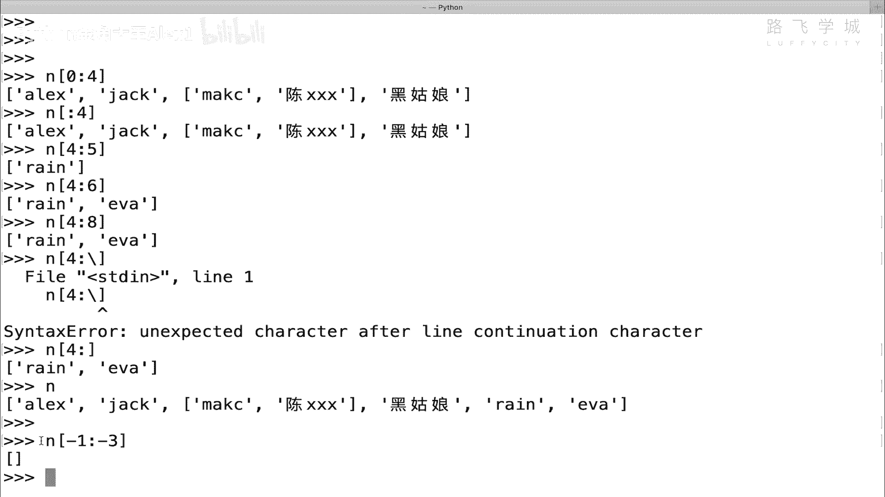
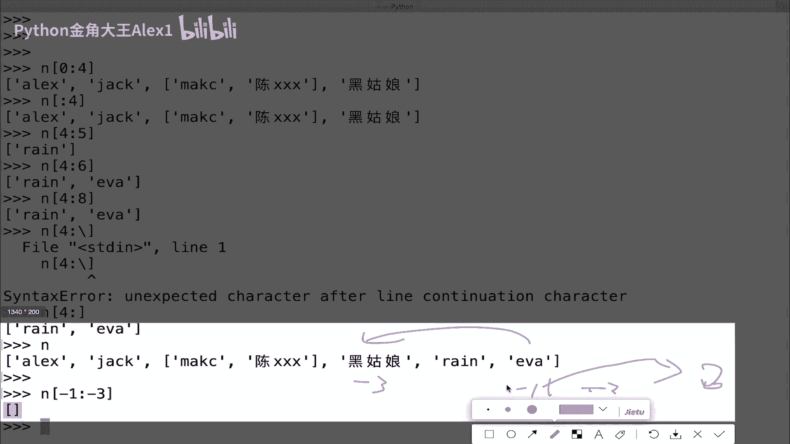
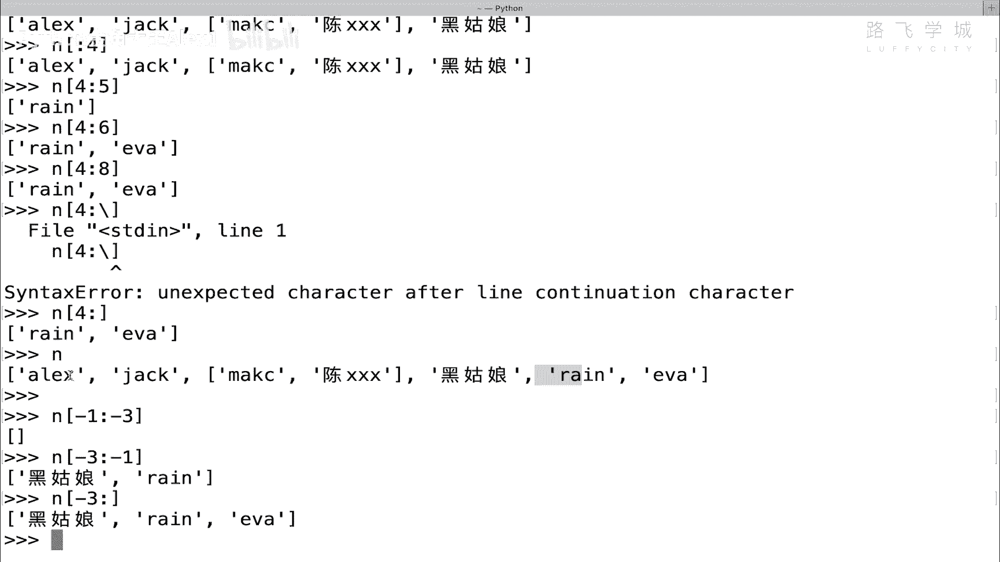
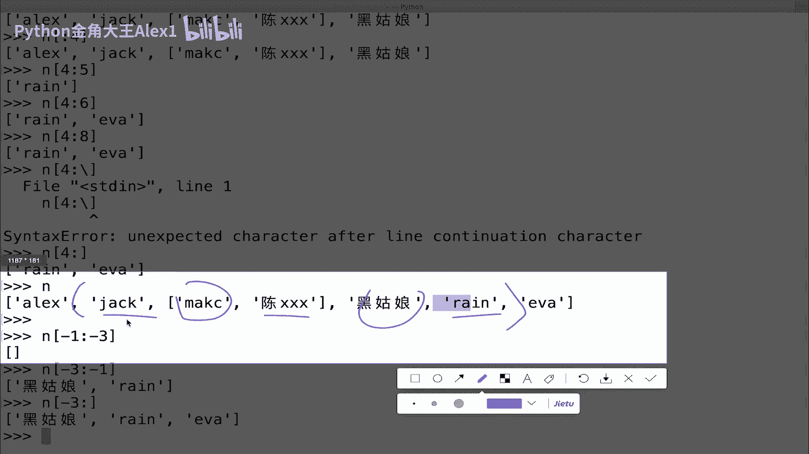
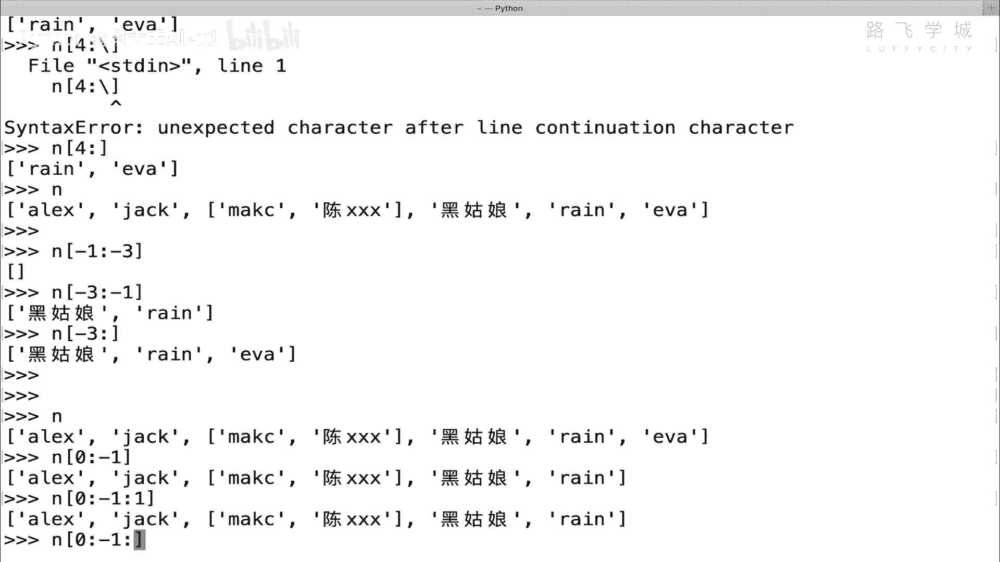
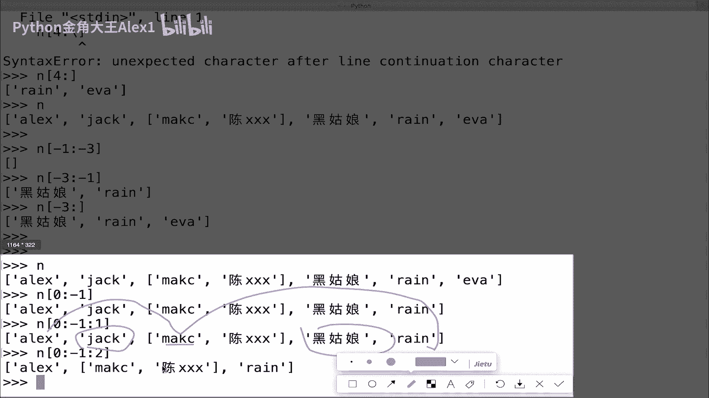
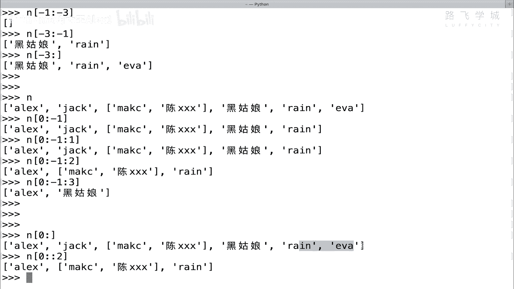
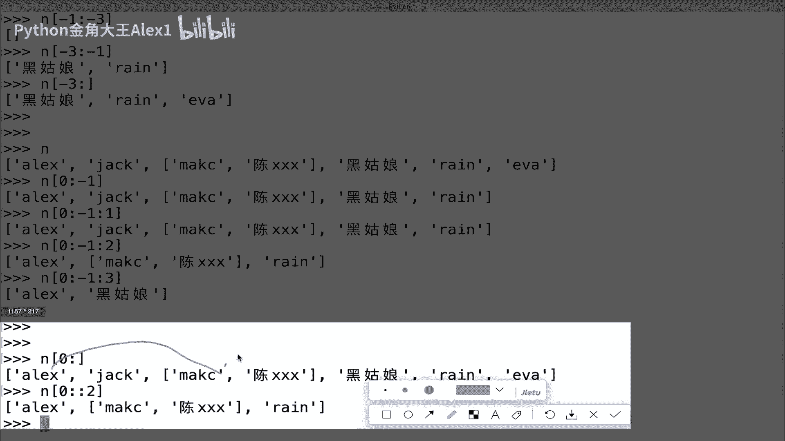
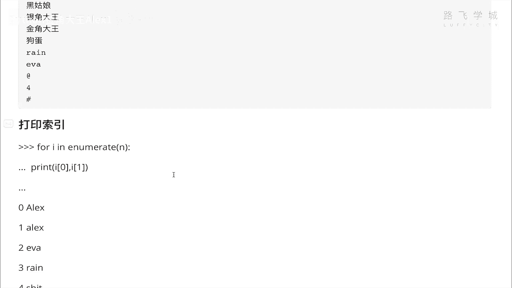

# 【2024年Python】8小时学会Excel数据分析、挖掘、清洗、可视化从入门到项目实战（完整版）学会可做项目 - P31：03 数据类型-列表切片&排序&反转&循环 - Python金角大王Alex1 - BV1gE421V7HF

OK同学们，这节呢咱们来学列表的切片，在讲字符串的时候，我们就啊大概用了一下它，字符串的这个切片跟列表切片完全一样啊，底层是一样的原理好吧，那就是输入一个输入一个这个开始，你要从哪切到切到哪为止。

并且是顾头不顾尾，OK吧，然后跟字符串有不太，就是咱们字符串只是简单讲了一下这种切法嘛，对吧，咱们还可以这种什么呢，呃倒着切还可以倒着切，咱们这样啊，我们把这个常常用那些特色的给他，给大家讲一讲。

讲一讲啊，Names，然后正常的最简单的这种切法对吧，最简单的切法，我从这个一切到四吧，假如说哎oh  names已经被我清空了是吧，name已经被我清空了，咱们来呃拿的这个给他直接N吧好吧。

N然后N这个直接是从一切到四，大家看就把这个什么呀，把这个A和这个jack到这个黑姑娘，这中间都这这都切出来了啊对吧，rain是没有包含的，那接下来我们可以干嘛呢，可以啊，还可以。

如果是说我想从零切到这个四的话，会怎么写，从零切到四，从零切到死，你直接去，那同学说直接改成零不就可以了吗，没有问题，从零开始就包括这个ALEX了，但是我要说的是，当你是零的时候，其实你是可以省略的。

你可以不写，所以呢你就可以变成这个样子啊，这个有的，因为你以后看到别人这么写的话，你不要说哎这什么意思啊，它其实就是把这个零给它省略掉了，大家看一样的效果，看到没有，这个和这个是完全一样的效果啊。

这个我要给你copy过来，省得啊，这是简写啊，这是简写简写，啊，是一样的道理好吗，然后这个没问题了，之后我们来看我们如果想去啊，这个取呃，切从就是切最后两个值，切最后两个值怎么切呢。

那你依然可以说从这边数012345对吧，012345，那怎么怎么起呢，这是N哎，然后从四开始到五是吧，从四开始到五，大家看就会出现一个问题，我想切的是最后两个值，但是呢rain他就呃EVA却切不出来。

为什么，因为他是顾头不顾尾，所以最后一个值不会取，那怎么办呢，我就往后我说有同学说我再往后加一个索引值，切到六行不行啊，切到六就出问题了，哎切到六六就6666竟然可以了，我靠这个完全是这个什么呀。

哼python3的应该是一个新的语法，我在备课的时候都没发现啊，哈这个在python2里，你要是直接写六的话，他会报错，为什么，因为这个索引肯显然已经超出了，就没有六这个值嘛，你看0123456对吧。

没有六这个值它竟然可以有，那我是不是可以写七呀八呀O的o my，不应该这样啊，不应该这样，但是他允许这样，我觉得还挺怪的，这是新在咱们讲课中临时发现的一个新语法啊，新语法正常的话，如果你想切到。

就是说那既然这样可以，那我们通过这种也行了，啊啊这个这个这个就是你超标了，他也不就是超过，所以你界限了他也不会出错，但实际上之前在二点几的时候，他是出错的啊啊那呃这个没问题，然后咱们来看说正常的话。

其实如果你想就取到后面两个的话，其实你可以倒着切，因为它不是顾头不顾尾嘛，假如说咱不知道有这种语法好吗，还有一种方法就是什么呢，那你就可以倒着切，怎么倒着切呢，你就可以通过看着啊，哦你不用到这些。

你就可以这样直接后面不写啊，说错了，你不用到这些，你直接后面不写就可以，你看后面不写的话，它就会把一吧也包括诶，算了算了，大家看是不是把一往也包括了，OK吗，哎这是一种方法，当然还可以倒着切。

我们一会讲啊，来咱们先把这种方法给它给大家贴到这儿啊，给它贴到这，所以你看讲着课学会了一种新方法啊，这种形式啊取这个啊倒数后两个值对吧，然后呢他的切法是这个，这个给他去掉啊，这是一种超标写法。

是不是啊是吧，他可以有这种超标学法，那就是超就是超标对吧，超过下标的写法是吧，这个是咱们新学的，OK然后啊这个是什么呀，叫sorry，在这里，这个是那个这是什么呀，省略写法是吧，简写省略。

好最后啊一个啊这个这个索引，所以对吧，所以呢他就会把这个最后一个打印出来，明白这意思吧，OK这个就是取倒数最后两个值啊，给大家让大家注意一下就行了，然后呢除了这个之外，咱们还可以去倒着切。

刚才一直是正着切，正着切就是从左到右倒着切呢，就是什么呀，倒着前你就可以数数，它不是从右到左啊，它不是从右到左，而是什么呢，而是说你这个可以输入负数啊，输入负数大家来看，比如说我想取这个倒数的呃。

比如说我想取倒数后三个，后三个我不能让你，你不要输入什么正数，你就输负数的话啊，那同学说我是不是输入一到负负，-1~-3呀，试一下是不是负-1~-3呀，那不就倒着切了嘛，对不对，输入一个-1~-3。

大家看行不行啊，哎同学们看他是不行的。

为什么怎么是翻成变成空了呢，注意了啊，他这个倒着切，你输入一和三，注意了，这个是一，对不对，这个是三，是不是啊，那你就变成了说他从最后一个从右往左切了，看到没，那你就变成一个从右往左切了。

那但是实际上不是的，实际上这个列表的切片它是这样的，你虽然你虽然这么输入，但是实际上切片它是这样从左往右切，所以你输入一个第一个值一，它就在这二，你不是你输的三，就是就是它正就是你无论输什么。

后面那个值它都是从左往右找，但是他从左往右找，他找不到三的，因为那边是右边，是没有三的，三在左边，所以你这样他会切到一个空值空列表，明白这意思吧，明白吗，所以呢你要想取后面这几个值的话对吧，你怎么切呢。

你要是记住，永远记住它是从左往右。

所以呢左边第一个值是三负三，右边第一个值一，明白这意思吧，所以呢你要变成n-3对吧，然后一看到没有N负哎，算写错了，三负一，然后呢三负一会导致一个结果，你会切出来一个黑姑娘，确实切出来的R切出来了。

但是EVA没有，因为他是顾头不顾尾，所以呢你要这样写，把这个省略掉，看到没有，你就把伊万切出来了，这个是一种倒着切的切法，明白吗，这就叫倒着切的切法啊，啊好吧啊，在这里也写了，有同学说。

我能不能就让它从现在是从左往右导嘛对吧，无论你负数正数多负数，能不能让他从右往左导呢，就是想让你从右往左倒，其实是可以的，但是现在我们不教给你，因为咱们这个课程现在用不到啊，现在用不到。

因为解释要比较麻烦啊，不交引，但是你知道默认就是从左到右啊，左左左右好了，这个学完了之后，我们再来看这个什么呀，步长啊，步长步长是个什么东西呢，就是哎现在咱们切这个值，切这个数，切这个数，是不是。

比如说哎你输入这个这个什么什么区间，它就是一个一个去找是吧，哎他的为什么是一个个找，它，为什么不能跳着，找步长就可以实现一个一个效果。

就是什么呢，哎我可以这样跳着啊，你你你比如说整个切片是这么一个大的范围，对不对，我现在是一个一个的拿出来，但是我可以这样，我从我我我可以跳，只只取偶数，就隔一个取一个，看到没有，我只取这三个。

这里面就不要了，这就是跳着看到没有，这就是把它这个这个东西就叫步长对吧，正常的话是我我我俩之间的距离就是一对吧，步子是一，但是我可以指定设成设成二之后。

它就跳着了对吧，中间这个就略过了，明白这意思吧，这叫步长啊，然后所以step就是这个值就是设置不长了，默认它就是一，默认它就是1OK吧，那现在呢我们来看一下，我就直接NN啊。

N然后呢我在这里是呃取这个从零到这个一，看到没有啊，从0~-1，然后啊我我如果从零负一也不写的话，对吧啊，先写一吧，先写一啊，就一吧，先不要了，然后它是这样一个个取出来的，我后面再加一个冒号。

就是取步长不长的话，我直接默认它是一，它不会有变化，看到没注入一，然后输入一个二的话。

大家来看变化就出来了，变化就怎么出来了呢，正常的话你看ALEX和Mac和Mac之间中间隔了一个jack，对不对，jack是不是没有了，然后呢，这个这个这个这个小列表。

跟这个when后面是不是搁了一个黑姑娘，黑姑娘是不是也没有了，所以你会发现你的这个值他是不是跳着走啊，对吧，他是从这走到这，然后又走到这，中间隔了一个位置，明白吗。

如果你写二的话，写三的话，那就更跳了对吧，你写三的话，它中间直接跳两个值，对不对，这个这两个都不要了，直接从ALEX跳到黑姑娘，再往后跳没了，明白吗，这个就是步长，明白吗，哎这个步长完了之后。

我们刚才讲了，说我我我这个切的时候啊，我这个切的时候大家看啊，我这个切的时候，我想把这个这个1A也取出来对吧，因为你你这个A到一，你这样写感觉啊，这个这个这个就少了一个伊娃嘛对吧，我写把伊娃取出来。

你能怎么办呢，你能说从012345610101234，什么什么什么什么去输嘛，去找到这个，你找到这个输入它也也也没有用啊，因为它它是顾头不顾尾，所以呢你想取整个列表怎么办，同志们直接这样写啊。

看着你直接这样写，首先是会取出所有值，对不对，然后呢你这里面不要写值，直接加一个冒号写二，大家看它会干嘛呢，它其实是会包含这个EVA这个值的，它会包含这个E吗。

这个是有同学说这里我取出来的是rain呀，那是因为你这样跳的时候看着啊，先从ALEX跳到它对吧，然后呢再从这跳到这后面没东西了。

明白如果你后面再有一个东西的话，正好它就会跳到呃，额这个什么呀，嗯这个吧，呵呵一坨屎，对不对，然后你看这样的话，它会把sheet取出来明白，所以你看这里加了两个冒号，有的同学说哎看别人这么写蒙了嗯。

这是省略写法，它其实相当于把整个列表包含了，明白这意思吗，哎你们自己呀把这个来去试一下，好不好，把这个来试一下啊，我们呃我们这个什么呀，嗯把这个给你copy过来好吧，不长，哦这里已经写了，看到没。

已经给你写了，不长，学完了之后，我们再来学这个什么呀，学这个排序和反转，OK吧，排序反转，咱们说这个列表是不是有序的，对不对，列表是有序的情况下呢，咱们呢就这个什么呀，就这个呃创建一个列表。

比如说嗯A点啊，算了就对，直接A点这个啊啊什么吧啊直接这样排吧，看我这里N我直接N点salt，看到没有N点salt，它就会出现一个排序，Oh，知道了，它这个排序的时候呢，不能里边允许有列表。

里边有列表和这种元素，它没法排，所以你要先把那你像这种情况，你就没办法排序啊，你要把这个列表删掉的话啊，里面那个小列表删掉的话就可以排了啊，0122删掉，然后再来排N点salt，大家来看就排了。

排了之后它是按什么排的呢，咱们来看一下哎，sorry n看一下你会发现a e j r 啊，再就是中文注意了，它是按英文字母的首字母ABCDEF对不对，是排的，然后中文排在后面，我告诉你啊。

它为什么是这样排，这底层原理是什么，现在呢你还不明白，等我们讲字符编码的时候，你就理解了，字符编码就理解了，所以就是说当遇到这种英文字母排序，你你你先大概知道他是按照对吧，小写英文字母，大写英文字母。

再是后面的这个什么呀，中文是吧，给你看一下，我比如说我插入一个NN2，然后写一个大写的英文字母啊，ALEX看到没有，哎，sorry n2哎，Sorry，不是N2还是N啊，大家看我这个时候再排序一下的话。

你会发现这个大写的A正常情况，他应该跑到这个后面啊，哦sorry，跑到前面了，我说错了，A是他的排序顺序是大写小写，在这个我的错我的错啊，我的错，它为什么是按照这种顺序。

咱们讲字符编码的时候你就懂了好吗，讲字符编码的时候啊，因为它按编码的一个一个，一个表上的一个位置去排的，所以呢咱不看这个，咱们就看什么数字，数字你就很清晰，对不对，这个这个N2等于一个，对不对，然后。

多了一个词，多了一个，多了一个，大家来看N2，这样你排的话salt一下对吧，然后N2看到没有，这个没问题，是不是好了，这是排序，排序完了之后还可以做反转，N2点re reverse。

reverse是反转，就是把它整个反转过来，大家看对不对，人家人家问你个问题，说我一个这个表里这个数据是呃，列表里数据是乱的，然后你给我排序，并且从小到大排好，那你怎么办，你就可以排完了之后。

做相应的反转就可以操作了，OK这就是列表的反转和排序好吗啊，那接下来最后一个小知识就是列表的循环啊，我们就把列表操作讲完了，循环怎么办呢，循环列表很简单，就跟咱们这个学的for循环一样。

咱们其实学for循环的时候，就告诉你说后面那个range对吧，range其实相当于一个列表嘛，哎咱们现在可以直接循环列表，看到没有，哎我们现在这个for i in这个name。

name in in这个N是吧，然后print，I是不是把每个值都打印出来了，明白这意思吧，哎有同学说我想把索引打印出来，怎么办啊，顺便在这教了吧，我想把索引也给大家打印出来。

索引每个是不是都有索引啊对吧，你怎么办，想把重新打印出来好，其实很简单啊，其实很简单，想把索引打印出来呢，你就直接在这里啊看着啊，加一个新的学的知识叫enumerate啊。

enumerate这个东西叫枚举，我没办法解释啊，为什么叫枚举，它就起了这个名字，但是你只要把enumerate这个函数啊，加到这个列表这个地方看着啊，它就会啊啊它这样你是看不出来的啊，这样你看不出来。

你直接循环它就行了，循环它看着，in这个enumerate，看到没有，然后呢你就直接print这个I，大家看是不是，所以就出来了，这中间加小括号，这个小括号的数是一种新的数据类型，我们先不讲它叫元组啊。

但总之啊你这个什么呀，你你你就这样出来了，看到没有，这样出来了，然后呢，同志们，你有了这个之后再说，顺便说一下这个元组元，这叫小括号，是元组啊，元组数据类型它跟列表完全一样，只不过不能改不能改。

所以呢它只有两，它只有它只有这个什么功能呢，就是说你可以取，比如说切片，用这种切片的形式去取它呀，或者是用索引的形式去取它是可以的，但是它不能改，所以呢你像这种情况下，你就可以干嘛呢，你就可以啊。

print打印这个I0对吧，I0爱你，哎哎呀睡，太激动了啊，Print i0，看到没有啊，然后I1OK，然后你回车，大家看是不是把索引打印出来了，enumerate新学的一个小知识啊。

顺便在这里教给大家了，好不好，哎，enumerate把索引打印出来啊，打印索引好，那到此为止，咱们的这个列表的所有的操作，就给大家讲完了好吗，这个大家自己来照着写一遍就可以了。

