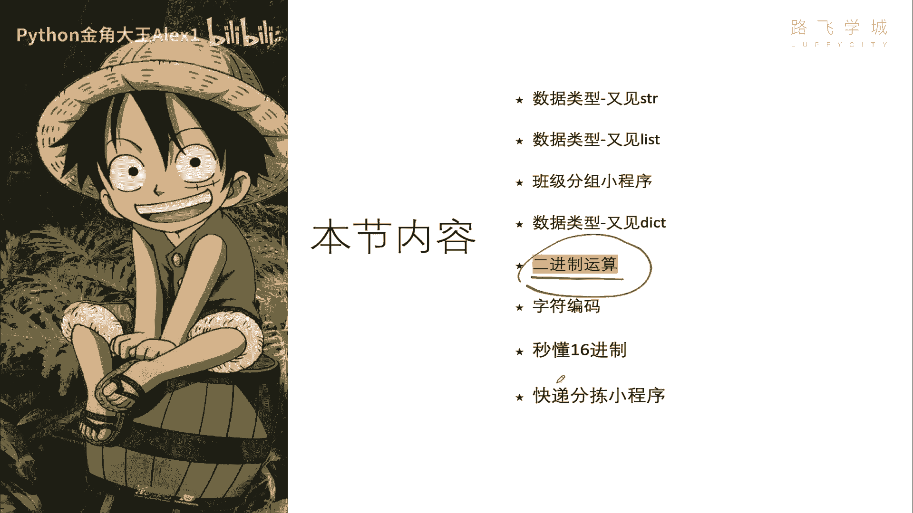
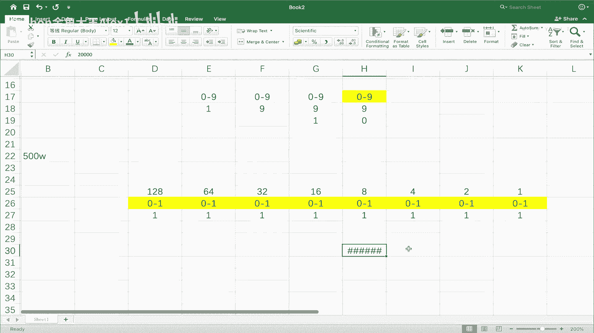
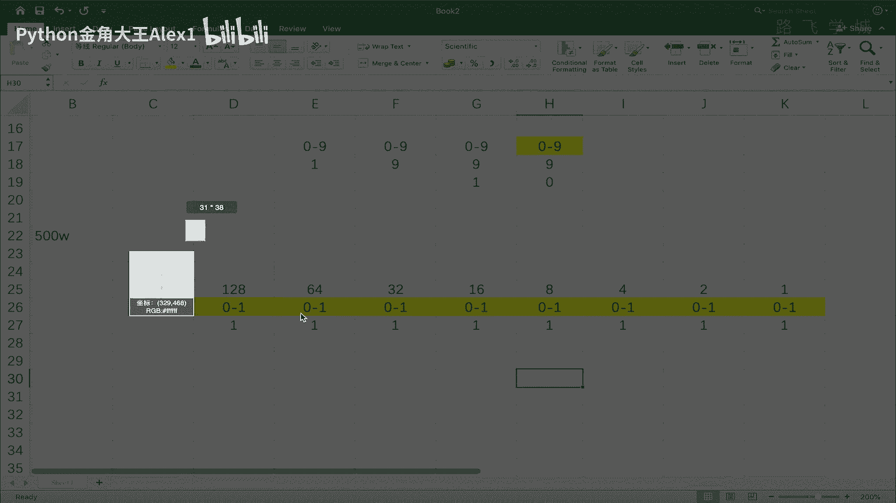
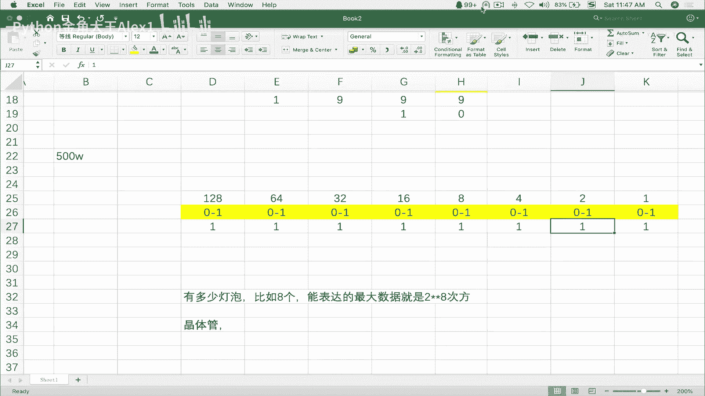

# 【2024年Python】8小时学会Excel数据分析、挖掘、清洗、可视化从入门到项目实战（完整版）学会可做项目 - P35：07 秒懂二进制运算 - Python金角大王Alex1 - BV1gE421V7HF

OK同学们，这节课咱们来学二进制运算，这是计算机底层的一个知识哈，那为什么必须学这个，这个不学，后面我们学爬虫啊。

其他的都是很费劲的好吧，那在讲二进制之前，先给大家讲一个小的引子啊，大家知道计算机呢是通过电流来驱动的，是插上电就可以运行了，那可那科学家是如何做到让电流能理解，咱们现在的数字文字图片。

以及你现在能听到我的声音呀，视频呀，他是怎么做到的对吧，电流它本身没有任何状态对吧，就是插上电就就就就就过来了对吧，你一摸电死了啊，没有什么状态，那所以呢科学家想诶，它怎么能变成这些数字啊什么的呢。

诶他就要把它跟人类的这些东西能做上关联，科学家发现诶，通过这个控制电压，电流的电压，可以把这个电流分成高电压和低电压，高电压低电压好，高电压，我可以让他把这个电流电电流加大，它就高电压把电流加大呢。

它可以什么代表一种状态啊，这种高电压的状态，我我啊，Sorry，我称它为一，比如说啊低电压的状态呢，我就称它为零，一和零是人类能理解的数字，是不是啊，数数字，那电流高电压也能区分一下他俩一关联。

是不是就把计算机就是电流能能理解的，能表达的状态，和人类能理解的这个数字关联上了，这样关联上之后，我跟你讲一生二二生三，三生万物是吧，是这样说吧，所以有那么一个最基本的关联，后面就产生了这些丰富的东西。

有的同学说我不理解高低电压啊，这个物理没学好，没有关系啊，给大家举你假如说这里是一个水管啊，这边有两个人，是不是啊，假如说这是在古时候啊，两人通过这个水管传递信号，他俩呢靠着接着20km对吧。

20km哦，那所以没办法靠后，也没办法打电话的时候没有电，那只有那么一个水，这边呢他俩就约定说，哎我这个咱俩怎么传递信息呢，哎那这个人就想不出来，这样我把这个水流加大加大填满的时候。

你这边感受到水流特别强的时候，就代表我给你传递一个信号，说哎敌人来了，是不是还传递一个信号啊，你快点给我派援兵，如果我这个水流正常数比较小对吧，正常数比较小，那代表咱们呢这边相安无事。

没有什么战事OK吗，所以水流大的时候对吧，他就把这个水管填满到这里，他感受到啊，水管突然满了，代表敌人来了，我快点派援兵，如果水流特别小，代表没什么问题对吧，我就OK了，所以通过这个就相当于水流的大小。

就可以传递两种信号，是不是这两种信号，咱们水流大的时候可以设置它为是一，水流小的时候可以设置为零，明白这意思吗，哎就跟咱们这个高低电压是不是一样的，明白吗，哎那这个这个什么呀。

这个你现在是一个现在只有一个水管，那我在这里为了表达多种状态，我可以按好几个水管的组合，比如说这个水管强，那个水管弱还代表更多的数，更多的这种数据组合啊，或者再给大家举个例子，这就像灯泡。

大家你看你自己这个屋子里，这个灯就一个灯的话，你把它开了，它就是一种状态，把灯打开，灯就亮了，它你可以认为它是一种状态，对不对，这是一个灯泡啊，给他打开了又放量了对吧，然后呢它代表一种状态。

你就说它是一，如果你把它关了对吧，把这个灯泡关了诶，灯就灭了，然后就黑了，屋子里你有一种状态是零，可不可以啊，就跟高低电压一样了吗，然后呢现在是一个灯泡，只能表示两种状态，零或一是不是啊。

那如果你这里有多个灯泡，多个灯泡是吧，你可以用灯泡的组合啊，这个亮面的不就是开关的组合，比如说这个量这个灭这个又亮诶，那这种他表示多个组合就可以表示多种状态，多种状态，明白意思吧。

哎这个东西怎么讲就特别像啊，就他就他就跟那个什么，咱们数学里的有一个叫二进制的一个东西啊，很像二进制的多选项，二进制呢只有两种状态啊，两只有两个值，一个是一，一个是零二进制的一个呃，这个规则是什么呀。

叫逢二进一，逢二进一啊，怎么怎么怎么怎么写，我给大家写到这里吧，啊逢二进一哎写在这吧，嗯缝，逢就是遇见的意思，哎我这啊逢二进一，大家看啊，它跟这个十进制啊，这个运算的原理是一样的，十进制是什么呀。

逢十进一对吧，对范范，总之逢十进一看到没有，逢十进一好吧，那这个逢十进一是个什么意思，对不对，大家来看，我在这里就是十进制的话，比如说我在这只有一个数，这一个数就这一个位置，假如说咱们就这一个位置好吧。

这一个位置啊它是一个个位数，我们称为个位数，十位数，百位数是不是这个个位数他自己能从0~9，是不是个位数，是不是从0~9啊对吧，当是十的时候怎么办，当是十的时候，他表达不了的个位数，只能表达00~9。

所以到十的时候他干嘛，他要借位，是不是啊，所以就出现了一个叫逢十进一，对不对，他要借一个位，这一个位又是一个0~9，对不对，那这里面他在这里写了一个他，他他在这里写了一个一对吧，在这里写了一个零。

那是不是就代表十了，对不对啊，所以就是逢十进一嘛，那当然如果到99的时候，比如说这里也到九了，这里也到九了，都满了，两个都满了，是不是再进一啊，那就到了百位数，是不是百位数再借一个，99的时候。

在99的时候在这里建一位，那这个位就代管J，你写一个一就代表是100，是不是啊，然后把这俩换成零，它是不是就100了，三位数表示100，然后如果三个都是九的话，都占满了的话，是不是再去借位。

这就叫逢十进一，明白意思吗，那二进制跟他是一模一样的，二进制不过是二进制，是逢二进一，你这个十进制这里一个数可以代表0~9，但是二进制这里只有一个数，只能是什么呀，0~1它只有两个值，没有二，明白吗。

比如说你用这个值，它只能表达就是有一个零对吧，有一个一，但是如果你这里想表达二干嘛怎么办，没关系，逢二进一，逢二进一，这里又加了一个数，加了一个数啊，加了一个数之后，这个数也是只能表达这个零和一。

所以呢你要想表达二怎么办呢，你想表达怎么二怎么办呢，直接把它化成一，明白吗啊把它画成一，然后把这个变成零，看到没有，这个就是一个二啊，你说这不是十吗，那那是十进制的对十进制你要这么写，个位数写一个一。

然后sorry，十位数写一个，一个位数写一个零，它是十，对不对，二进制在这里对吧，这个第二个数写成一，这个是零，那它就是二，因为这个是二，这个是最大能表示的是一，明白吗，它是逢二进一的。

那现在如果大家看啊，如果我这个什么呢，我想表达三怎么办，很简单呀，你看你这里表达二了，这里这里能表达一，你把它变成一，他俩加起来对吧，他俩相当于这两个位置都占了，那不就是加起来就是三吗，有同学说我想哦。

有同学好像有点理解了啊，我有同学说我想表达四怎么办，我想表达四怎么办，没有问题啊，你看他这两个这两个数最大能表示的值就是三，是不是啊，那在这里看最大能表示的数就是三，我可以干嘛呢，我想表达四没问题。

继续结尾，因为它只要它是逢二进一嘛，因为你这里已经占满了，不能在这里再往在这里写一个二或者什么的，那你就补位，就相当于是到了十进制的百位数，类似这种对吧，补位继续补，补位补补什么呢，你看你补的这一位。

因为是这样啊，因为你这里是全满了之后才借的位，看到没，全，就是就这两个数能表示的最大的值，已经是最大是三了，然后你才开始借位，那你借的这个位它就是四啊，它就是四，为什么呢，3+1就借一位吧，3+1是吧。

3+1减一位就是四嘛，就像这个十进制数是的，你现在99了，再借一位是不是就正好是100啊，所以第三个你这个就是个百位数对吧，这个三个999再借一位就是什么呀对吧，再接一位，看到没有，这就是千位数对吧。

999下一个位不就是1000吗是吧，那二进制也是一样的，三往后进一位就是四，对不对，然后呢他依然也是0~1对吧，所以你想表达四直接是这样，看到没有，把它不是在这写的，你把它变为一，后面都变为零，注意了。

后面都变为零，这就是四，同志们啊，这个就是四，这个就是4K吗，那如果想表达五怎么办，同学们，你们告诉我同学说还很简单呀，我把这个变成一，可不可以把这个变成一，没有问题啊，这就对了呀。

这个相当于你这三个数对吧，相当于你三个灯泡吧，三个灯泡对吧，这个亮了，这个亮了，那就是代表五，看到没有，代表是五，可以这俩加起来不就是五吗，对不对啊，因为这两个灯亮了嘛，对不对，那同志们。

我想表达六呢对吧，这是四，这是四像对吧，这个是四吧，然后再加上这个，这不就六了吗，把这个给他灭了，看到没有，这俩不就是六吗，我想表达七呢，再把这个给他亮上，这不就是七了吗，对不对，哎。

三个灯泡三个值最大能表示的数字是看到没有，从0~7，也就是八个数对吧，从0~7嘛对吧，诶这个表示的最大的这个值是七了之后，那我想表达八怎么办，那你继续借位呀，你继续借位啊，你在这里就是0~1又借了一位。

对不对啊，就借了一位，然后这个值他借的这个V的值不就是加一吗，7+1嘛，对不对，就是八呀，同志们，是不是啊，然后你想表达八直接把它变成一，其他这几个都变成零就可以了，这几个都是零。

然后这个就是一个什么呀，同志们，他你把这一个灯给亮了，它就是把它就是8K吧，对这是借位借来的啊，然后我如果想表示表示九怎么办怎么办，你你就到这里面去找啊对吧，这第一个灯泡是代表一，是不是。

那我就我就把它变成一了，所以这俩加起来它不就是九吗，看到没有，他不就是九嘛对吧，我想表达呃这个11哎对11怎么办，这没办法单独加十一八。9这里，那那那也好像很简单，你看这俩已经是九了，对不对。

再加一个二不就11了嘛，对不对，再加一个二就11了，那你看直接把这个变成一，看到没有，那你不就是这三个数相加的吗，这个这个这三个灯泡加起来是不是一哎，这同学说我表达十二十二更简单呀。

八直接加上四不就12了吗，那你就是这个一这个变成零，这个变成零，对不对，Sir，你这几个数的最大的，说，这几个数最大的组合，就是他家他几个加起来最大表示到15，从0~15，一共16个数，明白意思吗。

全都是一就是15，也就是说你四个灯泡都亮的话，看着四个灯泡都亮的话，它就是15，明白意思吗，然后表示16怎么办呀，再借一个呀对吧，再借一个呀啊，然后这不就是他自己就是16了嘛，对不对。

我在那这几个数相当于五个灯泡，最大表示31，如果我想表达32怎么办，诶，就又接1V312加一就是32啊对吧，再加起来是多少，63，想表达64怎么办，再接一位啊，对不对，加起来是多少，127。

也就是这几个灯泡啊，不这呃哎呀呀呀，这是这是啥意思啊，对这几个灯泡，这几个灯泡啊，这个七个灯泡最大能表示的数值是127，127+1个零啊，所以一共能表示128个值对吧，从0~127。

那就是如果是这几个灯泡全亮的话，那它就是127，明白吗，哎如果你只量这一个，它就是64，其他是零的话，明白吗，那我想表达128怎么办，没问题呀，直接把这个词把这个塞给他借一位，对不对。

那你这里又多了一个灯泡，所以一共八个灯泡能表达的值是255，看到没有，能表达依次往下去，明白意思吧，SORA你就依次这么往下去，看到没有，依次往下去继续可以加，想表达多大的数值，就可以不断的往后加。

明白这意思吗，哎有的同学说，哎你你这么你这么既然知道这个规律了之后，同学们呃，你有没有发现他这个算法有没有一些什么规律，比如说我想快速的说，我想表达啊，500万，我想表达500万。

我得我得可我500万呢，我可得放多少个灯泡在这啊，放多少灯泡在这，那你一个个一个个算的话，当然可以，但是这种是有点笨办法是吧，但是很简单的笨办法，你就往后一直不断不断的加倍嘛，对吧。

但是其实这里面数学数学嘛，他总是有各种规律的，它有什么规律呢，因为你会发现啊，这四个灯泡最大能表示的值就是它的排列组合，对不对，他就各种排列组合能表示最大的值，其实你看就是这四个灯泡，然后15嘛对吧。

15是多少呢，十十五零十最大能表示到15，但是它能表示的这个值是0~15，一共是16个值，对不对，一共16个值正好是二的四次方，因为你排列组合四根嘛，四根能表达的最大的数值，就是能表表示多少种排列组合。

不就是他的多少次方法，对不对，数学里学过的多少次方，二的四次方啊，那乘是这样，二的四次方是多少啊，是不是就是16啊啊sorry，这这这这这excel也不行啊。

二的四次方就是就是什么呀，就是16。

没错吧啊，那二的五次方呢，二的五次方是不是就是32啊，还是得有二的四次方，对不对，二的五次方对不对，二的八次方，咱们看256，咱们这里正好有八根灯泡，加起来看是不是255，再加上256。

总总共256种状态对吧，八根灯泡，八个灯泡能表示256个状态，那也就是说你这里有多少个灯泡，你就乘以多少次方，就能算出来它能表示的最大的数值是什么，这句话能理解吗，啊有我再写一下有多少灯泡对吧。

就啊就就是多少就是啊就可以啊，就可以有多少次方，就是有多少有多少个灯泡，就是这么写的多少次方，比如说比如八个对吧啊，然后能表达的最大数值就是八的，就叫做二的对吧，八次方，这样吧，这能理解吧。

有多少灯泡就是二的多少次方，OK那我这样去推500万的话，按照这个规律推500万的话，我就不用一个个摆了，我通过公式去推演就可以了，对不对，咱们就直接在这里算就OK了。

二的比如说这个啊12次方是40962的，16次方是6655356万，那我就往上二的20次方，这是多少啊，万十万百万诶，再往上加一个22，是不是就是400万了，23对吧，是不是800万了好。

也就是说我最多用23个灯泡，就可以最大表示800多万，那我在这里面进行各种排列组合，就可以完整准确的表示出我的500万，这个值对吧，因为它最大可以表示800多万，你通过各种排列组合对吧。

因为他要精准500万，所以这里有的一有的零最终加起来就是500万，明白这意思吗，好这个就是通过二进制来实现了这个什么呀，就是灯泡的这种排列组合来实现了，我能表示人类可以理解的这种特别数字。

特别大的这种十进制的这种数，明白意思吗，OK那这个呃一当我们科学家把这个什么呀，电流对不对的，高电压低电压是吧，就搞成了这种二进制的这种形式，二进制又跟咱们这个十进制相通，哎，这样的话。

就人类能理解的东西和计算机可以理解的东西，是不是就关联上了啊，通过很多个灯泡，这个灯泡所谓的我这里大白话灯泡，其实就是计算机里的那种什么呀，CPU的那种晶体管啊，大家知道这个晶体管就是这个什么呀。

它一个晶体管，一个晶体管单元就是控制的一个高电压，一个低电压，你就可以理解为一个小灯泡，一个现代的CPU有15数百万个晶体管，我是亲自去过英特尔，那个做CPU的那个那个那个公司，总部就在美国那边去参观。

卧槽老牛逼了，他说他们那个他们能把这个啊，这个这个这个呃就晶体管放在一个手指盖，夹手手指盖那么大的一个，就是你的手指盖那么大的一个小芯片，上能有数百万个晶体管，数百万个晶体管能组成多少个。

就数百万个灯泡能组成多少个组合，所以CPU的运算能力才这么强大，明白意思吧，啊明白意思吧，OK所以这个就是把二进制底层计算机底层，为什么就用二进制这么一个原理，给大家大概讲清楚了。

然后呢嗯差不多就是这些，OK你大概理解一下。

