# 【2024年Python】8小时学会Excel数据分析、挖掘、清洗、可视化从入门到项目实战（完整版）学会可做项目 - P36：08 计算机如何实别文字 - Python金角大王Alex1 - BV1gE421V7HF

OK同学们这节课呢学这个字符编码啊，你会了二进制。

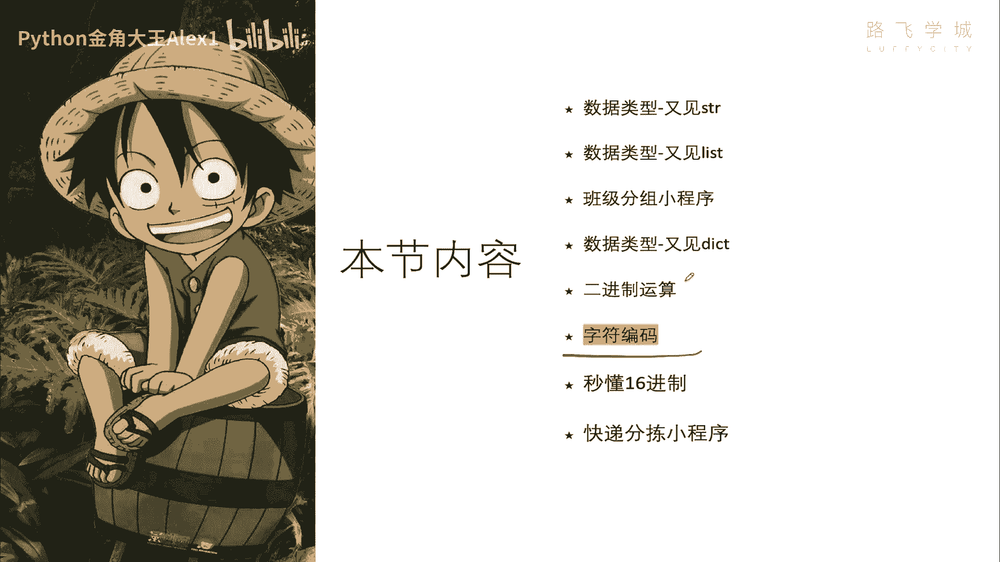

再听这个字符编码，你就啊容易理解了，这里的东西比较多，咱们来认真来听，那上一节课的二进制的这个知识，让大家知道诶，二进制和十进制之间的转换，就能让计算机理解，咱们人类可理解的出资了对吧。

那计算机可以理解人类的这种啊，这种这种树对吧，但是像咱们这种文字呢对吧，汉字这个英文字符计算机是怎么理解的对吧，二进制跟十进制之间有这种转换关系，转换逻辑，但是它跟这种字母啊，这种汉字啊。

它没有任何看它有什么转换关系吗，它没有任何关系，完全没有任何关系，你怎么也想不到他俩之间是有关系的，没有关系啊，那既然没有关系，那可怎么办啊，你你还是要表现这些字符的，对不对。

你不能让人天天就弄一个计算机，就像计算器一样，只能打数字对吧，那就太low了，那于是科学家就是左思右想对吧啊，冥思苦想就想到了，说既然完全没有关系，那好我就给他们强制发生关系，怎么强制发生关系呢。

他就啊做了那么一件事，他首先说从二进制到十进制，是不是他俩是有关系的，对这个这个互相的这种转换关系，对不对，那好我就这样，它跟文字就是这种英文字母，对不对，A到Z或者是这个汉字它没有任何关系，没关系。

这么干呃，我就给他强行发生关系，怎么强行发生关系呢，我搞了一张表，这张表呢就是就像excel表示的一张方方正正的表，这张方方正正的表里面不就写好了，英文字母ABCDEF，对不对，这张表里面对吧。

有有有这个有这个行，有这个列，对不对，多少行多少列，这不多少行，比如说第五行，这不是十进制吗，第几列不是也都是十进制吗，哎我就这样把这个表跟这个十进制进行挂钩，看到没有。

AB就是这种这个表里面这种ABCDEF，这种英文字符是已经就是已经确定好的了，就是放在那个位置，而这个位置是有十进制数来什么的，十进制又能转成二进制，把这个表放到计算机里，然后文字转十进制。

十进制转二进制，那二进制不就是相当于跟这个这个什么呀，字母什么的不就关联上了吗，这样的话他不就能对吧，通过相当于啊一串二进制对吧，比如说这个二进制，找到的就是这个表里的这个十进制，第五行转换成二进制。

就是这个数字这个二进制的值，然后不就能把这个字母打印出来了吗，能大概理解这意思吧，好那这张表就解决了咱们计算机什么呀，这个最底层的一个问题，识别文字，识别文字啊，看到没有，这个表叫阿斯克码表。

阿斯克码表大家先先不用看他的解释，就直接看他的这个表的长什么样子吧，你看它这里面有一个十进制，跟这个字符的对应关系，看到没，十进制字符的对应关系，它是从0~255，看到没有，0~25，一共256个字符。

看到没有，256个字符，然后呢十进制跟这个字，每一个数这里都对应了一个真正的一个字符，看到没有啊，零这个零这是什么，是空的，不是它对应的是空格，看到没有零，你为什么空格打印，你是看不到东西的对吧。

还是空格，零是对应的空格E是对应那个笑点啊，这是这是铺垫嘛，然后呢呃还有这种特殊符号吧，总之是然后大家看到40几的时候，四十四十八看到没有，48对应了一个字符012哎。

有的同学说这十进制为什么还要有对应啊，注意了，十进制，就是你现在你现在在你这个电脑上打印一个零，这个零你知道它是一个数字，但是计算机显示的时候，你可以理解为，它其实就是相当于把一张图片贴到这了。

明白这意思吗，啊把一张图片，它其实是想通过通过这个阿斯顿马表里，找到这个长得像这个样子，也就是这个零的这个形状，就像一张小图片一样，把它打印出来了，明白吗，这个意思，所以说这个零实际上是十进制。

代表十进制数的48，明白吗，一啊然后还有什么帽和大于号，小于号，然后大写的字母字母ABCD看到没有啊，到Z还有什么呀，小写的小写的看在哪，小写的是从97开始看到没有，哎，一直啊。

反正这种这种东西一直都有都有都有都有，然后还有后面一堆特殊字符，明白吗，一共是256个，这个东西叫阿斯克码表，看到没有，英文名字。

american standard code for information interchange啊，美国信息交换标准表啊对吧，这个就是美国人搞出来的，它是基于拉丁字母的一套电脑编码系统。

也就用于显示现在的英语和西欧的语言啊，欧洲的语言，也就是说有了这张表，那计算机就可以打印文字了，这是现今最通用的单字节编码系统，单字节先不用管啊，就是最通用的编码系统，也就是英文展示。

所有都是到现在为止，依然是电脑里靠这张表明白吗，这张表搞出来好多年了，五六十年了，到现在至少得啊，那这个呃这就就有了这张表之后，同志们就就好弄了，大家看啊，我们来可以给大家试一下啊，怎么讲，咱们说了。

其实它的转换关系就是文字到十进制，十进制再到二进制。

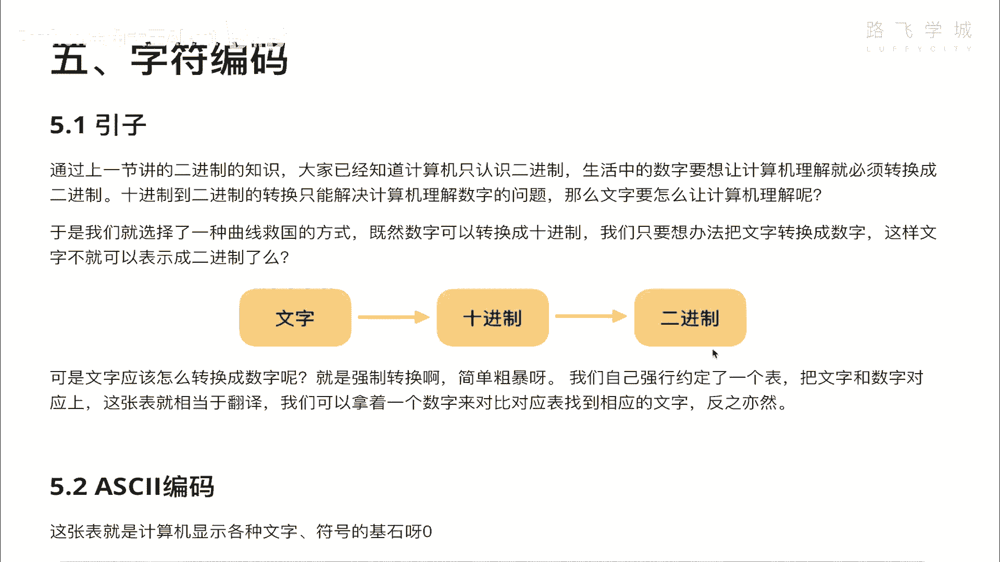

对不对，咱们为了验证他这张表的这个这个啊，叫存在是吧。

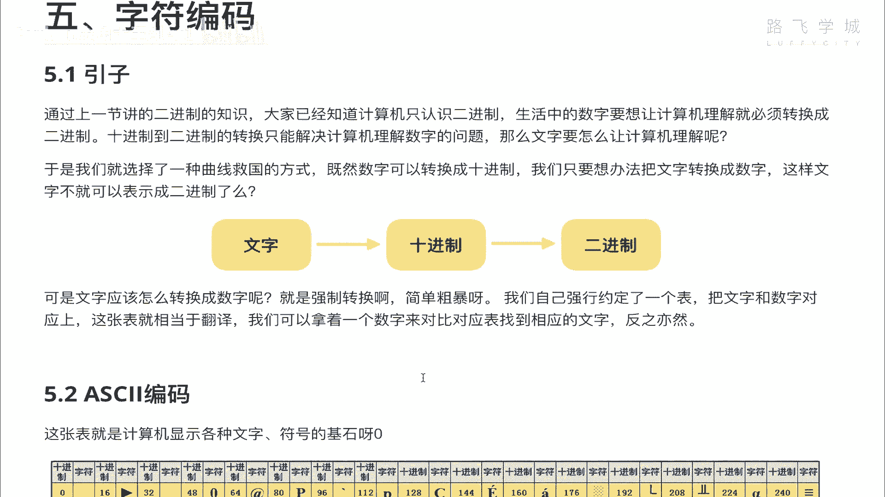

我们可以看一下，你比如说就像这个48这个值看到没有，48这个值，Sorry，零这个数字它真正的呃，再转成二进制的形式，是不是，Sorry，它是它是什么呀，它是对应十进制的这个数字，48，对不对。

然后转成二进制，就是四四十八转二进制能理解吗，我们可以来验证一下，验证一下，在计算机里有一个函数，这个函数可以调出来，它的二进制应该是ORD还是CA小，应该是ORDORD。

然后你直接在这里面输入一个零啊，不能输入这个零，你应该是输入一个字符串形式的零，看着大家看是不是产生了一个48，明白这意思吗，是不是产生了一个48K，注意了这个东西就是呃这个什么呀，阿斯克发力。

他就把这个这个零。

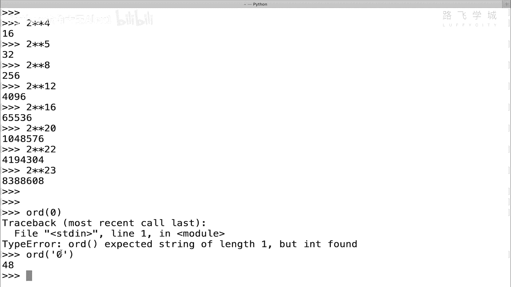

这个值跟这个十进制的这个对应关系，在阿斯玛瑞亚里的对应关系给你打印出来了。

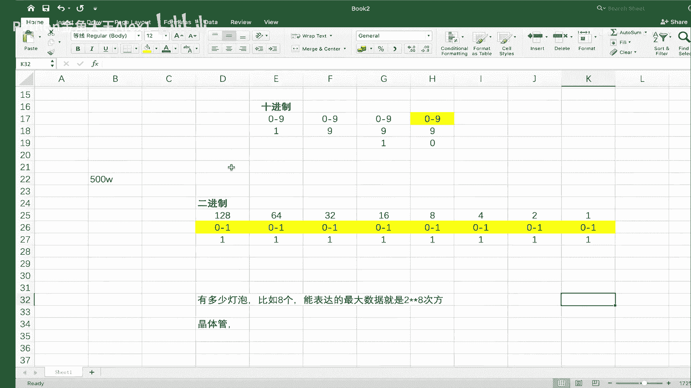

你再看那个什么呀，比如说小写英文字母啊，这个A大家看是97，97在这是不是在这，同学们对不对，你把这个97的这个数值再转成二进制，不就完了吗，对不对，转成二进制的计算机不就能表示了吗。

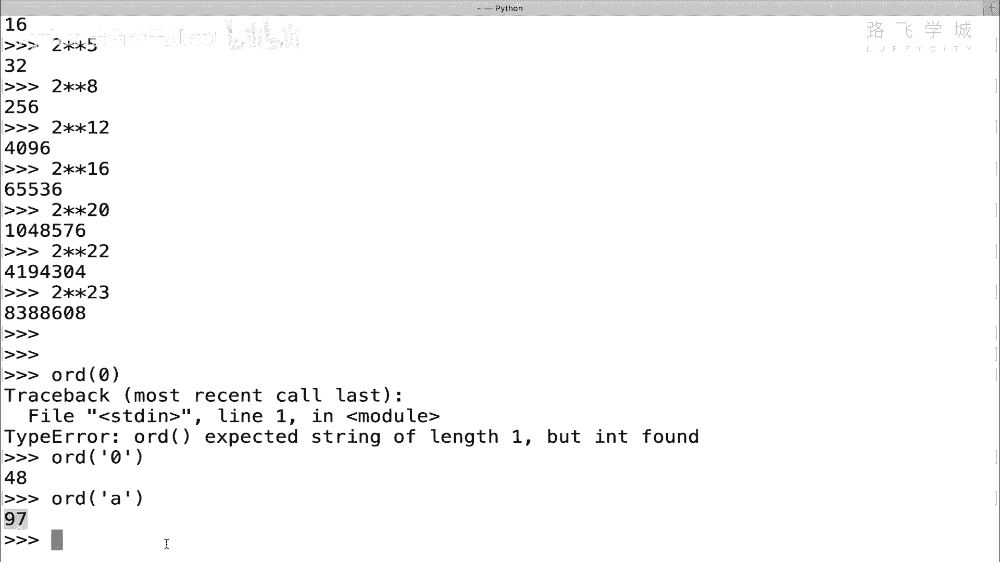

OK同学们啊，那这个就是阿斯克码表，可以显示文字好了，那明白了这个之后，同学们啊，我们这个什么呀。

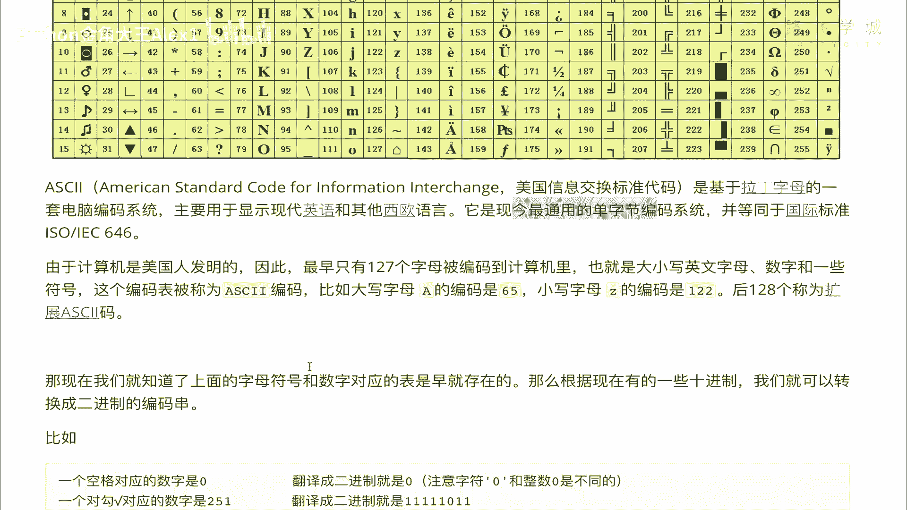

再来看对啊，再来看一个什么东西呢，就是说我们已经知道他呃，这个底层的展示是靠这张表了，对不对，那我们想看一下展示一个什么东西呢，在这里哎我们想打印一个呃。

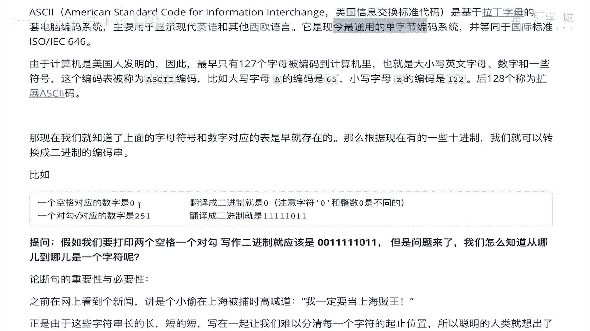

这个空对空格对应的这个值是零，看到没有一个空格对应的这个十进制数是零，对不对，然后呢这个一个对勾看到没有。

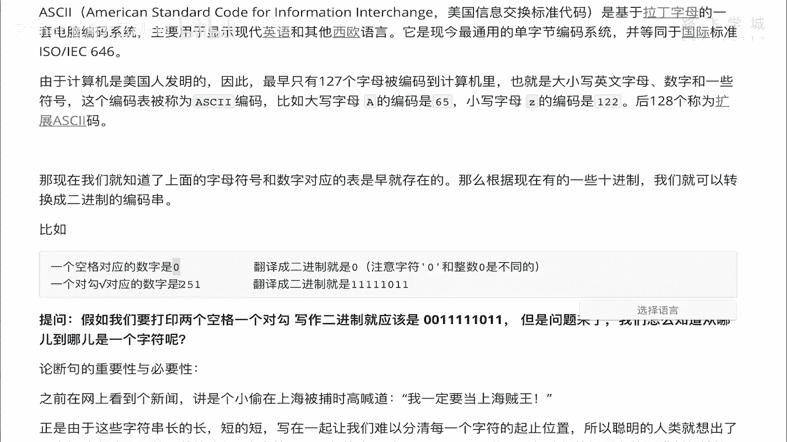

对应的十进制数是多少啊，251，对不对，251，然后我要把它连起来对吧，我想我想在计算机打印他俩连起来的一个形式，因为它都要转成二进制的嘛对吧，所以那这个零这就是空格。

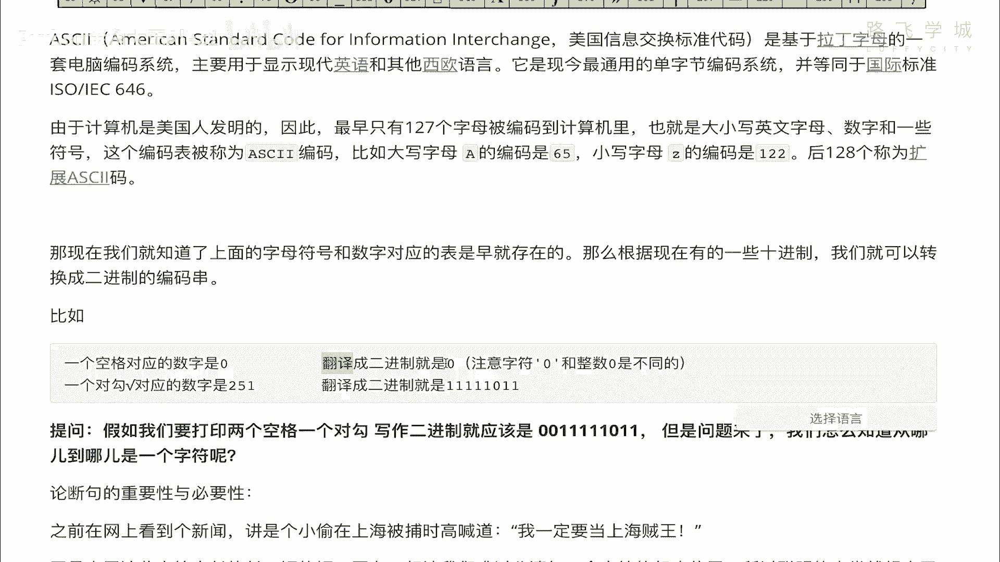

翻译成了这个二进制，它就是真正的零啊。

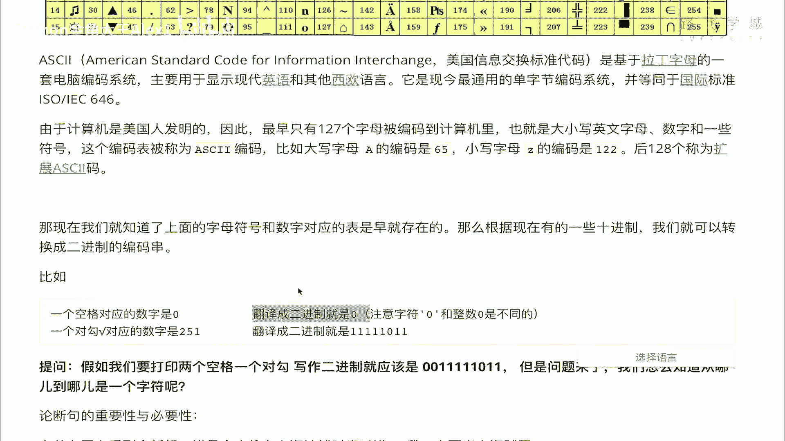

对不对，它就是对应的十进制数是零的话，十进制数是零的话。

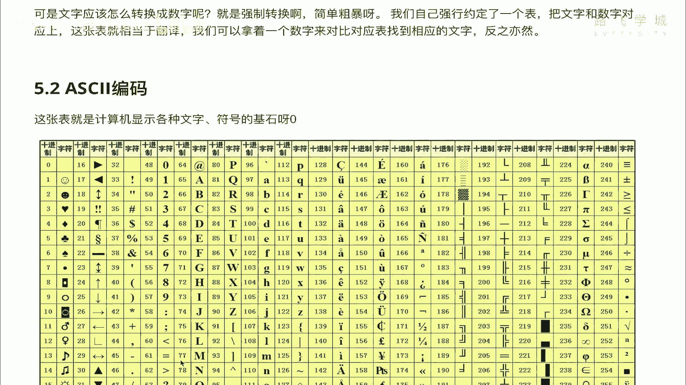

转成二进制，它不也是零吗，还记得那个转换关系吧，在这里啊。

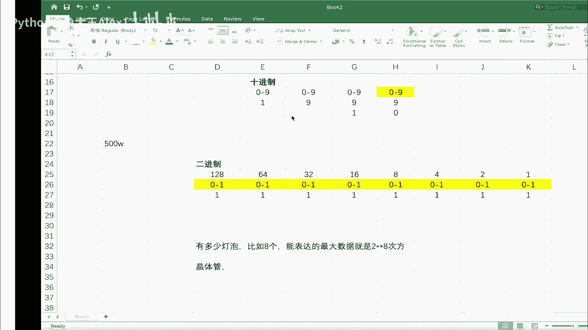

Sorry，在这里如果只有一个灯泡，对不对，那你如果是不亮的话，它不就是代表十进制数的是个零吗，对不对，也就是说我一个空格，它就真的是真实实在在的二进制上也是零，明白吗，那我一个对勾是251。

251的话，我要转成这个十，转成二进制多少啊，128+64加上32，加上16+8加上哎，这就抄了，不要加这个加这个二百五，看到没有，那我转成了二进制，转成的这个什么呀，转成的这个十进制就是转成二进制。

就是这样去掉，这个是一，这个是零，其他都是一，对不对，那看着啊，也就是说第三个是零，其他都是一，咱们我在这里其实已经给你转好了。

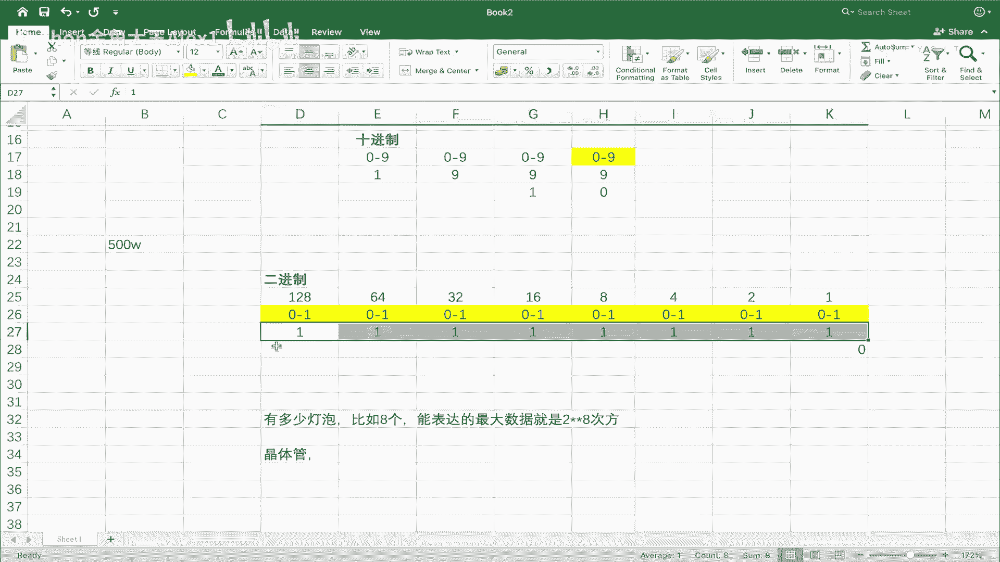

在这是不是这个是零，其他都是一个二进制形式，是这样，那我现在问你一个问题，假如我们要把什么呢，打印两个空格，一个对勾啊，两个空格一个对勾。

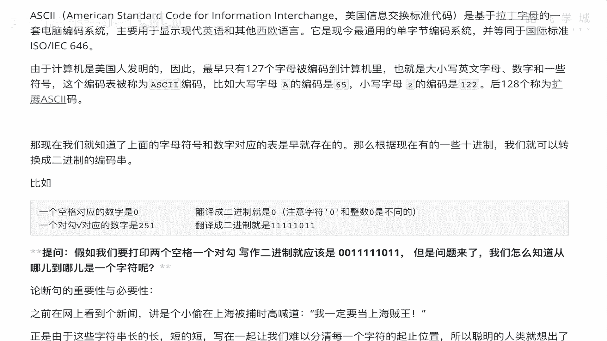

怎么做，两个空格一个对勾，同志们，我先把这个二进制给你拿过，这个是把这个是这个是零是吧，这是个零，然后他是这样吧，我把这个耗费到这里来，接近一点再近一点啊，好同志们，这个是一个对勾是吧，对勾对号啊。

然后呢我要在我的要求是打印两个连续的空格，两个空格对吧，加一个对勾，那同志们他的二进制形式是什么样子的，二进制形式，因为两个空格都是零，对不对，所以呢就是啊两就有占两个二进制，一个是呃一个二进。

在这里吧啊对像一个打印一个对号，两个空格吧，但这里是一个呃二进制，这里是一个二进制，对不对，但是这个二进制是零的形式，这个二进制也是零的形式，所以整个打下来就是两个空格加一个对号，打印出来的。

它总共占了十位，对不对，前面八位是这个，后面是两个空格，对不对，这是一个空格啊，这是一个空格对吧，前面这个是一个对号，这八个对不对，那同志们给你这样吧，区分一下啊，同志们这里就带来一个问题了。

这加起来一共是十位，没错吧，加起来一共是十位，那好我在计算机底层去取的时候，我问你怎么去，就是说我计算机底层它怎么能分辨出来，这是一个对号和两个空格的组合，就说这十个值我怎么能分辨出来。

他是有三个数对吧，一个对号，两个空格加起来是三个数吗，它有三个，它有三个字符啊，而不是两个字符，比如说我我我我，难道不可能说这几个是一个组合吗，这几个组合加起来，这五位加起来是三十三十一啊对吧。

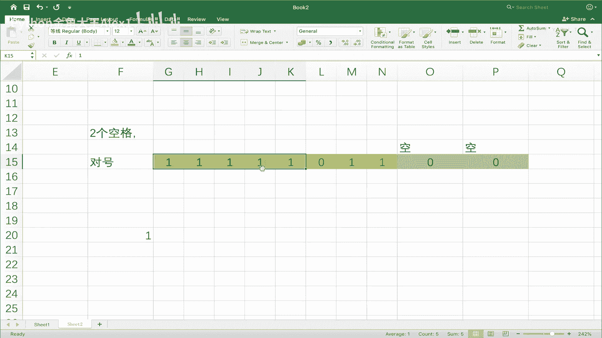

31的话在阿斯克码表里是多少，一个这个下尖括号对不对。

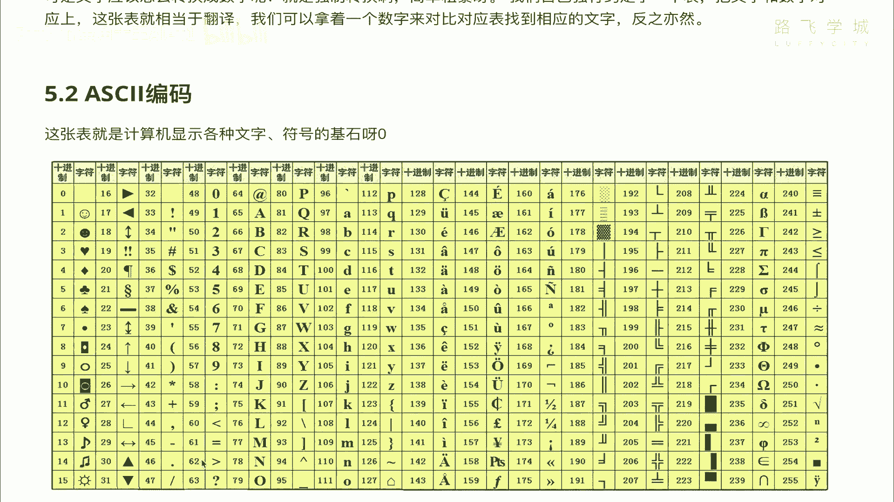

我怎么我怎么不可能是31呢，对啊，我有可能就是五个的组合，再加上这个什么呀，后面无关的组合对吧，这后面五个组合这几个加起来是多少对吧，前面都是零，哎呀我也不会算啊，自己算一下吧是吧。

总之我有可能是这样两个组合，这两组数的组合对吧，你怎么让计算机知道这是三个数的组合，你能明白我说了这么多的意思吗，就是说你你怎么计算机怎么知道，这十个十进制数拼起来是代表三个字符。

而不是说啊这么两组组合能理解意思吧，哎也就是说你这个地方没有断句，没有断句，那计算机就不知道我是这么两两组的数据组合，还是说这么两组的数据组合，对不对，也就是说我现在给你通过颜色加的区分了。

并且我告诉你那么多了，你才理解啊，这是三个字符，我如果是直接全都一个颜色，什么也不说，让你直接看这组数据，你也不明白，你自己也不明白，他这是代表三个字符的对吧，你以为它就是一组数，能理解意思吗。

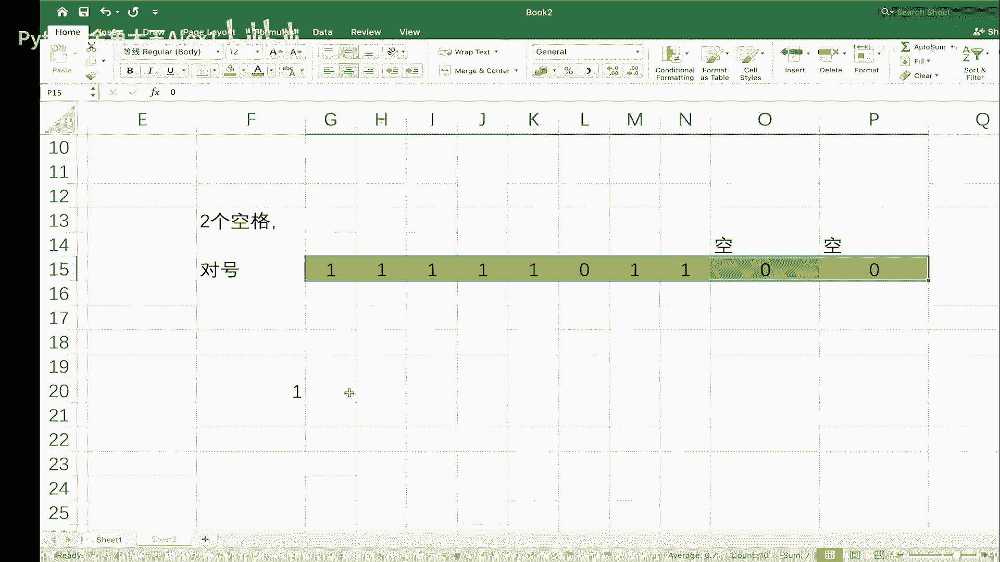

所以论断句的重要性啊，论断句的重要性啊是吧，之前在网上看一个新闻，一个小偷在上海啊，在上海被捕的时候，高喊道我一定要当上海贼王，注意了，这个地方就有歧义，明白吗，什么歧义啊，是我想当上海贼王呢。

还是我想当上海的贼王，对不对，我要当上海这个地方的贼王，还是要当海贼王，海贼王是这个对吧，路飞电影里电视剧的那个，所以断句很重要。

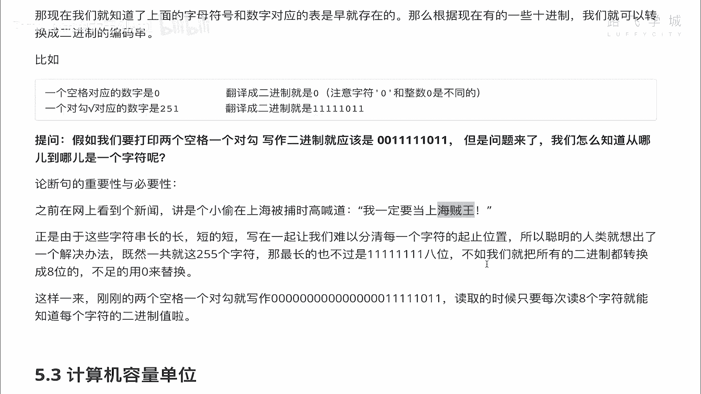

明白吗，计算机也是一样的，它必须有一个能分清对吧，这个到底是几组数据，也就是说你但是你不能在这加逗号啊对吧，像咱们写文字时候，我在这加个逗号，加个句号，那我不行，所以呢对吧。

计算机为了很简单很清晰的断句，他就直接简单的做了一个规定，这个规定是什么呢，我就直接比如说规定多长就是一个字符，什么意思，就多长就是一个字符，比如说我规定五对吧，就甭管你这个字符展示的是什么。

我五就是一个字符，也就是说我规定对不对，这个我这就是一个字符，然后就是几个五个吧对吧，我就五个就是一个字符，我就是每次取五个对吧，它可它可以这么规定，明白意思吗对吧，这样的话你即便有多少个值。

相当于你你你现在你现在有三个值，是不是你就不能是13个值，因为一个字符至少占五个啊，二进制位的话对吧，这是一位两位二进制位，那你三个字符至少要占15位，这样我才能断句，对不对，五个一组，五个一组。

OK吧，那好所以科学家就面临这个问题，说我到底是按多少个二进制位算一个字符是吧，他就决定了是到底五个呀。

六个七个呀对吧，取几个呢，好科学家又可以这样说。

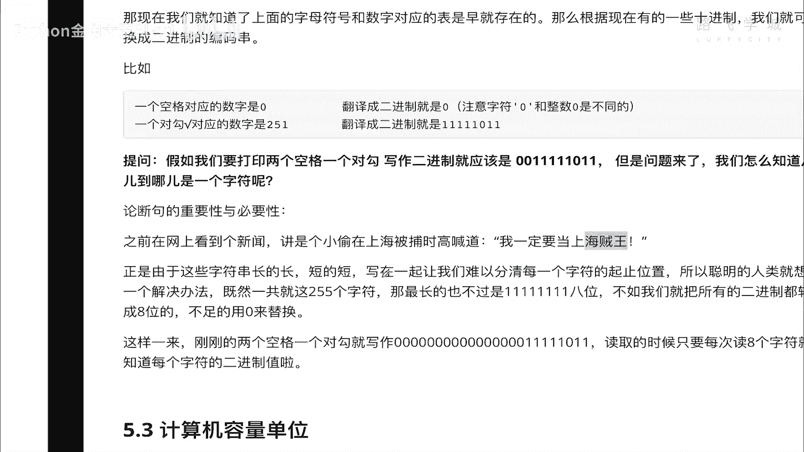

那还用算呀，很简单呀，这个这个这个这个这个不能是五个对吧，为什么，因为我这个一个相当于你看我如果是五个的话，你遇到251这个问题就来了，251自己占了八位，对不对，251他自己占了八位的话。

那你那你相当于五个占一个字符的话，它是放不下的，对不对，那是不是放不下是吧，你五个占一个字符，那这不就变成半个字符了吗，因为这个二这个对号它自己跨两个字符了，相当于就是跨两就跨两组数据了，对不对。

所以同学们你你设定一一组数据对吧，至少有几个二进制位的话，你要满足说什么呀，满足说我这个R这个阿斯玛表里的这种，这个最大字符，也就是最大，表示这个字符也就是这个Y下下面加冒号的，这个Y他占多少个倍。

能明白这个意思吧，对不对，你要确保你的一组数据能装下最大的Y，那一组数据能装下最大的Y是什么呢，就是255255，0~255是占多少个二进制位啊，0~25占多少个二进制位啊，同志们。

大家来看是不是占看到没有，是不是占八个二进制位啊，对不对，是不是这样，八个二进制比那好很简单，那就这样吧，咱们就定义八个是一组，注意了八个是一组好，你定义了八个是一组之后，那这个问题就好解决了是吧。

也就你能装下所有的字符，也就你这么一个大的空间足够，装不下阿斯克码表里的任何一个字符，明白吗，任何一个字符，然后如果现在是三个字符怎么办，很简单很简单，注意了，即便你是空，那为了让我容易断句。

也不好意思，依然是八个，12345678。

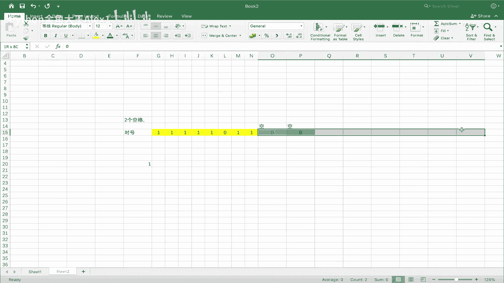

看到没有，我依然是八个，明白意思吗，我依然是八个。

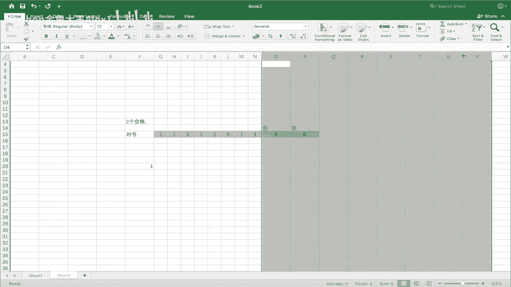

然后我就把这个八个变成又是一组对吧，然后呢我这八个又是一组对吧。

因为你用三个呃，三组数据嘛，对不对。

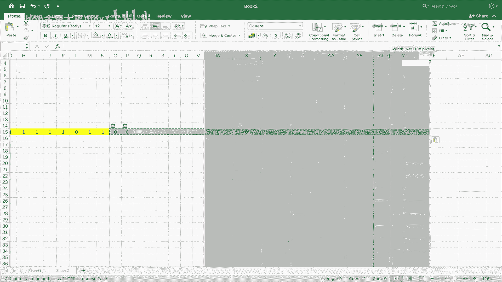

OK我在这里给你这样划分，所以像这种情况下，你看三个字符就出来了对吧，有些同学说，你看我这个空啊，明明就占一个，你给我弄出来八位，多浪费啊，不好意思，我断句更更重要，我不能让计算机为了省空间。

导致这个数据都错误了，他分不清不行，对不对，所以他必须要有断句，所以即便这种只占零个的，没关系，全都补零对吧，全都给他补上零，明白这意思吗，全都补上零，那这样三组数据就对吧，就能表示这三个字符了。

能理解这个意思吗，能理解这个意思吗，所以即便我把这个颜色都去掉，因为计算机已经有了规则，我每次是吧，这就是一个字符，这就是一个字符，每个都八次，他断句就算清楚了，所以就是这么个意思啊。

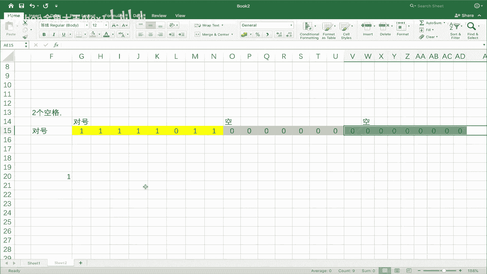

所以呢计算机里定义好了一个sorry啊，一个啊，一个字符是八个。

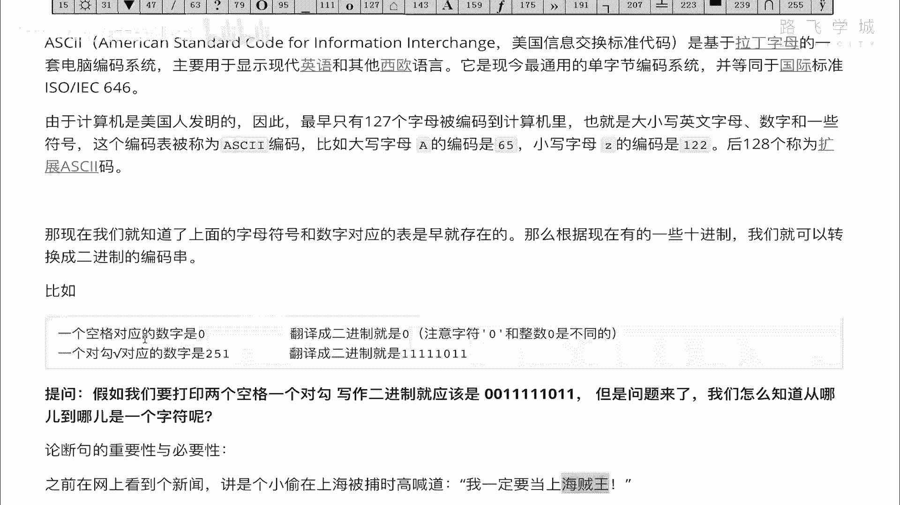

这个什么呀，二进制位OK吗，哎八个二进制位，这个大家能理解完了之后。

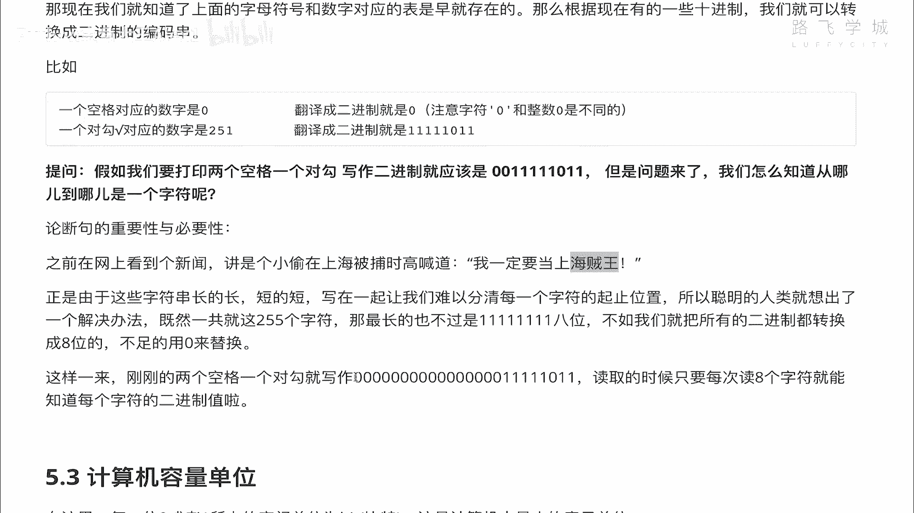

咱们接下来很快，一个所有人每天就是用计算机都能听，至少听过的一个东西就出来了，计算机的容量单位，咱们已经知道一个字符，一个字符占八位，对不对，这个八位二进制位，这个八位二进制位呢就被称为什么呢。

一个二进制位称为比特，一个比特看到没有，一个比特，这就是它的单位名称啊，就像咱们一公斤一公斤一样的一个二进制位，就是一个比特那一个字符是不是至少占八位呀，就是八个比特，八个比特看着八个比特。

咱们管它叫一个什么东西呢，字节哎，抖音那个字节跳动是吧，抖音公司那个字节跳动，大家有印象是吧，就是起了这个名字，字节八个二进制位就是一个字节，又称一个BYT啊，一个B然后呢一个比特看到没有。

咱们称之为计算机中最小的表示单位，注意了，表示单位就它能表示零和一嘛，对不对，那一个字节是最小的存储单位，为什么任何一个字符都至少要占八个八个位，所以一个字节最小的存储单位，明白意思吗。

那1024个字节，1024个字节就是一个KB。

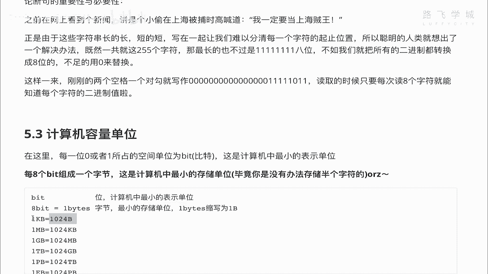

看到没有一个KB啊，1024个字节，然后呢啊然后呢这个什么呀，这个这个啊1024个KB就是一兆啊，一听到照我们小白都应该知道的，对不对，多少兆啊，你上网多少兆啊，上网多少兆是吧，100兆的上网都是扯淡。

家里那个宽带都是假的啊对吧，然后1024兆就是一个GB，一个GB相当于能存下一个电影来，明白吗，至少一个电影能存下来了，然后1024GB就是什么呀，一个T对吧，现在你买的移动硬盘对不对。

至少差不多都是一个T的了吧，对不对，移动移动硬盘对不对啊，一个T很大了，能存1000部电影是吧，1024P就是1P比啊，这个基本上都是大型互联网公司才用了，这个比如像微信啊，像这种头条。

你存那么多视频对吧，抖音那他就要PB级别，T和PB级别，再就是EBZB啊，你就不用关注了多少兆B，怎么就是跟跟咱们多少多少，千亿人民币或者类似那种啊，OK同学们，所以你通过这种通过这个叫什么呀。

阿斯特玛这种这种这个啊去占的这些空间，就理解到说咱们这个容量单位，都是根据这个出来的，好不好，OK那你们自己再把这个啊。

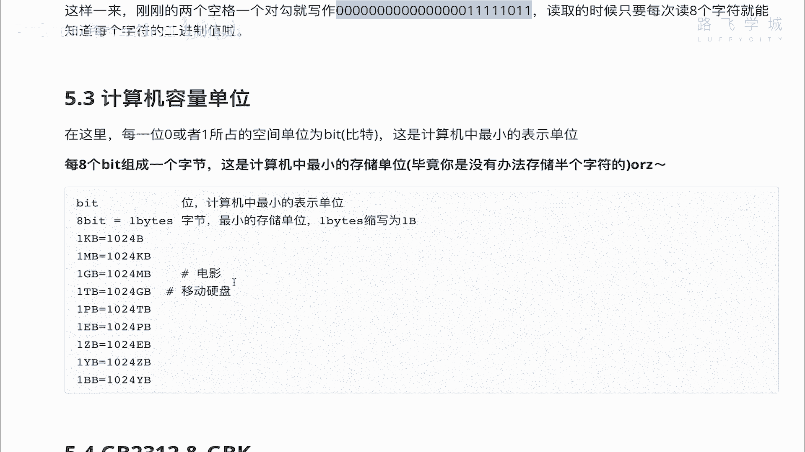

如果这块你不明白的话，断句啊。

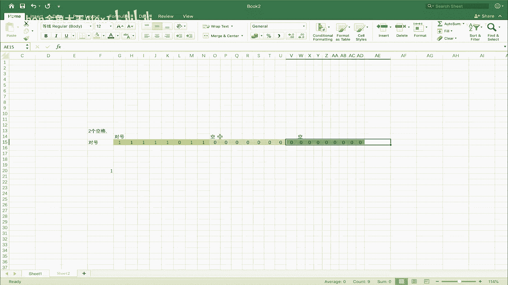

就是断句很简单，好自己再理解一下，OK那咱们阿斯克码表就给大家讲到这里。

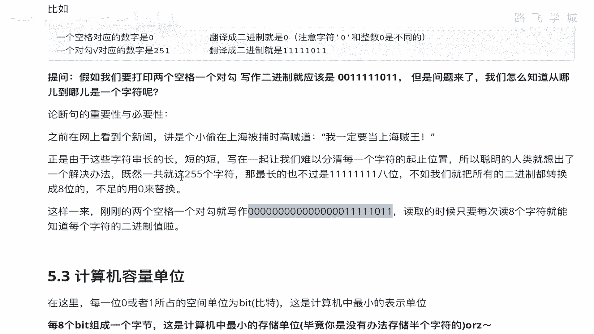

咱们的到这里，所有的字符字母就可以展示了，下一节问说这里只有字符字母中文怎么办。

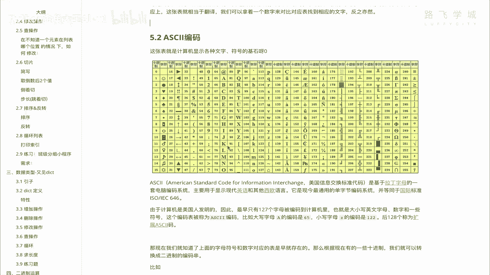