# 【2024年Python】8小时学会Excel数据分析、挖掘、清洗、可视化从入门到项目实战（完整版）学会可做项目 - P37：09 计算机如何识别中文 - Python金角大王Alex1 - BV1gE421V7HF

OK同学们，上节课我们通过学阿斯玛表，知道计算机是怎么识别这个文字的了对吧，但是你看这张表里只能识别英文字符，数字和一些特殊字符，它没有中文的位置，是不是啊，但是我们中文有那么多汉字，那可怎么办啊。

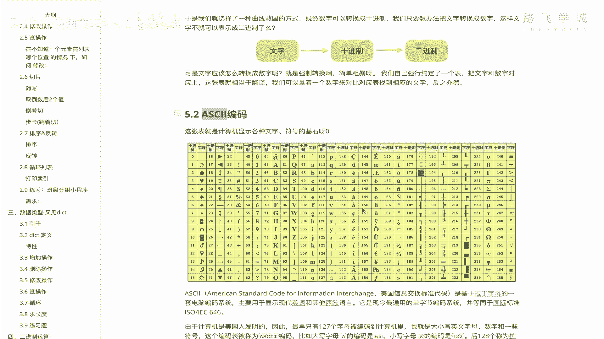

很显然啊，很显然是，所以咱们这节课学怎么识别中文啊，很显然，上个世纪这个美国佬在设计阿斯克码表的时候，根本就没有考虑中国人有一天也能用上电脑，因为那是上世纪五六十年代特别穷中国是吧，人家看不上我们。

那但是到了改革开放之后，咱们这些个人电脑什么的都进入中国了是吧，那这个那你中国人肯定不能不可能都会英文啊，所以你要显示汉字怎么办，就把这个专家们难倒了啊，那个中国专家说这个怎么弄啊，你这个阿斯玛表里。

最多成存放256个字符是吧，我汉字就有常用的汉字就几千个，你怎么办啊，很显然啊，这个难不倒咱们聪明的中国专家啊，他就说，那既然你阿斯克码表不允许不允许我存中文，那我就自己找搞一张表了，自己搞一张表。

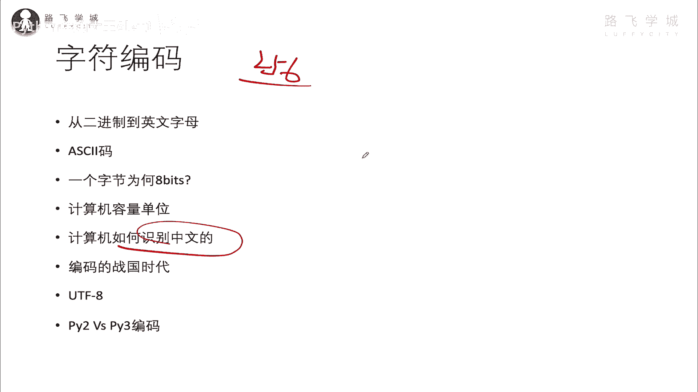

然后只存中文行不行，唉所以专家们就搞出来一张。

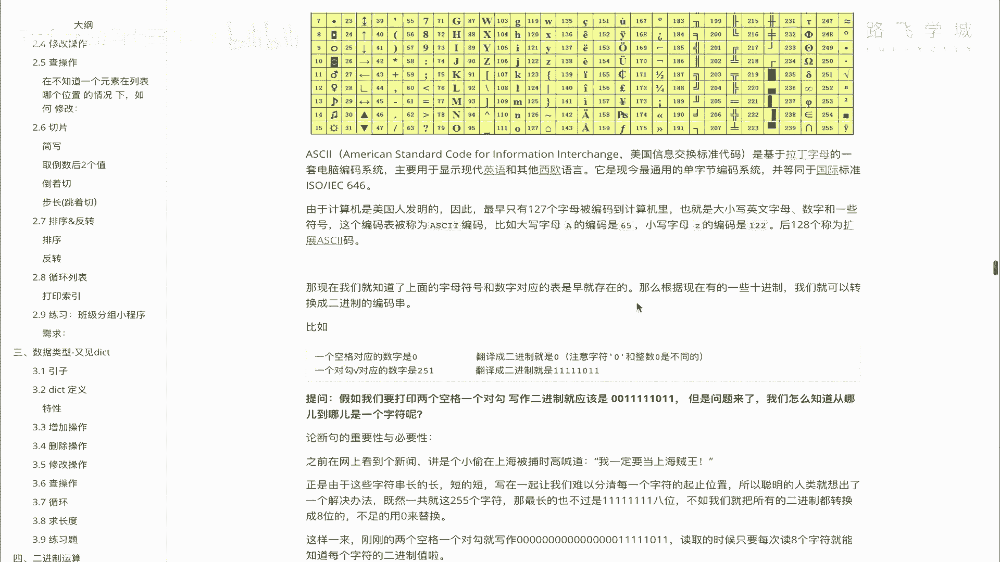

中国人自己的编码表，明白吧，看这个编码表叫做GB2312，Gb2312，它是1980年啊，1980年诞生的OK吗，1980年，那这个编码表长成就是类似下面这个样子，看到没有，就跟那个反正多少行多少列了。

存的常用汉字，然后一共存了6763个汉字。

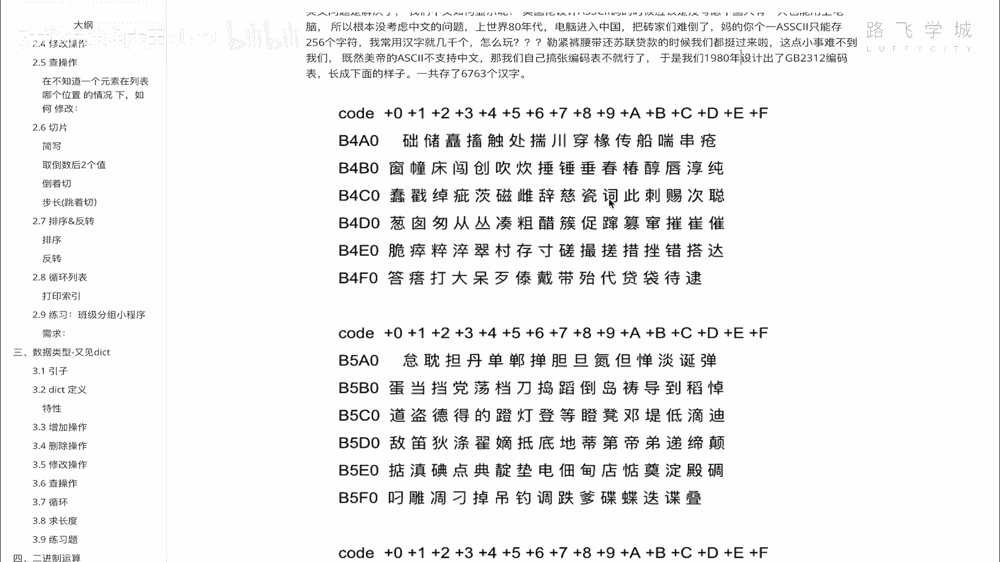

明白吗，哎就就很大差很多啊，很多比那个阿斯玛表多多了，那阿斯玛表存200多个字符，它只需要一个字符，只需要占一个字节，但你现在6000多个，但一个字符一个中文你占一个字节，肯定是不够的，因为对吧。

你你这个有6000多个了，存不下，是不是啊啊，那一个字节存不下来怎么办，最多是什么呀，所以科学家说。

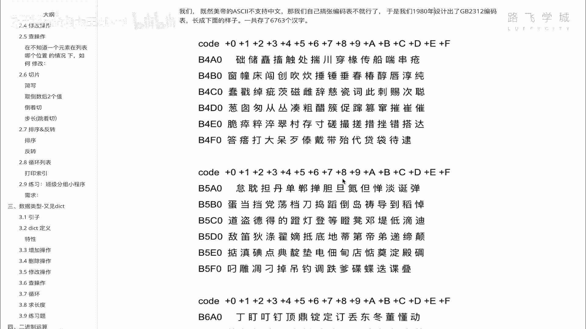

那好，那我就两个字节，为什么呢，因为两个字节当然能存下来。

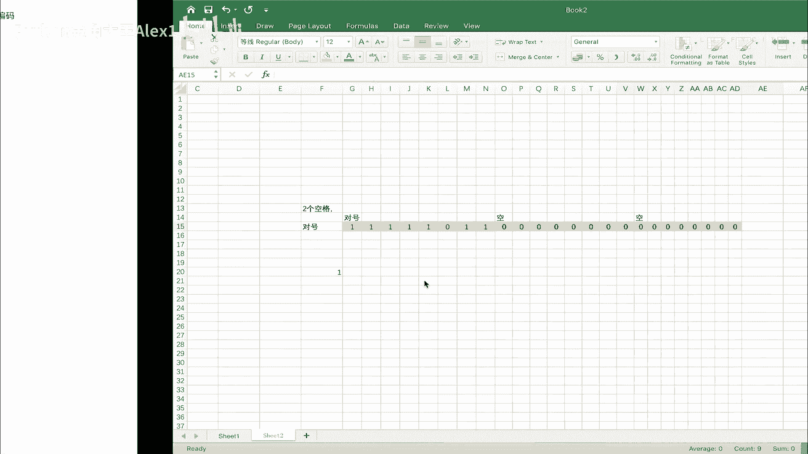

两个字节大家看就是二的16次方嘛，就两个字节是16位嘛，对不对，二的16次方，那其实是最多可以存6万5000，536个字符的，对不对，最多可以存这个。

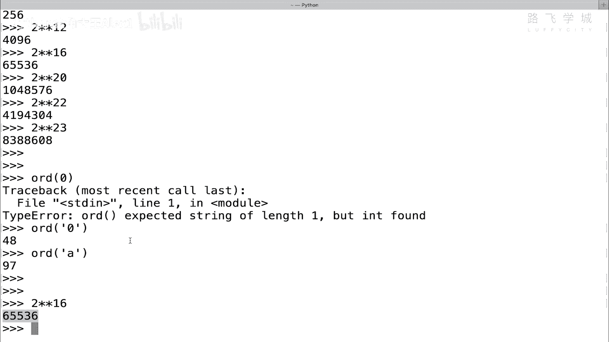

所以你中文只有6000多个，所以用两个字符绰绰有余，所以呢中文一个中文就是两个字节，明白吧，记住啊，一个中文是两个字节好吧。

那现在所以我们每存存一个字符，其实比那个英文字符是字符的话，至少要多一个多一倍的一个存储空间是吧，那那好，那这个这个就总之问题是解决了。

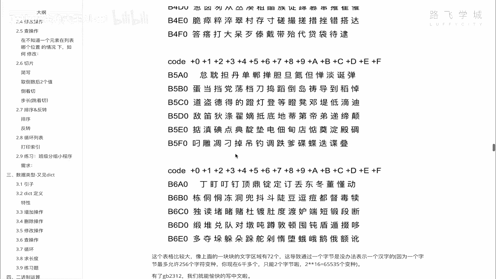

我们可以看中文了，对不对，看懂了，也就是说你显示中文就用中文的GB2312。

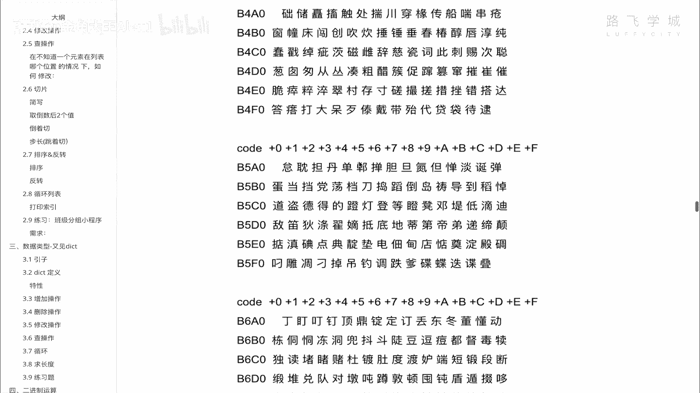

显示英文，你就用这个啊阿斯克码表OK吧，但这里又会带来一个问题，说什么呢，这个外企进入中国之后对吧，招了一些白领啊，招了一些外企白领，这些外企白领了对吧，他就喜欢这个什么呀啊说一些中英夹杂的话。

比如说我的名字叫MARY啊，我的名字叫阿历克斯亚历山大呀是吧，那咱们今天have a conference call啊，对不对，你的salary有没有涨啊，哦就类似这种中英文混杂，那可怎么办。

你这个一句话里既要显示中文，它又要显示英文。

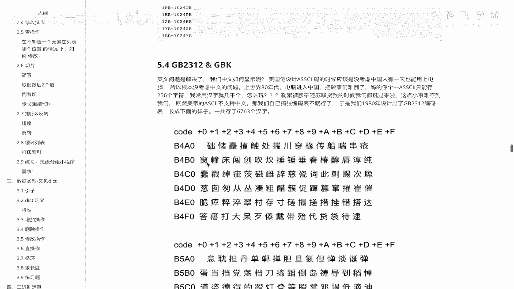

对不对，又要显示中文，就像我这里有一句话，看有英文又有中文，那可怎么办，这就要求你的这个GB2312，同时支持英文对吧，但是呢还不能是两个字节表示一个英文字母，为什么呀，你的你如果是两个字节。

因为中文是两个字节表示一个中文嘛，那你要是用GB2312的编码，你两个字节表示一个英文字母，就会就会带来一个问题，人家阿斯克码表，用一个字符就可以代表一个英文字母，你用两个。

那问题就是你一个两兆大小的英文文档，只要一改变了，看到没，你只要一改变了，你就立刻变成四兆，因为就多了一倍了嘛是吧，每个英文字符就多一倍嘛对吧，那就太坑爹了啊，咱们中国人有钱也不能这么造是吧。

所以呢中国专家们怎么办，又通过神奇的手段兼容了阿斯克码，怎么兼容的呢，即遇到中文，当就是当用阿斯玛，当用这个GB2312编码的话，当它的这个编码的这个原理就是这样，当你看到的是一个中文的时候呢。

他就用两个字节，当你遇到英文的时候呢，直接用ASM看吧，他就能能兼容阿斯玛阿斯克码，他怎么做到的呢，唉我也无法在这跟你说一下啊。

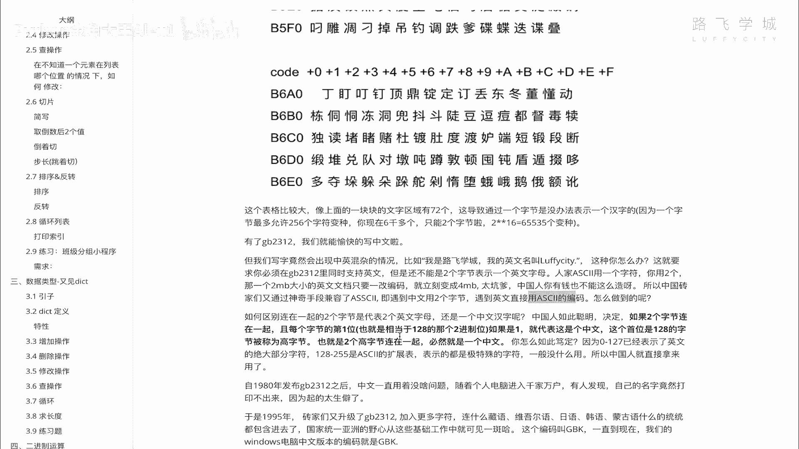

怎么区别，两个字节在一块儿是带，就两个字节是代表两个英文字符，字母字母还是代表一个中文汉字，明白我意思吧，就我因为它底层算成二进制嘛，010101，你也就是说两个字节一对二进制，两个字节摆在一块儿。

你计算机怎么能认识它是代表两个英文字母呢，还是代表一个中文汉字呢，明白吗，能力能大概理解意思吧，哎中国人就很聪明说，那这样啊决定这个如果两个字节，两个字节连在一块儿，也就是两个二。

就是两个字节连在一块儿，那每个字节的第一位，注意了每个字节的第一位啊，这个如果是一是什么意思呢。

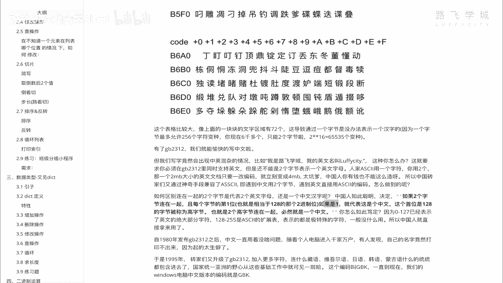

啊也就是相当于128那个二进制位是一，大家不要慌，不要什么呀，你看这是不是一个一个二进制字节，这也是一个二进制字节对吧，他要求如果这个二进制字节的第一位。

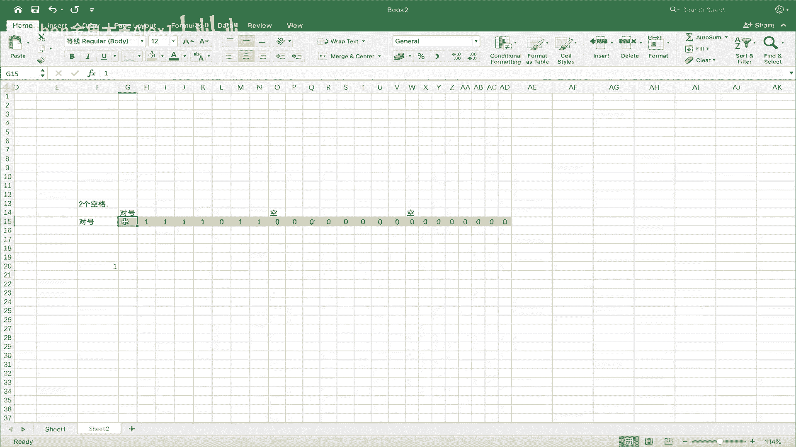

如果是一，然后对吧，如果第一位是一，就代表是个中文，什么意思，他注意了，看着啊，他说的是两个字节连在一块。

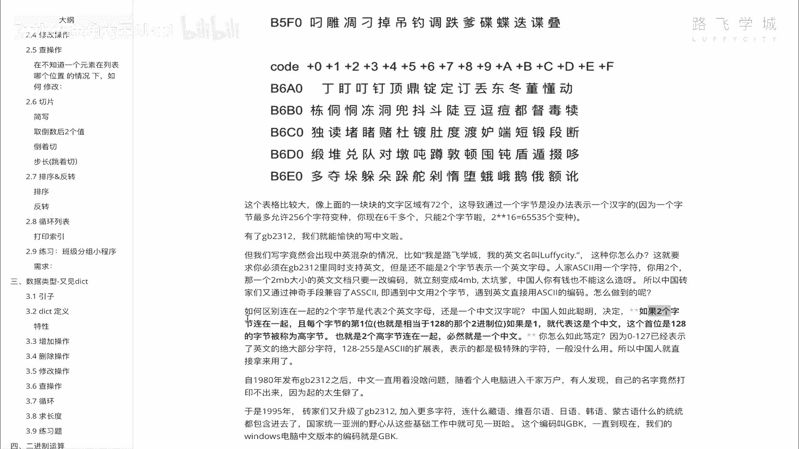

每个字节的第一位就是这两个字节连在一块儿，每个字节的第一位是一的话，也就是这两个在一块儿，就认为它是一个中文，明白这意思吗，就认为它是一个中文，注意了，一定是两个连在一块，你要是说单个是一不好使。

两个连在一块。

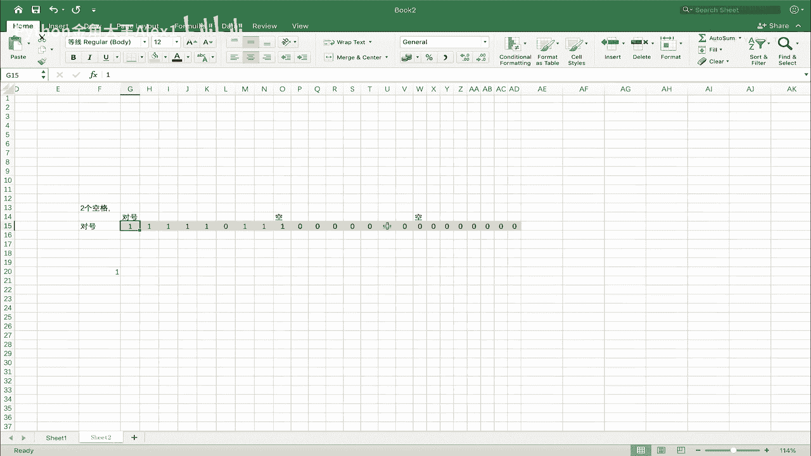

诶，为什么这么设计，大家看为什么这么设计啊。

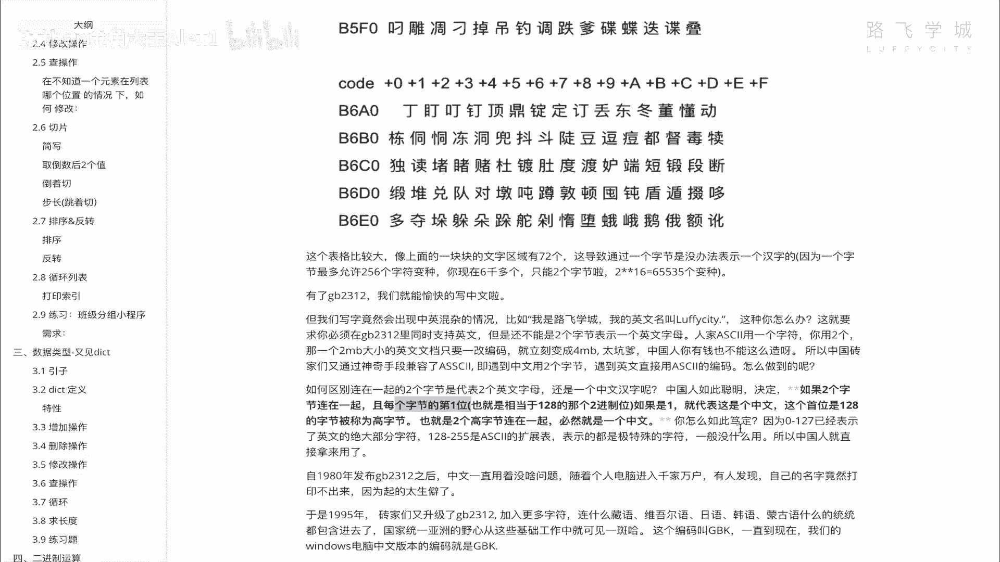

我直接我直接在这说吧，为什么这么设计啊，因为他他凭什么说你，你连连在一块就是中文了呢对吧，因为注意了啊。

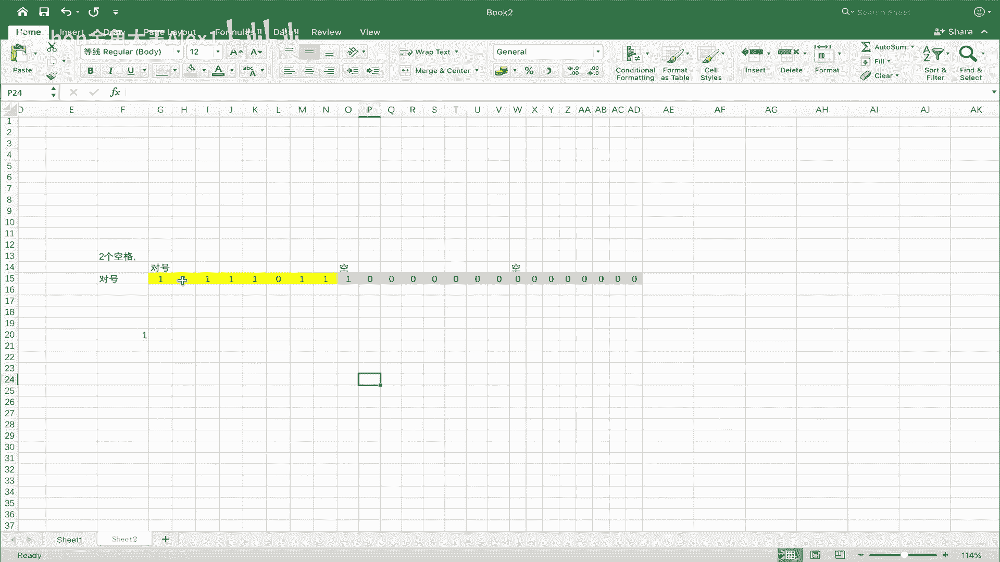

你0~127，大家看您的咱在二阿斯克码表里。

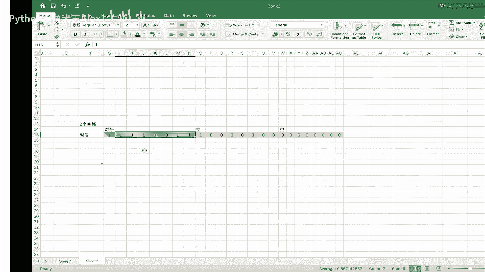

0~127看着是什么，0~127。

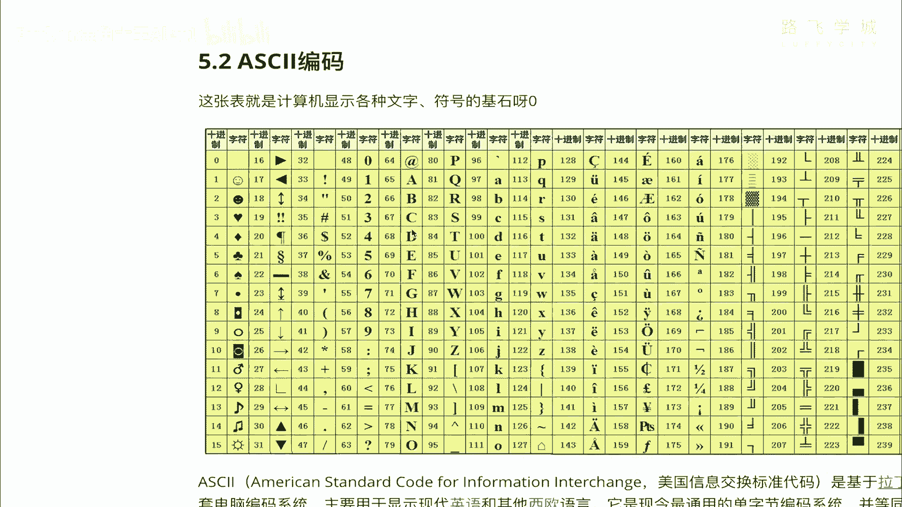

是到这到这到这到这到这到这到这看到没有，其实已经把大小写的英文字符，数字都已经包含了，从127开始。

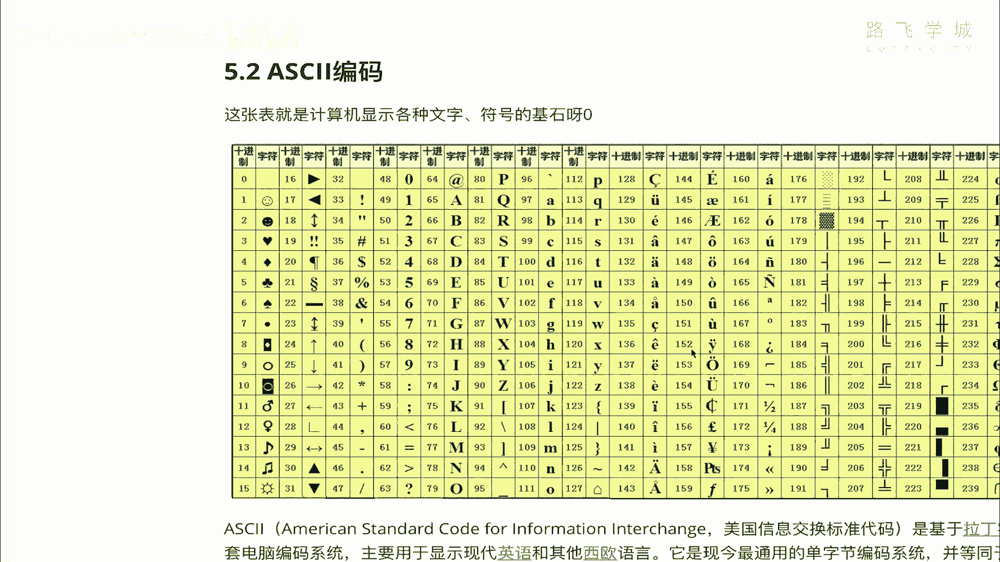

也就到128，再往后你看都是些什么玩意，儿，都写了一些乱七八糟的特殊字符，是不是啊，哎这些特殊字符，也就是128以后的都是特殊字符，其实阿斯顿马表我告诉你，它其实是分两部分的，一就是分两部分的。

一个是0~127，这一部分，一个是128~255，这部分这边的i sorry，这边的左边的这些叫基本表，右边的这这些叫扩展表，扩展表就是一开始这个表里没那些东西，后来扩展出来的。

一开始设计的只有这些东西，明白吗，这个扩展表里存的都是一些，乱七八糟的特殊字符，明白吧，平常很少用，或者我们又把它称为就是说啊这个什么呀，这半部分这里面的东西我们称为是高字节，明白吗，叫高字节。

也就是他这个占高位的，128以后的后一半，然后这边的是低字节，明白吗，第四节的好，我们存的阿斯克码表展示英文，这个数字基本上都是用的D字节，明白吗，你展示一个正常英文单词，全都在低字节里都已经解决了。

明白这意思吧，高字节是很少用的，也就是说中文中国专家们想到说哎，如果两个注意了，如果两个高字节就一个高字节出现，还还可以理解，比如说一个特殊字符，看到没有一个特殊字符出现了，可以理解。

但是如果两个高两个特殊字符，就两个高字节一块出现啊，一块出现，这就是两个二进制字节，全都是高字节诶，这种出一块出现的现象是极为少见的，那这样我就认定它就是一个中文，我就我我的这个中文的这种啊玩法。

就就就利用了他这个什么呀，利用了他这个这个就是这种叫什么呀，不能叫漏洞，它不是漏洞啊，就是这种表示方式。

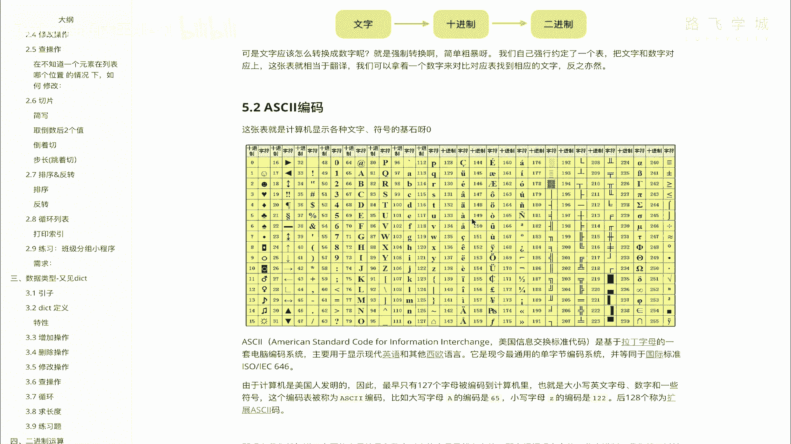

然后我就认定它是中文，明白这意思吗对吧，所以你这样做的话，其实就实现了跟这个什么呀，跟这个呃英文字符的一个一个兼容啊。

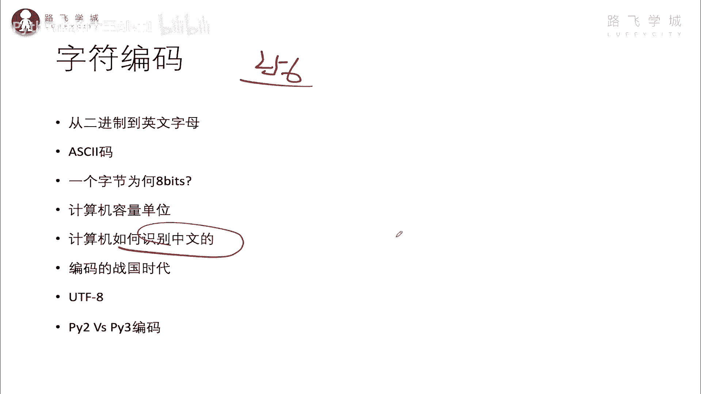

英文字符的一个兼容，因为对吧，这里你想啊这三这三对二进制是吧，那可能正好这里面对吧，这前面这一个这两个字节是代表一个中文，假如说就是代表一个中啊，假如说他就转成中文，就是一个中。

那后面代表这个字节就代表一个L，是不是你通过这种方式就可以实现，通过这种方式就可以实现一个什么呀，区分就是他中英文混在一块又不会乱，还能区别谁是中文，是中文。

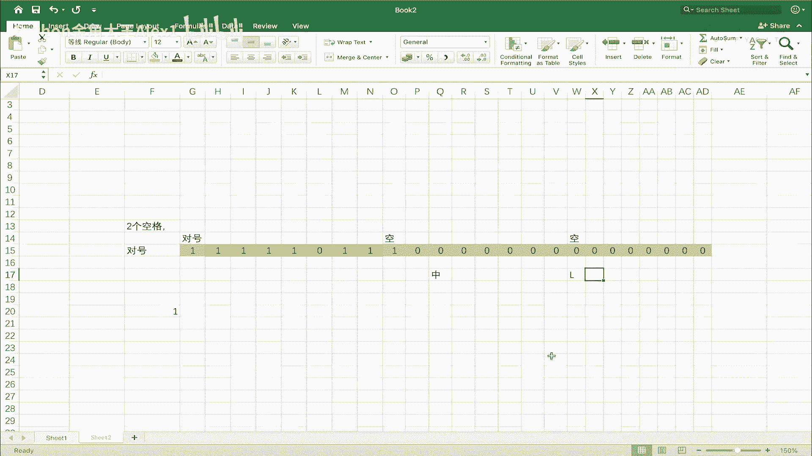

谁是英文，明白吗，这个就是咱们中国人的聪明之处，好不好。

哎这个就是兼容了中英文混杂的那么一个问题。

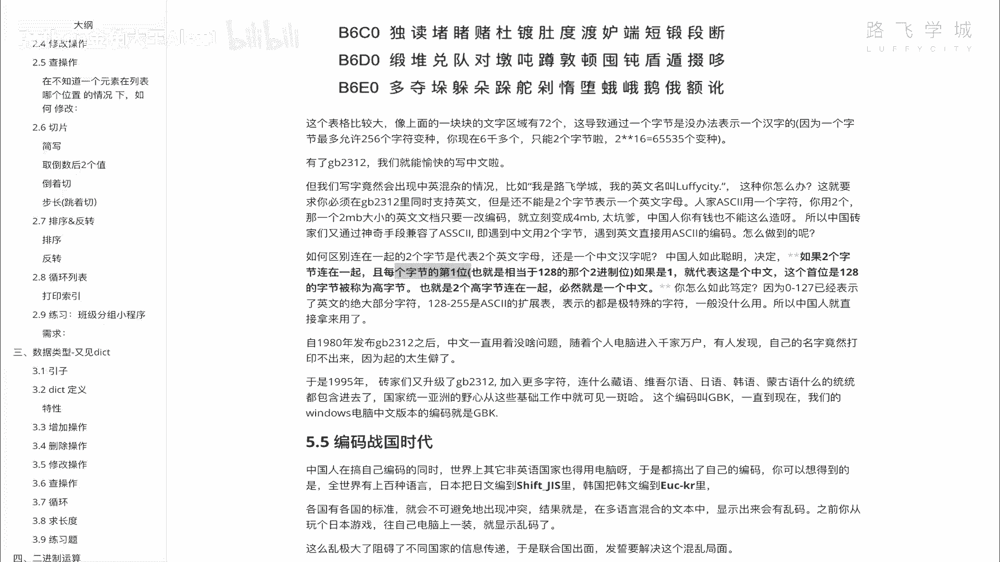

可以吧。