# 【2024年Python】8小时学会Excel数据分析、挖掘、清洗、可视化从入门到项目实战（完整版）学会可做项目 - P38：10 编码的战国时代 - Python金角大王Alex1 - BV1gE421V7HF

OK同学们，那通过GB2312呢，咱们计算机可以显示中文了，是不是啊，但是这个故事还没有完啊，没有完，这个咱们GB2312呢又在不断的发展，因为有一些生僻字一开始没有设计进去。

所以呢后来这个专家们又过了几年，再升级到了90年代，搞出来了一个叫JBK啊，GBK其实很简单，干嘛呢，就是把这个字符给它，就是能就是包含的这个中文字符更多了啊，并且容纳了这个什么呀，少数民族的语言。

维吾尔族啊，这个壮族啊对吧，这个藏语啊，对不对，好几种语言，然后加起来一共有2万多个字符啊，2万1000多个，我记得后来过了几年又升级，甚至把日本的韩国的这些都给它融进来了，东亚的都包括了。

一共到2万8000多个字符啊，G b k1。0，看到没有哎，所以基本上你能看到所有的想到的。

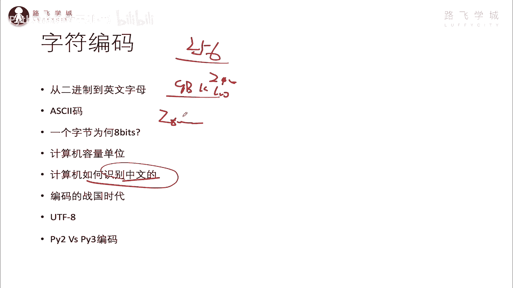

想不到的他都能包含进去了，哎这个就是咱们后来中文编码的一个发展啊。

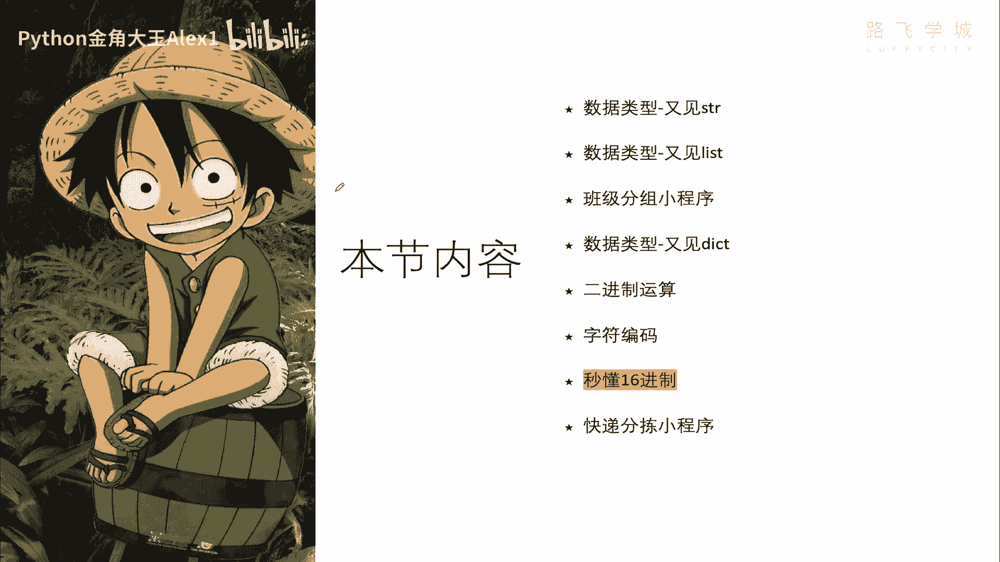

一个发展，但是这个中国人当中国人在搞自己编码的时候，中国人啊对吧，这是咱们中国人，对不对，在搞咱们的GBK啊，那外国人，那你你这么讲啊，人家日本比我们更发达，那个时候是不是啊。

韩国还有那日本其实它更先遇到计算机，所以日本人要首先解决他的编码，所以日本人也搞了一个自己的编码叫什么，他要支持他的片假名什么的吧，片假名啊，这个我去日本还好几次，他们说这个英语就啊啊啊啊。

叫阿尼哈塞欧哦，Sorry，那是韩语是吧啊，口音西哇，GODANIMUS啊，哈利GOTO，Ok anyway，他的这个编码叫shift g r i g i is ok吗。

他这个编码shift g i is好了，它就是只支持他的这个片假名的这些系统，反正原理也是一样，又搞了一张编码表，那韩国人也有自己的对吧，什么K开头的KOREA嘛，什么什么什么什么，对不对。

那人家越南是不是也得搞啊，越南是V开头的VIENN，对不对，泰国是不是也得搞啊，什么TH什么什么的，Thailand，就每个国家都搞了很多自己的编码，那人家这个还有什么其他的语言呢，这个乱七八糟。

其他语言别的国家的欧这个呃俄国是不是啊，西欧哦，sorry俄国，然后南美啊，类似这种啊，总之啊就每个国家都搞了一堆自己的这个编码，这会带来一个问题，这就像我们现实生活中，每个国家都有自己的语言。

中国人说中文，英国人啊，英国人，美国人说英语，日本人说韩语啊，Sorry，嘿日本人说日语，他带来一个问题是说对吧，一个中国人和一个日本人，如果只会说自己的语言的话，他俩是没有办法沟通的，对不对。

没办法沟通，那怎么办，他们只能找一必须要，不然你学我的日语，我学你的中中文是吧啊。

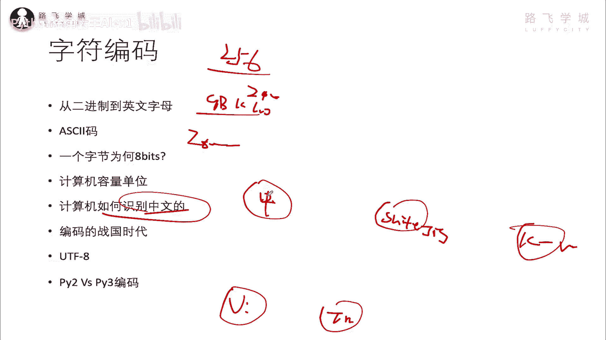

你俩都不愿意学，那怎么办，那你学个英语是不是。

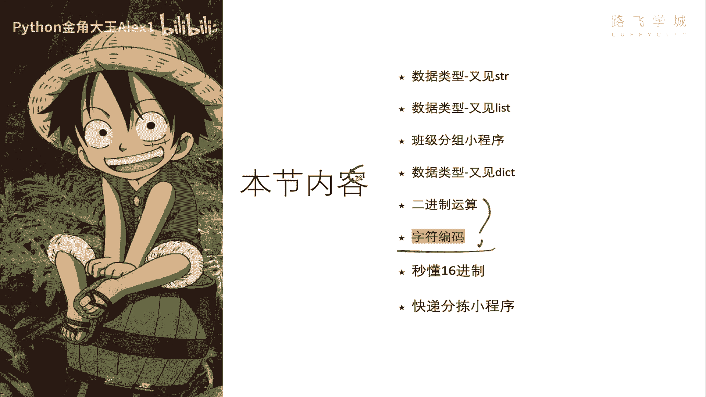

怎么回事，你找一个中间搭搭搭桥的对吧，学一个英语啊，英语对吧，那然后中国人说英语，韩国啊，日本人说英语，那就也能沟通，明白这意思吧，哎但是像计算机里，他的问题就在于中国人说用自己的GBK。

日本人用自己的shift键，那互相之间其实没什么影响，没有交集的情况下，但是中国人不那时候喜欢打日本的那个游戏吗，我记得小时候把那个插那个游戏卡，插在那个电视上就可以玩是吧，好多日本的游戏啊。

那个日本游戏呢就经常如果你们有印象的话，就是特别用那种老式电脑啊，它就容易出现乱码，你把这个游戏装上去之后发现乱码了，哎在你的电脑上，在你中文电脑乱了，为什么，因为中文那个GB2312里面。

最初的GB2312里面，是不包含这个日本的任何东西的，这个字符的对吧，所以它就会乱，但即便升级到GBK，它包含日本字符了，但是人家你你中国的电脑上支持GBK，对不对，支持日语的那个。

但是你是用g bk编码的，人家日本人那个游戏编的可是用shift js，也就是说你同样是一个片假名，这个片假名有一个片假名叫类似这个样子的，对不对，在中国的那个GBK编码表里。

它可能是比如说在1000的这个位置，但是在日本的shift jis的这个编码表里，然后人家可能是这个对吧，是一个B5或者是什么什么一个位置，所以就是说你你你即便支持你，在你的电脑上也是乱码，明白吗。

因为人家是用g shift键S编码的，能理解这意思吧，那这就这可怎么办，日本的油气出口到中国是吧，那就是乱码的对吧，那怎么解决乱码呢，有两种方式啊，解决乱码，解决它的游戏出了中国啊，乱码有两种方式。

第一种叫什么呀，第一种就是说，你这个中国人电脑上装日本游戏的时候，你想显示正确干嘛呢，在这个中国的电脑上装一个日本的编码，明白吗，在中国的电脑上装日本编码哎，编码呃，写到哪呢。

写到写到写到写到啊嘶我不想写到这，我想看看能不能打蚊子，打不了，Anyway，就在中国的电脑上装日本编码，这是一种方式啊，中国电脑上啊装日本啊，Shift g i is，这是一种解决办法，是不是啊。

解决乱码。

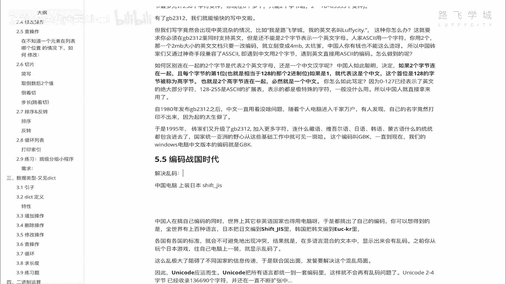

好这是一种方式，还有一种方式是什么呀，同志们啊。

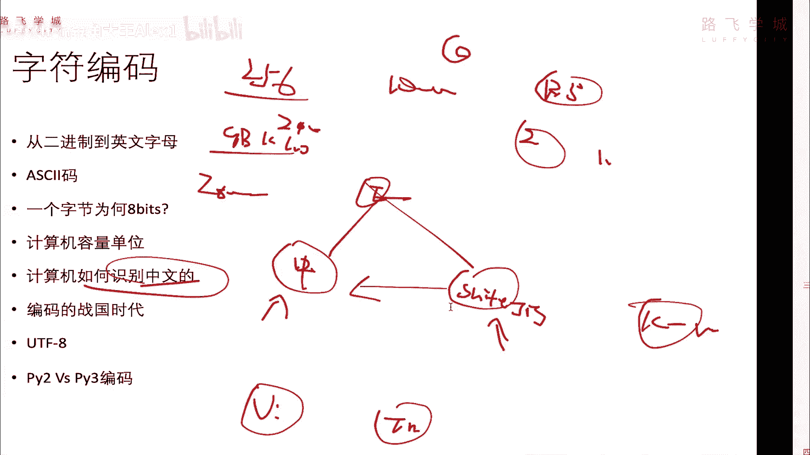

这种方式可以，但是很麻烦，之前也就是这么干的，这么干的对吧。

还有一种方式是说让日本人用GBK编码啊。

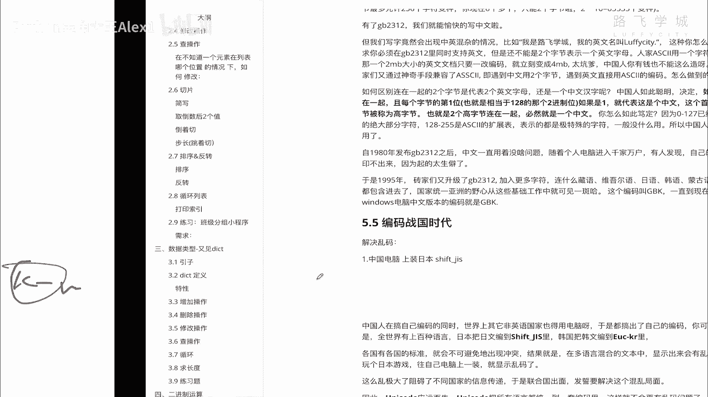

啊让日本游戏啊厂商对吧啊，用GBK编码是吧，那这个其实也是可以的，因为他想出口到中国，对不对，那就他就提前先按中文编码对吧，但这里其实就会带来很多效率问题，那日本游戏厂商说我靠。

我要出口到每个国家就再重新编一次啊，这个太费劲了，这个太麻烦了对吧，所以其实这两种方法都不好啊，都不好啊。

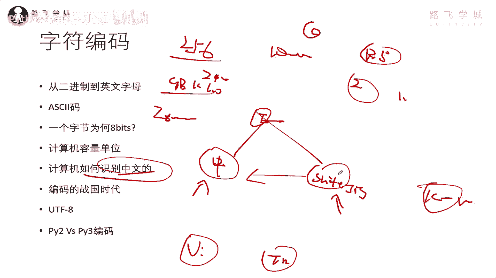

这样的问题很麻烦啊，就完就是大大阻碍了这个什么呀。

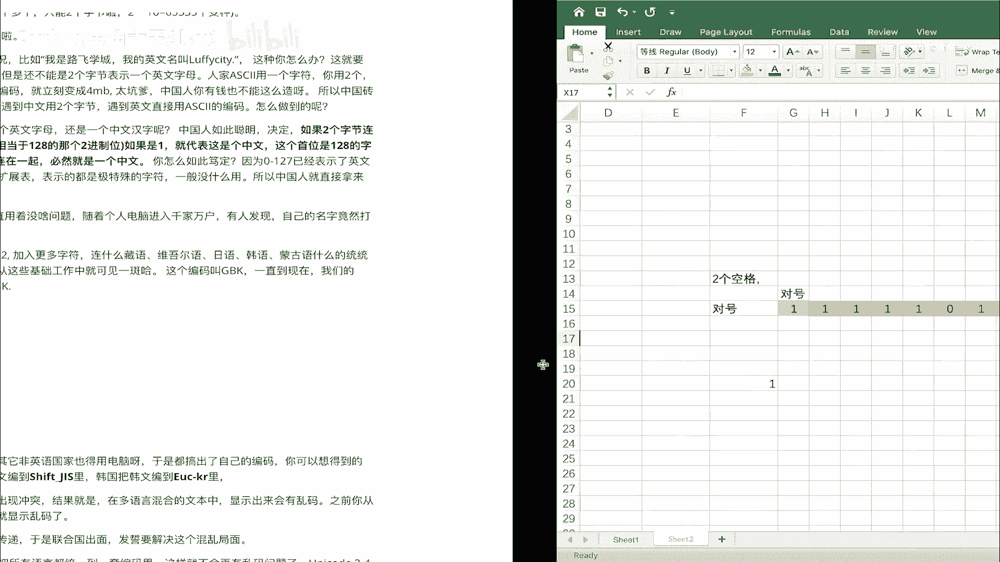

阻碍了国与国之间的之间的这种啊，软件产品的这种啊这个这个交互对吧，信息传递，所以呢这个时候你想想还有没有别的办法，有没有别的办法，其实很简单，就跟咱们现实生活中一样，唉咱们搞一个国际语言。

英语是不就可以了，中国人说英语，日本人说英语，那不就都懂了吗，所以英语是国际官方语言，计算机里也有一个国际的官方语言，这个国际官方语言就是什么呢，就是联合国啊，这个啊标准组织啊。

标准组织搞出来的一个叫万国码OK吗，这个万国码叫什么呢，就是UNICODE啊，UNICODE应运而生，Unit code，它是怎么解决这个问题的呢，他就直接把这个什么呀，他说你们也不用互相来回转了。

这样我搞了一套，为什么叫万国码对吧，万国码就是说我把所有国家的这个编码，这个语言都给你装下去了是吧，我所有国家的语言都给你装，装装全装到我的这个编码里面，所以以后大家就不要用自己的了，你不要用自己了。

你就用我这个万国码，互相之间全世界不就通用了吗对吧，所以这个万国码它装了很多的字符，它这个万国码到现在啊已经装了多少呢，已经装了这个，我看这里写了没有啊，已经装了。

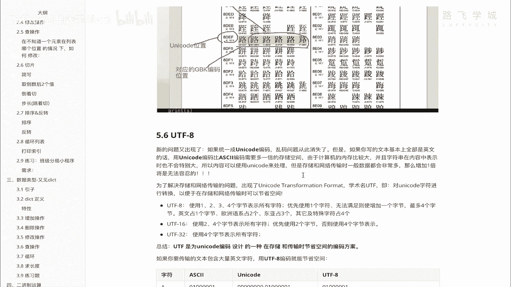

已经装了十几万个了，哎我在哪里写了呀，anyway啊，Anyway，我我看了忘了在哪写了，总之应该是可以找了，总之他已经装了十几万个字符，明白吗，已经装了十几个万哦，在这里看已经收录了13万个啊。

13万个，并且还在不断的扩张，因为一些特别古老的语言啊，什么很少人用的还没纳进去对吧，但是不断扩张，总之能装十几万个，所以它的你装那么多的字符，那它的这个存储空间就是存的占的空间也不大。

所以UNICODE它是用两到四个字节来去干嘛呢，去存储字符，比如说普通的，比如说像中文呀，像这种常见的呀，我就用两个字节来存储两个字节，明白吗，但是如果一些特殊字符啊。

特殊字符我就会呃再用三个或者是四个，明白吧，特殊字符它是可变的，OK可变的，总之这万国码里面是直接是装了所有的语言。

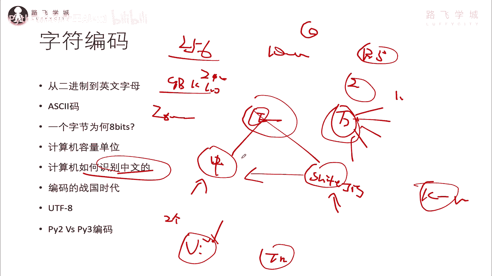

好吧，装了所有语语言，然后这个咱们来看一下unit code呢。

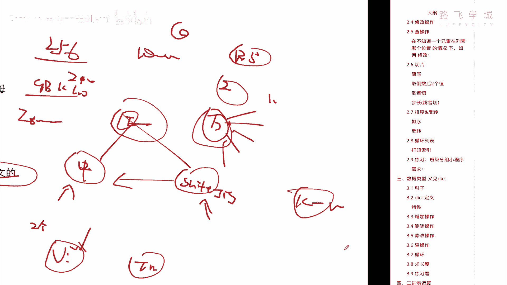

它有两个特点，第一个特点呢它是支持全球所有语言，也就只要用UNICO的啊，你这个什么语言都可以展示，也不会乱好吗，另外一个特点是什么呢，它可以支持跟各种语言编码的自由转换，什么意思。

即便你是GBK也能转成UNICODE，这啥意思呢。

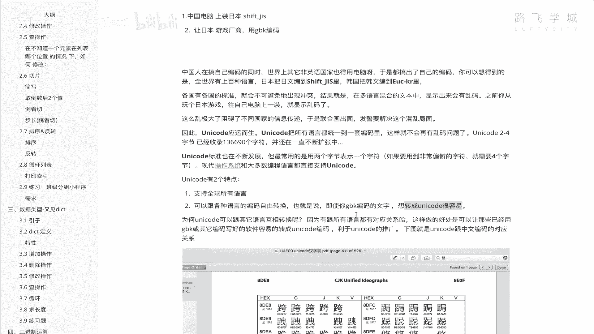

它可以跟各种语言自由转换啊，我这画的有点乱，大家想象一下，这是你的万国码啊，万国码，然后万联合国说这样大家都用过这个呃，万国码就行了，以后不要用GBK了，也不要用日本的了，都用自己了。

那这个带来一个问题，说你这个万国码不是不是计算机，一诞生就出来的，它是199几年才有的啊，那个时候中国人的编码已经十来年了，日本人的编码已经好几十年了，你让人家说我立刻用上你的万国码。

我之前已经开发好的软件呢，怎么办呀，我已经开发好的软件，不就不就不就不就乱了吗对吧，就因为之前开发，因为你个万国马，现在是不兼容我这个呃GBK的，不兼容我的shift js的对吧，你是完全一套新的编码。

那你那你跟我之前写的这个软件不相通，因为我我电脑上只要装上你这个编码，我之前写的那个啊软件就会乱了，明白吧，因为之前的软件是用GBK做的O，所以那可怎么办，那UNICODE说没有关系。

我再搞一个对应关系行不行啊，搞一个什么对应关系呢，就是我在万国码里中文的这个中，比如说这个汉字，比如说中国这两个字，OK吗，我干嘛呢，每个字我在UNICODE里面。

UNICODE这个万国码里面存的这个位置，它可能是1000，对不对，但是在你的GBK里存的这个位置可能是啊，这个500对不对，没有关系，这样吧，咱们搞个对应关系嘛，所以他又搞了一个对应关系。

就是说哎搞了张表啊，这个每一个中文汉字对不对，他给你对应上在unit code里什么位置，在GBK里什么位置，这样的话即便你是GBK也没问题，我就很容易的说你GBK里的这个本来是中文，是不是啊。

我没关系啊，我就可以自动的帮你转成unit code了，因为我有对应关系嘛，我知道我知道这个500这个位置代表的是中，对不对，我然后那就找到啊，我对应的这个unit code里面的这个中。

它不就对应上了吗。

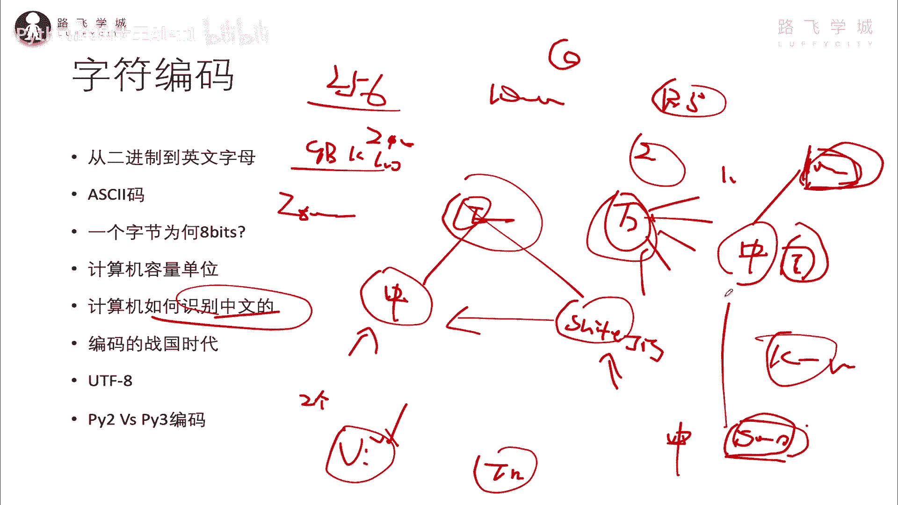

明白吗，所以万国马还有一个特点，就是跟所有的语言有这种什么呀映射关系啊，有这种映射关系。

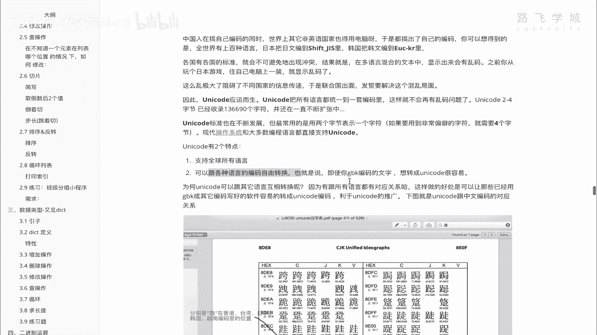

你是任何语言的编码都可以转成UNICODE，或者由UNICODE互就互相来回转。

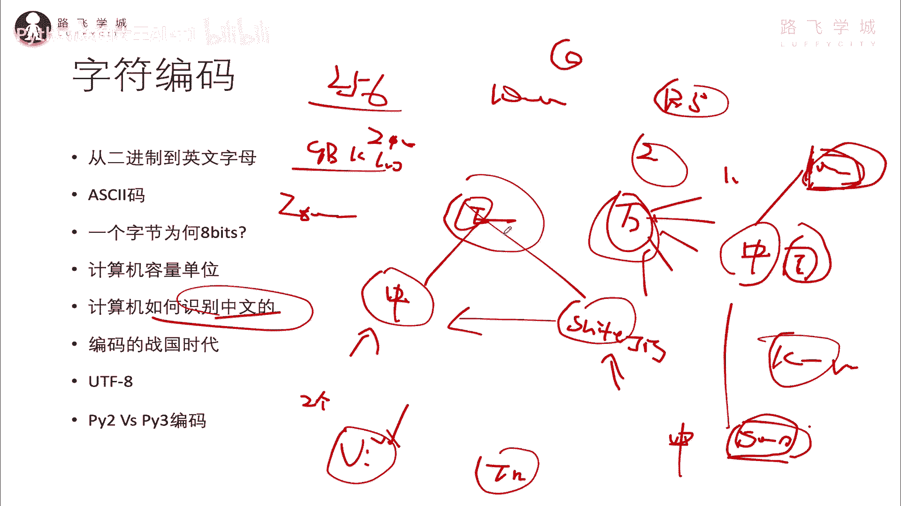

明白吗，这张对应关系表就是这样的，看到没有。

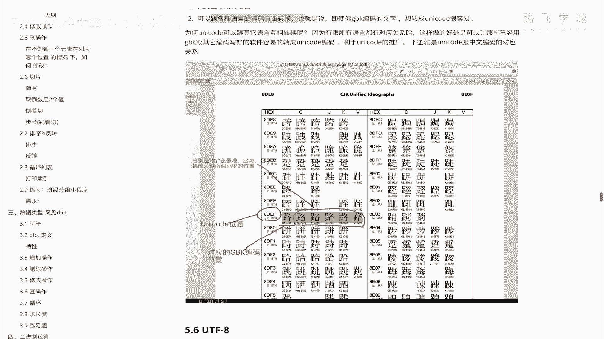

这里面只是中文的，它跟日语，还有跟韩语跟什么其他语言。

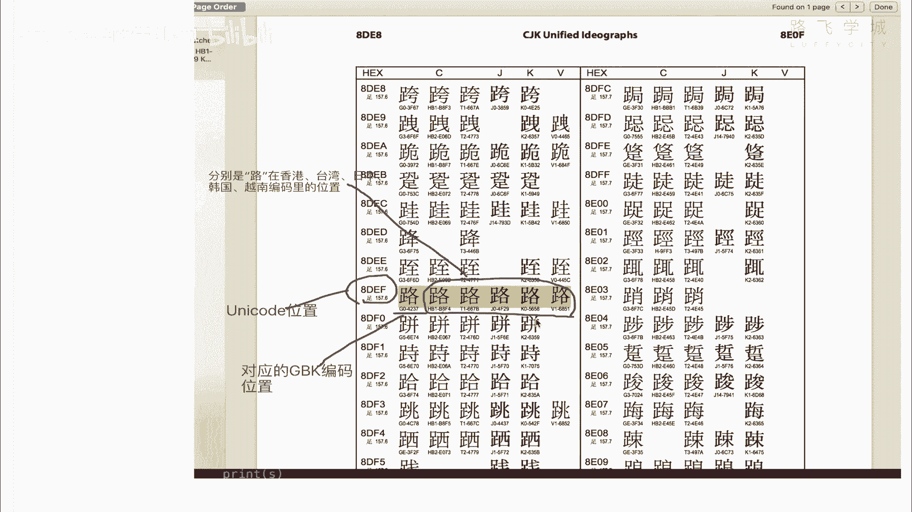

还有这只是中文的啊，大家看我在这里路飞学城的这个路，看到没有，这个对应关，这一个是UNICODE的这个编码的位置，看到没有UNICODE编码位置，然后呢它对应了什么呢。

对应了中文里面g bk编码的这个位置，G0开始的看到4237，这就是GBK里的啊这个编码的位置啊，所以这个映射关系就有了，然后它这里还有好几个其他语言，其他语言里也有中文，其他语言里，比如说香港啊。

在香港里面看着啊，香港里面HB就是香港自己有一个编码啊，叫HB，台湾里面T1啊，然后这个记忆应该是日本的，日本里面也有路啊，也有鹿这个字，还有韩国的，还有越南的V开头的，明白吗，他就跟所有的语言啊。

这个编码对应关系都已经定好了。

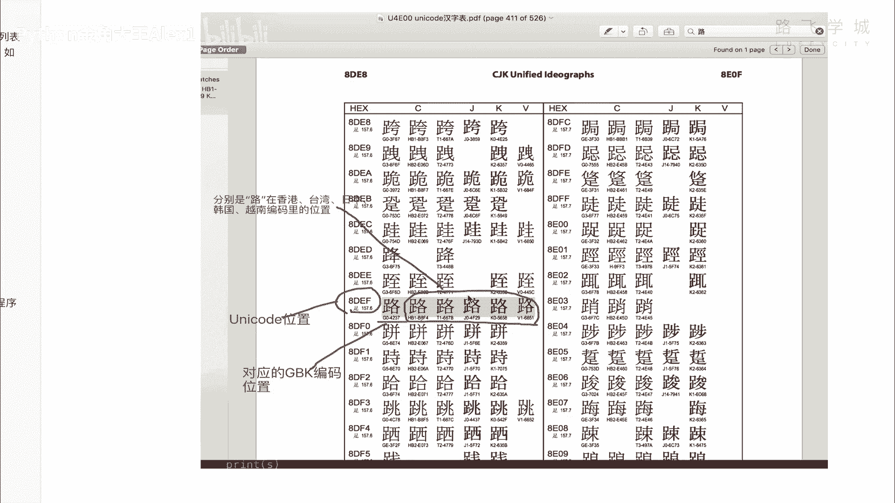

那这样的话UNICODE这样对吧，是不是就就就就很容易推广了对吧。

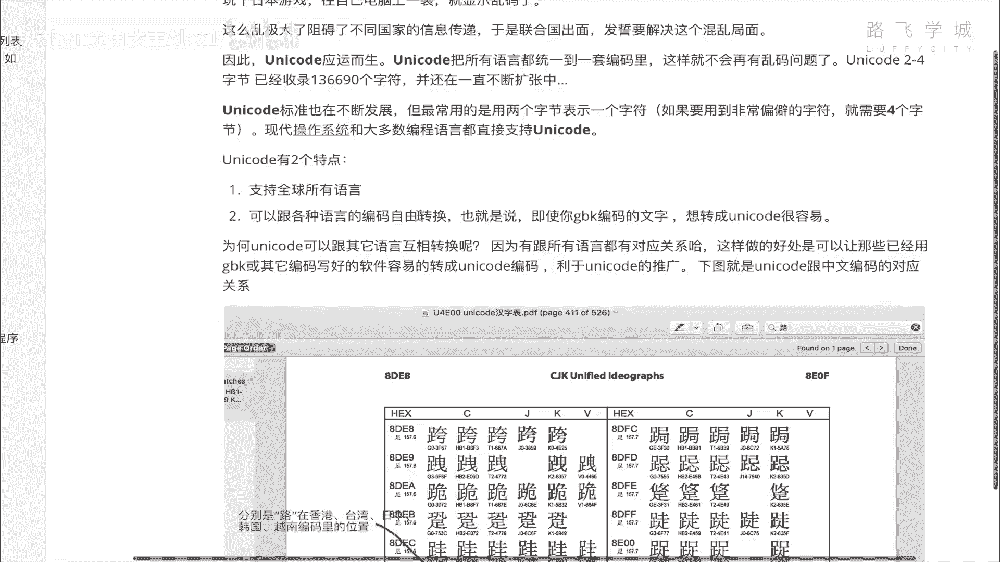

因为它不会导致之前的软件嗯有问题。

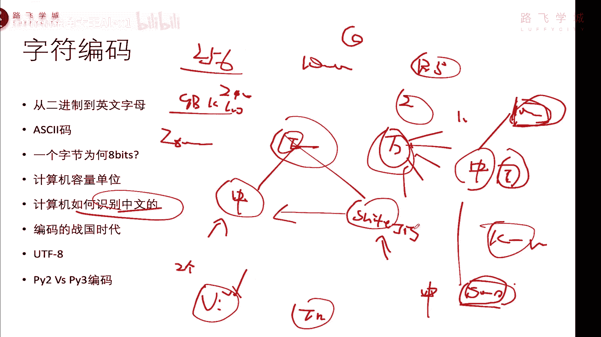

所以就可以兼容好，那这个问题就解决了啊，两个啊两个特点。

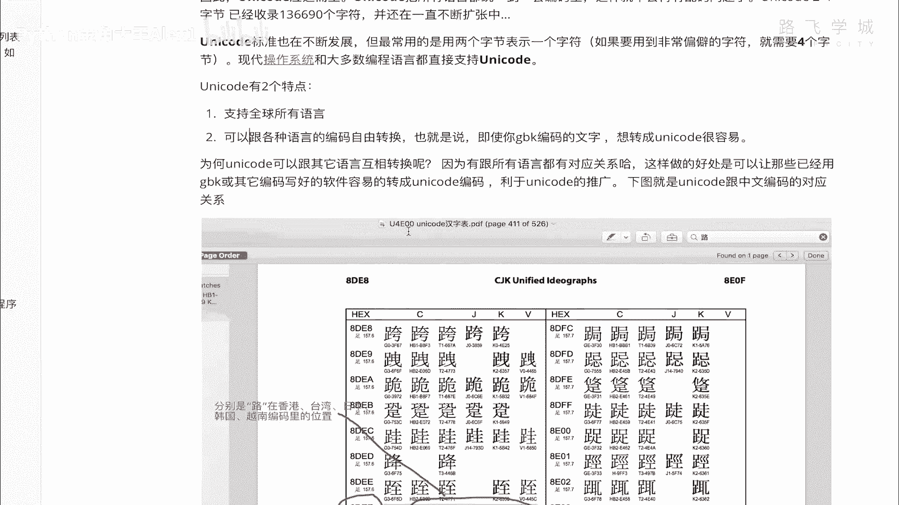

知识权由所有语言啊，跟各个编码可以进行自由的转换。

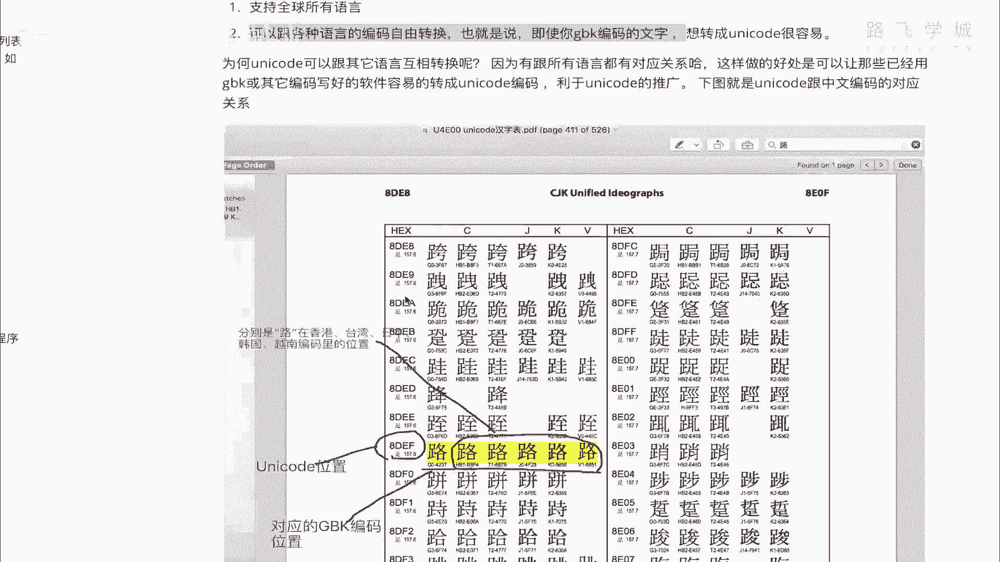

那也就是说到此时为止，咱们所有的计算机里，那这种正常的，普通的可用的计算机都是直接可以支持UNICODE的。

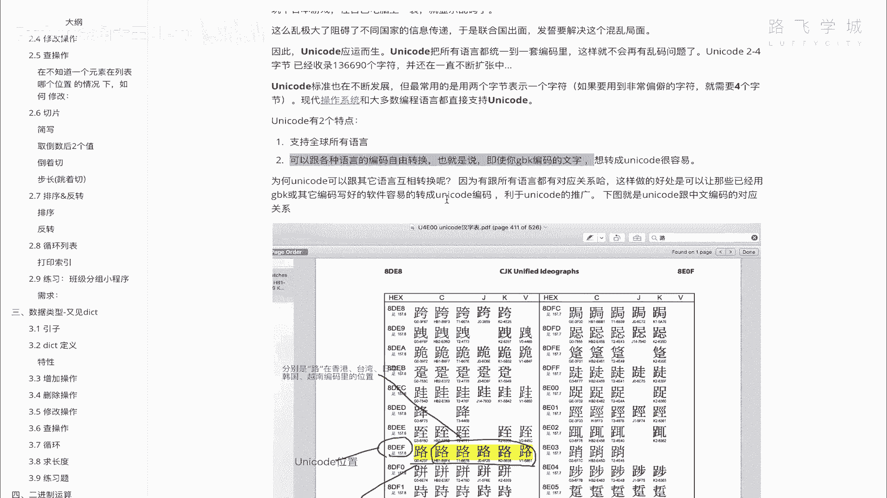

OK吗。