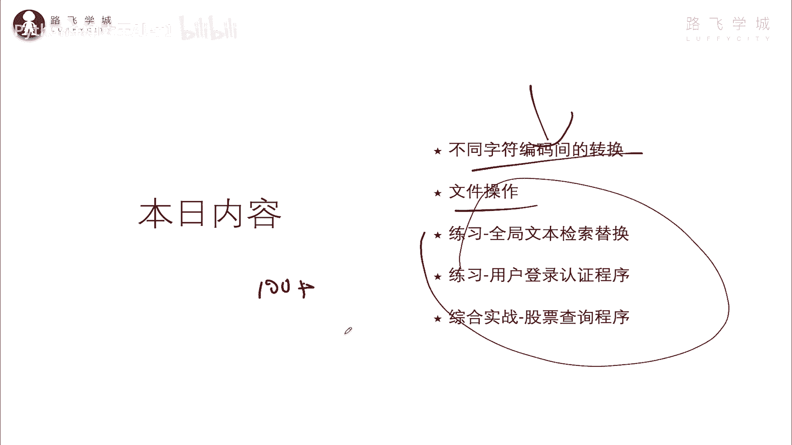
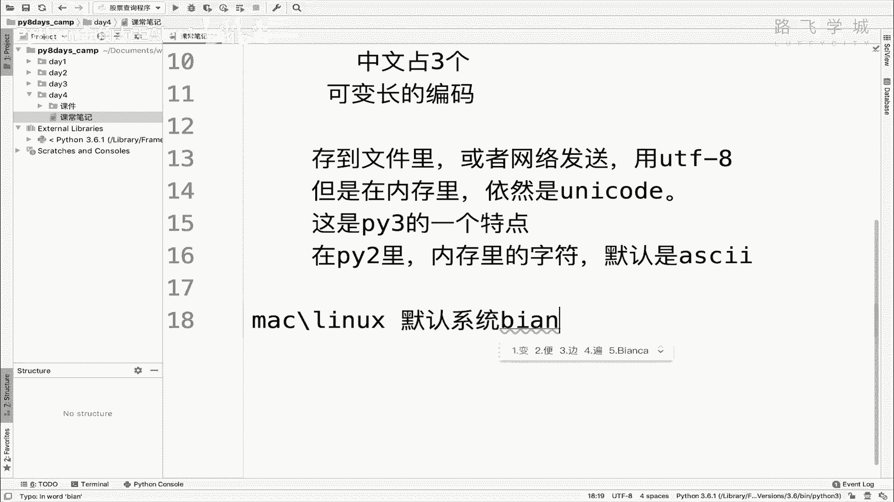
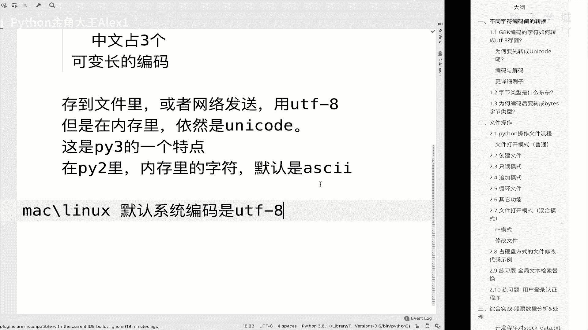
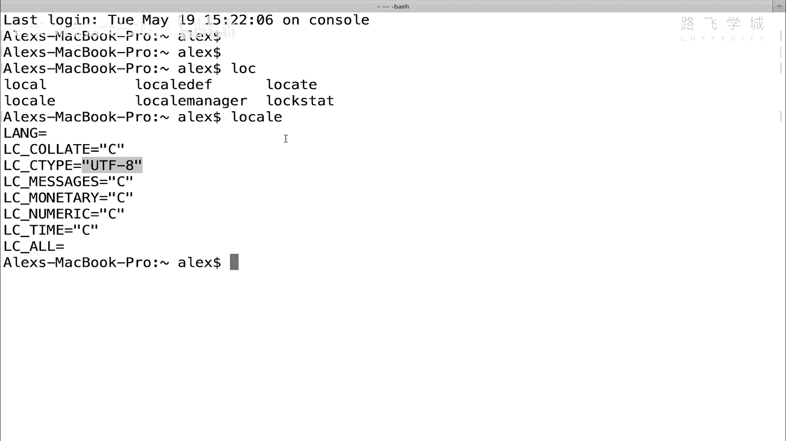
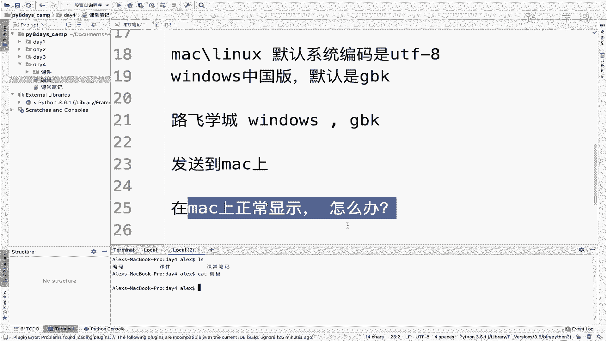

# 【2024年Python】8小时学会Excel数据分析、挖掘、清洗、可视化从入门到项目实战（完整版）学会可做项目 - P42：01 gbk的文字如何在mac上正常显示 - Python金角大王Alex1 - BV1gE421V7HF

哈喽哈喽，同学们，接下来咱们进入第四天的一个内容，那今天呢学完之后，你就可以用Python批量的处理文件，批量或单个处理文件自如的都没有问题了好吧，那今天要学哪些呢，有字符编码的转换，其实是上节遗留的。

然后文件的操作，各种操作增删改查，然后我后面会讲几个练习题，这几个练习题还都挺牛逼的，那今天学完之后，你就可以除了自如操作文件之外，你可以写出来100行代码，加的那么一个程序了啊。

对于一个刚学了四天的小白来讲。

算是很牛逼的，很牛逼了哈，那接下来咱们直接进入第一小节。

不同字符编码间的一个转换，这相当于是因为昨天咱们已经讲了字符编码，那今天是进阶内容，咱们会讲这个屏幕上的这些问题啊，先不用看，我先给啊，先咱们这样，咱们先回顾一下，快速回顾一下昨天的几个知识要点，好吧。

我在这里，接下来第一个，我们先知道这个UNICODE是为了解决什么问题的啊，UNICODE是为了解决不同于就是对吧，就是每个国家搞自己的这个编码就会比较乱，互相之间不互通，所以UNICODE是个万国码。

对不对，万国码，那它可以支持它的两个作用，第一个支持所有啊的这个文字，就所有的语言是不是啊所有国家的语言对吧，也就是无论你是汉语，英语，日语，俄语，韩语，你只能上已经在在这个UNICODE里面它都支持。

所以你每个国家都不需要再用自己的编码，你直接用UNICODE，注意了，每个国家不需要用自己，直接用UNICODE就可以解决了，也就是说如果全世界所有国家都用UNICODE。

那就相当于现实中所有国家都在说英语对吧，就不需要翻译这个角色了，明白吗，这是第一个，但很显然是不现实的，不可能就是说中国我们丢掉自己的语言不用了，直接用你这个英语不可能对吧，所以这个那是理想状态。

所以每个国家依然有自己的语言，那英语就变成了一个对吧，作为一个国际通用语言，也就两个国家之间互相我不会说日语，你不会说中文，那没关系，咱们都学英语也行对吧，UNICODE也起到这个作用。

它啊跟所有国家的编码对吧啊，有映射关系，有映射关系，有映射关系就意味着可以互相转换，对不对，映射关系好，这个我们要理解是吧，这是万国码的两个作用，OK吗，那万国码它的一个特点就是它存一个字符。

存一个文字需要2~4个字符，是不是2~4个字符啊，存一个文字啊，一个字符吧对吧，二字sorry，二字四个字节说错了，来去来存一个啊，24个字节来存一个字符，对不对，所以你即便是一个阿斯克码。

它也至少两个字节，那相比咱们的比这个什么呀，阿斯顿啊，这sorry我说的即便是一个英文字符，它也要占两个字节，所以呢它相比阿斯顿马编码对不对，要多一倍对啊，因为阿斯克码咱们讲过了一个字符，只占一个字节。

对不对，那为了优化，所以说对吧，为了优化这个什么呀啊，UNICODEUNICODE的UNICODE的存储问题对吧，存储问题啊，就是占空间问题，所以出来了UTF8，是不是UTF8的一个特点是这个什么呀。

英文占一个字节，对不对啊，然后这个西欧的西欧语言对不对，西欧占两个，CEO吧对吧，占两个字节，然后中文也就是中亚东亚，包括日语啊，占三个，对不对，占三个是啊，其他的啊，这个特殊的字符啊，或者什么的。

占四个好不好啊，所以它是一个可变长的，就可自动伸缩的，是咱们又称为可变长的啊，编码好吗，这是UNICODE，然后呢注意了这个UNICODE不是，这是UT吧，那UTF81主要是在什么时候用的。

就是存到文件里对吧，或者是或者网络发送，比如说我以后通过QQ，相当于我俩咱们在两个电脑上说话，通过网络发送这个消息的时候，就要把它编码成一把UNICODE，编码成UTF8，这样就可以省空间。

明白吗啊这样可以省空间，OK所以但是在内存里还是UNICODE，明白意思吧，在内存里啊，存到存到文件里或者网络里或者网络发送啊，啊用UNICODE用sorry，UTF8对吧，但是啊在但是在内存里啊。

依然是这个什么呀，unit code编码，INCODE编码好吧，这个是ECODE，这个呢是python3的，这是啊PY3的一个这个什么呀，呃特点是它PY3就是这个样子的好吗，那呃在PPY2里不是这样。

在PY2里这个什么呀，在PY2说一下吧，PV2里啊，内存里的字符默认是什么呀，默认是这个阿斯克码，因为咱们讲过啊，这个在就是PY2是就是P，Python是889年诞生的。

但是那个时候还没有UNICODE，所以呢呃这个Python的创始人就只能用阿斯克码，所以那个python2里默认是不支持中文的，明白吗，因为阿斯克码只能显示英文字符，OK这个是这些点。

然后呢呃知道了这个之后，我们再来聊说现在呃在我们的Mac系统上，Mac或者LINUX系统上啊，它的默认编码就是系统编码啊，因为你不不光是Python，你的操作系统也要显示文字，对不对啊。

那我的默认系统编码啊是什么呢。

是UTF杠八，UTF杠八，在如果你是一个Mac系统。

那你应该可以通过一个命令可以看到啊，叫啊应该是locale啊，如果你不是Mac没关系啊，你就听一听就行了，大家看local就是显示你这个操作系统的编码，默认编码，你看我这里是UTF8对吧，什么C不用管。

就看这个是UTF8，这个就就是这个默认的操作系统编码。

当然是可以改，但是默认是这个，然后在windows上是吧，windows上试试，windows上在中国注意了，在其他国家也是UTF啊，其他国家也是TF，但是在中国windows应该是中国版对吧。

默认国家要求是什么呀，Jdk，也就是说你只要是进口到中，你只要你只要装这个啊，windows你选的是中文，那你的默认编码就是GBK能理解意思吗，啊默认是GBK好，这个是我们要回顾的一些知识点。

好回顾了这些之后，那我接下来给大家提一个问题了啊，就是进入咱们今天的内容，那这个问题就是说我有一段文字啊，这个文字呢是在windows上产生的，就是我在windows上有一段文字。

这个文字呢就叫咱们路飞学城吧，好吧，那这一段文字是在windows上产生的，然后呢，所以它的编码是GBK默认行吧，它的默认编码，因为我在windows这个word，假如说word文档里写的。

或者基本里它默认就是GBK编码，那JB跟我要把它发送到了这个什么呀，发送到了Mac上啊，发送到Mac上，所以呢这个时候再想再要求你在Mac上对吧，正常显示正常显示啊，怎么办对吧，大家审一下这个题。

你相当于是把GBK的一段文字，放到这个Mac电脑上，想让它正常显示，能不能正常显示啊，能不能正常显示，会不会出现乱码好吧，我们直接在这里咱们演示一下给大家啊，我这里没有windows系统。

但是呢我可以模拟出来一个什么呀，就是在模拟，就是我在我这个PYTHM这个软件上，生成一个啊叫什么呀，GBK的一段文字好吧，GBK1段文字怎么做呢，很简单怎么做呢，很简单，我在这里创建一个就叫编码嗯。

然后我想一想啊，这叫编码嗯，对然后呢我在这里大家看啊，我注意了，你现在是要生成一个GBK格式的这个文字，对不对，我在这里比如说写随便写路飞，大家看啊，这目前来讲它是GPK吗，你怎么看你这个文字的编码啊。

你这么看拍charm，注意了，拍charm它的默认编码，这个软件的默认编码也是UTF8，怎么你说这怎么验证的呢，大家来看一下你这个文，你这个编辑器的下下面是不是有一个UTF8，这里有一个字符。

我告诉你这个是可以改的，看着你点一下，看到没有，这里面是可以改的，看到没有，这里有非常多的这个选择，非常多的选择，看到没有，那这个咱们在这里给它改成GBK，注意了，改成GBK，它弹出一个框。

说要encoding这个编码呀，你已经选择了GBK，可能会趁着这个可能会改变这个路飞的这个内，就是你选的这个GPK编码，因为你刚才写的这个路飞还是用UTM8的，但是你要是一那么一选的要改。

他就问你说就可能会把这个呃，就就把这个UTO8就直接去修改成GBK嘛，有可能会出错是吧，有可能会出错，所以呢啊就会让你提示一下，你不用管，你就选择convert就行了，改要不要改改好，同志们。

这个时候他一改，他就做了一件事，他就把你这个路飞的UT8的编码，改成了g bk的编码啊，改成了g bk的编码，这是我的拍charm，你如果是在你的windows电脑上。

他这个地方选的应该也是默认是USL8，你把它改成GBK那就可以了，改成GBK也跟我一样啊，好注意了啊，大家不要不要不要蒙，因为你虽然在windows上，这个操作系统的默认编码是GBK。

但是你这个PYTHM软件可以设置自己的编码，自己的编码是GUT8，默认是没问题的，能理解意思吧，啊，操作系统的编码和软件的编码可以是分开的啊，分开的两回事，OK那接下来咱们现在已经生成了一段呃。

叫什么呀，UT8和sorry gbk编码的这个文本对吧，那相当于我把这段文本发到我的这个Mac电脑上，我要看一下能否正常查看，是不是就OK了，大家来看一下，我在这里呢直接就想查看一下这个编码。

我呢就直接通过一个命令cat一下cat，其实就是显示的意思，这是一个LINUX命令啊，就像你在你在windows上，用单击打开这个文件是一样的啊，cat编码大家看一下啊，看看能不能正常显示。

大家看一个问题，看到没有，这里是不是出现乱码了，明白吗，是不是出现乱码了，所以回到我这个地方来讲，也就是说这就是我的问题，你现在一段乱码相当于一段GBK编码的文字，在Mac上它显示是乱码的。

我的要求是让你正常显示怎么办，明白这意思吧，好提给你这个问题，你自己思考一下，看看能不能让它正常显示。

