# 【2024年Python】8小时学会Excel数据分析、挖掘、清洗、可视化从入门到项目实战（完整版）学会可做项目 - P43：02 gbk的文字如何在mac上正常显示2 - Python金角大王Alex1 - BV1gE421V7HF

OK同学们，咱们直接解决这个问题，也就是说把一段windows上用GBK编码的中文，路飞学城到了Mac上对吧，怎么去正常的显示在你的Mac上，它是UTF8的一个啊编码对吧。

那也就是GBK到了一个UTF8的一个，这个系统上如何正常显示，对不对，我呢有两种解决办法，两种办法啊，第一种呢是什么，第一种是直接转成UNICODE，直接转成UNICODE就可以了。

诶同学说我这个Mac是UT8，你直接转成UNICODE怎么行呢，你UTL8是你系统默认编码对吧，但是我的python3注意了，我的python3默认编码是什么，我的python3默认编码是uni。

就是我的python3所有的字符在内存里啊，PY3内存里所有字符啊都是UNICODE对吧，也就然后呢UNICODE有一个特点，UNICODE是是什么来着对吧，是万国码，对不对，万国码。

就是它相当于它可以支持所有国家的语言，你把你JBK里面的那个路飞学城这四个字啊，给它转成UNICODE这个编码里的路飞学城那四个字，那它在python3里用默认都是UNICODE。

所以它就是可以正常显示的，明白意思吧，哎这是一种在python2里，那肯定不行，那python2里它是默认编码是一个阿斯特嘛，对不对，80个码，所以在python2里，那你要这样啊，GBK扔过去。

它就直接是乱码了，咱们一会儿可以试啊，对这个就是第一种办法，那第二种办法是什么呢，第二种办法就是你可以转成UTF杠八啊，UT杠杠八对吧，你的操作系统是UKI8的这个编码。

然后你转身又在F8的中这个这个路飞学城，它也可以显示，它也可以显示啊，这两种办法我们都来试一下好不好，哎我们先来试一下这个在呃现在是第一种，就是直接转成UNICODE啊，直接转成UNICO的。

我怎么办呢啊，Sorry，我先，咱们是不是先得生成一段GBK的这个文本，是吧，GBK的文本怎么生成呢，这样我在这里又单击生成一个啊。

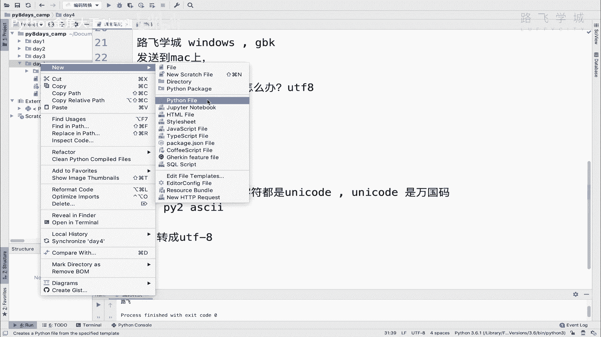

生成一个什么吧，生成一个新的Python文件啊，就是编码转换嘛，就编码编码测试好吧。

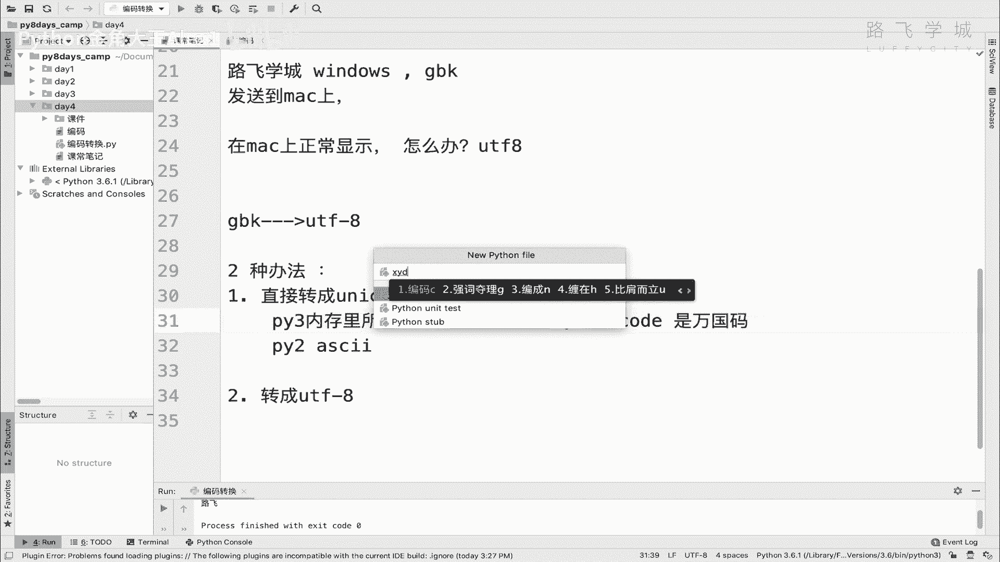

叫编码测试，然后注意了，我这个我由于我配置了这个文，就是编辑器的模板，所以我这里一创建它就会自动生成一个，就加上这两行啊，这个就是声明对吧，你接下来这个就是，我这个文件是用UTR8编码的。

就是告诉解释器，告诉解释器啊，但是我要把这个给他改掉，然后给它改掉啊，这个我把因为我我我直接给他删掉，给它删掉啊，注意了，我在这个地方干嘛呢，大家看我这个文件嗯，Python的解释器啊。

这是Python解释器，这个下右下方啊是有一个叫编码的，看到默认是UT8，看到没，这个就是你的文件的编码，明白吗，这是可以改的啊，可以改的，Sorry，你给他改成GBK啊，改成一倍。

它会给你提示说要要不要真改啊，你改的话有可能会会会出错，因为有的时候文字这么一转，可能会转转出问题来，那咱是啥也没有，没关系，就转直接convert，看到没有，convert完了之后。

你这个文件也就是JP的了，看到没有，GPK在这个地方，我在这里写一个字符啊，这叫路飞啊，不要啊，就叫路飞吧好吗，我们在这里print一下路飞，print s好吧。

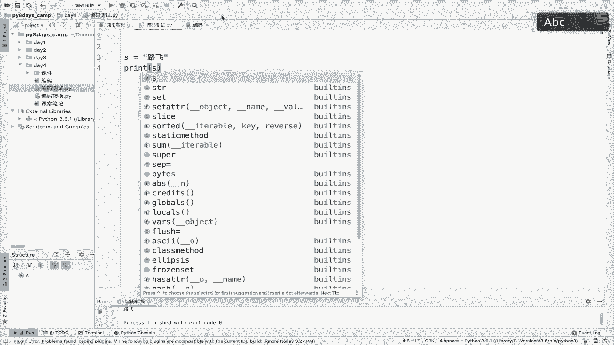

我直接用单击右单击的话，他应该会报一个错，又单击，大家看他报了一个错，说这个语法错误，说什么NNUT8这个代码，starting from这个什么什么第三行，第三行报错了，什么意思，注意了啊。

他说这个nut f8这个这个东西，我这个东西啊要在这强调一下，首先呢你啊咱们咱们大家已经知道了，在python3里内存里的这个啊，就内传递所有字符都是对吧。

python3里内存所有字符都是unity code，这是python3默认的，其实还有一个我们给大家讲，就是在python3里把文件啊默认编码就是默认编码，都是UT8啊，都是UT吧。

也就是说python3在解释器，如果他解释所有的这种，包括你的代码文件也好，普通的文件也好，它默认都是以UTF8来解释，明白意思吗，默认都是以UT8来解释，然后python2默认都是以阿斯克码来解释。

那好这个问题就来了，你python3用相当于他用这个什么呀，用UTF8来解释我这段代码对吧，这个文件嘛他解释这个文件，那很显然就报错了，为什么，因为我这个文件是GBK格式的，明白这意思吧。

那你想让它不报错怎么办，你要不报错，只能是在这个文件开头做一个声明，看到没有啊，做一个声明，做一个声明就是啊星号，然后encoding等一个GPK是吧，相当于你是告诉这个解释器。

接下来我这个文件下面的这些代码，都要用GBK的来解释，那相当于这样就没问题了，大家看你就直接print路飞，OK了吧，那大家看你print的这个路飞是什么格式，有的同学说那不就是GBK格式吗，对吧。

你pro这个路飞不就是GBK格式吗，NO啊，这里就很就很容易蒙，很容易蒙，我也是给大家讲一下吧，为什么呢，就是你相当于告诉解释器，这个文件以及bk的编码，这个文件是GBK编码的。

你给我用GBK编码来去解释对吧，那好解释器就是去解释了，但是他解释到内存里之后，会把所有的字符转成什么呢，转成UNICODE，因为我可是python3，python3内存。

所有字符都是unity code，AA它内存所有字符都是云code，默认都是in code，也就是说你在这里做的这个事情，只是相当于告诉解释器，你之前不是默认用UTL8，相当于你之前用UT8来解释。

之前默认就是UTF8对吧，解释这个文件啊，然后给它转成UNICODE，加载到内存不就变UNICODE吗，现在只不过是变成GBK对吧，转到内存里变成UNICODE。

所以到内存里这段字符它依然是一个UNICODE字符，明白这意思吧，它依然是一个UNICODE字符诶，对依然是一个UNICODE字符，所以啊其实这也就相当于操作系统这个解释器，它自动帮你做了一个事情。

就是干嘛干了这个事情，就是说把第一种办法给你干了，就是直接把你的GBK转成了UNICODE啊，所以你就可以直接打印显示，但有同学说你这样就是它自动了，我看不到这个过程啊，我就会蒙是吧。

我看不到这个过程我就会懵，所以呢像你想想体验一把，说把这个什么呀啊，GDK转成UNICO的，这个过程就能正常显示中文的这个过程，体验一把的话，你在python3上是没办法试的。

因为在python3里他的字符字符串就是unit code，所以你在哪里试呢，你可以在python2上试，你们的电脑上没有装python2，没有关系，我装了对吧，你就看一看，体验一下这个感觉就可以了。

好不好，我给大家演示一下，同样是这个什么呀，同样是这个啊这个文本好吧，这个文本，然后呢，我干嘛呢，我不要用python3执行了，我要用python2来执行好吧，我用python2来执行。

我在这里输入一个sorry啊，我在这里输入一个Python啊，诶你看我的操作系统上默认其实是装了啊，python2的，所以我输入Python它就是一个python2。

然后我就用python2来执行这个文件好吧，就直接Python，然后编码转换，Sorry，编码测试，对吧然后回车大家看啊，回车注意了，你现在用python2来解释PYTH2来执行。

在python2里默认编码是呃阿斯克码，就是默认它在Python里，它所有的字符默认是这个什么呀，是哎呀，弄死就弄丢了，好在python2里所有的字符默认是阿斯克码，然后呢他不会给你自动转成这个什么呀。

转成UNICO的，明白吗，它加载到内存里，加载的内存里默认是阿斯克码，但是呢你这个已经，所以就是说你这个是一个GBK的字符，它不会给你转成啊，他不会给你转成UNICODE。

明白意思吗啊他也不会给你转成阿斯克码对吧，就这他也不会给你转成阿斯克码，你啊我说懵了别啊，我再强调一下，在python2里默认编码是阿斯克码，然后呢你把你如果声明了，说我这段文件是用GBK解释的。

那好他就用GBK给你解释，解释完了之后加载的内存就完了，但是它不会像Python三一样，把你这个字符给你转成UTUNICODE能力，意思吗，UNICODE不会转啊，所以我在这执行。

大家来看print一下，你看你这个就会乱码，为什么，因为这是一段GBK的格式，然后在Mac上没办法显示，因为你mac1打印，它能支持UTL8，但是显示这个GBK就显示不了，所以这个时候我就能测试了。

说我是不是把GBK转成UNICODE就可以了。

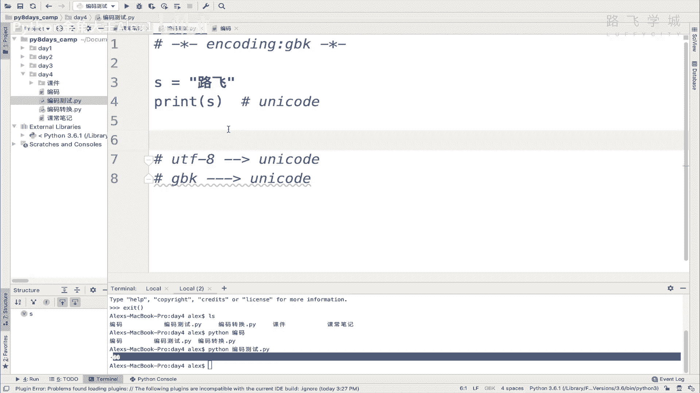

明白吗，转成UNICODE就是可以的，怎么转呢，来接下来看这张图，只看这张图。

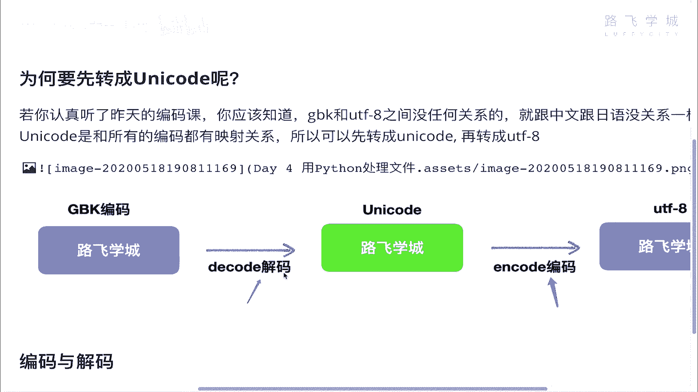

注意啦，这个是UNICODE，这是GBK。

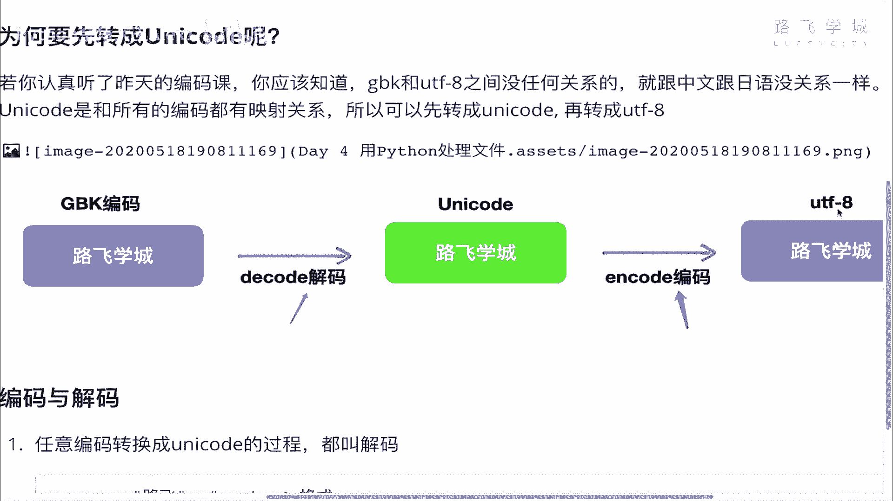

这是UT吧，看这张图的这个关系，你记住啊，就是如果你想把GPK转成UNICO的，它这个过程叫做解码，如果想把UNICODE转成其他的编码。

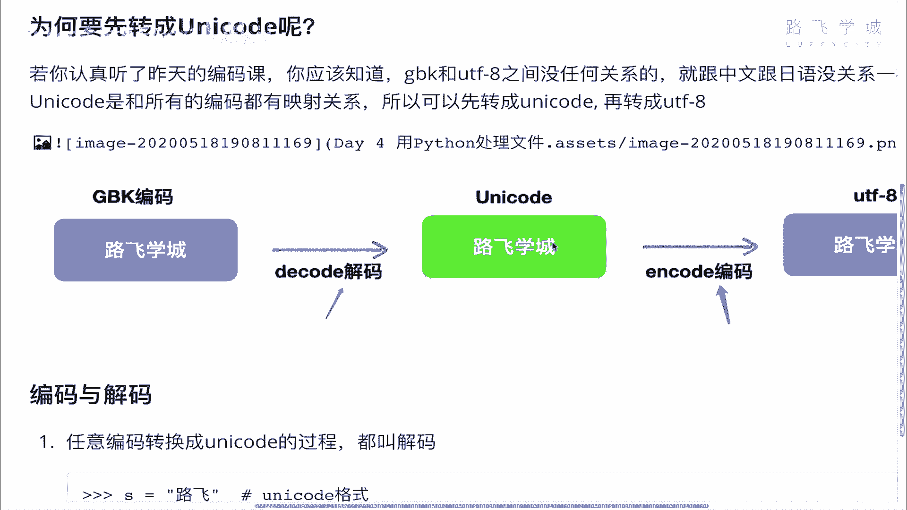

它叫编码，OK吗，解释如任意编码转成UNICODE的过程都叫解码。

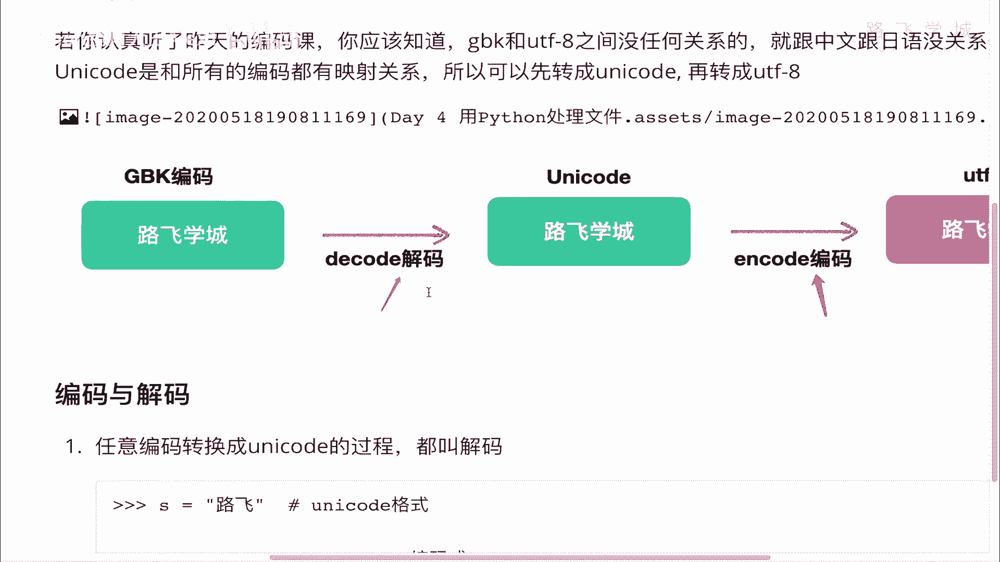

这个东西相当于啊UNICODE是第一人称，所有人想转成我，他都是他要把他自己解成我对吧，解码成我，我想转成任何人，我想转成任何编码，就是我就去编码明白吗，所以这个东西叫第一，就以路飞学生为第一人称的话。

这个定义就是对那个其他编码转成我的话，他就是解解成我对吧，然后呢我转成别人，我就是编成别人明白意思吧，好所以这个就叫解码的过程，语法就是抵扣的语法，就是抵扣的字符串后面跟个点decode就可以了。

decode就可以转成UNICODE。

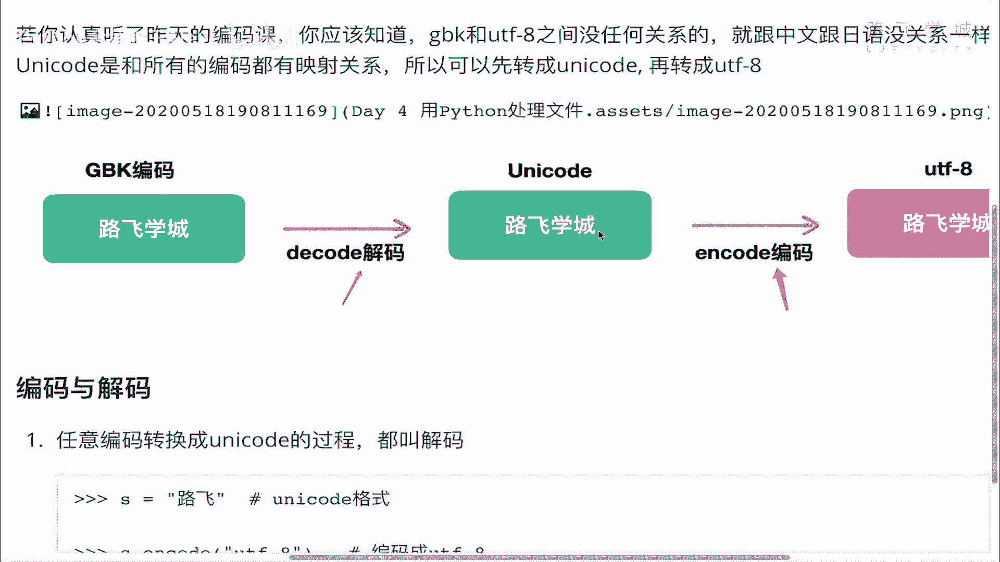

没意思吧，那好同志们，咱们来试一下，我转成UNICODE，就是直接S相当于g b k g b k to unicode吧，对吧啊，咱们这个就是GP图code就是S点什么呢。

decode它是一个解码的过程，注意了啊，它是一个解码的过程，然后注意你解码时你要告诉人家，你要告诉这个解码的函数，说我这段代码，我这段字符，我这个S这个字符是什么格式，我这S这个字符是GBK对吧。

相当于然后decode就是呃转成UNICODE嘛，所以你就告就这么一个过程嘛对吧。

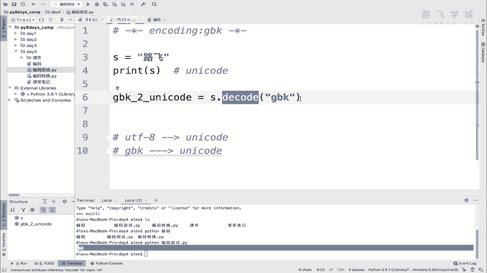

就相当于你就告诉人家这个函数啊对吧，我是一个JBK，你用GPK的这个格式给我转成UNICODE。

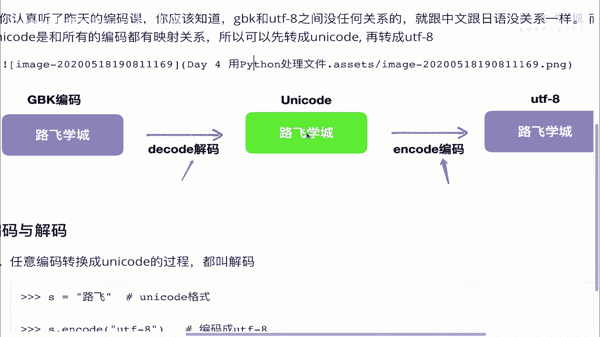

明白意思吗，好所以呢这么一转，咱们再来print一下这个GPK啊，咱们print一下这个g b k to unicode，看看能不能正常显示就可以了，对不对啊，你用python3执行它是出错的啊。

不要用python3，咱们直接用python2看着啊，还是python2，大家来看一下是不是可以正常显示，对不对，是不是可以正常显示，然后你甚至可以看一下它的类型啊，它的类型啊叫什么呢，啊，GBK啊。

Sorry，Gbk q，这个UNICODE咱们看一下它的类型，大家看啊，大家看注意了，我看它的类型，它是不是显示是一个UNICODE字符，对不对，然后呢，啊你你你如果是正常这种打印的格式的话。

把这括号加了，括号里就加在这里面，这种打印的话，它就不显示这个路飞的字了，它显示他这个编码的这个数字，就是16进制格式的啊，16进制格式的，你看前面加了个U，这是python2独有的U开头的字符。

代表它就是UNICODE啊，总之这我只是给你验证一下，你也不用自己去试啊，你就知道他只要转成UNICODE啊，就可以在这个操作系统上就可以正常显示了，明白这意思吧，操作系统正常显示了。

OK那在python3里相当于是什么呢，Python里它自动帮你做了这么一个过程，自动做了一个解码的过程，所以你看不到效果，但Python里它不会自动，你手动做了一下啊，就是这么一个情况，OK啊。

那这个就是咱们的啊，第一种的这种啊这种玩法对吧，第一种的玩法，那好这是Python在python3，Python，Sorry，Python啊，三上是吧啊，Sorry，我就这是python2上。

然后呢来还是回到这个python3这个情况下。

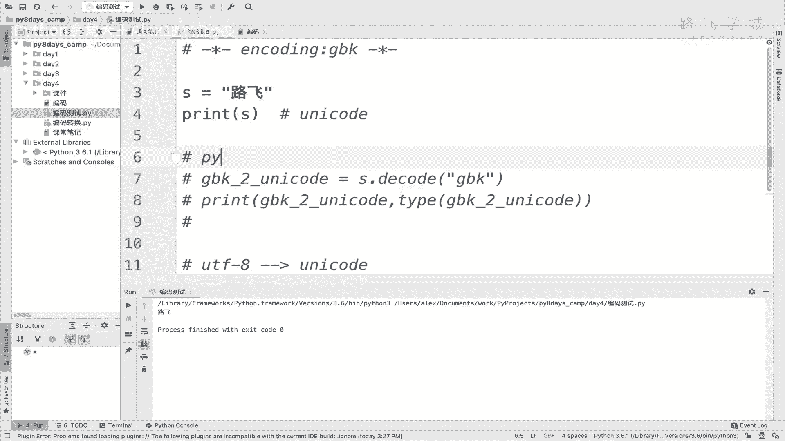