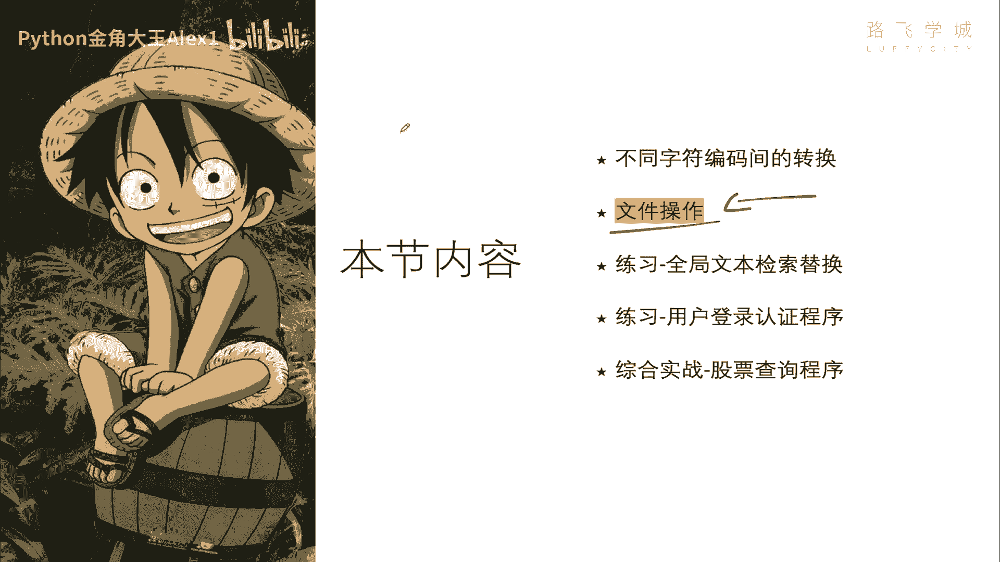
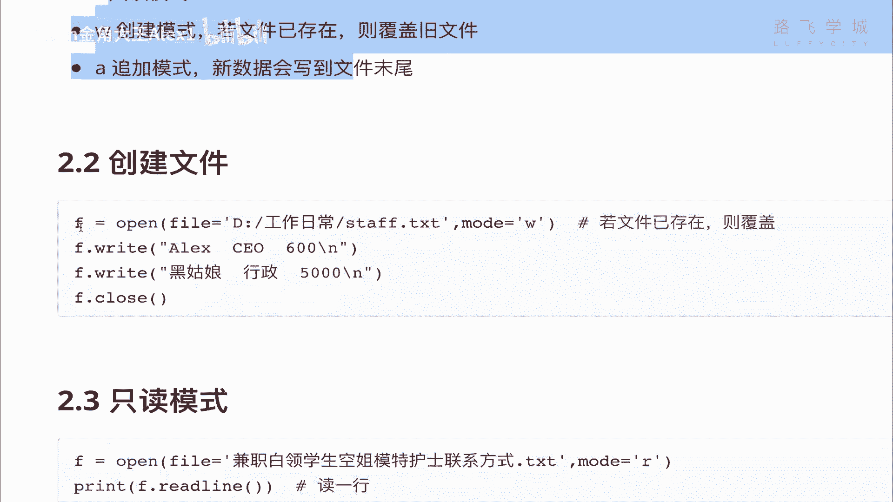
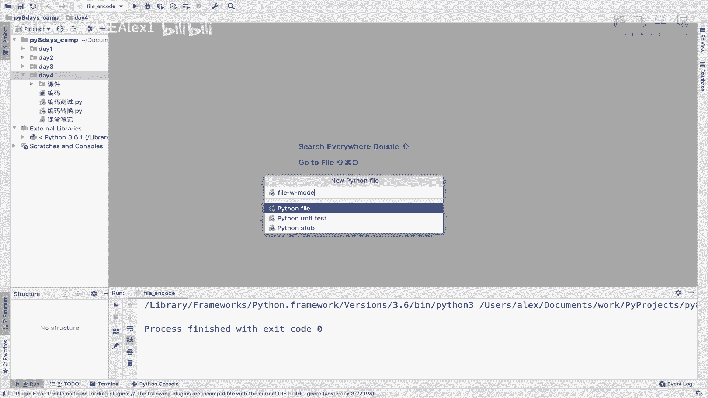
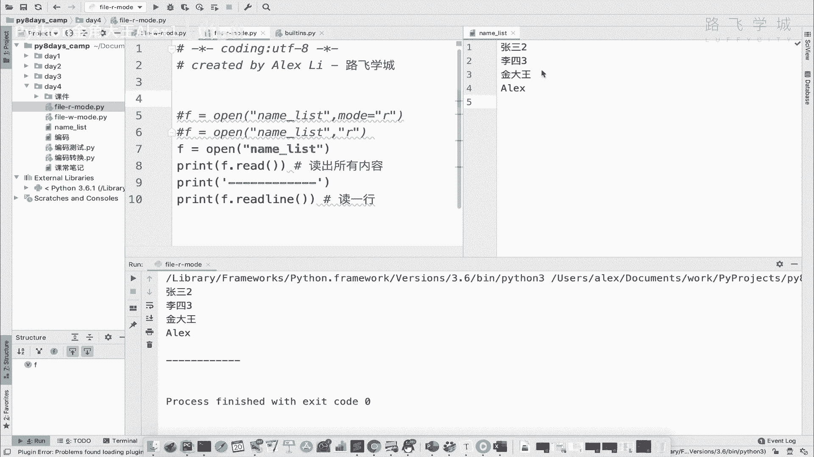
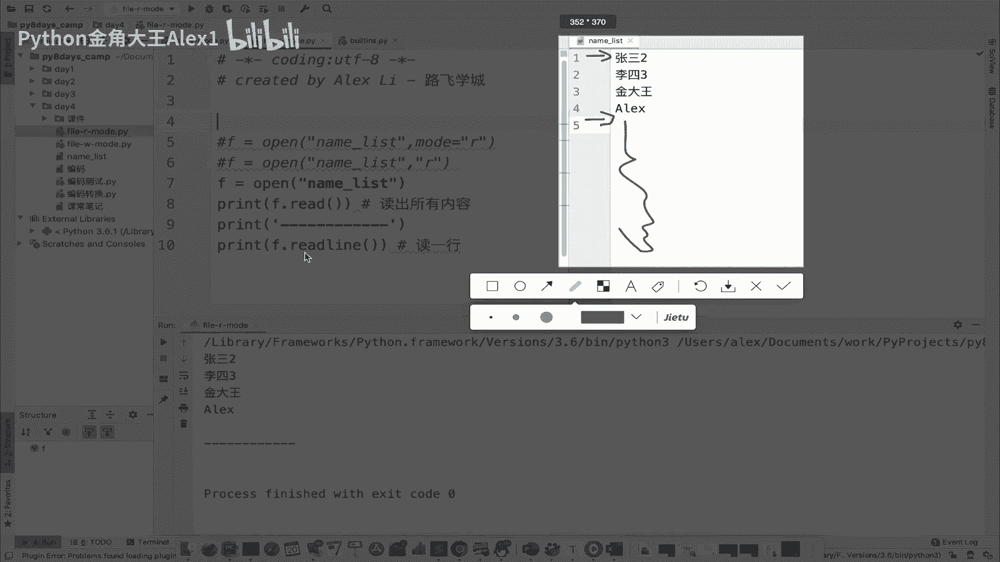
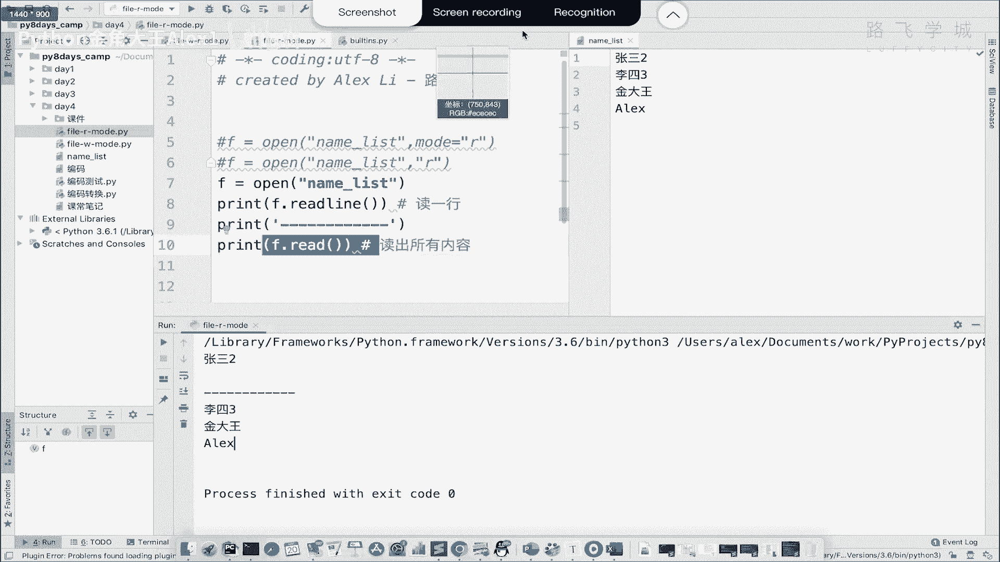
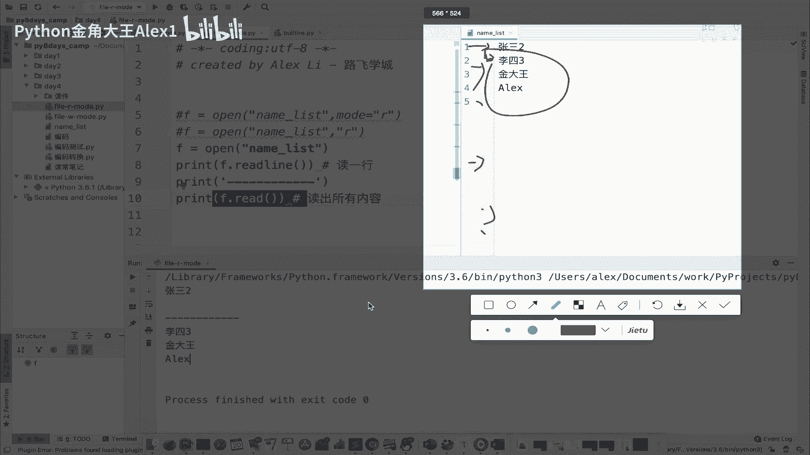
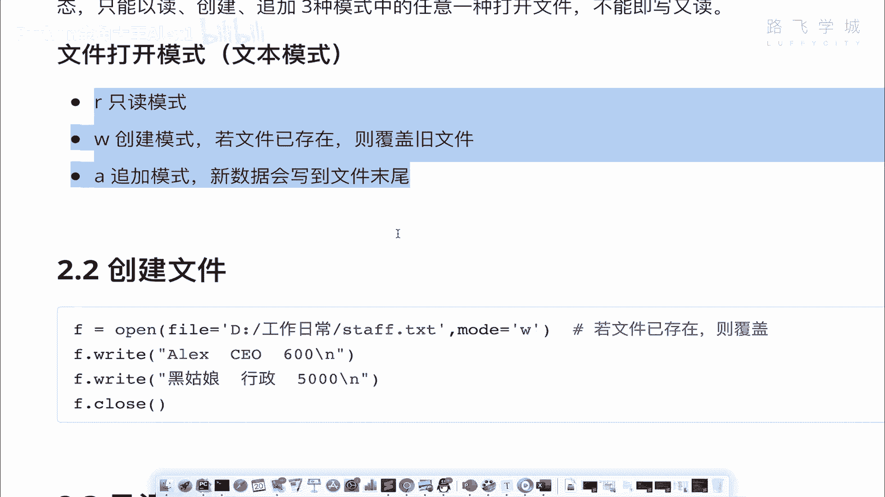

# 【2024年Python】8小时学会Excel数据分析、挖掘、清洗、可视化从入门到项目实战（完整版）学会可做项目 - P46：05 用python操作文件的3种模式 - Python金角大王Alex1 - BV1gE421V7HF

OK同学们，这节课呢我们来学啊，文件操作，所谓文件操作呢其实就是用Python来操作这个文件，那我们平常啊这个操作word操作excel，POWERPOINT对吧，也是操作文件。

那只不过是微软给你做成了这种用鼠标点一点，哎你就可以操作了，那用Python的话，它就是干嘛呀，需要用代码来去对文件进行这个啊处理。

对文件处理啊，那看一下这个文件操作，一共学这些东西，那首先我们要了解文件操作的这个流程啊，怎么去创建只读啊，追加怎么去循环，二进制是什么模式，混合模式干嘛后面讲啊，怎么去文件的修改。

那那咱们先来学文件的操作流程好吧，那这个先了解一下，咱们如果有一个word文档啊，一个word文档放在你面前，那你怎么就是你整个操作流程，你给我总结一下有哪几部啊，想一想第一步的话。

你是不是要打开这个文件对吧，你肯定要打开这个文件是吧，打开文件之后，你接下来第二步干嘛，第二步你就在这里进行一个增删改查，是不是增删改查啊，这个CRUD是吧。

Create read update delete，在文案改查完了之后，你是不是就要关闭和保存，是不是，第三步就是一个close和save，是不是cs好，Close c，那就是这么几步对吧。

打开增删改查和关闭，那我们Python处理文件是怎么做的，我告诉你跟这个模式几乎是一样的，打开文件增删改查，然后关闭好吗，看一下啊，看一下Python打开文件的语法是什么呢。

打开文件的语法就是open啊，open通过open，然后里面写文件名，哎你就把文件打开了，文件打开之后是吧，那你接下来要对文件进行增删改查，你是不是因为文件打开已经存在内存里了嘛，对吧。

你接下来要要要对它进行修改的话，你要从在内存能找到它，所以你给他付了一个变量是吧，F然后F点right f点V的都是它的属性，也就是说这个文件的属性，你可以你可以只要是一个文件，它就有这个属性。

明白意思吧，是一个文件它就有啥可以写，可以读，可以关闭，还可以一些很多其他的方法啊，功能都可以，后面讲，那right就是里边写上你要写的东西，这就是写操作，read就是读操作，看到没。

read就是读操作，close就是啊lg不一样，close是保存并关闭，先保存再关闭，明白这意思吧，啊这个跟word稍微不太一样啊，先保存后关闭，那好这个就是怎么讲啊，咱Python的一个啊。

一个操作文件的那么几个重要语法，几个重要语法啊，也是打开修增删改查，然后再关闭好吗，那不过呢他跟咱们人肉操作word文档，稍微有一点不一样的地方是什么呢，咱们的word文档只要打开了。

是不是就可以又读又修改或者是删东西，是不是啊，但是这个Python稍微变态一些，Python啊，他比较他比较单纯或者比较傻，他不支持你啊，你打开一个文件之后啊，又读又写又有什么啊。

它不支持它只能是什么呢，很单纯就是单纯模式，就是说呃你要不然以读的模式打开，要不然你写的模式打开，就是你以读的模式打开呢，就不能写写的模式打开就不能读明白吗，诶他是这样的。

但就像哎word文档应该也有一个只读模式，对不对，就你一只读模式打开的时候，你就不能修改，就啊对别人发给你一个文件的时候啊，通过微信啊，通过微信什么的，你直接点开它应该是一个只读模式。

你这个时候不能修改，你想修改你必须重新复制一份是吧，再再去修改，所以Python它就是这样，你你默认就是你你如果以读的模式打开，它就只能读写的模式打开只能写啊，这个要要区分一下。

所以Python打开模式，打开文件的时候，你要指定它的模式啊，指定它的模式，这个什么呢啊三种，一个是读读模式，创建模式和追加模式，注意它是创建W是创建模式，它不是一个啊，创建模式就是说什么呢。

就是创建一个新文件，如果这个文件已经存在了，覆盖旧文件，你创建文件之后就可以写明白吗，啊这个追加模式是什么呢，在这个已有的文件里面，往往文件尾部去追加内容，文件尾部尾部啊去追加内容啊，这是低价。

就这么三种模式，注意了，这个叫文本模式，就是你处理文本是这样啊，后面我们还会有一个叫什么呀，二进制模式，二进制模式是专门处理图片视频的啊，一会讲那文本模式就是这样的，咱们接下来就看怎么去创建一个文件。

很简单语法啊，很简单的语法，我就直接在这里给大家写就行了，好吧啊，这样嗯我在这里呢直接啊先是一个叫啊file，然后呃创建，对吧这个w mode吧行吧，就是写创建的一个模式。

那这个时候大家看啊，接下来我要创建一个，我要创建一个文件，那创建一个文件就直接F等于一个open，写一个啊，这是什么呢，呃name list好吧，哎写了一个名单，然后注意了后面你要跟模式。

你要跟模式写成什么了，你其实看啊，它这里面它里面有很多点进去点进去啊，我点CTRL键点进去，这里面有很多参数，第一个参数就是文件名，第二个是你的模式，第三个第四个这些不用管啊，这个先不不讲了。

先用不到啊，后面我们会讲这个encoding，就这两个模式看到没有，你要就这两个参数你要指定它，那首先他这个模式呢mod等于一个sorry，等于一个W，看到没有W。

这个时候这个时候啊你就可以往里面写东西了，你看它里面一点出来，它有很多的属性，不用看下划线，就看这种看到没有啊，开头的这种很多属性，但是我们啊还是只讲最重要的啊，那直接write write什么呢。

right啊，Hello，就是写名字嘛对吧，张三是不是啊，李四第一节写上我真名了啊，我这名字可可难听了，李四，然后这个金角啊，金大王，然后还有一个ALEX是吧，写了四个人的人名啊，写了四个人的人名。

那这个时候我们写完了之后就可以干嘛呢，F点close啊，保存并关闭，看到没保存并关闭，注意了，如果你什么也不写，他就会创建一个空文件，明白意思吗，它会创建一个空文件啊，那咱们还是写一下吧，等一下。

那这个时候我又单击回车，看着啊，又单击回车啊，算什么回撤，那么执行啊，一执行大家看左边是不是出现了一个文件，没错吧，推荐这个文件大家一点击大家看，首先先说哎这个跟我的预期不一样，又有点一样。

第一一样的是说他确实写了内容，对不对，刚创建了一个新文件，不预期不一样的是什么，他没有回车，没有换行，为什么，因为我这里写了四次，他不应该换行吗，是不是哪条微信发糖了，但是没有注意了，他不会自己换行。

不会自己换行，如你如果你无论你write多少次，它只会在之前那个基础上，张三李四给你堆积起来，看到没给你堆积起来，那如果你想让他换行怎么办，自己加换行符，看着啊，自己加换行符，加到后面。

斜杠N不是换行符吗，对吧哎啊加到后面就可以了，注意了，一定要加上斜杠N，斜杠N你加上斜杠，人家Python还能认识，说啊，这是一个叫什么呀，叫叫叫啊，一个特殊的特殊的语法。

而不是说一个N的普通字符串好吗，你这样相当于换了四行，注意注意啦，我如果这样画了四行的话，我再执行，看着啊，同志们，我再这样吧，我哎我split一下，把这个放在这，看着我U单机执行啊，我就单击执行。

大家看看啊，看看这个效果，看看这个效果啊，他是不是在这个下面的基础上产生四行，注意了，他是不是在下面几款产生四行诶，大家看这里变了诶，他并没有，他并没有在刚才原来的基础上产生了，就新增了四行。

而是什么呢，把之前的覆盖掉了，刚才之前是不是横着一行啊，你看着是不是覆盖掉了，没有了，对不对，诶，这是怎么回事，这是怎么回事，对吧，你你直接把我之前的给删了，这就回到W的这个模式上，W是创建模式。

它不是修改模式，它是创建模式，如果文件已存在覆盖旧文件，刚才第一次执行的时候，name list已经存在了，再执行一遍就是覆盖这个文件，明白吗，所以我在这里如果再写一遍。

你再写一遍这个张三二李四三看着啊，他不会在下面基本上再写，他会他会直接把原来的删掉，看到没有值值钱的，就就全覆盖了，明白吗，这个是它的创建模式，好吧，理解了，如果就是就是学完了创建模式之后。

我们再来看只读模式，先来说咱们说他在创建模式的时候，只能写不能读，你比如说我现在去读一下啊，直接执行一个read，它会报错，看着啊啊read是读所有的内容，报错报什么错。

说IO点on support IO就是输入输出啊，就是相当于文件操作这么一个概念，不支持不支持什么呢，不支持的操作啊，叫not reasonable，这不是一个可读的文件，明白意思吗。

他只能写不能读好吗，所以你要想写一个只读的模式，就是f file，然后AD mode好吗，mode那同时我们再把这个文件给他打开，哎，Sorry，再把文件打开open，然后你的啊name list。

OK注意了，你的mode应该写成R，是不是，其实你也可以不写这个啊，mode你不写，你不写这个参数的话，它就按这个位置来，因为你这个看到没点进去，第二个位置就是mod嘛，对不对。

他这里写了一个R什么意思，也就是说这就是默认参数什么意思，你不给他传，他就默认就用R，也就是意味着你在这里可以不写这个东西，你不写这个东西，它也是以R的模式，你写上的话，它也是啊。

写上和不写其实是一样的啊对吧，也就是说你上面这个这个和这个这三个，都是一样的，作用都是一样的，明白意思吧，所以你在这里可以简写，不写不写的话，我们这个时候直接看F点V的。

大家看F点F点V的会把所有的内容都读出来，咱们一直行，看着不行啊，大家看，你看是不是把所有的内容都给你读出来了，都给你打印出来了，明白意思吗，还有同学说我不想读所有，读出所有没有，我不想读所有啊，好吧。

我只是想读张三啊，只想读第一行，想读第一行怎么办，可以啊，print直接print f点，Read line，看到没有，这是一个新的语法，它是干嘛呢，读一行没意思吧，这个时候这个时候注意了啊。

这个时候注意了啊，执行的会出问题，看着大家来看一下呃，我我在这里区分一下吧，不然看不出来，啊上面是读所有，下面是读一行，大家看哎，我在读完所有之后啊，读完所有之后，我打了这个分隔符分割行。

然后在下面这个REDLINE好像没东西，没有执行啊，没有执行，其实不是没有执行，是这样的啊，你注意你看啊，你要思考一个事儿，这个东西就像一个你看我在这里啊，你看我这里是不是有个光标啊，它在不断的闪是吧。

是不是不断闪啊，就在我光标放在哪，就代表我一敲就在哪里写东西，是不是啊，哎这是肉眼可见的，其实呢在操作这个文件的时候。

你可以理解也有一个光标刚开始的哎，刚开始的时候，也就是说你刚打开这个文件，这个光标放在这儿，看到没有，你read你你执行了一个read操作，这个相当于read，它会读出所有的内容来，Read。

就是把整个读出来了之后，它的光标在移就移到这，在移到这了之后，你再去read啊，你再去read read line也好，准备好他后面没东西了，他不会再回到之前，明白吗，他会就没东西，后面没东西。

它就是空，它读出来就是空，所以你read line也好，你再执行read也好。

后面都是这东西的，你比如说你在后面再执行一个read，I sorry，你再执行一个read也没有用啊，它都没动西，它不会报错，因为后面都是空的啊，这没东西，所以这个就是read的一个情况read。

但是如果你在这里先去进行一个REDLINE，看着啊，你先去进行一个RELI啊，写到哪呢，把这个味道给去掉啊，你先在这里就是打开文件之后，先不要读所有先去V的一行，然后在这里加一个分隔符。

这样你就可以看出区别来了，看着先读一行，哎大家看一个问题啊，看着有点意思，我先读一行，是不是把张三打印出来了，对不对，打印出来了之后，我又print，因为print本来会换行嘛啊。

这里面又带了一个换行符嘛，所以你在这里看到好像有个空行啊对吧，所以这里这里这个自己有个换行符，print就代入换行符，所以导致他有个同行，这个没问题啊，Anyway，看这个这个就是说你在V的所有的时候。

他不是他不是从张三开二开始读了，他是从李四三开始读，这就符合我刚才跟你说的那个是不是啊。

你这个光标默认一开始在这对不对，你redline read意思就是执行了一次read line，然后你的光标就移到这来了，移到这来了之后再read所有它是read这里所有，而不会回到张三二再去read。

明白意思吗，所以他一直都会有一个光标的概念，所以你操作文件的时候要心里记着说，唉我光标走到哪了，光标走到哪了，明白这意思吧，还有同学说我哪知道光标左脑我可不可以看，光标走到哪可以看，现在还不到时候啊。

晚点我们再交，但总之比如光标的概念好吧。

这个就是rad的模式好吗，那接下来我们再给大家快速的讲一个其他模式，就是追加的模式好不好，追加的模式啊，因为哦对了，还没还没这个还没是呢，就是说你读出来了之后，你可不可以写呢。

F点write干啥他也会报错，说不能写同样的错，对不对，不支持的操作，Not viable，是不是只读就是只读不能写啊，干脆利索，OK接下来再来一种叫什么呀，追加的模式，追加的模式啊。

A file a mode，追加的模式是干嘛的，他就可以诶，Sorry，他就可以对文件进行一个啊，这个要写啊，这个因为它默认是R嘛，这个你必须明确的指定它是一个A，然后接下来呢我就干嘛呢，可以F点啊。

F点write可以在这里面写东西，我比如写啊，看着啊，写哈哈，然后F点close可以吗，写两个吧，啊jack jk写了两个，然后我执行大家看一下，看一下它还会覆盖吗，它不会，它会干嘛呢，看到没有。

是不是直接出现在后面了，他会把内容追加到尾部，看到没有追加到尾部，所以就是A的模式的时候，它是可以写的，但是写是写到尾部，而不是说你说我写到中间，插到中间什么的不行，Sorry，只能写到尾部可以吗。

我可不可以读呢，F点V的试一下，咱们执行一下，看看是不是报错，也就是说追加的时候也是只能写，只能执行这个write操作，不能去读好吧，每次写他就每次往后追加啊，想换行自己换行可以吧，所以这个就是什么词。

这个就是什么呀，咱们的追加的模式，那追加模式什么时候用呢，啊你只是它相当于它只能限制，只能下到文件的尾部嘛，这个时候就是我们程序写日志打日志，比如说你写一个程序，它它程序要不断输出日志嘛，输出日志之后。

一个程序的运行日志后面可以去排错嘛对吧，调试嘛，那这个日志他肯定他不会修改前面的，他只会往后不断的累加，累加累加就跟写日记一样对吧，之后之后只会往后累加，所以这种就可以用追加的方法明白这意思吗，OK好。

所以咱们就快速的把咱们这个文件操作的，三种啊，呃三种模式给大家讲了。

你自己操作一下，花个10分钟的时间。