# 【2024年Python】8小时学会Excel数据分析、挖掘、清洗、可视化从入门到项目实战（完整版）学会可做项目 - P49：08 跳到文件任意位置修改 - Python金角大王Alex1 - BV1gE421V7HF

OK同学们，这节课呢，咱们来学Python操作文件的一些其他的一些功能，咱们只是学了什么呀，只是学了这个write和read啊，这些基本的这个用法，但是它还有很多，你在这里F点一下。

你看方向还有很多好吧，我在这里呢把他的一些主要方法都给你啊，加上注释了，加上注释了，但是咱们今天只学三个重点知识。

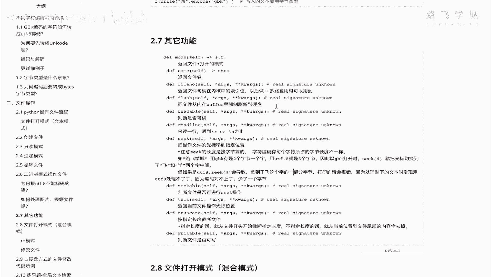

一个叫SK，一个叫一个叫flash，OK吧，其他的有兴趣自己去看，毕竟咱们是一个啊训练营高强度的啊，所以没办法讲的，每个都都这个这个全都讲一遍啊，这个用不到啊，咱们用不到，Anyway。

那咱们先来学这个seek啊和SK，那seek的它的作用是什么呀，看把光标文件啊，Sorry，把把操作文件的光标移到指定位置啊。

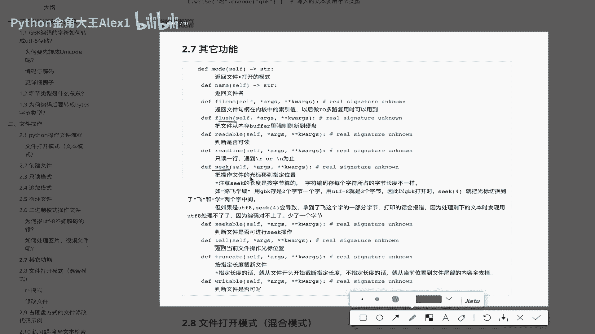

操作文件的光标移到指定位置，我在刚开始就是什么呢。

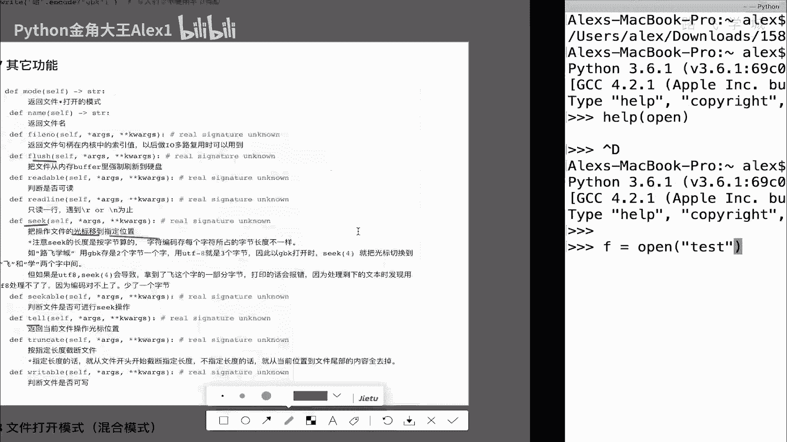

这个打开一个文件的时候，打开一个文件的时候，咱们当时就跟大家说，这里其实是有一个光标的，只是你看不见你，比如说刚打开光，你刚打开这个文件，你的光标就是在第一行，就在这闪着，明白吗。

然后你读一行光标就往下走一行。

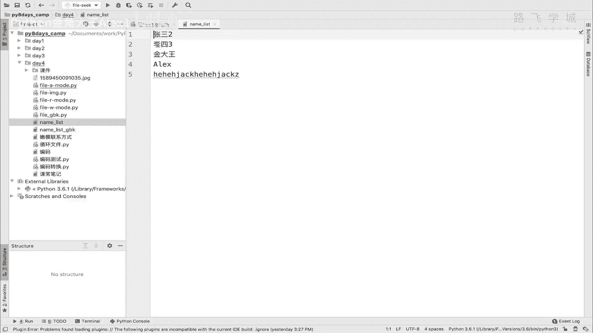

读一行就光标往下走一行，所以才会出现哎你read read1行，然后呢就再read一次就到下一下一行了，再锐的一次到下一行再read就没了空了，明白吗，全都是因为有一个光标记录着这个啊。

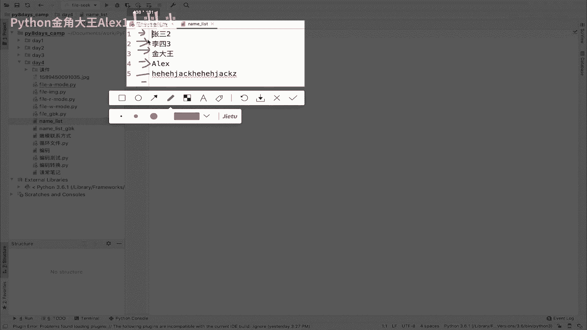

位置呢记录着你现在在哪，明白吗，我seek是干嘛的，我的seek是可以移动这个光标。

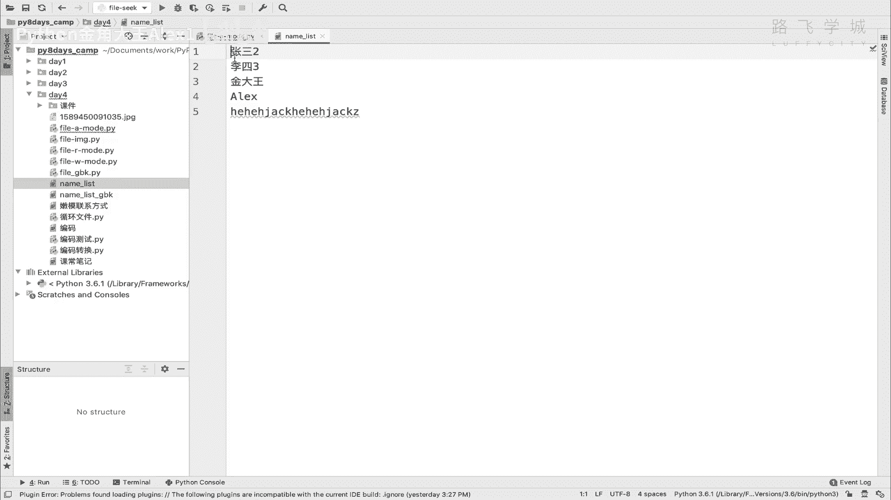

比如说我的光标刚打开这个文件，它明明它是在这，明白吗，但是我可以把光标移到这OK吗，我移到这之后。

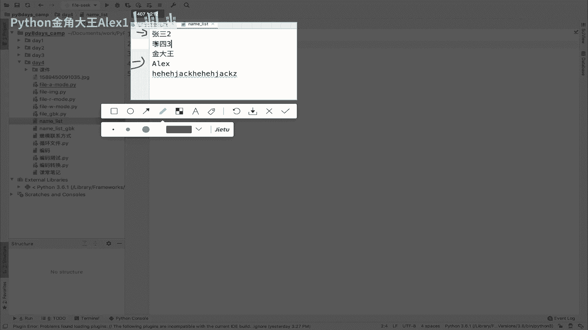

哎我在这里进行什么操作，比如说再来回移移回去，这是都都是可以的，就像你打开一个word文档，你对吧，把鼠标放在这，放在这，放在这就是这个效果，明白这意思吗，那我们就来演示一下，我们就来演示一下啊。

啊大家看我呢啊这样我呢就是这个什么呀，嗯我想想我就直接呃去打开这个文件，然后呢我就打开文件去看一下，打开文件，然后你的光标默认位置是在零这个位置，然后呢我们给它移动，移动到一个位置，然后再往下打印。

看看什么效果好不好，OK呃FISK好吗，然后我们再等一个open，然后呃叫什么来着，name list对吧，那我呢直接去seek seek，注意了他这个什么呢，你直接是你直接就写数字就行了。

你把你光标移移到哪呢啊，比如说我移到这个移到二这个位置，然后再往后去诶，就移移移到移到这个位置，移到这个位置吧，有的同学说那不就是1234。

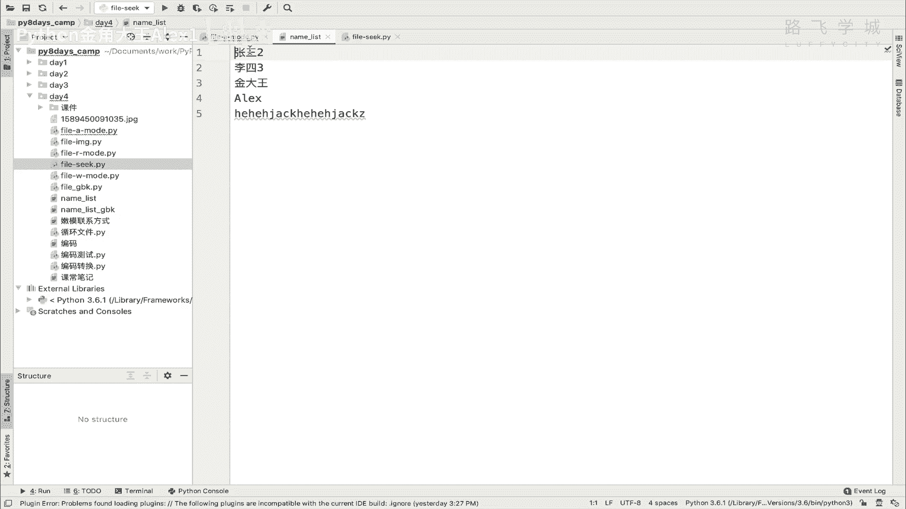

在这写个四就行了吗，不是的，注意了，你这个光标移动的位置，它不是按字符的，注意了，它是按字节，明白这意思吗，它是按字节啊，这就跟你编码有关系了，因为你这个中文如果是GBK编码。

那你一个字一个中文字占两个字节，对不对，然后如果是UTF8编码，那你一个中文字就占三个字节，对不对啊，所以呢这个东西这个要记住啊，他这个seek不是按不是按这个字符个数啊。

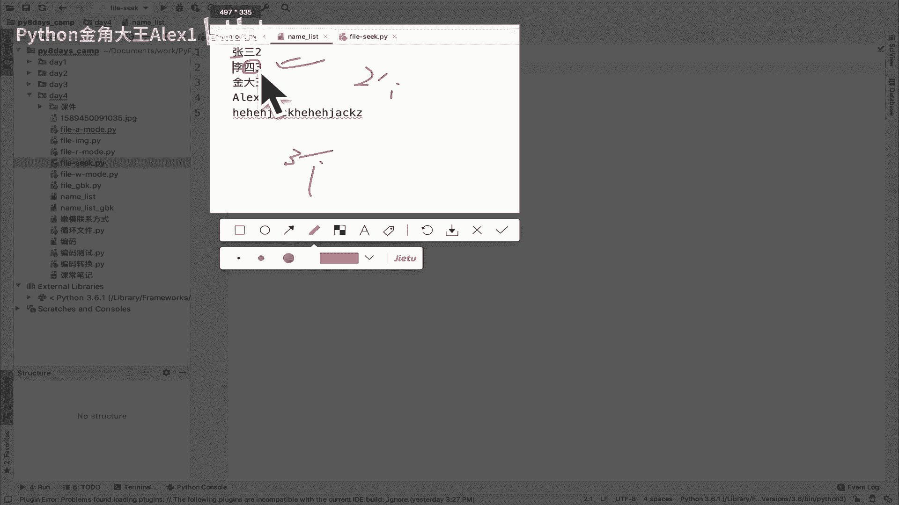

说123它是按字节，所以像相当于我如果想移到这个什么呀，移到这个位置，那我是UTF8编码，那它就得六对吧，1~6这个位置看到没，123456嘛，1~6这个位置，然后再打印，咱们看看效果好吧。

我就直接移到六，然后呢我来print f点read line，看看效果好不好，来执行一下，大家看你看是不是他只打印出来了一个二，是不是啊，我在这里1~1到三的话，你看他就会把三和二打印出来。

是不是章就没有了是吧，因为光标是从这里开始读一行，那我要移到一个移到一个，移到一个七呢，会出现一个什么效果啊，诶怎么是空的没东西，怎么是空的没东西，诶这是为什么呢，注意了，你1~7。

这就是这个位置的后面有一个斜杠N，是不是斜杠N再往下就斜杠N，你从斜杠N往后读，那打当然没东西了，对不对，所以我想移到下一行，那怎么办呢，那你改成八，比如说咱们试试可不可以啊。

大家看你移到八了之后再with line，是不是就把李四三给它打印出来了，对不对，哎那同学说了，我这里呢怎么讲，口水我啊，我这里怎么讲呢，就说你你这个是我我明白了，你这是以这个叫什么呀啊字节来算的。

你是动一下是移动几个字节，对不对，那我现在八是在这，但是离这个占三个字节，那我我我就不移，我我就不移到这个啊，就是8+3，那就是就是11了嘛，11应该是到这个位置，但是我不我就是1~9。

我就把这个梨给它拆开，想看看效果是什么样子的，好不好，哎咱们可以试验一下啊，看看如果1~9会出，能不能把这个半个里打印出来啊，能不能把这个半个里打印出来，能理解意思吧，咱们执行一下诶，发现报错了。

他报了一个什么错，说UNICODE啊，这个就是这个UTF8解码又出问题了啊，UTF8解码出问题了。

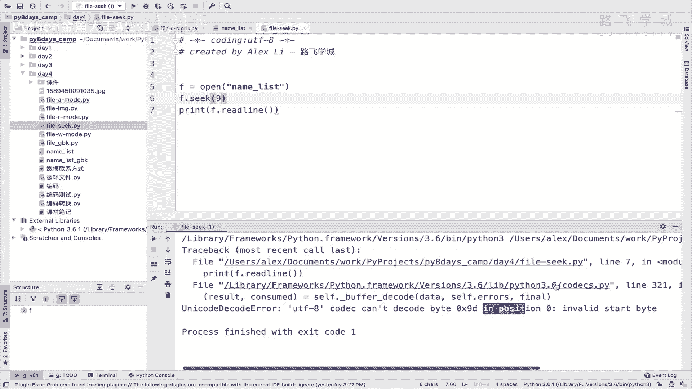

为什么出问题呢，同志们为什么出问题，其实就是啊这个地方你首先要明白它是按字节，那在这个位置的时候，它是八，对不对，然后呢在这个李和四之间的这个位置是11，但是你8+1就是礼，你以为能给他拆一半，不能啊。

它是不能给他拆一半的，所以相当于你你你在你你在九这个位置上，然后呢往后打印这一行，那相当于这个离它只剩下只剩两个字节了，这两个字节在U他用UTL8去解码的话，他解不出来呀，因为它它不是一个U盘。

它编码的角对吧，你你少了一个嘛，所以它它就解不出来，解不出来就报错了，就是就这么简单，明白意思吧，就这么简单，所以有的同学他不明白这一点，他说哎我怎么就报错了读啊。

就是就是他就是要要要清晰的知道这个逻辑啊，是它是按字节啊来去读的。

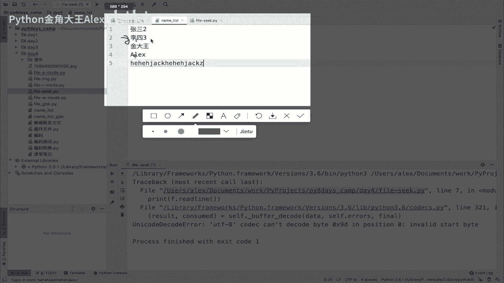

OK好这个是在读的时候用这个SG，我们我们在写的时候啊，也可以用这个SK，没啥意思啊，在写的时候也可以用这个SG，咱们就可以来试一下啊，试一下啊，我就怎么讲，sick right吧好吧。

然后嗯我在这里直接先去干嘛呢，呃先去写，直接写TERRI，然后hello，Hello，一对吧，加一个斜杠，然后hello2，Hello，三哎，我一共写了三行文本是吧，当我走到三的时候呢。

我这样我这个时候我可以其实干嘛呢，去回回到我，我比如说我想回到我第二行，或者回到哪个位置上，我再去重新继续写，可不可以呢，当然是可以的，我可以seek，就说我seek到十这个位置，我也不知道十是在哪。

可能是在这还是在哪，14这个位置，然后在这个地方再去写一个对吧，再去写一个插一个东西看看它，这样的话咱就能看出来他确实有没有回去回去，那明白意思吗，OK然后这个咱们执行试一下就可以了。

哦哦sorry sorry，你得先创建一个文件是吧啊，写的模式打开啊，OK执行诶，哦这时候你不能read line啊，Sorry sorry，大家看啊，这个有一个secret secret的一个文件。

诶，这个有点意思啊，大家看看这个情况，你看啊，我打开这个代码对应着好吧，诶大家看我这个文件呢先写了一个hello2hello3，正常的话它就hello3，对不对，应该是有三行，但是实际效果它有两行。

为什么呢，因为我回到了十这个位置，就是123456789十，看到没有，正好同时这我写了几个，这个对不对，写了十，然后呢本来这里人家是hello，然后这里有一个换行的话，但是你这个五个相当于把人家你哦。

你这就相当于把人家第二行给你覆盖掉了，是不是啊，你不是他不是在这个，它不是在这个hello2在第十的位置上往后插入，然后说把这个后面的什么什么什么什么什么，出现一个后面的，怎么LLOR。

他不是他他他不是像这样给挤回去了，他而是什么呀，他是直接直直接是在把人家hello2，后面的东西给你覆盖了，是不是覆盖了，是不是啊，所以他先不管它，就是这是它的表现形式啊，就是他他就是给覆盖了对吧。

你就先你先不要问为什么给覆盖了，而不是挤回去对吧，这个后面讲你先就知道我seek到这个位置上，确实是可以相当于我啊，怎么讲，我们文件已经写了很多行了，但是我可以回到某个位置，能理解意思吧。

OK那它的表现形式就是说，它会你回到某个位置再去写东西的话，它会直接覆盖在那个基础上，往后覆盖，他就当后面没东西，夸夸夸，就往后往往后写，明白这意思吧，而不会说往后挤啊，不会往后挤。

但至于为什么咱们晚点再讲啊，你先知道这个情况好吗，那这个SC我们知道了之后啊，SC我们知道了之后，咱们还其实跟这个seek啊，一般成对出现的，还有一个叫ta啊，TAE是干嘛的，tale是干嘛的。

我们可以先在这里print下F点tail，tail是这个什么呀，这个叫啊，就是呃返回这个什么呀，返回光标位置，光标啊，当前位置明白这意思吗，也就是说你现在走到这了啊，你你你你可可以返回你这个光标位置。

咱们来看一下，大家看我这个当前的位置是21，也就是在这个地方的时候，它是21，我要再往后写的话啊，这个哎比如说我可以这样，我可以在这个时候诶，Sorry，我在这里也返回一下光标位置看看啊。

对在14这个位置上，也就是说正常的话咱们咱们先不写这个看着啊，正常的话我这个第二行写完之后，这个就是十四十四对吧啊14，然后十五十六十七十八十九二十啊，21，对不对，也就是说下面那个光标是21嘛。

对不对，就打完打印完第三行，所以你这个时候，如果在seek到14的这个位置上，你再去写的话，其实是相当于把你这个hello3给你覆盖了，看着看着这就有意思了，看到没有，是不是把HS3给你替代了。

OK所以tail啊和SK咱们就都学了好吗，这个明白完了之后，我们再快速的学一个方法啊，这一小节就结束了，就是学这个什么呀啊哦或者是这样吧，我给大家说一下，就是这个seek在什么时候啊，什么时候会用是吧。

有的同学说在什么时候用嗯，我想一想，其实用的不是很多，用的不是很多，你反正你已经知道它的功能了，就是说它可以回到某个地方去修改是吧，修改但是修改它不是说往后几次是覆盖，对不对。

但是呃对你在修改文件的时候是可以用的，对修改文件的时候可以用的，但其他的场景用的，反正我用的不是很多好吧，你先但是你要知道这个功能，那另外一个就是flash啊，flash是干嘛的。

把文件从内存buffer里面强制刷到硬盘，这个buffer是什么意思，唉这里就要讲到了这个什么呀。

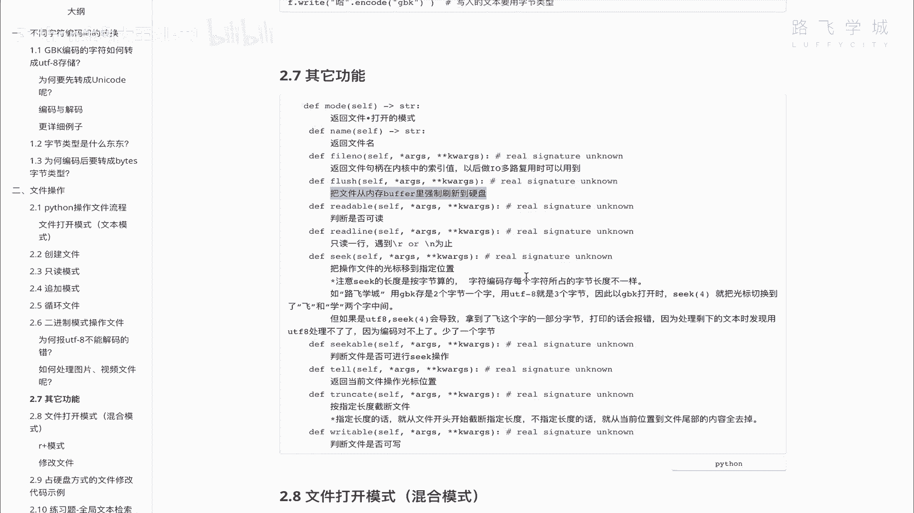

大家我给大家讲CPU啊，内存和硬盘的区别的时候，这是CPU，这是内存，这是硬盘好吗，然后写一下C内存R，然后硬盘是d disco，是不是就是他俩的速度，对不对，这是飞机，这是火车，这是这个摩托车对吧。

那也就是说数据在内存里，然后呢内存的速度比硬盘快很多，也就是说我在这里写了一行right，就他就把这个sorry，他就往这个内存往这个硬盘上写一条是吧，又write一下又写一条。

又write一下又写一条，这会导致一个问题，也就是速度特别慢，为什么，因为内存的速度啊，假如说咱们是十倍于硬盘的话，内存速度十倍于硬盘的话，也就是说我写这一条，但是就是我写十条的时间。

我内存里写十条的时间，硬盘只能完成一条，对不对，这样的话，那我想怎么讲，我在操作文件的时候，就是我我比如说我我往我往这个硬盘上写一条，那我就得先等个十倍的时间，等个十倍的时间。

因为他要花十倍的时间去写嘛，那我这这段时间内，我这个内存就不能干别的，我这个程序就不能干别的了，因为我等着往硬盘写，等着往硬盘写，所以这个速度效率就会非常低，所以为了解决这个问题怎么办啊。

科学家们发明说哎，这样我呢这个写到内存，就是我我我我我这个内存就不断的write，不断的写，不断的写，但是我知道往你这个硬盘上写太慢，所以我就干嘛呢，扔到缓存里，唉所以呢他就在内存里。

其实单独开了一块小空间，这个小空间就是一个缓存，然后呢他你你操作white命令，其实是把这个数据丢到这了，全都丢到这了，这个缓存呢它就干嘛呢，这个硬盘里边还会有一个程序，它会不断的从这个缓存里去拉数据。

明白意思吧，他会不断的从这个缓存里去拉数据啊，操作系统监测着呢，说你这个缓存如果溢满了，这个缓存就像一个临时的这个这个什么呀，这个小容器似的啊，那这个缓存装够了一些内存里的。

就是要往硬盘写的数据装满了之后，他就一次性的给你刷到硬盘里，明白意思吧，这是它的作用，一次性的给你刷到硬盘里好，所以这是这个缓存的作用好吗，就是为了解决内存和硬盘之间，这个速度不一致啊。

这么一个折中的一个解决方案好，那所以呢我们在write的时候，你执行一条write，它其实没有立刻写到硬盘上，而是放到了缓存里，明白吧，而是放到缓存里，那这个如如果干嘛呀，如果就是说啊你要怎么讲。

就是你这个数据，因为你只要放到缓存里，如果这个时候比如说这个缓，咱假设说缓存是写十条，它才会统一刷到硬盘上，可能正经写到了第八条的时候，你这个断电了，断电了，注意缓存是存到硬存到这个内存上的啊。

它其实是在内存条上开了，内存里面开了一块空间啊，你可以理解为它也是内存对吧，所以这块空间它是断电即丢失的，也就是说第八条断电了之后，那好不好意思，这八条数据都没了，它都不会写到硬盘里，它就丢失了。

所以当你有些特殊情况，你说哎我这个数据特别重要啊，特别重要，比如说转账的银行转账数据，我必须要确保它写到硬盘上了，我才放心，所以这个时候你怎么办呢，唉你你就得牺牲速度啊，你就说那没办法。

我我宁可牺牲速度，我要把数据保存下来，你就可以写一条强制往硬盘上刷一条，写一条强制往硬盘刷一条，明白这意思吗，哎所以就出现了一个叫flash的这个语法啊。

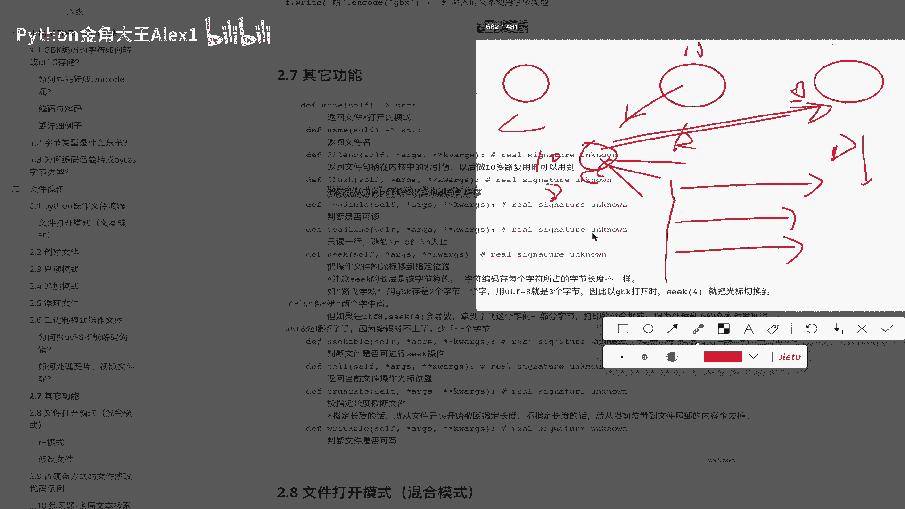

flash的语法就是说把内存里的，就是缓存里的这个八缓存叫八分，叫八分，缓存里的这个数据强制刷新到硬盘上，明白意思吗，强制刷新在硬盘上，我可以给大家演示一下这个效果好吗，我可以给大家演示一下效果啊。

那怎么演示呢，我们在这里这样吧，我在这里为了看实时效果，我在这里在这里给大家演示啊，我在这里看，我在我这个类似的目录下啊，你不要看我这个learning spin啊，我在这里啊进入一个python3。

然后呢，我在这里f open一个，呃file flash好吗，我们创建一个这样的一个文件啊，然后我们来去演示这个，看看flash出来了吗，哎出来了一个flash这个文件是吧，他现在是空的，对不对。

现在是空的，我们在这里呢往里边写一条数据，就说WR，嗯LAN1看到没有，写了一个line1，然后再写一个line2，注意了，这里面什么也没有啊，什么也没有，还有同学说你是不是没刷新呀，嗯不是没刷新。

那就刷，我把它关掉再打开，你看看是不是也没有，这个时候数据并没有写到硬盘上，他现在还在内存里呢，也就是说如果我现在突然间断电了，不好意思，这里面就没了啊，这里面就没了，那所以这个时候你你的数据重要。

你想强制给他刷到硬盘上怎么办，F点flash啊，直接flash执行一跳，哎你说怎么还没有，还没有啊，你关一下就有了啊，他只是没有在这个里面刷新出来，其实已经有了，大家看是不是已经有了对吧。

是不是已经有了，那这个时候你继续写啊，你继续写F3LN3LN四啊对吧，那这个时候你会发现依然是没有的，你把它关掉啊，你在打开它依然没有了，你从你，你说你是不是通过PYTHM打开也不行啊。

你通过别的打开也不行，我把它在文件上显示，然后打开嗯，不知道用什么打开，用这个用这个用这个这个吧，把down打开，大家看也只是有两行，所以这个文件硬盘上它只是存了两行数据，那这个时候我注意了。

我的突然断电就都没了，有同学说那没问题，那你直接CTRLC退出退出，你这个交互器它是不是也没了，你还没保存呢，不会你退出交互器的时候，他也会给他存下来，它会自动的相当于自动给你存一下flash一下啊。

那所以呢怎么讲，只有断电它会丢啊，我在这里flash一下它就又有了啊，这个这里没有办法点刷新呀，总之你再关再打开是不是就有了哎，这个就是flash的一个作用，所以这一小节我们给大家讲了三个方法。

seek对不对啊，Tae，还有flash好。

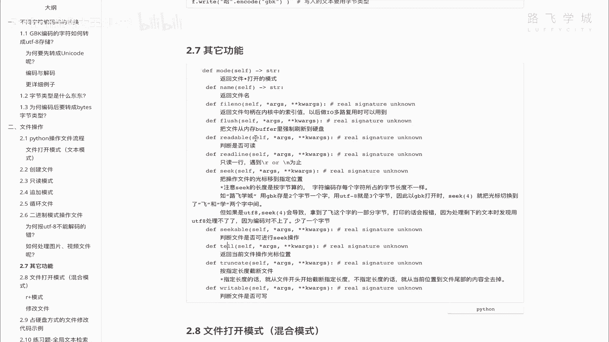

这三个你知道就可以了，自己来试一下。