# 【2024年Python】8小时学会Excel数据分析、挖掘、清洗、可视化从入门到项目实战（完整版）学会可做项目 - P4：03 5分钟装好Python解释器 - Python金角大王Alex1 - BV1gE421V7HF

好同学们，那接下来这一节，我们把这个Python的这个啊编程环境给它装上之后，那咱们就可以正式在下一小节，写这个Python的代码了对吧，那这个咱们现在问大家一个问题啊，说为何要装这个Python环境。

为何要装Python环境啊，大家想一想啊，你这个手机上要聊微信，你是不是要装一个微信的app，要刷淘宝，就要装一个淘宝的app，是不是啊，那我是不是可以理解为我要现在写Python代码。

你要装一个Python的app呢，大概是这么个意思，大概是这个意思啊，那我们来看一下这张图，虽然我们还没有写代码，但是这张图里面呢啊你这个放大一点看啊，其实呢这就是真正的Python的代码啊。

这个Python代码对吧，这个Python代码呢你现在不明不理解啊，不明白啊，是什么意思，没有关系，你就知道这就是Python代码，但里边大概你能看出来说什么count什么，while当else。

否则是吧，还有等于号小于号对吧，还有中文诶，这个呢都是我们人类能看懂的代码OK吗，人类能看懂的代码，但是这也是你接下来会写的这个代码对吧，但是你人类能看懂的代码的，我告诉你机器是看不懂的。

机器能理解的代码就叫010101，我们官方给它称为二进制，二进制好吧，那二进制后面细节我们会讲，因为这个计算机啊，它就是靠电流来这个什么的来运作的，同学们，这个电注意了啊，这个电它是你。

你要想通过电流来表达这种人类的这个东西，直接表达表达不了电，只有高电压，低电压，OK吧，你就理解为就是有电没电对吧，高电压低电压，高电压低电压就两个状态，一个是零，一个是一，所以呢计算机啊。

就就为了计算机专门发明了这种二进制，就是01010101的组合起来，就可以表达组合的排列，组合排列组合就可以表达这些文字啊，具具体细节的表达就是他们怎么转成文字的，咱们以后再讲啊。

你要知道计算机只理解这个，人类只理解这个，所以呢你写的这个代码要想让计算机理解，你中间必须要有一个翻译官OK吗，这个翻译官就叫Python的解释器，我们也理解为叫Python的编程环境，OK吧。

编程环境啊，Python解释器是吧，就像你现在是中国人，你要跟这个美国人说话，你不会英语的话，你中间要找一个翻译，这个Python的解释器就是发挥这个作用的，这个是Python的logo ok吗。

所以呢我们要装的Python环境就叫Python的解释器啊，记错没记着没错啊，你把人类能读懂的源码告诉解释器，解释器把它翻译成机器码，然后呢这个机器返回的结果再告诉解释器。

解释器再把它翻译成人类能看懂的代码，这就是你的执行结果，OK吧好这就是为什么要装Python环境，理解了吧，理解完了之后，我们接下来要来就开始装了好吧，那接下来开始装，那你装的话呢注意了。

你的电脑无非就是windows系统或者是Mac对吧啊，这个有钱的啊，大家用Mac对不对，穷的啊，用windows，那还是大多数人应该是用windows的啊，用windows装的话呢，怎么装。

我告诉你其实很简单啊，我这就不走一个过程了，因为我是Mac电脑啊，我是有钱人哈哈，所以呢这个但是这网上到处有文档啊，你随便搜一下windows装Python环境，我就随便搜了一个，装的很简单。

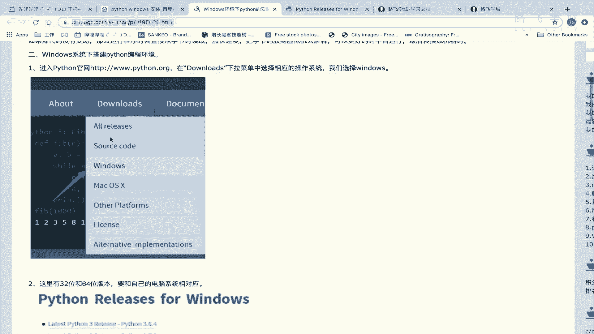

你首先呢去到官网上OK吗，到这个官网啊，Python官网对吧，PYTHORG这个地方，然后找这个download download，他有选择，看到没有windows Mac os。

你们就选这两种就行就行了，如果你是LINUX系统啊，LINUX是用户的话啊，这个我就不用交给你了，你肯定也会装，就是选这个LINUX。

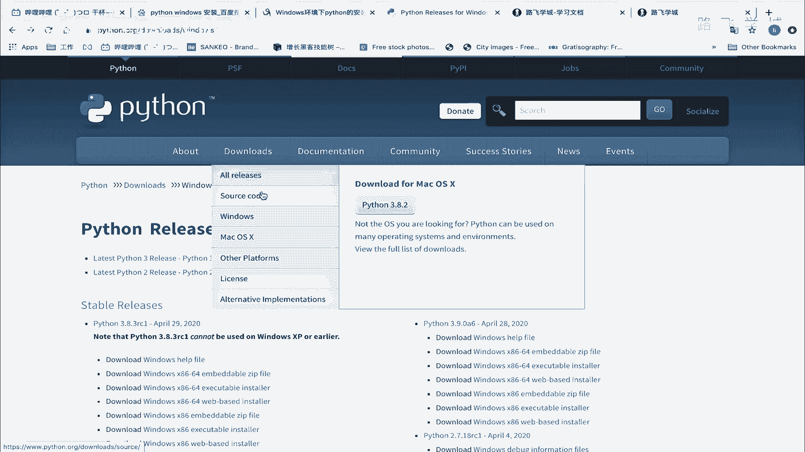

那你是windows，你就点进去，然后在这里看，这就是所有的Python release for windows，就所有的这个啊，这个已经开放的版本，它有两个版本，一个是python2。

一个python3，注意了，大家既然你是小白，就不要再管python2了，python2已经官方不再更新了，就跟windows xp一样，已经成为历史了，踢进历史的垃圾堆了。

OK我们现在学的就是python3，Python最新的版本是python3。8，但是没关系啊，基本上python3你是3。5也好，3。6也好，3。8也好都行。

反正你电脑上只要有python3的版本就OK了，那你就选这个python3，然后干嘛呢，往下拉往下拉往下拉，看到没有，点过来，往下拉，不要看上面这些英文是吧，看这个files里面就是下载安装，注意了。

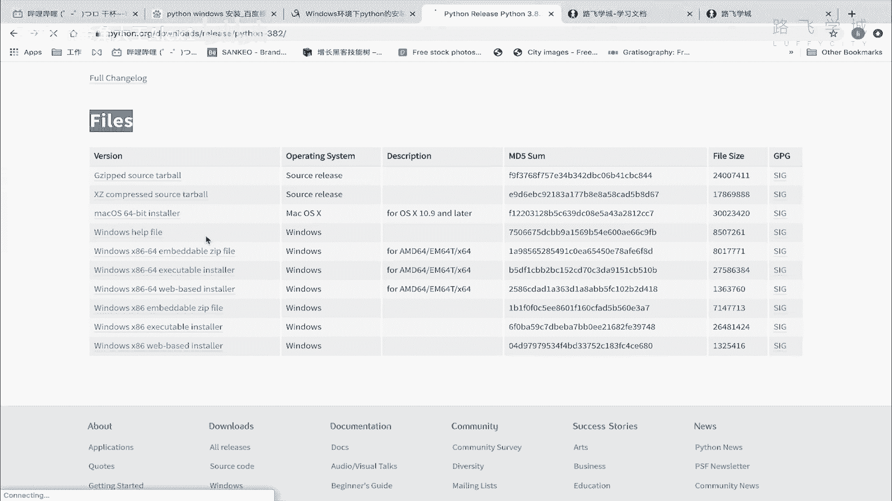

你在下载安装的时候，你选哪个OK吗，你选哪个，大家注意了啊，首先我我直接告诉你吧啊别别弄错了，你可以选这个选这个或者是选这个，其他都不用管OK吗，其他都不用管，那这三种我告诉你啊，这三种这个是啊。

这in in bed in bed就是已经把里边就嵌入好了，这个不解释啊，你就可以直接解压这个啊，解压这个装也行啊，这个它是一个zip包，需要解压的，这个呢是一个直接可执行文件，下载下来也行啊，注意了。

一定要选X86杠64，不要选下面的X86，X86是32位的机器啊，32位机器只能吃4G的内存，现在的电脑你们都应该是有，都是都是那个8G16G的了，所以呢你要想让你的程序运行的程序能能跑。

能吃掉对最多8G的内存，16G的内存你就要差八个64啊，具体原因，这是硬件原理，我们在这不解释，大家就装啊，这个这两个就可以了，然后下面这个叫web安装，它只是一个，它相当于就是下载一个非常小的文件。

然后呢安装的时候通过网络安装，大家不用选这个，就选上面这两个，一般你就选这两个。

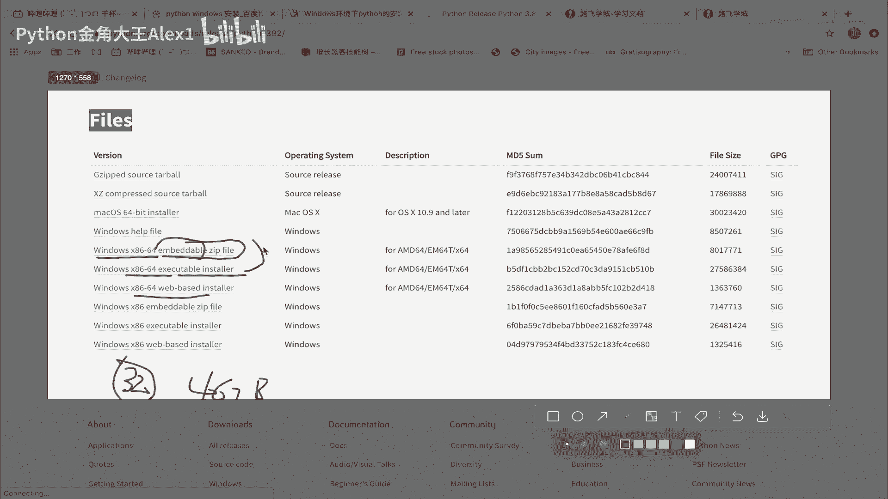

选哪个都可以啊，基本上333十来兆，OK吧，你下载下来了之后。

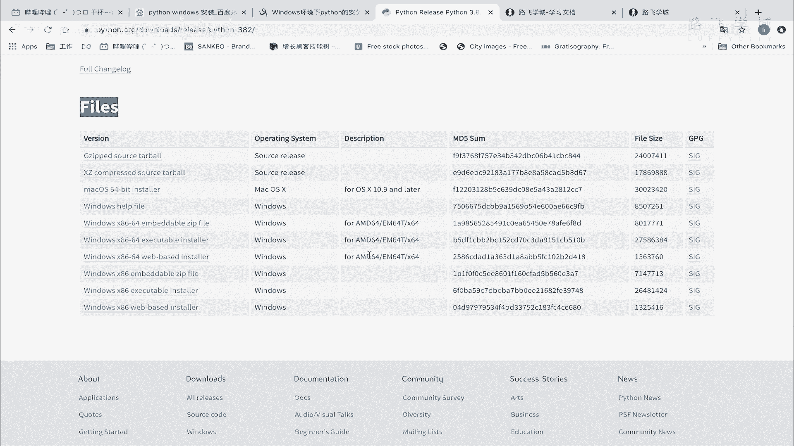

双击执行就会到这个地方啊，到这个地方到这个地方它会弹出来，弹出来一个叫install now，还有一个叫自定义customize，自定义你就选这个就行了，选这个，然后注意了。

再点下一步之前一定要选中这两个，上面这个不重要，上面就是说所有用户都可以用这个Python，下面这个一定要选中windows用户，特别是小白啊，你这个选不中，我跟你讲，后面你配置很麻烦。

这个就是把Python装到加到环境变量里，什么意思呢，就是说啊怎么讲啊，就是你相当于你只要点开这个，你在你操作系统的任何一个目录下啊，调用Python都可以找得到吗，也就是说你告诉你操作系统。

我把Python装到哪了，然后以后任何一个地方都可以找到这个Python，直接一条命令就行了，但你不选这个的话，你必须要到这个安装到你安装到哪个目录，比如说你安装到这个目录，你要想调用Python。

你必须跑到这个目录下再调用Python，能理解吗，OK了啊，这个就是说把Python加到系统环境变量，那也就是啊什么意思，在在各个地，在操作系统的每一个角落都可以找到Python好吗。

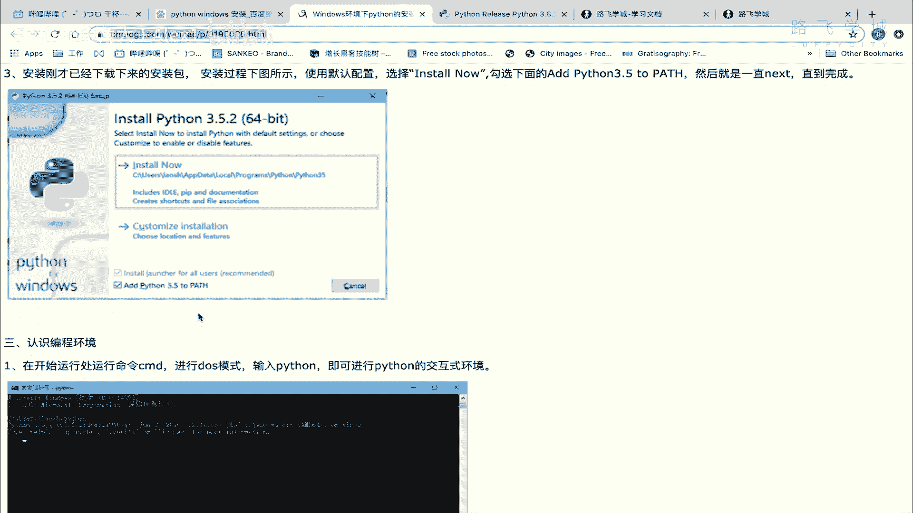

然后你装完了就直接下一步就行了，装完了之后注意了，你测试一下有没有装成功。

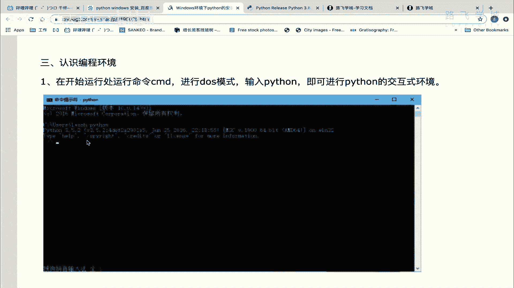

很简单，直接直接干嘛呢，输入开始就点击你那个开始啊。

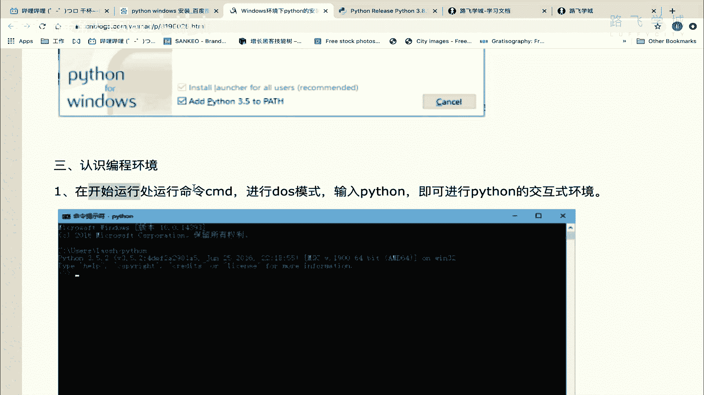

点击你那个开始，然后进入一个DOS模式，就是windows上有一个命令行。

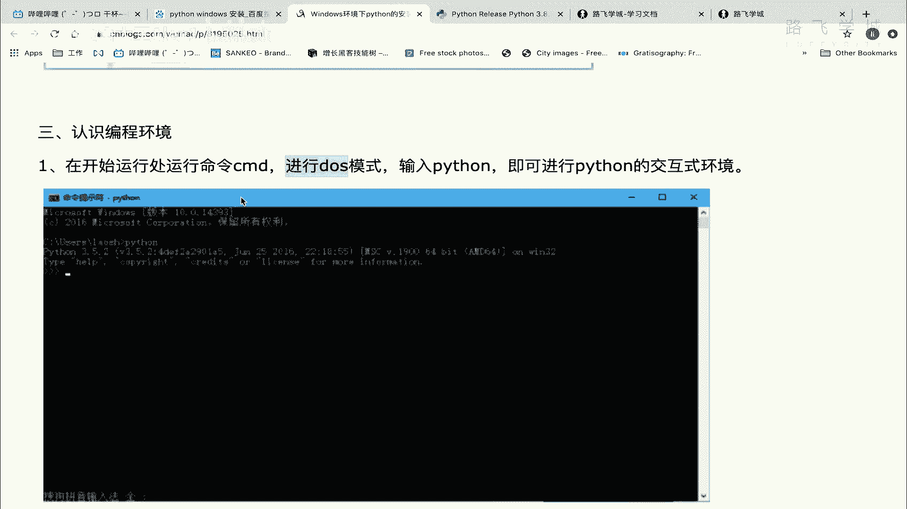

然后输入Python啊，首先在你开始的，在你这个电脑的这个左下角。

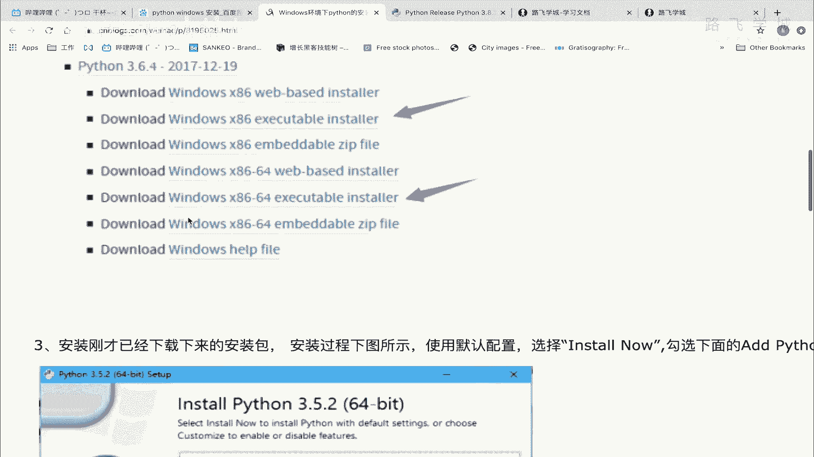

会有一个开始按钮吧是吧，我看看这里有没有找不到。

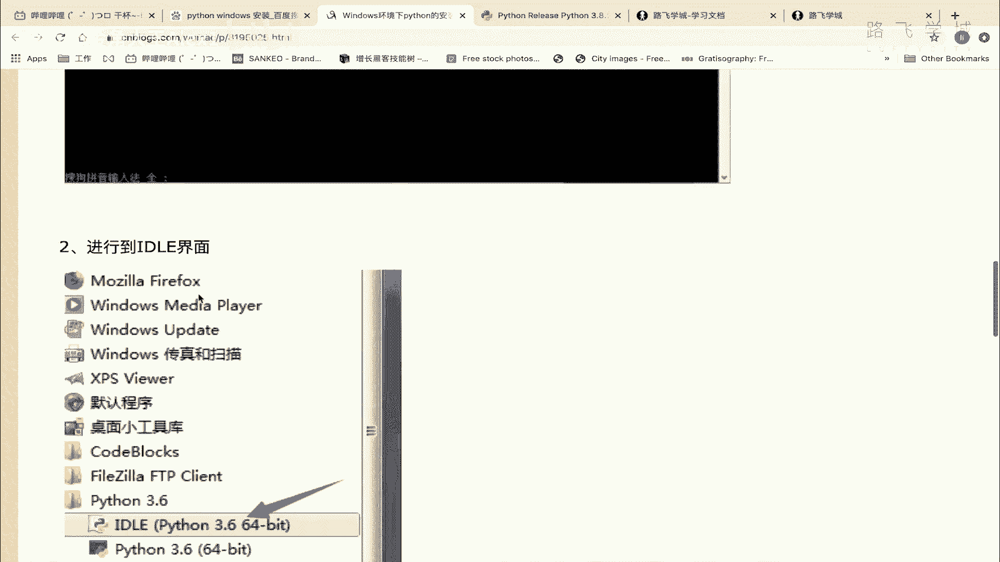

找到一个开始按钮，然后输入CMD啊，说MCD1回车就进入这个黑框了。

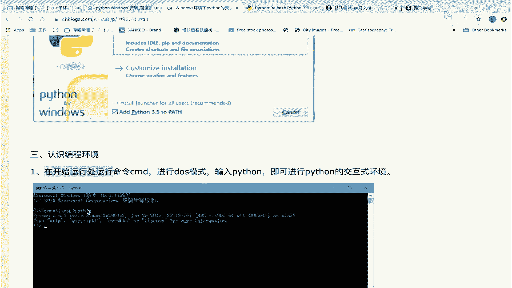

然后在这里面一输入Python，看到没有像他一样输入Python，然后没有报错，进入了一个这样的一个是吧，三个尖括号的，这就进入Python的交互模式了，交互交互式环境。

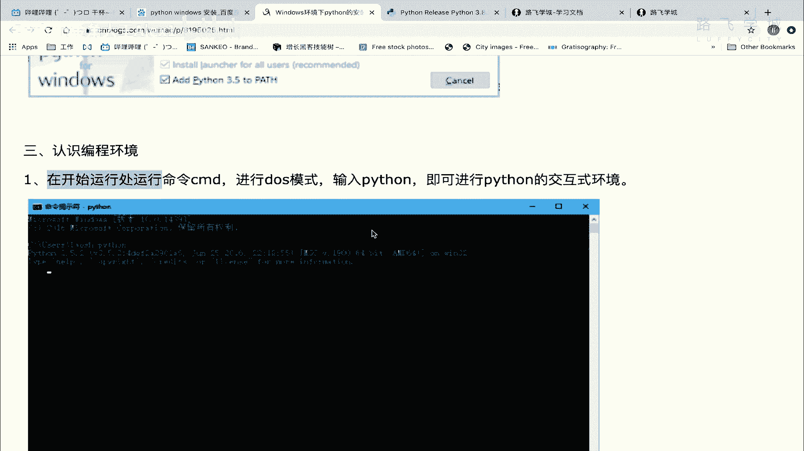

你在这里其实就可以写Python代码了啊，就没问题，你就把这个窗关了就行了。

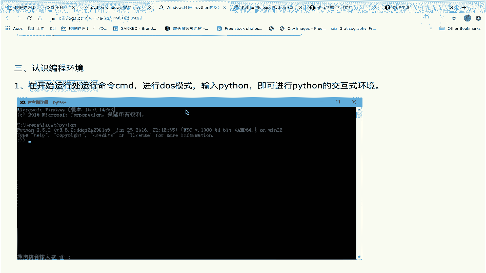

就代表你Python安装成功了啊，然后呢同时你还可以到这个开始的界面，开始的这个界面搜python1搜Python，直接选这个IIDOLIDLE是吧，他也会打开一个，就像这样的对吧，你在这里也可以写啊。

在这里可以写，这都代表安装成功了，OK吧这里安装成功了啊，好这个它下面是演示怎么写Python代码。

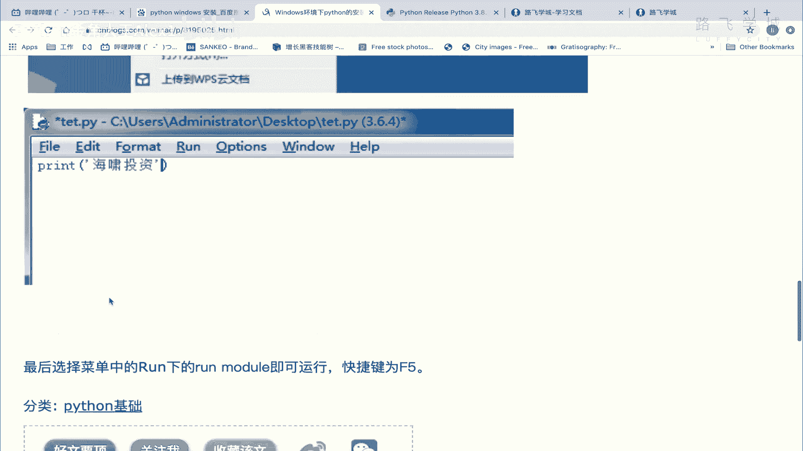

那就先先不用管了，安装成功就OK了，这是在Python下。

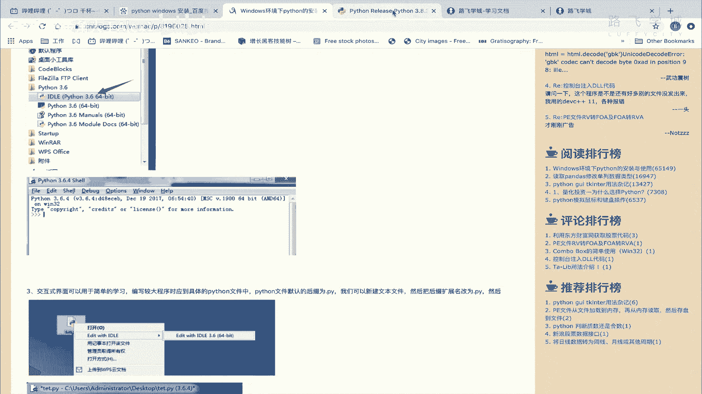

如果是在windows，在Mac下安装就超级简单啊，在Mac下安装的话，我告诉你就啊这是你我这里有一个文档，或者会给你们，如果你这里没选的话。

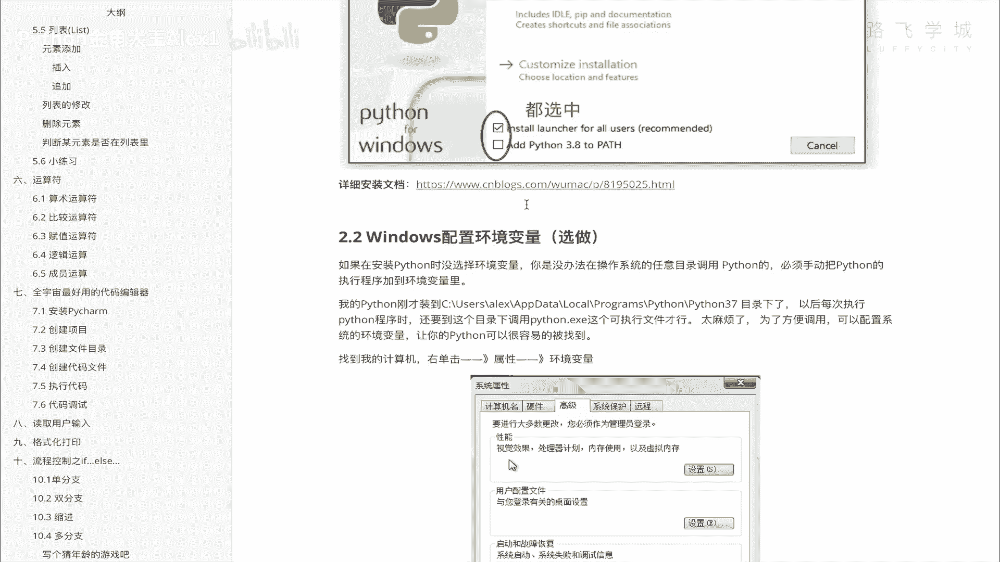

你就得自己手动配置环境变量还挺复杂的啊，小白容易出错啊。

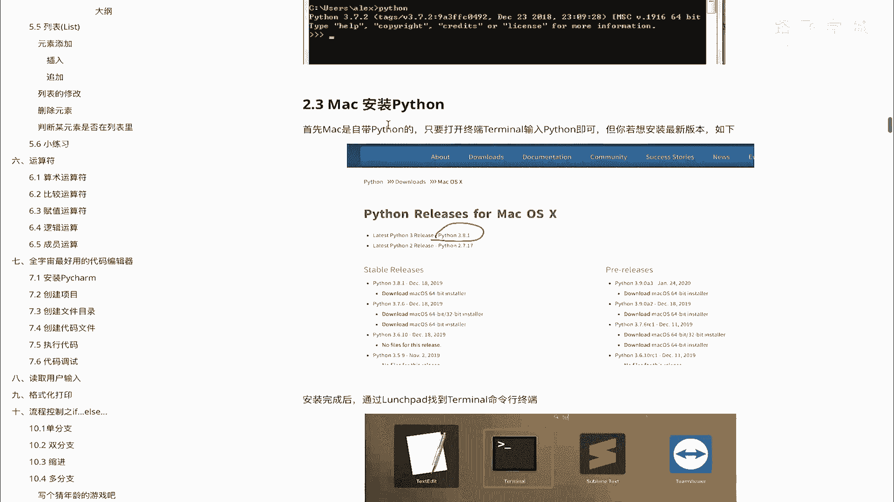

那在Mac下安装的话啊，也是对吧，直接你装好了就直接双击就行了，连什么也不用填，双击完了之后，如果安装成功了，你就这样啊。

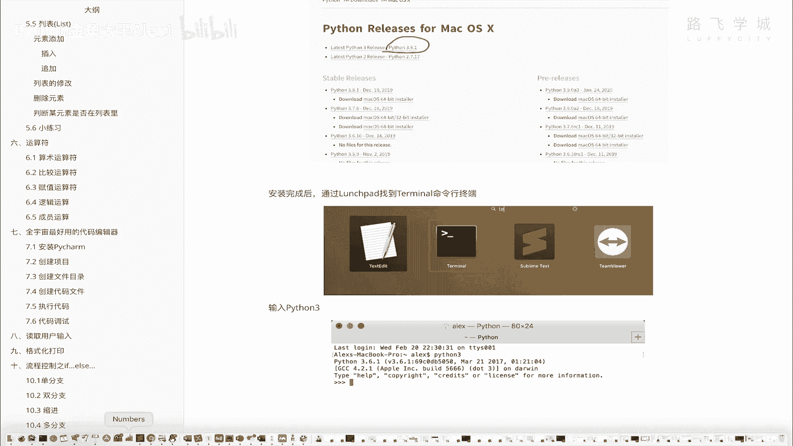

我告诉你，你就你就在那个什么看着，在你这个在你这个这个这个地方看到没有。

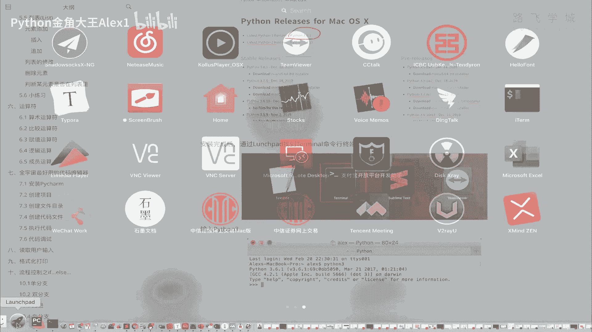

选中这个launchpad，然后搜输入一个T开头的，看到没有，大写的T开头，你不出意外的话，就会出现一个terminal，看到没有，哎。

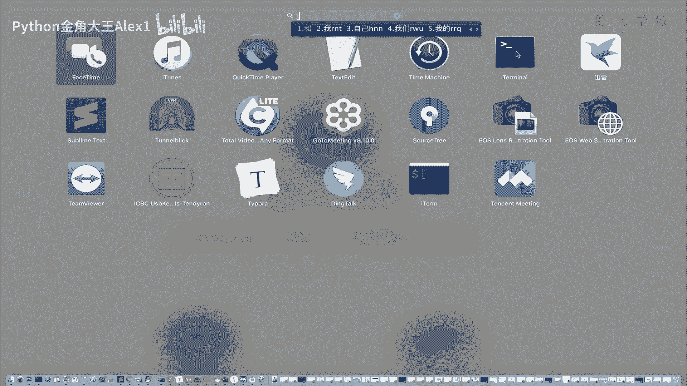

这个terminal就像windows下的那个啊，刚才那个黑框似的，你一点看到没，他这个是个白框，没关系啊，你在这里输入一个Python，注意了，你装的是python3OK吗。

你装的是python3那个Mac电脑啊，Mac电脑它自带也，它自己会自带一个Python，你像我的电脑他好几年了啊，它自带的Python是2。7的，你看到没有，大家如果是2020年买的呃，Mac的话。

他可能我不确定啊，因为我没钱买新的电脑，你装的你的显示可能已经是python3了，你是不是Python，它可能显示这里已经是Python了，但不知道你自己是，但是如果你是前几，总之你现在装的这个电脑。

你输入一个要输入一个什么呀，输入一个Python，看打一个tab键，这里面输入一个python3，注意了，你输入一个python3，我这个是数据，python3是进入了我最新安装的python3。

6K吧，Python3。6，反正你这样就算进去了，安装成功了啊，无论在windows上还是Mac上，你输入一个ex i t，输入括号，一回车就退出了这个Python的环境。

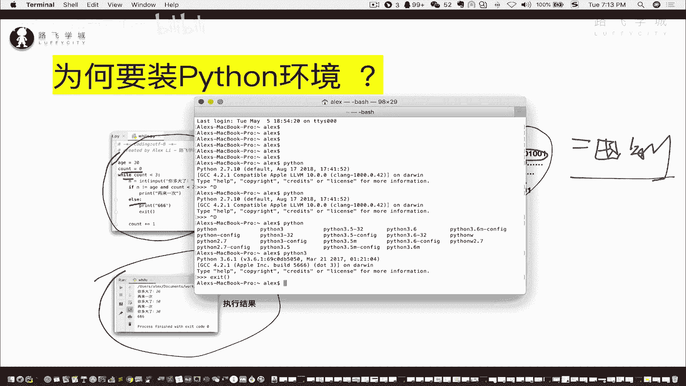

反正总之这就代表已经装好了，能理解吗，就代表装好了，OK装好了之后啊，我看一下啊，还有什么呀，啊没了封信已经安装成功，下一节我们就在装好的这个Python环境里面，可以尽情的写我们的代码了啊。

Python解释器这一步搞定，下一节开始写代码，OK自己试一下啊，大家啊，有有很多同学在这个装的时候容易出错啊，这个这个这个不要慌啊，都是小场面啊。

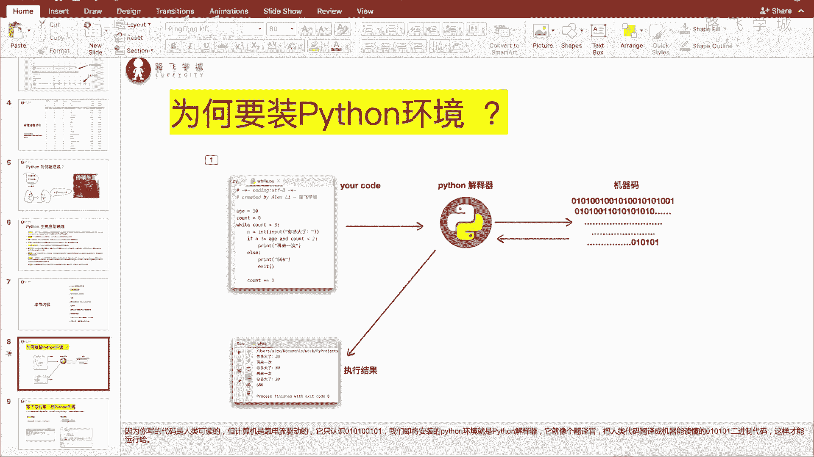