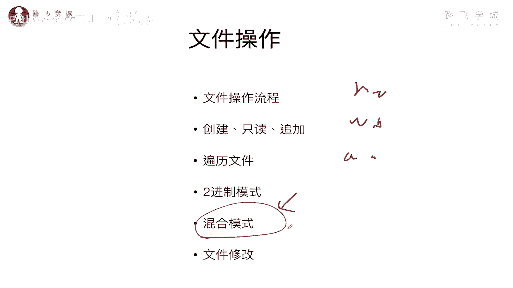
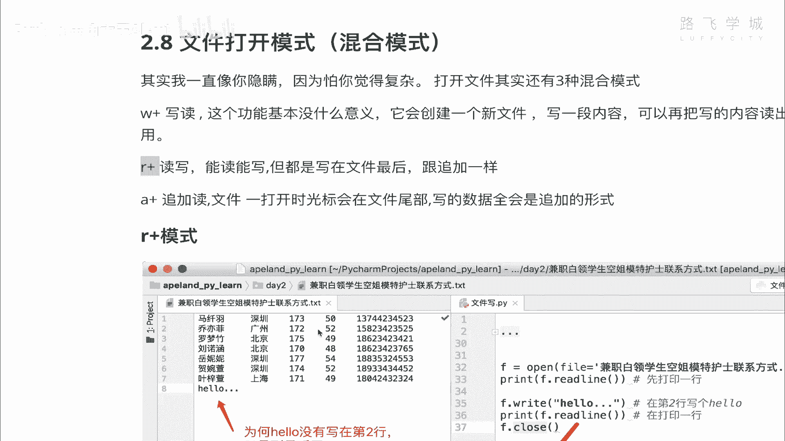
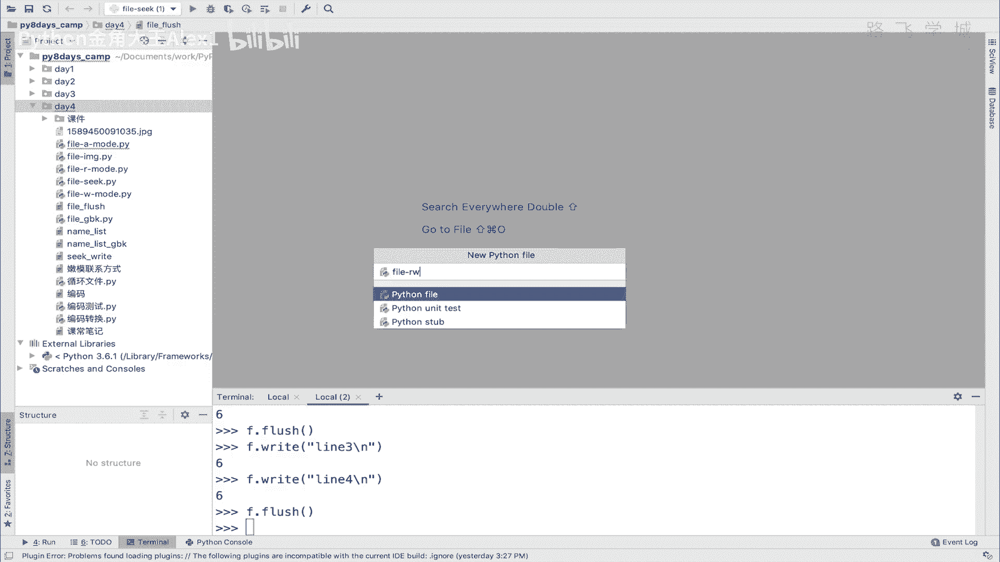
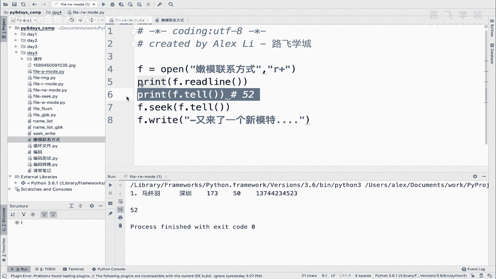
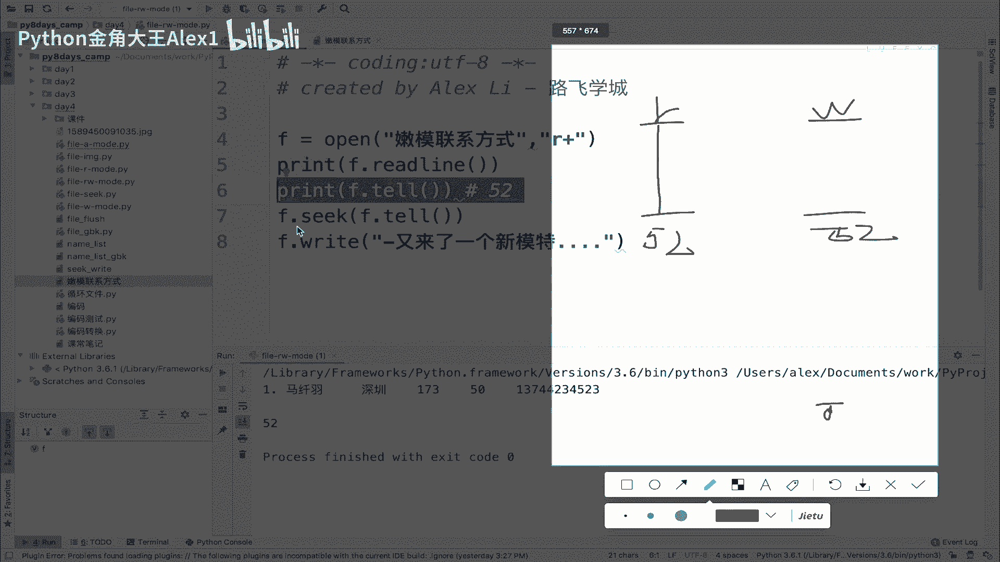

# 【2024年Python】8小时学会Excel数据分析、挖掘、清洗、可视化从入门到项目实战（完整版）学会可做项目 - P50：09 混合模式操作文件 - Python金角大王Alex1 - BV1gE421V7HF

OK同学们，这节课呢我们用混合的模式来操作文件，什么叫混合模式啊，很简单，之前咱们这个打开文件的时候，但讲过了Python，就是要不然是R，要不然是W，要不然是A对吧，当然也学了二进制的模式。

但二进制模式也是对吧，RB或者是WB或者是ab，但是就是要么只读，要么只写，要么指那个什么诶，那这个东西就是别人觉得哇很别扭啊对吧，我只能读只能写，我就我现在就是想打开一个文件，又能读又能写。

可不可以呀，哎对那样混合模式就是做这个事的啊，打开一个文件既能读又能写啊，但是这个模这个这种混合模式却用的并不多啊，用的并不多，所以呢我们不做重点去讲，但是我还是给大家过一下啊。

因为你说怎么用的不多呢，word里面对吧，不都是这个又又又能写。

又能什么吗啊又能读吗，那是在用鼠标点点点，但是你用这个代码来去操作文件的话，其实用单模式还比较多，你又能写又能读啊，反而有的时候会容易出错啊，会容易出错，Anyway，我还是给大家过一下这个过一下这个。

那这个混合模式呢其实很简单，就是什么呢，比如说啊这里是其实在后面跟加号就行了，比如说W加就是写读模式，什么意思呢，就是应该叫创建读模式，就是它以创建的模式，就是默认还是以。

不是它还是以那个W模式去创建一个文件，但是呢加上就是支持了这个读的功能啊，w java就支持了读的功能，所以呢你创建了一个文件，然后你往里面写一堆东西，然后你还可以把它读出来，这就是这个功能。

但其实这个没有什么没多大意义，因为你一般大多数情况下，我们写程序，你创建了一个文件，写进去了之后，你就把它关闭了，你不会再把它读出来啊，就是很少场景才会用到啊，很少场景，所以这个不怎么用，没啥用啊。

这个其实还是有点用的，这个叫R加，而且是说打开一个文件，然后呢支持读的，支持写的功能啊，支持写的功能，所以就说你打开一个文件之后对吧，你要想修改它，你就可以直接修改，可以直接往里面再写东西。

right对吧，然后可以跳到某个位置，他就写改，这都可以，所以这个其实还是有点用的啊，有点用的，A加呢，这是什么，这是呃就是他以追加的模式打开，追加会加到文件尾部，然后这个时候你要是还它还支持读对吧。

就是你可以追加到文件尾部，然后呢你还可以读内容对吧，比如说我我我我读出来，跳到第一行去读内容也是可以的，明白这意思吧，所以这里三个里面其实最有用的也就是这个啊，我就重点给大家演示一下这个好不好啊。

R加的一个模式啊。

你不用看我的课件，你就跟着我来就行了啊，跟着我来啊，啊呸创建一个咱们就叫file rw，对R加R加就是RW的一个模式。

然后呃这个我呢去干嘛，先打开一个文件，然后我们去去去在里面写东西好不好啊，打开文件在里面写东西啊，那我们呃打开哪个呢，对咱们就打开这个嫩模联系方式好不好，打开这个嫩模联系方式，那我们就直接呃，耶耶耶耶。

Sorry sorry sorry，放到这，然后模式改成R加啊，就是相当于读写模式，然后呢这个时候同志们啊，同志们，你是可以直接读的，你是可以直接读的。

你print f read read line是没有问题的，大家看是不是把第一行打印出来了，那你这个时候我哎有同学说我读了一行之后，我要去在这个在这一行基本上再去写东西，可不可以呢，可以你先打。

你先看一下自己的位置，你自己的位置现在是在哪呢，读完一行之后，读完银行之后，在52，然后在这个52的地方去写F点，直接write啊，直接write white啊，这是啊就又来了一个新模特，好不好，哎。

写在这里，然后呢我们来看一下这个啊，效果看一下效果可以吧，看一下效果，这个时候咱们打印啊，执行看一下，那么联系方式诶，大家却发现了一个问题，说哎首先看写了没写啊，写了没写，是不是写了是吧。

那但是怎么会加到文件尾部了呢，对吧，我明明是这个什么呀，我明明是说刚才打印的是在52这个位置上，我也想从这个位置上往后写，但是怎么到了文件尾部了呢，嗯这是怎么回事呢，难道说这样，咱们来看一下。

你看我现在做了一个tell tale，现在是它打印当前位置对吧，当前位置在52，然后那按说正常的话，应该从这个基础上开始写呀对吧，为什么没有呢，那这样是不是我需要再让我执行一下seek呢，我不确定哦。

咱们来试一下，我就执行一下这个SC好吧，执行一下F点tail就是seek对吧，把这个F点tail就拿到这个位置，然后再seek一下，再跳到这个位置，明确的把光标让它跳到这个位置，虽然咱们看到的说。

我们认为他打印这个位置已经在52了，那就代表光标已经在52了，但是很显然你写的时候，他是从后面开始写的，不知道为什么，那我们就把光标明确的跳到52，咱们来试一下，会不会啊，能改变这个情况。

咱们来再加一个加一个这个区别跟上一次写好，这个时候我们再来看啊啊同志们发现一个问题，你看如果是这样的话，你是不是就写成功了，就就写成功了，对不对，就写成功了啊，那好这样我们就通过这个测试。

我们就区分就知道为什么了，你虽然在这里F点tail啊，它显示52，也就是说它显示你这个啊。

你你或者你可以这样理解，你可以这样理解，就相当于这是你的R的一条光标，是你的写的一条光标，现在也就是说你进行tail，它只是把R的这层光标，你R的这层光标在这在52，也就是说它只是把这个R的这个光标。

Sorry，他只是把R的这个光标给你返回了，你的tale是返回R的光标，但是你的W这个光标呢其实还在干嘛呢，它既然我们看到他这个啊最终的一个展示效果，就是你你没有seek之前。

他展示他的这个实现效果是写在文件尾部的，所以他这个R的光标是直接在文件末尾了，所以呢你要你要明确干嘛，这注意了，这两条光标是互不影响的，一个是R，一个是W，你理解为它是有两个光标好吧。

那这个时候啊这个时候你要想让你的这个文件，那就是你写的内容从52开始的话，你你得怎么办，你得让你的W光标回到这个52，明白吗，所以你要明确的seek一下啊，seek一下。

seek到52这个位置上啊，才能去往里面写明白这意思吧，哎所以这是啊这个一个一个一个小点啊，你需要注意一下，必须要就是跳到就是通过seek命令，跳到那个指指定的位置再去写好吧，要不然他就会写到最后面。

OK那我们写到这了之后，咱们啊就其实就完成了这种混合模式对吧，他也不报错，你看又能读啊，又能去写，是不是啊，又能读又能写A就是那个A加呀，和W加其实是一样的，就是又能W加，就是又能写又能读是吧。

A加就是啊又能追加，往后又能读内容啊，就是这样，但是那两个都不用，你就学会这一种啊就可以了，学会这一种模式就可以了，好那你们自己来把这个试一下啊，或者那两种模式，你探索这个自己啊。

这个这个探索一下也可以啊。

