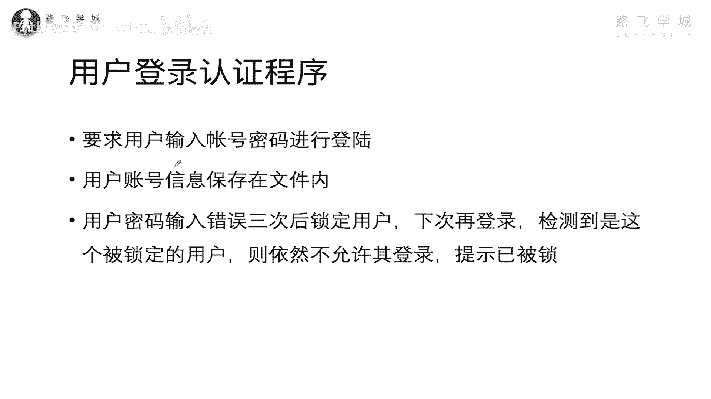
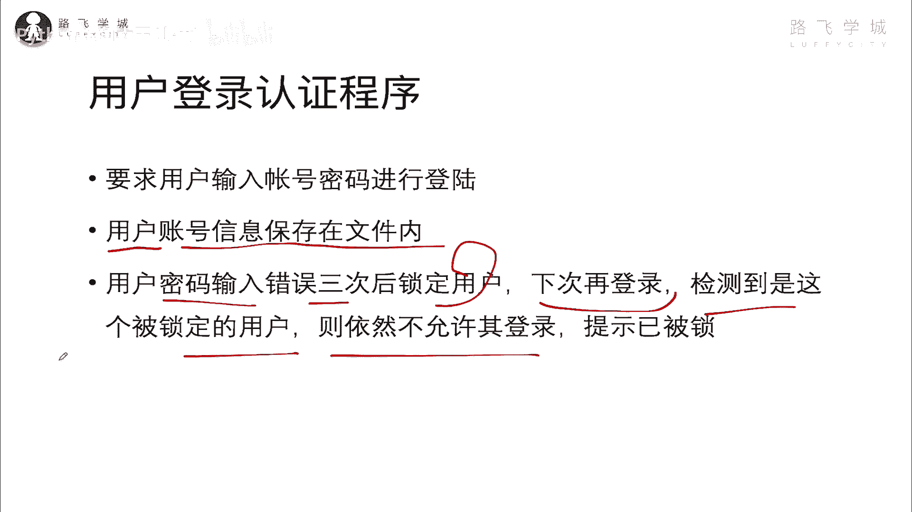
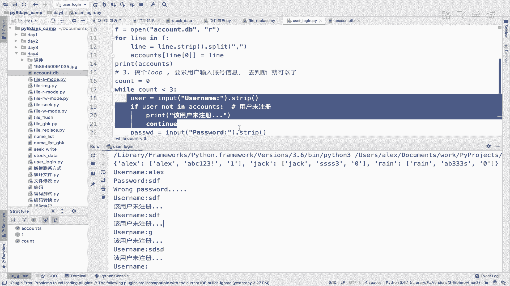
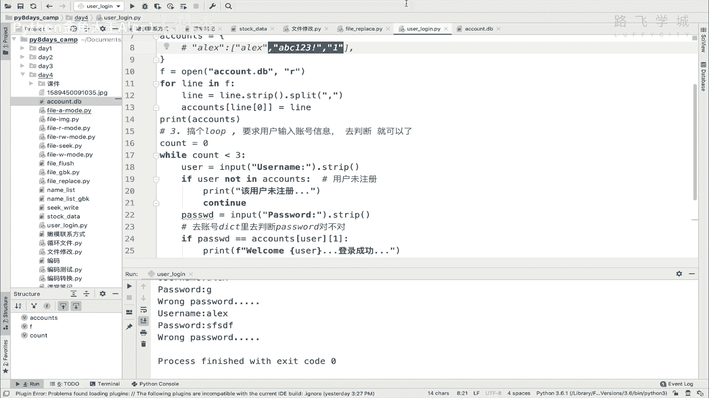

# 【2024年Python】8小时学会Excel数据分析、挖掘、清洗、可视化从入门到项目实战（完整版）学会可做项目 - P53：12 用户登录认证程序 - Python金角大王Alex1 - BV1gE421V7HF

OK同学们，这一小节咱们做一个复杂点的啊，这个文件操作练习题。

写一个用户登登录的认证程序，需求是这样的对吧，就是大家都用网站做过登录，要求你输入用户名密码对吧。

那输入密码呢，那人家你这个账户信息，肯定在人家网站后台的数据库里对吧。

咱们现在没学数据库，咱们就先存到文件里，所以呢我的用户账户信息存到文件里啊，那用户密码输入三次的话，给他锁定这个用户，那因为你有的比如说你你用支付宝或者什么的，你的密码输入输的次数多了。

人家就给你锁定了，对不对，下次再登录呢也会检测到，如果这个账户被锁了，那依然不能允许不能登录，所以这个锁定的这个状态对吧，就是你给他锁了之后，锁定的状态肯定也要存到文件里，因为你这个程序退出了。

下次再启动是吧，下次再其中，他依然可以知道他这个锁定状态的话，那肯定就是这个状态存到文件里了，对不对，存文件里就是这么一个情况啊，输错三次锁用户，那下次登录继续锁，那就是这么一个需求。

OK那大家可以想个20分钟啊，怎么实现，我在这里等大家20分钟，好了20分钟到了，你如果实在想不出来，那我就带着大家来给给大家，带着大家实现一下，看一下我的这个思路啊，怎么去做好吧，咱们呢呃这个什么呀。

这个这个这个这个在这里创建一个新的文件。

Sorry，就叫啊login程序吧，好吧，user log in程序，然后咱们就就来想一想这个思路，首先第一个呢你要干一些什么事，你你你你既然账户信息要存到文件里是吧，所以呢第一步要确定这个什么呀。

确定在文件里的存放啊，确定在文件里存储的这个结构，对不对，存储的啊，账户信息，账号信息的结构对吧，OK呃咱们存成什么样子的呢，存什么样子呢，这样咱们要有一个单独创建一个文件，就是存这个账户信息的。

这叫account吧，点dB吧对吧，account点dB database，然后这个结构什么样子呢，注意了，有用户名，有密码对吧，那是不是还应该有一个锁定的状态啊，锁定的状态。

比如说这个账户有没有被锁定，因为我要检测的对吧，所以至少有三个信息，用户名密码啊，锁定状态，当然你还可以加上什么创建日期呀，注册日期呀，或者类似这种那个都不重要，咱们直接用户名，比如说是啊。

咱就写几个ALEX是吧，后面是密码，咱就用逗号来分割，你要读的话，读到内存，你要切分嘛对吧，然后密码就是对吧，这个ABC123是吧，或者这样，然后后面就是你的这个锁定状态，咱们可以这样。

你两个值一个是零，一个是一对吧，如果是零就是没锁定，如果是一就是给他锁了，可以吗啊哎这就是一行可不可以啊，然后接下来jack啊，这个这是他的密码，然后他是没锁定的好吧，接下来还有这个rain是吧。

然后它的密码这ab在这，然后他的状态也是没锁定好吗，但是你可以无限往下斜，形成这种结构可不可以啊，大家来看，我觉得是可以的，那我觉得可以，因为它有很多种结构啊，你可以随意去设计。

只要能符合你这个程序需求就行，我这种结构就说我觉得很简洁啊对吧，读出来用户就读，读到内存里之后，我通过逗号1000分就拿到了用户名，拿到了密码，拿到他的状态，我接下来去判断就可以了呗，对不对啊。

加载到内存里啊，进行判断，这个将内存可以给它转成列表啊，或者是字典啊，那样调用也很方便是吧，所以呢确定了结构之后，接下来啊，接下来第二步你就知道要怎么去啊，怎么去取了，怎么去取了好吧，有个快递我接一下。

好今天520，不知道谁给我送了一些什么这个表白礼物，Anyway，那咱们第一步确定完了，知道怎么存呢，接下来第二步就是说，把这个把这个数据读到内存里，对不对啊，是把数据读到内存啊。

把账户信息账户数据是吧，账号数据啊，读到内存是吧，可以给它改成为了为了方便，为了方便调用，对不对，方便调用，可以改成这个什么呀啊列表或者是什么结构，咱们可以直接设计一下，他这个改成什么结构。

我觉得我个人的建议你当然可以直接改成对吧，一个大的列表，然后里面每一个每一个值啊，就是一个小元素，但是我就是大的列表，然后里面一行就是一个小列表啊，就这样小列表再给它分割嘛，这种这种行不行呢，其实也行。

但是呃我觉得可能会带来一些问题，大家看啊，当然这里面还要再做一次分割，再分成几个小元素，我就不分了啊，假如说啊假如说是改成对吧，类似这种大列表欠小列表这种模式行不行，那行，但是如果你你你你要判断。

这个就是用户输入的一个用户名，比如说ALEX你是不是要判断在不在里面，如果判断在不在里面，努力循环对吧，假如说里面有1万个这个账户信息，你就循环1万遍对吧，假如ALEX正好在最后一格的话。

你得循环1万遍，明白这意思吗，所以呢这种列表是可以，但是查找起来不方便，所以最好还是什么方式啊，字典对不对啊，Counts，比如说啊可以给它存成一个字典的格式，然后用户名就是对吧。

你从这个啊这里面拿出来，拿到第一个值，就当这个K嘛对吧，这就是然后最后对应着可以把这个值copy过来，是不是啊啊这个对不对，在这里对应一个列表嘛，然后，对我觉得这种形式呢可能会比较啊，比较好查一些。

就查起来比较容易，你说是不是啊，哎查起来比较容易好，那这样的话我就确定了啊，这个在内存里的这种结构，然后接下来你就可以去干嘛呢，要求用户输入，对不对，第三步了，就是搞一个循环，搞个loop对吧。

要求用户输入是吧，信账号信息，然后呢就去啊去判断就可以了是吧啊，判断就可以了啊，对不对，唉走到第三步，这个我们嗯这个这个这个能做完之后，那就是说白了你判断如果是不对对吧，反正你要计数嘛。

一共执行了几次对吧，如果不对，如果三次都不对，那你就退出循环，然后把这个用户给它锁定就可以了，锁定啊，怎么锁定，咱们到那一步咱们再说，因为你肯定要锁完之后再存会文件嘛。

咱们这个这个这个这个这个一会儿再说，咱们先把这三步搞定好不好，三步搞定啊，那接下来呢咱们就第一步已经确定啊，已经做完了，接下来第二步对吧，第二步就是生成一个，这是一个字典。

我现在在这里先搞成一个空字典好吧，给它注释掉，接下来我要是不是要先把文件给它读进来啊，对吧，把这个文件给它读进来，等一个AK啊，Fopen，然后account点dB是不是account点dB。

然后我想一想sorry，我想一想，我就直接用R的模式打开了只读的模式，读进来了之后，我得循环它是不是啊，循环把这个啊，这里面的文件里的数据转成字典对吧，for这个line in这个F是吧。

那就是呃给他给他split呗对吧，line等一个line点split逗号对吧，然后拿到我的第一个元素，第一个元素是是什么呀，是账户名，是你的这个用户名，是不是啊啊。

那直接就是啊往这个account里面存进去account line，然后零看到没有哎，然后当做K直接存上这个line，line就已经是split，完了对吧，分割完了的它就变成了这种格式了，能理解吗。

那此时你print print print，为了让你这个容易理解执行一下，大家来看是不是这样啊，看到没有哦，他这里还有一个换行呢对吧，我们把这个我们把这个把这个把这个换行，换行符给它去掉。

要不然一会判断的时候不好判断，直接line ring strip，先strip that split是不是就把换行符去掉了对吧，大家看是不是这个就没有问题了，OK那这样没问题了之后。

接下来呢我们就直接搞一个循环是吧，搞一个循环一共三次，是不是count等于零，然后while这个count小于个三是吧，0123次改一个三的话，我就可以啊，让他不断地进行这个什么的。

不断地进行这个啊这个这个循环了好不好，不再进行循环，然后呃我想一想啊，想一想怎么弄怎么弄哎，直接输入用户名密码，对不对，输入用户名密码诶，我在想是不是我想要不要好能接受用户名密码，user啊。

等于一个input username，ok stripped一下，是不是啊，然后password，那好啊，接下来用户输入的这些信息之后，你要干嘛呀，你是不是直接就判断啊，拿到这个啊啊。

拿到用户名和password，我觉得可以这样，你先让他输用户名之后，然后先检测用户名在不在，不在的话，就让他重新输入用户名好不好，就别往下输密码了啊，直接if user啊。

这个not in这个account对不对，如果不在代表什么，代表这个用户未注册，是不是，那你就可以直接print啊，该用户未注册行不行啊，那你就直接就让他再输入一个行不行，再输入一个。

你就不用进行下边让后面直接continue，是不是就可以了啊，直接那如果用户注册了是吧，那你就让他输密码，对不对，输入密码，然后呢啊我想一想啊，接下来啊，接下来他用户名密码都输完了之后。

相当于输密码也输完了之后，你是不是拿着这个密码到这个字典里面，去找这个值去判断呀，对不对，所以你因为用户名已经知道了嘛，对不对，那你就直接去啊输入密码去判断啊，去这个啊这个账户账号啊，DK这里啊。

去去呃，判断密码对不对对吧，判断password对不对是吧，那就直接是呃accounts，然后找到你的这个user，拿着user key，因为user已经检测它肯定存在的这个K没问题。

然后再去找里面的什么呀，再去拿里面的这个第二个值，是不是这是零，这一对吧，写上索引一，这样你其实就拿到了这个在账，在这个什么呀，在字典里的这个password，那你就判断嘛。

if password等于一个这个字典里的password，如果相等，你是不是就成功登录了，对不对啊，print啊，Welcome，这个哪个用户呢，这个user是user给引起来是吧。

这个登录成功好吧好，这个就是呃OK的，如果不OK呢，如果你说的不对，对不对，如果说的不对，那这个时候同志们怎么办，你是不是就得让他这个重新输入了，是不是啊，如果说的不对，重新输入。

那你就直接这个com我看看啊，嗯对print一下，run you the name对吧，Print wrong password，有个name没错，这样是不是就可以了，唉这样它就会重新的去输入对吧。

输入再下一次循环，再这样，那他一共会输入三次，是不是一共输入三次是吧，如果三次都不对，你再去想着锁啊，就就去锁定对吧，我们先来实现一下怎么输入三次好卡，能说成我这个格式有点乱。

我给他Ctrl alt加L，大家一看诶，他就给他格式化了，你看这就给他变得就符合派这个P1P的规范，P就Python官方推荐的开发规范，那就不那么乱了啊，Anyway，呃，这样一咱们执行一下吧。

执行一下，大家来看是不是让我输入用户名啊对吧，我输入一个哎，是不是不存在，是不存在是不存在是不存在哎，他就会不断的让我去输哦，我这个count忘了计数了，Sorry，这个count是要计数的是吧。

哎你会发现我这个count计数的时候，它会在最下面计数，但是如果我在这里，你看我在这里直接continue的话，他不会去走到count这，他所以不会计数，也就是用户名输的不对的话，他不会计数。

这个密码输错了才会记住，哎，这个设计非常的精巧，非常精巧，太棒了，我都佩服我自己ALEX哎密码就对了对吧，然后123诶，怎么又让我用户被注册了，我这个密码哦，哦哦哦哦哦sorry，你看哦，它是这样的。

我这个密码只要一输错了啊，Sorry，我这个密码一输错了之后，他就让我重新输一遍啊，然后又来一遍，又让我输入用户名啊，先先不管了，这样也行哦，但是这样就不会重复计数了，这是个小bug小bug。

大家看啊，你看我第一次输错密码了，对不对，输入密码之后呢，他就他就干嘛呀，他就这个啊，重新回到这个外层循环，外层回到这个循环，回到这个循环，问题就来了，我就如果再输入，就我我再输入一个其他的用户名。

那就又重新陷入了这个情况对吧，又重新陷入了这个啊这个这个这个问题，除非我三次输的都是ALEX啊，我如果是输的其他的用户名对吧，那他就他就跟上次没关了，它又重新对吧，你你输入一个其他用户名的话。

他就不会往下走吗对吧，他不会往下走，他就移植，除非你说的是ALEX啊，除非你说的是ALEX，他才哦不对，Sorry，除非你说的这个用户名在这个字典里存在啊，要不然他就会一直在这。

也不能说是也不能说是bug啊，只能说是这个逻辑理念不一样对吧，那我这个就是要求你输入用户名是吧，然后检测用户名存在，然后呢我就在这让你往下走，对不对啊，这个先先这样试吧，先这样试没问题啊。

那我就是先输入输对的密码一次不对对吧，再输一次ALEX又不对对吧，再输一次啊又不对，大家看这就退出了，也就是说你输了三次啊，用户名密码，然后都不对，就退出了，这个这样做也可以没问题，可以没问题。

那咱们接下来就想着怎么去锁吧，直接去锁啊，直接去锁，那呃现在输入三输错三次，我想让他做到的是直接把这个账号给他锁定，给他锁定的话，咱们是不是改这个状态呀对吧，改改这个状态。

并且改完这个状态之后还要干嘛呀，还要给它保存到硬盘上，是不是，那怎么改，其实很简单，直接去掉这个啊，改就行了，怎么存到硬盘上，怎么做。

