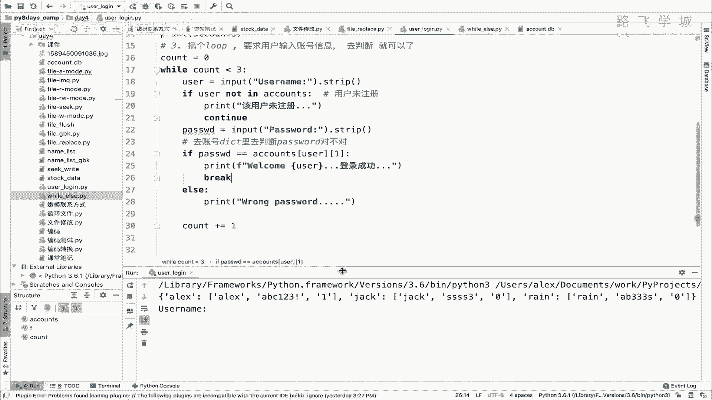
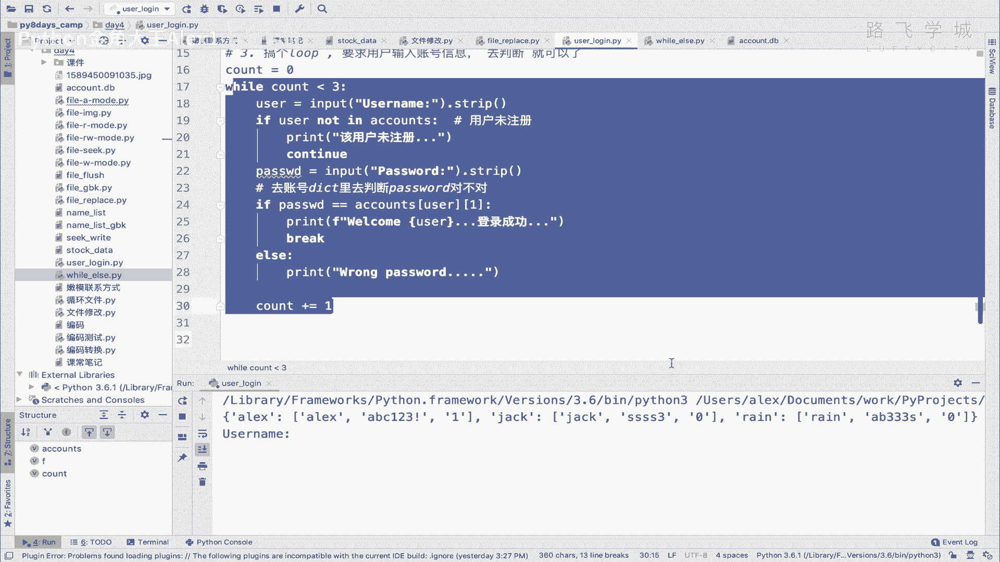
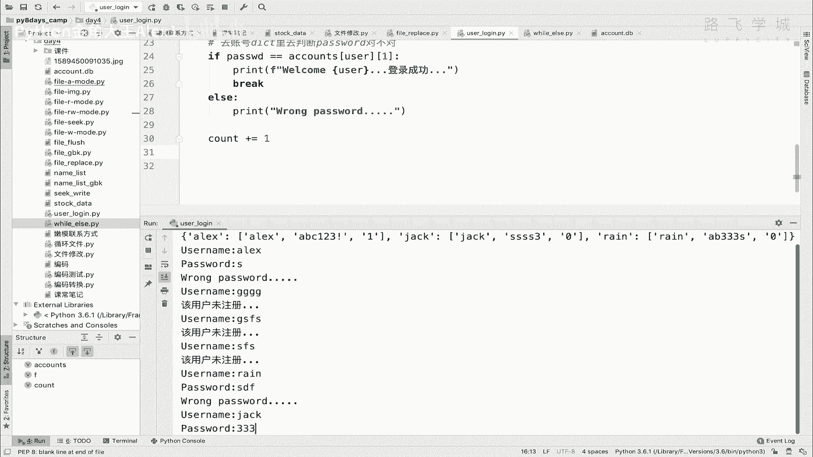
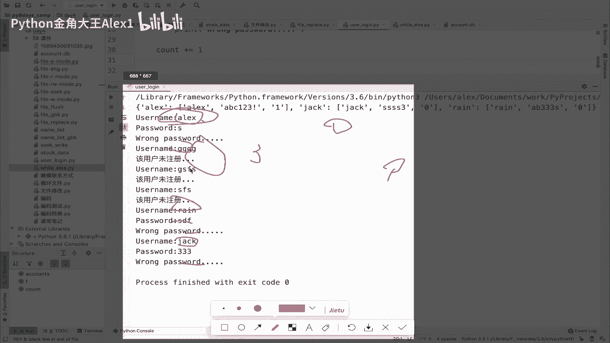
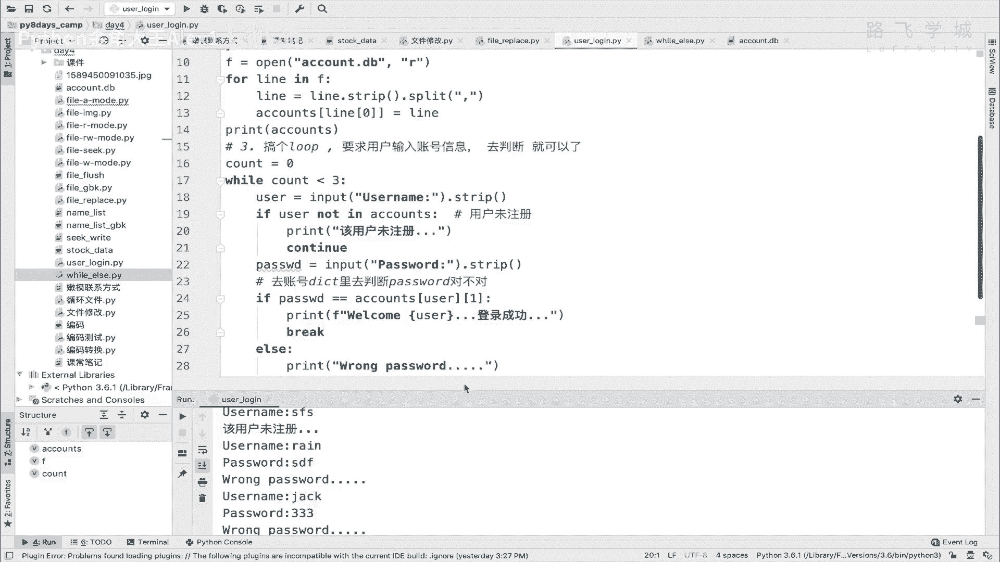
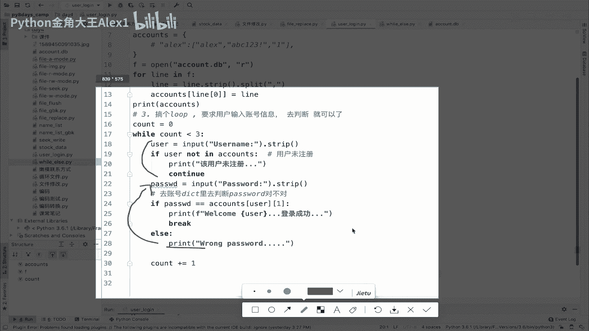
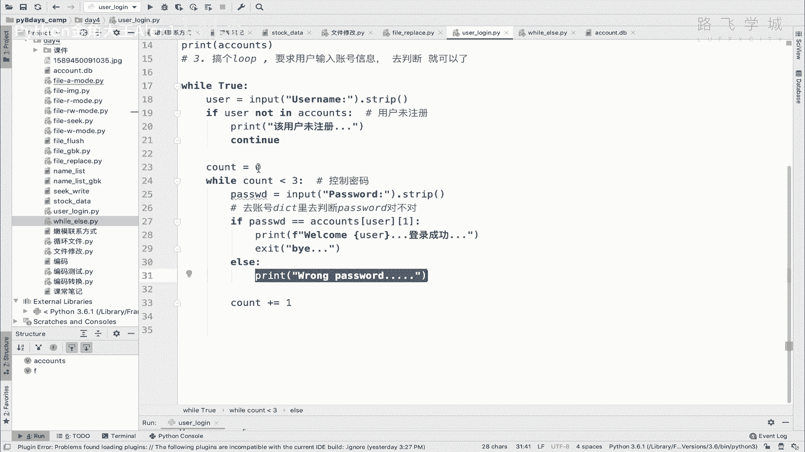
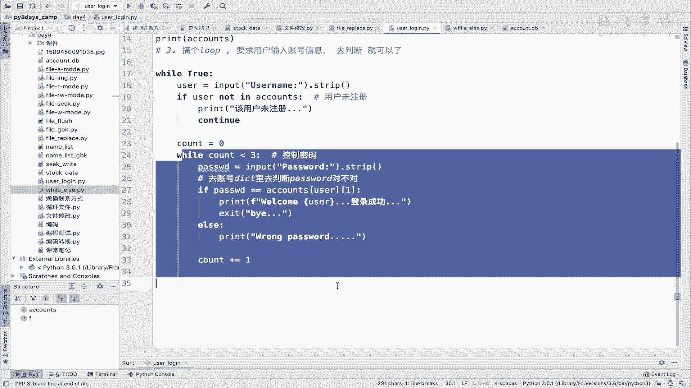
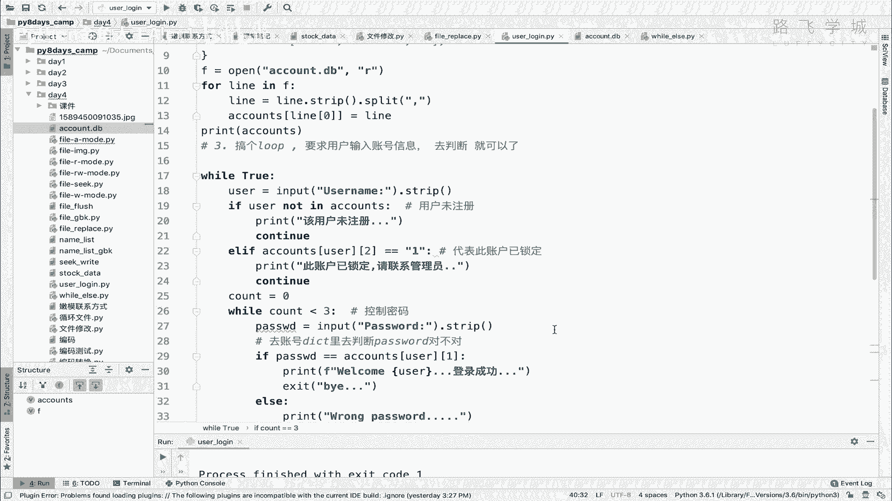

# 【2024年Python】8小时学会Excel数据分析、挖掘、清洗、可视化从入门到项目实战（完整版）学会可做项目 - P54：13 用户登录认证程序2 - Python金角大王Alex1 - BV1gE421V7HF

OK同学们接下来继续写代码啊，也就是说咱们接下来要锁定用户了。

但是在锁定用户之前呢，我觉得咱们要解决一个上节课的，我认为是一个我觉得算是个小bug啊，就是有点别扭啊，就是咱们输入一个用户名对吧，输入密码，然后不对不对，接下来他又让我重新输入用户名。

我又输了一个别的用户名对吧，他就说我未注册，我就卡在这了，我再输入一个论对吧，我再输入一个这个rain是set的，我再输入一个jack是吧，然后呢。

哎你看这次才退出，这导致的一个什么问题呢，你看我人他其实应该要做到的，是说你输入ALEX之后，然后输错三次密码对吧，才会退出，但是我第二次我换了一个用户名，我换了一个咯咯咯，他说未注册。

后来又换了一个论，哎这个rain是存在的，但密码不对，但是也就是又一说了一个jack密码不对，这就导致一个问题，就是说你看你其实是输入ALEX，然后输入三次错误密码，但是后面的接下来我输入rain。

然后这个就跟ALEX没关了，相当于这就出现，这确实是个bug，你看啊，相当于我我就随意可以锁别人了对吧，就像你在银行里，对不对，你输入第一次输入你自己的卡号，输错密码了，接下来输入一个别人的卡号。

然后又输密码，结果把别人的给锁了，是不是把别人密码给账户给锁了，这个很扯，是不是啊，所以呢你应该让他做的是输入一次ALEX，接下来就让他输三次密码啊，不不用让他再输用户名了，输三次密码不对，就给他锁。

Alex，不要说别的能理解意思吗。

哎咱们改一下这个地方，那怎么去改呢，这里你看啊，你看一下你这个代码逻辑。

只要你啊看一下啊，只要你这个密码不对对吧，只要这里密码不对，它就会再回到这个地方，回到这个循环，对不对，但是你不想让他啊，你不想让他这个什么呀，这个这个这个再去输入，相当于这一段的东西对吧。

这一段东西你不想让它再输入了，但这个循环它肯定会到这，所以你的解决办法是说，你要不然把这一段移到外面去，移到循环外面去，只让他输入一次对吧，但你只要输入一次的话，他有可能的说。

第一次输入的用户未注册程序就退出了是吧，所以就是说你你还是要允许它输入多次，因为避免这个用户未注册的问题吧对吧，但是呢到了这你又不想输入错了密码了之后，你又不想让他回到这。

你想让它可能在这个地方重新输入对吧，那可怎么办，那怎么办啊。

哎两层嵌套就出来了，这个时候你只能通过两个两层循环来解决，那你就到这在这里再来一层循环啊，while先拿一个true吧，While true，先给他移下来啊，看到没有，先给它移下来，这个时候注意了。

你相当于有两层循环，第一层循环是控制输入用户名的，第二次循环是输入密码的，所以你在这个地方就是怎么讲啊，这个这个这个如果你这个用户名啊，只要是输错了啊，Sorry，你这个密码只要输错三次。

你在这里就直接给它锁掉了啊，用户名输一次就可以了，明白这意思吗，所以呢我觉得你相当于你的，你其实应该限制的是密码输入的次数，而不是用户名，用户名输多少次都可以是吧，这个用户名被锁了。

我还可以接下来继续出其他类红名，所以呢你在锁你，你这个外面这个循环其实可以改成8月出，明白意思吗，把外面循环听孔明，不用限制出多少次，哎这个是while true。

然后在这个里面其实可以给它改成一个什么，啊啊，While count，能理解意思吧，While count，所以你可以把这个count放在这个里面，放在这里啊，放在这里。

然后呢VACCOUNT小于一个三对吧，然后把这个count也写到里面吧，所以这个里面是为了控制啊，控制密码的啊好吧，通知密码输入的次数，那呃接下来接下来咱们看看，先看看这个小bug有没有解决。

有没有有没有解决好吧呃哎对了，如果你这里登啊，我这里没有，不可忽略掉，我这个自己调试的时候加了，不要管这个，所以我们的代码看一下啊，呃输入对，输入用户名，然后接下来输密码，然后拿着密码去判断对了。

登录成功，登录成功，我们就退出系统对吧，咱们就退出就行了啊，这这这啊啊然后如果这个呃登录，如果是密码错了，密码错了之后，我就回到这个循环对吧，回到这个循环，然后呢继续让他输入密码对吧。

那再错一次技术密码，再错一次计数码，如果三次密码都错，三次密码都错，是不是代表需要把这个人给他锁定了对吧，所以到那时候我只需要这个判断。

count如果等于三，我是不是就锁账户就可以了对吧，因为循环一结束。

count是不是就等于三了，应该对不对，加加10+1加二，再加一就三吗，那执行一下，然后呢我们来输入ALEX对吧，我输入密码，你看是不是只让我输密码了，没错吧，就不再让我输啊，我对我输错三次密码之后。

它就跳出来了是吧，输错三次密码就跳出来，其实是这个时候应该把它锁了，是不是把它锁了，那呃我输对输对ALEX，然后密码是ABC123叹号是吧，诶就退出了，没问题吧，所以登录成功，这个啊这个这个过程没问题。

就接下来就是输错了，锁定了对吧，Alex，然后一次两次三次，第三次的时候对吧，三次完事之后应该锁它，所以呢循环这个循环跳出之后，你应该先干一个事儿，先去干一个事，什么事啊，判断这个count。

如果count等于一个三，是不是啊，哎print要锁定啊，要说就是出错，那这个几次密码对不对啊，这里面，密码对不对，需要锁定啊，账号账号谁呢，就是你说的这个username是不是输入的这个用户名。

是不是啊，哎那我们要打印一下这个东西，大家看是不是输错了三次密码，然后要锁定ALEX，那接下来就来干sorry，就来干锁定的事就行了，那锁定的话在这里锁定，锁定的话需要怎么办，锁定的话需要啊几步。

第一步你是不是要改这个状态呀，把这个状态给他改成它本来是零的话，给它改成一，是不是改成一之后再存到，相当于先，先改在内存中DET啊，这个啊嗯账号信息的什么呀，这个用户状态对不对，改完之后，接下来干嘛。

第二步存入啊，并且按原格式存入硬盘，是不是啊，因为你原格式是sorry，原格式是这个样子的，你现在是不是要把这个列表再给它，拼接成字符串再存回去，是不是啊。

把DICTT里的数据按原格式account点dB啊，这个文件里的数据，转成转成原文件，这个数据格式啊，好并且这个存回，文件是不是存混账户文件就可以了对吧，那我们先要干一件事，先去改，直接找到啊。

accounts下的这个user是不是就是user，然后呢改这第几个值呢，改这个012这个二这个值是不是改二，这个值直接把它改成什么呢，一注意了，这是数字形式的一，你直接给它改成加上一个字符串啊。

直接因为存到硬盘上的都是字符串，都是要字符串，你直接存数数字是不行的啊，你给他转成字符串，存数字是报错了，你自己试一下就行了，那这个时候改完之后，我们接下来要干嘛呀，再打开是不是再打开这个文件给他这个。

这之前打开是只读，是不是啊，我们要打开这个文件给他全存进去，或者你用R加也行是吧，R加你就把文件清空，再什么，我们这样吧，重新打开吧，好吧呃，这是F，然后我们在这里F2F2等于一个open这个什么。

嗯稍等啊，WW的格式好吗，然后我们就报这个呃for k for user啊，然后这个vl in这个什么呀，accounts点items是吧，还记得这个循环吗，然后这个是不是就是账户行。

VL是不是就拿着这个值啊对吧，我们给它拼起来，是不是就是line等于一个啊，这个点JN这个什么呀，VL是不是拼，把列表再转成啊，转成字符对吧，后面这样吧，再给人家加个什么呀，加个换行。

是不是还有一个加一个换行的对吧，加个换行符S1，对不对，忘了这事了，加个方行符，这样啊你就拼接完了，拼完之后你就直接F2点VT，是不是写了两层open sorry，直接把你这个line写进去。

是不是就可以了，写进去就可以了，这个时候最后关闭掉啊，F2点close哦，Sorry，在循环完了之后给他close掉，那你这个账户是不是就锁了呢，同志们啊，咱们来试一下，好不好试一下啊，重新来一遍。

执行ALEX密码，一次错两次错三次错是吧，账户需要锁定，是不是他到底锁还是没锁呢，咱也不知道啊，因为本来就是一的，对不对，我们这样我们给它改成零好吧，改成零再重新来一遍好吧，重新来一遍啊，注意了。

此时我这个里面可是啊零了，再确认一下，可是零了，对不对，我执行ALEX次，然后一次两次三次哎，没有变吗，打开你哪一点看到没有，是不是已经改成一了，没错吧，哎已经改成一了，Very good。

那这个就锁定了，好，我们锁定完了之后，他现在啊，他现在这个地方就是说啊，又让我重新输入新的用户名了啊，就是呃当然也可以对吧，你不你不退出程序，然后你你让他继续出就行了，但是咱们不搞那么复杂。

咱们现在就直接让他只要输错三次啊，就直接这个程序就退出了，明白吗，程序就退出了，所以呢在这个时候，我们就直接不要再去继续循环了，因为对吧，你判断完了之后，他又走到上一次这个上个循环了嘛对吧。

第一种情况你就直接在这里退出就行了，对吧对吧，by啊，已经给你lock住了啊，lock住了，那他们执行一下这个没问题啊，这个问题二三是不是已经拜拜了拜拜了，然后呢接下来再看什么事呢，再看哦对了。

你刚登录的时候是不是，这就是下一次再登录的时候，你是不是要检测这个用户有没有被锁定了对吧，所以呢你其实要干嘛呀，但就是就是啊你要检测这个账号有没有被锁定，如果被锁定了，你当然让他连密码都不需要输了。

是不是账户已锁啊，不用尝试了是吧，所以呢我们除了检测用户是不是注册之外，还要再检测是吧，加一个LF对吧，如果你看账用户在里面，我再判断一样，判断一个什么东西呢，判断这个就是拿到他的。

这个叫叫叫叫叫用户登录的状态对吧，用户的状态就是也就是这个第三个值是吧，第第第第三个值是吧，那我们就直接去取了，直接去取了，就是呃accounts下的，先拿到user是不是啊，然后拿到这个呃第几个字。

第三个值，然后要注意了，它是一个字符串的格式，现在你就可以相等的话，LF等于一个一对吧，是一个字符串就行了，如果是字符串，如果是如果是一，代表这个账户已经锁定了是吧，代表此账号啊已锁定对吧。

那你就不要再让他去什么了，你直接直接就是print啊，这个此账户已锁定，对吧啊，请尝试啊，请联系管理员，sorry啊，请联系管理员对吧，那这个时候他只要输这个就没法用了对吧，那他可以尝试再出别的。

OK那我们重新执行下来，看一下relax or register relics，你看我怎么说也不管用了，诶好sorry，Sorry，我说一下那个让我让我联系管理员，他妈的哦对了，我忘了进行一个操作。

哎让他忘了进行，让他再继续continue了对吧，那他就让我输密码了啊，密码了，来重新来一遍，ALEX是不是已锁定我出多少次，不好意思，没不好弄啊对吧，但是我输jack就可以放行，看到没有啊。

这个密码是多少啊啊sorry哎呀，继续让我输密码是吧，再输一次，要不然被锁了啊，再输错一次吧，你看jack也被锁了，妈的只剩下一个塌了，是不是只剩一个他了，咱们最后一个独苗啊，输ALEX不行。

输deck不行，对不对，输润吧放行，然后说他欧耶是不是成功了，好到此为止，同志们，咱们就完美的实现了这个什么呀，完美的实现了这个这个这个用户锁定的程序，是不是啊，你看到现在为止啊，写了差不多四五十行。

接近50行啊，四四十多行的一个代码，哎这个你明白这个整个solo了吗对吧，整个solo的第一步干嘛，第二步干嘛，第三步干嘛，对不对，然后怎么去锁定锁定的逻辑是吧，我都给大家列出来了。

同志们理解了这个思路之后，你看完一遍，你不要抄，然后你明白我的思路，你尝试自己把它写出来，一定要尝试自己写出来，不要不要抄，抄的话不行，自己按照我的思路给他写出来了，那你相当于我我觉得文件操作这块。

包括加上前面的while这个流程控制，你就玩的非常溜了好吗，对自己花了一个小时尝试能把它做出来吗。

